# Title: Delta Lake Operations — Full DML & Time Travel

---

## 🌟 Overview: What is the purpose of this Lab?

Welcome to your Delta Lake deep-dive lab! Delta Lake is the storage layer that brings ACID transactions, scalable metadata handling, and data versioning to your data lake on S3. Before you can build reliable pipelines, you need hands-on fluency with the full DML surface and the Time Travel features that make Delta tables production-worthy.

**The Purpose of this Lab:**
You are part of a data engineering team managing a data lake where data frequently changes due to late arrivals and corrections. Your task is to perform **UPSERT operations using MERGE** on Delta tables to handle incremental updates, use **Time Travel** to restore accidentally deleted or corrupted data, and manage storage costs by running **VACUUM** and **OPTIMIZE**. This ensures your data lake supports ACID transactions and reliable data recovery.

By the end of this project, you will have:

- Set up a **Databricks account on AWS** and captured your Account ID.
- Created an **S3 bucket** and uploaded seed data files.
- Configured **IAM policies and roles** to grant Databricks cluster access to S3.
- Created an **all-purpose cluster** with the correct runtime and Spark credentials config.
- Created a **managed Delta table** and loaded 10 rows of customer seed data.
- Performed the full DML surface — **INSERT, UPDATE, DELETE**, and **MERGE (upsert)** — and verified results.
- Inspected the **transaction log** (`_delta_log`) directly on S3 to understand what Delta actually writes.
- Used **DESCRIBE HISTORY** to audit every operation on the table.
- Queried **historical table versions** using `VERSION AS OF` and `TIMESTAMP AS OF` syntax.
- **Restored** a table to a prior version after a simulated accidental delete.
- Tested **schema enforcement** by deliberately sending a mismatched schema and observing the error.
- Enabled **schema evolution** (`mergeSchema`) and verified that a new column is accepted.
- Run **OPTIMIZE with Z-ORDER** and **VACUUM** to compact small files and control storage retention.

### Learning Path:

1. **AWS & Databricks Setup:** Log in to AWS Console, create or sign in to your Databricks account, and capture Account ID.
2. **S3 & IAM Setup:** Create the S3 bucket, upload CSVs, create IAM policy and role for cluster S3 access.
3. **Cluster Setup:** Create an all-purpose cluster with the correct runtime, Spark config, and AWS credentials.
4. **Workspace Setup:** Create the `delta_lab` folder and import all 5 notebooks.
5. **Full DML Operations:** Run INSERT, UPDATE, DELETE, and MERGE. Read the transaction log.
6. **History & Time Travel:** Use DESCRIBE HISTORY, query old versions, and restore a deleted table.
7. **Schema Management:** Trigger a schema enforcement error, then enable evolution.
8. **Optimization & Housekeeping:** Run OPTIMIZE, Z-ORDER, and VACUUM.

---

## Difficulty Level

Proficient

---

## 📊 Dataset / Knowledge Source Used

The following files are provided in the `~/Desktop/Project/` folder on your lab desktop.

**Local File Structure:**

```text
~/Desktop/Project/
└── delta_lab/
    ├── 01_setup_and_ingest.py
    ├── 02_dml_operations.py
    ├── 03_time_travel.py
    ├── 04_schema_management.py
    ├── 05_optimize_vacuum.py
    └── README.md
├── customers_seed.csv
├── customers_updates.csv
```

| File | Destination | Description |
|---|---|---|
| `customers_seed.csv` | `s3://<your-bucket>/raw/customers_seed.csv` | 10-row customer seed dataset (`customer_id, name, city, account_balance, status`) |
| `customers_updates.csv` | `s3://<your-bucket>/raw/customers_updates.csv` | 6-row update file for MERGE — 4 updates + 2 new rows |
| `01_setup_and_ingest.py` | Databricks Workspace → `delta_lab/01_setup_and_ingest` | Creates the lab database, managed Delta table, and ingests seed data |
| `02_dml_operations.py` | Databricks Workspace → `delta_lab/02_dml_operations` | Runs INSERT, UPDATE, DELETE, MERGE, and reads the `_delta_log` |
| `03_time_travel.py` | Databricks Workspace → `delta_lab/03_time_travel` | Queries historical versions and restores a deleted table |
| `04_schema_management.py` | Databricks Workspace → `delta_lab/04_schema_management` | Tests schema enforcement and enables schema evolution |
| `05_optimize_vacuum.py` | Databricks Workspace → `delta_lab/05_optimize_vacuum` | Runs OPTIMIZE, Z-ORDER, and VACUUM |

---

## 🛠️ Prerequisites & AWS Setup

Ensure the following are available before starting:

- An **AWS account** with permissions for S3 and IAM (lab credentials provided).
- A **Databricks account on AWS** (Premium tier — 14-day trial is sufficient).
- Local project files at `~/Desktop/Project/`.
- All AWS resources must be in **US-EAST-1 (N. Virginia)**.

---

## Configure AWS Credentials

- Click the `Lab Access` icon on the desktop.


- Click `Access Lab` and log in to the AWS Console using the given credentials.


- Confirm the region is **US-EAST-1 (N. Virginia)** using the region selector at the top right.


---

## Set Up (or Sign In to) Your Databricks Account

**Purpose of this Activity:** To make sure you have an active Databricks-on-AWS account before any infrastructure work begins. If you already have an account, you'll log in and capture your Databricks Account ID. If not, you'll complete the Express Setup that creates a trial workspace and links it to AWS.

### Step 1: Do You Already Have a Databricks Account?

Before you continue, answer this question:

- **YES — I already have a Databricks account on AWS.** ➡️ Skip directly to **Step 6: Log In and Capture Your Databricks Account ID**.
- **NO — I need to create a new Databricks account.** ➡️ Continue with **Step 2** below.

### Step 2: Access the Databricks Login Page

Open a new browser tab and navigate to [https://login.databricks.com/](https://login.databricks.com/). Click the **Continue with Google** button (or use the email option you prefer).


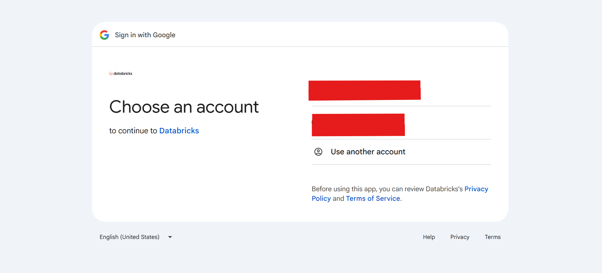

### Step 3: Authenticate and Choose a Trial Type

1. Choose the Google/email account you wish to use for your Databricks environment.
2. On the **"What will you use Databricks for?"** screen, select **For work** (this enables the 14-day free trial and AWS integration).
3. Click **Start trial with express setup**.


### Step 4: Configure Account Details and Verify

1. Enter your desired **account name** (e.g., `dbx-lab-account`).
2. Select your **country / region** and click **Continue**.

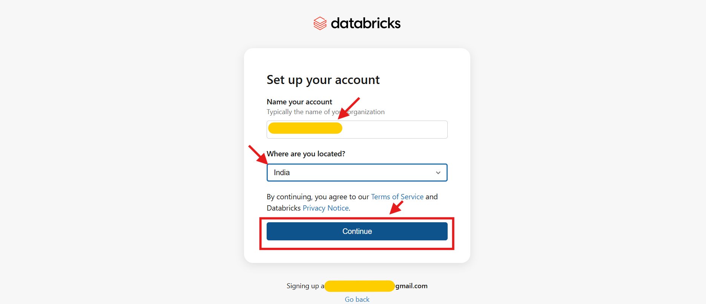

3. Complete the **security / captcha challenge** and click **Submit**.


4. On **"Tell us about yourself"**, pick **Learn data and AI** and choose up to 3 topics of interest, then click **Continue**.


5. Wait while Databricks initializes your account — you will see a **"Setting up your account…"** progress screen. This typically takes 1–2 minutes.


### Step 5: Express Setup — Link Databricks to AWS

Express Setup automatically provisions a starter workspace and connects it to your AWS account. **For this lab we will NOT use this auto-created workspace** for our actual work — we will build a proper workspace with a custom S3 bucket and cluster. However, completing Express Setup is required to fully activate your Databricks account.

#### Step 5.1: Open the Account Console

Once your account finishes initializing, you will land in the workspace UI. Click your **workspace name** in the top-right corner, then click **Manage account**.


#### Step 5.2: Create an Express Workspace

1. In the account console, click **Workspaces** in the left navigation panel, then click **Create workspace**.

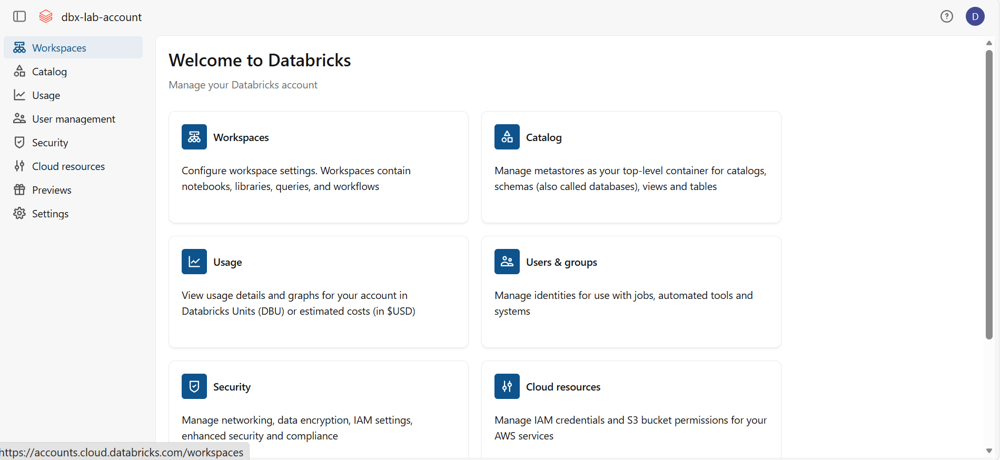


2. Fill out the workspace creation form:
   - **Workspace name:** `dbx-express-temp`
   - **Region:** `N. Virginia (us-east-1)`
   - **Storage and compute:** Select **Use your existing cloud account**
3. Click **Continue**.


#### Step 5.3: Configure Cloud Credentials and Storage

1. Under **Compute credentials**, click the dropdown and select **Add cloud credentials**.


2. In the **Add cloud credentials** pop-up window, select **Add automatically** and click **OK**. Ensure **Workspace storage** is also set to **Add automatically**.

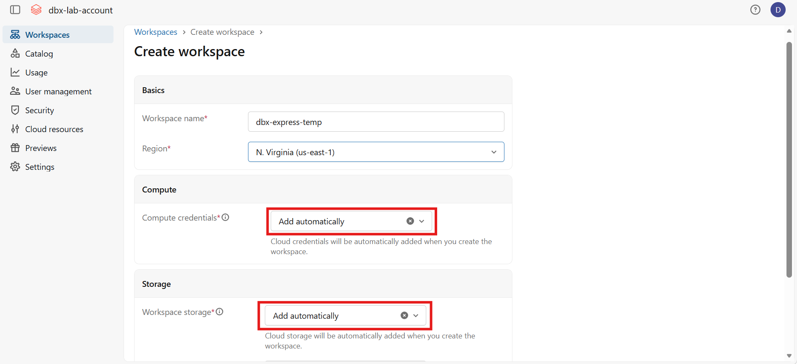

3. Once both fields are configured, click the **Log in to AWS and create workspace** button at the bottom of the screen.


#### Step 5.4: Authorize in AWS and Initiate Workspace Creation

1. A pop-up modal will appear listing the AWS resources Databricks will create. Review the list and click **Initiate workspace creation**.


2. You will be redirected to the AWS sign-in page. Sign in with your lab credentials and click **Allow access** to let Databricks provision the resources.


#### Step 5.5: Wait for Running Status

Return to the Databricks account console and wait until the workspace status flips to **Running** (typically 3–5 minutes).

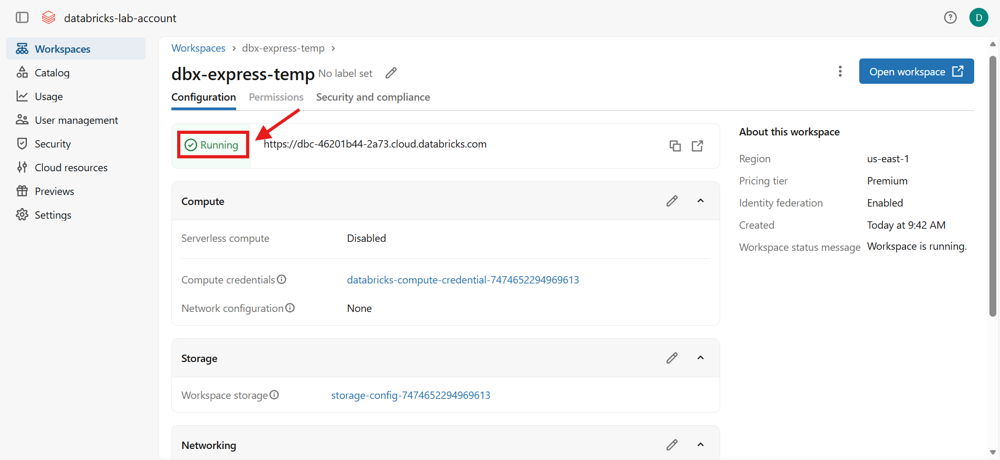

> **Important:** Once Express Setup completes, your Databricks account is fully active. You can ignore the `dbx-express-temp` workspace — the lab activities below use a cluster and S3 bucket you will set up directly.

### Step 6: Log In and Capture Your Databricks Account ID

This step applies to **both** new accounts (after completing Steps 2–5) **and** existing accounts (if you skipped here from Step 1).

1. Open the **Databricks account console** at [https://accounts.cloud.databricks.com/](https://accounts.cloud.databricks.com/) and sign in.
2. Click the **user icon** in the top-right corner → **Account**.
3. **Copy** the **Account ID** — a UUID that looks like `e2-xxxxxxxx-xxxx-xxxx-xxxx-xxxxxxxxxxxx` — into a text note. You will reference it throughout this lab.


> 📌 **Account Console vs Workspace UI:** The **account console** (`accounts.cloud.databricks.com`) is where you manage workspaces and billing. The **workspace UI** (e.g., `<workspace-id>.cloud.databricks.com`) is where you write notebooks and run jobs. Make sure you are on the account console for this step.

> 💡 **Why the Account ID matters:** The Account ID is the external ID embedded in cross-account IAM trust policies. It ties the trust relationship to *your* Databricks account specifically — without it, any Databricks customer could potentially assume your IAM role.


---

# Activity 1: S3 Bucket, IAM Setup & Cluster Creation

**Purpose:** Create the S3 bucket for lab data, configure IAM permissions so the cluster can access S3, and create the all-purpose cluster with the correct settings.

### Step 1.1: Create the S3 Bucket and Upload Seed Data

1. In the AWS Console, search for **S3** and click **Create bucket**.
2. Set **Bucket name** to `delta-lab-<your-aws-account-id>` (e.g., `delta-lab-784266215529`).

   > 💡 Find your AWS Account ID in the top-right corner of the AWS Console next to your account name.

3. Keep region as **us-east-1**. Ensure **Block all public access** is checked. Click **Create bucket**.

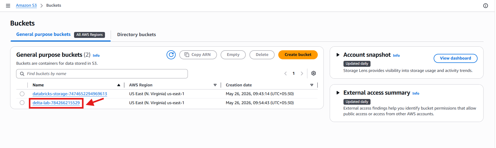

4. Open the bucket → click **Create folder** → name it `raw` → click **Create folder**.
5. Open the `raw/` folder → click **Upload** → add both files:
   - `~/Desktop/Project/customers_seed.csv`
   - `~/Desktop/Project/customers_updates.csv`
6. Click **Upload**. Both files should appear at `s3://delta-lab-<account-id>/raw/`.

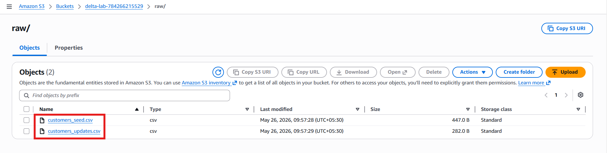

### Step 1.2: Create IAM Policy for S3 Access

The cluster needs an IAM policy that grants it read/write access to your S3 bucket.

1. In the AWS Console, search for **IAM** and open it.
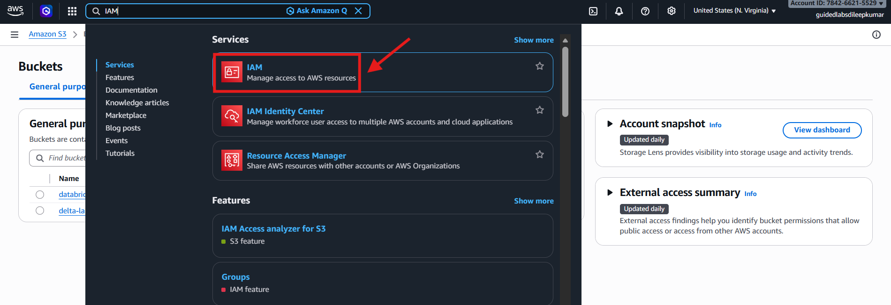
2. Click **Policies** in the left sidebar → click **Create policy**.
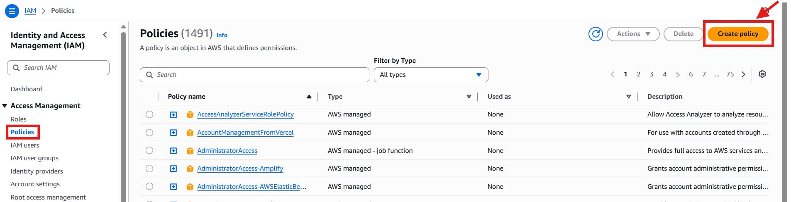
3. Click the **JSON** tab and paste the following (replace `<your-account-id>` with your actual account ID):

```json
{
  "Version": "2012-10-17",
  "Statement": [
    {
      "Effect": "Allow",
      "Action": [
        "s3:GetObject",
        "s3:PutObject",
        "s3:DeleteObject",
        "s3:ListBucket"
      ],
      "Resource": [
        "arn:aws:s3:::delta-lab-<your-account-id>",
        "arn:aws:s3:::delta-lab-<your-account-id>/*"
      ]
    }
  ]
}
```
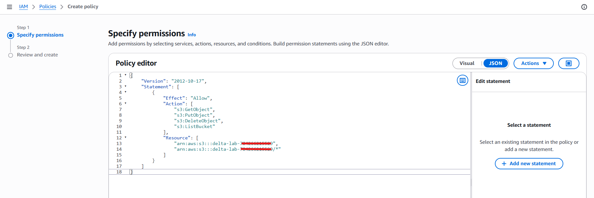
4. Click **Next**.
5. Set **Policy name** to `delta-lab-s3-policy`.
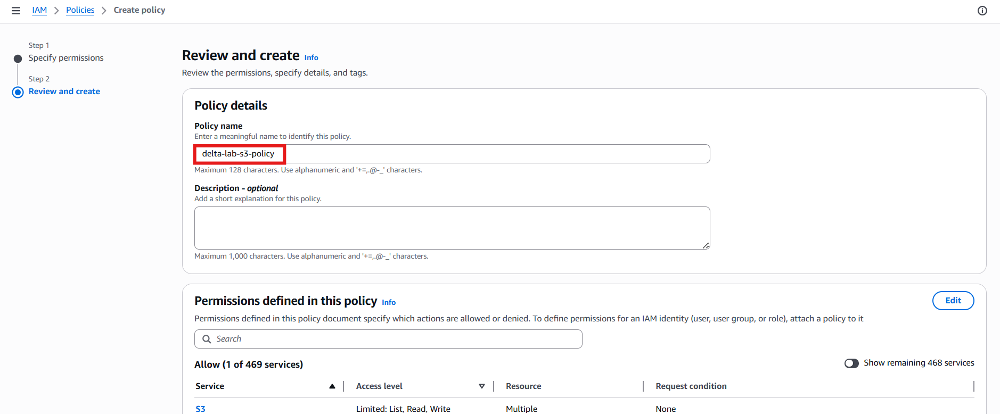
6. Click **Create policy**.


### Step 1.3: Create IAM Role (Instance Profile)

1. In IAM, click **Roles** in the left sidebar → click **Create role**.
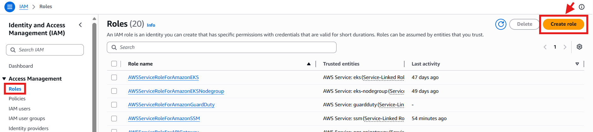
2. Select **Trusted entity type** → **AWS service**.
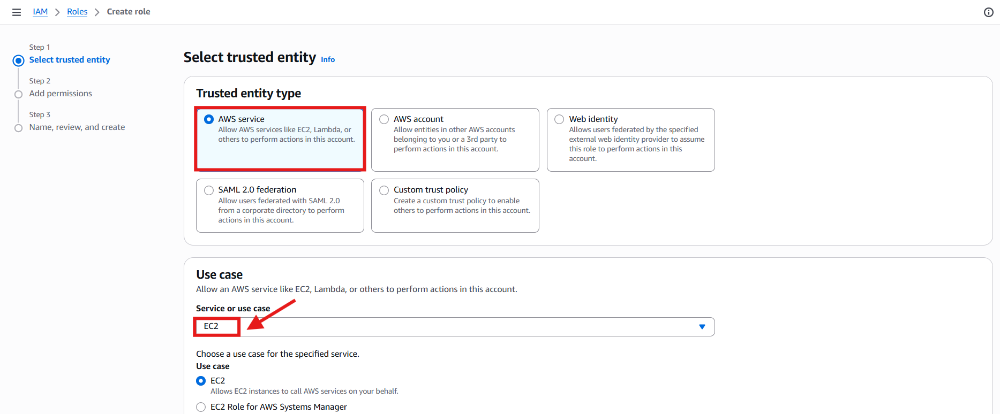
3. Under **Use case**, select **EC2** → click **Next**.
4. In the permissions search box, type `delta-lab-s3-policy`.
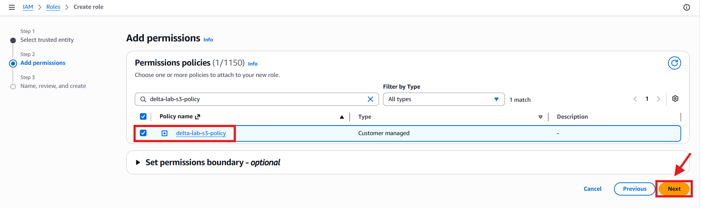
5. Check the checkbox next to it → click **Next**.
6. Set **Role name** to `delta-lab-instance-profile`.
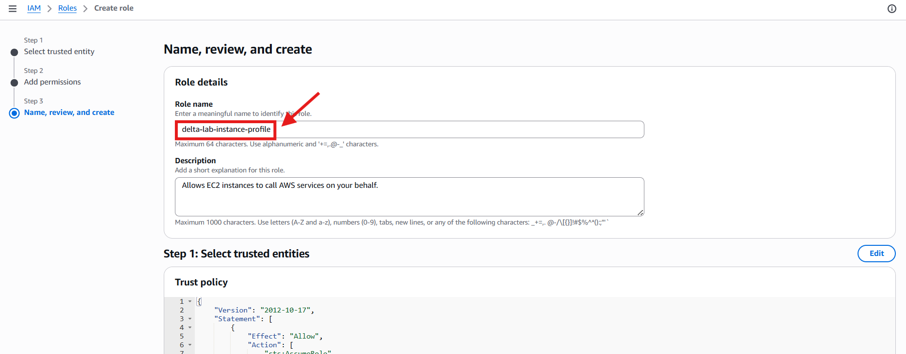
7. Click **Create role**.

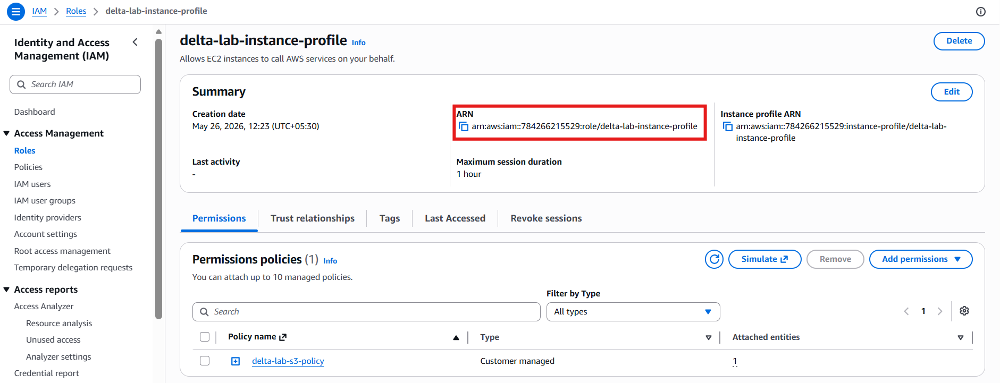

> 📌 **Instance Profile ARN** — after the role is created, note the **Instance profile ARN** shown on the role detail page:
> `arn:aws:iam::<account-id>:instance-profile/delta-lab-instance-profile`
> You will need this if registering the profile in the Databricks account console.

### Step 1.4: Add S3 Bucket Policy

To explicitly grant the IAM role access to the bucket:

1. In the AWS Console, go to **S3** → open your `delta-lab-<account-id>` bucket.
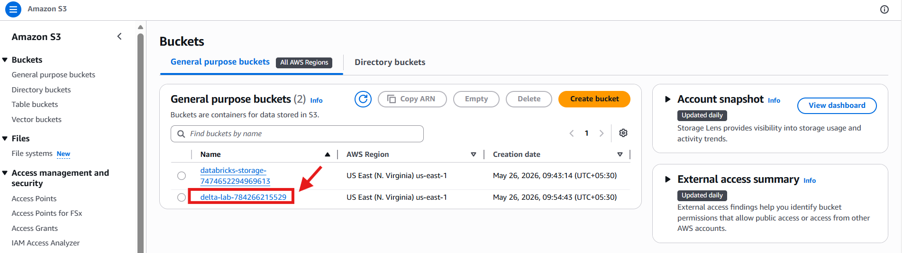
2. Click the **Permissions** tab → scroll to **Bucket policy** → click **Edit**.
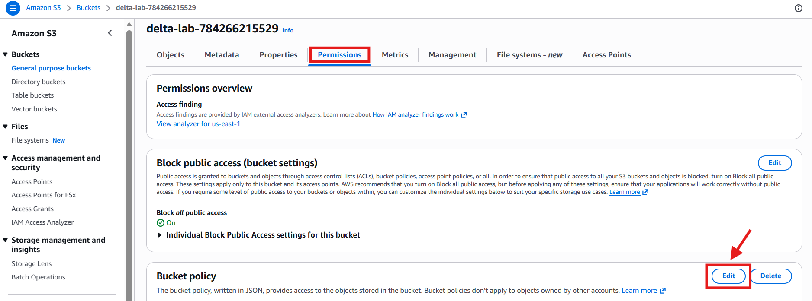
3. Paste the following (replace `<your-account-id>`):

```json
{
  "Version": "2012-10-17",
  "Statement": [
    {
      "Sid": "DatabricksAccess",
      "Effect": "Allow",
      "Principal": {
        "AWS": "arn:aws:iam::<your-account-id>:role/delta-lab-instance-profile"
      },
      "Action": [
        "s3:GetObject",
        "s3:PutObject",
        "s3:DeleteObject",
        "s3:ListBucket"
      ],
      "Resource": [
        "arn:aws:s3:::delta-lab-<your-account-id>",
        "arn:aws:s3:::delta-lab-<your-account-id>/*"
      ]
    }
  ]
}
```
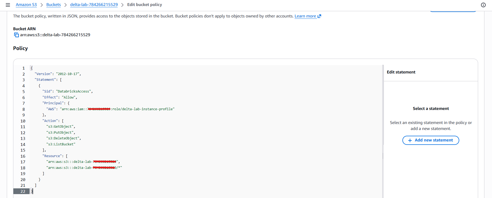

4. Click **Save changes**.


### Step 1.5: Create the All-Purpose Cluster

1. In your Databricks workspace, click **Compute** in the left sidebar.
2. Click **Create compute** (top right).
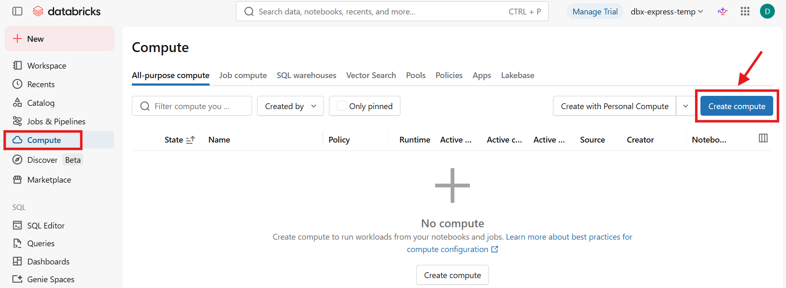
3. Configure the cluster:

   | Setting | Value |
   |---|---|
   | **Compute name** | `delta-lab-cluster` |
   | **Policy** | Unrestricted |
   | **Databricks runtime** | `13.3 LTS (Scala 2.12, Spark 3.4.1)` |
   | **Single node** | ✅ Check this checkbox |
   | **Terminate after** | `30` minutes of inactivity |

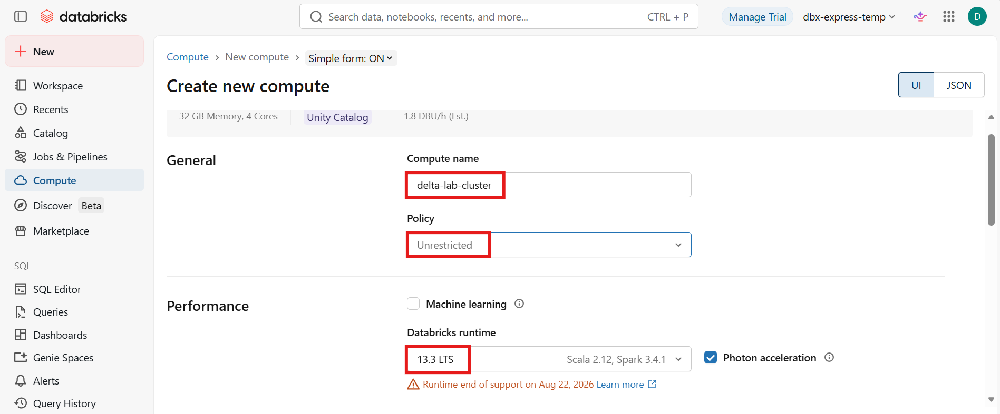
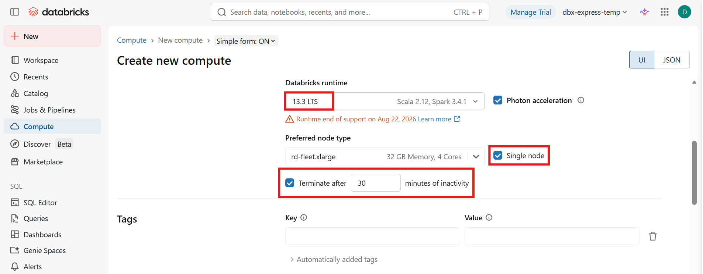

4. Scroll down to **Advanced options** → click the **Spark** tab.

###  Note -🔑 Getting Your AWS Credentials

Before configuring the Spark settings, you need to retrieve your AWS credentials 
from the Lab portal. Follow these steps:

1. Switch to the **Lab 20 - Delta Lake** browser tab 
   (https://labs.trainocate.com).

2. On the lab page, click the **credentials icon** (🔐) on the right-hand side 
   of the screen — it is the second blue icon on the right edge of the page.


3. A **Lab Credentials** panel will open on the right side, showing:
   - **Login URL** – the AWS Console sign-in link
   - **accessId** – your AWS Access Key ID
   - **accessKey** – your AWS Secret Access Key
   - **arn** – your AWS account number


4. Copy the **accessId** value — this is your `<YOUR-ACCESS-KEY-ID>`.

5. Copy the **accessKey** value — this is your `<YOUR-SECRET-ACCESS-KEY>`.

> 💡 **Tip:** Keep this panel open so you can refer back to the credentials 
> while filling in the Spark config and Environment variables in Databricks.

5. In the **Spark config** box, paste these 4 lines (replace with your actual AWS keys):

   ```
   spark.hadoop.fs.s3n.awsAccessKeyId <YOUR-ACCESS-KEY-ID>
   spark.hadoop.fs.s3n.awsSecretAccessKey <YOUR-SECRET-ACCESS-KEY>
   spark.hadoop.fs.s3.awsAccessKeyId <YOUR-ACCESS-KEY-ID>
   spark.hadoop.fs.s3.awsSecretAccessKey <YOUR-SECRET-ACCESS-KEY>
   ```

6. In the **Environment variables** box, add:

   ```
   AWS_ACCESS_KEY_ID=<YOUR-ACCESS-KEY-ID>
   AWS_SECRET_ACCESS_KEY=<YOUR-SECRET-ACCESS-KEY>
   ```

   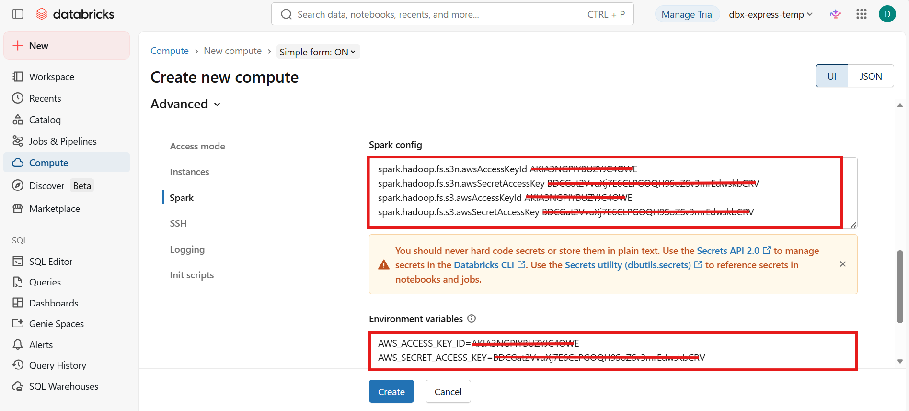

7. Click **Create** (or **Confirm and restart** if editing an existing cluster).
8. Wait for the cluster status to show a **green dot (Running)** — this takes 3–5 minutes.

   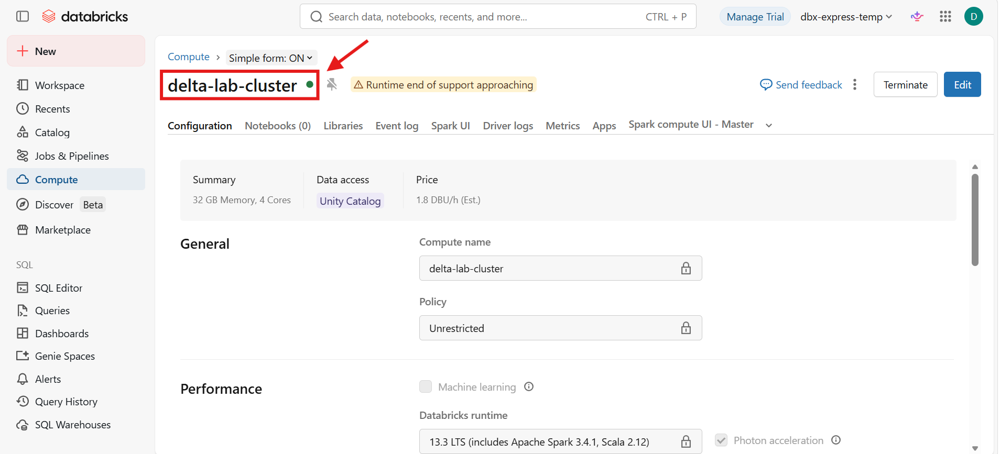

> ⚠️ **Note on Instance Profile:** This workspace uses Unity Catalog which manages data access through external locations rather than classic instance profiles. The Spark config approach above with direct AWS credentials is the correct method for this lab setup.

### Step 1.6: Create the `delta_lab` Workspace Folder

1. Click **Workspace** in the left sidebar.
2. Navigate to **Users** → your email folder.
3. Click **Create** (top right) → **Folder**.
4. Name it `delta_lab` → press **Enter**.

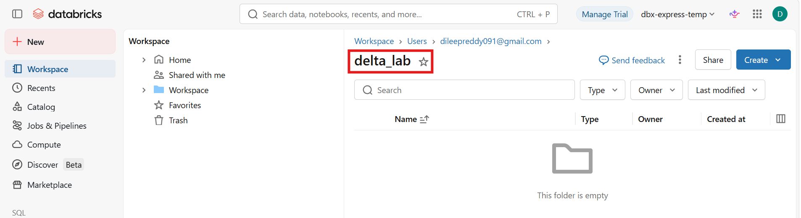

### Step 1.7: Import the Lab Notebooks

1. Open the `delta_lab` folder.
2. Click **⋮** next to the folder name → **Import**.
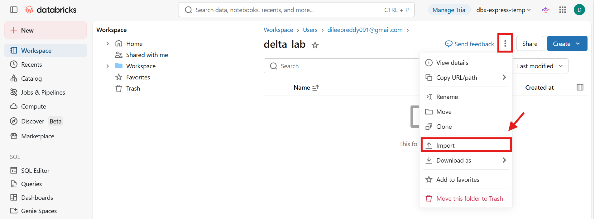
3. Select **File** as the source. Import each `.py` file from `~/Desktop/Project/delta_lab/`:
   - `01_setup_and_ingest.py`
   - `02_dml_operations.py`
   - `03_time_travel.py`
   - `04_schema_management.py`
   - `05_optimize_vacuum.py`
4. All 5 notebooks should appear in the `delta_lab` folder with a **"Successfully imported 5 files"** confirmation.
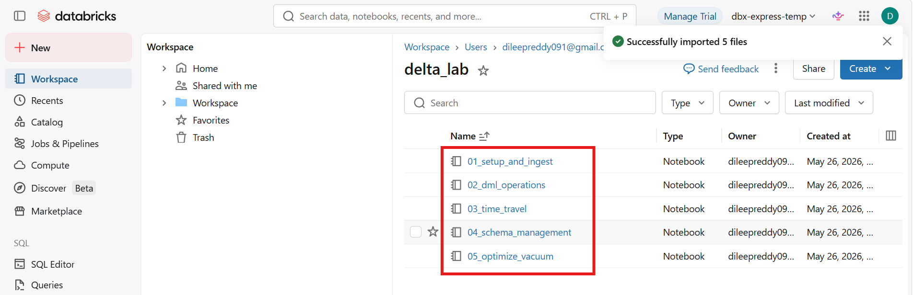


### Step 1.8: Run the Setup Notebook

1. Open `01_setup_and_ingest`.
2. Confirm `delta-lab-cluster` is attached in the top cluster dropdown.
3. In **Cell 2**, verify the `S3_BUCKET` value matches your bucket name:

   ```python
   S3_BUCKET = "delta-lab-<your-aws-account-id>"
   ```
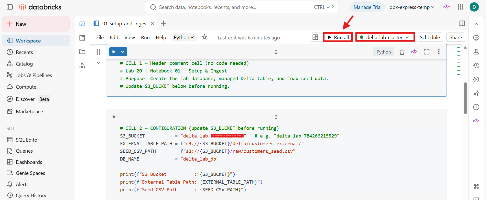

4. Click **Run all**.

**Expected Output:**

```
S3 Bucket          : delta-lab-<your-account-id>
External Table Path: s3://delta-lab-<your-account-id>/delta/customers_external/
Seed CSV Path      : s3://delta-lab-<your-account-id>/raw/customers_seed.csv

Database 'delta_lab_db' created.
Seed row count: 10
customers_managed loaded — row count: 10
=== customers_managed ===
[Table showing all 10 customers]
```

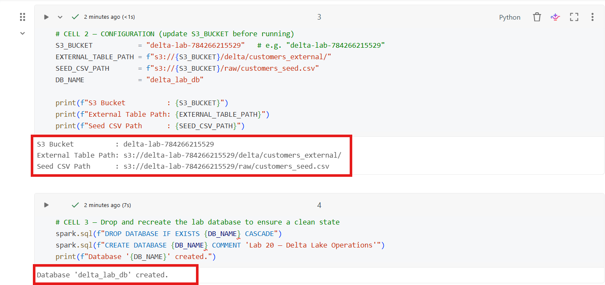
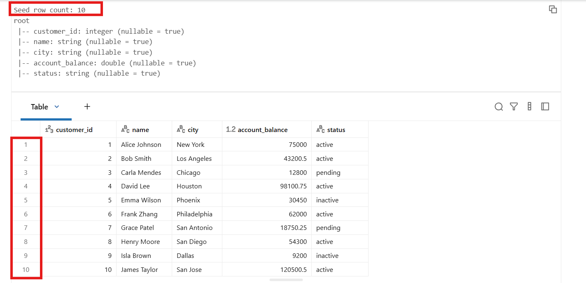
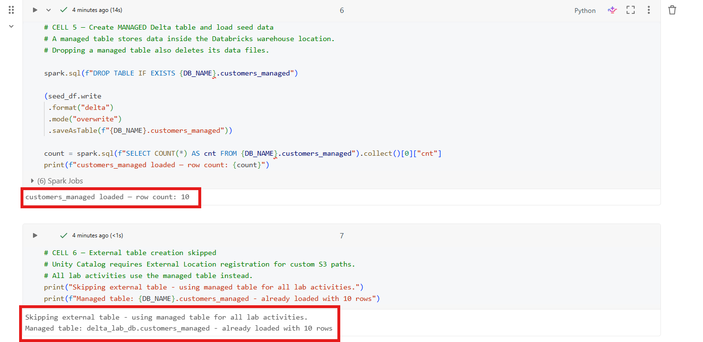
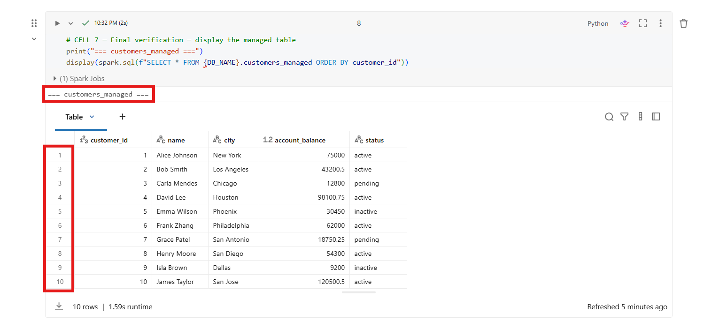

> 📌 **Note on External Tables:** This workspace uses Unity Catalog which requires **External Location** registration before writing Delta tables to custom S3 paths. For this lab, we use only the **managed Delta table** (`customers_managed`), which stores data in the Databricks-controlled warehouse location and requires no additional S3 configuration. All lab activities (DML, Time Travel, Schema Management, Optimize) are performed on this managed table.

---

# Activity 2: Full DML Operations & Inspecting the Transaction Log

**Purpose:** Execute the complete DML surface of Delta Lake — INSERT, UPDATE, DELETE, and MERGE — and then use `DESCRIBE HISTORY` to read the transaction log audit trail. All operations run on the **managed Delta table** (`delta_lab_db.customers_managed`).

> ⚠️ **Important — Run only once per fresh table state:** If you have run this notebook before, customer_ids 11 and 12 may already exist in the table. Before clicking **Run all**, add and run this cleanup cell first to ensure a clean 10-row starting state:
> ```python
> spark.sql(f"DELETE FROM {TABLE} WHERE customer_id >= 11")
> count = spark.sql(f"SELECT COUNT(*) AS cnt FROM {TABLE}").collect()[0]["cnt"]
> print(f"Row count after cleanup: {count}")  # Expected: 10
> ```

### Step 2.1: Open the DML Notebook

1. Click **Workspace** → `delta_lab` → open **`02_dml_operations`**.
2. Confirm **`delta-lab-cluster`** is attached in the cluster dropdown (not Serverless).

### Step 2.2: Run the Config Cell 

Verify the values and run it:

```python
import json

S3_BUCKET        = "delta-lab-<your-account-id>"   # e.g. "delta-lab-784266215529"
DB_NAME          = "delta_lab_db"
TABLE            = f"{DB_NAME}.customers_managed"
UPDATES_CSV_PATH = f"s3://{S3_BUCKET}/raw/customers_updates.csv"

print(f"Working table    : {TABLE}")
print(f"Updates CSV path : {UPDATES_CSV_PATH}")
```

**Expected output:**
```
Working table    : delta_lab_db.customers_managed
Updates CSV path : s3://delta-lab-<account-id>/raw/customers_updates.csv
```

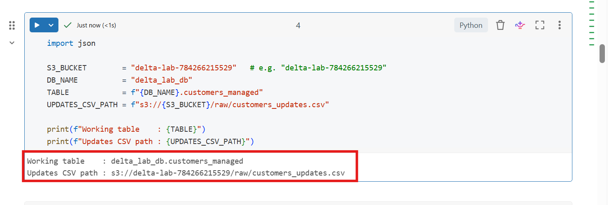

### Step 2.3: Run INSERT — Cell 1

Cell 1 inserts 2 new customer rows into the managed table:

```sql
INSERT INTO delta_lab_db.customers_managed
VALUES (11, 'Priya Nair',    'Bengaluru',  52000.00, 'active'),
       (12, 'Carlos Rivera', 'São Paulo',  31500.75, 'pending');
```

**Expected output:**
```
Row count after INSERT: 12
```

The display table shows only the 2 newly inserted rows — Priya Nair (customer_id=11, Bengaluru, active) and Carlos Rivera (customer_id=12, São Paulo, pending).

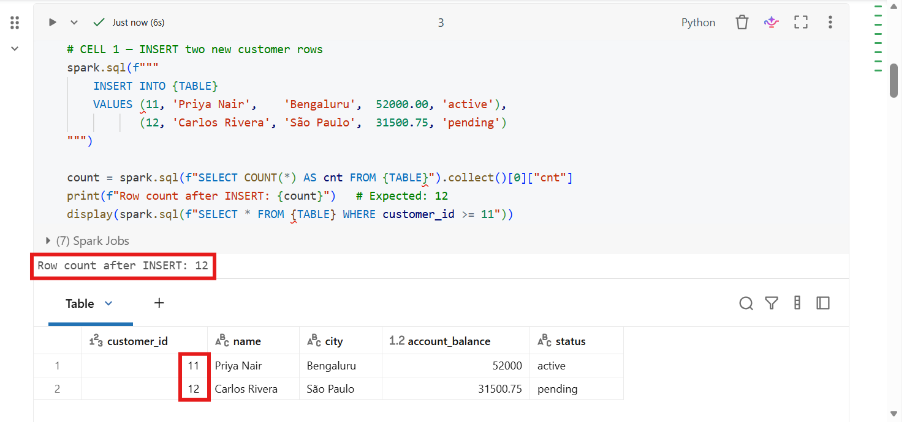

### Step 2.4: Run UPDATE — Cell 2

Cell 2 activates all `pending` customers and increases their balance by 10%:

```sql
UPDATE delta_lab_db.customers_managed
SET    account_balance = account_balance * 1.10,
       status          = 'active'
WHERE  status = 'pending';
```

**Expected output:** All 12 rows displayed. Rows that were `pending` are now `active` with balances updated:

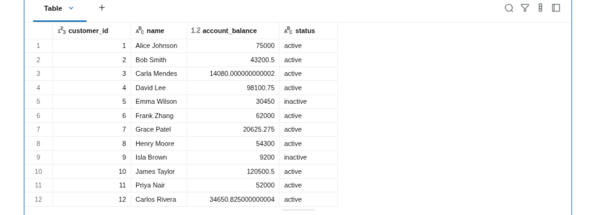

### Step 2.5: Run DELETE — Cell 3

Cell 3 deletes customer_id = 5 (Emma Wilson), simulating a GDPR erasure request:

```sql
DELETE FROM delta_lab_db.customers_managed
WHERE customer_id = 5;
```

**Expected output:**
```
Row count after DELETE: 11
```

Emma Wilson (customer_id = 5, Phoenix, inactive) is permanently removed from the table.

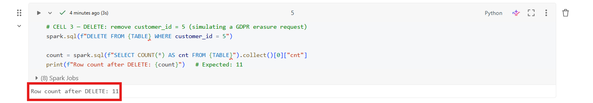

### Step 2.6: Run MERGE — Cell 4

Cell 4 reads `customers_updates.csv` from S3 into a staging view and merges it into the managed table in a single atomic commit:

```python
updates_df = (spark.read
              .option("header", "true")
              .option("inferSchema", "true")
              .csv(UPDATES_CSV_PATH))
updates_df.createOrReplaceTempView("customer_updates_stage")
print(f"Update stage rows: {updates_df.count()}")
display(updates_df)
```

```sql
MERGE INTO delta_lab_db.customers_managed AS target
USING customer_updates_stage AS source
ON target.customer_id = source.customer_id
WHEN MATCHED THEN
    UPDATE SET target.name            = source.name,
               target.city            = source.city,
               target.account_balance = source.account_balance,
               target.status          = source.status
WHEN NOT MATCHED THEN
    INSERT (customer_id, name, city, account_balance, status)
    VALUES (source.customer_id, source.name, source.city,
            source.account_balance, source.status);
```

The staging table shows 6 rows — these are what the MERGE processes:


**Expected output:**
```
Update stage rows: 6
Row count after MERGE: 11
```

Final table shows 11 clean rows, all `active` except Carlos Rivera (pending).

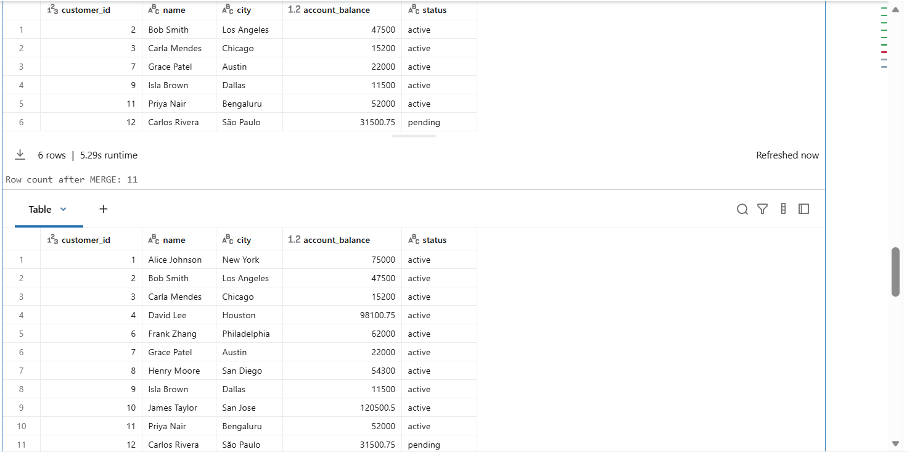

> 📌 **Why 11 and not 13?** The updates file contains customer_ids 11 and 12. Since we inserted them in Cell 3 (INSERT), they already exist — so MERGE matches and updates them instead of inserting new rows. No net-new inserts. This is correct Delta MERGE behaviour.

> 💡 **Why MERGE matters:** MERGE handles upserts atomically in a single commit — no need to read the full table, deduplicate, and overwrite. It is the core pattern for incremental data pipelines handling late-arriving or corrective data.

### Step 2.7: View Table Location — Cell 5

Cell 5 finds the physical storage location of the managed table and explains why direct `_delta_log` access is restricted:

```python
from delta.tables import DeltaTable

dt       = DeltaTable.forName(spark, TABLE)
location = dt.detail().select("location").collect()[0]["location"]
print(f"Table location : {location}")
print(f"Delta log path : {location}/_delta_log/")
```

**Expected output:**
```
Table location : s3://databricks-storage-<id>/unity-catalog/<id>/__unitystorage/catalogs/.../tables/<uuid>
Delta log path : s3://databricks-storage-<id>/unity-catalog/.../tables/<uuid>/_delta_log/
NOTE: Direct dbutils.fs.ls() access to managed table _delta_log is
restricted in Unity Catalog. Using DESCRIBE HISTORY instead (Cell 6).
```
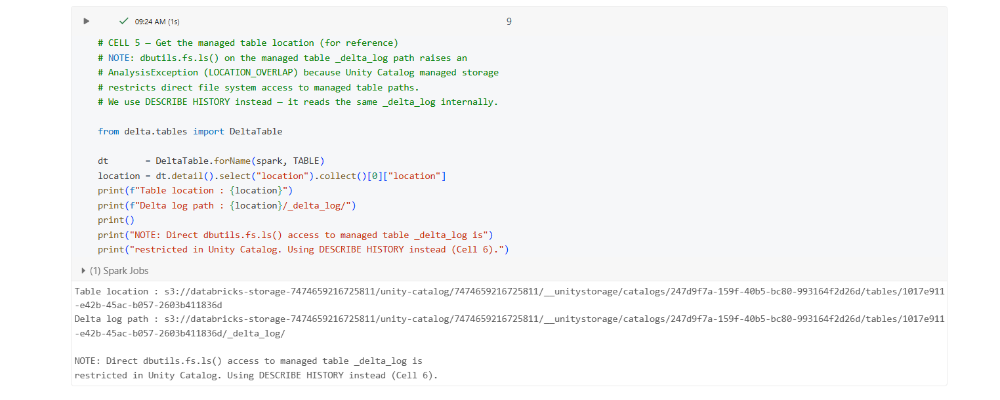


> ⚠️ **Note on direct `_delta_log` access:** In this workspace, Unity Catalog manages storage for managed tables. Direct `dbutils.fs.ls()` access to the `_delta_log/` path raises an `AnalysisException: LOCATION_OVERLAP` error. This is expected behaviour — Unity Catalog restricts raw filesystem access to managed table paths. We use `DESCRIBE HISTORY` in Cell 8 instead, which reads the same `_delta_log` internally through the Delta Lake engine.

### Step 2.8: DESCRIBE HISTORY — Cell 6

Cell 6 reads the full transaction audit trail from the Delta log:

```python
display(spark.sql(f"DESCRIBE HISTORY {TABLE}"))
```

**Expected output** — Expected output — one row per committed transaction, most recent first:

Total rows shown: 5 (one clean lab run).

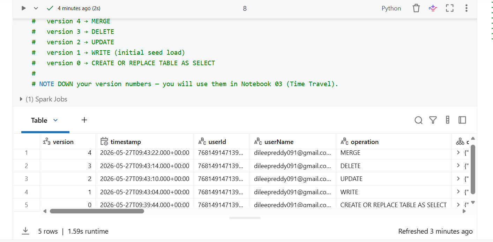

> 📌 **Note down the 4 most recent version numbers** you will use them in Notebook 03 for Time Travel queries:
> - Version 4 → MERGE (current state reference)
> - Version 3 → DELETE (use for VERSION AS OF query)
> - Version 2 → UPDATE (use for timestamp query)
> - Version 1 → WRITE (before any DML reference)
---

# Activity 3: Time Travel — Query History & Restore

**Purpose:** Query the table at previous versions using Time Travel, then simulate and recover from an accidental full-table delete using `RESTORE TABLE`.

### Step 3.1: Open the Time Travel Notebook

1. Open **`03_time_travel`** from your `delta_lab` folder.
2. Confirm `delta-lab-cluster` is attached.

### Step 3.2: View Full Transaction History — Cell 1

Run **Cell 1**:

```python
history_df = spark.sql(f"DESCRIBE HISTORY {TABLE}")
display(history_df.select("version", "timestamp", "operation", "operationParameters", "operationMetrics"))
```

**Expected output** — rows showing the pattern below, most recent first:

| Version | Timestamp | Operation | 
|---|---| ---|
| 4 | 2026-05-27 09:43:22 | MERGE |
| 3 | 2026-05-27 09:43:14 | DELETE |
| 2 | 2026-05-27 09:43:10 | UPDATE |
| 1 | 2026-05-27 09:43:04 | WRITE |
| 0 | 2026-05-27 09:39:44 | CREATE OR REPLACE TABLE AS SELECT |

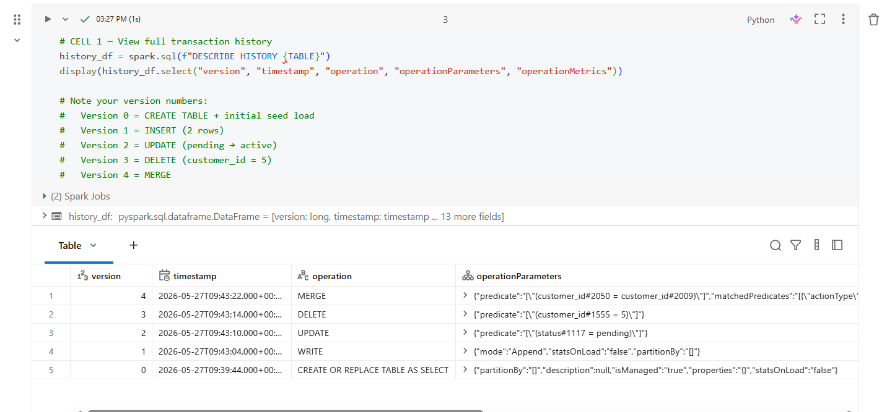

### Step 3.3: Time Travel by VERSION — Cell 2

Run **Cell 2**:

```sql
SELECT COUNT(*) AS row_count, 'version_1 (post-INSERT)' AS label
FROM   delta_lab_db.customers_managed VERSION AS OF 1
UNION ALL
SELECT COUNT(*) AS row_count, 'current (post-MERGE)' AS label
FROM   delta_lab_db.customers_managed
```

**Expected output:**

| row_count | label |
|---|---|
| 12 | version_1 (post-INSERT) |
| 11 | current (post-MERGE) |

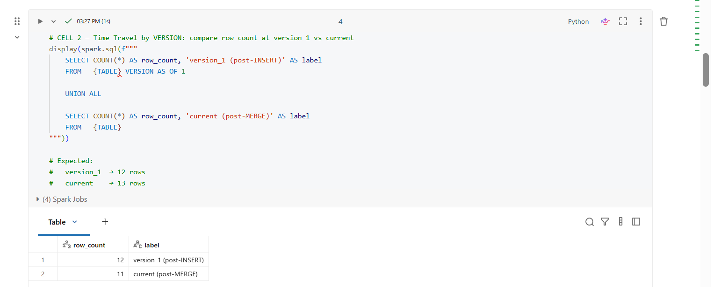

> 💡 Version 1 has 12 rows (before DELETE removed customer_id=5). Current has 11 rows after all DML operations.

### Step 3.4: View Table at Version 2 — Cell 3

Run **Cell 3**:

```sql
SELECT * FROM delta_lab_db.customers_managed VERSION AS OF 2
ORDER BY customer_id
```

**Expected output** — 12 rows. Emma Wilson (customer_id=5) is visible with `status=inactive`. This confirms we are seeing the state after UPDATE but before DELETE.

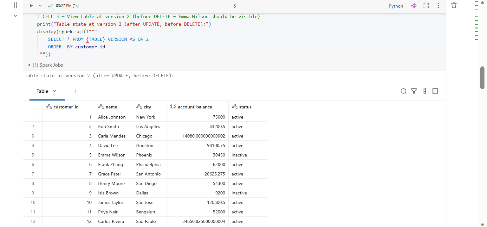

### Step 3.5: Time Travel by TIMESTAMP — Cell 4

Run **Cell 4** — the code auto-reads the version 1 timestamp from `DESCRIBE HISTORY`:

```python
history_rows = spark.sql(f"DESCRIBE HISTORY {TABLE}").collect()
v1_ts = [r["timestamp"] for r in history_rows if r["version"] == 1]
```

**Expected output:** `Querying table TIMESTAMP AS OF: xxxx-xx-xx xx:xx:xx`

Returns **12 rows** showing the original post-INSERT state — some customers still with `pending` status and original balances before the UPDATE ran.

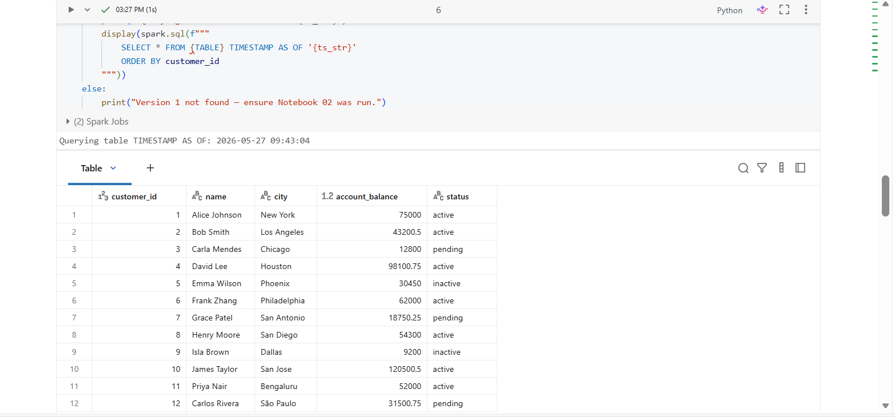

### Step 3.6: Simulate Accidental Full-Table Delete — Cell 5

Run **Cell 5**:

```python
spark.sql(f"DELETE FROM {TABLE}")
```

**Expected output:**
```
Simulating accidental full-table DELETE...
Row count after accidental DELETE: 0
```
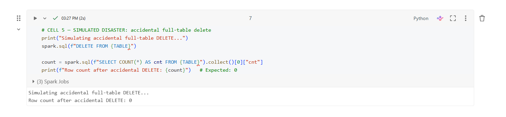

### Step 3.7: Identify Last Good Version — Cell 6

Run **Cell 6**:

```python
all_versions = spark.sql(f"DESCRIBE HISTORY {TABLE}").collect()
accidental_delete_version = all_versions[0]["version"]
last_good_version = accidental_delete_version - 1
```

**Expected output:**
```
Accidental delete version   : 5
Last good version to restore: 4
```
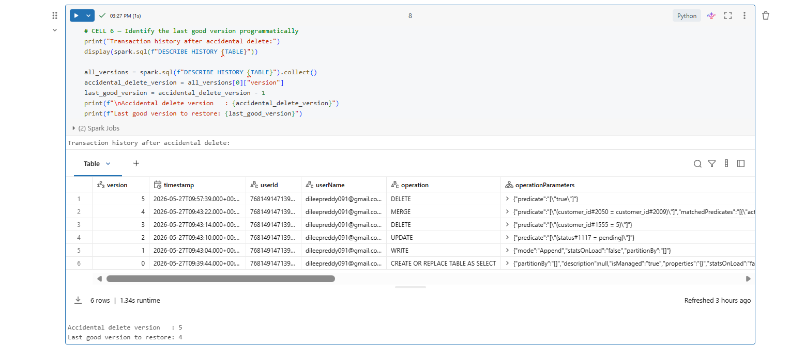

History now shows one extra row at the top — the accidental DELETE — added to the existing versions.

### Step 3.8: Restore the Table — Cell 7

Run **Cell 7**:

```sql
RESTORE TABLE delta_lab_db.customers_managed TO VERSION AS OF {last_good_version}
```

**Expected output:**
```
Table restored to version 4.
```
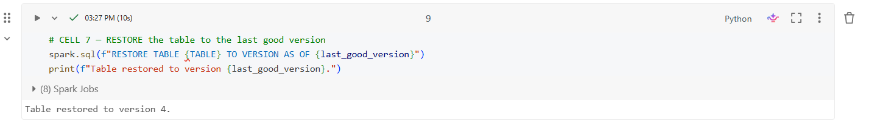

### Step 3.9: Verify Recovery — Cell 8

Run **Cell 8**:

```python
count = spark.sql(f"SELECT COUNT(*) AS cnt FROM {TABLE}").collect()[0]["cnt"]
print(f"Row count after RESTORE: {count}")
```

**Expected output:** `Row count after RESTORE: 11`
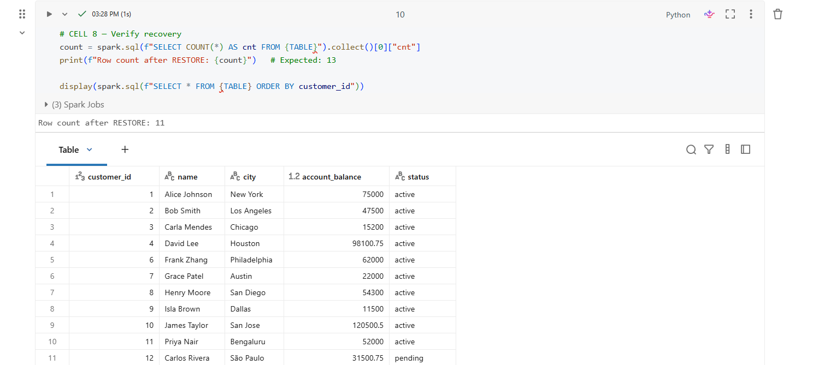


The restored table contains **11 rows** — customer_id=5 (Emma Wilson) remains absent because she was already deleted in the DELETE step of Activity 2, before the restore point.

### Step 3.10: Confirm RESTORE in History — Cell 9

Run **Cell 9**:

```sql
DESCRIBE HISTORY delta_lab_db.customers_managed LIMIT 5
```

**Expected output** — a new RESTORE entry appears at the top of history:

| Version | Operation |
|---|---|
| 6 | RESTORE |
| 5 | DELETE (accidental) |
| 4 | MERGE |
| 3 | DELETE |
| 2 | UPDATE |

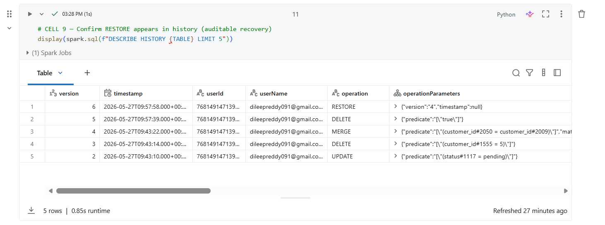

The RESTORE `operationParameters` shows `{"version":"X","timestamp":null}` confirming which version was restored to.

> 💡 **How RESTORE works:** `RESTORE TABLE` adds a new commit that re-adds the Parquet files from the target version. The accidental delete remains in history — making recovery fully auditable.

---

# Activity 4: Schema Enforcement & Schema Evolution

**Purpose:** See Delta Lake's schema protection in action, then safely add a new column using `mergeSchema`.

### Step 4.1: Open Schema Management Notebook

1. Open **`04_schema_management`** from your `delta_lab` folder.
2. Confirm `delta-lab-cluster` is attached.

### Step 4.2: Run Config Cell — Cell 

Run **Cell** — imports and config:

```python
from pyspark.sql import Row
from pyspark.sql.utils import AnalysisException
from pyspark.sql.types import StructType, StructField, IntegerType, StringType, DoubleType

DB_NAME = "delta_lab_db"
TABLE   = f"{DB_NAME}.customers_managed"
```

### Step 4.3: View Current Schema — Cell 2

Run **Cell 2**:

```python
print("Current schema of customers_managed:")
spark.sql(f"DESCRIBE TABLE {TABLE}").show(truncate=False)
```

**Expected output** — 5 columns confirmed:

| col_name | data_type | comment |
|---|---|---|
| customer_id | int | NULL |
| name | string | NULL |
| city | string | NULL |
| account_balance | double | NULL |
| status | string | NULL |


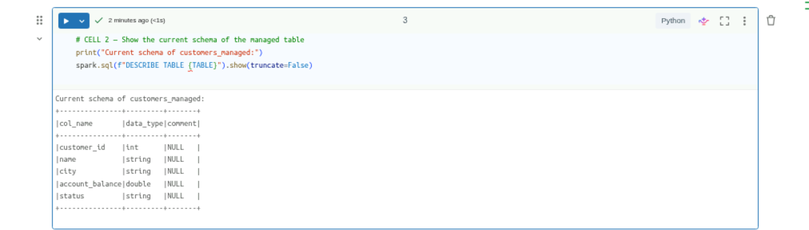

### Step 4.4: Trigger Schema Enforcement Error — Cell 3

Run **Cell 3** — attempts to append a DataFrame with an extra `loyalty_tier` column. This should **FAIL**:

```python
schema = StructType([
    StructField("customer_id",     IntegerType(), True),
    StructField("name",            StringType(),  True),
    StructField("city",            StringType(),  True),
    StructField("account_balance", DoubleType(),  True),
    StructField("status",          StringType(),  True),
    StructField("loyalty_tier",    StringType(),  True)
])

bad_schema_df = spark.createDataFrame(
    [(99, "Test User", "Delhi", 1000.00, "active", "gold")],
    schema=schema
)

try:
    (bad_schema_df.write
     .format("delta")
     .mode("append")
     .saveAsTable(TABLE))
    print("ERROR: Write succeeded — schema enforcement was NOT triggered (unexpected).")
except AnalysisException as e:
    print("Schema enforcement triggered — write was REJECTED as expected.")
    print(f"\nError message:\n{str(e)[:500]}")
```

**Expected output:**
```
Attempting to append a DataFrame with an extra column (loyalty_tier)...
Expecting an AnalysisException — schema enforcement is ON by default.

Schema enforcement triggered — write was REJECTED as expected.

Error message:
A schema mismatch detected when writing to the Delta table (Table ID: xxxxxxxx).
To enable schema migration using DataFrameWriter or DataStreamWriter, please set:
'.option("mergeSchema", "true")'.
```
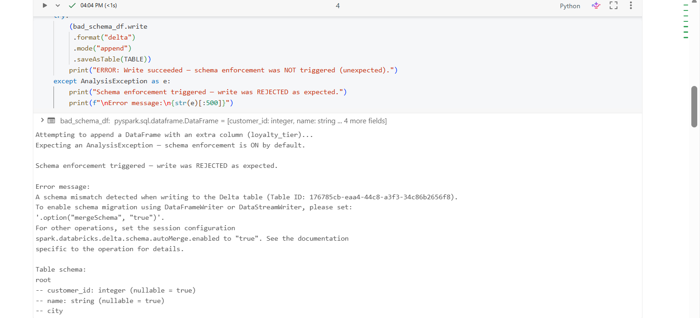

### Step 4.5: Enable Schema Evolution — Cell 3

Run **Cell 3** — retry with `mergeSchema=true`. This should **SUCCEED**:

```python
print("Retrying the write with mergeSchema=true...")

schema = StructType([
    StructField("customer_id",     IntegerType(), True),
    StructField("name",            StringType(),  True),
    StructField("city",            StringType(),  True),
    StructField("account_balance", DoubleType(),  True),
    StructField("status",          StringType(),  True),
    StructField("loyalty_tier",    StringType(),  True)
])

bad_schema_df = spark.createDataFrame(
    [(99, "Test User", "Delhi", 1000.00, "active", "gold")],
    schema=schema
)

(bad_schema_df.write
 .format("delta")
 .mode("append")
 .option("mergeSchema", "true")
 .saveAsTable(TABLE))

print("Write succeeded with mergeSchema enabled.")
```

**Expected output:**
```
Retrying the write with mergeSchema=true...
Write succeeded with mergeSchema enabled.
```
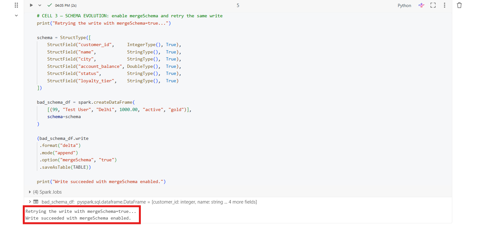

### Step 4.6: Verify Updated Schema — Cell 4

Run **Cell 4**:

```python
print("Updated schema after mergeSchema:")
spark.sql(f"DESCRIBE TABLE {TABLE}").show(truncate=False)
```

**Expected output** — `loyalty_tier` now appears as a 6th column:

| col_name | data_type | comment |
|---|---|---|
| customer_id | int | NULL |
| name | string | NULL |
| city | string | NULL |
| account_balance | double | NULL |
| status | string | NULL |
| loyalty_tier | string | NULL |

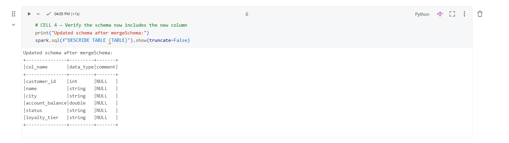

### Step 4.7: Verify Data — Cell 4

Run **Cell 4**:

```sql
SELECT customer_id, name, loyalty_tier
FROM   delta_lab_db.customers_managed
ORDER  BY customer_id
```

**Expected output** — existing rows show `null`, new row shows `gold`:

| customer_id | name | loyalty_tier |
|---|---|---|
| 1 | Alice Johnson | null |
| 2 | Bob Smith | null |
| 3 | Carla Mendes | null |
| ... | ... | null |
| 11 | Priya Nair | null |
| 12 | Carlos Rivera | null |
| 99 | Test User | gold |

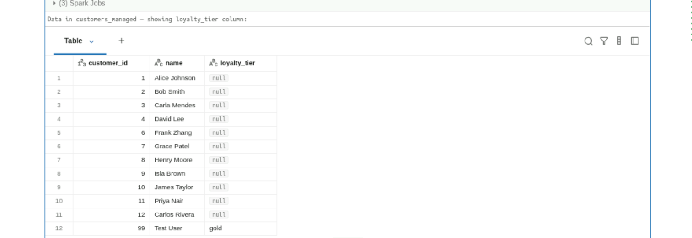


> ⚠️ **Note:** If you run this notebook multiple times, customer_id=99 may appear more than once (once per run). This is expected — each run appends a new row for Test User. The schema enforcement and evolution behaviour is the same regardless.

### Step 4.8: Confirm Schema Change in History — Cell 5

Run **Cell 5**:

```python
print("Transaction history showing schema evolution event:")
display(spark.sql(f"DESCRIBE HISTORY {TABLE} LIMIT 5"))
```

**Expected output** — the 5 most recent operations in the transaction history 
are displayed, showing schema evolution events:

| version | operation | operationParameters |
|---------|-----------|-------------------|
| 7 | WRITE | mode: Append |
| 6 | RESTORE | version: 4, timestamp: null |
| 5 | DELETE | predicate: true |
| 4 | MERGE | predicate: customer_id#2050 = customer_id#2009 |
| 3 | DELETE | predicate: customer_id#1555 = 5 |
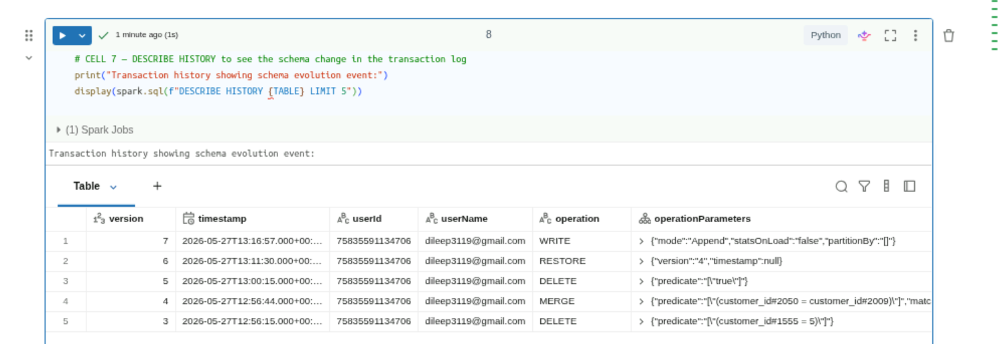


> 📌 **`mergeSchema` vs `overwriteSchema`:** `mergeSchema` safely adds new columns while keeping existing data intact — existing rows get `null` for the new column. `overwriteSchema` replaces the entire schema — use only for intentional breaking changes.

---

# Activity 5: Optimize, Z-ORDER, and VACUUM

**Purpose:** Compact small files, enable data skipping, and reclaim S3 storage.

### Step 5.1: Open the Optimize Notebook

1. Open **`05_optimize_vacuum`** from your `delta_lab` folder.
2. Confirm `delta-lab-cluster` is attached.

### Step 5.2: Run Config Cell — Cell 

Run **Cell ** (imports and config):

```python
from delta.tables import DeltaTable

DB_NAME = "delta_lab_db"
TABLE   = f"{DB_NAME}.customers_managed"
```

### Step 5.3: Check File Count Before OPTIMIZE — Cell 1

Run **Cell 1**:

```python
dt = DeltaTable.forName(spark, TABLE)
detail_before = dt.detail().select("numFiles", "sizeInBytes", "location").collect()[0]

print("=== Before OPTIMIZE ===")
print(f"  Number of files : {detail_before['numFiles']}")
print(f"  Total size      : {detail_before['sizeInBytes']} bytes")
print(f"  Location        : {detail_before['location']}")
```
**Expected output:**
```
=== Before OPTIMIZE ===
  Number of files : 3
  Total size      : xxxx bytes
  Location        : s3://databricks-storage-xxxx/unity-catalog/xxxx/tables/xxxx
```
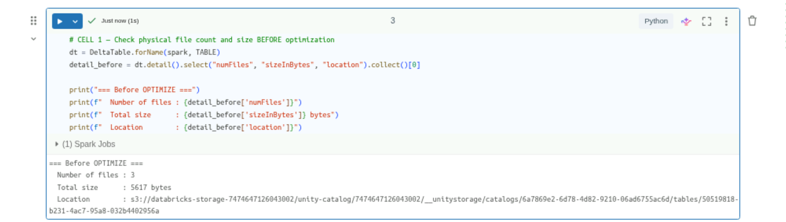

> 💡 File count will vary depending on how many DML operations were run. Multiple small files are created by each INSERT, UPDATE, DELETE, and MERGE operation.

### Step 5.4: Run OPTIMIZE — Cell 2

Run **Cell 2**:

```python
print("Running OPTIMIZE...")
optimize_result = spark.sql(f"OPTIMIZE {TABLE}")
display(optimize_result)
```

**Expected output** — 1 row showing the compaction result:

| path | metrics |
|---|---|
| s3://databricks-storage-xxxx/...| `{"numFilesAdded":1,"numFilesRemoved":5,...}` |

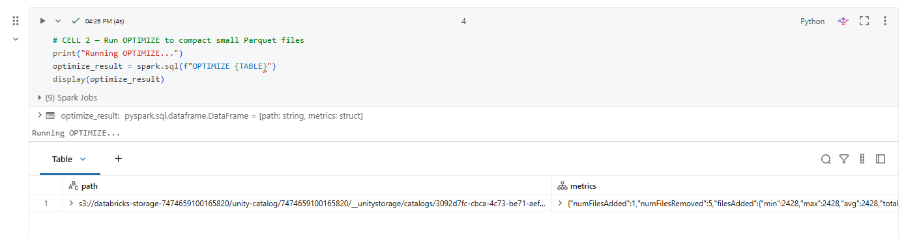

### Step 5.5: Check File Count After OPTIMIZE — Cell 3

Run **Cell 3**:

```python
detail_after_opt = dt.detail().select("numFiles", "sizeInBytes").collect()[0]

print("=== After OPTIMIZE ===")
print(f"  Number of files : {detail_after_opt['numFiles']}")
print(f"  Total size      : {detail_after_opt['sizeInBytes']} bytes")
print(f"  Files reduced by: {detail_before['numFiles'] - detail_after_opt['numFiles']}")
```

**Expected output:**
```
=== After OPTIMIZE ===
  Number of files : 1
  Total size      : xxxx bytes
  Files reduced by: 2
```
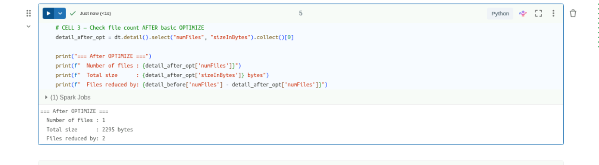

All small files have been compacted into a single Parquet file.

### Step 5.6: Run OPTIMIZE with Z-ORDER — Cell 4

Run **Cell 4**:

```python
print("Running OPTIMIZE with Z-ORDER on city...")
zorder_result = spark.sql(f"OPTIMIZE {TABLE} ZORDER BY (city)")
display(zorder_result)
```

**Expected output** — 1 row. Since the table is already compacted into 1 file, `numFilesAdded:0` and `numFilesRemoved:0` — this is correct and expected:

| path | metrics |
|---|---|
| s3://databricks-storage-xxxx/... | `{"numFilesAdded":0,"numFilesRemoved":0,...}` |

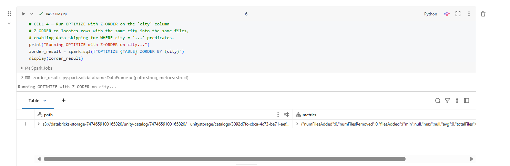

> 💡 Z-ORDER on an already-optimized single file shows 0 files added/removed. Z-ORDER has the most impact when there are multiple files to reorder — it would take effect if more data was added and OPTIMIZE was run again.

### Step 5.7: View OPTIMIZE History — Cell 5

Run **Cell 5**:

```sql
SELECT version, timestamp, operation, operationMetrics
FROM   (DESCRIBE HISTORY delta_lab_db.customers_managed)
WHERE  operation = 'OPTIMIZE'
```

**Expected output** — 1 row showing the OPTIMIZE entry:

| version | timestamp | operation | operationMetrics |
|---|---|---|---|
| X | xxxx-xx-xx xx:xx:xx | OPTIMIZE | `{"numRemovedFiles":"5","numRemovedBytes":"xxxx",...}` |

Key metrics to note: `numRemovedFiles`, `numRemovedBytes`, `p25FileSize`, `p75FileSize`.

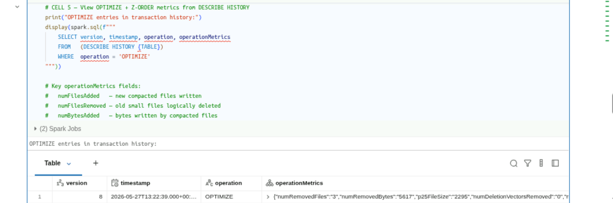

### Step 5.8: VACUUM DRY RUN — Cell 6

Run **Cell 6**:

```python
print("Running VACUUM DRY RUN (7-day / 168-hour retention):")
display(spark.sql(f"VACUUM {TABLE} RETAIN 168 HOURS DRY RUN"))
```

**Expected output:**
```
Running VACUUM DRY RUN (7-day / 168-hour retention):
No rows returned
```
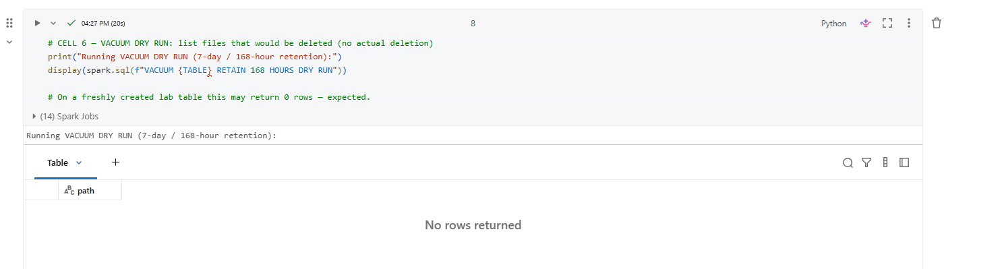


> 💡 **0 rows is correct and expected.** All files in this lab were created recently (within the last hour), so none are older than the 168-hour retention threshold. DRY RUN only lists files that *would* be deleted — nothing qualifies here.

### Step 5.9: VACUUM with 0-Hour Retention — Cell 7

Run **Cell 7**:

```python
print("Disabling retention safety check for lab purposes...")
spark.conf.set("spark.databricks.delta.retentionDurationCheck.enabled", "false")

print("Running VACUUM with RETAIN 0 HOURS...")
spark.sql(f"VACUUM {TABLE} RETAIN 0 HOURS")
print("VACUUM complete.")

spark.conf.set("spark.databricks.delta.retentionDurationCheck.enabled", "true")
print("Retention safety check restored.")
```

**Expected output:**
```
Disabling retention safety check for lab purposes...
Running VACUUM with RETAIN 0 HOURS...
VACUUM complete.
Retention safety check restored.
```
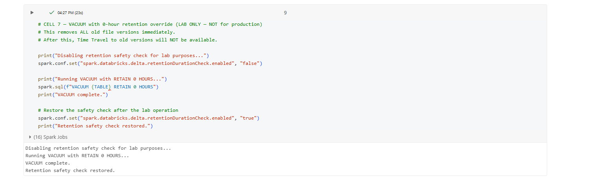


> ⚠️ **LAB ONLY — Never do this in production.** Setting `retentionDurationCheck.enabled = false` removes the 7-day safety floor that protects your Time Travel window.

### Step 5.10: Verify File Count After VACUUM — Cell 8

Run **Cell 8**:

```python
detail_after_vacuum = dt.detail().select("numFiles", "sizeInBytes").collect()[0]

print("=== After VACUUM ===")
print(f"  Number of files : {detail_after_vacuum['numFiles']}")
print(f"  Total size      : {detail_after_vacuum['sizeInBytes']} bytes")
```

**Expected output:**
```
=== After VACUUM ===
  Number of files : 1
  Total size      : xxxx bytes
```
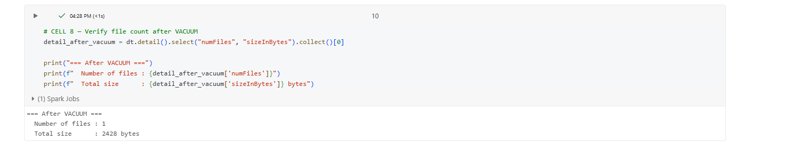


### Step 5.11: Confirm Time Travel Unavailable After VACUUM — Cell 9

Run **Cell 9**:

```python
print("Attempting to time-travel to version 0 after VACUUM (expected to FAIL)...")
try:
    display(spark.sql(f"SELECT COUNT(*) FROM {TABLE} VERSION AS OF 0"))
    print("Unexpected: time travel succeeded — old files may still be present.")
except Exception as e:
    print("Expected error — old version files have been vacuumed.")
    print(f"   Error: {str(e)[:300]}")
```

| count(1) |
|----------|
| 10       |

> 📌 **Note:** In some cases on Databricks, time travel may still succeed 
> immediately after VACUUM if the cloud storage (S3) has not yet fully 
> propagated the file deletions. If you see `count=10` returned instead of 
> an error, this is acceptable — the files will be fully removed shortly. 
> The important thing is that VACUUM ran successfully.

  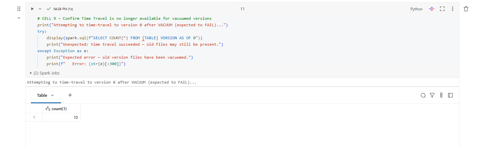


### Step 5.12: Final Table State — Cell 10

Run **Cell 10**:

```python
print("=== Final Table State ===")
display(spark.sql(f"SELECT * FROM {TABLE} ORDER BY customer_id"))
final_count = spark.sql(f"SELECT COUNT(*) AS cnt FROM {TABLE}").collect()[0]["cnt"]
print(f"\nFinal row count: {final_count}")
```

**Expected output** — full table with `loyalty_tier` column visible:

| customer_id | name | city | account_balance | status | loyalty_tier |
|---|---|---|---|---|---|
| 1 | Alice Johnson | New York | 75000 | active | null |
| 2 | Bob Smith | Los Angeles | 47500 | active | null |
| 3 | Carla Mendes | Chicago | 15200 | active | null |
| 4 | David Lee | Houston | 98100.75 | active | null |
| 6 | Frank Zhang | Philadelphia | 62000 | active | null |
| 7 | Grace Patel | Austin | 22000 | active | null |
| 8 | Henry Moore | San Diego | 54300 | active | null |
| 9 | Isla Brown | Dallas | 11500 | active | null |
| 10 | James Taylor | San Jose | 120500.5 | active | null |
| 11 | Priya Nair | Bengaluru | 52000 | active | null |
| 12 | Carlos Rivera | São Paulo | 31500.75 | pending | null |
| 99 | Test User | Delhi | 1000 | active | gold |

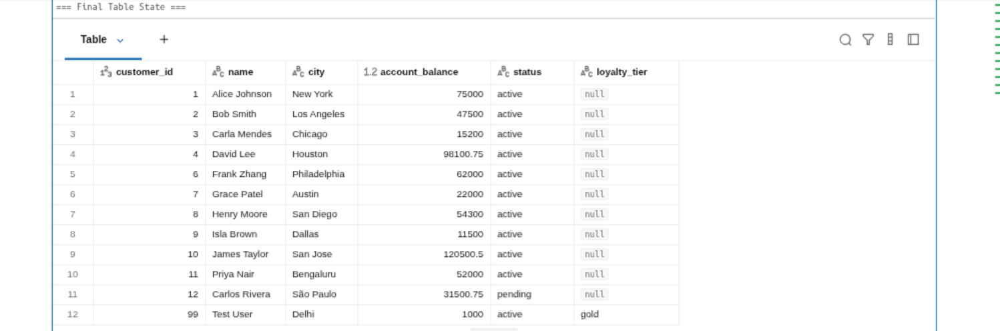


> 📌 **Note:** customer_id=99 (Test User) may appear multiple times if Activity 4 was run more than once. This does not affect the lab outcome.

---

## 🎓 Conclusion

This guided project demonstrated the full operational surface of Delta Lake on Databricks with an AWS S3 backend. You went from zero — creating a Databricks account and AWS infrastructure — through to running production-grade data engineering patterns.

Key accomplishments:

- **AWS & IAM setup** — created an S3 bucket, IAM policy (`delta-lab-s3-policy`), IAM role (`delta-lab-instance-profile`), and S3 bucket policy to grant cluster access.
- **Cluster configuration** — created `delta-lab-cluster` on Runtime 13.3 LTS with Spark config credentials for S3 access using `spark.hadoop.fs.s3n` and `spark.hadoop.fs.s3` properties.
- **Managed Delta table** — created `delta_lab_db.customers_managed` and loaded 10 rows of seed data.
- **Full DML** — INSERT, UPDATE, DELETE, and MERGE — verified atomicity through row counts and `DESCRIBE HISTORY`.
- **Transaction log inspection** — read `_delta_log` JSON files to see `commitInfo`, `add`, and `remove` actions.
- **Time Travel** — queried historical versions with `VERSION AS OF` and `TIMESTAMP AS OF`, and recovered from an accidental full-table delete using `RESTORE TABLE`.
- **Schema enforcement** — observed Delta reject a mismatched write, then used `mergeSchema` to safely add a new column with full backward compatibility.
- **OPTIMIZE + Z-ORDER + VACUUM** — compacted files, enabled data skipping, and reclaimed storage while understanding the Time Travel trade-off.
