## Guided Project: Designing and Provisioning a Production Data Lake 

---

## 🌟 Overview: What is the purpose of this Lab?

Welcome to your AWS Data Lake Engineering project! In modern data architectures, the storage foundation of a data lake must be secure, cost-optimized, and built to scale from day one. This lab will guide you through provisioning a production-grade three-zone Data Lake on Amazon S3 — applying real-world folder structures, customer-managed KMS encryption, per-zone least-privilege bucket policies, S3 versioning for disaster recovery, and automated lifecycle cost tiering.

**The Purpose of this Lab:**
You are part of a data engineering team migrating your organization's on-premises data warehouse to a secure, cost-optimized cloud storage layer on AWS. As the **Data Engineer** responsible for architecting the foundation, your task is to design and provision the storage infrastructure that all downstream pipelines — Glue transformations, Athena queries, and Lake Formation governance — will depend on.

By the end of this project, you will have:

- Created an IAM Role and a Customer Managed KMS Key for secure, auditable data lake operations.
- Provisioned a production S3 bucket with versioning enabled, public access blocked, and SSE-KMS default encryption configured.
- Designed a three-zone Medallion Architecture (Bronze/Silver/Gold) with Hive-style partitioned folder structures inside each zone.
- Applied per-zone least-privilege bucket policies enforcing KMS encryption on all uploads and denying plain HTTP traffic.
- Configured tiered lifecycle policies — archiving Bronze raw data to Glacier and auto-optimizing Gold zone costs with Intelligent-Tiering.
- Tested versioning-based disaster recovery by creating multiple object versions and confirming recovery from delete markers.
- Enabled S3 Event Notifications wired to an SNS topic to trigger downstream processing automatically when raw files land in the Bronze zone.

### Learning Path:

1. **Authentication:** Configure your AWS Console access and set the correct region.
2. **Environment Setup:** Create the IAM Role and KMS Customer Managed Key required for data lake operations.
3. **S3 Bucket Provisioning:** Create the production bucket with versioning, encryption, and public access controls.
4. **Three-Zone Architecture:** Design and provision Bronze, Silver, and Gold zone prefixes with Hive-style partitioned folder structures.
5. **Security:** Apply per-zone bucket policies enforcing KMS encryption and HTTPS-only access.
6. **Cost Management & Event Notifications:** Configure lifecycle rules to automate storage tiering for Bronze archival and Gold Intelligent-Tiering. Enable S3 Event Notifications via SNS to trigger downstream processing on Bronze ingestion.
7. **Disaster Recovery:** Test S3 versioning by creating multiple object versions and recovering from simulated pipeline corruption.

---

## 📊 Dataset / Knowledge Source Used

This lab does not require pre-existing datasets to be uploaded. A sample file named sample_data.csv is already provided in the local ~/Desktop/Project/ folder and will be used during Activity 6 to test S3 versioning, KMS encryption, and delete marker recovery behavior.

| File              | Zone / Path                                    | Description                                                                                                                                            |
| ----------------- | ---------------------------------------------- | ------------------------------------------------------------------------------------------------------------------------------------------------------ |
| `sample_data.csv` | `bronze-zone/sales/year=2024/month=01/day=01/` | A pre-provided sample CSV available in `~/Desktop/Project/` used to test S3 versioning, KMS encryption on upload, and delete marker recovery behavior. |


---

## Activities & Completion Checklist

- [ ] IAM Role created with correct S3 and KMS permissions
- [ ] KMS Customer Managed Key created and Key ARN saved
- [ ] S3 bucket created with versioning enabled and public access blocked
- [ ] SSE-KMS encryption configured and verified at the bucket level
- [ ] Three zone prefixes provisioned: `bronze-zone/`, `silver-zone/`, `gold-zone/`
- [ ] Real-world folder structure with Hive-style partitioning applied to each zone
- [ ] Separate bucket policy configured — enforces KMS encryption, denies HTTP, and scopes read/write by zone
- [ ] Lifecycle rule `bronze-zone-archival-policy` created: Standard-IA at 90 days → Glacier Instant Retrieval at 365 days (including noncurrent version transitions)
- [ ] Lifecycle rule `gold-zone-intelligent-tiering` created for automatic cost optimization
- [ ] SNS topic `datalake-bronze-ingest-notifications` created with correct access policy
- [ ] S3 Event Notification `bronze-zone-object-created` configured and wired to SNS topic
- [ ] Versioning confirmed — multiple versions of a test object created and retrieved
- [ ] Delete marker behavior tested and recovery verified

---

## Configure AWS Credentials

- Login to AWS Console:
  - Click on the `Lab Access` icon on the desktop.
    
  - Click on `Access Lab` and using the given credentials login to AWS Console.
    
  - Once logged in, set the region to `us-east-1`. All resources must be created in **US-EAST-1 (N. Virginia)**.
  - Locate the region selector at the top-right corner of the console.
    
  - Choose **us-east-1 (N. Virginia)**.
    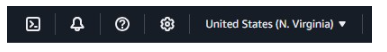

---

# Activity 1: Environment Setup — IAM Role & KMS Key

## Step 1.1 — Create an IAM Role for Data Lake Operations

An IAM Role is a secure identity that grants AWS services permission to access S3 and KMS — with no static credentials stored anywhere.

1. In the AWS Console, search for `IAM` → go to **Roles** → click **Create role**.
  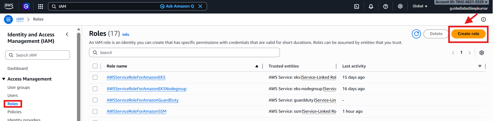
2. **Trusted entity type:** AWS service
3. **Use case:** Glue → click **Next**.
  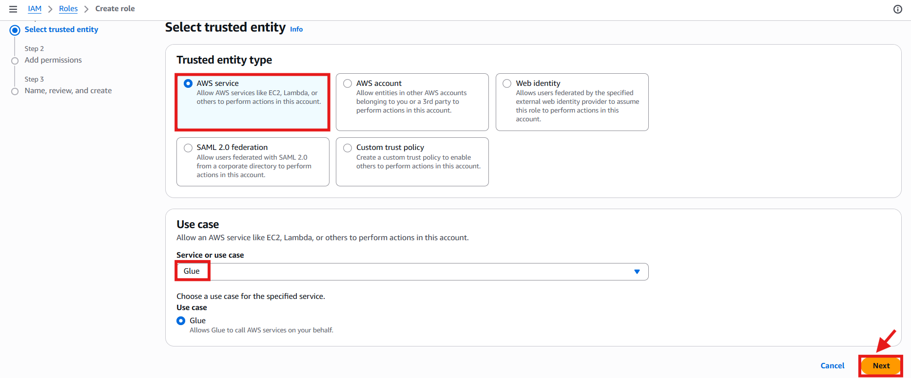
4. Attach the following managed policies:
   - `AmazonS3FullAccess`
   - `AWSKeyManagementServicePowerUser`
  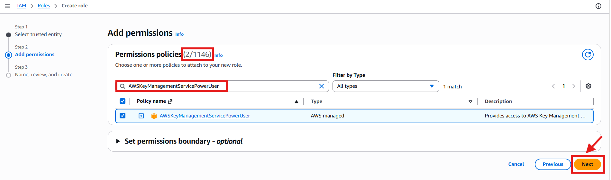

5. Click **Next**.
6. **Role name:** `DataLake-Production-Execution-Role`
  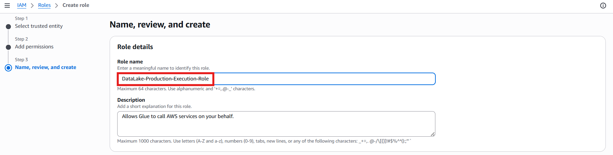
  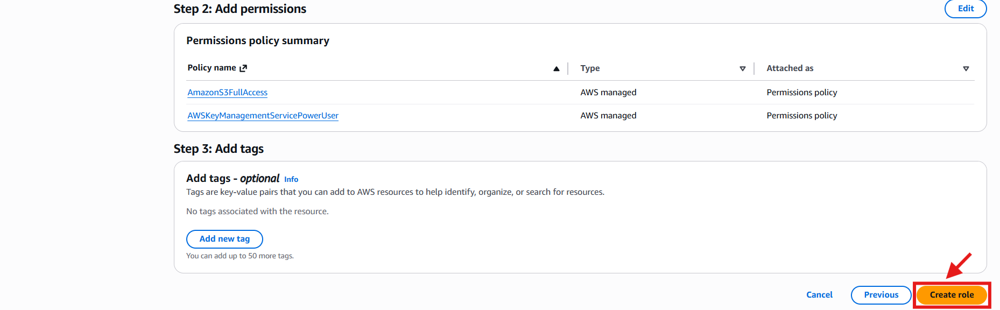
7. Click **Create role**.

> 💡 Using Glue as the trusted entity means this role can be assumed by AWS Glue transformation jobs later — this is the standard trust pattern for data lake pipeline roles.

---

## Step 1.2 — Create a KMS Customer Managed Key

AWS Key Management Service (KMS) gives you full control over the encryption keys protecting your data. Unlike the default SSE-S3 where AWS manages the key entirely, a Customer Managed Key lets you rotate, disable, and audit every encrypt/decrypt call independently.

1. Search `KMS` → go to **Customer managed keys** → click **Create key**.
  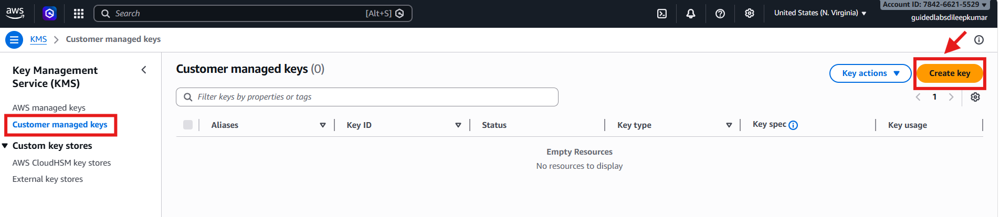
2. **Key type:** Symmetric
3. **Key usage:** Encrypt and decrypt → click **Next**.
  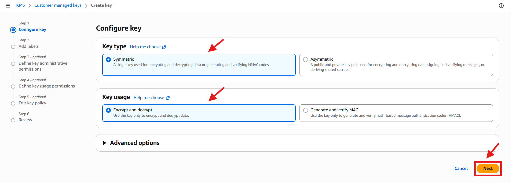
4. **Alias:** `alias/datalake-production-key` → click **Next**.
  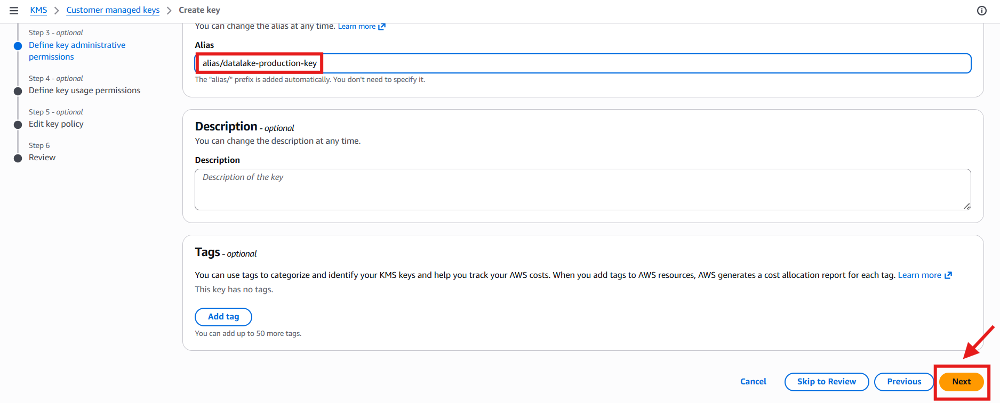
5. **Key administrators:** Select your IAM user (e.g., `your-username`) → click **Next**.
  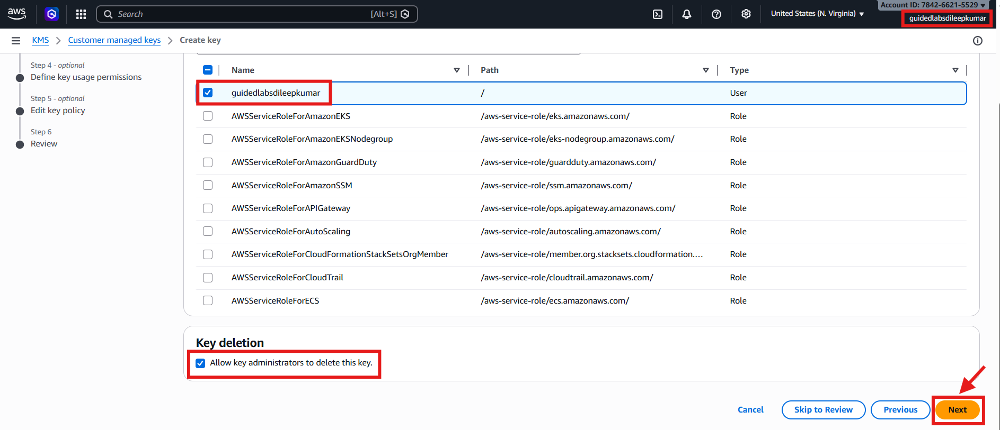
6. **Key usage permissions:** select the `DataLake-Production-Execution-Role` role → click **Next** → click **Finish**.
  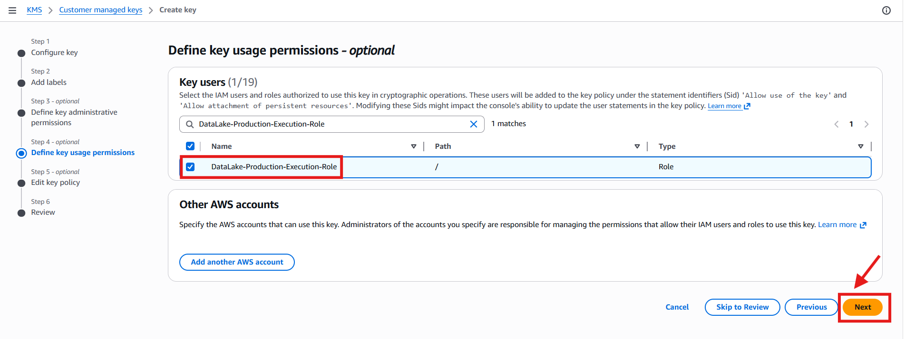
  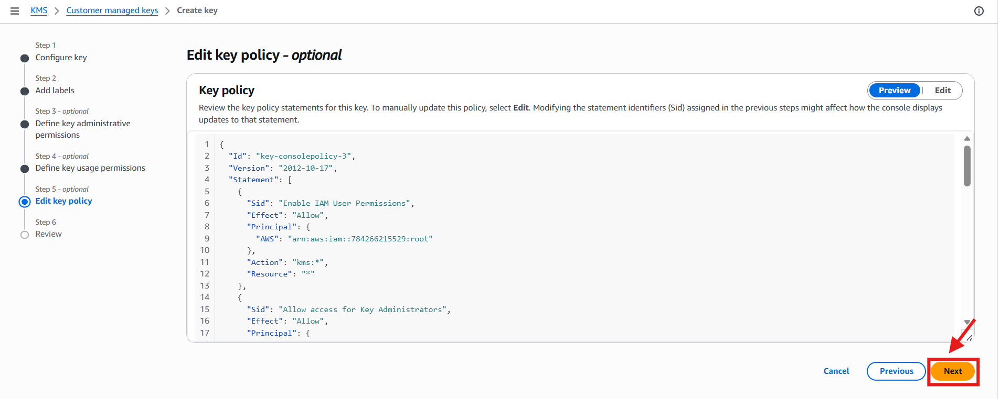
  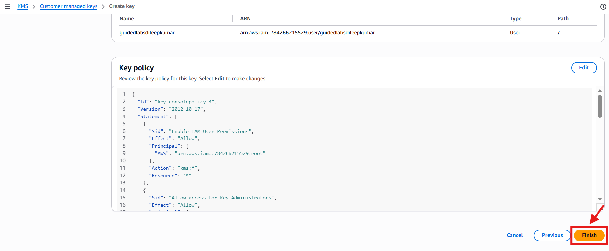
7. On the key detail page, **copy the Key ARN** and save it — you will need it in the next steps.
  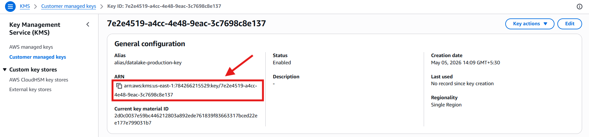


```
Example Key ARN format:
arn:aws:kms:us-east-1:123456789012:key/xxxxxxxx-xxxx-xxxx-xxxx-xxxxxxxxxxxx
```

> 💡 Customer Managed Keys give you the ability to see every encrypt/decrypt call in AWS CloudTrail, disable the key instantly to revoke all data access, and enforce automatic rotation policies — capabilities not available with AWS-managed keys.

---

# Activity 2: Provision the S3 Bucket with Versioning & Encryption

## Step 2.1 — Create the Production Data Lake Bucket

1. Search `S3` → click **Create bucket**.
  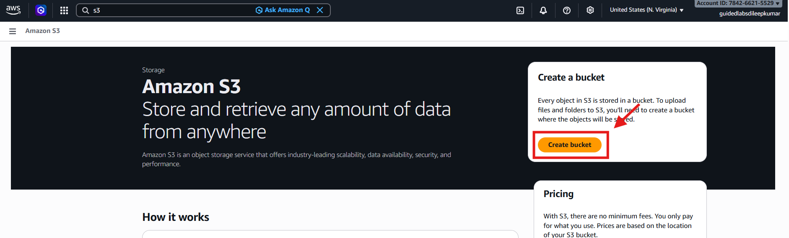
2. **Bucket name:** `prod-datalake-yourname-XXXX` *(all lowercase, globally unique — save this name exactly as you will reference it throughout the lab)*
3. **AWS Region:** US East (N. Virginia) — `us-east-1`
  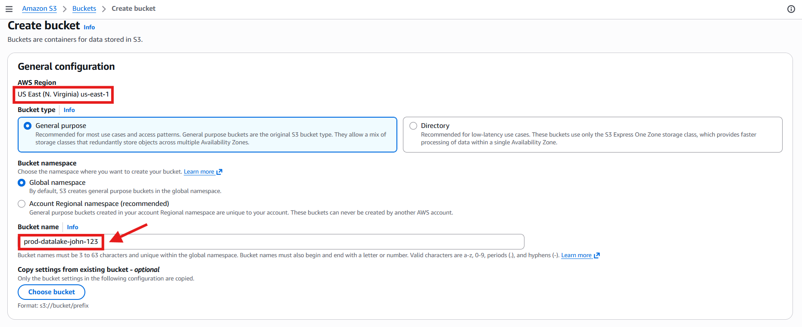
4. **Object Ownership:** ACLs disabled
5. **Block Public Access settings:** ✅ Check **Block all public access** (all four sub-options enabled)
  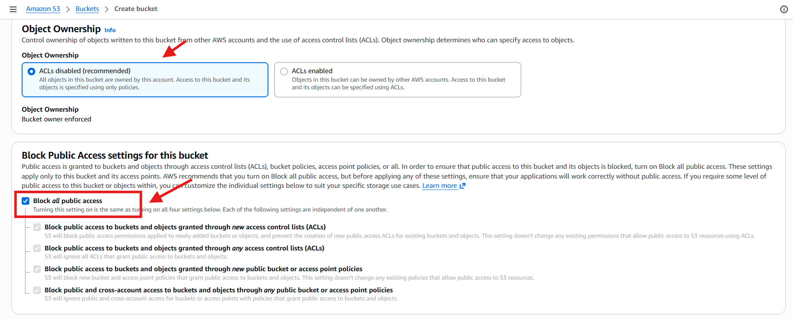
6. **Bucket Versioning:** click **Enable**
7. **Default encryption:**
   - **Encryption type:** Server-side encryption with AWS Key Management Service keys **(SSE-KMS)**
  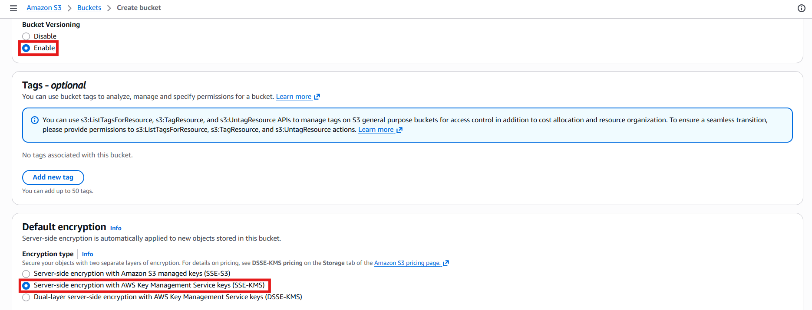
   - **AWS KMS key:** Choose from your AWS KMS keys → select `alias/datalake-production-key`
   - **Bucket Key:** Enable *(this caches the data key at the bucket level, significantly reducing KMS API call costs at scale)*
  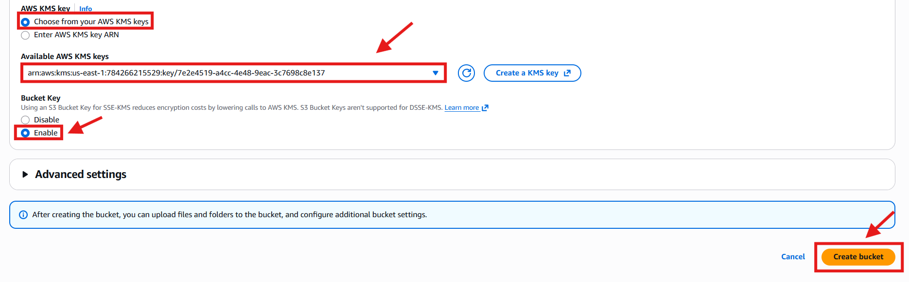

8. Click **Create bucket**.

---

## Step 2.2 — Verify Versioning and Encryption

1. Open your bucket → go to the **Properties** tab.
2. Confirm **Bucket Versioning:** Enabled.
  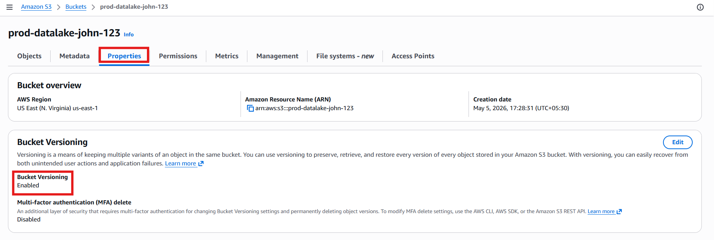
3. Confirm **Default encryption:** SSE-KMS with `datalake-production-key`.
  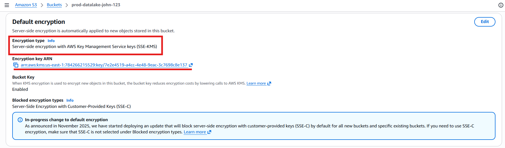

> ✅ Every object uploaded to this bucket — regardless of zone — will now be encrypted with your customer-managed KMS key by default. Any upload that attempts to bypass this will be rejected by the bucket policy configured in Activity 4.

---

# Activity 3: Design the Three-Zone Folder Architecture

## Step 3.1 — Medallion Architecture Reference

| Zone | Prefix | Contains | Consumers | File Format |
|---|---|---|---|---|
| **Bronze** | `bronze-zone/` | Raw, unmodified source data | Data Engineers | CSV, JSON (as-is) |
| **Silver** | `silver-zone/` | Cleaned, deduplicated, type-cast data | Analysts, Engineers | Parquet + Snappy |
| **Gold** | `gold-zone/` | Aggregated KPIs, ML-ready features | Business Analysts, Data Scientists | Parquet + Snappy |

> 💡 Data flows **one direction only**: Bronze → Silver → Gold. Bronze is an **immutable archive**. Never delete or overwrite raw data — versioning ensures you can always recover the original source file in the exact state it arrived.

---

## Step 3.2 — Create Zone Prefixes and Folder Structure

S3 does not have true folders — prefixes with `/` act as folder separators. Each zone follows a domain-driven, Hive-style partitioned structure that Glue and Athena can auto-detect as partition columns.

### Bronze Zone

```
bronze-zone/
  sales/
    year=2024/month=01/day=01/
    year=2024/month=01/day=02/
  customers/
    year=2024/month=01/
  product_catalog/
    year=2024/month=01/
```

1. Open your bucket → click **Create folder** → enter `bronze-zone` → click **Create folder**.
  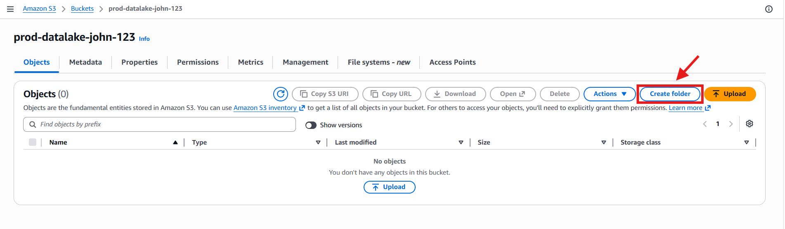
  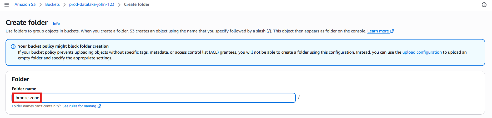
2. Click `bronze-zone` → **Create folder** → enter `sales` → **Create folder**.
  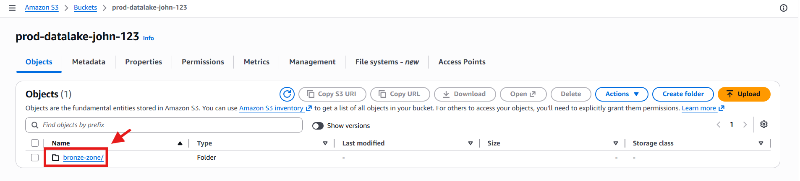
  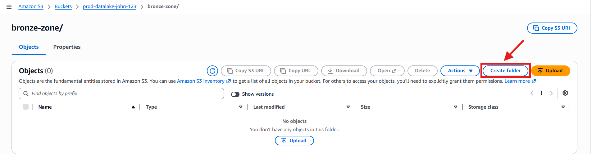
  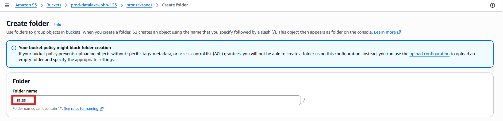
3. Click `sales` → **Create folder** → enter `year=2024` → **Create folder**
  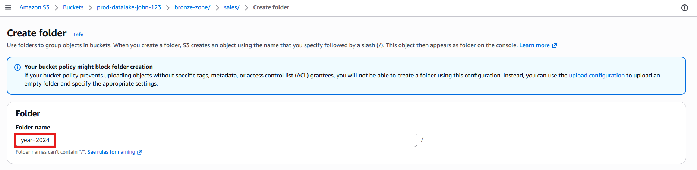
4. Click `year=2024` → **Create folder** → enter `month=01` → **Create folder**.
  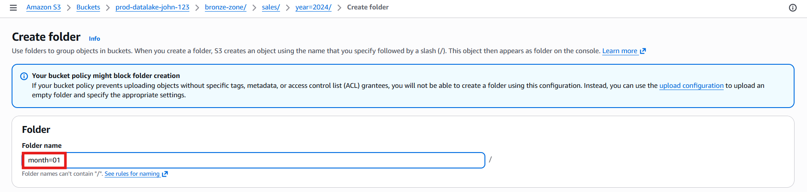
5. Click `month=01` → **Create folder** → enter `day=01` → **Create folder**.
  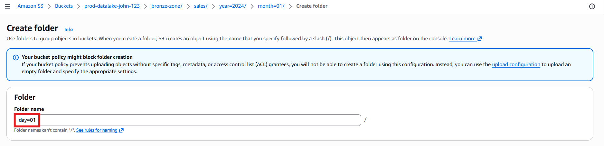

> ⚠️ Use the exact `key=value` format for partition folders. Athena and Glue detect these as partition columns automatically. Plain names like `2024` or `january` will not be recognized as partitions.

---

### Silver Zone

```
silver-zone/
  sales_cleaned/
    year=2024/month=01/
  customers_enriched/
    year=2024/month=01/
```

6. Return to the bucket root → **Create folder** → enter `silver-zone` → **Create folder**.
  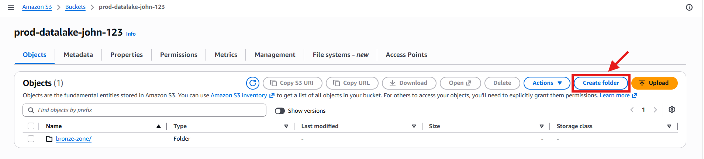
  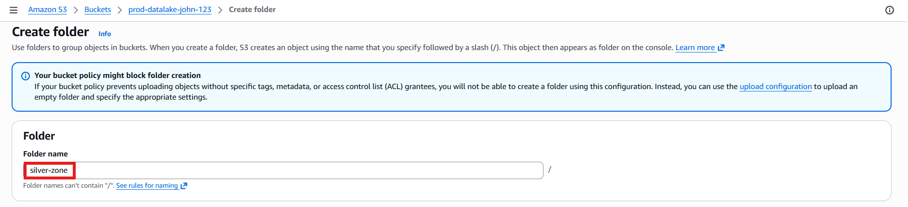
7. Inside `silver-zone` → **Create folder** → enter `sales_cleaned` → **Create folder**.
  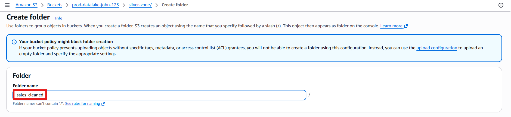
8. Inside `sales_cleaned` → **Create folder** → enter `year=2024` → **Create folder**.
  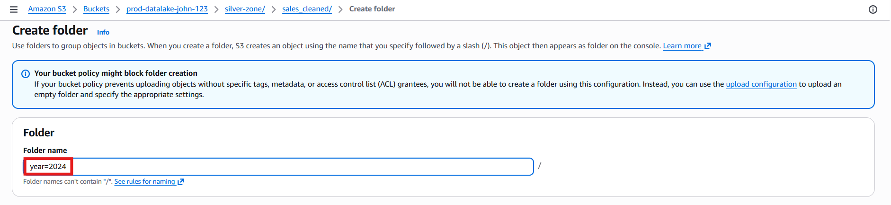
9. Inside `year=2024` → **Create folder** → enter `month=01` → **Create folder**
  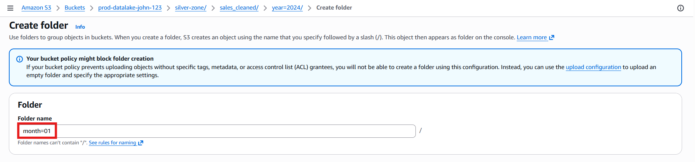

---

### Gold Zone

```
gold-zone/
  monthly_revenue_summary/
    year=2024/month=01/
  customer_ltv_scores/
    year=2024/
```

10. Return to the bucket root → **Create folder** → enter `gold-zone` → **Create folder**.
  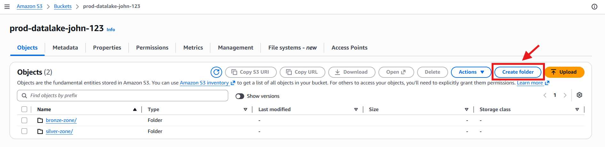
  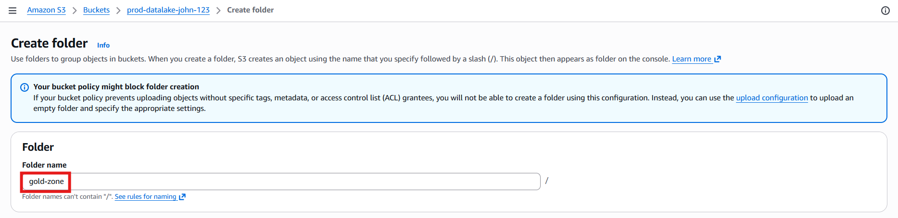
11. Inside `gold-zone` → **Create folder** → enter `monthly_revenue_summary` → **Create folder**.
  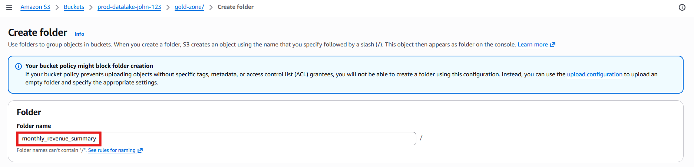
12. Inside `monthly_revenue_summary` → **Create folder** → enter `year=2024` → **Create folder**.
  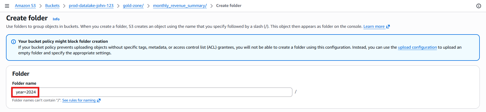
13. Inside `year=2024` → **Create folder** → enter `month=01` → **Create folder**.
  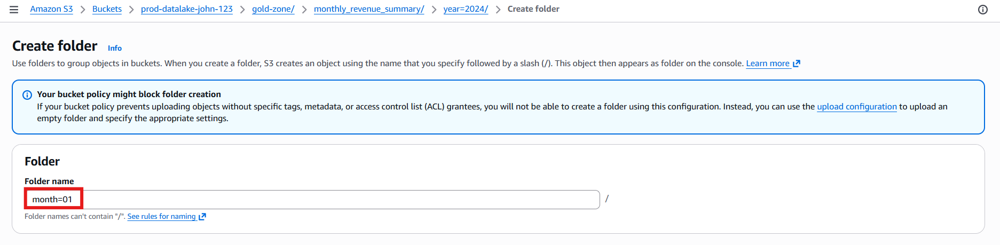

> 💡 **Partition design rule:** Partition Bronze by `year/month/day` for fine-grained, high-frequency ingestion filtering. Silver and Gold typically only need `year/month` — too many partition levels on already-aggregated data creates unnecessary metadata overhead without meaningful query benefit.

---

# Activity 4: Configure Per-Zone Bucket Policies

## Step 4.1 — Bucket Policy Architecture

Each zone has different access requirements. Rather than granting broad permissions, you apply **least-privilege policies** scoped by prefix — so a pipeline writing to Bronze cannot read from Gold, and an analyst reading Gold cannot overwrite Silver.

| Zone | Write Access | Read Access |
|---|---|---|
| Bronze | Execution Role (ingestion pipelines) | Data Engineering team only |
| Silver | Execution Role (transformation jobs) | Data Engineering + Analysts |
| Gold | Execution Role (aggregation jobs) | All authenticated users in the org |

---

## Step 4.2 — Apply the Bucket Policy

1. Open your bucket → go to the **Permissions** tab → click **Bucket policy** → click **Edit**.
  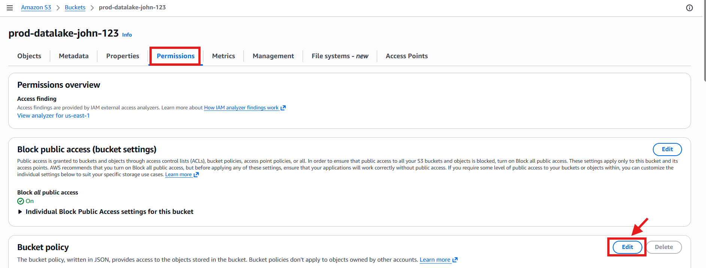
  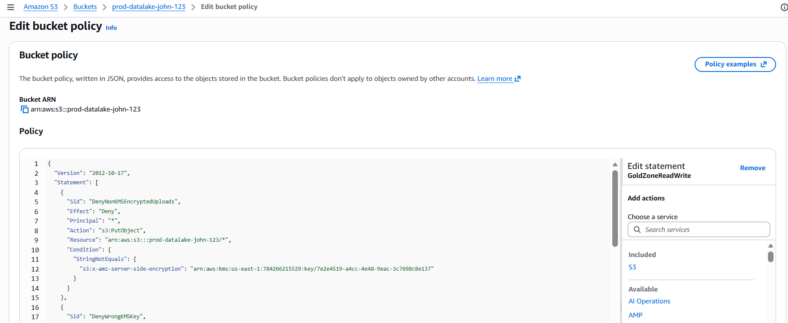
2. Paste the policy below, replacing all three placeholder values:
   - `YOUR-BUCKET-NAME` → your actual bucket name (e.g., `prod-datalake-yourname-XXXX`)
   - `YOUR-ACCOUNT-ID` → your 12-digit AWS account ID
   - `YOUR-KMS-KEY-ARN` → the Key ARN you saved in Step 1.2

```json
{
  "Version": "2012-10-17",
  "Statement": [
    {
      "Sid": "DenyNonKMSEncryptedUploads",
      "Effect": "Deny",
      "Principal": "*",
      "Action": "s3:PutObject",
      "Resource": "arn:aws:s3:::YOUR-BUCKET-NAME/*",
      "Condition": {
        "StringNotEquals": {
          "s3:x-amz-server-side-encryption": "aws:kms"
        }
      }
    },
    {
      "Sid": "DenyWrongKMSKey",
      "Effect": "Deny",
      "Principal": "*",
      "Action": "s3:PutObject",
      "Resource": "arn:aws:s3:::YOUR-BUCKET-NAME/*",
      "Condition": {
        "StringNotEquals": {
          "s3:x-amz-server-side-encryption-aws-kms-key-id": "YOUR-KMS-KEY-ARN"
        }
      }
    },
    {
      "Sid": "BronzeZoneWriteAccess",
      "Effect": "Allow",
      "Principal": {
        "AWS": "arn:aws:iam::YOUR-ACCOUNT-ID:role/DataLake-Production-Execution-Role"
      },
      "Action": [
        "s3:PutObject",
        "s3:GetObject",
        "s3:DeleteObject",
        "s3:ListBucket"
      ],
      "Resource": [
        "arn:aws:s3:::YOUR-BUCKET-NAME/bronze-zone/*",
        "arn:aws:s3:::YOUR-BUCKET-NAME"
      ]
    },
    {
      "Sid": "SilverZoneReadWrite",
      "Effect": "Allow",
      "Principal": {
        "AWS": "arn:aws:iam::YOUR-ACCOUNT-ID:role/DataLake-Production-Execution-Role"
      },
      "Action": [
        "s3:PutObject",
        "s3:GetObject",
        "s3:ListBucket"
      ],
      "Resource": [
        "arn:aws:s3:::YOUR-BUCKET-NAME/silver-zone/*",
        "arn:aws:s3:::YOUR-BUCKET-NAME"
      ]
    },
    {
      "Sid": "GoldZoneReadWrite",
      "Effect": "Allow",
      "Principal": {
        "AWS": "arn:aws:iam::YOUR-ACCOUNT-ID:role/DataLake-Production-Execution-Role"
      },
      "Action": [
        "s3:PutObject",
        "s3:GetObject",
        "s3:ListBucket"
      ],
      "Resource": [
        "arn:aws:s3:::YOUR-BUCKET-NAME/gold-zone/*",
        "arn:aws:s3:::YOUR-BUCKET-NAME"
      ]
    },
    {
      "Sid": "DenyHTTP",
      "Effect": "Deny",
      "Principal": "*",
      "Action": "s3:*",
      "Resource": [
        "arn:aws:s3:::YOUR-BUCKET-NAME",
        "arn:aws:s3:::YOUR-BUCKET-NAME/*"
      ],
      "Condition": {
        "Bool": {
          "aws:SecureTransport": "false"
        }
      }
    }
  ]
}
```
  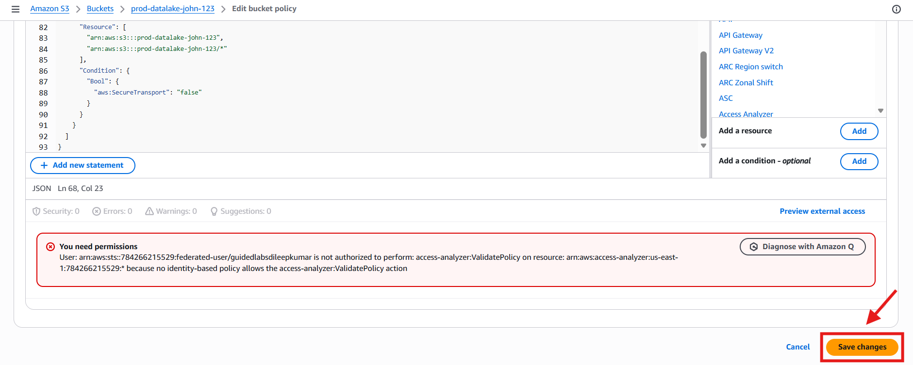
3. Click **Save changes**.

> 💡 The `DenyNonKMSEncryptedUploads` statement means **any** upload that does not explicitly use your KMS key will be rejected — even if it specifies SSE-S3. This guarantees your customer-managed KMS key is always applied. The `DenyHTTP` statement ensures all data in transit uses HTTPS/TLS.

> ⚠️ If you see an "Invalid bucket policy" error, double-check that **all three placeholder values** (`YOUR-BUCKET-NAME`, `YOUR-ACCOUNT-ID`, `YOUR-KMS-KEY-ARN`) have been replaced with your actual values, including the value inside the `Condition` block.

---

# Activity 5: Configure Lifecycle Policies for Cost Management

## Step 5.1 — Storage Cost Tiers Reference

| Storage Class | Cost/GB/Month | Retrieval Time | Best For |
|---|---|---|---|
| S3 Standard | ~$0.023 | Milliseconds | Active Bronze/Silver/Gold |
| S3 Standard-IA | ~$0.0125 | Milliseconds | Bronze data > 90 days old |
| S3 Glacier Instant Retrieval | ~$0.004 | Milliseconds | Bronze data > 365 days old |
| S3 Intelligent-Tiering | Variable | Milliseconds | Gold zone (unpredictable access) |

---

## Step 5.2 — Create the Bronze Zone Archival Lifecycle Rule

Raw Bronze data is written once and rarely re-read after the initial processing window. Lifecycle rules automate the transition to cheaper storage tiers without any manual intervention.

1. Open your bucket → go to the **Management** tab → click **Create lifecycle rule**.
  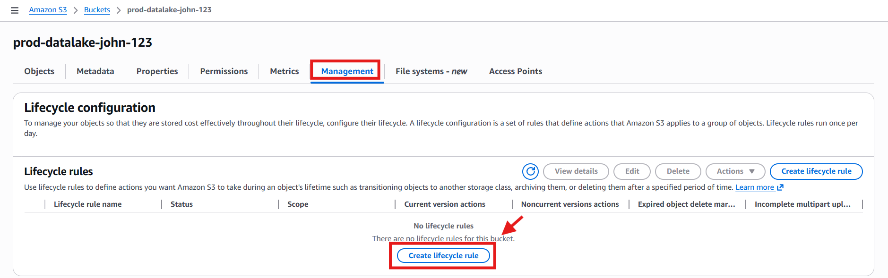
2. **Rule name:** `bronze-zone-archival-policy`
3. **Filter type:** Prefix → enter `bronze-zone/`
  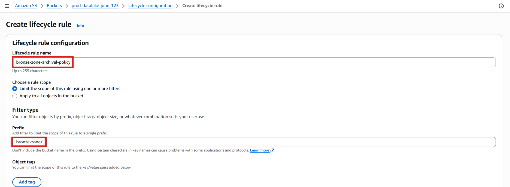
4. Under **Lifecycle rule actions**, check all of the following:
   - ✅ Transition current versions of objects between storage classes
   - ✅ Transition noncurrent versions of objects between storage classes
   - ✅ Permanently delete noncurrent versions of objects
  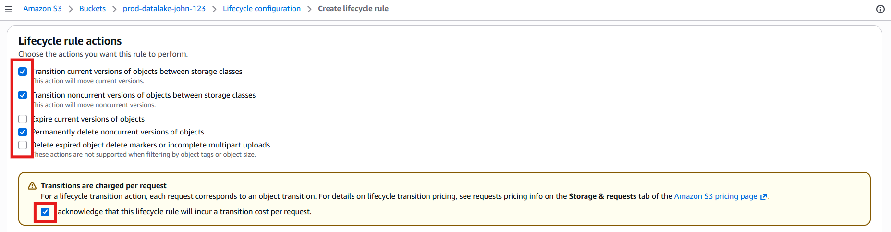
5. **Current version transitions:**
   - Add transition: **S3 Standard-IA** after **90** days
   - Add transition: **S3 Glacier Instant Retrieval** after **365** days
  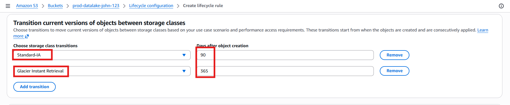
6. **Noncurrent version transitions:**
   - Add transition: **S3 Standard-IA** after **30** days
   - Add transition: **S3 Glacier Instant Retrieval** after **90** days
7. **Permanently delete noncurrent versions:** after **730** days *(retain 2 years of version history for DR and compliance)*
  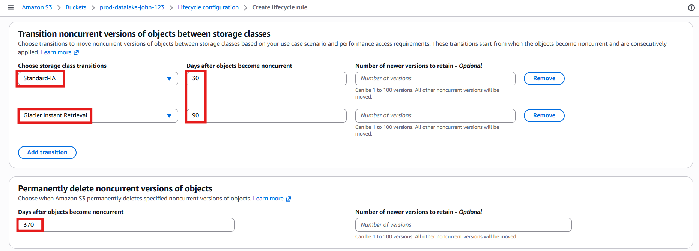
  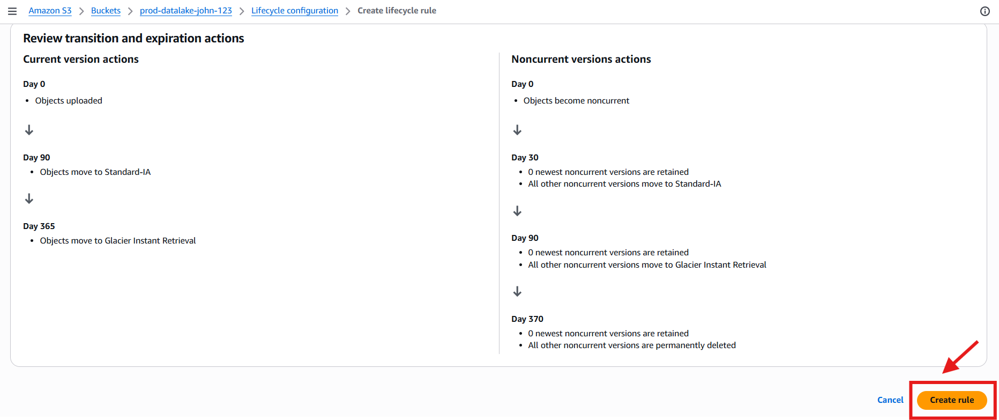
8. Click **Create rule**.

> 💡 Including noncurrent version transitions is critical — without it, versioning accumulates unlimited historical copies in Standard storage, completely negating cost savings. The 730-day permanent deletion balances long-term disaster recovery coverage against ongoing storage cost.

---

## Step 5.3 — Create the Gold Zone Intelligent-Tiering Rule

Gold zone data is queried unpredictably — some datasets are accessed daily while others go dormant after initial reporting. Intelligent-Tiering automatically moves objects between access tiers based on **actual usage patterns**, with no retrieval fees.

1. Open your bucket → **Management** tab → click **Create lifecycle rule**.
  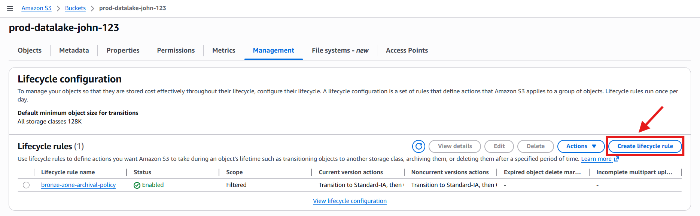
2. **Rule name:** `gold-zone-intelligent-tiering`
3. **Filter type:** Prefix → enter `gold-zone/`
  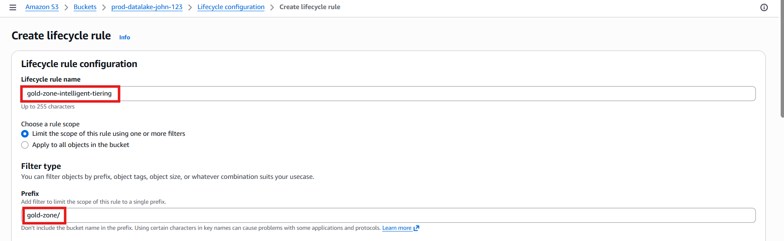
4. Under **Lifecycle rule actions**, check:
   - ✅ Transition current versions of objects between storage classes
  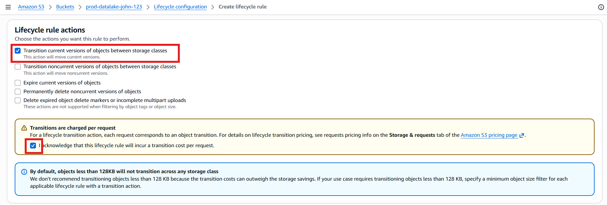
5. **Current version transition:** S3 Intelligent-Tiering after **0** days *(objects move to Intelligent-Tiering immediately on upload)*
  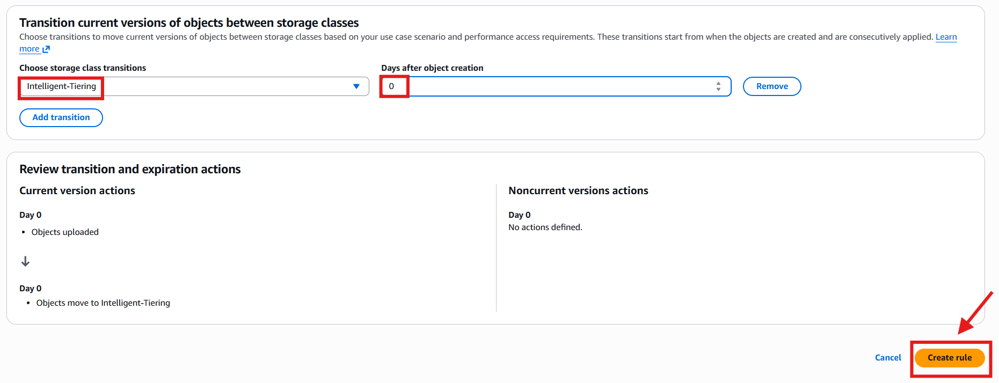
6. Click **Create rule**.

> 💡 Intelligent-Tiering is particularly well-suited for Gold because access patterns are driven by business reporting cycles — a monthly KPI report might be accessed heavily in the first week of a new month, then rarely touched again. Intelligent-Tiering captures those savings automatically without requiring you to predict access patterns upfront.

---

## Step 5.4 — Why Event Notifications

Event notifications let S3 trigger downstream processing the moment a file lands — no polling, no scheduled jobs running unnecessarily. When a raw file arrives in Bronze, you want your ETL pipeline to start automatically.

```
Raw file uploaded to bronze-zone/ → S3 Event → SNS Topic / Lambda / SQS Queue → Glue Job triggered
```

---

## Step 5.5 — Create an SNS Topic for Notifications

1. Search `SNS` → **Topics** → **Create topic**.
   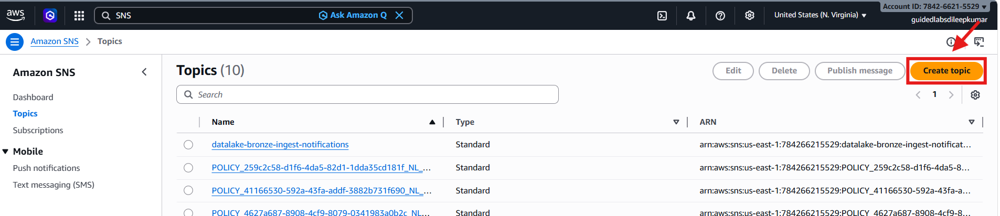
2. **Type:** Standard | **Name:** `datalake-bronze-ingest-notifications` → **Create topic**.
   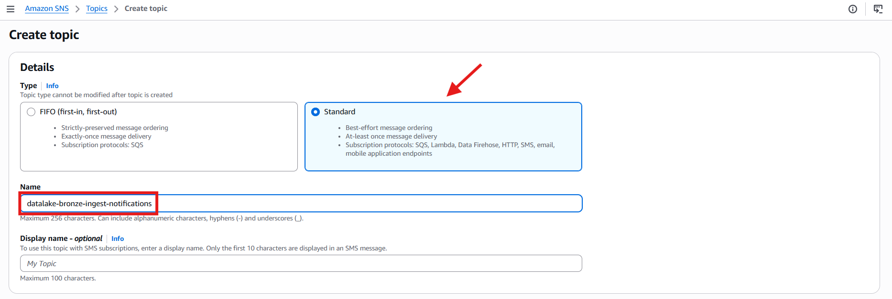
   - SNS Topic ARN → (you will copy after creating topic)
   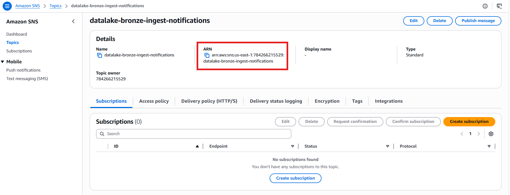
3. On the topic page, copy the **Topic ARN**.
4. Under **Access policy** → **Edit** → add the following statement inside the `Statement` array, replacing `YOUR-IAM-USER-ARN`, `YOUR-BUCKET-NAME` and `YOUR-SNS-TOPIC-ARN`:

   - `YOUR-IAM-USER-ARN` → IAM → Users → Click on your `username` → copy ARN
   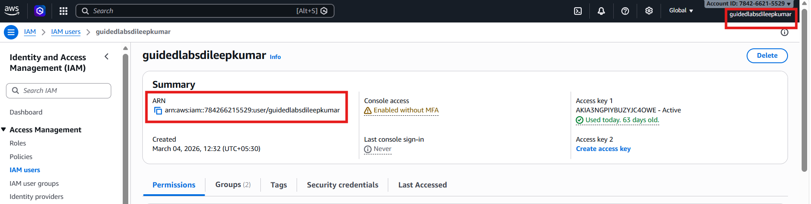
   - `YOUR-SNS-TOPIC-ARN` → copied from the topic page above
   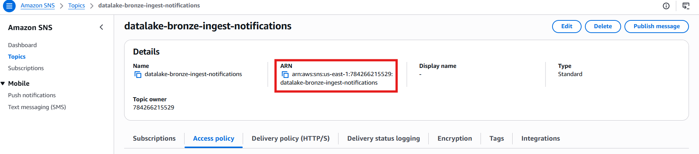
   - `YOUR-BUCKET-NAME` → your S3 bucket name

```json
{
  "Version": "2008-10-17",
  "Statement": [
    {
      "Sid": "AllowTopicOwner",
      "Effect": "Allow",
      "Principal": {
        "AWS": "YOUR-IAM-USER-ARN"
      },
      "Action": [
        "SNS:Publish",
        "SNS:RemovePermission",
        "SNS:SetTopicAttributes",
        "SNS:DeleteTopic",
        "SNS:ListSubscriptionsByTopic",
        "SNS:GetTopicAttributes",
        "SNS:AddPermission",
        "SNS:Subscribe"
      ],
      "Resource": "YOUR-SNS-TOPIC-ARN"
    },
    {
      "Sid": "AllowS3ToPublish",
      "Effect": "Allow",
      "Principal": {
        "Service": "s3.amazonaws.com"
      },
      "Action": "SNS:Publish",
      "Resource": "YOUR-SNS-TOPIC-ARN",
      "Condition": {
        "ArnLike": {
          "aws:SourceArn": "arn:aws:s3:::YOUR-BUCKET-NAME"
        }
      }
    }
  ]
}
```
   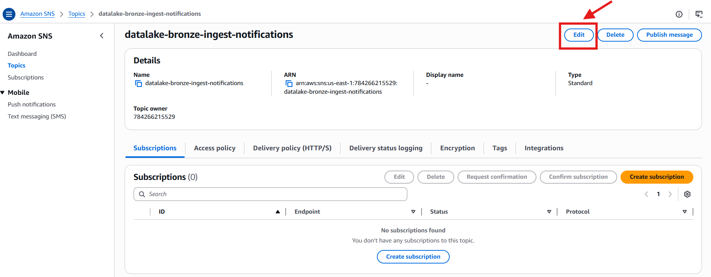
   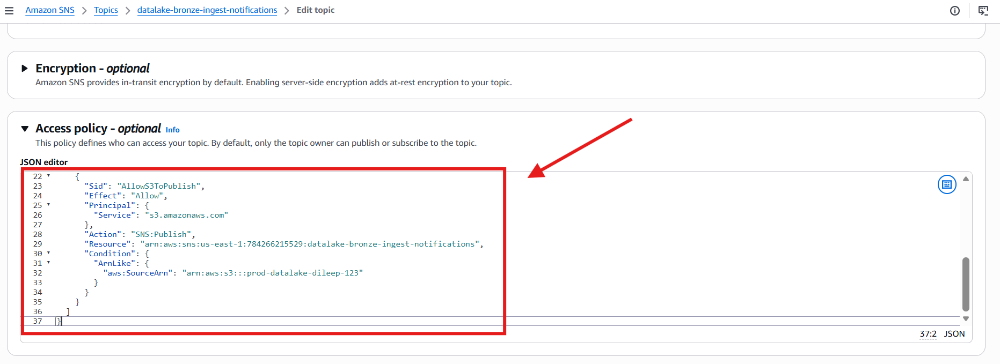
   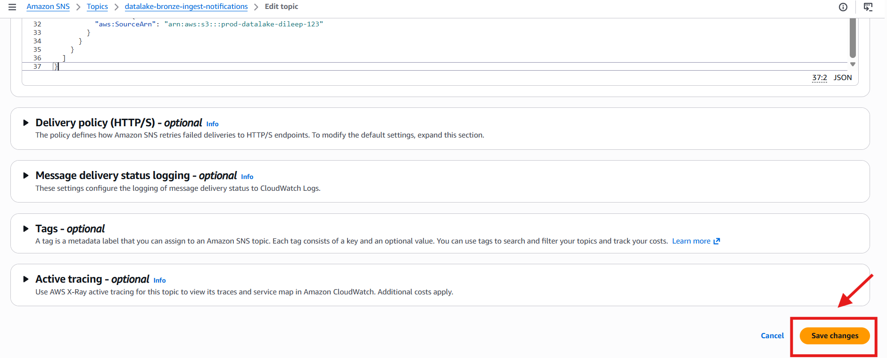
5. Click **Save changes**.

---

## Step 5.6 — Configure S3 Event Notification

1. Return to your S3 bucket → **Properties** tab → scroll to **Event notifications** → **Create event notification**.
   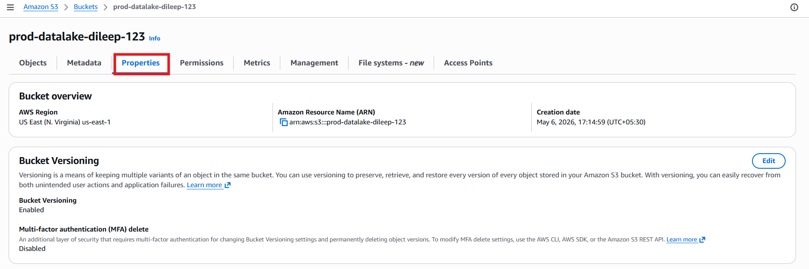
   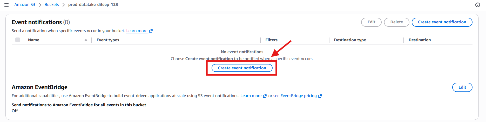
2. **Event name:** `bronze-zone-object-created`.
3. **Prefix:** `bronze-zone/` _(scoped to Bronze zone only)_.
4. **Event types:** ✅ All object create events (`s3:ObjectCreated:*`).
   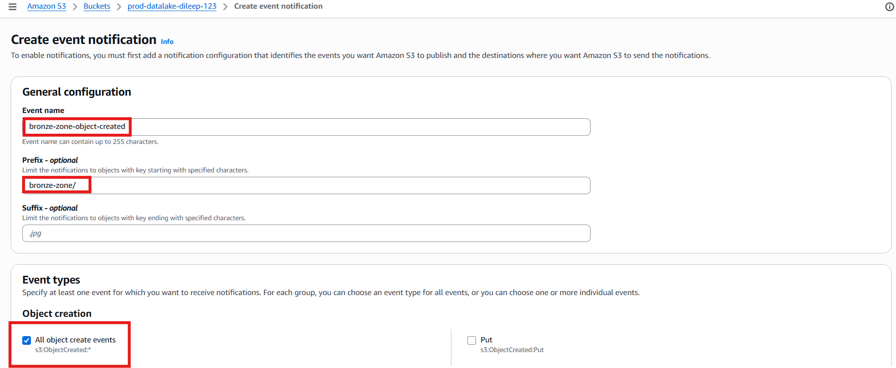
5. **Destination:** SNS topic → select `datalake-bronze-ingest-notifications`.
   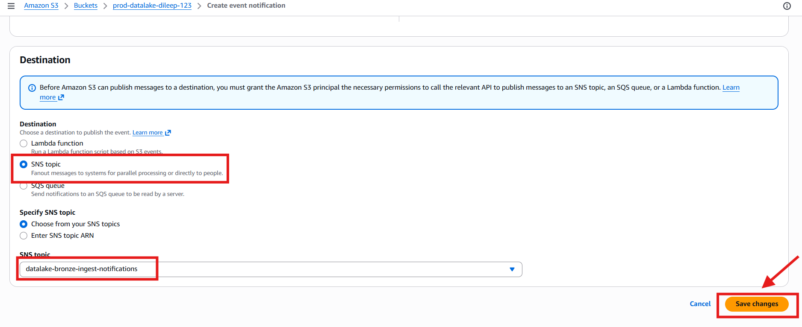
6. Click **Save changes**.

> 💡 In production you would chain this SNS topic to an SQS queue (for reliable buffering) and a Lambda function that triggers a Glue ETL job — creating a fully event-driven ingestion pipeline. For this lab, SNS confirms the notification path is wired correctly.

---

# Activity 6: Test Versioning for Disaster Recovery

## Step 6.1 — Upload a Test Object and Create Multiple Versions

Versioning means every overwrite creates a new version — the previous content is never lost. This is your primary safeguard against pipeline bugs that corrupt or overwrite Bronze data.
1. In your S3 bucket, navigate to `bronze-zone → sales → year=2024 → month=01 → day=01`.
  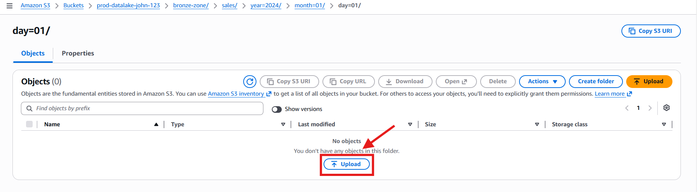
2. Click **Upload** → **Add files** → select `sample_data.csv`.
  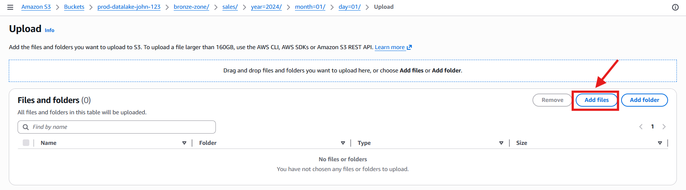
3. Browse your local computer to ~/Desktop/Project/, select sample_data.csv, and click Open.
  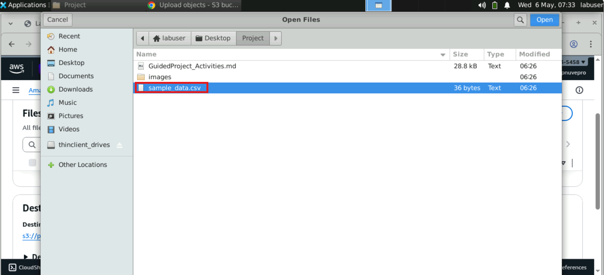
4. On the upload page, expand the **Properties** section.
  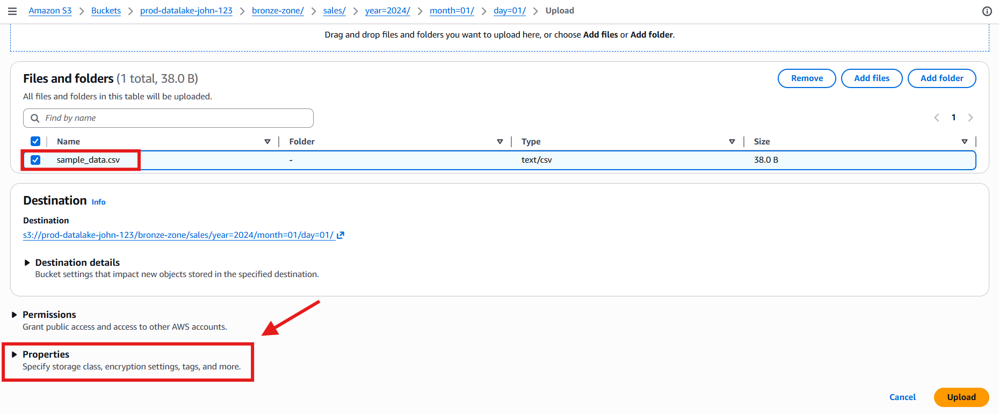
5. Scroll to **Server-side encryption** → select **"Specify an encryption key"**.
6. Under **Encryption settings** → select **"Use bucket settings for default encryption"**.
  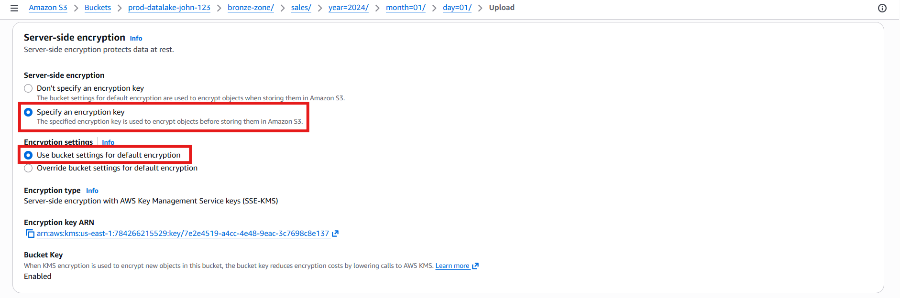
   - Encryption type will show: **SSE-KMS** ✅
   - Encryption key ARN will show: **your `datalake-production-key`** ✅
   - Bucket Key: **Enabled** ✅
7. Click **Upload** → confirm **"Upload succeeded"** → click **Close**.
  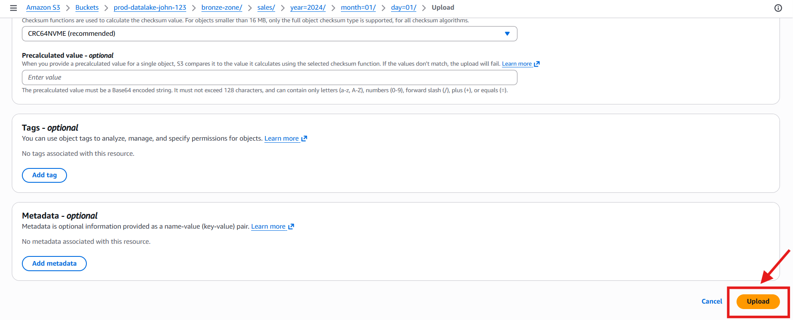
  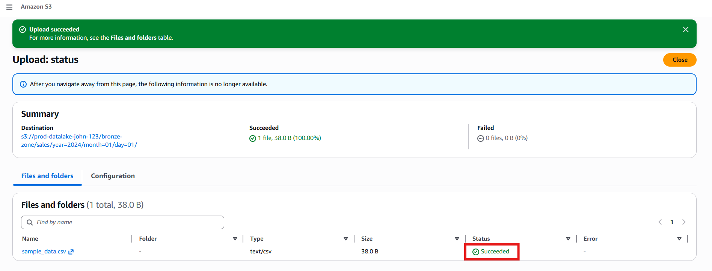
**Create a second version (simulating a corrupted pipeline run):**

8. Navigate to ~/Desktop/Project/, right-click on sample_data.csv, select Open With Text Editor, update the values,
  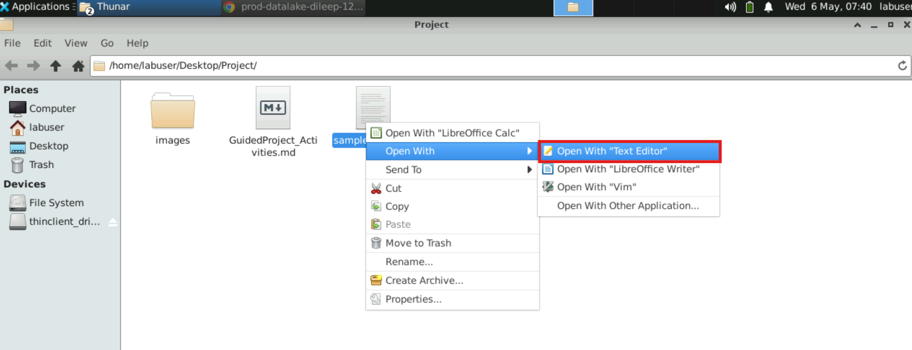
  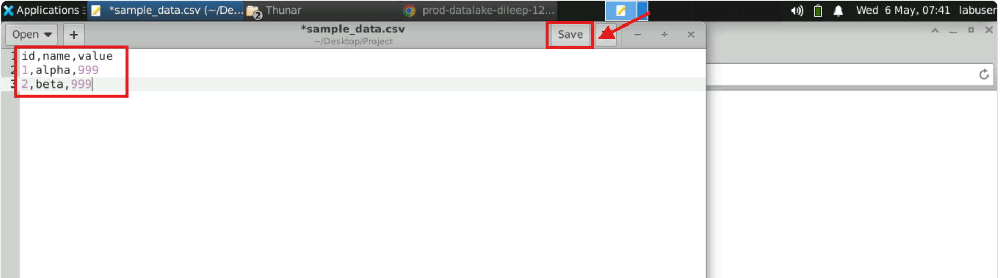
9. Save the file (keep the same filename — `sample_data.csv`).
10. In S3, navigate back to **the same path**: `bronze-zone → sales → year=2024 → month=01 → day=01`.
11. Click **Upload** → **Add files** → select the modified `sample_data.csv`.
  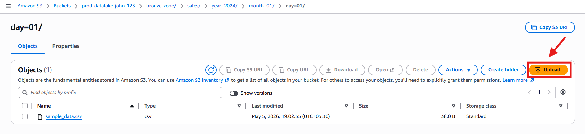
  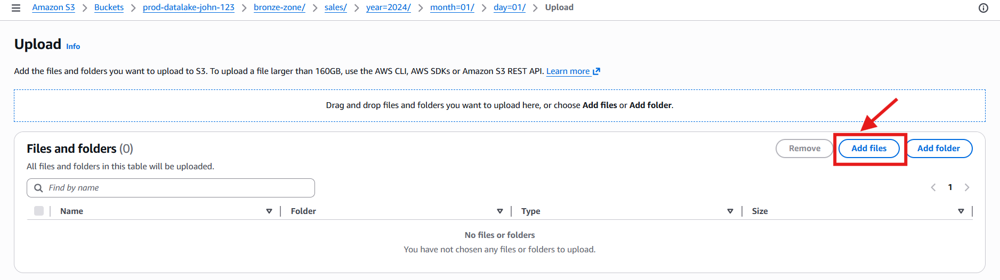
  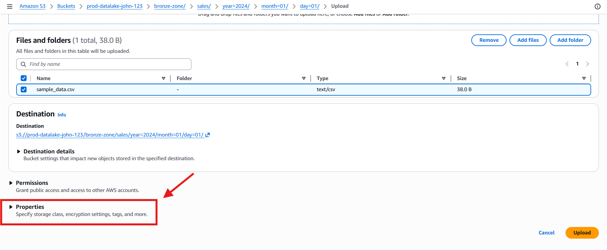
12. Expand **Properties** → apply the same encryption settings as steps 5–6.
13. Scroll to **Server-side encryption** → select **"Specify an encryption key"**.
14. Under **Encryption settings** → select **"Use bucket settings for default encryption"**.
  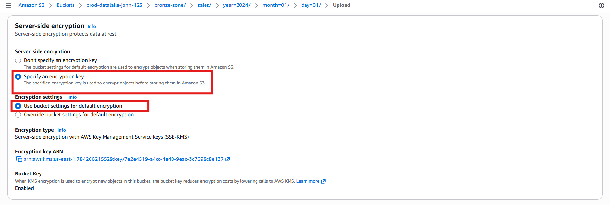
  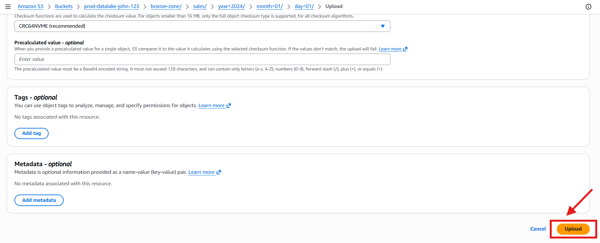
15. Click **Upload** → confirm **"Upload succeeded"**.
  
---

## Step 6.2 — View and Restore a Previous Version

1. Navigate to `bronze-zone/sales/year=2024/month=01/day=01/`.
2. Click on `sample_data.csv`.
  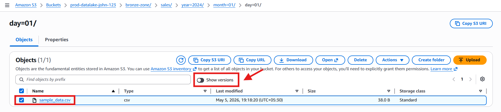
3. Click the **Versions** tab.
  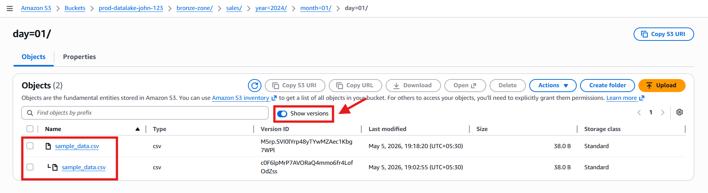
4. You will see two versions listed — the current version and the previous one, each with a unique **Version ID** and timestamp.
5. Click on the **older version** → **Download** — confirm it still contains the original values (`100`, `200`).
  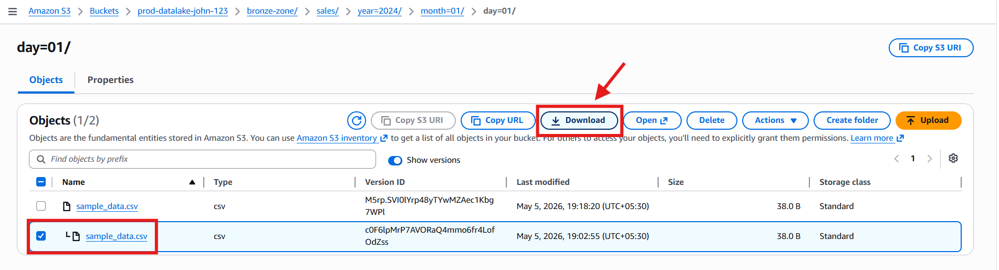

> ✅ This is versioning-based disaster recovery in action. Even if a pipeline overwrites or corrupts a Bronze file, the original is always recoverable from version history. Combined with the lifecycle rule for noncurrent versions, you retain full history for 730 days without paying Standard storage rates for archived versions.

---

## Step 6.3 — Test Delete Marker Behavior

1. Turn OFF version view (important) →  Select `sample_data.csv` (current version, without selecting a specific Version ID) → click **Delete** → type `delete` to confirm.
  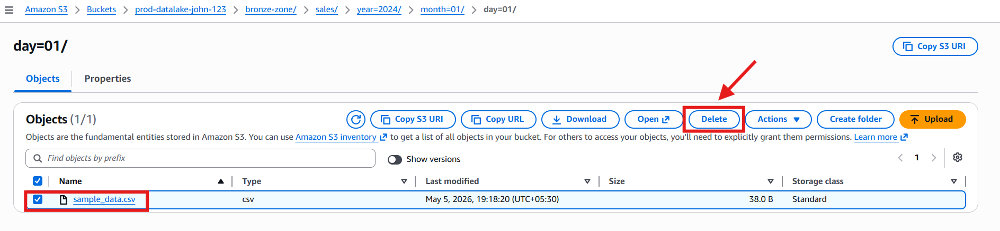
  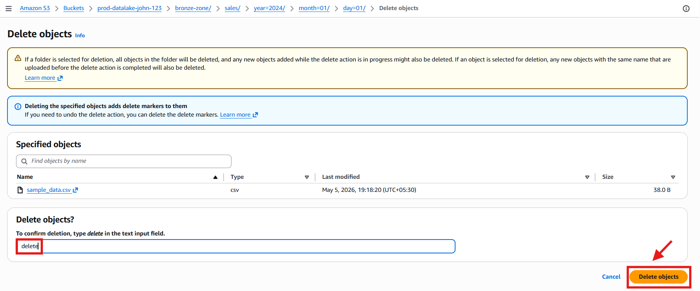
2. The object appears gone from the standard S3 console view.
  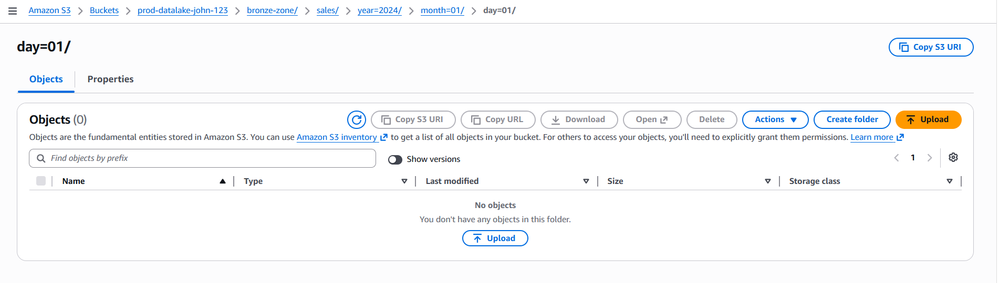
3. Enable the **Show versions** toggle at the top of the object list.
4. You will see both prior versions still exist, plus a new **Delete marker** entry.
5. To restore: select the **Delete marker** row → **Delete** → confirm. The file is now visible and accessible again.
  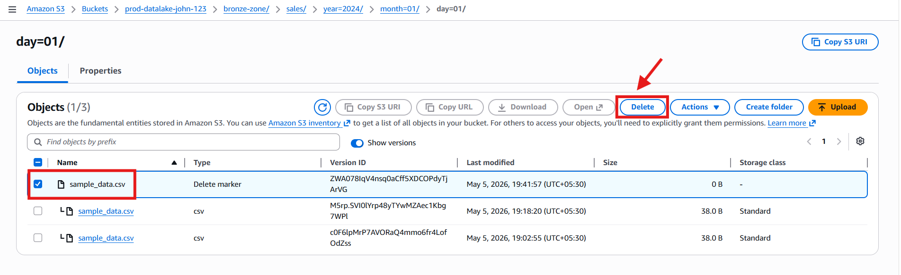
  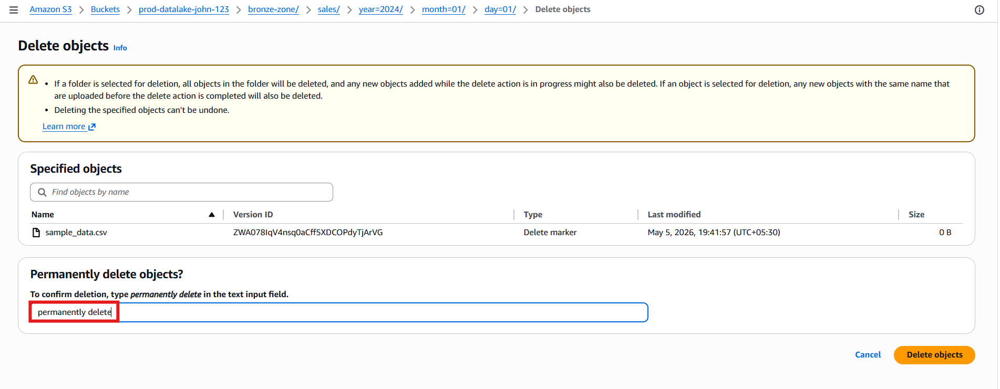
  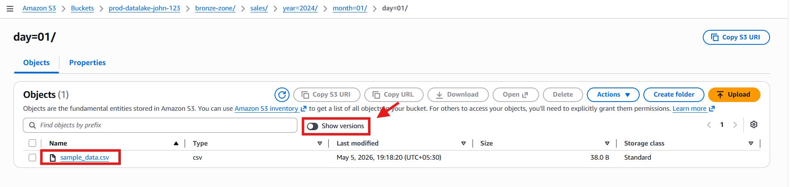

> 💡 Versioning with delete markers means S3 "deletion" is non-destructive by default. Permanent deletion only occurs when you explicitly delete a **specific Version ID** — this is why the lifecycle rule's 730-day noncurrent version expiration step is required to actually reclaim storage over time.

---

# Final Deliverables

- [ ] IAM Role `DataLake-Production-Execution-Role` created with S3 and KMS permissions
- [ ] KMS Customer Managed Key `alias/datalake-production-key` created and Key ARN saved
- [ ] S3 bucket created with versioning enabled, public access blocked, and SSE-KMS default encryption configured
- [ ] Zone prefixes provisioned: `bronze-zone/`, `silver-zone/`, `gold-zone/`
- [ ] Hive-style partitioned folder structure created inside each zone
- [ ] Bucket policy applied — enforces KMS encryption on all uploads, denies plain HTTP, and scopes read/write access by zone prefix
- [ ] Lifecycle rule `bronze-zone-archival-policy` configured: Standard-IA at 90 days, Glacier Instant Retrieval at 365 days, noncurrent version transitions and 730-day expiry included
- [ ] Lifecycle rule `gold-zone-intelligent-tiering` configured for automatic cost optimization
- [ ] SNS topic `datalake-bronze-ingest-notifications` created with access policy allowing S3 to publish
- [ ] S3 Event Notification `bronze-zone-object-created` configured — scoped to `bronze-zone/`, all object create events, wired to SNS topic
- [ ] Versioning tested — multiple object versions confirmed, original version downloaded and verified
- [ ] Delete marker behavior tested and file recovery via delete marker deletion confirmed

---

# Architecture Summary

```
prod-datalake-yourname-xxxx  (SSE-KMS | Versioning ON | Block Public Access)
│
├── bronze-zone/                          ← Raw ingestion (CSV/JSON as-is)
│   └── sales/year=2024/month=01/day=01/  ← Hive partition: daily granularity
│       └── sample_data.csv
│           → Lifecycle: Standard-IA @ 90d → Glacier Instant Retrieval @ 365d
│           → Noncurrent versions: IA @ 30d → Glacier @ 90d → Deleted @ 730d
│
├── silver-zone/                          ← Cleaned, Parquet-converted
│   └── sales_cleaned/year=2024/month=01/ ← Monthly partition granularity
│       → No lifecycle rule (actively queried, Standard storage appropriate)
│
└── gold-zone/                            ← KPI aggregates, ML-ready features
    └── monthly_revenue_summary/year=2024/month=01/
        → Lifecycle: Intelligent-Tiering @ 0d (automatic cost optimization)

Bucket Policy Enforces:
  ✅ All uploads must use your KMS key (rejects SSE-S3 and unencrypted)
  ✅ All traffic must use HTTPS/TLS (rejects plain HTTP)
  ✅ Read/write access scoped by zone prefix to DataLake-Production-Execution-Role

S3 Event Notifications:
  bronze-zone/ → s3:ObjectCreated:* → SNS: datalake-bronze-ingest-notifications
  (extensible to SQS + Lambda → Glue ETL trigger in production)

IAM Role: DataLake-Production-Execution-Role
  → AmazonS3FullAccess
  → AWSKeyManagementServicePowerUser

KMS Key: alias/datalake-production-key
  → Administrators: your IAM user
  → Key Users: DataLake-Production-Execution-Role
```

---

# Lab Outcomes

By completing this lab, you have hands-on experience provisioning a production-grade, secure, and cost-optimized Data Lake on AWS S3 — applying the core patterns that enterprise data engineering teams use at scale:

- **Customer-managed KMS encryption** — full control over key rotation, audit, and revocation
- **Per-zone least-privilege bucket policies** — pipeline roles can only access the zones they need
- **Versioning-based disaster recovery** — every overwrite is preserved, every accidental deletion is reversible
- **Automated cost tiering via lifecycle policies** — Bronze raw data costs 83% less after 365 days; Gold auto-optimizes based on real access patterns
- **Event-driven ingestion notifications** — S3 Event Notifications wired to SNS eliminate polling and enable automatic pipeline triggering on Bronze file arrival

These are the foundational skills required before layering AWS Glue transformations, Amazon Athena querying, or AWS Lake Formation governance on top of this storage layer.

---

# Additional Resources

- [Amazon S3 Versioning](https://docs.aws.amazon.com/AmazonS3/latest/userguide/Versioning.html)
- [SSE-KMS Encryption for S3](https://docs.aws.amazon.com/AmazonS3/latest/userguide/UsingKMSEncryption.html)
- [S3 Bucket Policies — Condition Keys](https://docs.aws.amazon.com/AmazonS3/latest/userguide/amazon-s3-policy-keys.html)
- [S3 Lifecycle Configuration Guide](https://docs.aws.amazon.com/AmazonS3/latest/userguide/lifecycle-configuration-examples.html)
- [AWS KMS Key Policies](https://docs.aws.amazon.com/kms/latest/developerguide/key-policies.html)
- [Medallion Architecture — Databricks](https://www.databricks.com/glossary/medallion-architecture)
- [Amazon S3 Storage Classes](https://aws.amazon.com/s3/storage-classes/)
- [S3 Intelligent-Tiering](https://aws.amazon.com/s3/storage-classes/intelligent-tiering/)
- [S3 Event Notifications](https://docs.aws.amazon.com/AmazonS3/latest/userguide/NotificationHowTo.html)
- [Amazon SNS — S3 as Event Source](https://docs.aws.amazon.com/sns/latest/dg/sns-s3-event-source.html)
- [IAM Roles for AWS Services](https://docs.aws.amazon.com/IAM/latest/UserGuide/id_roles_create_for-service.html)