## GuidedProject: Data Lake Governance with Lake Formation & LF-Tags

---

## 🌟 Overview: What is the purpose of this Lab?

Welcome to Lab 12 — Data Lake Governance with AWS Lake Formation! Define LF-Tags for data sensitivity (`PII`, `Confidential`, `Public`), assign tags to databases, tables, and columns, and map tag-based permissions to two IAM personas — a **Data Analyst** and a **Data Engineer**. Verify that access boundaries hold by querying via Athena as each persona.

**The Purpose of this Lab:**
You are part of a data team responsible for securing a data lake. Different users — a **Data Analyst** and a **Data Engineer** — should have controlled access based on data sensitivity. Your task is to implement tag-based access control using Lake Formation and verify that each persona can only access the data they are permitted to view.

**Services Used:**

| Service | Role in this Lab |
|---|---|
| **AWS Lake Formation** | Create LF-Tags, assign tags to catalog resources, grant tag-based permissions, revoke IAMAllowedPrincipals super permissions |
| **Amazon Athena** | Query engine used to verify access boundaries as each persona |
| **AWS IAM** | Create and manage the Data Analyst and Data Engineer user personas |
| **AWS Glue** | Host the Data Catalog — the database and table definitions that Lake Formation governs |

By the end of this lab, you will have:

- Created a fresh S3 bucket with the required folder structure for this lab.
- Created a Glue Data Catalog database and tables representing Gold zone data.
- Defined LF-Tags for data sensitivity levels: `PII`, `Confidential`, and `Public`.
- Assigned LF-Tags to databases, tables, and individual columns based on their sensitivity classification.
- Created two IAM personas — `DataAnalystUser` and `DataEngineerUser` — with distinct Lake Formation tag-based permissions.
- Verified access boundaries by querying tagged tables via Amazon Athena as each persona.

### Learning Path:

1. **Authentication:** Configure your AWS Console access and set the correct region.
2. **Environment Setup:** Create two IAM users (Data Analyst and Data Engineer) and attach managed policies.
3. **S3 Setup:** Create the S3 bucket, folder structure, and then attach the inline S3 policy to both users using the real bucket name.
4. **Lake Formation Setup:** Set the admin user. Leave Data Catalog settings at default (both IAM-only boxes unchecked).
5. **Glue Catalog Setup:** Create the database and tables that represent your data lake assets.
6. **LF-Tag Creation:** Define sensitivity tags (`PII`, `Confidential`, `Public`) in Lake Formation.
7. **Tag Assignment:** Assign LF-Tags to databases, tables, and columns based on sensitivity classification.
8. **Permission Mapping:** Grant tag-based permissions to each IAM persona using Lake Formation. Revoke IAMAllowedPrincipals super permissions.
9. **Access Verification:** Switch to each persona and query Athena to confirm access boundaries hold.

---

## 📊 Dataset / Knowledge Source Used

This lab uses two manually defined tables in the Glue Data Catalog pointing to S3 folders. No real data files are required — the governance and access control behavior is verified at the catalog layer via Athena.

| Table             | Zone | S3 Prefix                    | Description                                                                                                |
| ----------------- | ---- | ---------------------------- | ---------------------------------------------------------------------------------------------------------- |
| `customers`       | Gold | `gold-zone/customers/`       | Customer master table — contains PII columns: `email`, `phone`. Non-PII: `customer_id`, `name`, `region`, `signup_date`. |
| `monthly_revenue` | Gold | `gold-zone/monthly_revenue/` | Monthly aggregated revenue KPIs — non-PII, tagged `Confidential`. Contains `region`, `revenue`, `orders`, `year`, `month`. |

---

## Activities & Completion Checklist

- [ ] IAM user `DataAnalystUser` created with console access and saved credentials
- [ ] IAM user `DataEngineerUser` created with console access and saved credentials
- [ ] `DataAnalystUser` granted `AmazonAthenaFullAccess` and `AWSGlueConsoleFullAccess` only
- [ ] `DataEngineerUser` granted `AmazonAthenaFullAccess`, `AWSGlueConsoleFullAccess`, and `AWSLakeFormationDataAdmin`
- [ ] S3 bucket `datalake-governance-lab-yourname` created
- [ ] Folders `gold-zone/customers/` and `gold-zone/monthly_revenue/` created in the bucket
- [ ] Inline S3 policy `AthenaQueryResultsS3Access` attached to both IAM users (Step 2.3)
- [ ] Lake Formation Data Catalog settings — both IAM-only boxes left **unchecked**
- [ ] `DataEngineerUser` added as Lake Formation Data lake administrator
- [ ] Glue database `governance_lab_db` created (Location field left blank)
- [ ] Glue table `customers` created with correct schema and S3 location
- [ ] Glue table `monthly_revenue` created with correct schema and S3 location
- [ ] LF-Tag `data_sensitivity` created with values: `PII`, `Confidential`, `Public`
- [ ] `customers` table tagged: table-level `Confidential`, columns `email` and `phone` tagged `PII`
- [ ] `monthly_revenue` table tagged: `Confidential`
- [ ] `DataEngineerUser` granted Lake Formation tag-based permission for `data_sensitivity=Confidential` and `data_sensitivity=PII`
- [ ] `DataAnalystUser` granted Lake Formation tag-based permission for `data_sensitivity=Confidential` only
- [ ] `IAMAllowedPrincipals` Super permissions revoked for `governance_lab_db` database and both tables
- [ ] Athena workgroup configured with query result S3 path
- [ ] Queried `monthly_revenue` as `DataAnalystUser` — access confirmed ✅
- [ ] Queried `customers` as `DataAnalystUser` — `email` and `phone` columns blocked ✅
- [ ] Explicit PII column SELECT as `DataAnalystUser` — access denied ✅
- [ ] Queried `customers` as `DataEngineerUser` — full table access confirmed ✅

---

## Configure AWS Credentials

- Login to AWS Console:
  - Click on the `Lab Access` icon on the desktop.
    
  - Click on `Access Lab` and using the given credentials login to AWS Console.
    
  - Once logged in, set the region to `us-east-1`. All resources must be created in **US-EAST-1 (N. Virginia)**.
  - Locate the region selector at the top-right corner of the console.
    
  - Choose **us-east-1 (N. Virginia)**.
    

---

# Activity 1: Environment Setup — Create IAM Personas

## Step 1.1 — Create the Data Analyst IAM User

The `DataAnalystUser` represents a business analyst persona that should be allowed to query aggregated, non-PII data only.

1. In the AWS Console, search for `IAM` → go to **IAM Users** → click **Create user**.
   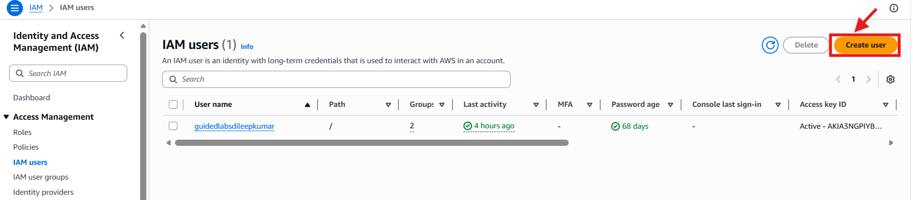
2. **User name:** `DataAnalystUser`
3. Check **"Provide user access to the AWS Management Console"**.
4. Select **Custom password** → enter a password (e.g., `Analyst@12345`).
5. **Uncheck** `"Users must create a new password at next sign-in"` — this avoids a forced reset when you log in as this persona later.
6. Click **Next**.
   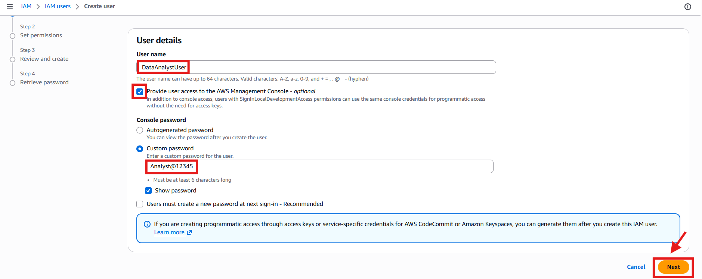
7. On the permissions page, **do not attach any policies** → click **Next** → click **Create user**.
   
   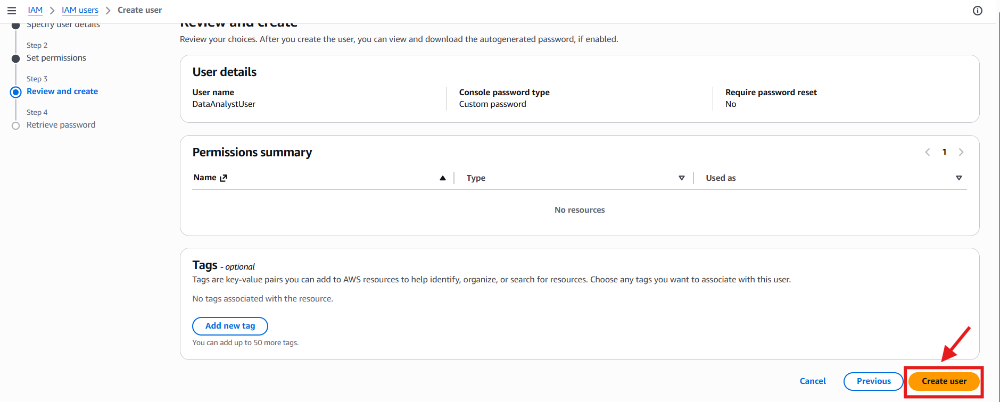
8. **Save the console sign-in URL, username, and password** — you will need these to switch personas later.
   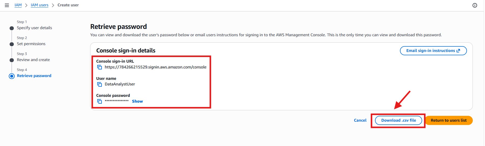
9. Click **Download .csv file** to save the IAM user credentials locally for later persona switching.

> 💡 The Data Analyst intentionally has no IAM policies attached at this stage. Policies will be attached in Step 1.3.

---

## Step 1.2 — Create the Data Engineer IAM User

The `DataEngineerUser` represents a pipeline engineer who requires access to all data including PII columns.

1. In **IAM** → **Users** → click **Create user**.
   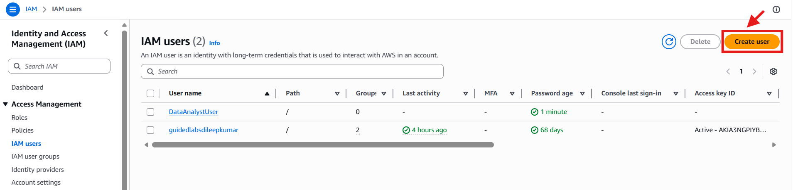
2. **User name:** `DataEngineerUser`
3. Check **"Provide user access to the AWS Management Console"**.
4. Select **Custom password** → enter a password (e.g., `Engineer@12345`).
5. **Uncheck** `"Users must create a new password at next sign-in"` — so you can log in directly as this persona without being forced to reset.
6. Click **Next**.
   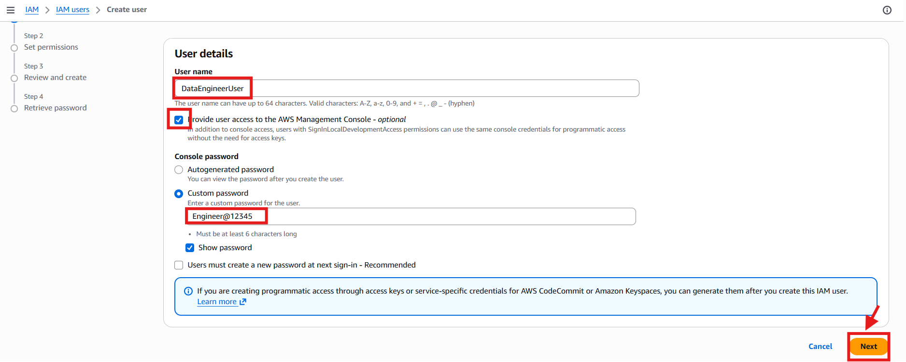
7. On the permissions page, **do not attach any policies** → click **Next** → click **Create user**.
   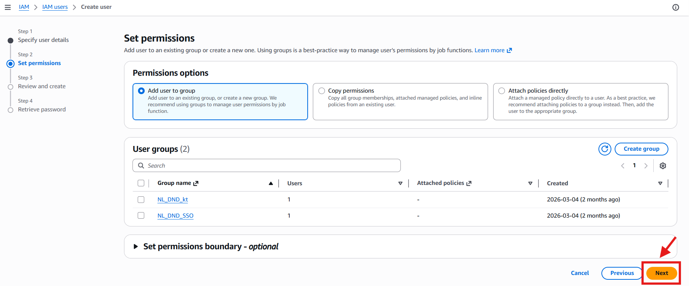
   
8. **Save the credentials** for this user as well.
   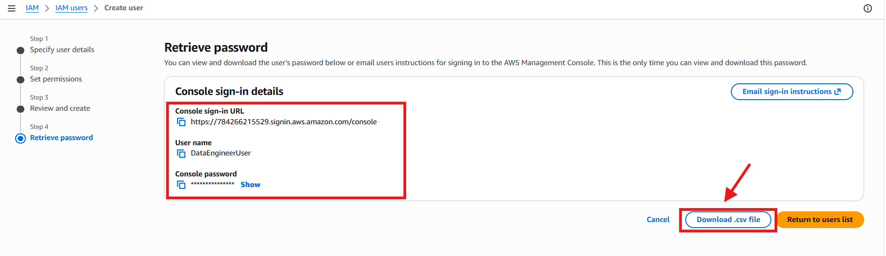
9. Click **Download .csv file** to save the IAM user credentials locally for later persona switching.

---

## Step 1.3 — Attach Policies to Both Users

The two personas have **different** policy sets — this is intentional. `DataAnalystUser` must NOT have `AWSLakeFormationDataAdmin` because that policy grants broad admin-level data access that overrides LF-Tag column-level restrictions.

1. In **IAM** → **Users** → click **DataAnalystUser** → **Add permissions** → **Attach policies directly**.
   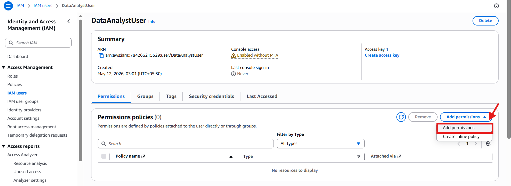
2. Search and attach **only these two** policies for `DataAnalystUser`:
   - `AmazonAthenaFullAccess`
   - `AWSGlueConsoleFullAccess`
   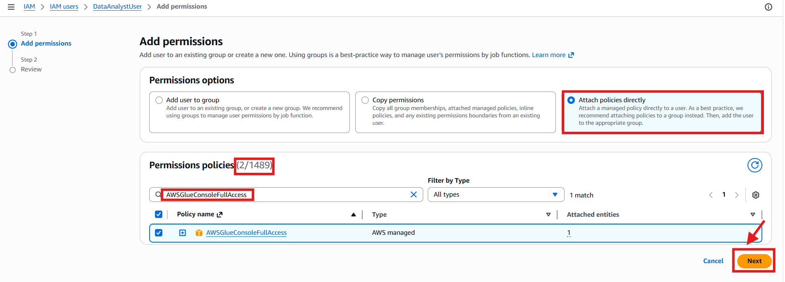
3. Click **Next** → Click **Add permissions** .
   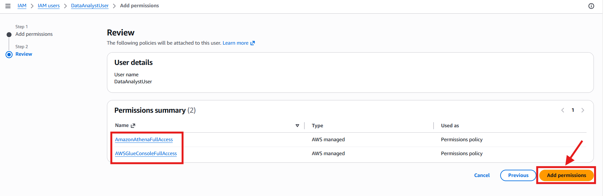
4. Now click **DataEngineerUser** → **Add permissions** → **Attach policies directly**.
   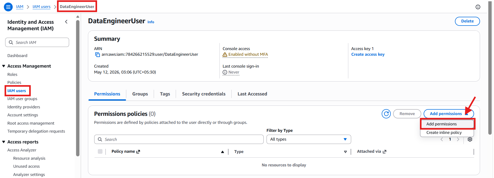
5. Search and attach **all three** policies for `DataEngineerUser`:
   - `AmazonAthenaFullAccess`
   - `AWSGlueConsoleFullAccess`
   - `AWSLakeFormationDataAdmin`
   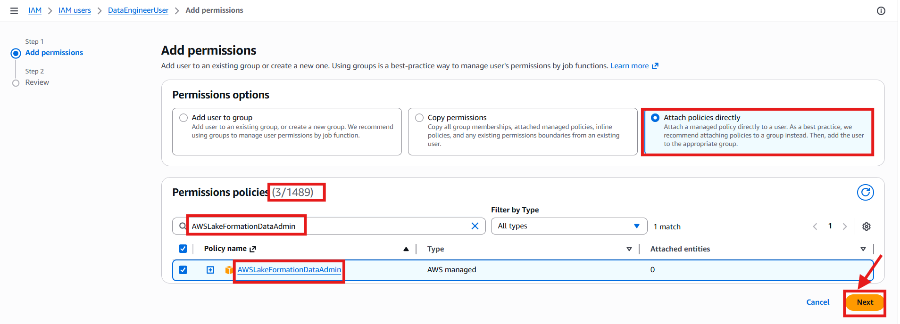
6. Click **Add permissions**.
   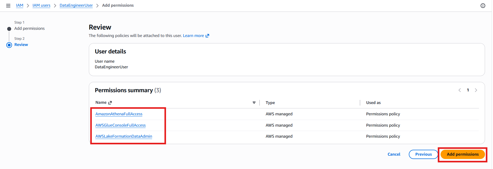

> ⚠️ **Critical:** Do NOT attach `AWSLakeFormationDataAdmin` to `DataAnalystUser`. This policy bypasses Lake Formation column-level tag restrictions. The Analyst's data access is controlled entirely by LF-Tag permissions — IAM only provides service access (Athena, Glue).

> 💡 `AWSLakeFormationDataAdmin` is required for `DataEngineerUser` to act as the Lake Formation administrator — creating LF-Tags, assigning them to catalog resources, and granting permissions to other users.

---

# Activity 2: S3 Setup — Create Bucket & Folder Structure

## Step 2.1 — Create the S3 Bucket

1. In the AWS Console, search for **S3** → click **Create bucket**.
   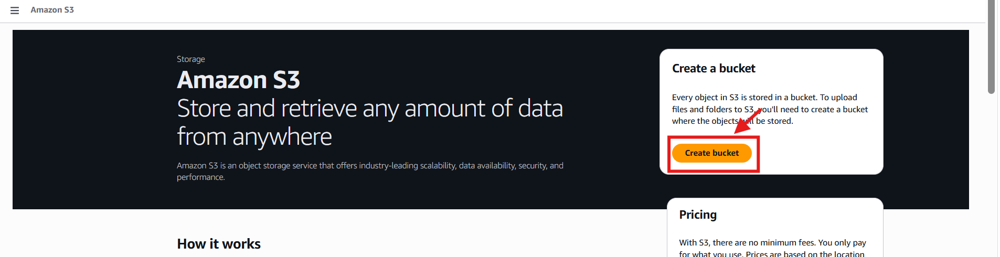
2. **Bucket name:** `datalake-governance-lab-yourname` (e.g., `datalake-governance-lab-dileep`) — must be globally unique.
3. **AWS Region:** `us-east-1`
   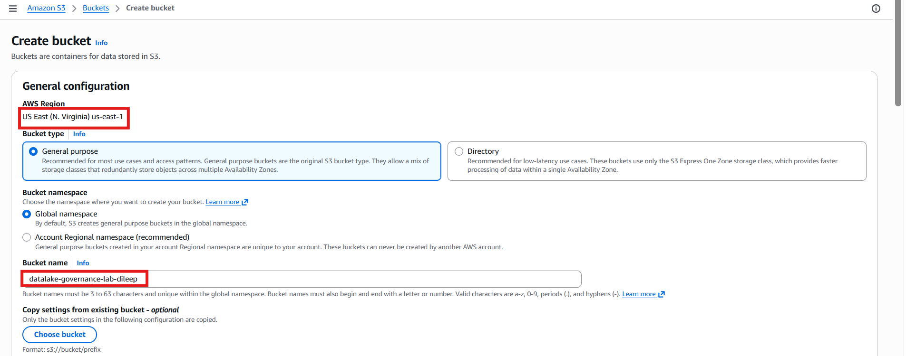
4. Leave all other settings as default — keep **Block all public access** enabled.
5. Click **Create bucket**.
   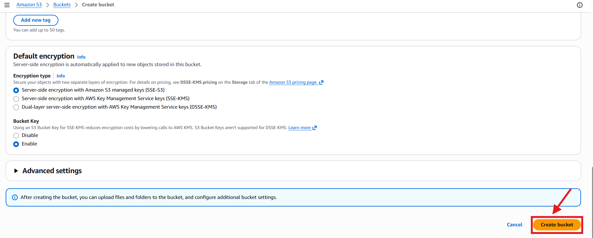

---

## Step 2.2 — Create the Folder Structure

1. Click into your newly created bucket.
2. Click **Create folder** → **Folder name:** `gold-zone` → click **Create folder**.
   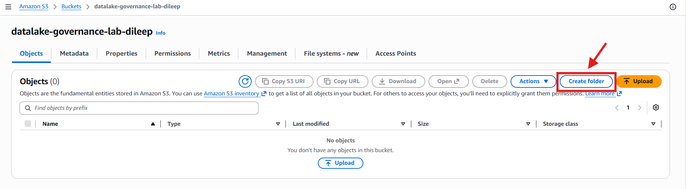
   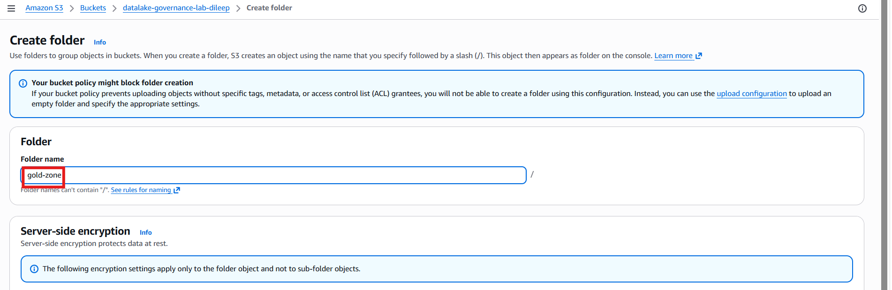
3. Click into the `gold-zone/` folder → click **Create folder** → **Folder name:** `customers` → click **Create folder**.
   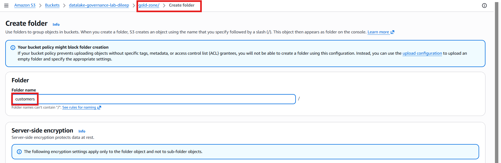
4. Go back to `gold-zone/` → click **Create folder** → **Folder name:** `monthly_revenue` → click **Create folder**.
   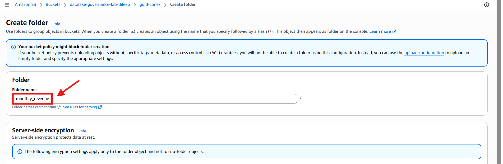

Your final folder structure should look like:
```
datalake-governance-lab-yourname/
└── gold-zone/
    ├── customers/
    └── monthly_revenue/
```
   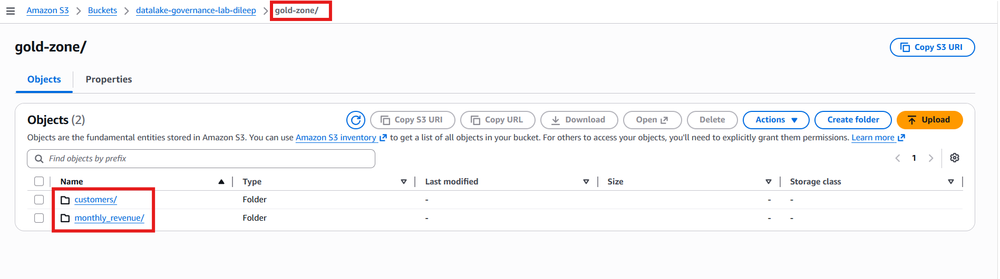


> ✅ The S3 structure is ready. Glue tables will reference these folder paths directly.

---

## Step 2.3 — Add Inline S3 Policy to Both IAM Users

Now that the bucket has been created and you know its exact name, go back to IAM and add an inline policy to both users granting them S3 access to this bucket. This is required for Athena to write and read query results.

> 💡 This step was intentionally placed here — after bucket creation — because the inline policy requires your actual bucket name in the ARN. You cannot complete this step until the bucket exists.

1. In the AWS Console → search for **IAM** → go to **Users** → click **DataAnalystUser**.
2. Click **Add permissions** → select **"Create inline policy"**.
   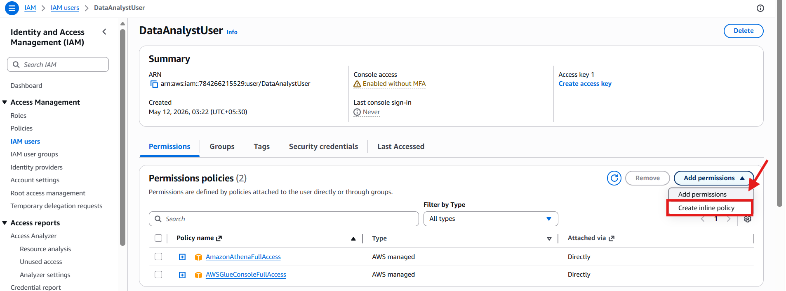
3. On the **"Specify permissions"** page → click the **JSON** tab in the policy editor.
4. Replace the existing content with the following JSON — **substituting your actual bucket name**:

```json
{
  "Version": "2012-10-17",
  "Statement": [
    {
      "Sid": "AthenaResultsAccess",
      "Effect": "Allow",
      "Action": [
        "s3:ListBucket",
        "s3:GetBucketLocation",
        "s3:GetObject",
        "s3:PutObject",
        "s3:AbortMultipartUpload"
      ],
      "Resource": [
        "arn:aws:s3:::datalake-governance-lab-yourname",
        "arn:aws:s3:::datalake-governance-lab-yourname/*"
      ]
    }
  ]
}
```

   > ⚠️ Replace both occurrences of `datalake-governance-lab-yourname` with your actual bucket name (e.g., `datalake-governance-lab-dileep`).

   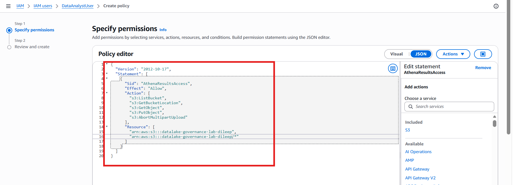
5. Click **Next**.
6. **Policy name:** `AthenaQueryResultsS3Access`
7. Click **Create policy**.
   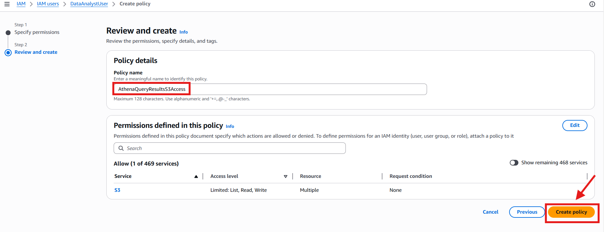
8. Repeat the exact same steps for **DataEngineerUser** — same JSON (with your bucket name), same policy name.
   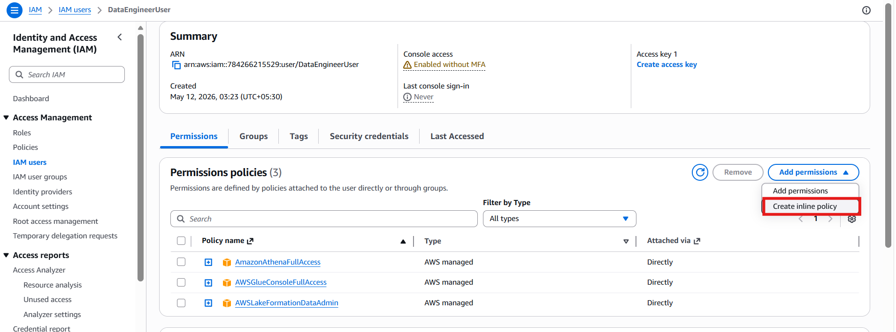
   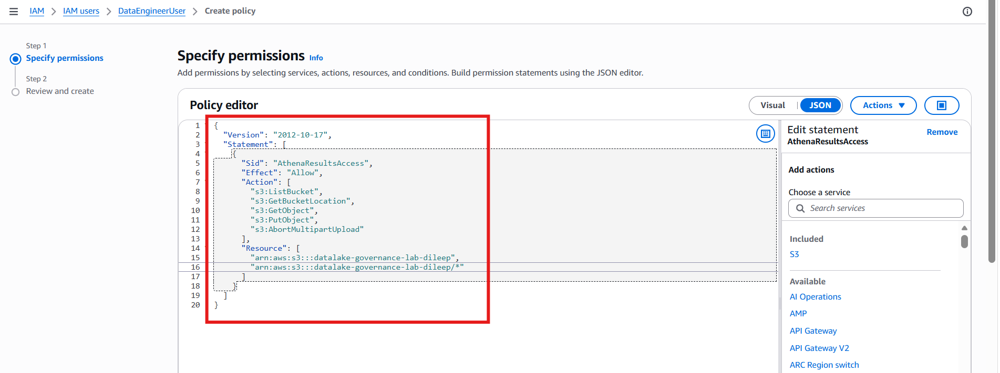
   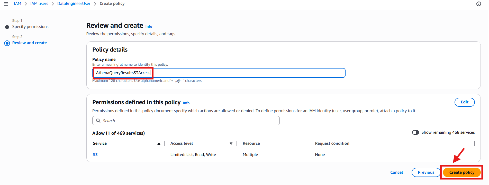

> 💡 This inline policy grants both users the ability to write Athena query results to the S3 bucket and read them back. Without this, Athena queries will fail with an S3 access error even if Lake Formation permissions are correctly set.

---

# Activity 3: Lake Formation Setup — Admin Configuration

## Step 3.1 — Open Lake Formation & Handle Welcome Popup

1. Search for **Lake Formation** in the AWS Console → open the service.
2. When you open Lake Formation for the first time, a **"Welcome to Lake Formation"** popup will appear automatically.
3. In the popup:
   - **Uncheck** "Add myself".
   - Check **"Add other AWS users or roles"** → select `DataEngineerUser` from the dropdown.
   - Click **Get started**.
   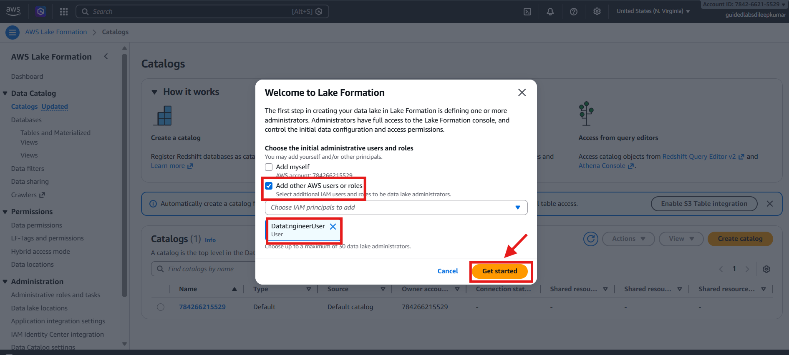
4. Confirm `DataEngineerUser` appears in the **Data lake administrators** list with **Status: Valid**.
   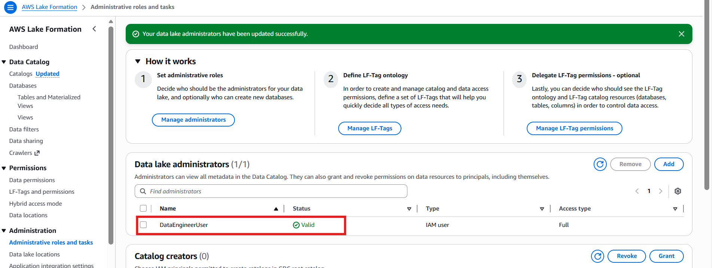

> ✅ `DataEngineerUser` is now the Lake Formation administrator and can create LF-Tags, assign them to catalog resources, and grant permissions to other users.

---

## Step 3.2 — Verify Data Catalog Settings

1. In the left panel → under **Administration** → click **"Data Catalog settings"**.
2. Ensure **both boxes are unchecked**:
   - ☐ "Use only IAM access control for new databases"
   - ☐ "Use only IAM access control for new tables in new databases"
3. Click **Save**.
   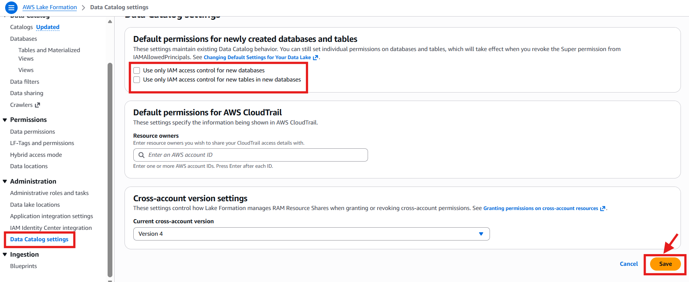

> ⚠️ **Important:** Keep both IAM-only boxes **unchecked**. If these boxes are checked, AWS grants a hidden `Super` permission to `IAMAllowedPrincipals` on every new database and table — which overrides all LF-Tag column-level restrictions. Leaving them unchecked means Lake Formation is the sole access control authority from the start.

---

> 📋 **Note — This activity is not tracked by the Progress Evaluator.** Steps from Activity 4 onwards cannot be validated programmatically because the test runner does not hold Lake Formation `Describe` permissions on the Glue catalog resources — so any API call to inspect tables, LF-Tags, or data permissions returns an `AccessDeniedException`. Complete the steps and verify your results using the expected Athena query outputs shown at each step.

# Activity 4: Glue Data Catalog Setup — Database & Tables

## Step 4.1 — Create the Glue Database

1. Search for **AWS Glue** in the AWS Console → in the left panel go to **Data Catalog** → **Databases** → click **Add database**.
   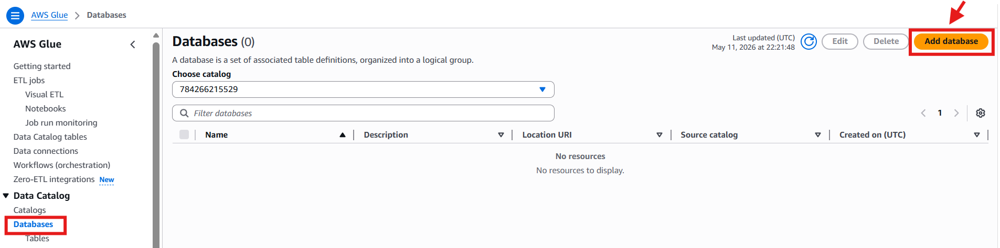
2. **Database type:** Glue Database (default) ✅
3. **Database name:** `governance_lab_db`
4. **Location:** leave this field **blank** — do not enter an S3 path.
5. Click **Create database**.
   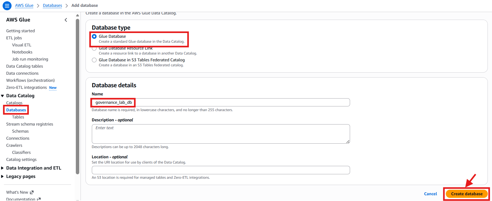

> 💡 Leave the Location field blank. Each table will reference its own S3 path directly — which is what Athena uses for queries.

---

## Step 4.2 — Create the `customers` Table

1. In **Glue** → left panel → **Data Catalog** → **Tables** → click **Add table**.
   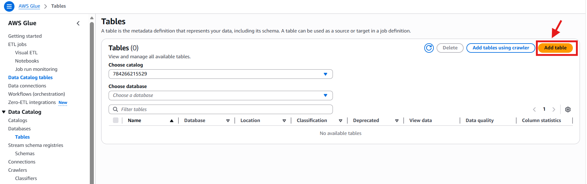
2. Fill in the table details:
   - **Table name:** `customers`
   - **Database:** `governance_lab_db`
3. **Table format:** Standard AWS Glue table (default) ✅
   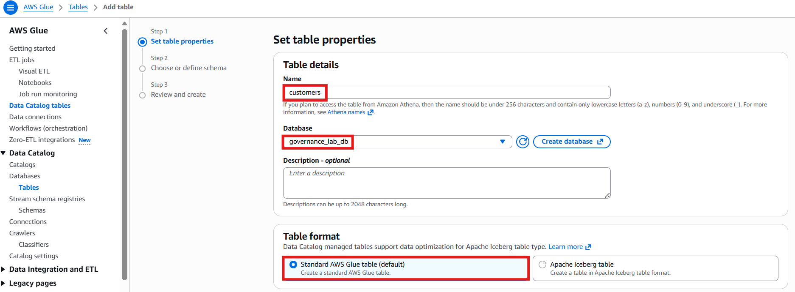
4. **Data store type:** S3 ✅
5. **Data location (Include path):** `s3://datalake-governance-lab-yourname/gold-zone/customers/`

   > ⚠️ Replace `yourname` with your actual bucket name. The path must end with `/`.

6. **Data format / Classification:** CSV
7. Click **Next**.
   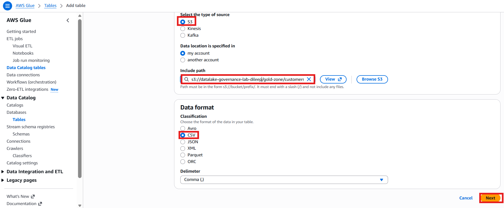
8. On the **"Choose or define schema"** page → click **"Edit schema as JSON"**.
   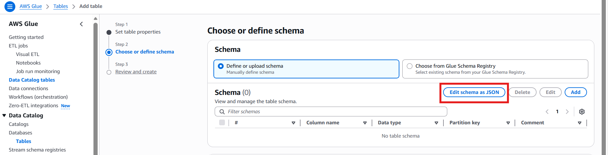
9. Paste the following JSON and click **Save**:

```json
[
  {"Name": "customer_id", "Type": "string"},
  {"Name": "name", "Type": "string"},
  {"Name": "email", "Type": "string"},
  {"Name": "phone", "Type": "string"},
  {"Name": "region", "Type": "string"},
  {"Name": "signup_date", "Type": "string"}
]
```

   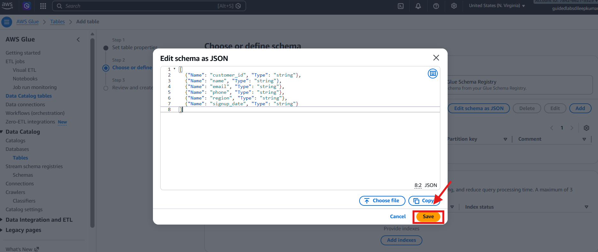
10. Confirm all 6 columns appear in the schema table → click **Next** → click **Create**.
    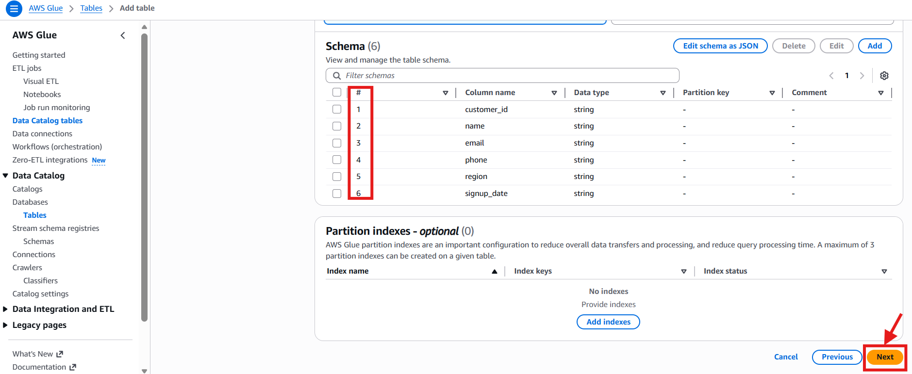

---

## Step 4.3 — Create the `monthly_revenue` Table

1. In **Glue** → **Tables** → click **Add table**.
   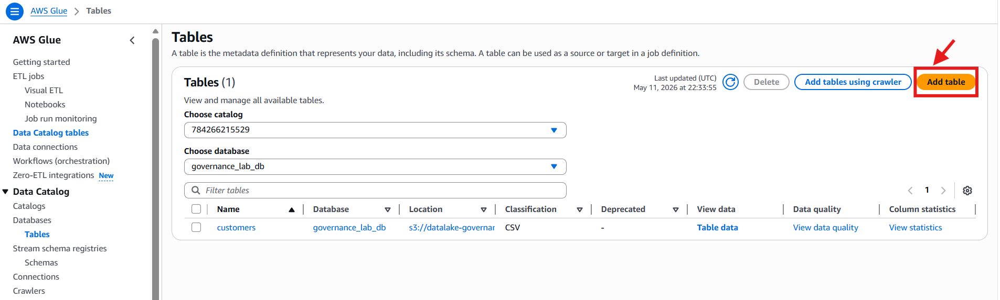
2. Fill in the table details:
   - **Table name:** `monthly_revenue`
   - **Database:** `governance_lab_db`
3. **Table format:** Standard AWS Glue table (default) ✅
   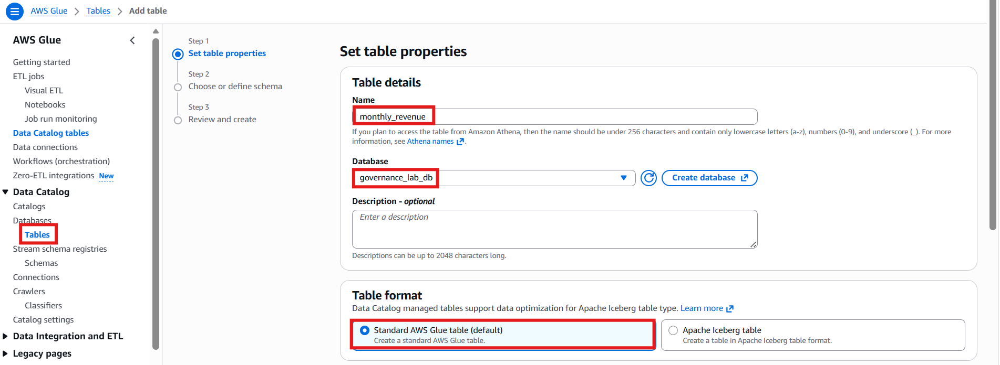
4. **Data store type:** S3 ✅
5. **Data location (Include path):** `s3://datalake-governance-lab-yourname/gold-zone/monthly_revenue/`
6. **Data format / Classification:** CSV
7. Click **Next**.
   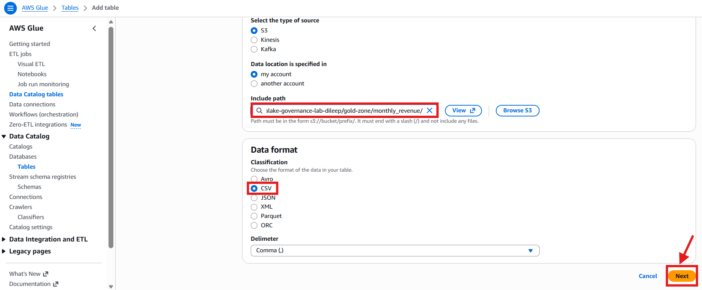
8. On the **"Choose or define schema"** page → click **"Edit schema as JSON"**.
   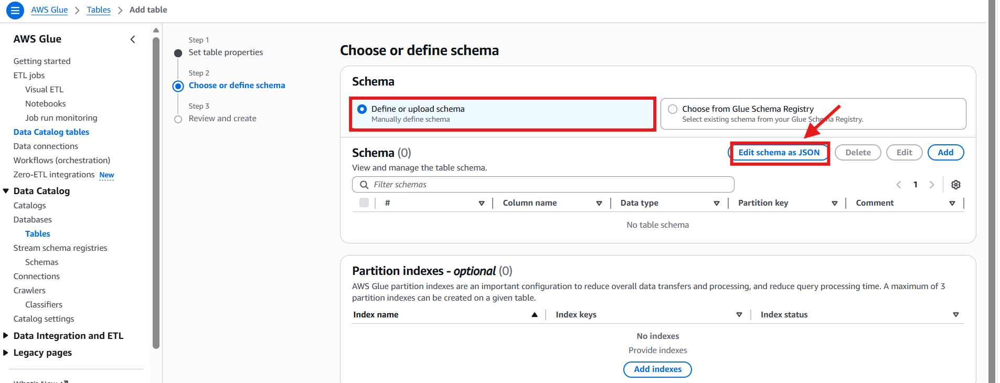
9. Paste the following JSON and click **Save**:

```json
[
  {"Name": "region", "Type": "string"},
  {"Name": "revenue", "Type": "double"},
  {"Name": "orders", "Type": "int"},
  {"Name": "year", "Type": "string"},
  {"Name": "month", "Type": "string"}
]
```

   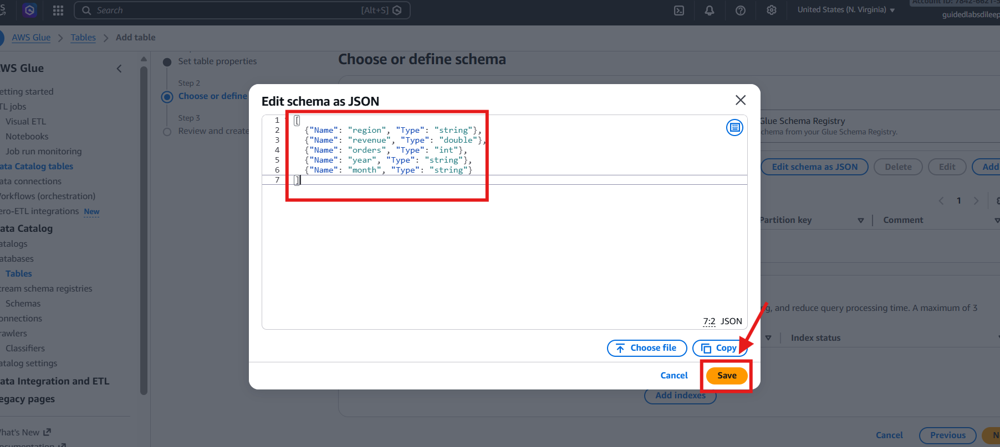
10. Confirm all 5 columns appear → click **Next** → click **Create**.
    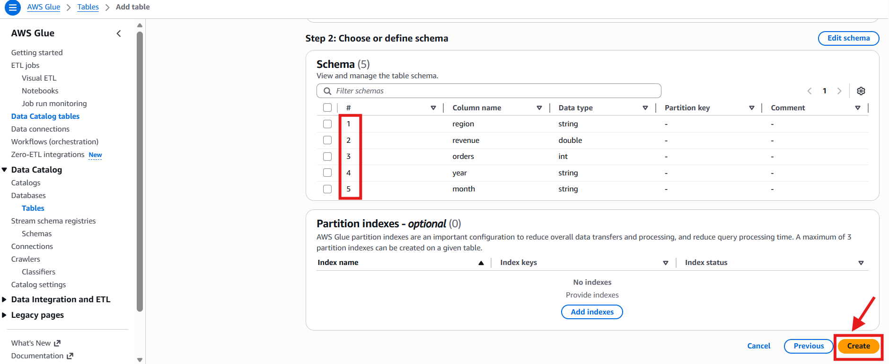

> ✅ Both tables are now registered in the Glue Data Catalog. Lake Formation will apply tag-based permissions to them in the next activity.

---

# Activity 5: LF-Tag Creation — Define Sensitivity Tags

> ⚠️ **Important:** LF-Tags must be created while logged in as `DataEngineerUser` — the Lake Formation administrator. Open a **private/incognito browser window** and sign in as `DataEngineerUser` for all steps in Activities 5, 6, and 7.

## Step 5.1 — Sign in as `DataEngineerUser`

1. Open a **private/incognito browser window**.
2. Navigate to: `https://YOUR_ACCOUNT_ID.signin.aws.amazon.com/console`

   > 💡 Replace `YOUR_ACCOUNT_ID` with your actual AWS Account ID. You can find it in the top-right corner of your main browser console.

3. Sign in with:
   - **IAM username:** `DataEngineerUser`
   - **Password:** `Engineer@12345` (or the password you set during creation)
    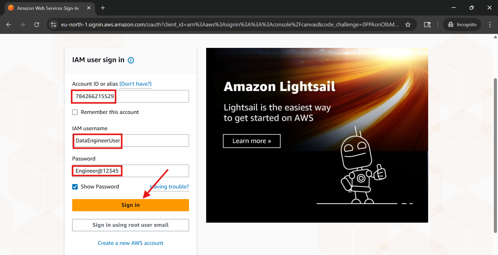
4. Set region to **us-east-1**.
    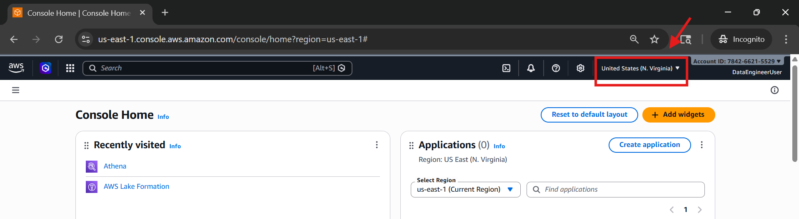

---

## Step 5.2 — Create the `data_sensitivity` LF-Tag

LF-Tags are key-value labels applied to catalog assets. Permissions are then granted based on tag values — not individual table names.

1. Search for **Lake Formation** → open the service.
2. In the left panel → under **Permissions** → click **"LF-Tags and permissions"**.
3. Click the **"LF-Tags"** tab → click **Add LF-Tag**.
   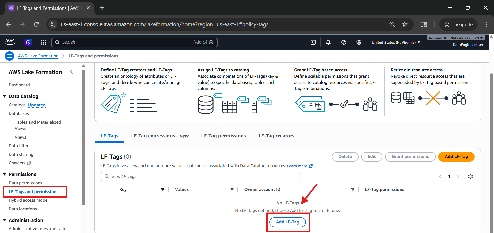
4. **Key:** `data_sensitivity`
5. **Values:** Add the following three values — type each one and press **Add** after each:
   - `PII`
   - `Confidential`
   - `Public`
6. Click **Add**.
   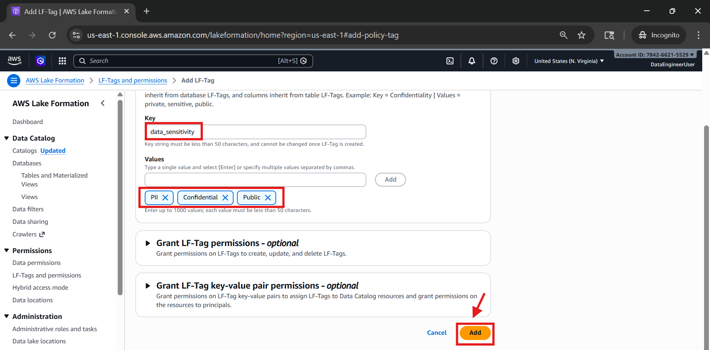
7. Confirm the tag appears in the LF-Tags list:
   - **Key:** `data_sensitivity` | **Values:** `PII, Confidential, Public`
   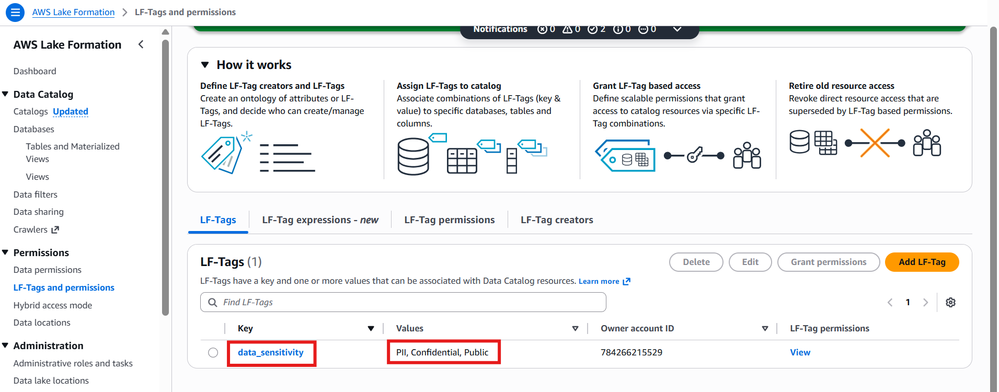

> 💡 This single tag key with three values gives you a flexible classification framework. A table can be tagged `Confidential` at the table level while specific columns within it are additionally tagged `PII` — giving you fine-grained layered control.

---

# Activity 6: Tag Assignment — Classify Tables and Columns

> ⚠️ Continue performing all steps in this activity while logged in as `DataEngineerUser` in the incognito window.

## Step 6.1 — Tag the `customers` Table at Table Level

1. In **Lake Formation** → left panel → **Data Catalog** → **Tables and Materialized Views**.
2. In the **"Choose database"** dropdown → select `governance_lab_db`.
3. Select the checkbox next to the `customers` table.
4. Click **Actions** → **Edit LF-Tags**.
   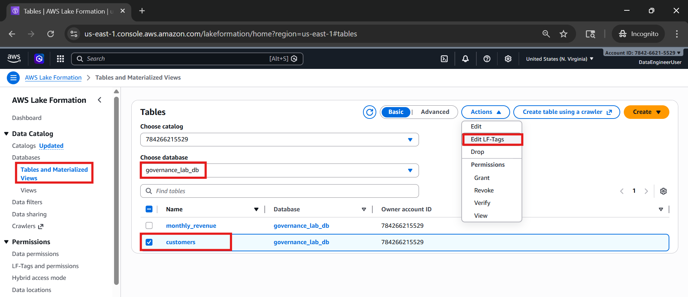
5. Click **Assign new LF-Tag**:
   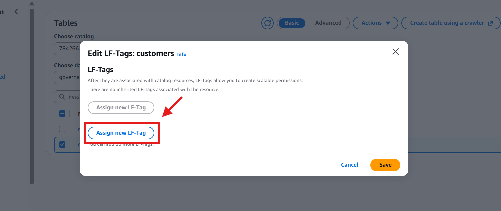
   - **Key:** `data_sensitivity` → **Value:** `Confidential`
   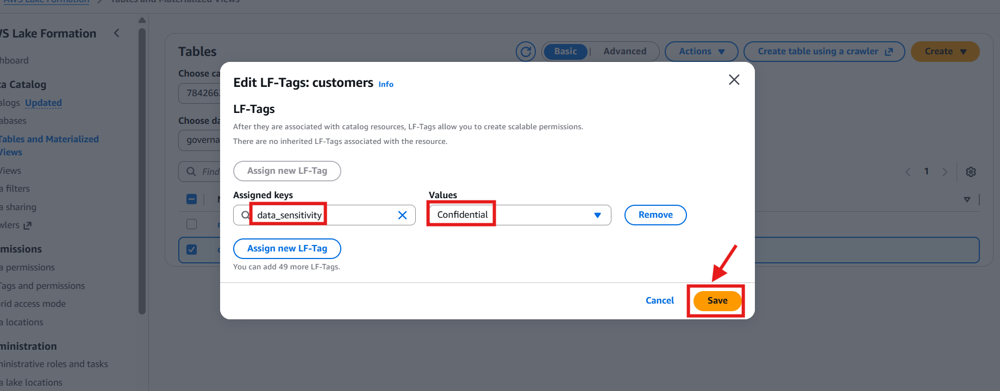
6. Click **Save**.

> The `customers` table as a whole is tagged `Confidential`. The PII-specific columns will be tagged separately at the column level next.

---

## Step 6.2 — Tag PII Columns on the `customers` Table

1. In **Lake Formation** → **Tables and Materialized Views** → click on the `customers` table name to open the table detail page.
   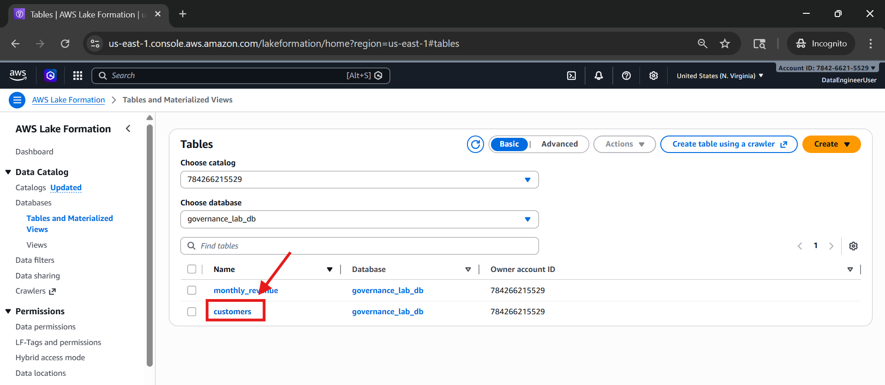
2. Scroll down to the **"Schema"** section.
3. Click **"Edit schema"** button (top right of the Schema section).
   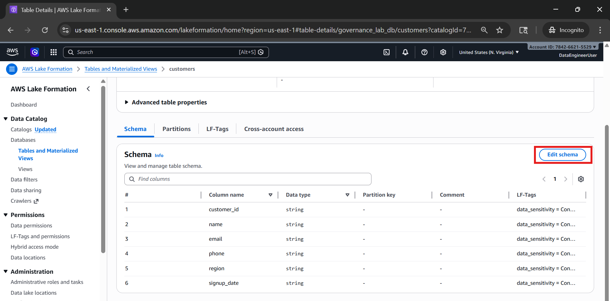
4. The Edit Schema page shows all 6 columns with `data_sensitivity = Confidential` inherited from the table tag.
   
5. Check the checkbox next to the **`email`** row (row 3).
6. Click **"Edit LF-Tags"** button (top right of the schema page).
   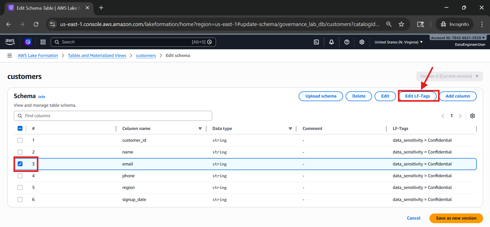
7. The **"Edit LF-Tags: email"** popup appears showing:
   - **Inherited keys:** `data_sensitivity` → **Values:** `Confidential (inherited)`
   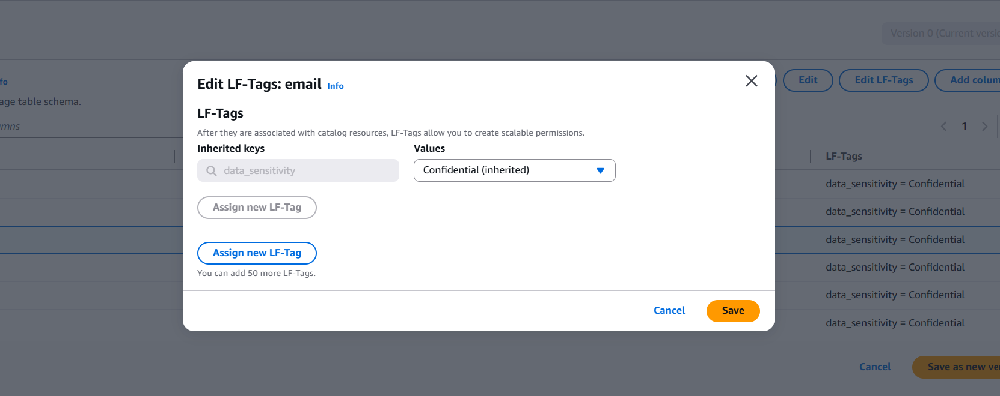
8. Click the **Values dropdown** next to the inherited `data_sensitivity` key → select **`PII`**.
   - The value changes from `Confidential (inherited)` to `PII` and a **Revert** button appears.
   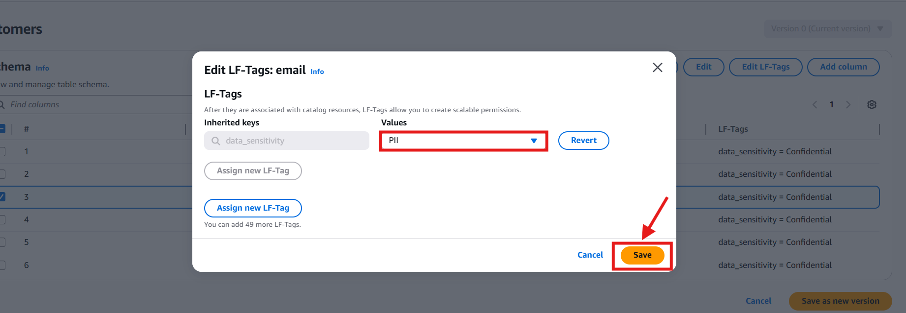
9. Click **Save**.
10. Now check the checkbox next to the **`phone`** row (row 4).
11. Click **"Edit LF-Tags"** button again.
    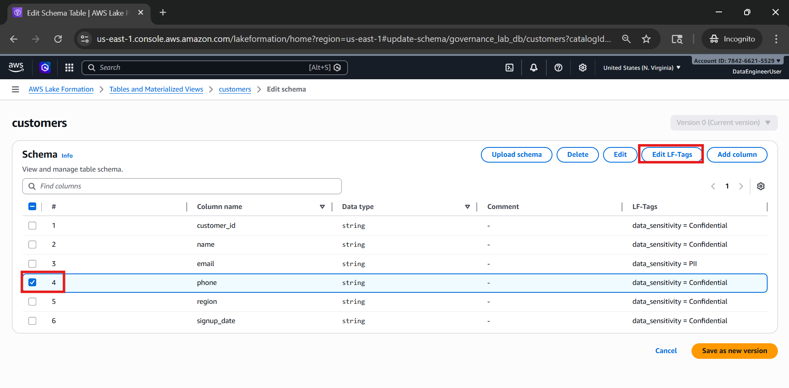
12. In the popup → click the **Values dropdown** → select **`PII`** → click **Save**.
    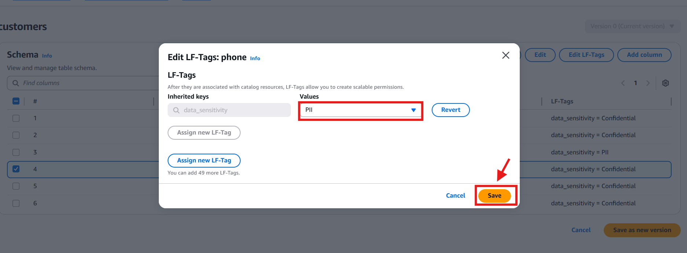
13. Click **"Save as new version"** at the bottom right to save all column tag changes.
    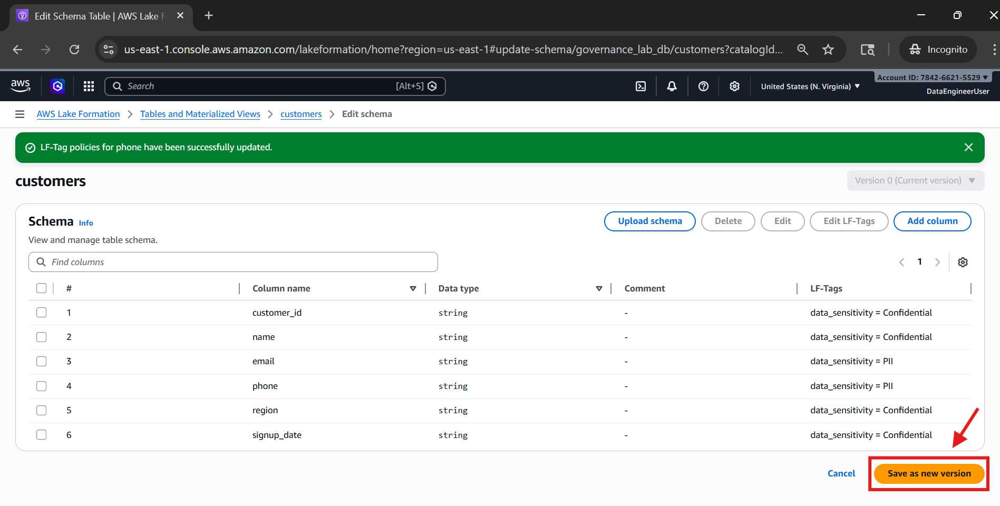
14. Confirm: go back to the **LF-Tags** tab on the `customers` table detail page — `email` and `phone` should show `data_sensitivity = PII`, all other columns should show `data_sensitivity = Confidential`.
    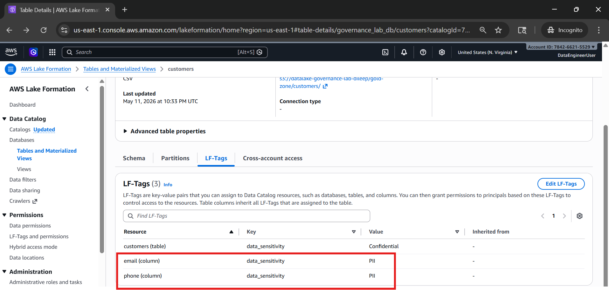

> 💡 Column-level tagging is what enables column-level security in Lake Formation. When a user's tag permissions don't include `PII`, those columns are invisible in Athena query results — they cannot be selected, referenced in WHERE clauses, or accessed in any way.

---

## Step 6.3 — Tag the `monthly_revenue` Table

1. In **Lake Formation** → **Tables and Materialized Views** → select the `monthly_revenue` table checkbox.
2. Click **Actions** → **Edit LF-Tags**.
   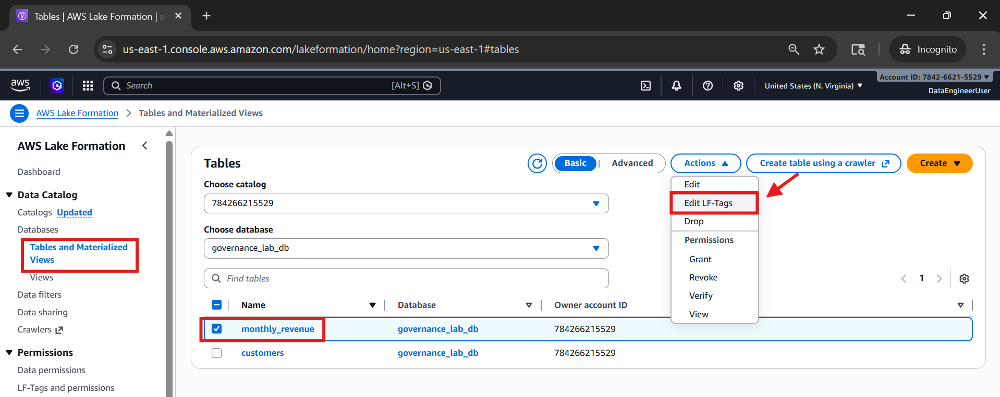
3. Click **Assign new LF-Tag**:
   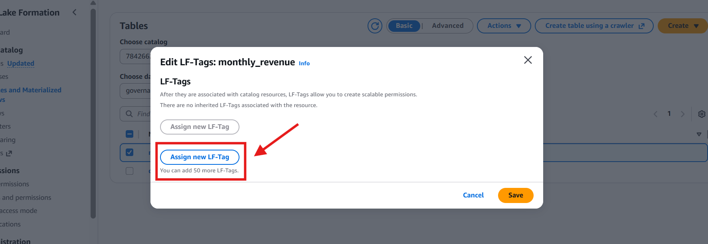
   - **Key:** `data_sensitivity` → **Value:** `Confidential`
   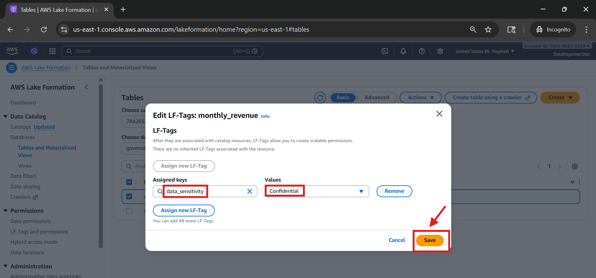
4. Click **Save**.

> ✅ Both tables are now tagged. `customers` is `Confidential` at table level with `PII` on two columns. `monthly_revenue` is `Confidential` throughout.

---

# Activity 7: Permission Mapping — Grant Tag-Based Access to Each Persona

> ⚠️ Continue performing all steps in this activity while logged in as `DataEngineerUser` in the incognito window.

## Step 7.1 — Grant Permissions to `DataEngineerUser`

The Data Engineer requires full access to all data — including PII columns. We grant permissions for both `Confidential` and `PII` tag values.

1. In **Lake Formation** → left panel → under **Permissions** → click **"Data permissions"** → click **Grant**.
   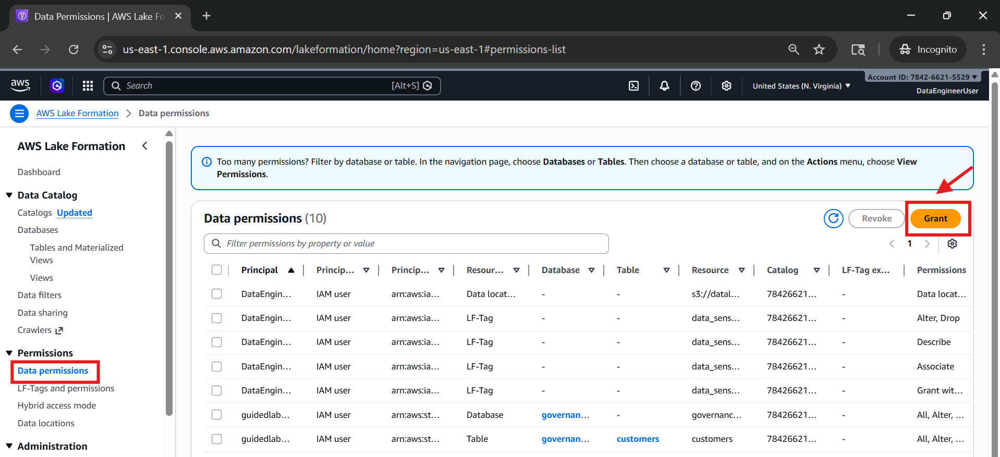
2. **Principal type:** Principals ✅
3. **Principals:** IAM users and roles → select `DataEngineerUser`
   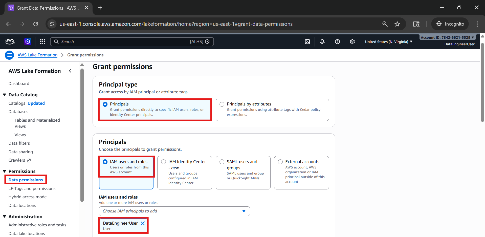
4. **LF-Tags or catalog resources:** select **"Resources matched by LF-Tags (recommended)"**
5. Click **Add LF-Tag key-value pair**:
   - **Key:** `data_sensitivity` → **Values:** select `Confidential` and `PII`
   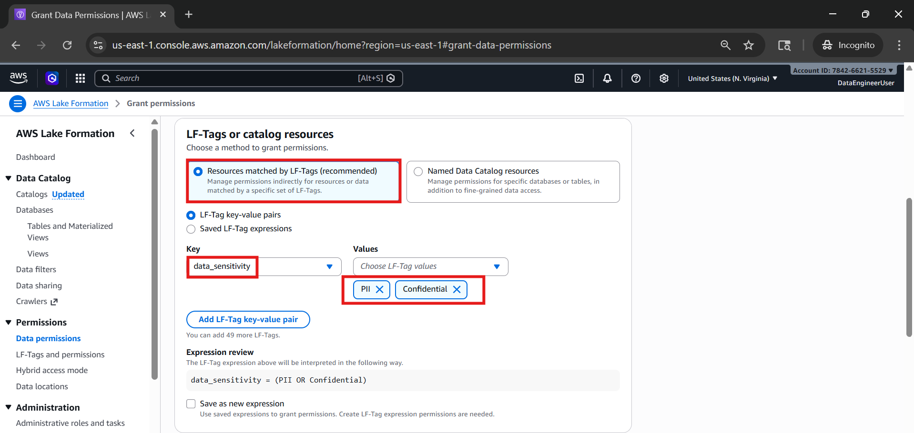
6. **Database permissions:** check `Describe`
7. **Table permissions:** check `Select` and `Describe`
8. **Grantable permissions:** leave all unchecked
   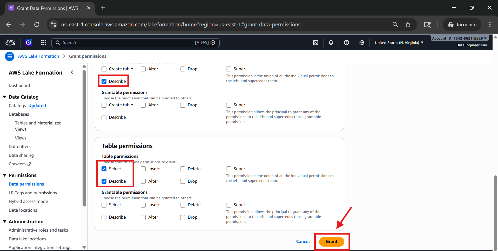
9. Click **Grant**.

> ✅ `DataEngineerUser` can now SELECT all columns — including `email` and `phone` — from any table tagged `Confidential` or `PII`.

---

## Step 7.2 — Grant Permissions to `DataAnalystUser`

The Data Analyst should be able to query `monthly_revenue` and see the `customers` table — but PII columns (`email`, `phone`) must be invisible.

1. In **Lake Formation** → **Permissions** → **Data permissions** → click **Grant**.
   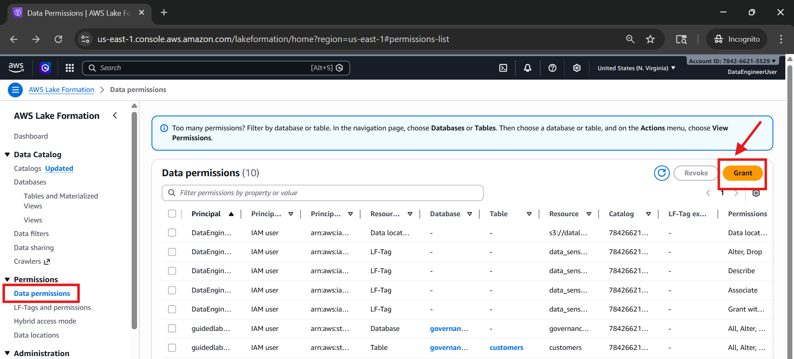
2. **Principal type:** Principals ✅
3. **Principals:** IAM users and roles → select `DataAnalystUser`
   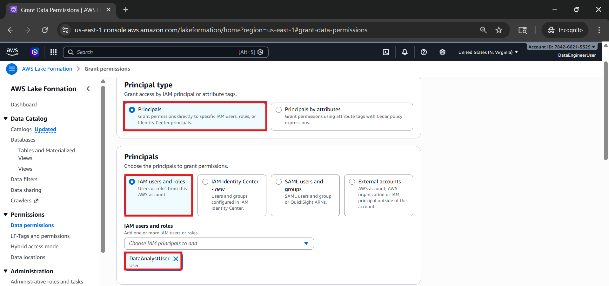
4. **LF-Tags or catalog resources:** select **"Resources matched by LF-Tags (recommended)"**
5. Click **Add LF-Tag key-value pair**:
   - **Key:** `data_sensitivity` → **Values:** select `Confidential` **only** *(do NOT select PII)*
   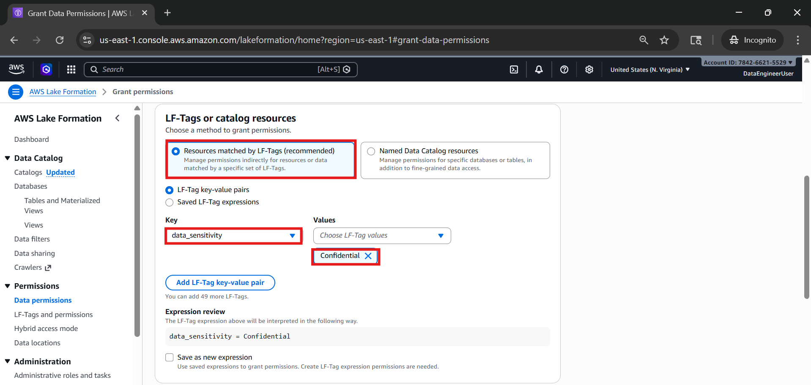
6. **Database permissions:** check `Describe`
7. **Table permissions:** check `Select` and `Describe`
8. **Grantable permissions:** leave all unchecked
   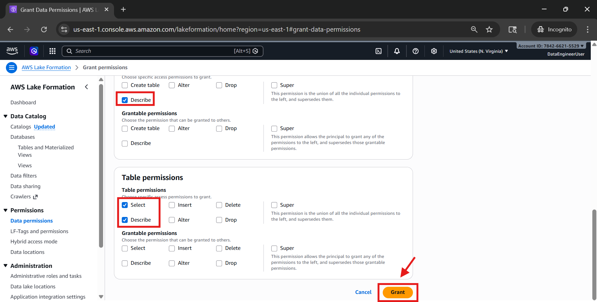
9. Click **Grant**.

> 💡 Since `DataAnalystUser` only has permission for `data_sensitivity=Confidential`, any column tagged `PII` will be automatically excluded from their query results — no additional column filter configuration is required. The tag handles it entirely.

---

# Activity 8: Access Verification — Query via Athena as Each Persona

## Step 8.1 — Configure Athena Query Result Location

Before switching personas, configure the Athena workgroup with a query result S3 path. Do this from your **main browser** (admin user).

1. In the AWS Console → search **Athena** → go to **Workgroups**.
2. Click **primary** workgroup → **Edit**.
   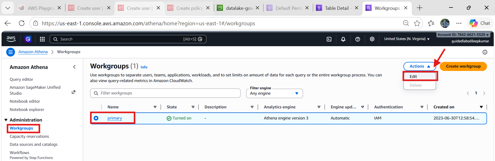
3. Under **Query result location**, enter: `s3://datalake-governance-lab-yourname/athena-results/`
   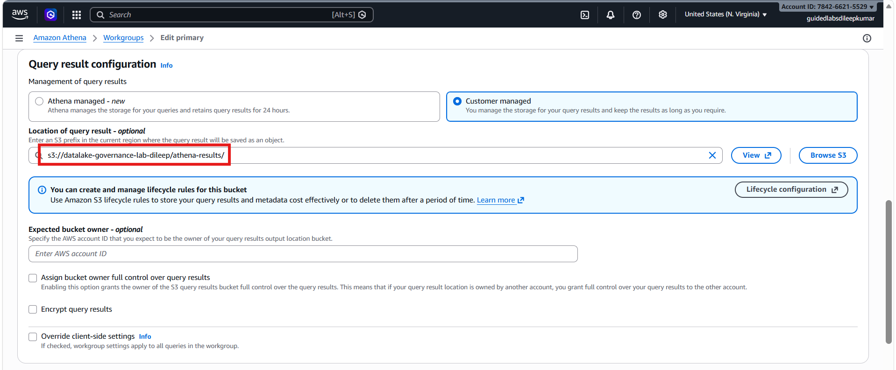
   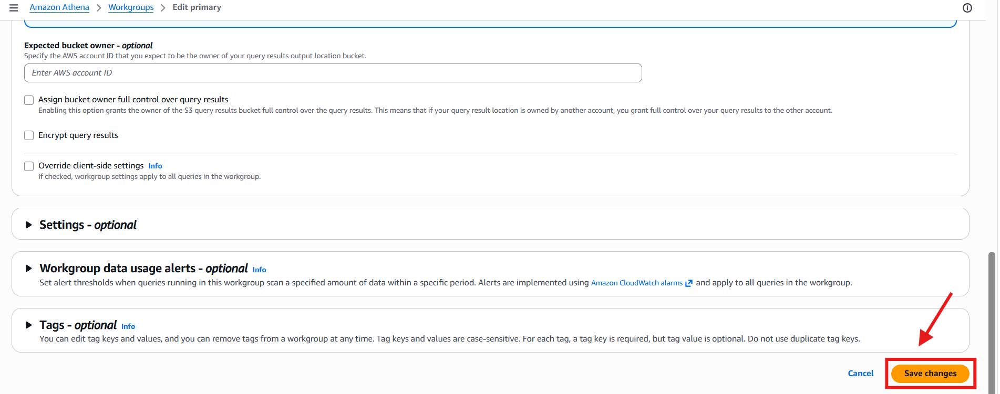
4. Click **Save changes**.

> 💡 The `athena-results/` folder does not need to be pre-created — Athena will create it automatically on the first query.

---

## Step 8.2 — Verify Access as `DataAnalystUser`

1. Open a **private/incognito browser window**.
2. Navigate to the AWS Console sign-in URL → sign in as `DataAnalystUser`.
   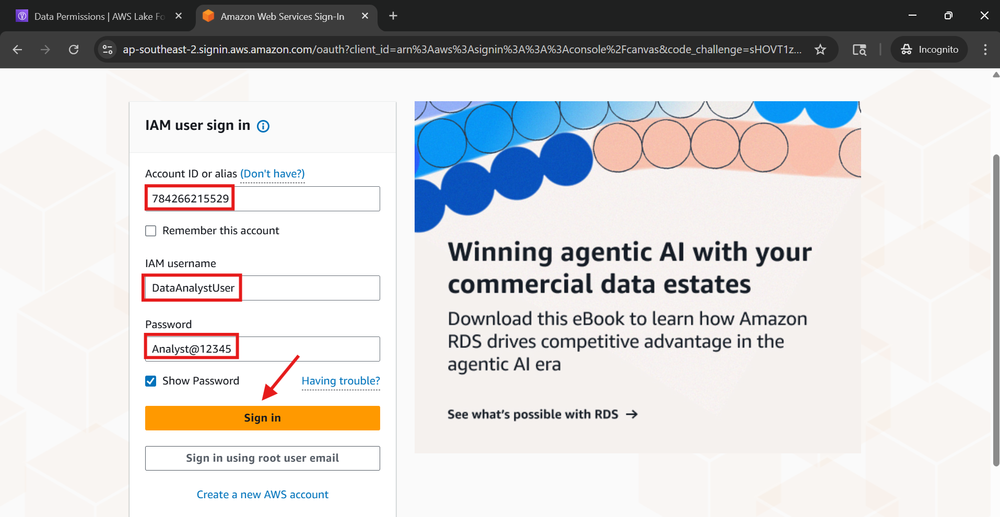
3. Set region to **us-east-1**.
4. Search for **Athena** → open **Query Editor**.
   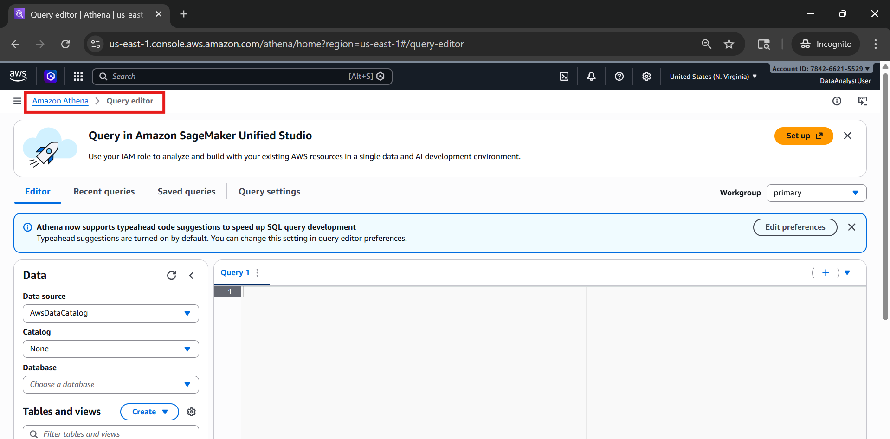

**Test 1 — Query `monthly_revenue` (should succeed):**

```sql
SELECT * FROM governance_lab_db.monthly_revenue LIMIT 10;
```

Expected result: Query runs successfully and returns **0 rows** — but all 5 columns are visible in the result schema: `region`, `revenue`, `orders`, `year`, `month`. ✅

> 💡 **Why 0 rows?** The S3 folder `gold-zone/monthly_revenue/` is empty — no CSV data files were uploaded in this lab. The purpose of this query is to confirm that **the query executes without an access denied error** and that **all 5 columns are visible** in the result schema.

**What you will see in Athena:**

```
Query successful.
region | revenue | orders | year | month
-------+---------+--------+------+------
(0 rows)
```
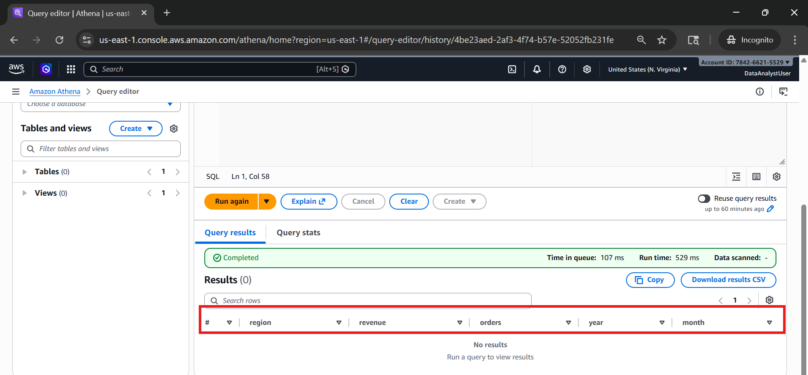

**Test 2 — Query `customers` full table (PII columns should be hidden):**

```sql
SELECT * FROM governance_lab_db.customers LIMIT 10;
```

Expected result: Query runs successfully and returns **0 rows** — but only 4 columns are visible in the result schema: `customer_id`, `name`, `region`, `signup_date`. The `email` and `phone` columns are **completely absent**. ✅

**What you will see in Athena:**

```
Query successful.
customer_id | name | region | signup_date
------------+------+--------+------------
(0 rows)
```

> ✅ Notice `email` and `phone` are not in the column headers at all — they are invisible at the catalog layer due to the `PII` tag.

   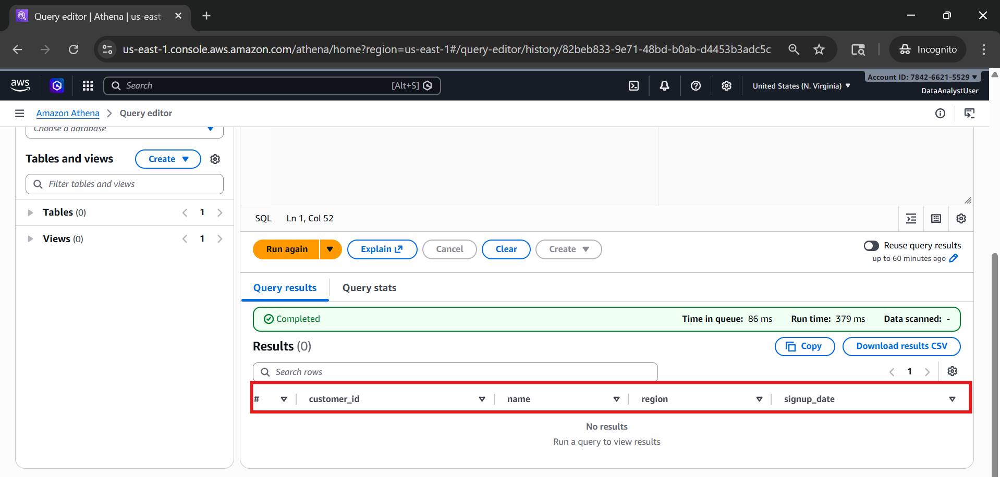

**Test 3 — Attempt to select PII columns directly (should fail):**

```sql
SELECT customer_id, name, email, phone FROM governance_lab_db.customers LIMIT 10;
```

Expected result: Query **fails** with a column not found / access denied error for `email` and `phone`. ✅

**What you will see in Athena:**

```
FAILED
COLUMN_NOT_FOUND: Column 'phone' cannot be resolved or requester is not authorized to access requested resources
```

> ✅ The query is blocked at the catalog layer — not at the data layer. The Analyst cannot access PII columns regardless of whether data exists in S3.

   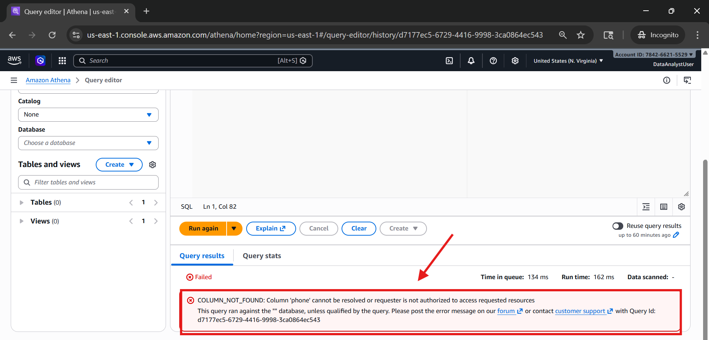

> ✅ The Data Analyst can query non-PII data freely. PII columns are invisible at the catalog layer — they cannot be reached even by explicitly naming them in a SELECT.

---

## Step 8.3 — Verify Access as `DataEngineerUser`

1. Use the existing **incognito window** where you are already signed in as `DataEngineerUser`.
   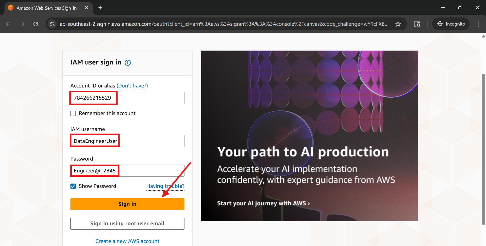
2. Set region to **us-east-1**.
3. Search for **Athena** → open **Query Editor**.

**Test 1 — Query `customers` with PII columns (should succeed fully):**

```sql
SELECT customer_id, name, email, phone, region FROM governance_lab_db.customers LIMIT 10;
```

Expected result: Query runs successfully and returns **0 rows** — but all 5 requested columns are visible in the result schema, including `email` and `phone`. ✅

**What you will see in Athena:**

```
Query successful.
customer_id | name | email | phone | region
------------+------+-------+-------+-------
(0 rows)
```

> ✅ Compare this to `DataAnalystUser`'s result — the Analyst saw only 4 columns with `email` and `phone` missing. The Engineer sees all 5 columns, proving the tag-based access boundary is working correctly.

   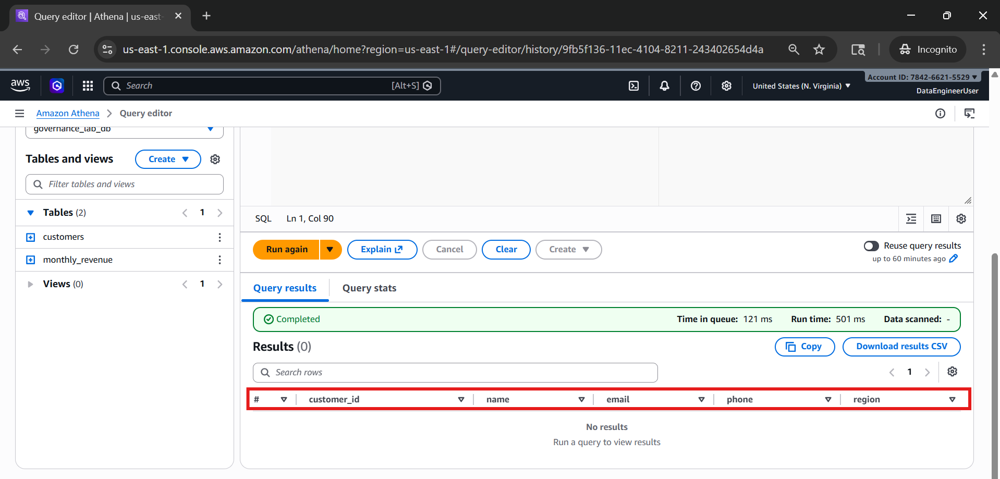

**Test 2 — Query `monthly_revenue` (should succeed):**

```sql
SELECT * FROM governance_lab_db.monthly_revenue LIMIT 10;
```

Expected result: Query runs successfully and returns **0 rows** — all 5 columns visible in the result schema. ✅

**What you will see in Athena:**

```
Query successful.
region | revenue | orders | year | month
-------+---------+--------+------+------
(0 rows)
```

> ✅ Identical column visibility to `DataAnalystUser` — both personas can access `monthly_revenue` since it has no PII columns and both hold `Confidential` tag permission.

   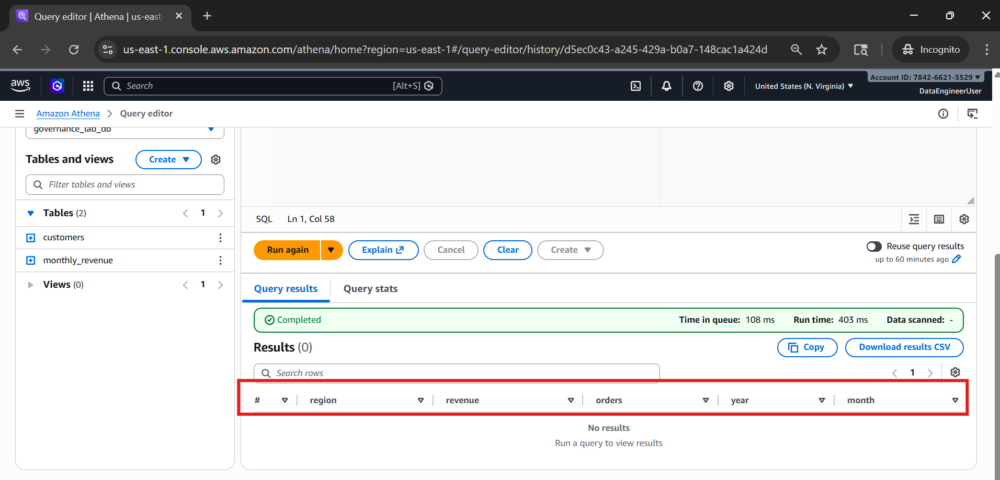


> ✅ The Data Engineer has full access to all tagged data — including PII columns — because their Lake Formation permissions cover both `Confidential` and `PII` tag values.

---

# Final Deliverables

- [ ] IAM user `DataAnalystUser` created with `AmazonAthenaFullAccess`, `AWSGlueConsoleFullAccess`, and inline `AthenaQueryResultsS3Access` only
- [ ] IAM user `DataEngineerUser` created with `AmazonAthenaFullAccess`, `AWSGlueConsoleFullAccess`, `AWSLakeFormationDataAdmin`, and inline `AthenaQueryResultsS3Access`
- [ ] S3 bucket `datalake-governance-lab-yourname` created in `us-east-1`
- [ ] Folder structure created: `gold-zone/customers/` and `gold-zone/monthly_revenue/`
- [ ] Lake Formation Data Catalog settings — both IAM-only boxes **unchecked**
- [ ] `DataEngineerUser` added as Lake Formation Data lake administrator
- [ ] Glue database `governance_lab_db` created (Location field left blank)
- [ ] Glue table `customers` created with 6-column schema
- [ ] Glue table `monthly_revenue` created with 5-column schema
- [ ] LF-Tag `data_sensitivity` created with values `PII`, `Confidential`, `Public`
- [ ] `customers` table tagged `data_sensitivity=Confidential` at table level
- [ ] `email` column tagged `data_sensitivity=PII`
- [ ] `phone` column tagged `data_sensitivity=PII`
- [ ] `monthly_revenue` table tagged `data_sensitivity=Confidential`
- [ ] `DataEngineerUser` granted tag-based permissions for `Confidential` + `PII`
- [ ] `DataAnalystUser` granted tag-based permissions for `Confidential` only
- [ ] `IAMAllowedPrincipals` Super permissions revoked for database and both tables ✅
- [ ] Athena query result S3 path configured in primary workgroup
- [ ] `DataAnalystUser` — `monthly_revenue` query succeeded ✅
- [ ] `DataAnalystUser` — `customers` query returned schema without `email`/`phone` ✅
- [ ] `DataAnalystUser` — explicit PII column SELECT blocked ✅
- [ ] `DataEngineerUser` — full `customers` query with PII columns succeeded ✅

---

# Architecture Summary

```
S3 Bucket: datalake-governance-lab-yourname
│
└── gold-zone/
    ├── customers/          ← Glue table: customers
    ├── monthly_revenue/    ← Glue table: monthly_revenue
    └── athena-results/     ← Athena query output (auto-created)

Lake Formation Governance Layer
│
├── LF-Tag: data_sensitivity
│   ├── PII          → email, phone columns on customers table
│   ├── Confidential → customers table, monthly_revenue table
│   └── Public       → (available for future use on open datasets)
│
├── Glue Data Catalog: governance_lab_db
│   ├── customers
│   │   ├── Table Tag:  data_sensitivity=Confidential
│   │   ├── Column Tag: email → data_sensitivity=PII  ← blocked for Analyst
│   │   ├── Column Tag: phone → data_sensitivity=PII  ← blocked for Analyst
│   │   └── Visible columns for Analyst: customer_id, name, region, signup_date
│   │
│   └── monthly_revenue
│       ├── Table Tag: data_sensitivity=Confidential
│       └── Full access for both personas
│
├── DataEngineerUser Permissions
│   ├── IAM: AmazonAthenaFullAccess, AWSGlueConsoleFullAccess, AWSLakeFormationDataAdmin
│   └── LF-Tag: data_sensitivity ∈ {Confidential, PII}
│       → SELECT on all tables and all columns including PII
│
└── DataAnalystUser Permissions
    ├── IAM: AmazonAthenaFullAccess, AWSGlueConsoleFullAccess (NO LakeFormationDataAdmin)
    └── LF-Tag: data_sensitivity ∈ {Confidential}
        → SELECT on Confidential-tagged tables
        → PII-tagged columns automatically excluded

IAMAllowedPrincipals Super Permissions: REVOKED ✅
  → Lake Formation is sole access control authority

Verification via Amazon Athena:
  DataAnalystUser  → monthly_revenue:          ✅ Full Access
  DataAnalystUser  → customers (SELECT *):     ✅ PII columns hidden
  DataAnalystUser  → customers (SELECT email): ❌ Access Denied
  DataEngineerUser → customers (SELECT email): ✅ Full Access
```

---

# Lab Outcomes

By completing this lab, you have hands-on experience implementing fine-grained data lake governance using AWS Lake Formation — applying the access control patterns that enterprise data governance teams use at scale:

- **LF-Tag-based access control (TBAC)** — permissions defined by data sensitivity attributes, not individual table names, making governance scalable as data grows
- **Column-level security** — PII columns invisible to unauthorized personas at the catalog layer, enforced before any query reaches S3
- **Persona-based permission mapping** — clean separation between Data Analyst and Data Engineer access boundaries using a single tag key
- **IAMAllowedPrincipals management** — understanding that Super permissions auto-created at resource creation time must be explicitly revoked for LF-Tag column restrictions to take effect
- **IAM vs Lake Formation separation** — IAM controls which AWS services a user can call; Lake Formation controls which data they can see. `AWSLakeFormationDataAdmin` must only be given to users who need to administer Lake Formation — not to data consumers
- **Athena as the verification surface** — confirming that Lake Formation permissions hold end-to-end in a real query environment

These governance patterns are the foundation required before onboarding multiple teams to a shared data lake, enabling self-service analytics without compromising data security or compliance posture.

---

# Additional Resources

- [AWS Lake Formation — Getting Started](https://docs.aws.amazon.com/lake-formation/latest/dg/getting-started.html)
- [LF-Tags (Attribute-Based Access Control)](https://docs.aws.amazon.com/lake-formation/latest/dg/TBAC-overview.html)
- [Column-Level Security in Lake Formation](https://docs.aws.amazon.com/lake-formation/latest/dg/column-level-security.html)
- [Lake Formation Data Permissions](https://docs.aws.amazon.com/lake-formation/latest/dg/data-access.html)
- [IAMAllowedPrincipals and Lake Formation](https://docs.aws.amazon.com/lake-formation/latest/dg/change-settings.html)
- [Amazon Athena — IAM and Lake Formation Integration](https://docs.aws.amazon.com/athena/latest/ug/security-iam-athena.html)
- [AWS Glue Data Catalog](https://docs.aws.amazon.com/glue/latest/dg/catalog-and-crawler.html)
- [Amazon S3 — Creating Buckets](https://docs.aws.amazon.com/AmazonS3/latest/userguide/create-bucket-overview.html)
- [IAM Best Practices — Least Privilege](https://docs.aws.amazon.com/IAM/latest/UserGuide/best-practices.html)
