# Title: Glue Streaming ETL — Kinesis to S3 Silver Zone

---

## 🌟 Overview: What is the purpose of this Lab?

Welcome to your AWS Glue Streaming ETL project! In modern data architectures, real-time data processing is critical for delivering low-latency insights. Unlike batch ETL, streaming ETL processes data continuously as it arrives, making it essential for event-driven pipelines. This lab will guide you through building a robust streaming pipeline using Amazon Kinesis Data Streams and AWS Glue Streaming ETL, writing clean, partitioned output to the Silver zone on Amazon S3.

**The Purpose of this Lab:**
You are part of a data engineering team handling real-time data ingestion. Streaming events — representing e-commerce order transactions — are continuously arriving into a Kinesis Data Stream. Your task is to build an AWS Glue Streaming ETL job that consumes these records, applies transformations (filtering, type casting, and field mapping), and writes partitioned Parquet output to the **Silver zone** on S3. You will also test restart behavior by re-running the job and observing cumulative output in S3.

By the end of this project, you will have:

- Provisioned a **Kinesis Data Stream** as a real-time event source.
- Designed a partitioned S3 data lake with Bronze and Silver zones.
- Built a **Glue ETL job** that reads from Kinesis using boto3 and writes partitioned Parquet to S3.
- Applied transformations including filtering, field derivation, and type casting.
- Tested **restart behavior** by re-running the job and observing cumulative output in S3.
- Queried the Silver zone data using **Amazon Athena** with partition pruning.

### Learning Path:

1. **Authentication:** Configure your AWS Console access and credentials.
2. **Kinesis Setup:** Provision a Kinesis Data Stream as the real-time event source.
3. **S3 Data Lake Zones:** Create Bronze and Silver zone folders with proper partitioning.
4. **Glue ETL Job:** Build, configure, send data, and run the streaming job with transformations.
5. **Validate Output:** Confirm partitioned Parquet files are written correctly to the Silver zone.
6. **Restart & Re-run:** Run the job again and observe cumulative record processing behavior.
7. **Query with Athena:** Catalog and query the Silver zone data using Amazon Athena.

---

## 📊 Dataset / Knowledge Source Used

This lab uses a **simulated e-commerce order event stream**. Events are generated programmatically using a Python producer script run directly in AWS CloudShell, and pushed into your Kinesis Data Stream. You do not need to upload files to S3 manually — the data flows from Kinesis into the Glue job.

**Simulated Event Schema:**

```json
{
  "order_id": "ORD-00123",
  "customer_id": "CUST-456",
  "product_id": "PROD-789",
  "quantity": 2,
  "unit_price": 49.99,
  "status": "PLACED",
  "event_timestamp": "2024-08-01T10:32:00Z",
  "region": "us-east"
}
```

| Field             | Type    | Description                                              |
| ----------------- | ------- | -------------------------------------------------------- |
| `order_id`        | String  | Unique identifier for the order                          |
| `customer_id`     | String  | Unique identifier for the customer                       |
| `product_id`      | String  | SKU identifier for the product                           |
| `quantity`        | Integer | Number of units ordered                                  |
| `unit_price`      | Double  | Per-unit price at time of order                          |
| `status`          | String  | Order status: PLACED, CANCELLED, SHIPPED, or RETURNED    |
| `event_timestamp` | String  | ISO 8601 timestamp of the event                          |
| `region`          | String  | Geographic region of the order (used for S3 partitioning)|

---

## 🛠️ Prerequisites & AWS Setup

Ensure the following are available before starting:

- An **AWS account** with permissions for Kinesis, Glue, S3, IAM, and CloudWatch.
- Access to the **AWS Console** (lab credentials provided).
- A basic familiarity with PySpark concepts (DataFrames, filters, transformations).
- No local Jupyter notebook is required; all activities are performed via the AWS Console, AWS CloudShell, and the Glue Studio script editor.

---

## Configure AWS Credentials

First, log in to the AWS Web Console to set up your environment.

- Login to AWS Console:
  - Click on the `Lab Access` icon on the desktop.

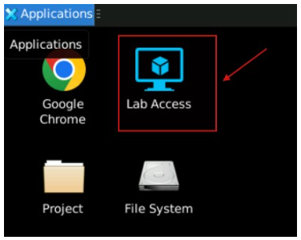

- Click on `Access Lab` and using the given credentials login to AWS Console. This will allow you to access the AWS resources from the Console.


- Once logged in, set the region to `us-east-1`. Create all resources in the **US-EAST-1 (N. Virginia) Region**.

- Steps to select the AWS region in the AWS Console:
  - Locate the region selector at the top-right corner of the console (next to your Account Name).
  - Click on the dropdown, and a list of available AWS Regions will appear.


  - Choose **us-east-1 (N. Virginia)** Region.


---

# Activity 1: Provision the Kinesis Data Stream

**Purpose of this Activity:** To create the real-time event source that your Glue Streaming ETL job will consume. Kinesis Data Streams act as a durable, ordered, and replayable log of streaming events.

### Step 1.1: Create the Kinesis Data Stream

1. In the AWS Management Console search bar, type **Kinesis** and select it from the services menu.

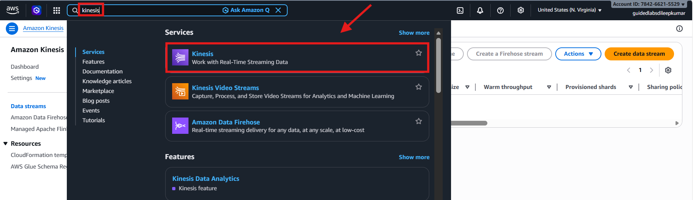

2. In the left navigation pane, click **Data streams**.
3. Click the **Create data stream** button.

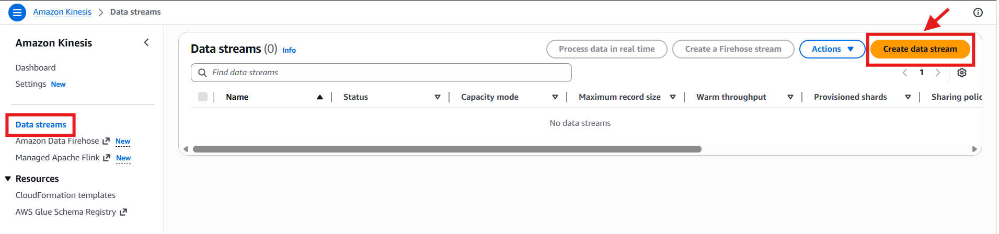

4. **Data stream configuration:**
   - **Data stream name:** Enter `order-events-stream`.
   - **Capacity mode:** Select **Provisioned**.
   - **Provisioned shards:** Enter `1`.

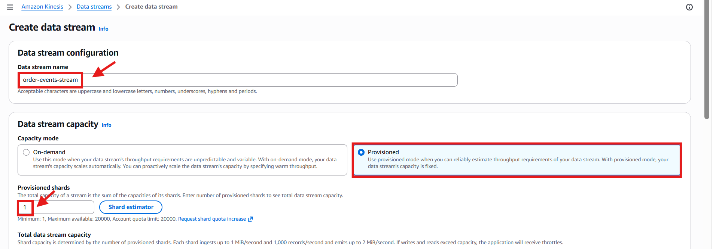

> **Why 1 shard?** For this lab, a single shard (capable of ingesting 1 MB/s or 1,000 records/s) is sufficient. In production, you would increase shards based on throughput requirements.

5. Scroll down and click **Create data stream**.

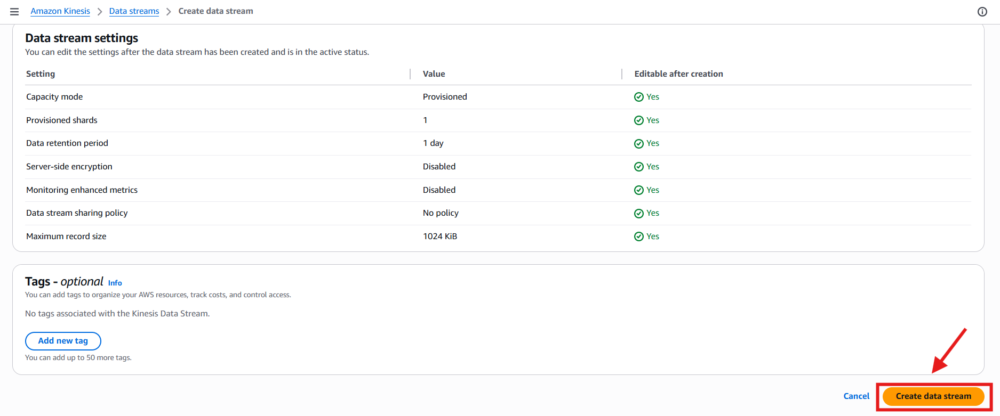

6. Wait until the stream status changes from **Creating** to **Active** (usually takes 15–30 seconds). Refresh the page if needed.

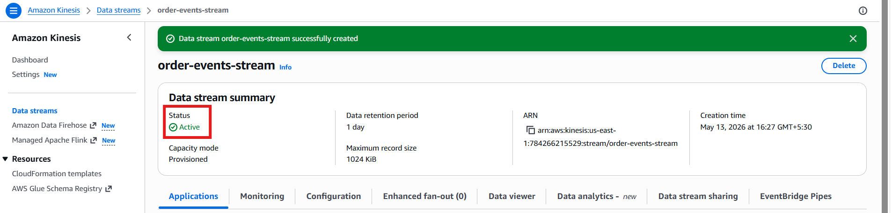

---

### Step 1.2: Note the Stream ARN

1. Click on the **`order-events-stream`** name to open the stream details page.

2. In the **Summary** section, locate the **Stream ARN**. Copy and save it — you will need it when configuring the Glue job source.

   Example ARN format:
   ```
   arn:aws:kinesis:us-east-1:123456789012:stream/order-events-stream
   ```

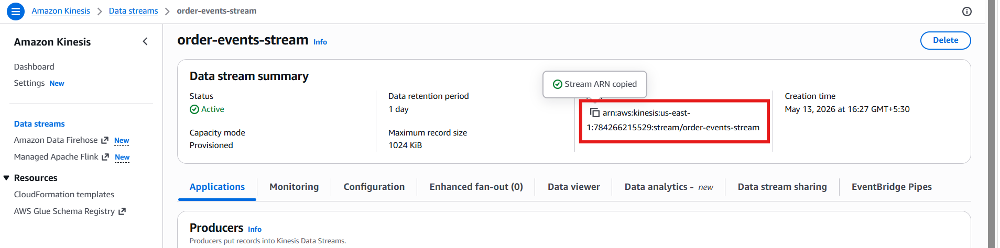

---

# Activity 2: Design and Provision the S3 Data Lake Zones

**Purpose of this Activity:** To create the Bronze (raw ingestion) and Silver (curated/transformed) zone folders in S3 that your Glue Streaming ETL job will write to.

### Step 2.1: Create the S3 Bucket

1. In the AWS Management Console search bar, type **S3** and select it.

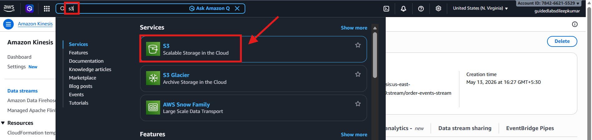

2. Click the **Create bucket** button.

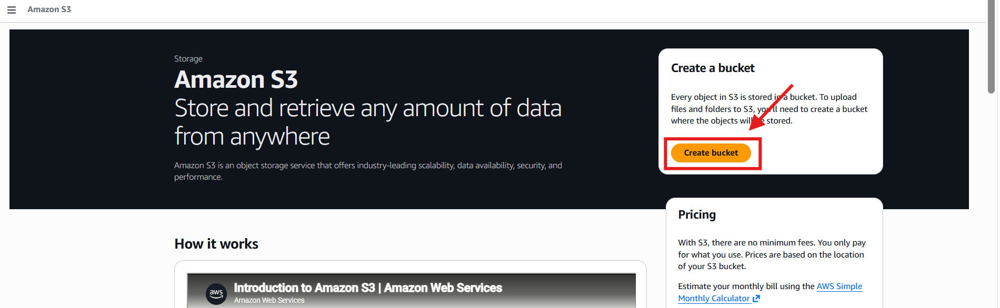

3. **Bucket Configuration:**
   - **Bucket name:** Enter a globally unique name, e.g., `streaming-datalake-<your-unique-id>`.
   - **AWS Region:** Select **us-east-1 (N. Virginia)**.

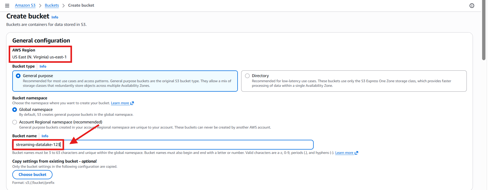

4. **Bucket Settings:**
   - **Block Public Access:** Keep "Block all public access" checked (default).
   - **Bucket Versioning:** Select **Enable**.

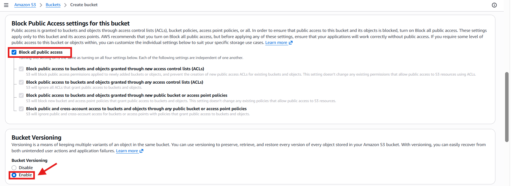

   - **Default Encryption:** Leave as SSE-S3 (default).

5. Click **Create bucket**.

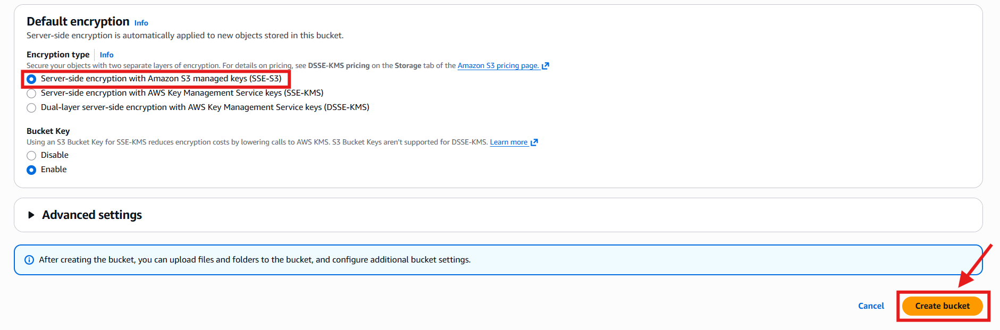

---

### Step 2.2: Create the Data Lake Folder Structure

**Purpose:** To establish logical zone separation in your S3 bucket following the medallion architecture (Bronze → Silver).

#### Phase A: Navigate to Your Bucket

1. In the **S3 Buckets** list, click on your newly created bucket name.
2. Ensure you are on the **Objects** tab.

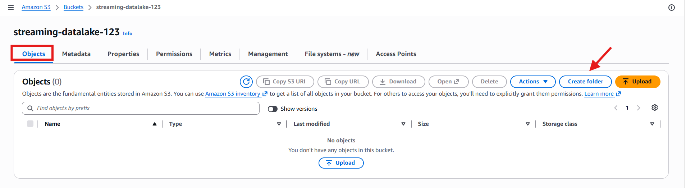

#### Phase B: Create Zone Folders

1. Click **Create folder**. In the **Folder name** field, type `bronze` and click **Create folder**.

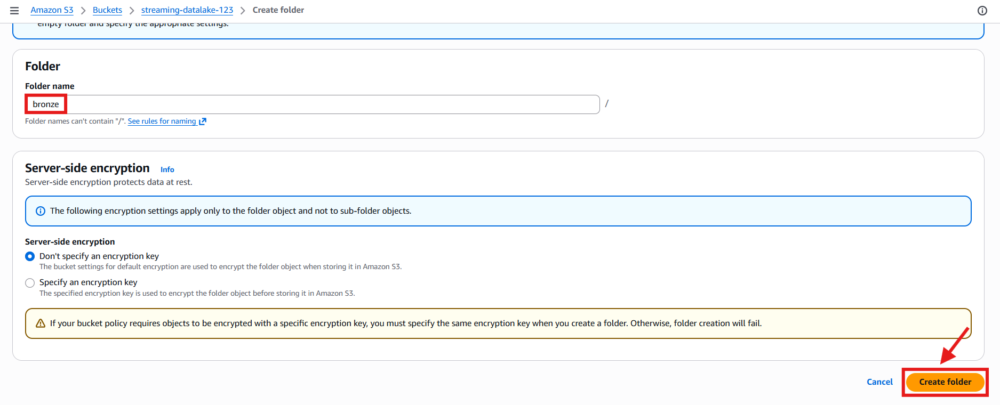

2. Repeat to create the following top-level folders:
   - `silver`
   - `glue-checkpoints`
   - `athena-results`

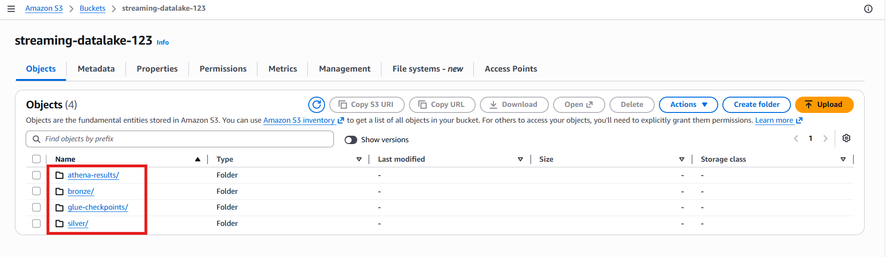

> **Folder purpose summary:**
> - `bronze/` — raw Kinesis records (optional staging zone).
> - `silver/` — transformed, partitioned Parquet output (the primary target).
> - `glue-checkpoints/` — used by Glue to store Kinesis sequence number checkpoints for restart recovery.
> - `athena-results/` — Athena query output location.

#### Phase C: Create Partitioned Subfolders in Silver

The Silver zone is partitioned by `region` and `date` to enable efficient downstream querying.

1. Click into the `silver/` folder.
2. Click **Create folder** and name it `region=us-east`. Click **Create folder**.
3. Repeat to create:
   - `region=us-west`
   - `region=eu-central`

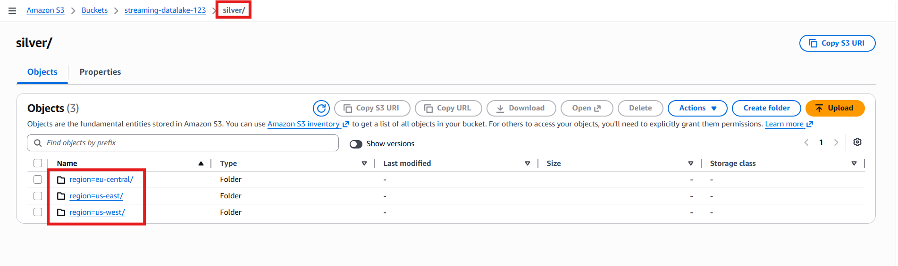

> **Note:** AWS Glue will automatically create `date=YYYY-MM-DD` sub-partitions at runtime. You only need the top-level region partitions for the initial structure.

---

# Activity 3: Configure IAM Role for Glue Streaming

**Purpose of this Activity:** To create an IAM role that grants the Glue Streaming ETL job permissions to read from Kinesis, write to S3, and publish metrics to CloudWatch.

### Step 3.1: Create the IAM Role

1. In the AWS Management Console, search for **IAM** and select it.

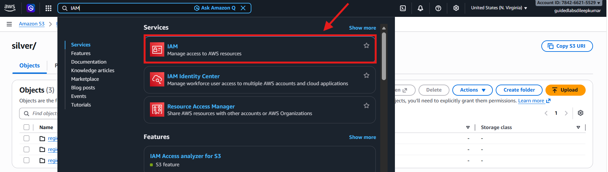

2. In the left navigation pane, click **Roles**, then click **Create role**.

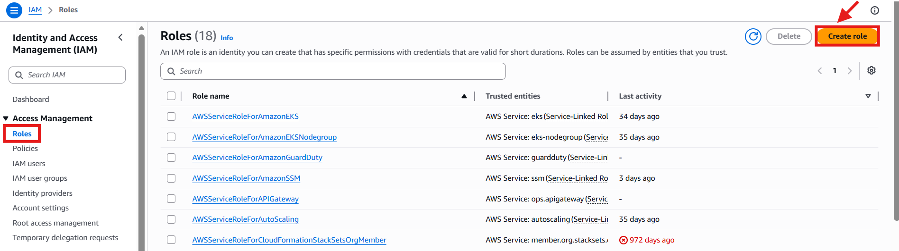

3. **Select trusted entity:**
   - Choose **AWS service**.
   - Under "Use case", select **Glue**.
   - Click **Next**.

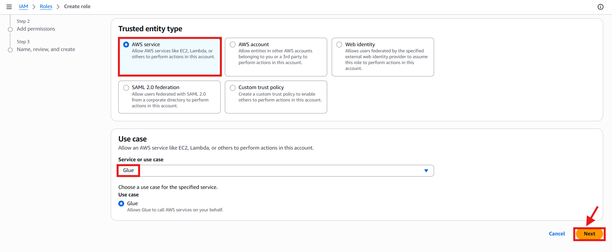

4. **Add permissions — attach the following managed policies:**
   - `AWSGlueServiceRole`
   - `AmazonKinesisReadOnlyAccess`
   - `AmazonS3FullAccess`
   - `CloudWatchLogsFullAccess`

   Search for each policy by name, check the box next to it, then continue.

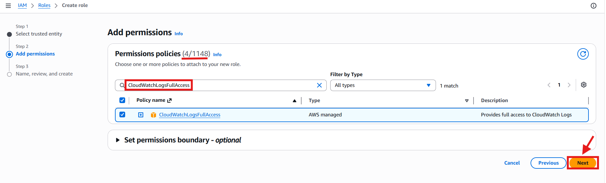

5. **Name and create the role:**
   - **Role name:** Enter `AWSGlueStreamingRole-KinesisToS3`.
   - Click **Create role**.

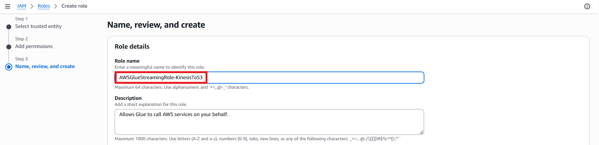

6. After creation, click on the role name to open its details. Copy and save the **Role ARN** — you will select this role when creating the Glue job.

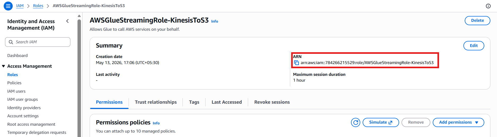

---

# Activity 4: Build the Glue Streaming ETL Job

**Purpose of this Activity:** To create and configure the AWS Glue Streaming ETL job that reads records from the Kinesis Data Stream using boto3, applies transformations, and writes partitioned Parquet to the Silver zone on S3.

### Step 4.1: Open AWS Glue Studio

1. In the AWS Console search bar, type **Glue** and select **AWS Glue**.

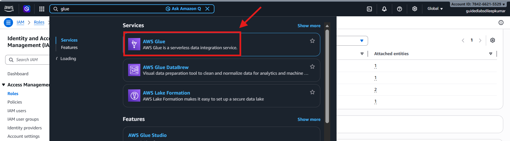

2. In the left navigation pane, click **ETL jobs** under the **Data Integration and ETL** section.

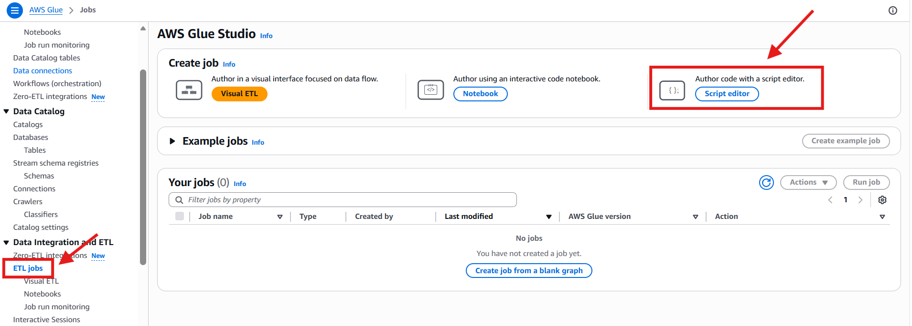

3. Click **Script editor** to create a new job using a custom PySpark script.
4. A **Script** popup will appear. Configure it as follows:
   - **Engine:** Select **`Spark`** from the dropdown *(Note: there is no separate "Spark Streaming" option — streaming behavior is enabled through the script code)*
   - **Options:** Select **`Start fresh`**

5. Click **Create script**.

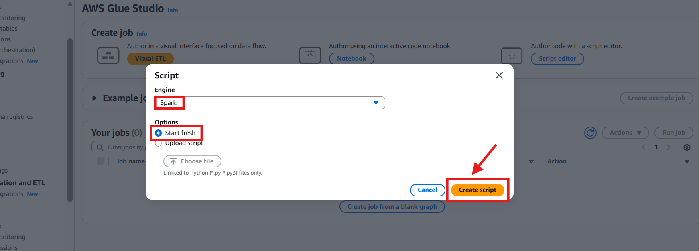

> The script editor will open with a few default boilerplate lines. You will replace all of this with the full streaming script in Step 4.3.

---

### Step 4.2: Configure Job Properties

Before writing the script, configure the job settings in the **Job details** tab.

1. Click the **Job details** tab at the top of the editor.
2. Fill in the following **Basic properties**:

| Property              | Value                                                       |
| --------------------- | ----------------------------------------------------------- |
| **Name**              | `KinesisToS3StreamingJob`                                   |
| **IAM Role**          | `AWSGlueStreamingRole-KinesisToS3`                          |
| **Type**              | `Spark` *(auto-set, no change needed)*                      |
| **Glue version**      | `Glue 4.0 - Supports Spark 3.3, Scala 2, Python 3`         |
| **Language**          | `Python 3`                                                  |
| **Worker type**       | `G.1X (4vCPU and 16GB RAM)`                                 |
| **Number of workers** | `2`                                                         |

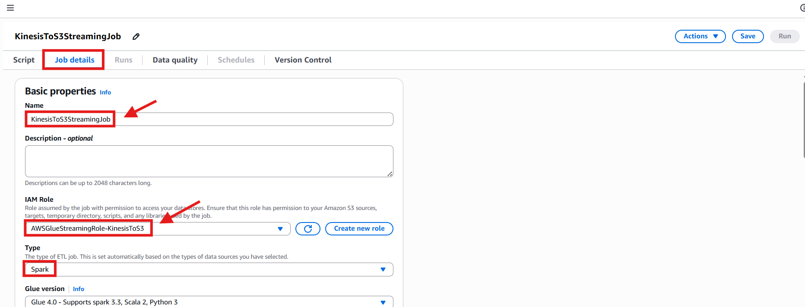
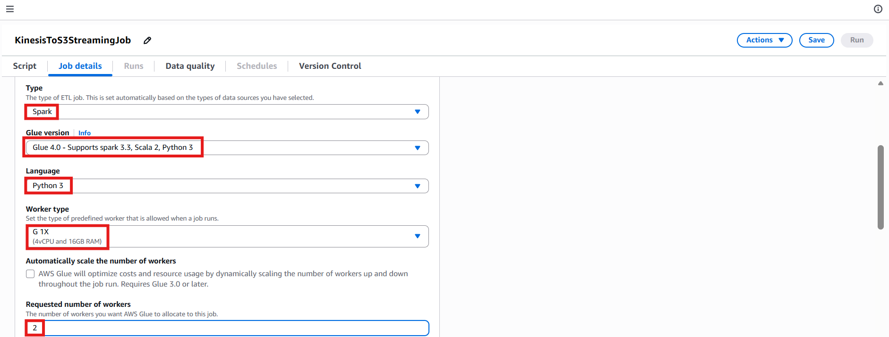

3. Scroll down and set the following additional properties:

| Property          | Value                                                              |
| ----------------- | ------------------------------------------------------------------ |
| **Job bookmark**  | `Disable` *(checkpointing handles streaming state instead)*        |
| **Job timeout**   | *(leave completely **blank**)* — this allows the streaming job to run indefinitely. Do NOT enter `0` as the console will show a validation error *"Timeout needs to be positive"* |

> ⚠️ **Important:** The **Job timeout** field must be left **empty** (not 0). Glue streaming jobs are designed to run continuously, so no timeout value is required.

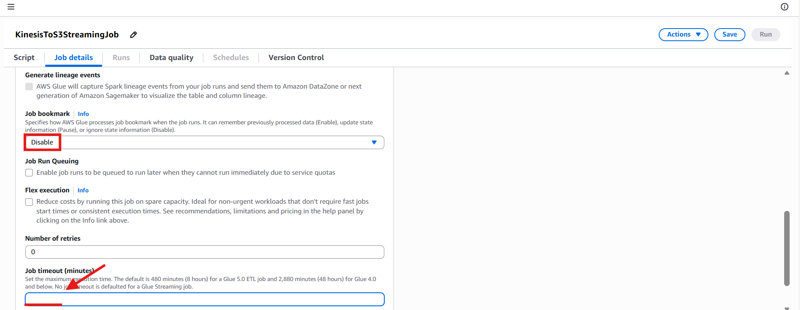

4. Scroll further down and click **▶ Advanced properties** to expand the section.

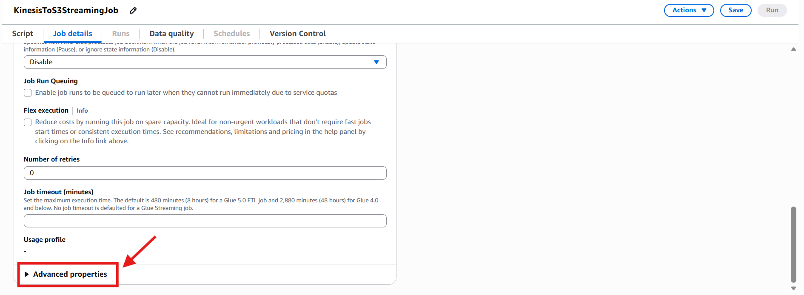

5. Scroll down inside Advanced properties until you see the **Job parameters** section. Click **Add new parameter** and add all 6 key-value pairs below one by one:

| Key                  | Value                                                        |
| -------------------- | ------------------------------------------------------------ |
| `--STREAM_NAME`      | `order-events-stream`                                        |
| `--STREAM_ARN`       | *(paste your Kinesis Stream ARN copied from Activity 1)*     |
| `--OUTPUT_PATH`      | `s3://streaming-datalake-<your-unique-id>/silver/`           |
| `--CHECKPOINT_PATH`  | `s3://streaming-datalake-<your-unique-id>/glue-checkpoints/` |
| `--AWS_REGION`       | `us-east-1`                                                  |
| `--WINDOW_SIZE`      | `100 seconds`                                                |

> **Tip:** Replace `<your-unique-id>` in `--OUTPUT_PATH` and `--CHECKPOINT_PATH` with your actual bucket name (e.g., `streaming-datalake-123`).

6. Click **Save** (top right) to preserve all job details before adding the script.

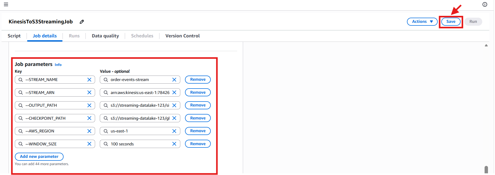

---

### Step 4.3: Write the Streaming ETL Script

1. Click the **Script** tab to open the code editor.

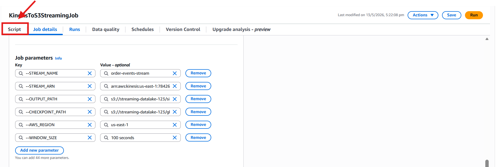

2. **Clear any default code** in the editor, then paste the following complete PySpark script:

```python
import sys
import json
import boto3
from datetime import datetime
from awsglue.utils import getResolvedOptions
from pyspark.context import SparkContext
from awsglue.context import GlueContext
from awsglue.job import Job
from pyspark.sql import functions as F
from pyspark.sql.types import *

args = getResolvedOptions(sys.argv, [
    'JOB_NAME','STREAM_NAME','STREAM_ARN',
    'OUTPUT_PATH','CHECKPOINT_PATH','AWS_REGION','WINDOW_SIZE',
])

sc = SparkContext()
glueContext = GlueContext(sc)
spark = glueContext.spark_session
job = Job(glueContext)
job.init(args['JOB_NAME'], args)

ORDER_SCHEMA = StructType([
    StructField("order_id",        StringType(),  True),
    StructField("customer_id",     StringType(),  True),
    StructField("product_id",      StringType(),  True),
    StructField("quantity",        IntegerType(), True),
    StructField("unit_price",      DoubleType(),  True),
    StructField("status",          StringType(),  True),
    StructField("event_timestamp", StringType(),  True),
    StructField("region",          StringType(),  True),
])

print(f"[INFO] Reading records from Kinesis stream: {args['STREAM_NAME']}")

# Read from Kinesis using boto3
kinesis_client = boto3.client('kinesis', region_name=args['AWS_REGION'])

# Get all shard iterators
shards = kinesis_client.list_shards(StreamName=args['STREAM_NAME'])['Shards']
all_records = []

for shard in shards:
    shard_id = shard['ShardId']
    iterator_response = kinesis_client.get_shard_iterator(
        StreamName=args['STREAM_NAME'],
        ShardId=shard_id,
        ShardIteratorType='TRIM_HORIZON'
    )
    shard_iterator = iterator_response['ShardIterator']

    while shard_iterator:
        response = kinesis_client.get_records(
            ShardIterator=shard_iterator,
            Limit=1000
        )
        records = response['Records']
        if not records:
            break
        for record in records:
            try:
                data = json.loads(record['Data'].decode('utf-8'))
                all_records.append(data)
            except Exception as e:
                print(f"[WARN] Failed to parse record: {e}")
        shard_iterator = response.get('NextShardIterator')
        if response['MillisBehindLatest'] == 0:
            break

print(f"[INFO] Total records read from Kinesis: {len(all_records)}")

if not all_records:
    print("[WARN] No records found in stream. Exiting.")
    job.commit()
    sys.exit(0)

# Create DataFrame from records
df = spark.createDataFrame(all_records, schema=ORDER_SCHEMA)
print(f"[INFO] DataFrame created with {df.count()} records.")

# Filter out CANCELLED orders
filtered_df = df.filter(F.col("order_id").isNotNull()) \
                .filter(F.col("status") != "CANCELLED")

# Add derived columns
enriched_df = filtered_df \
    .withColumn("total_amount",
        F.round(F.col("quantity").cast(DoubleType()) * F.col("unit_price"), 2)) \
    .withColumn("processed_at",
        F.lit(datetime.utcnow().strftime("%Y-%m-%dT%H:%M:%SZ"))) \
    .withColumn("date",
        F.date_format(F.to_date(F.col("event_timestamp")), "yyyy-MM-dd"))

final_count = enriched_df.count()
print(f"[INFO] Writing {final_count} records to {args['OUTPUT_PATH']}")

# Write partitioned Parquet to Silver zone
enriched_df.write \
    .mode("append") \
    .partitionBy("region", "date") \
    .parquet(args['OUTPUT_PATH'])

print(f"[INFO] Successfully wrote {final_count} records to Silver zone!")
job.commit()
```

3. After pasting, ** Don't Save**.

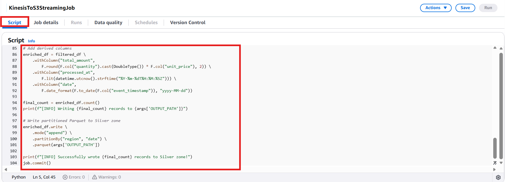

> **Script walkthrough — key decisions:**
> - **`boto3` Kinesis client** is used instead of `glueContext.create_data_frame.from_options` because Glue 4.0 dropped the native Kinesis connector from the Spark engine. Using `boto3` directly is the reliable approach for Glue 4.0.
> - **`TRIM_HORIZON`** shard iterator type replays all available records from the earliest retained point in each shard — important for ensuring no records are missed during testing.
> - **`MillisBehindLatest == 0`** check stops reading when the consumer has fully caught up to the latest record in the shard, preventing an infinite loop.
> - **`spark.createDataFrame`** converts the in-memory list of parsed JSON records into a Spark DataFrame for transformation.
> - **Null guard on `order_id`** drops malformed events before they pollute the Silver zone.
> - **`CANCELLED` filter** demonstrates a business-rule transformation — only actionable order statuses land in Silver.
> - **`partitionBy("region", "date")`** writes Hive-style partitioned Parquet enabling efficient downstream querying via Athena.

---

### Step 4.4: Send Data to Kinesis and Run the Glue Job

Before running the Glue job, you need to send records into your Kinesis stream. You will do this using **AWS CloudShell** — no local setup required.

1. Click the **CloudShell icon** at the bottom of the AWS Console screen to open a browser-based terminal.

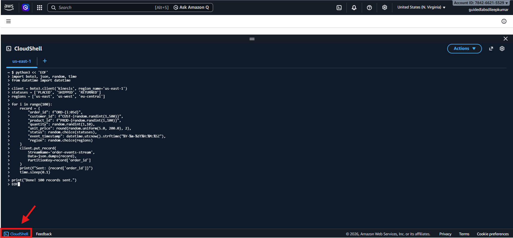

2. Copy and paste the entire script below into CloudShell and press **Enter**:

```python
python3 << 'EOF'
import boto3, json, random, time
from datetime import datetime

client = boto3.client('kinesis', region_name='us-east-1')
statuses = ['PLACED', 'SHIPPED', 'RETURNED']
regions = ['us-east', 'us-west', 'eu-central']

for i in range(100):
    record = {
        "order_id": f"ORD-{i:05d}",
        "customer_id": f"CUST-{random.randint(1,500)}",
        "product_id": f"PROD-{random.randint(1,100)}",
        "quantity": random.randint(1,10),
        "unit_price": round(random.uniform(5.0, 200.0), 2),
        "status": random.choice(statuses),
        "event_timestamp": datetime.utcnow().strftime("%Y-%m-%dT%H:%M:%SZ"),
        "region": random.choice(regions)
    }
    client.put_record(
        StreamName='order-events-stream',
        Data=json.dumps(record),
        PartitionKey=record['order_id']
    )
    print(f"Sent: {record['order_id']}")
    time.sleep(0.1)

print("Done! 100 records sent.")
EOF
```

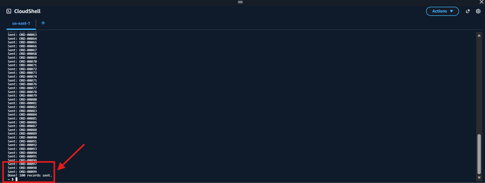

Wait for **"Done! 100 records sent."** before proceeding.

3. Return to the Glue job and click **Save** and **Run** (orange button, top right).

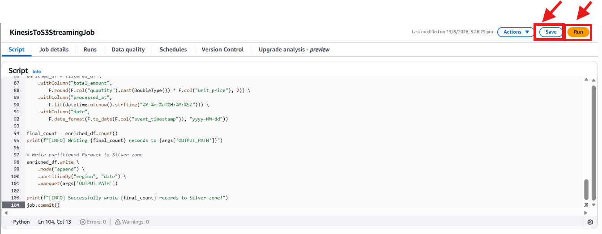

4. Click the **Runs** tab to monitor the job. The job will show **Running** initially, then complete with **Succeeded** status in approximately **1–2 minutes**.

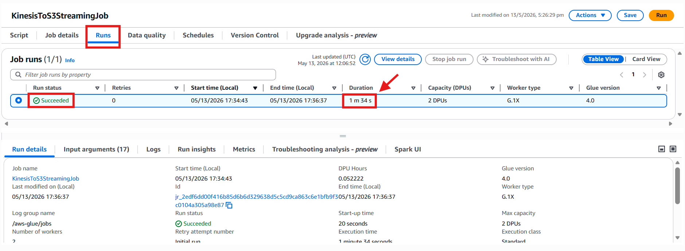

> **Note on job behavior:** This implementation uses **boto3 to read all available records from Kinesis in a single batch**, processes them, writes to S3, and exits cleanly with **Succeeded** status. The job duration will be approximately 1 minute 30 seconds.

---

# Activity 5: Validate Silver Zone Output in S3

**Purpose of this Activity:** To confirm that the Glue Streaming ETL job has successfully written transformed, partitioned Parquet files to the Silver zone.

### Step 5.1: Check the Silver Zone Folder

1. Navigate to **S3 → streaming-datalake-<your-unique-id> → silver/**.

2. You should see region-partitioned subfolders automatically created by the Glue job:

```
silver/
├── region=us-east/
│   └── date=2024-08-01/
│       └── part-00000-....parquet
├── region=us-west/
│   └── date=2024-08-01/
│       └── part-00000-....parquet
└── region=eu-central/
    └── date=2024-08-01/
        └── part-00000-....parquet
```

3. Click into any `date=` folder and confirm that `.parquet` files exist.

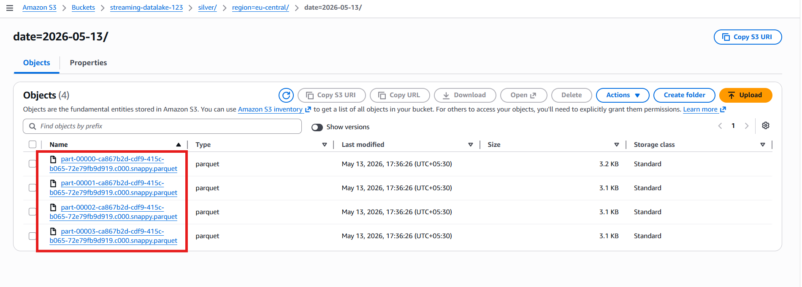

---

# Activity 6: Test Restart Behavior

**Purpose of this Activity:** To simulate a real-world job re-run and verify that running the job again picks up all available records from the stream and appends new output to the Silver zone.

> **Behavioral note:** Because this lab uses the **boto3 + TRIM_HORIZON approach**, the job reads **all available records** from the Kinesis stream on every run. Each subsequent run will re-read and append all previously published records plus any new ones added since the last run. The Silver zone will accumulate additional Parquet files with each run — this is the expected behavior for this implementation.

### Step 6.1: Confirm Previous Job Completed

1. In the AWS Glue console, navigate to **ETL jobs → KinesisToS3StreamingJob**.
2. Click the **Runs** tab and confirm the latest run shows **Succeeded** status.

> Since the boto3-based job exits automatically after processing all available records, there is no need to manually stop it. If the job is still showing **Running**, wait for it to complete before proceeding.

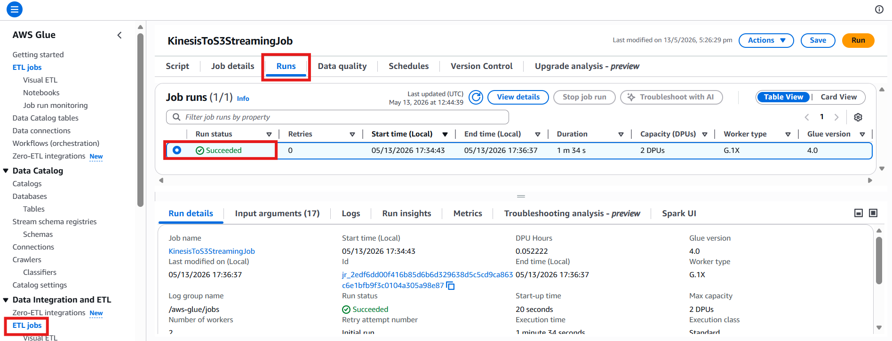

---

### Step 6.2: Count Existing Records (Pre-Restart Baseline)

Before re-running, note how many Parquet files exist in the Silver zone — this is your baseline to compare against after the restart.

1. Navigate to **S3 → silver/** and count the total number of `.parquet` files across all partitions.

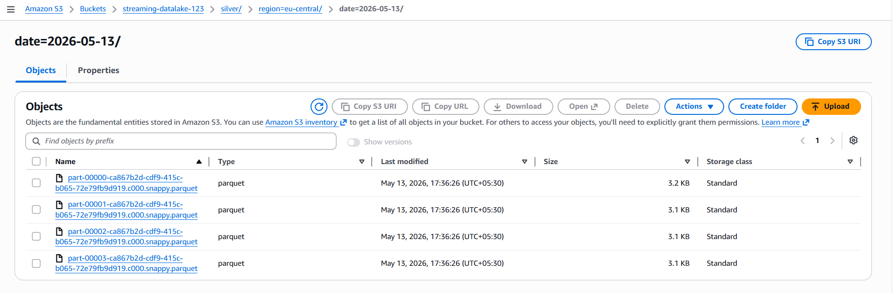
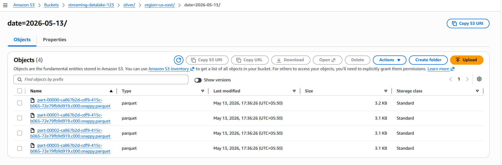
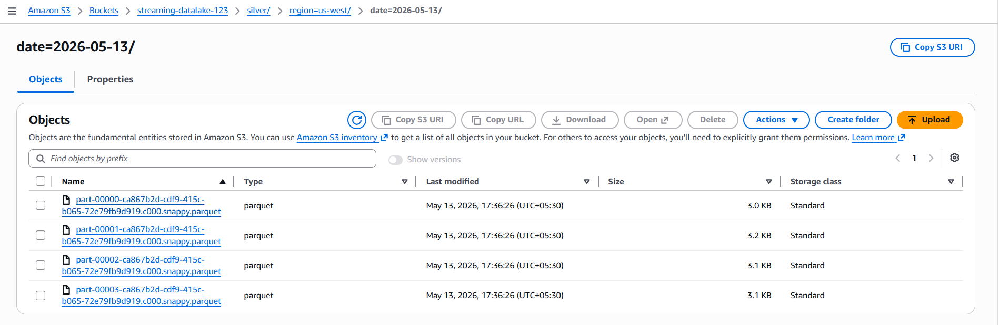

---

### Step 6.3: Restart the Job

1. Return to **AWS Glue → ETL jobs → KinesisToS3StreamingJob**.
2. Click **Run** to start a new run.

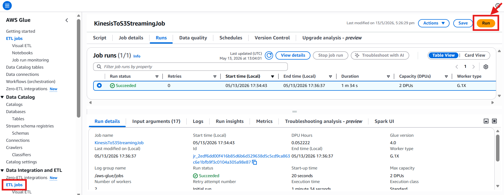

3. The job will start and read all records from Kinesis using `TRIM_HORIZON`, processing both previously seen records and any new ones.

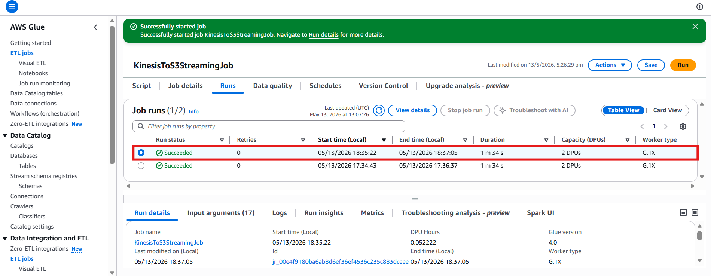

---

### Step 6.4: Verify Output After Restart

1. Allow the restarted job to complete (wait ~2 minutes after it shows **Succeeded**).

2. Navigate to **S3 → silver/** and re-count the Parquet files.

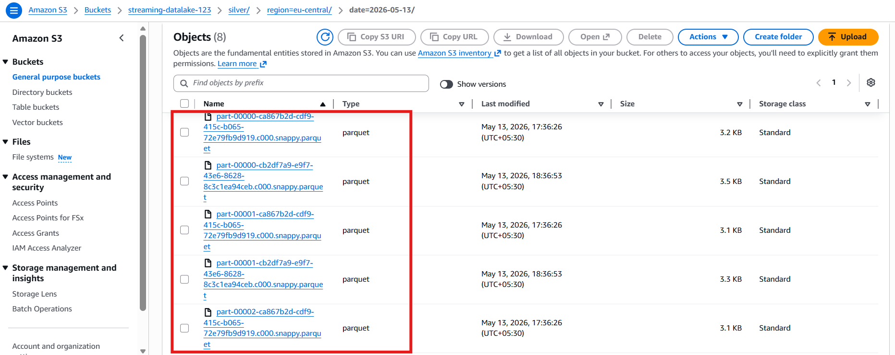

3. **Expected behavior:**
   - The file count increases as the job appends new Parquet files to the Silver zone.
   - Each run produces output independently — the Silver zone accumulates files across runs.

---

# Activity 7: Query Silver Zone Data with Amazon Athena

**Purpose of this Activity:** To catalog your streaming output in the Glue Data Catalog and run analytical SQL queries against the Silver zone Parquet data using Amazon Athena.

### Step 7.1: Create a Glue Crawler for the Silver Zone

1. In the AWS Glue console, navigate to **Data Catalog → Crawlers**.
2. Click **Create crawler**.

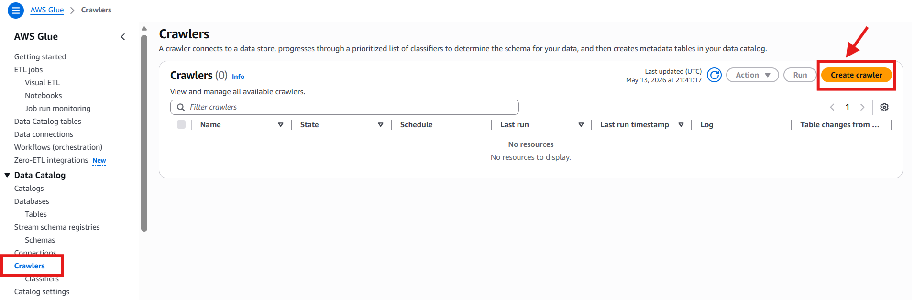

3. **Crawler name:** Enter `crawler-silver-orders` and click **Next**.

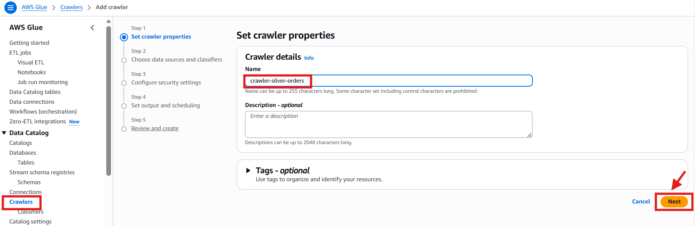

4. Click **Add a data source**. Set the S3 path to:
   ```
   s3://streaming-datalake-<your-unique-id>/silver/
   ```
   Click **Add an S3 data source**, then **Next**.

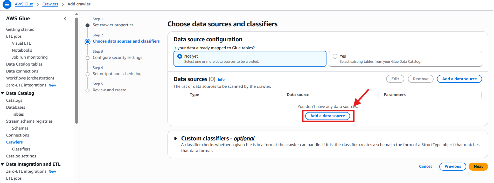
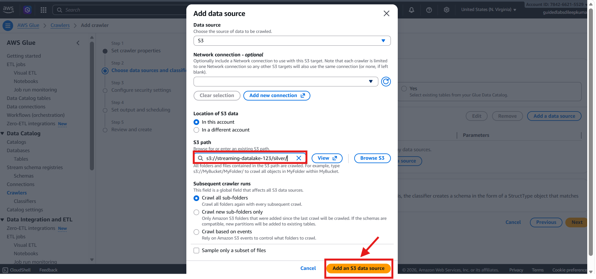

5. Select the IAM role: `AWSGlueStreamingRole-KinesisToS3`. Click **Next**.

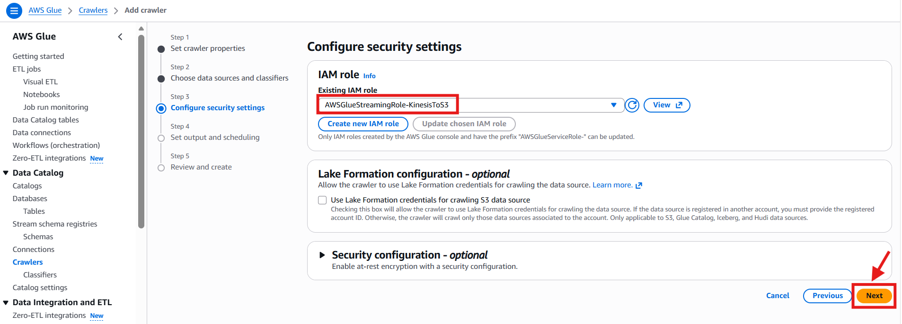

6. **Output configuration:**
   - Click **Add database**.
   - **Database name:** Enter `streaming_db`. Click **Create database**.
   - Select `streaming_db` as the target database.

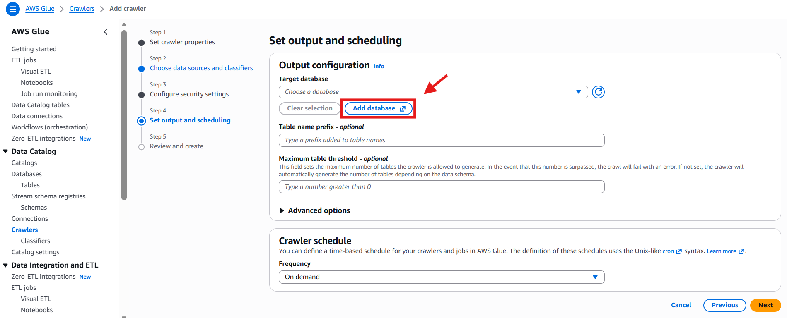
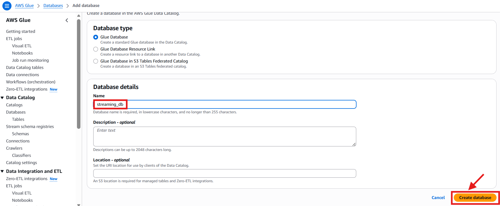
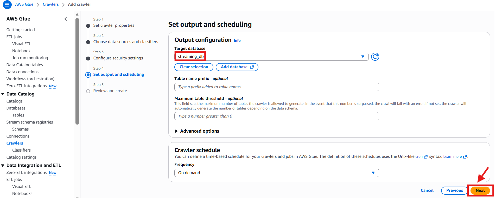

7. Review and click **Create crawler**.

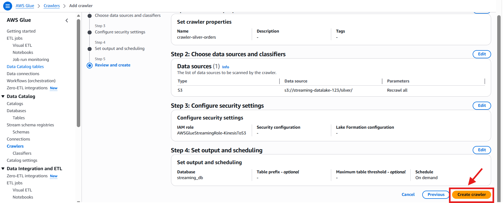

### Step 7.2: Run the Crawler

1. Check the box next to `crawler-silver-orders` and click **Run**.

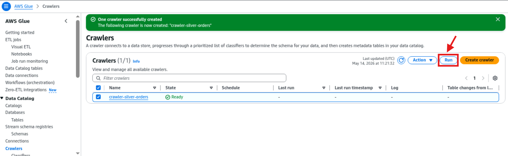

2. Wait for the crawler status to return to **Ready** (1–2 minutes).
3. Confirm that **1 table** was added in the **Table changes** column.

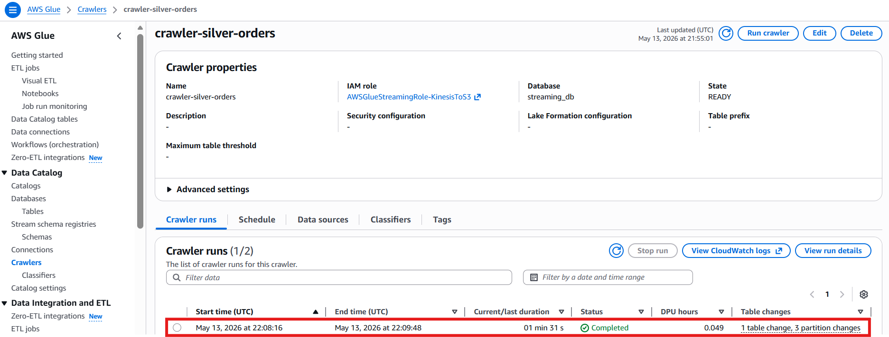

---

### Step 7.3: Set Up Athena Query Results Location

1. In the AWS Console, search for **Athena** and select it.
2. Click **query editor**.
3. Click **Query settings** tab → click **Manage**.
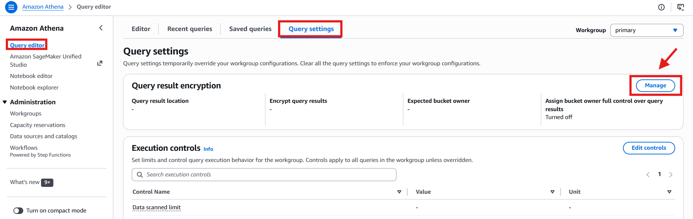

4. Set the **Query result location** to:
   ```
   s3://streaming-datalake-<your-unique-id>/athena-results/
   ```
5. Click **Save**.

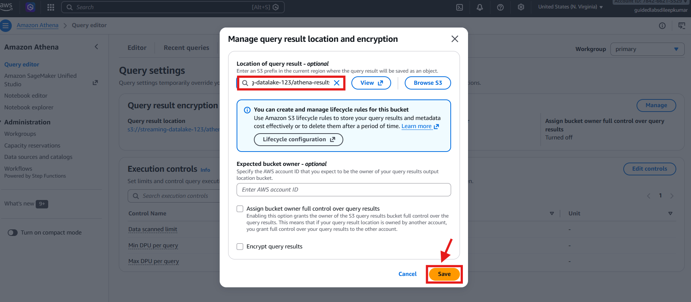

---

### Step 7.4: Query 1 — Count Records by Region and Status

In the Athena editor, ensure the **Database** is set to `streaming_db`, then run:

```sql
SELECT
    region,
    status,
    COUNT(*) AS order_count,
    ROUND(SUM(total_amount), 2) AS total_revenue
FROM silver
GROUP BY region, status
ORDER BY total_revenue DESC;
```

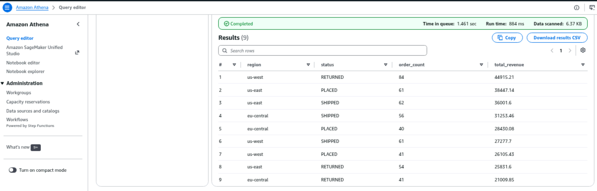

This confirms that:
- Orders were correctly partitioned by `region`.
- `CANCELLED` orders were filtered out (they should not appear in results).
- `total_amount` was correctly derived from `quantity × unit_price`.

---

### Step 7.5: Query 2 — Check for Duplicate order_id Records

Run the following query to inspect record distribution across runs:

```sql
SELECT
    order_id,
    COUNT(*) AS record_count
FROM silver
GROUP BY order_id
HAVING COUNT(*) > 1
ORDER BY record_count DESC
LIMIT 10;
```

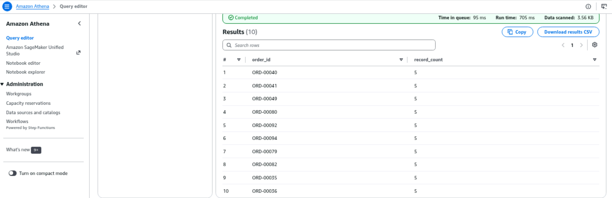

> **Note:** Because the job uses `TRIM_HORIZON` and `mode("append")`, re-running the job will produce duplicate `order_id` entries across Parquet files — this is expected behavior with this implementation. Each run independently appends all available Kinesis records to the Silver zone.

---

### Step 7.6: Query 3 — Partition Pruning by Region

Athena leverages Hive-style partitioning using the `region` column to scan only the relevant data:

```sql
SELECT
    order_id,
    customer_id,
    product_id,
    quantity,
    unit_price,
    total_amount,
    event_timestamp,
    region,
    date
FROM silver
WHERE region = 'us-east'
ORDER BY total_amount DESC
LIMIT 20;
```

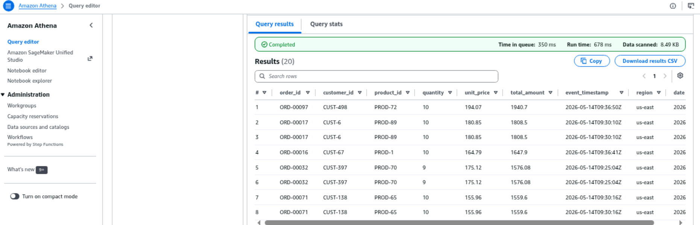

> **Note:** Observe the **Data scanned** value shown after the query completes. Partition pruning using the `region` filter reduces the amount of data scanned compared to a full-table scan.

---

## 🎓 Conclusion

This guided project demonstrated how to architect and operate a real-time streaming data pipeline on AWS using Kinesis Data Streams and AWS Glue. You built a complete end-to-end pipeline — from provisioning the event source to querying transformed output — using production-grade AWS services.

You applied hands-on data engineering patterns, including:

- Provisioning a **Kinesis Data Stream** with appropriate shard capacity.
- Architecting a **Bronze → Silver medallion data lake** on S3 with Hive-style partitioning.
- Building a **Glue ETL job** using `boto3` to read from Kinesis and write partitioned Parquet to S3.
- Applying **business-rule transformations** — filtering cancelled orders, deriving `total_amount`, and enforcing schema.
- Managing **IAM permissions** across Kinesis, S3, Glue, and CloudWatch.
- Cataloging streaming output with a **Glue Crawler** and querying it efficiently via **Amazon Athena** with partition pruning.
- Observing **cumulative run behavior** by re-running the job and inspecting output growth in the Silver zone.

These are the foundational skills for building production-grade data pipelines on AWS — an essential part of any modern data engineer's toolkit!
