# Title: Redshift Serverless Setup & First Analytical Queries

---

## 🌟 Overview: What is the purpose of this Lab?

Welcome to your Amazon Redshift Serverless data warehouse lab! In modern analytics architectures, cloud-native data warehouses are the backbone for delivering fast, scalable business intelligence. Unlike traditional provisioned clusters, Redshift Serverless automatically scales compute capacity based on workload demand — eliminating the need to manage infrastructure while keeping costs tied directly to usage. This lab will guide you through provisioning a Redshift Serverless workgroup, designing a star schema, loading sample data, and running analytical queries to generate insights.

**The Purpose of this Lab:**
You are part of a data analytics team setting up a data warehouse for reporting. Streaming sales transactions need to be modeled, stored, and queried efficiently. Your task is to model data using a simple star schema (fact and dimension tables), load sample data from Amazon S3, and run multi-table analytical queries to generate business insights. You will also review query execution plans (EXPLAIN output) to understand how Redshift processes queries under the hood.

By the end of this project, you will have:

- Provisioned a **Redshift Serverless workgroup** with appropriate RPU limits and VPC configuration.
- Configured **IAM roles** to allow Redshift to access data stored in Amazon S3.
- Created an **S3 bucket** and uploaded sample CSV data files for ingestion.
- Designed a **star schema** with one fact table and three dimension tables in Redshift.
- Loaded data using the **COPY command** from S3 into Redshift tables.
- Executed **multi-table analytical queries** using JOINs, GROUP BY, and aggregate functions.
- Read and interpreted **EXPLAIN plan output** to understand query planning and performance basics.

### Learning Path:

1. **Authentication:** Configure your AWS Console access and set the working region.
2. **IAM Setup:** Create an IAM role granting Redshift permission to read from S3.
3. **S3 Setup:** Create an S3 bucket and upload sample CSV data files.
4. **VPC Setup:** Create a VPC, subnets, and security group for Redshift networking.
5. **Redshift Serverless:** Provision a workgroup and namespace with appropriate RPU settings.
6. **Schema Design:** Connect via Query Editor V2 and create the star schema tables.
7. **Data Loading:** Load data from S3 into Redshift using the COPY command.
8. **Analytical Queries:** Run multi-table JOIN queries and aggregate reports.
9. **EXPLAIN Plans:** Review query execution plans and understand what they reveal about performance.

---

## 📊 Dataset / Knowledge Source Used

This lab uses a **simulated retail sales dataset** representing transactions across multiple stores and product categories. The data is structured across four CSV files that map to a classic star schema: one fact table capturing sales events, and three dimension tables providing descriptive context (customers, products, and dates). You will upload these files to S3 and load them into Redshift using the COPY command.

**Star Schema Overview:**

```
           dim_customer
                |
dim_date ── fact_sales ── dim_product
```

**fact_sales** (Fact Table):

```
sale_id, customer_id, product_id, date_id, quantity_sold, unit_price, total_amount, store_region
```

**dim_customer** (Dimension Table):

```
customer_id, customer_name, city, state, country, customer_segment
```

**dim_product** (Dimension Table):

```
product_id, product_name, category, sub_category, brand
```

**dim_date** (Dimension Table):

```
date_id, full_date, day_of_week, month, quarter, year, is_weekend
```

| Table            | Type      | Row Count | Description                                      |
| ---------------- | --------- | --------- | ------------------------------------------------ |
| `fact_sales`     | Fact      | ~1,000    | One row per sales transaction                    |
| `dim_customer`   | Dimension | ~200      | Customer master data with geographic attributes  |
| `dim_product`    | Dimension | ~50       | Product catalog with category hierarchy          |
| `dim_date`       | Dimension | 365       | Date spine for the calendar year 2024            |

---

## 🛠️ Prerequisites & AWS Setup

Ensure the following are available before starting:

- An **AWS account** with permissions for Redshift, S3, and IAM.
- Access to the **AWS Console** (lab credentials provided).
- A basic familiarity with SQL (SELECT, JOIN, GROUP BY, aggregate functions).
- No local tools required — all activities are performed in the **AWS Console** and **Redshift Query Editor V2**.

---

## Configure AWS Credentials

First, log in to the AWS Web Console to set up your environment.

- Login to AWS Console:
  - Click on the `Lab Access` icon on the desktop.


- Click on `Access Lab` and using the given credentials login to AWS Console. This will allow you to access the AWS resources from the Console.


- Once logged in, set the region to `us-east-1`. Create all resources in the **US-EAST-1 (N. Virginia) Region**.

- Steps to select the AWS region in the AWS Console:
  - Locate the region selector at the top-right corner of the console (next to your Account Name).
  - Click on the dropdown, and a list of available AWS Regions will appear.


  - Choose **us-east-1 (N. Virginia)** Region.


---

# Activity 1: Create the IAM Role for Redshift

**Purpose of this Activity:** To create an IAM role that grants Amazon Redshift Serverless the permissions it needs to read data files directly from S3 using the COPY command. Without this role, Redshift cannot access your S3 bucket.

### Step 1.1: Navigate to IAM

1. In the AWS Management Console search bar, type **IAM** and select it from the services menu.

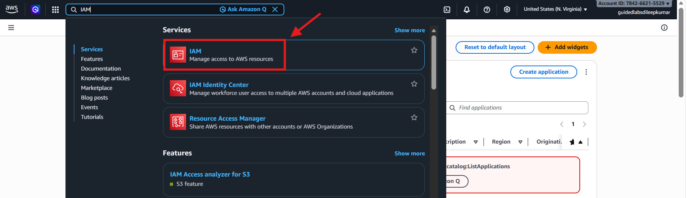

2. In the left navigation pane, click **Roles**.
3. Click the **Create role** button.

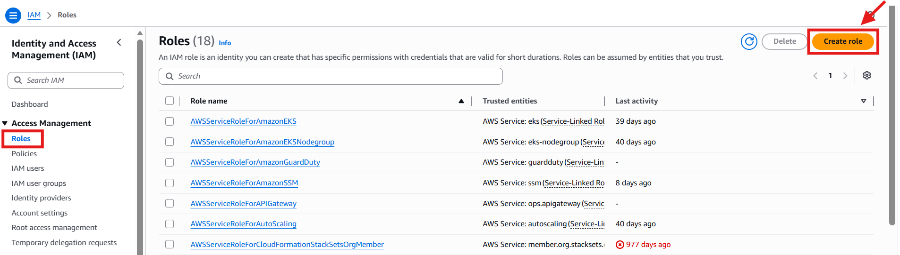

---

### Step 1.2: Configure the Trust Policy

1. On the **Select trusted entity** page:
   - **Trusted entity type:** Select **AWS service**.
   - **Use case:** Scroll down and select **Redshift**.
   - Under the use case options, select **Redshift - Customizable**.

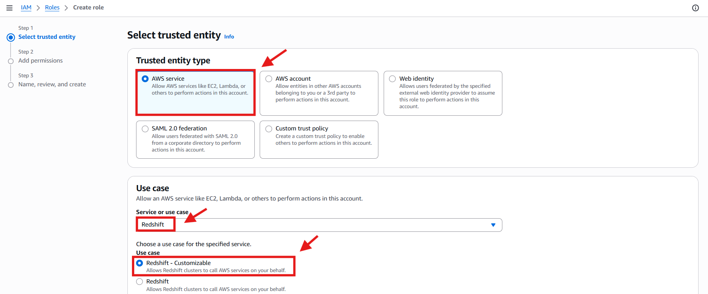

2. Click **Next**.

---

### Step 1.3: Attach Permissions

1. On the **Add permissions** page, search for `AmazonS3ReadOnlyAccess`.
2. Check the box next to **AmazonS3ReadOnlyAccess** to attach it.

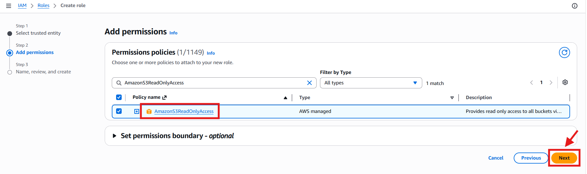

> **Why S3ReadOnlyAccess?** The COPY command reads data from S3 into Redshift. Read-only access is sufficient and follows the principle of least privilege — Redshift does not need to write back to S3 for this activity.

3. Click **Next**.

---

### Step 1.4: Name and Create the Role

1. On the **Name, review, and create** page:
   - **Role name:** Enter `RedshiftS3AccessRole`.
   - **Description:** Enter `Allows Redshift Serverless to read from S3 for the COPY command.`

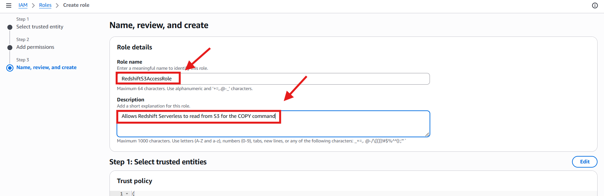

2. Scroll down and click **Create role**.

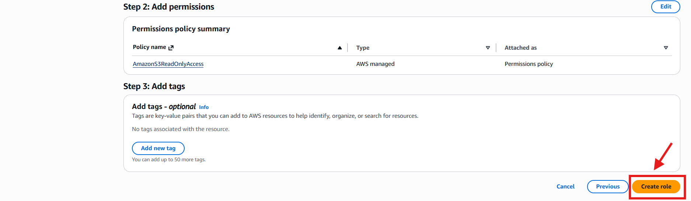

3. Once created, click on the **`RedshiftS3AccessRole`** name to open its detail page.
4. Copy and save the **Role ARN** from the Summary section — you will need it when running the COPY command.

   Example ARN format:
   ```
   arn:aws:iam::123456789012:role/RedshiftS3AccessRole
   ```

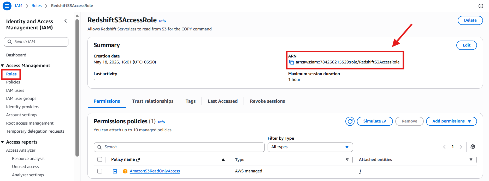

---

# Activity 2: Create the S3 Bucket and Upload Sample Data

**Purpose of this Activity:** To create an S3 bucket that will serve as the data staging area for this lab. You will upload four CSV files representing the star schema tables, which Redshift will read during the COPY command step.

### Step 2.1: Create the S3 Bucket

1. In the AWS Management Console search bar, type **S3** and select it.

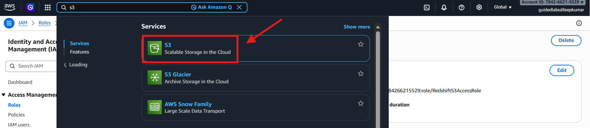

2. Click the **Create bucket** button.

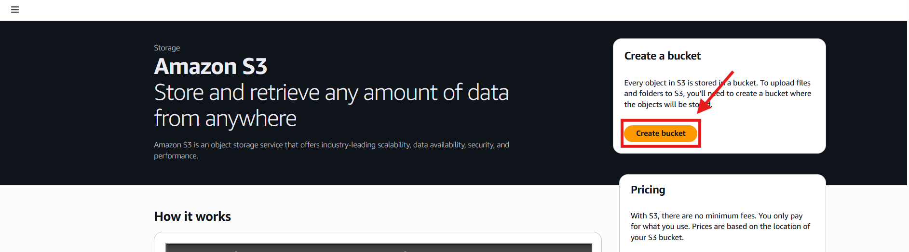

3. **Bucket Configuration:**
   - **Bucket name:** Enter a globally unique name, e.g., `redshift-lab-data-<your-unique-id>`.
   - **AWS Region:** Select **us-east-1 (N. Virginia)**.

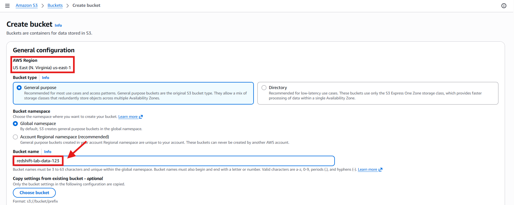

4. **Bucket Settings:**
   - **Block Public Access:** Keep "Block all public access" checked (default).
   - **Bucket Versioning:** Leave as **Disabled** for this lab.
   - **Default Encryption:** Leave as SSE-S3 (default).

5. Click **Create bucket**.

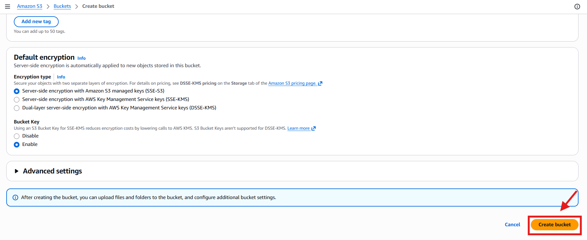

---

### Step 2.2: Create the Folder Structure

1. Click on your newly created bucket name to open it.
2. Click **Create folder**. In the **Folder name** field, enter `sales-data` and click **Create folder**.

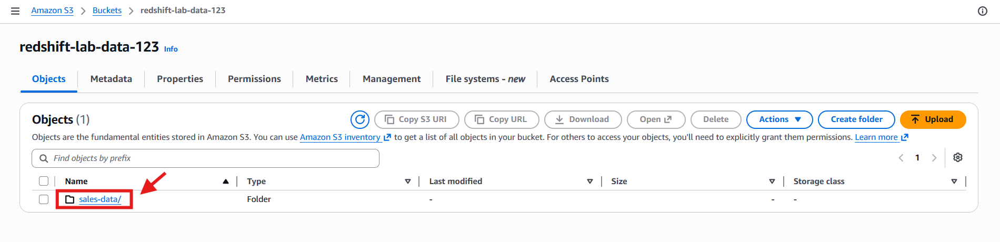

---

### Step 2.3: Prepare and Upload the CSV Files

You will now create four CSV files representing the star schema tables. Copy the content below and save each as a `.csv` file on your local machine before uploading.

**File 1 — `dim_customer.csv`**

```csv
customer_id,customer_name,city,state,country,customer_segment
C001,Alice Johnson,New York,NY,USA,Retail
C002,Bob Smith,Los Angeles,CA,USA,Wholesale
C003,Carol White,Chicago,IL,USA,Retail
C004,David Brown,Houston,TX,USA,Corporate
C005,Eva Martinez,Phoenix,AZ,USA,Retail
```
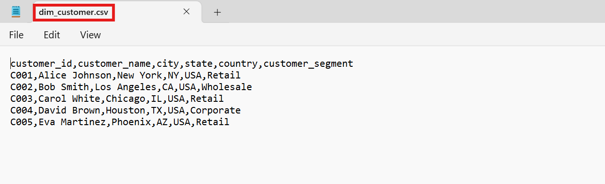


**File 2 — `dim_product.csv`**

```csv
product_id,product_name,category,sub_category,brand
P001,Wireless Mouse,Electronics,Accessories,Logitech
P002,Office Chair,Furniture,Seating,Herman Miller
P003,Notebook A4,Stationery,Paper,Staples
P004,USB-C Hub,Electronics,Accessories,Anker
P005,Standing Desk,Furniture,Desks,FlexiSpot
```
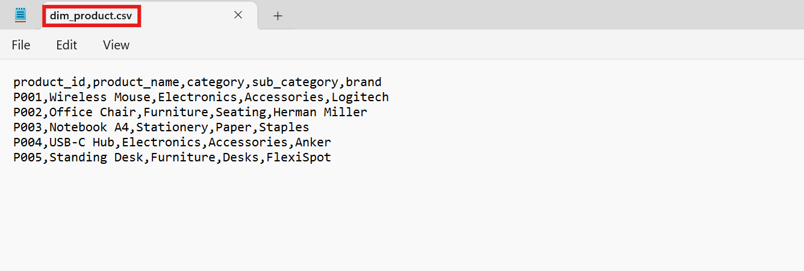


**File 3 — `dim_date.csv`**

```csv
date_id,full_date,day_of_week,month,quarter,year,is_weekend
D001,2024-01-15,Monday,January,Q1,2024,false
D002,2024-02-20,Tuesday,February,Q1,2024,false
D003,2024-03-30,Saturday,March,Q1,2024,true
D004,2024-07-10,Wednesday,July,Q3,2024,false
D005,2024-11-05,Tuesday,November,Q4,2024,false
```
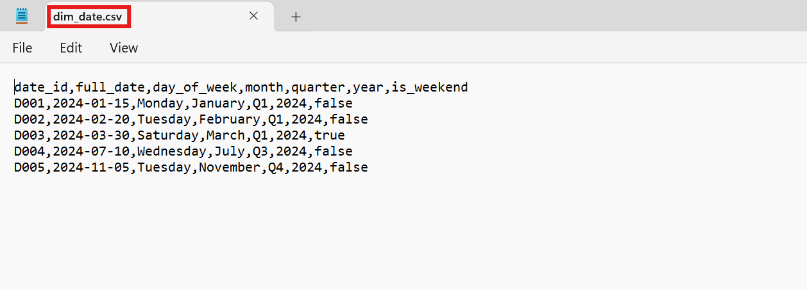


**File 4 — `fact_sales.csv`**

```csv
sale_id,customer_id,product_id,date_id,quantity_sold,unit_price,total_amount,store_region
S0001,C001,P001,D001,2,29.99,59.98,us-east
S0002,C002,P002,D002,1,499.00,499.00,us-west
S0003,C003,P003,D003,10,3.50,35.00,us-central
S0004,C004,P004,D004,3,45.00,135.00,us-south
S0005,C005,P005,D005,1,799.00,799.00,us-west
S0006,C001,P003,D001,5,3.50,17.50,us-east
S0007,C002,P001,D004,2,29.99,59.98,us-west
S0008,C003,P004,D002,1,45.00,45.00,us-central
S0009,C004,P002,D005,1,499.00,499.00,us-south
S0010,C005,P001,D003,4,29.99,119.96,us-west
```
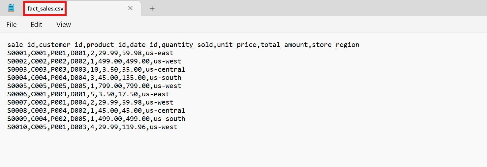


---

### Step 2.4: Upload the Files to S3

1. Navigate into the `sales-data/` folder inside your bucket.
2. Click **Upload**.

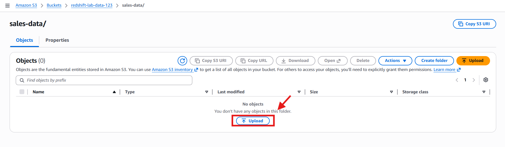

3. Click **Add files** and select all four CSV files you saved locally:
   - `dim_customer.csv`
   - `dim_product.csv`
   - `dim_date.csv`
   - `fact_sales.csv`

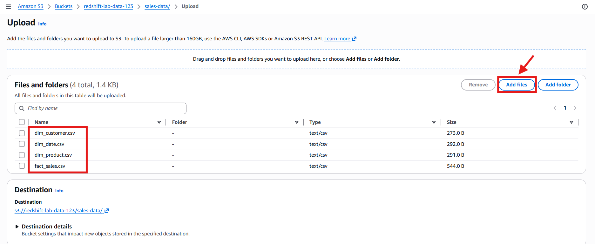

4. Click **Upload** to confirm.

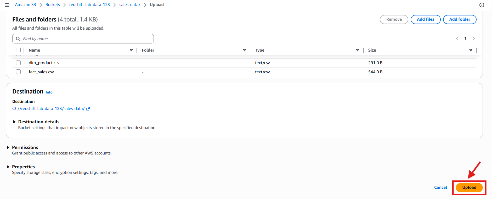

5. Wait for the upload to complete and verify all four files appear in the `sales-data/` folder.

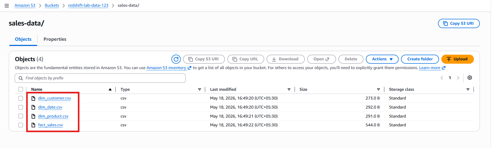

> **Note the S3 path** — you will use it in the COPY command:
> ```
> s3://redshift-lab-data-<your-unique-id>/sales-data/
> ```

---

# Activity 3: Create VPC, Subnets, and Security Group

**Purpose of this Activity:** Before provisioning Redshift Serverless, you need to set up the networking resources — a VPC, subnets, and a security group. In some lab environments, no default VPC is pre-created, so these must be created manually. Redshift Serverless requires a VPC with at least two subnets in different Availability Zones and an associated security group to define its network boundary.

### Step 3.1: Create a VPC

1. In the AWS Management Console search bar, type **VPC** and select it.
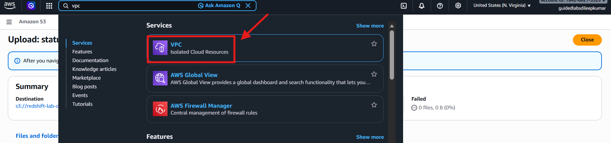
2. In the left navigation pane, click **"Your VPCs"**.
3. Click **"Create VPC"**.
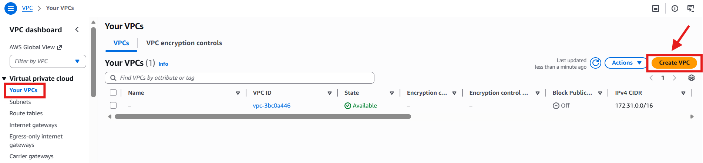
4. Fill in the following:
   - **Resources to create:** Select `VPC only`
   - **Name tag:** `redshift-vpc`
   - **IPv4 CIDR block:** `10.0.0.0/16`
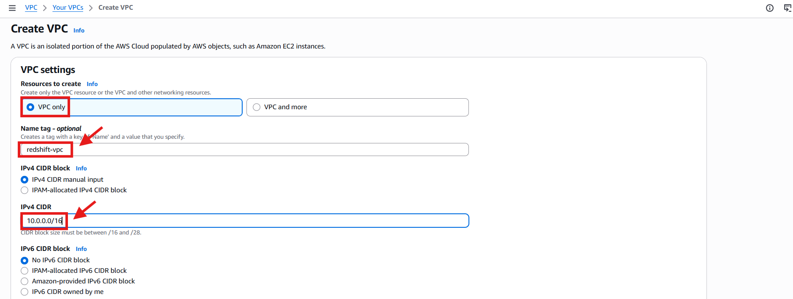
   - Leave all other settings as default.
5. Click **"Create VPC"**.
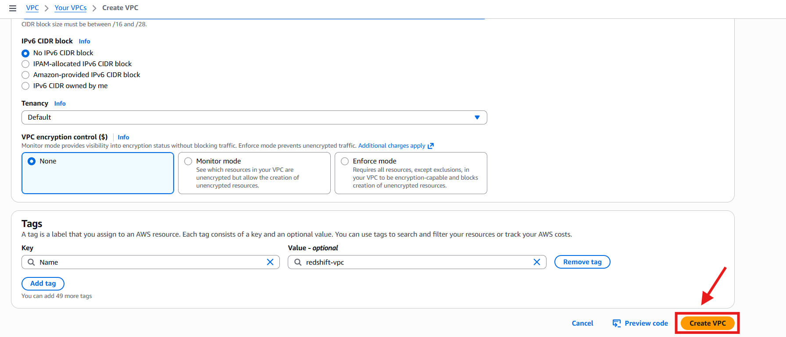

---

### Step 3.2: Create Subnets (at least 2 required)

Redshift Serverless requires subnets in at least two different Availability Zones.

1. In the VPC console left navigation pane, click **"Subnets"**.
2. Click **"Create subnet"**.
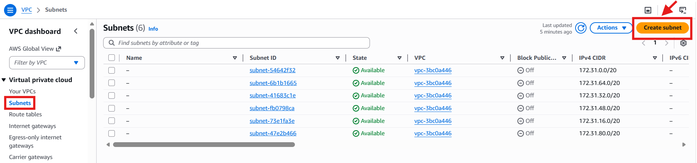
3. Under **VPC ID**, select `redshift-vpc`.
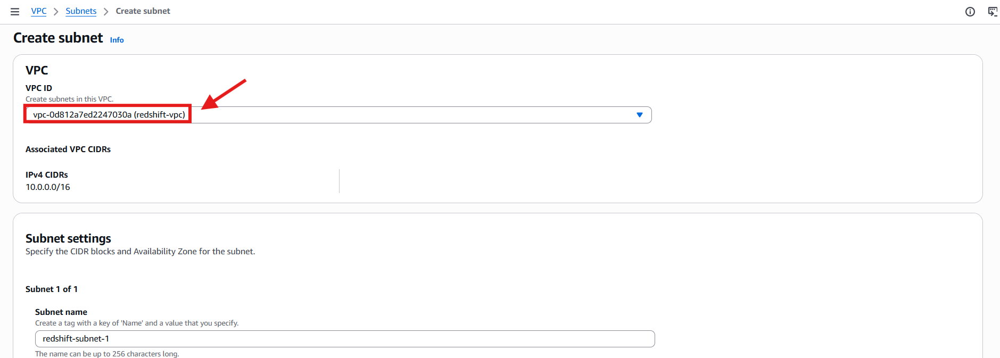
4. Fill in **Subnet 1**:
   - **Subnet name:** `redshift-subnet-1`
   - **Availability Zone:** `us-east-1a`
   - **IPv4 CIDR block:** `10.0.1.0/24`
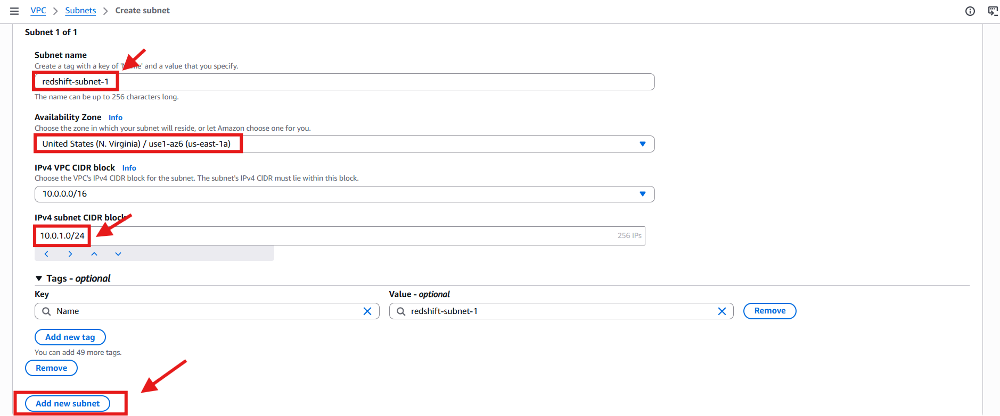
5. Click **"Add new subnet"** and fill in **Subnet 2**:
   - **Subnet name:** `redshift-subnet-2`
   - **Availability Zone:** `us-east-1b`
   - **IPv4 CIDR block:** `10.0.2.0/24`
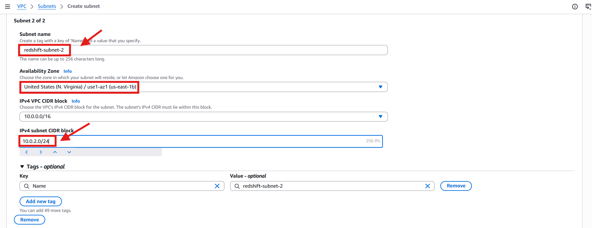
6. Click **"Create subnet"**.

---

### Step 3.3: Create a Security Group

1. In the VPC console left navigation pane, click **"Security Groups"**.
2. Click **"Create security group"**.
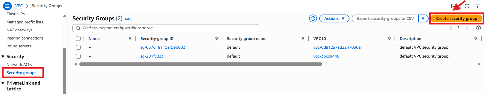
3. Fill in:
   - **Security group name:** `redshift-sg`
   - **Description:** `Security group for Redshift Serverless`
   - **VPC:** Select `redshift-vpc`
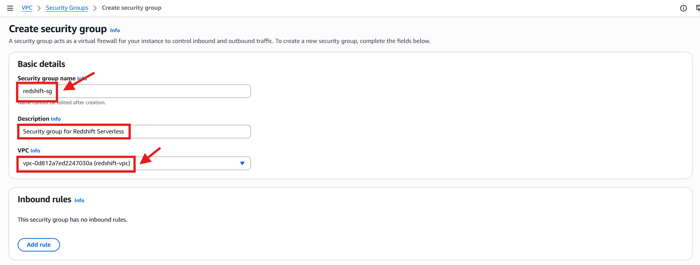
4. Leave **Inbound rules** and **Outbound rules** as default.
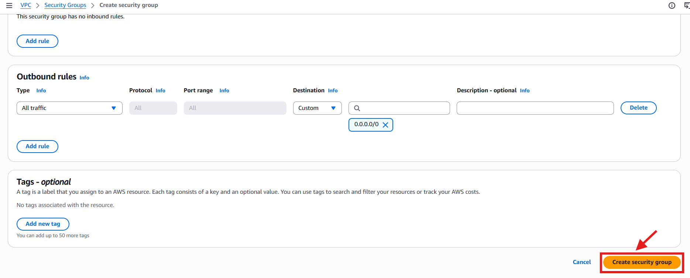
5. Click **"Create security group"**.

> **Why these resources?** The VPC provides an isolated network environment for Redshift. The two subnets in different Availability Zones allow Redshift Serverless to distribute compute across zones for resilience. The security group acts as a virtual firewall controlling what traffic can reach the Redshift endpoint.

---

# Activity 4: Provision Redshift Serverless

**Purpose of this Activity:** To create a Redshift Serverless namespace and workgroup using the AWS Console's guided setup. The namespace holds your databases, users, and IAM roles. The workgroup defines the compute configuration (RPU capacity) and network settings that queries run against.

### Step 4.1: Navigate to Amazon Redshift

1. In the AWS Management Console search bar, type **Redshift** and select it.

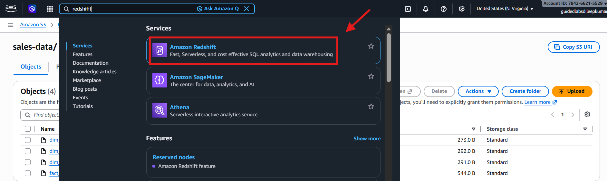

2. In the left navigation pane, click **Redshift Serverless**.

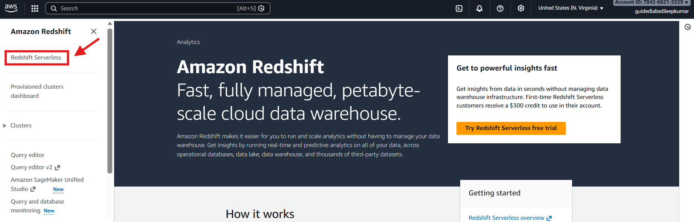

---

### Step 4.2: Configure Serverless Settings

When you click **Redshift Serverless** for the first time, the console automatically opens the **"Get started with Amazon Redshift Serverless"** setup page.

1. Under **Configuration**, select **"Customize settings"**.

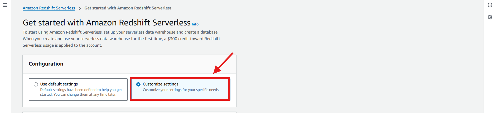

> **Note:** In some lab environments, the "Use default settings" option is disabled. Select "Customize settings" and fill in all fields manually as described below.

2. Fill in the **Namespace** section:
   - **Target namespace:** `sales-namespace`
   - **Database name:** `dev` (pre-filled, leave as is)
   - **Customize admin user credentials:** Leave **unchecked**
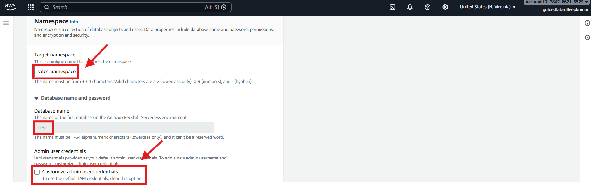

3. Fill in the **Permissions** section:
   - Click **"Associate IAM roles"** → search for and select `RedshiftS3AccessRole` → confirm.
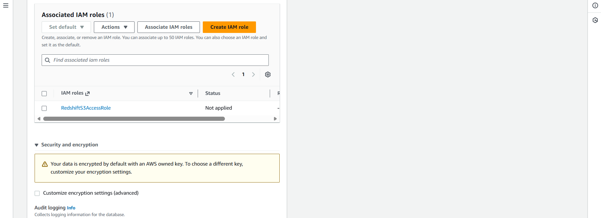

4. **Security and encryption:** Leave encryption as default (AWS owned key). Leave all audit logging checkboxes **unchecked**.

5. Fill in the **Workgroup** section:
   - **Workgroup name:** `sales-workgroup`
   - **Base capacity (RPU):** Select **`8`** from the dropdown (minimum, sufficient for this lab)
   - **Track:** Leave as `Current`
   - **IP address type:** Leave as `IPv4`
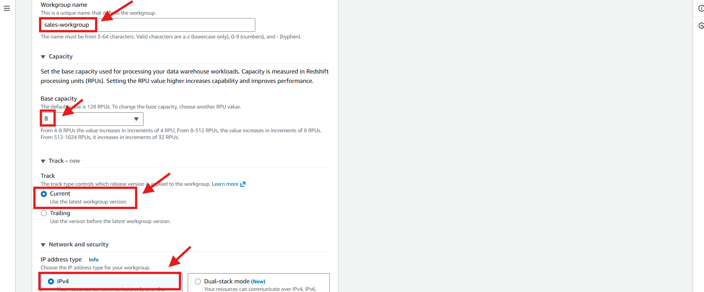

6. Fill in the **Network and security** section:
   - **VPC:** Select `redshift-vpc`
   - **VPC security groups:** Select `redshift-sg`
   - **Subnet:** Select both `redshift-subnet-1` and `redshift-subnet-2`
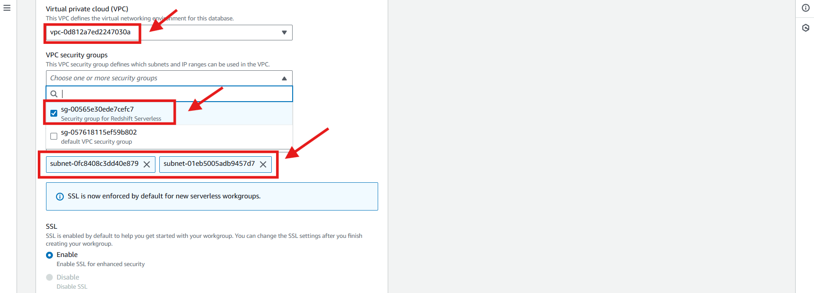
   - **SSL:** Leave as `Enable`
   - **Enhanced VPC routing:** Leave **unchecked**
   - **Autonomics configuration:** Leave as `Don't use extra compute`
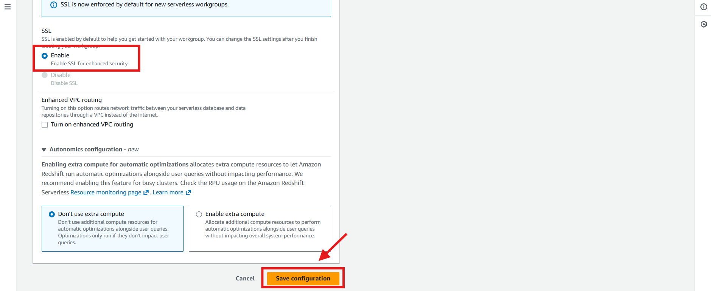
7. Scroll to the bottom of the page and click **"Save configuration"**.

> **Note on the red AccessDeniedException banner:** You may see an error at the top of the page saying `sqlworkbench:GetUserInfo is not authorized`. This is a known lab permission limitation and does **not** affect the Redshift Serverless setup. You can safely ignore it and continue.

---

### Step 4.3: Wait for Provisioning to Complete

After clicking Save configuration, a **"Create serverless"** progress dialog will appear.

1. The dialog shows a progress bar starting at **0%** — this is normal.
2. The progress bar will advance automatically. Wait until you see **"✅ Completed"** appear below the progress bar.

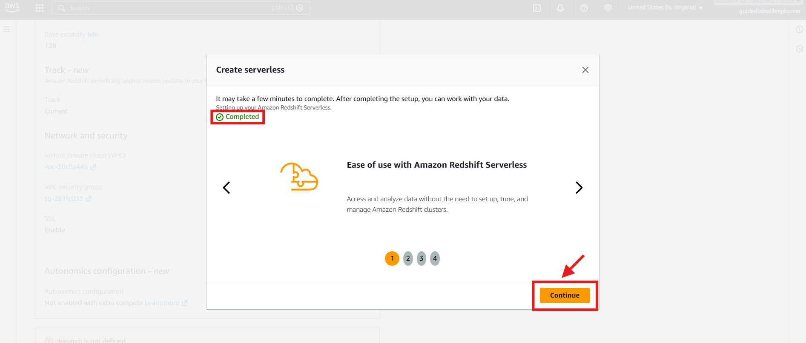

3. Once completed, the **"Continue"** button turns orange — click it to proceed to the **Serverless dashboard**.

---

### Step 4.4: Verify the Serverless Dashboard

After clicking Continue, you will land on the **Serverless dashboard**. Verify the following:

1. Under **Namespaces / Workgroups**, you should see:
   - **Namespace:** `sales-namespace` → ✅ **Available**
   - **Workgroup:** `sales-workgroup` → ✅ **Available**

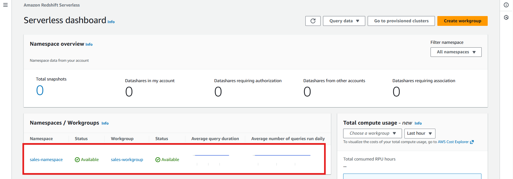

> **Note:** If the dashboard shows "No namespaces or workgroups have been created", click the **refresh** button (🔄) at the top right of the dashboard and wait 1–2 minutes. If it still shows empty, proceed to manually create a workgroup by clicking **"Create workgroup"** and using the same default values listed in Step 3.2 above.

> ⚠️ Validation Notice: Activities 5–7 are not included in automated validation due to Redshift Serverless limitations. Activity 5 uses session-specific schema visibility, while Activities 6–7 depend on Data API access restricted by private VPC boundaries. Results should be verified manually in Query Editor V2.

---

# Activity 5: Connect via Query Editor V2 and Create the Star Schema

**Purpose of this Activity:** To connect to your Redshift Serverless workgroup using the built-in Query Editor V2 (no client tools required) and create the four tables that form the star schema of your data warehouse.

### Step 5.1: Open Query Editor V2

1. In the Redshift console, click on **"Query editor v2"** in the left navigation pane.

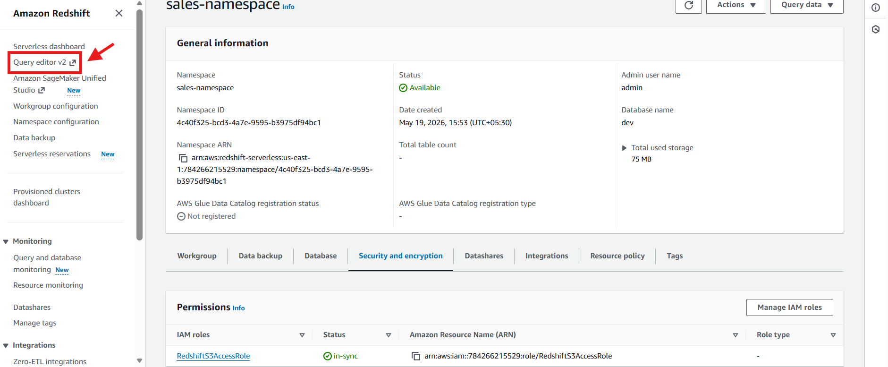

---

### Step 5.2: Connect to the Workgroup

After the account is configured, the Query Editor V2 main editor opens. You will see **"Serverless: default-workgroup"** listed in the left panel.

1. In the left panel, click on **"Serverless: default-workgroup"**.

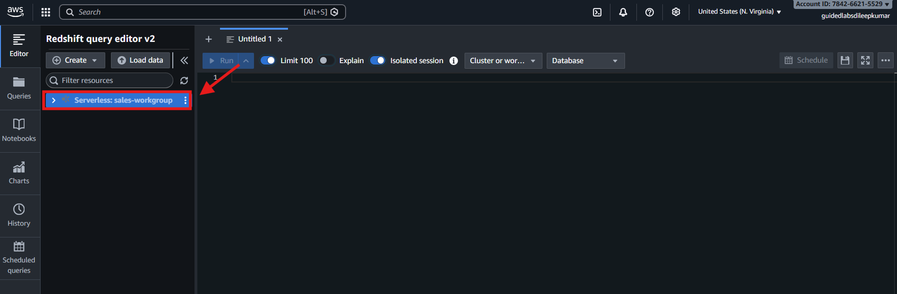

2. A **"Connect to default-workgroup"** dialog appears. Configure it as follows:
   - **Authentication:** Select **"Other ways to connect"** → then select **"Federated user"**.
   - **Database:** `dev` (pre-filled).

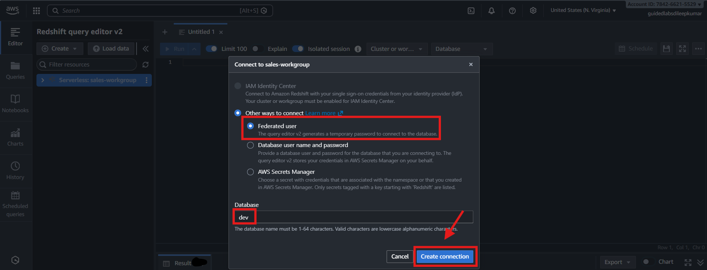

3. Click **"Create connection"**.
4. The connection is established. The left panel expands to show **"native databases (2)"** and **"external databases (1)"** under the workgroup, and the **Run** button in the toolbar becomes active.

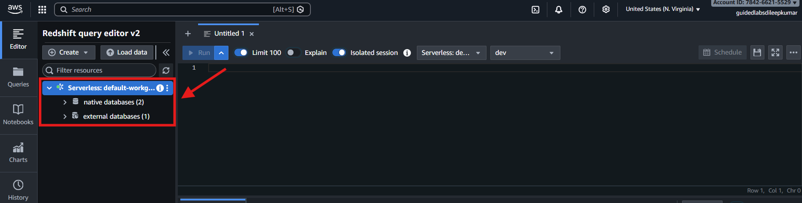

> **Federated user** authentication uses your current IAM session credentials to connect to Redshift. Query Editor V2 generates a temporary database credential behind the scenes — no password required.

> **Why is the Run button disabled before connecting?** Query Editor V2 requires an active database connection before it can execute SQL. Clicking the workgroup name in the left panel and creating a connection activates the Run button.

---

### Step 5.3: Create the Dimension Tables

Clear any existing content in the editor (Ctrl+A, then Delete). Paste and run each CREATE TABLE statement one at a time by clicking **Run** after each.

**Create `dim_customer`:**

```sql
CREATE TABLE dim_customer (
    customer_id      VARCHAR(10) NOT NULL,
    customer_name    VARCHAR(100),
    city             VARCHAR(50),
    state            VARCHAR(50),
    country          VARCHAR(50),
    customer_segment VARCHAR(30),
    PRIMARY KEY (customer_id)
) DISTSTYLE ALL SORTKEY (customer_id);
```

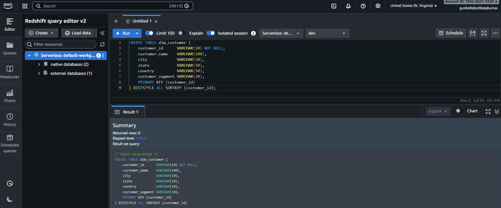

> **Expected result:** `Returned rows: 0` — this is correct for DDL (CREATE TABLE) statements. Redshift confirms success with "Returned rows: 0" and an elapsed time in milliseconds.

> **DISTSTYLE ALL** distributes a full copy of this table to every compute node. This is ideal for small dimension tables because it eliminates redistribution during JOIN operations with the fact table.

**Create `dim_product`:**

```sql
CREATE TABLE dim_product (
    product_id   VARCHAR(10) NOT NULL,
    product_name VARCHAR(100),
    category     VARCHAR(50),
    sub_category VARCHAR(50),
    brand        VARCHAR(50),
    PRIMARY KEY (product_id)
) DISTSTYLE ALL SORTKEY (product_id);
```

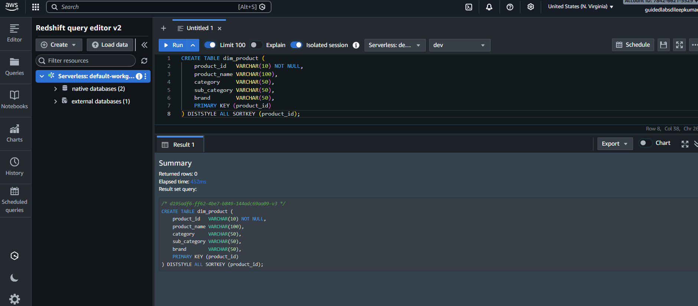


**Create `dim_date`:**

```sql
CREATE TABLE dim_date (
    date_id     VARCHAR(10) NOT NULL,
    full_date   DATE,
    day_of_week VARCHAR(15),
    month       VARCHAR(15),
    quarter     VARCHAR(5),
    year        INTEGER,
    is_weekend  BOOLEAN,
    PRIMARY KEY (date_id)
) DISTSTYLE ALL SORTKEY (date_id);
```

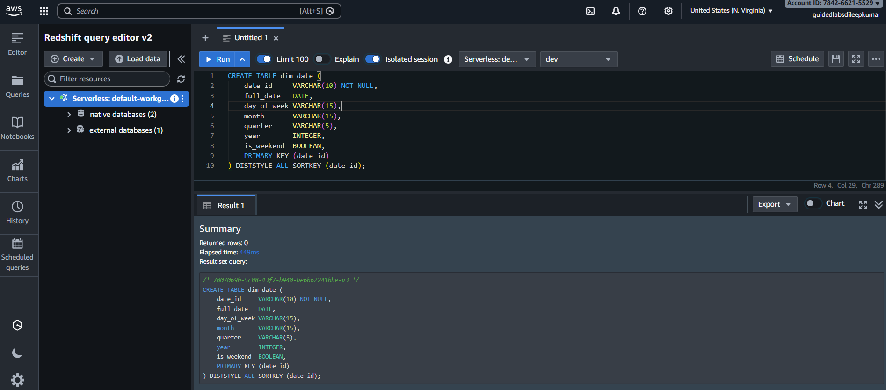

---

### Step 5.4: Create the Fact Table

```sql
CREATE TABLE fact_sales (
    sale_id       VARCHAR(10) NOT NULL,
    customer_id   VARCHAR(10),
    product_id    VARCHAR(10),
    date_id       VARCHAR(10),
    quantity_sold INTEGER,
    unit_price    DECIMAL(10,2),
    total_amount  DECIMAL(10,2),
    store_region  VARCHAR(20),
    PRIMARY KEY (sale_id)
) DISTKEY (customer_id) SORTKEY (date_id);
```

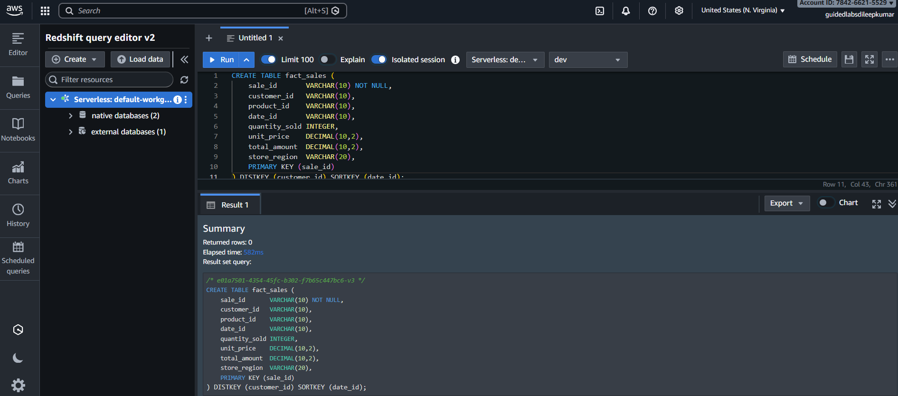

> **DISTKEY (customer_id):** Distributes fact table rows across compute nodes based on `customer_id`. Since most analytical queries will join `fact_sales` to `dim_customer`, co-locating rows by customer reduces data movement during JOINs.
>
> **SORTKEY (date_id):** Sorts rows on disk by `date_id`. Queries filtering on date ranges benefit from zone maps, allowing Redshift to skip irrelevant disk blocks entirely.

---

### Step 5.5: Verify Table Creation

Run the following query to confirm all four tables exist in the `public` schema:

```sql
SELECT DISTINCT tablename
FROM pg_table_def
WHERE schemaname = 'public'
  AND tablename IN ('fact_sales', 'dim_customer', 'dim_product', 'dim_date');
```

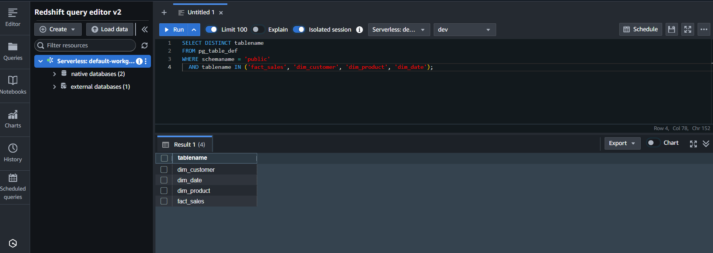

Expected output — **Total rows: 4**:

| tablename     |
| ------------- |
| dim_customer  |
| dim_date      |
| dim_product   |
| fact_sales    |

> **Note:** The `diststyle` column is not available in `pg_table_def` in Redshift Serverless. Use the query above which checks only `tablename` — it is sufficient to confirm all tables were created successfully.

---

# Activity 6: Load Data from S3 Using the COPY Command

**Purpose of this Activity:** To load the CSV files you uploaded to S3 into the Redshift star schema tables using the COPY command. COPY is the recommended and most efficient method for bulk data ingestion into Redshift — it loads data in parallel across all compute nodes.

### Step 6.1: Load `dim_customer`

In the Query Editor V2, clear the editor and paste the following COPY command. Replace `<your-bucket-name>` with your actual S3 bucket name and `<your-account-id>` with your AWS account ID.

```sql
COPY dim_customer
FROM 's3://<your-bucket-name>/sales-data/dim_customer.csv'
IAM_ROLE 'arn:aws:iam::<your-account-id>:role/RedshiftS3AccessRole'
FORMAT AS CSV
IGNOREHEADER 1;
```

Click **Run**. On success you will see:

> **Info: Load into table 'dim_customer' completed, 5 record(s) loaded successfully.**

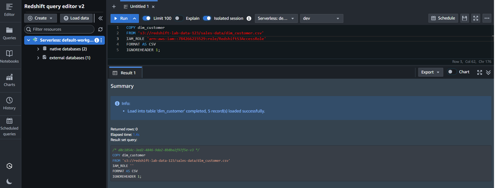

> **IGNOREHEADER 1** skips the first row (column headers) of the CSV file. **FORMAT AS CSV** tells Redshift the delimiter is a comma. The IAM role must match the one associated with your namespace in Activity 3.

---

### Step 6.2: Load `dim_product`

```sql
COPY dim_product
FROM 's3://<your-bucket-name>/sales-data/dim_product.csv'
IAM_ROLE 'arn:aws:iam::<your-account-id>:role/RedshiftS3AccessRole'
FORMAT AS CSV
IGNOREHEADER 1;
```

Expected success message: **Load into table 'dim_product' completed, 5 record(s) loaded successfully.**


---

### Step 6.3: Load `dim_date`

```sql
COPY dim_date
FROM 's3://<your-bucket-name>/sales-data/dim_date.csv'
IAM_ROLE 'arn:aws:iam::<your-account-id>:role/RedshiftS3AccessRole'
FORMAT AS CSV
IGNOREHEADER 1;
```

Expected success message: **Load into table 'dim_date' completed, 5 record(s) loaded successfully.**

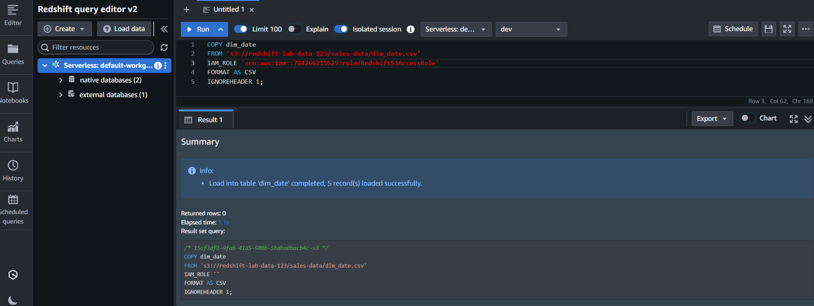

---

### Step 6.4: Load `fact_sales`

```sql
COPY fact_sales
FROM 's3://<your-bucket-name>/sales-data/fact_sales.csv'
IAM_ROLE 'arn:aws:iam::<your-account-id>:role/RedshiftS3AccessRole'
FORMAT AS CSV
IGNOREHEADER 1;
```

Expected success message: **Load into table 'fact_sales' completed, 10 record(s) loaded successfully.**


---

### Step 6.5: Verify Row Counts

After all four COPY commands complete successfully, run this query to confirm the correct number of records in each table:

```sql
SELECT 'dim_customer' AS table_name, COUNT(*) AS row_count FROM dim_customer
UNION ALL
SELECT 'dim_product',                COUNT(*)               FROM dim_product
UNION ALL
SELECT 'dim_date',                   COUNT(*)               FROM dim_date
UNION ALL
SELECT 'fact_sales',                 COUNT(*)               FROM fact_sales;
```

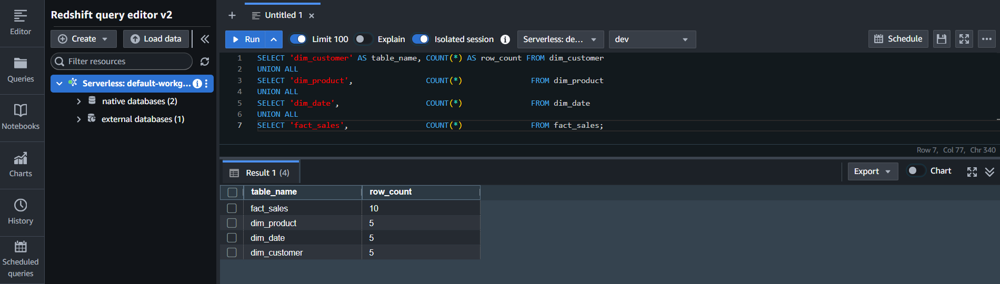

Expected output — **Total rows: 4** (one summary row per table):

| table_name   | row_count |
| ------------ | --------- |
| dim_product  | 5         |
| dim_date     | 5         |
| fact_sales   | 10        |
| dim_customer | 5         |

---

# Activity 7: Run Multi-Table Analytical Queries

**Purpose of this Activity:** To query the star schema using multi-table JOINs and aggregate functions — simulating the types of analytical reports a business intelligence team would generate from a data warehouse.

### Step 7.1: Query 1 — Total Revenue by Product Category

```sql
SELECT
    p.category,
    p.sub_category,
    SUM(f.quantity_sold)          AS total_units_sold,
    ROUND(SUM(f.total_amount), 2) AS total_revenue
FROM fact_sales f
JOIN dim_product p ON f.product_id = p.product_id
GROUP BY p.category, p.sub_category
ORDER BY total_revenue DESC;
```

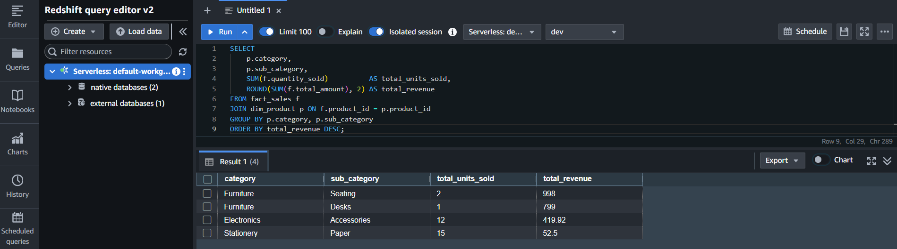

Expected output — **Total rows: 4**:

| category    | sub_category | total_units_sold | total_revenue |
| ----------- | ------------ | ---------------- | ------------- |
| Furniture   | Seating      | 2                | 998           |
| Furniture   | Desks        | 1                | 799           |
| Electronics | Accessories  | 12               | 419.92        |
| Stationery  | Paper        | 15               | 52.5          |

This query tells you which product categories drive the most revenue. Furniture dominates with the highest per-unit value, while Stationery leads in units sold but contributes the least revenue — helping the merchandising team prioritize inventory and promotions.

---

### Step 7.2: Query 2 — Revenue by Customer Segment and Region

```sql
SELECT
    c.customer_segment,
    f.store_region,
    COUNT(DISTINCT f.sale_id)     AS total_orders,
    ROUND(SUM(f.total_amount), 2) AS total_revenue,
    ROUND(AVG(f.total_amount), 2) AS avg_order_value
FROM fact_sales f
JOIN dim_customer c ON f.customer_id = c.customer_id
GROUP BY c.customer_segment, f.store_region
ORDER BY total_revenue DESC;
```

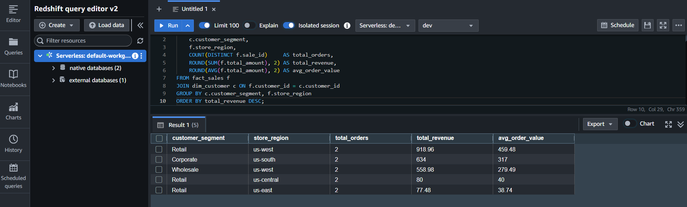

Expected output — **Total rows: 5**:

| customer_segment | store_region | total_orders | total_revenue | avg_order_value |
| ---------------- | ------------ | ------------ | ------------- | --------------- |
| Retail           | us-west      | 2            | 918.96        | 459.48          |
| Corporate        | us-south     | 2            | 634           | 317             |
| Wholesale        | us-west      | 2            | 558.98        | 279.49          |
| Retail           | us-central   | 2            | 80            | 40              |
| Retail           | us-east      | 2            | 77.48         | 38.74           |

This report helps the sales team understand which customer segments and geographic regions contribute the most revenue. Retail customers in us-west have the highest average order value at $459.48.

---

### Step 7.3: Query 3 — Sales Performance by Quarter

```sql
SELECT
    d.quarter,
    d.year,
    COUNT(DISTINCT f.sale_id)     AS total_transactions,
    ROUND(SUM(f.total_amount), 2) AS quarterly_revenue
FROM fact_sales f
JOIN dim_date d ON f.date_id = d.date_id
GROUP BY d.quarter, d.year
ORDER BY d.year, d.quarter;
```

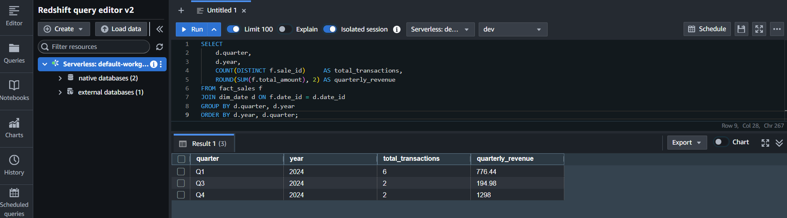

Expected output — **Total rows: 3**:

| quarter | year | total_transactions | quarterly_revenue |
| ------- | ---- | ------------------ | ----------------- |
| Q1      | 2024 | 6                  | 776.44            |
| Q3      | 2024 | 2                  | 194.98            |
| Q4      | 2024 | 2                  | 1298              |

This query provides a quarterly revenue summary. Q4 2024 had the highest revenue ($1,298) despite only 2 transactions — driven by high-value Furniture purchases — while Q1 had the most transactions (6).

---

### Step 7.4: Query 4 — Top Customers by Revenue

```sql
SELECT
    c.customer_name,
    c.city,
    c.state,
    c.customer_segment,
    COUNT(DISTINCT f.sale_id)     AS total_orders,
    ROUND(SUM(f.total_amount), 2) AS lifetime_value
FROM fact_sales f
JOIN dim_customer c ON f.customer_id = c.customer_id
GROUP BY c.customer_name, c.city, c.state, c.customer_segment
ORDER BY lifetime_value DESC
LIMIT 10;
```

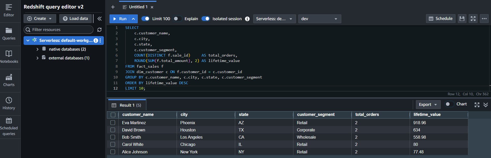

Expected output — **Total rows: 5**:

| customer_name | city        | state | customer_segment | total_orders | lifetime_value |
| ------------- | ----------- | ----- | ---------------- | ------------ | -------------- |
| Eva Martinez  | Phoenix     | AZ    | Retail           | 2            | 918.96         |
| David Brown   | Houston     | TX    | Corporate        | 2            | 634            |
| Bob Smith     | Los Angeles | CA    | Wholesale        | 2            | 558.98         |
| Carol White   | Chicago     | IL    | Retail           | 2            | 80             |
| Alice Johnson | New York    | NY    | Retail           | 2            | 77.48          |

This query identifies your highest-value customers. Eva Martinez (Phoenix, AZ) leads with $918.96 lifetime value — useful for loyalty programmes, account management prioritization, and targeted marketing.

---

### Step 7.5: Query 5 — Weekend vs Weekday Sales Comparison

```sql
SELECT
    CASE WHEN d.is_weekend THEN 'Weekend' ELSE 'Weekday' END AS day_type,
    COUNT(DISTINCT f.sale_id)     AS total_orders,
    ROUND(SUM(f.total_amount), 2) AS total_revenue,
    ROUND(AVG(f.total_amount), 2) AS avg_order_value
FROM fact_sales f
JOIN dim_date d ON f.date_id = d.date_id
GROUP BY d.is_weekend
ORDER BY total_revenue DESC;
```

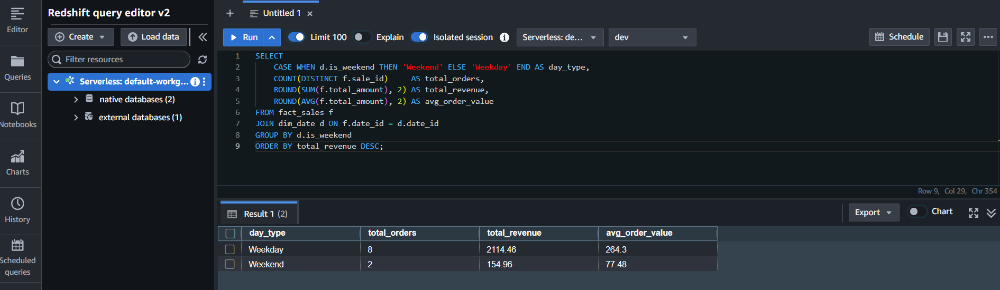

Expected output — **Total rows: 2**:

| day_type | total_orders | total_revenue | avg_order_value |
| -------- | ------------ | ------------- | --------------- |
| Weekday  | 8            | 2114.46       | 264.3           |
| Weekend  | 2            | 154.96        | 77.48           |

This report reveals a clear difference — weekday orders generate significantly more revenue ($2,114.46) with a higher average order value ($264.30) compared to weekends ($154.96). This insight is valuable for staffing and promotional scheduling decisions.

---

# Activity 8: Read and Interpret EXPLAIN Plan Output

**Purpose of this Activity:** To run EXPLAIN on your analytical queries and understand what the output is telling you about how Redshift plans to execute them. Reading EXPLAIN plans is a foundational skill for diagnosing slow queries and validating that your table design choices (distribution style, sort keys) are being used correctly.

### Step 8.1: Run EXPLAIN on Query 1

Prepend `EXPLAIN` to your first analytical query and run it:

```sql
EXPLAIN
SELECT
    p.category,
    p.sub_category,
    SUM(f.quantity_sold)          AS total_units_sold,
    ROUND(SUM(f.total_amount), 2) AS total_revenue
FROM fact_sales f
JOIN dim_product p ON f.product_id = p.product_id
GROUP BY p.category, p.sub_category
ORDER BY total_revenue DESC;
```

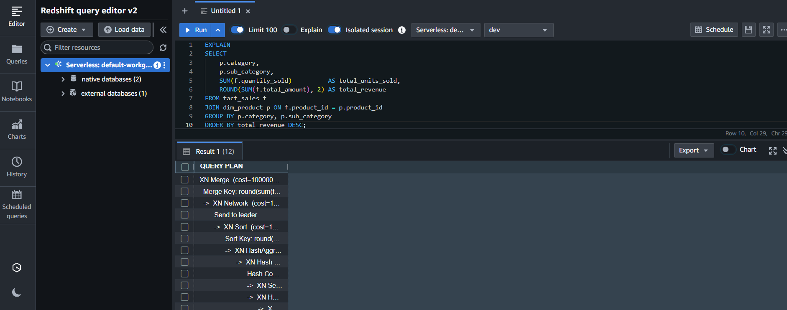

---

### Step 8.2: Understand the EXPLAIN Output

The EXPLAIN output is a tree of operations Redshift will perform to execute your query. Read it **bottom-up** — each node receives input from the node(s) below it.

**Key operators to look for:**

| Operator              | What it means                                                                 |
| --------------------- | ----------------------------------------------------------------------------- |
| `XN Seq Scan`         | Sequential scan of a table — reads rows from disk                            |
| `XN Hash`             | Builds a hash table in memory for a hash join                                 |
| `XN Hash Join`        | Joins two tables using a hash join — the most common join in Redshift         |
| `XN Aggregate`        | Computes aggregate functions (SUM, COUNT, AVG)                                |
| `XN Sort`             | Sorts rows — triggered by ORDER BY or sort key optimization                   |
| `XN Broadcast`        | Sends a copy of a table to all nodes — expected for DISTSTYLE ALL tables      |
| `XN Distribute`       | Redistributes rows across nodes — watch for this; it indicates data movement  |

**What to look for in your output:**

- `dim_product` should show **DS_BCAST_INNER** — this confirms the `DISTSTYLE ALL` setting is being used (the dimension table is broadcast to all nodes rather than redistributed on the fly).
- `fact_sales` should show **DS_DIST_NONE** on the join to `dim_customer` (if joining on `customer_id`, which is the DISTKEY) — meaning no redistribution is needed.
- Presence of **DS_DIST_INNER** or **DS_DIST_BOTH** on large tables indicates data movement, which is a potential performance concern to investigate.

---

### Step 8.3: Run EXPLAIN on the Multi-Table Query

Now run EXPLAIN on Query 2 which joins both `dim_customer` and `dim_date`:

```sql
EXPLAIN
SELECT
    c.customer_segment,
    f.store_region,
    COUNT(DISTINCT f.sale_id)     AS total_orders,
    ROUND(SUM(f.total_amount), 2) AS total_revenue,
    ROUND(AVG(f.total_amount), 2) AS avg_order_value
FROM fact_sales f
JOIN dim_customer c ON f.customer_id = c.customer_id
GROUP BY c.customer_segment, f.store_region
ORDER BY total_revenue DESC;
```

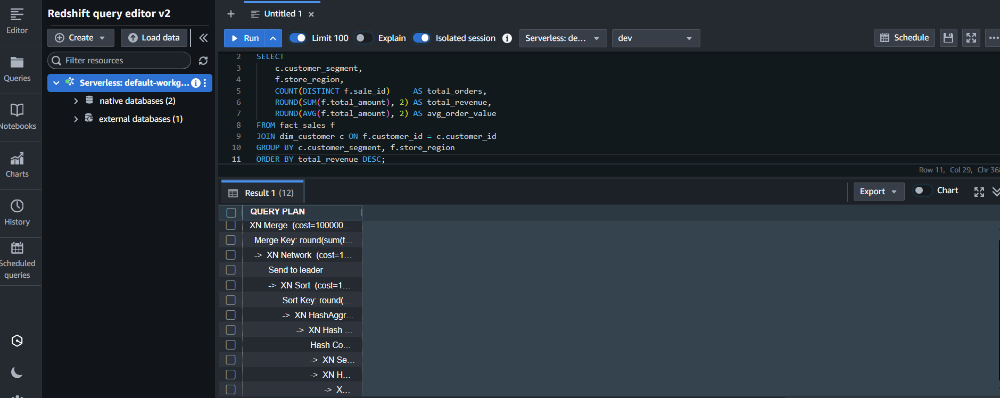

**Observe:**
- The join order Redshift chooses (it may reorder joins for efficiency).
- Whether dimension tables are being broadcast (`DS_BCAST_INNER`) — confirming the `DISTSTYLE ALL` design is paying off.
- The estimated `cost=` values at each node — higher cost nodes are where the most work is happening.

> **Key insight:** In a well-designed star schema, you want to see dimension tables broadcast to compute nodes (not redistributed), and the fact table join happening locally on each node. This is the primary reason we used `DISTSTYLE ALL` for dimension tables and `DISTKEY` on the fact table.

---

### Step 8.4: Compare EXPLAIN Plans

Run `EXPLAIN` on Query 5 (Weekend vs Weekday) and compare its plan to Query 1:

```sql
EXPLAIN
SELECT
    CASE WHEN d.is_weekend THEN 'Weekend' ELSE 'Weekday' END AS day_type,
    COUNT(DISTINCT f.sale_id)     AS total_orders,
    ROUND(SUM(f.total_amount), 2) AS total_revenue,
    ROUND(AVG(f.total_amount), 2) AS avg_order_value
FROM fact_sales f
JOIN dim_date d ON f.date_id = d.date_id
GROUP BY d.is_weekend
ORDER BY total_revenue DESC;
```

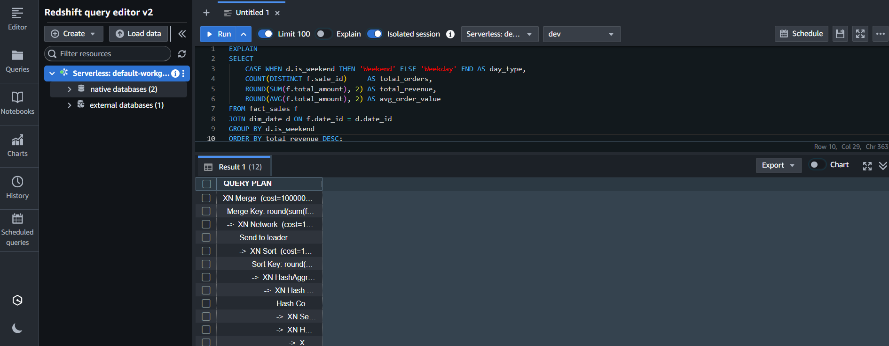

**Questions to reflect on:**
- Does the plan differ in complexity compared to Query 1? Why?
- Is there a `DS_DIST_*` step anywhere? What does that tell you?
- Where does the aggregation (`XN Aggregate`) happen — before or after the join?

> **Tip:** The EXPLAIN plan does not actually execute the query — it only shows the planned steps. To see real execution metrics (actual rows, execution time per step), you can query the `SVL_QUERY_REPORT` system view after running the query.

---

## 🎓 Conclusion

This guided project demonstrated how to stand up a fully functional cloud data warehouse on Amazon Redshift Serverless — from provisioning through querying — and apply foundational data warehousing principles in a practical setting.

You applied hands-on data engineering and analytics patterns including:

- Provisioning a **Redshift Serverless workgroup** with appropriate RPU limits and VPC configuration, understanding the difference between namespaces and workgroups.
- Creating an **IAM role** following the principle of least privilege to grant Redshift access to S3.
- Designing a **star schema** (one fact table, three dimension tables) with deliberate choices around distribution styles (DISTSTYLE ALL for dimensions, DISTKEY for the fact table) and sort keys.
- Loading data efficiently using the **COPY command** from S3, and diagnosing load errors using `STL_LOAD_ERRORS`.
- Writing **multi-table analytical queries** using JOINs, GROUP BY, and aggregate functions to answer real business questions.
- Reading and interpreting **EXPLAIN plan output** — understanding operators like `XN Hash Join`, `DS_BCAST_INNER`, and `XN Aggregate`, and connecting them back to your table design decisions.

These skills form the foundation of working with a modern MPP data warehouse. As a next step, explore Redshift Materialized Views for pre-computing expensive aggregations, and Workload Management (WLM) for prioritizing query queues in multi-team environments!
