# Title: Redshift Performance Optimization & Governance

---

## 🌟 Overview: What is the purpose of this Lab?

Welcome to your Amazon Redshift Performance Optimization & Governance lab! In production data warehouse environments, query performance and data security are not optional — they are operational requirements. As data volumes grow and more teams query the warehouse simultaneously, unoptimized queries cause slowdowns, rogue queries consume all available resources, and sensitive data becomes exposed without proper controls. This lab addresses all three challenges in a single, cohesive workflow.

**The Purpose of this Lab:**
You are part of a data engineering team responsible for optimizing performance and securing a data warehouse. Your task is to improve query efficiency using materialized views, protect sensitive data using dynamic data masking, and securely share data across teams using Redshift Data Sharing. You will also monitor system behaviour using CloudWatch metrics and Redshift system tables.

By the end of this project, you will have:

- Provisioned a **Redshift Serverless workgroup** with appropriate RPU limits and VPC configuration.
- Created all **base tables** and loaded sample data from scratch.
- Created a **Materialized View** on the fact table and configured **auto-refresh** to keep it current.
- Verified materialized view usage through **EXPLAIN plan inspection** and system table queries.
- Implemented **dynamic data masking** on a PII column (`email`) to restrict sensitive data exposure by role.
- Configured **Redshift Data Sharing** between a producer namespace and a consumer namespace, enabling cross-team data access without data movement.
- Monitored query performance using **CloudWatch metrics** and **STL/SYS system tables**.

### Learning Path:

1. **Authentication:** Configure your AWS Console access and set the working region.
2. **IAM Setup:** Create an IAM role granting Redshift permission to read from S3.
3. **VPC Setup:** Create a VPC, subnets, and security group for Redshift networking.
4. **Redshift Serverless:** Provision a workgroup and namespace with appropriate RPU settings.
5. **Schema Setup:** Connect via Query Editor V2, create all base tables, and load sample data.
6. **Materialized Views:** Create a materialized view with auto-refresh and validate via EXPLAIN.
7. **Dynamic Data Masking:** Define a masking policy on a PII column and apply it to a restricted role.
8. **Redshift Data Sharing:** Configure a producer datashare and a consumer namespace to query it live.
9. **Monitoring:** Inspect CloudWatch metrics and Redshift system tables to validate all configurations.

---

## 📊 Dataset / Knowledge Source Used

This lab uses a **simulated retail sales dataset** extended with a customer PII table, representing a realistic data warehouse setup where performance, access control, and cross-team data sharing are everyday operational requirements. The schema consists of a central fact table, supporting dimension tables, and a sensitive PII table that is subject to masking policies.

**Schema Overview:**

```
          dim_product
               |
dim_date ── fact_sales ── dim_customer
                               |
                         customer_pii
```

**fact_sales** (Fact Table — base table for materialized view):

```
sale_id, customer_id, product_id, date_id, quantity_sold, unit_price, total_amount, store_region
```

**dim_customer** (Dimension Table):

```
customer_id, customer_name, city, state, customer_segment
```

**dim_product** (Dimension Table):

```
product_id, product_name, category, sub_category, brand
```

**dim_date** (Dimension Table):

```
date_id, full_date, day_of_week, month, quarter, year, is_weekend
```

**customer_pii** (PII Table — subject to dynamic data masking):

```
customer_id, customer_name, email, phone_number, date_of_birth
```

| Table          | Type      | Row Count | Description                                         |
| -------------- | --------- | --------- | --------------------------------------------------- |
| `fact_sales`   | Fact      | 11        | One row per sales transaction                       |
| `dim_customer` | Dimension | 5         | Customer master data with geographic attributes     |
| `dim_product`  | Dimension | 5         | Product catalog with category hierarchy             |
| `dim_date`     | Dimension | 5         | Date records for the calendar year 2024             |
| `customer_pii` | PII       | 5         | Sensitive customer data subject to masking policies |

---

## 🛠️ Prerequisites & AWS Setup

Ensure the following are available before starting:

- An **AWS account** with permissions for Redshift, S3, IAM, VPC, and CloudWatch.
- Access to the **AWS Console** (lab credentials provided).
- Familiarity with SQL (SELECT, JOIN, GROUP BY, aggregate functions).
- No local tools required — all activities are performed in the **AWS Console** and **Redshift Query Editor V2**.

---

## Configure AWS Credentials

First, log in to the AWS Web Console to set up your environment.

- Login to AWS Console:
  - Click on the `Lab Access` icon on the desktop.


- Click on `Access Lab` and using the given credentials login to AWS Console. This will allow you to access the AWS resources from the Console.


- Once logged in, set the region to `us-east-1`. Create all resources in the **US-EAST-1 (N. Virginia) Region**.

- Steps to select the AWS region in the AWS Console:
  - Locate the region selector at the top-right corner of the console (next to your Account Name).
  - Click on the dropdown, and a list of available AWS Regions will appear.


  - Choose **us-east-1 (N. Virginia)** Region.


---

# Activity 1: Create the IAM Role for Redshift

**Purpose of this Activity:** To create an IAM role that grants Amazon Redshift Serverless the permissions it needs to read data files directly from S3 using the COPY command. Without this role, Redshift cannot access your S3 bucket.

### Step 1.1: Navigate to IAM

1. In the AWS Management Console search bar, type **IAM** and select it from the services menu.

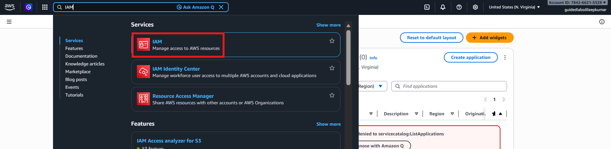

2. In the left navigation pane, click **Roles**.
3. Click the **Create role** button.

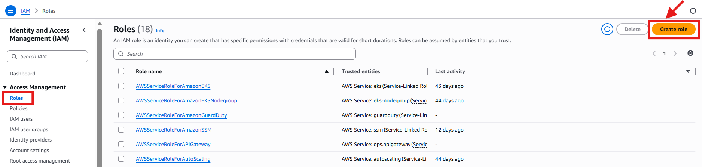

---

### Step 1.2: Configure the Trust Policy

1. On the **Select trusted entity** page:
   - **Trusted entity type:** Select **AWS service**.
   - **Use case:** Scroll down and select **Redshift**.
   - Under the use case options, select **Redshift - Customizable**.

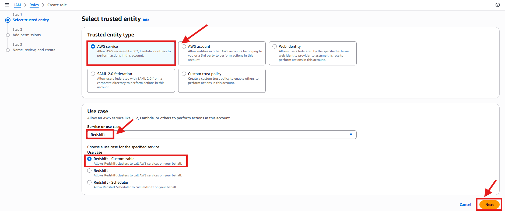

2. Click **Next**.

---

### Step 1.3: Attach Permissions

1. On the **Add permissions** page, search for `AmazonS3ReadOnlyAccess`.
2. Check the box next to **AmazonS3ReadOnlyAccess** to attach it.

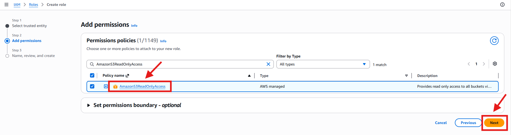

> **Why S3ReadOnlyAccess?** The COPY command reads data from S3 into Redshift. Read-only access is sufficient and follows the principle of least privilege — Redshift does not need to write back to S3 for this activity.

3. Click **Next**.

---

### Step 1.4: Name and Create the Role

1. On the **Name, review, and create** page:
   - **Role name:** Enter `RedshiftS3AccessRole`.
   - **Description:** Enter `Allows Redshift Serverless to read from S3 for the COPY command.`

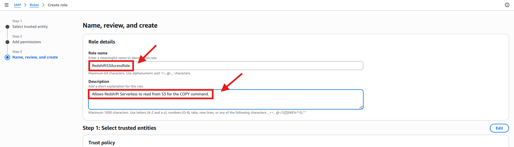

2. Scroll down and click **Create role**.

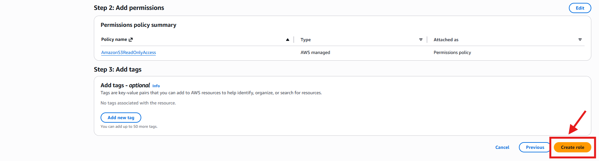

3. Once created, click on the **`RedshiftS3AccessRole`** name to open its detail page.
4. Copy and save the **Role ARN** from the Summary section — you will need it in later activities.

   Example ARN format:
   ```
   arn:aws:iam::123456789012:role/RedshiftS3AccessRole
   ```

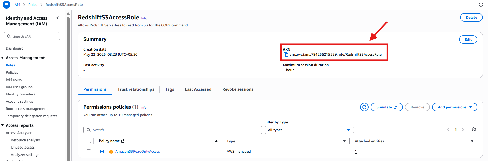

---

# Activity 2: Create VPC, Subnets, and Security Group

**Purpose of this Activity:** Before provisioning Redshift Serverless, you need to set up the networking resources — a VPC, subnets, and a security group. Redshift Serverless requires a VPC with at least two subnets in different Availability Zones and an associated security group to define its network boundary.

### Step 2.1: Create a VPC

1. In the AWS Management Console search bar, type **VPC** and select it.

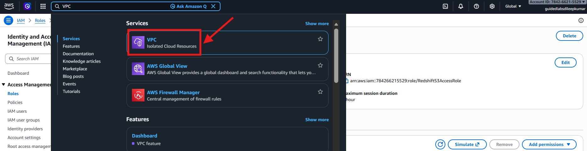

2. In the left navigation pane, click **"Your VPCs"**.
3. Click **"Create VPC"**.

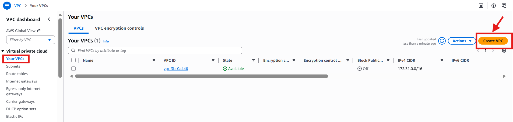

4. Fill in the following:
   - **Resources to create:** Select `VPC only`
   - **Name tag:** `redshift-vpc`
   - **IPv4 CIDR block:** `10.0.0.0/16`

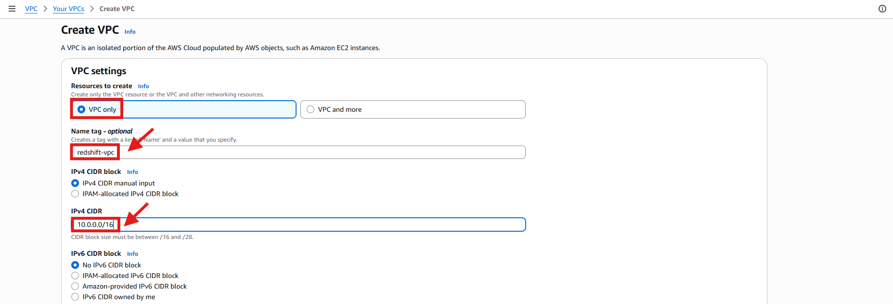

   - Leave all other settings as default.
5. Click **"Create VPC"**.

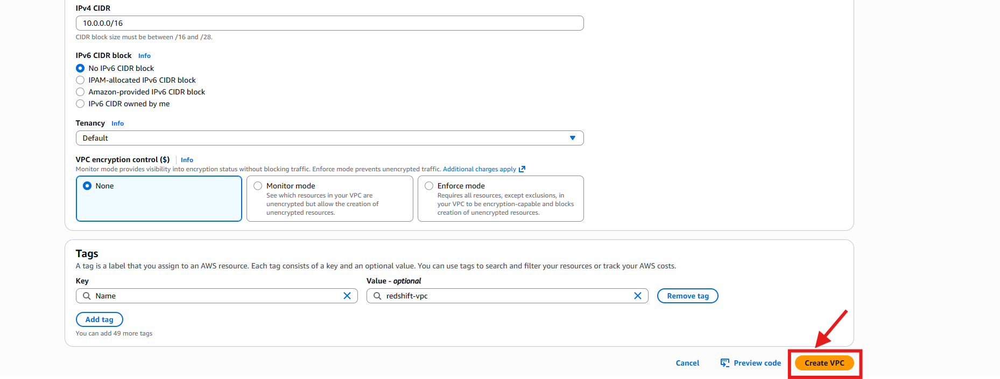

---

### Step 2.2: Create Subnets

Redshift Serverless requires subnets in at least two different Availability Zones.

1. In the VPC console left navigation pane, click **"Subnets"**.
2. Click **"Create subnet"**.

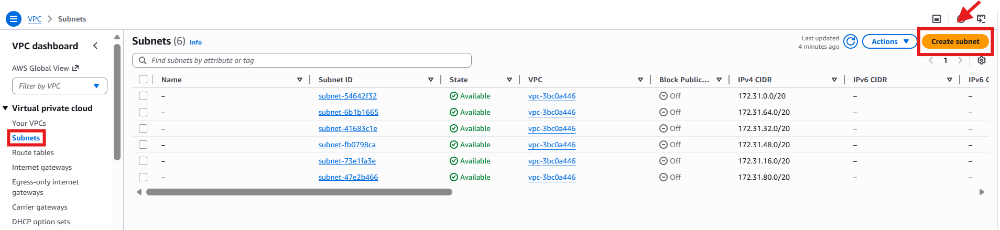

3. Under **VPC ID**, select `redshift-vpc`.

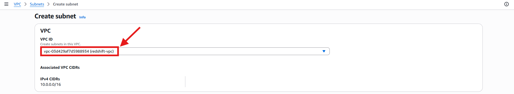

4. Fill in **Subnet 1**:
   - **Subnet name:** `redshift-subnet-1`
   - **Availability Zone:** `us-east-1a`
   - **IPv4 CIDR block:** `10.0.1.0/24`

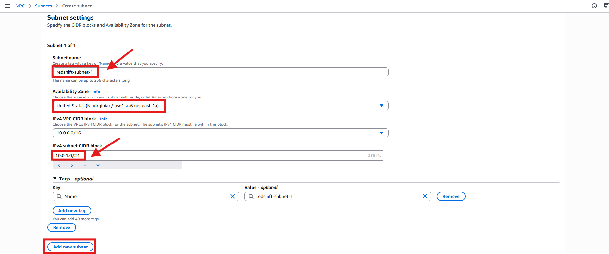

5. Click **"Add new subnet"** and fill in **Subnet 2**:
   - **Subnet name:** `redshift-subnet-2`
   - **Availability Zone:** `us-east-1b`
   - **IPv4 CIDR block:** `10.0.2.0/24`

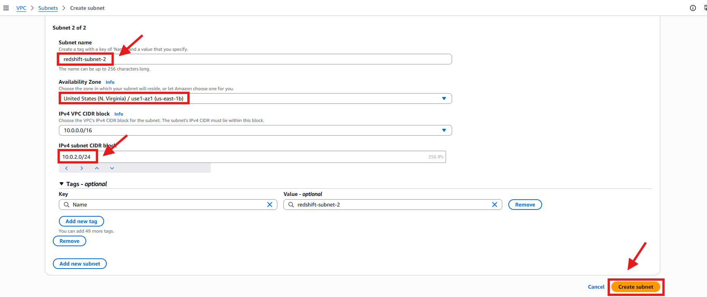

6. Click **"Create subnet"**.

---

### Step 2.3: Create a Security Group

1. In the VPC console left navigation pane, click **"Security Groups"**.
2. Click **"Create security group"**.

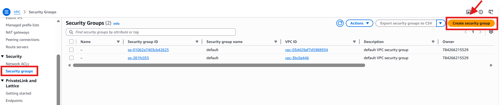

3. Fill in:
   - **Security group name:** `redshift-sg`
   - **Description:** `Security group for Redshift Serverless`
   - **VPC:** Select `redshift-vpc`

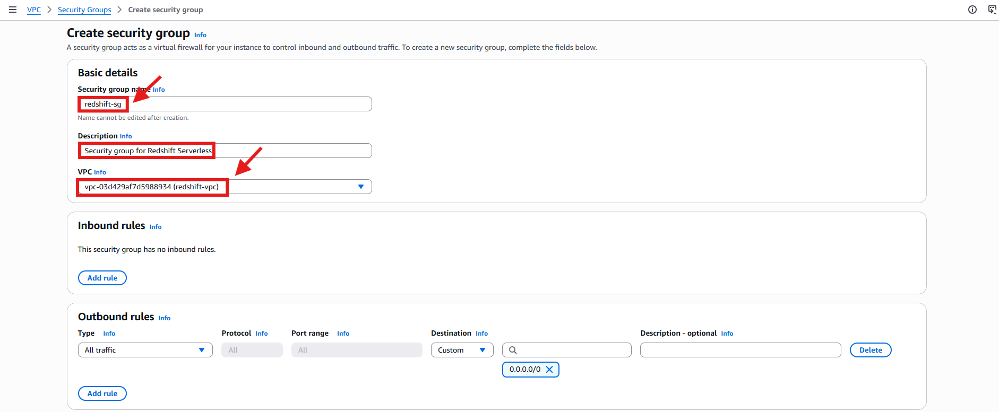

4. Leave **Inbound rules** and **Outbound rules** as default.

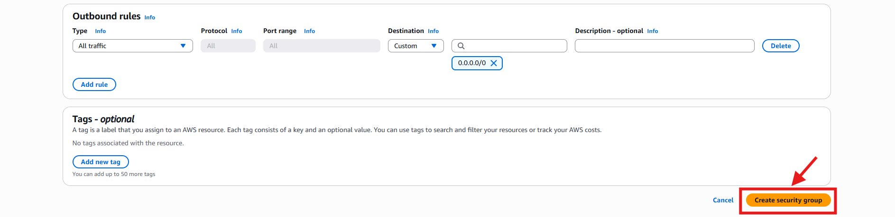

5. Click **"Create security group"**.

> **Why these resources?** The VPC provides an isolated network environment for Redshift. The two subnets in different Availability Zones allow Redshift Serverless to distribute compute across zones for resilience. The security group acts as a virtual firewall controlling what traffic can reach the Redshift endpoint.

---

# Activity 3: Provision Redshift Serverless

**Purpose of this Activity:** To create a Redshift Serverless namespace and workgroup using the AWS Console's guided setup. The namespace holds your databases, users, and IAM roles. The workgroup defines the compute configuration (RPU capacity) and network settings that queries run against.

### Step 3.1: Navigate to Amazon Redshift

1. In the AWS Management Console search bar, type **Redshift** and select it.

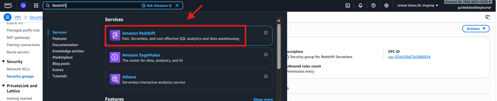

2. In the left navigation pane, click **Redshift Serverless**.

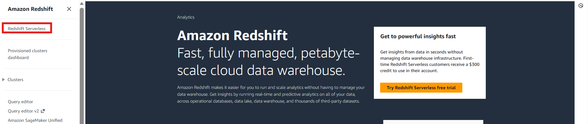

---

### Step 3.2: Configure Serverless Settings

When you click **Redshift Serverless** for the first time, the console automatically opens the **"Get started with Amazon Redshift Serverless"** setup page.

1. Under **Configuration**, select **"Customize settings"**.

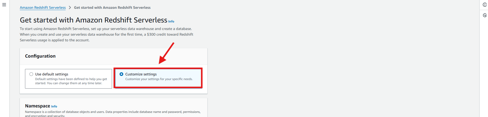

> **Note:** In some lab environments, the "Use default settings" option is disabled. Select "Customize settings" and fill in all fields manually as described below.

2. Fill in the **Namespace** section:
   - **Target namespace:** `sales-namespace`
   - **Database name:** `dev` (pre-filled, leave as is)
   - **Customize admin user credentials:** Leave **unchecked**

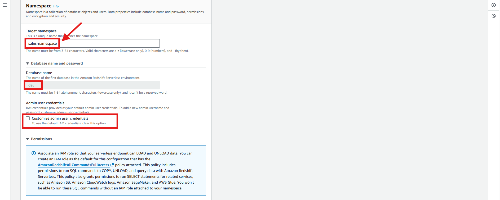

3. Fill in the **Permissions** section:
   - Click **"Associate IAM roles"** → search for and select `RedshiftS3AccessRole` → confirm.

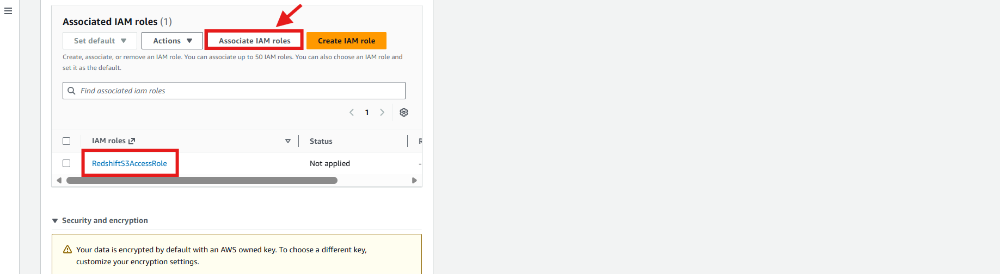

4. **Security and encryption:** Leave encryption as default (AWS owned key). Leave all audit logging checkboxes **unchecked**.

5. Fill in the **Workgroup** section:
   - **Workgroup name:** `sales-workgroup`
   - **Base capacity (RPU):** Select **`8`** from the dropdown (minimum, sufficient for this lab)
   - **Track:** Leave as `Current`
   - **IP address type:** Leave as `IPv4`

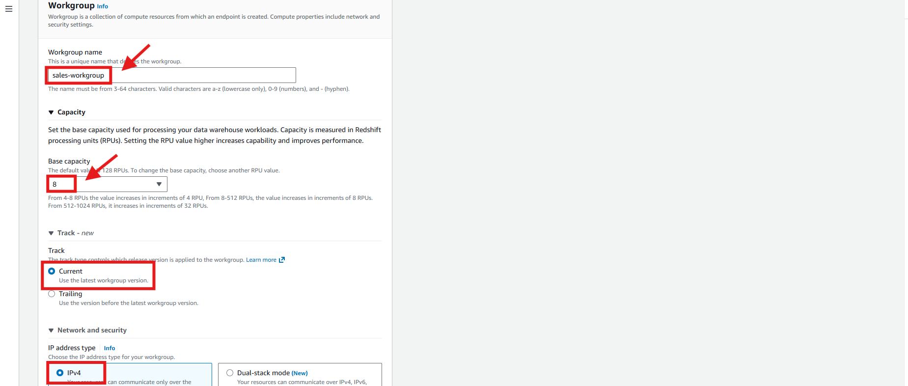

6. Fill in the **Network and security** section:
   - **VPC:** Select `redshift-vpc`
   - **VPC security groups:** Select `redshift-sg`
   - **Subnet:** Select both `redshift-subnet-1` and `redshift-subnet-2`

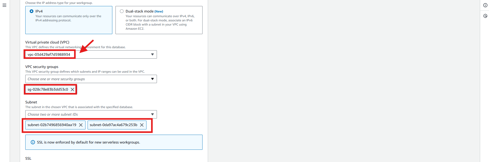

   - **SSL:** Leave as `Enable`
   - **Enhanced VPC routing:** Leave **unchecked**
   - **Autonomics configuration:** Leave as `Don't use extra compute`

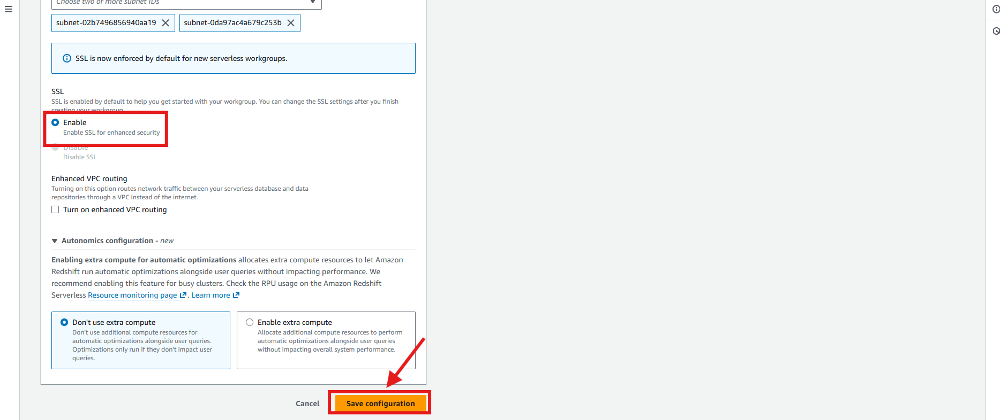

7. Scroll to the bottom of the page and click **"Save configuration"**.

> **Note on the red AccessDeniedException banner:** You may see an error at the top of the page saying `sqlworkbench:GetUserInfo is not authorized`. This is a known lab permission limitation and does **not** affect the Redshift Serverless setup. You can safely ignore it and continue.

---

### Step 3.3: Wait for Provisioning to Complete

After clicking Save configuration, a **"Create serverless"** progress dialog will appear.

1. The dialog shows a progress bar starting at **0%** — this is normal.
2. The progress bar will advance automatically. Wait until you see **"✅ Completed"** appear below the progress bar.

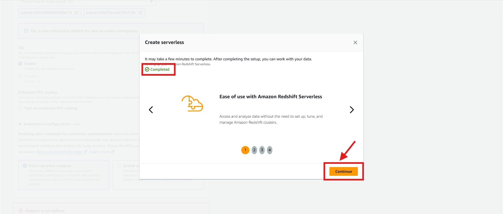

3. Once completed, the **"Continue"** button turns orange — click it to proceed to the **Serverless dashboard**.

---

### Step 3.4: Verify the Serverless Dashboard

After clicking Continue, you will land on the **Serverless dashboard**. Verify the following:

1. Under **Namespaces / Workgroups**, you should see:
   - **Namespace:** `sales-namespace` → ✅ **Available**
   - **Workgroup:** `sales-workgroup` → ✅ **Available**

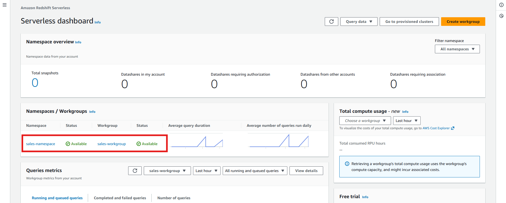

> **Note:** If the dashboard shows "No namespaces or workgroups have been created", click the **refresh** button (🔄) at the top right and wait 1–2 minutes.

---

# Activity 4: Connect via Query Editor V2 and Create the Schema

**Purpose of this Activity:** To connect to your newly provisioned Redshift Serverless workgroup using Query Editor V2 and create all five tables that form the complete schema for this lab — four tables for analytical queries and one PII table used in the data masking activity.

### Step 4.1: Open Query Editor V2

1. In the Redshift console, click on **"Query editor v2"** in the left navigation pane.

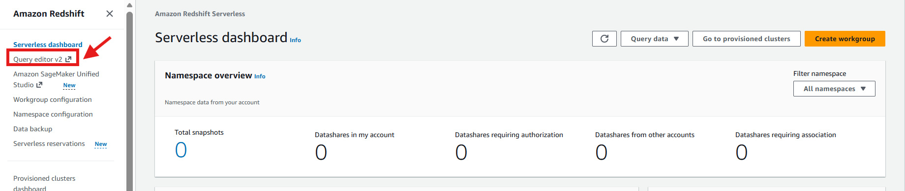

---

### Step 4.2: Connect to the Workgroup

1. In the left panel, click on **"Serverless: sales-workgroup"**.

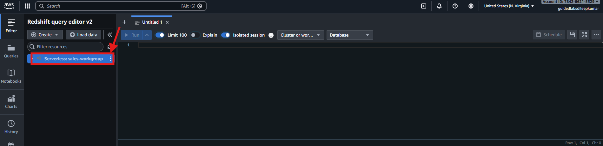

2. A connection dialog appears. Configure it as follows:
   - **Authentication:** Select **"Federated user"**.
   - **Database:** `dev` (pre-filled).

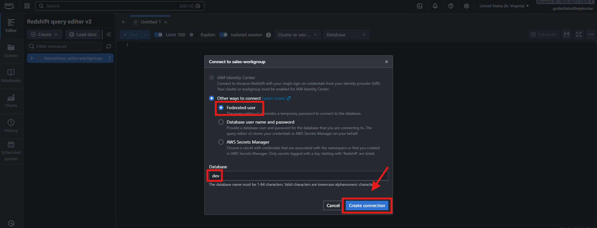

3. Click **"Create connection"**. The left panel expands to show databases under the workgroup and the **Run** button becomes active.

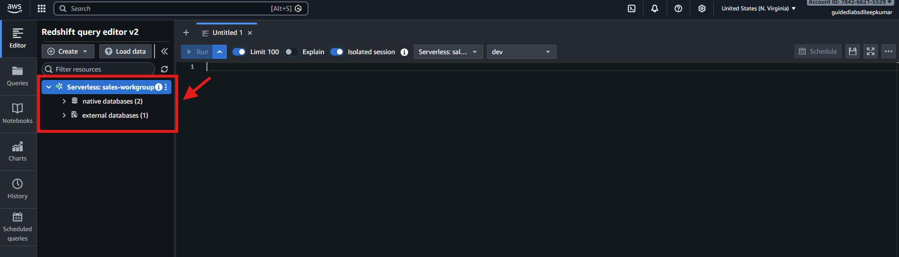

---

### Step 4.3: Create All Tables

Open a new query tab, paste the entire block below, and click **Run**. This creates all five tables from scratch.

```sql
-- Fact table
CREATE TABLE fact_sales (
    sale_id       VARCHAR(10)   NOT NULL,
    customer_id   VARCHAR(10)   NOT NULL,
    product_id    VARCHAR(10)   NOT NULL,
    date_id       VARCHAR(10)   NOT NULL,
    quantity_sold INT           NOT NULL,
    unit_price    DECIMAL(10,2) NOT NULL,
    total_amount  DECIMAL(10,2) NOT NULL,
    store_region  VARCHAR(20)
)
DISTSTYLE KEY
DISTKEY (customer_id)
SORTKEY (date_id);

-- Dimension: Customer
CREATE TABLE dim_customer (
    customer_id      VARCHAR(10)  NOT NULL,
    customer_name    VARCHAR(100) NOT NULL,
    city             VARCHAR(50),
    state            VARCHAR(20),
    customer_segment VARCHAR(30)
)
DISTSTYLE ALL;

-- Dimension: Product
CREATE TABLE dim_product (
    product_id   VARCHAR(10)  NOT NULL,
    product_name VARCHAR(100) NOT NULL,
    category     VARCHAR(50),
    sub_category VARCHAR(50),
    brand        VARCHAR(50)
)
DISTSTYLE ALL;

-- Dimension: Date
CREATE TABLE dim_date (
    date_id     VARCHAR(10) NOT NULL,
    full_date   DATE,
    day_of_week VARCHAR(15),
    month       VARCHAR(15),
    quarter     VARCHAR(5),
    year        INT,
    is_weekend  BOOLEAN
)
DISTSTYLE ALL;

-- PII table
CREATE TABLE customer_pii (
    customer_id   VARCHAR(10)  NOT NULL,
    customer_name VARCHAR(100) NOT NULL,
    email         VARCHAR(150),
    phone_number  VARCHAR(20),
    date_of_birth DATE
)
DISTSTYLE ALL;
```

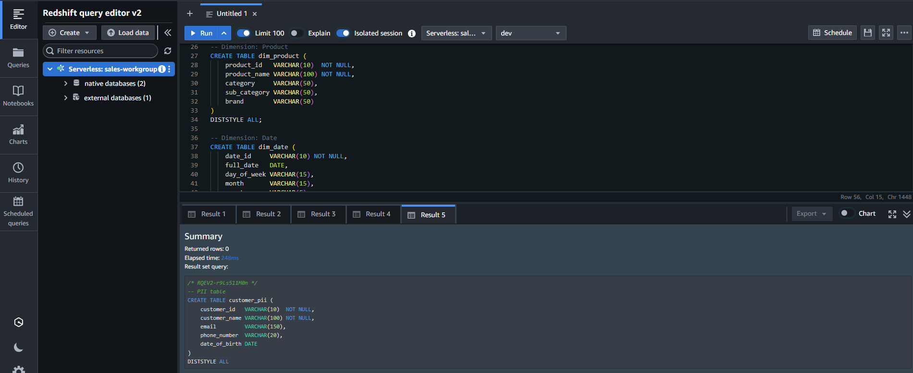

---

### Step 4.4: Verify Tables Were Created

Run the following query to confirm all five tables exist:

```sql
SELECT table_name
FROM information_schema.tables
WHERE table_schema = 'public'
ORDER BY table_name;
```

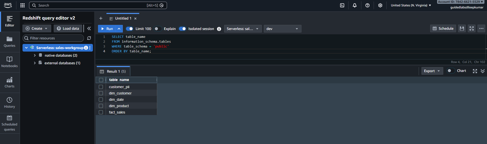

Expected output:

| table_name   |
| ------------ |
| customer_pii |
| dim_customer |
| dim_date     |
| dim_product  |
| fact_sales   |

---

# Activity 5: Load Sample Data into All Tables

**Purpose of this Activity:** To populate all five tables with sample data that will be used across every subsequent activity in this lab — materialized views, data masking, and data sharing all depend on this data being present.

### Step 5.1: Insert Data into Dimension Tables

Open a new query tab and run the following INSERT statements:

```sql
-- dim_customer
INSERT INTO dim_customer VALUES
('C001', 'Alice Johnson',  'New York',     'NY', 'Retail'),
('C002', 'Bob Smith',      'Los Angeles',  'CA', 'Wholesale'),
('C003', 'Carol White',    'Chicago',      'IL', 'Retail'),
('C004', 'David Brown',    'Houston',      'TX', 'Corporate'),
('C005', 'Eva Martinez',   'Phoenix',      'AZ', 'Retail');

-- dim_product
INSERT INTO dim_product VALUES
('P001', 'Wireless Mouse', 'Electronics', 'Accessories', 'Logitech'),
('P002', 'Office Chair',   'Furniture',   'Seating',      'Herman Miller'),
('P003', 'Notebook A4',    'Stationery',  'Paper',        'Staples'),
('P004', 'USB-C Hub',      'Electronics', 'Accessories',  'Anker'),
('P005', 'Standing Desk',  'Furniture',   'Desks',        'FlexiSpot');

-- dim_date
INSERT INTO dim_date VALUES
('D001', '2024-01-15', 'Monday',    'January',  'Q1', 2024, false),
('D002', '2024-02-20', 'Tuesday',   'February', 'Q1', 2024, false),
('D003', '2024-03-30', 'Saturday',  'March',    'Q1', 2024, true),
('D004', '2024-07-10', 'Wednesday', 'July',     'Q3', 2024, false),
('D005', '2024-11-05', 'Tuesday',   'November', 'Q4', 2024, false);
```

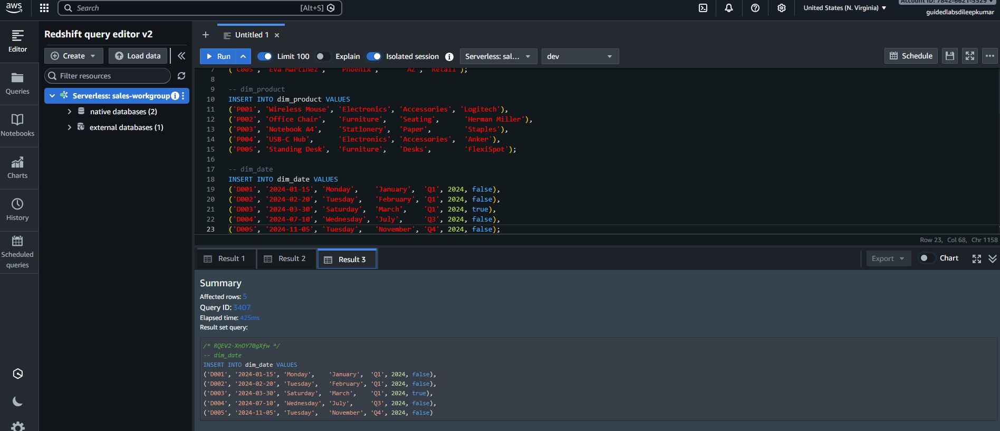

---

### Step 5.2: Insert Data into the Fact Table

```sql
INSERT INTO fact_sales VALUES
('S0001', 'C001', 'P001', 'D001',  2,  29.99,   59.98, 'us-east'),
('S0002', 'C002', 'P002', 'D002',  1, 499.00,  499.00, 'us-west'),
('S0003', 'C003', 'P003', 'D003', 10,   3.50,   35.00, 'us-central'),
('S0004', 'C004', 'P004', 'D004',  3,  45.00,  135.00, 'us-south'),
('S0005', 'C005', 'P005', 'D005',  1, 799.00,  799.00, 'us-west'),
('S0006', 'C001', 'P003', 'D001',  5,   3.50,   17.50, 'us-east'),
('S0007', 'C002', 'P001', 'D004',  2,  29.99,   59.98, 'us-west'),
('S0008', 'C003', 'P004', 'D002',  1,  45.00,   45.00, 'us-central'),
('S0009', 'C004', 'P002', 'D005',  1, 499.00,  499.00, 'us-south'),
('S0010', 'C005', 'P001', 'D003',  4,  29.99,  119.96, 'us-west'),
('S0011', 'C003', 'P005', 'D004',  2, 799.00, 1598.00, 'us-central');
```

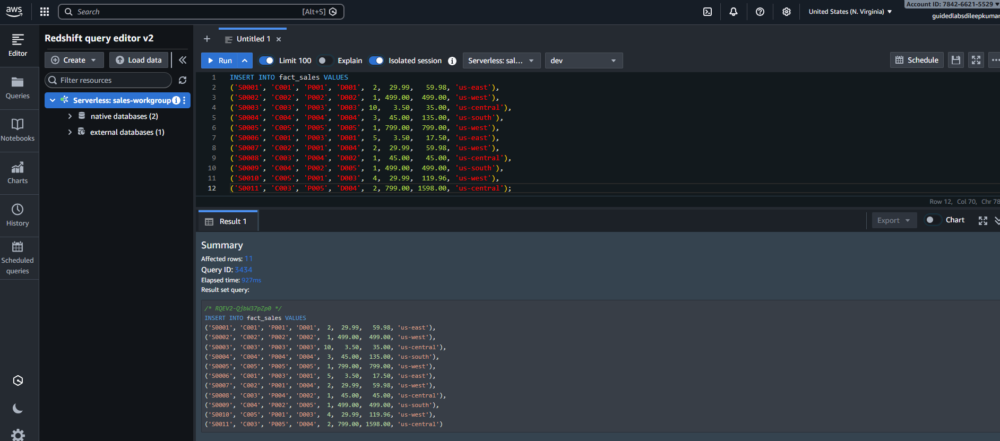

---

### Step 5.3: Insert Data into the PII Table

```sql
INSERT INTO customer_pii VALUES
('C001', 'Alice Johnson', 'alice.johnson@email.com', '555-0101', '1985-03-12'),
('C002', 'Bob Smith',     'bob.smith@email.com',     '555-0102', '1990-07-24'),
('C003', 'Carol White',   'carol.white@email.com',   '555-0103', '1978-11-05'),
('C004', 'David Brown',   'david.brown@email.com',   '555-0104', '1995-01-30'),
('C005', 'Eva Martinez',  'eva.martinez@email.com',  '555-0105', '1988-09-17');
```

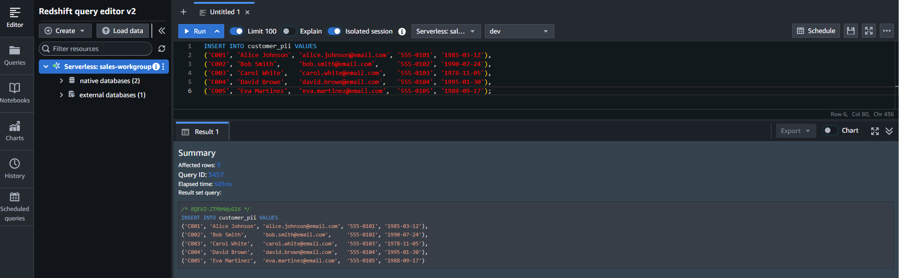

---

### Step 5.4: Verify Row Counts

Confirm all tables are populated correctly:

```sql
SELECT 'fact_sales'   AS table_name, COUNT(*) AS row_count FROM fact_sales
UNION ALL
SELECT 'dim_customer',                COUNT(*)              FROM dim_customer
UNION ALL
SELECT 'dim_product',                 COUNT(*)              FROM dim_product
UNION ALL
SELECT 'dim_date',                    COUNT(*)              FROM dim_date
UNION ALL
SELECT 'customer_pii',                COUNT(*)              FROM customer_pii
ORDER BY table_name;
```

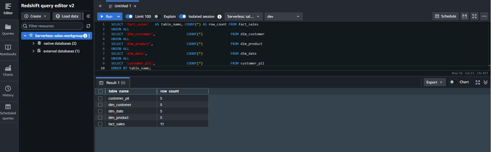

Expected output:

| table_name   | row_count |
| ------------ | --------- |
| customer_pii | 5         |
| dim_customer | 5         |
| dim_date     | 5         |
| dim_product  | 5         |
| fact_sales   | 11        |

---

# Activity 6: Create a Materialized View with Auto-Refresh

**Purpose of this Activity:** To pre-compute an expensive aggregation query as a materialized view, enabling subsequent queries to read from the pre-built result set instead of scanning the base tables every time. Auto-refresh ensures the materialized view stays current as new data arrives, without requiring manual REFRESH calls in your ELT pipelines.

### Step 6.1: Create the Materialized View

The following materialized view pre-aggregates sales revenue and units sold by product category and store region — a query pattern that would otherwise require a full join across `fact_sales` and `dim_product` on every execution.

Open a new query tab and run:

```sql
CREATE MATERIALIZED VIEW mv_category_region_sales
AUTO REFRESH YES
AS
SELECT
    p.category,
    p.sub_category,
    f.store_region,
    SUM(f.quantity_sold)          AS total_units_sold,
    ROUND(SUM(f.total_amount), 2) AS total_revenue,
    COUNT(DISTINCT f.sale_id)     AS total_orders
FROM fact_sales f
JOIN dim_product p ON f.product_id = p.product_id
GROUP BY p.category, p.sub_category, f.store_region;
```

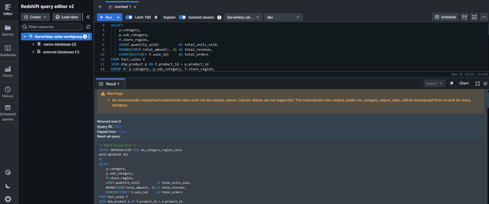

> **Why AUTO REFRESH YES?** With auto-refresh enabled, Redshift automatically detects when base table data changes (via INSERT or COPY) and schedules a background refresh. This eliminates the need for manual `REFRESH MATERIALIZED VIEW` calls in your ELT pipelines.

---

### Step 6.2: Verify the Materialized View Was Created

```sql
SELECT
    name,
    schema_name,
    state,
    autorefresh
FROM svv_mv_info
WHERE name = 'mv_category_region_sales';
```

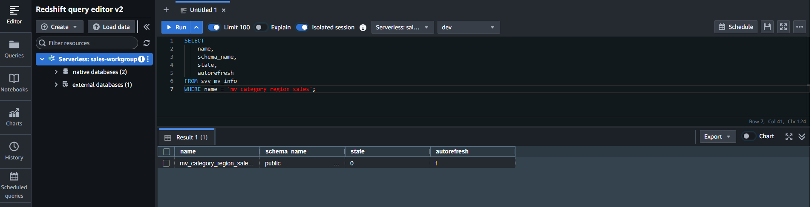

Expected output:

| name                     | schema_name | state | autorefresh |
| ------------------------ | ----------- | ----- | ----------- |
| mv_category_region_sales | public      | 0     | t           |

A `state` of `0` confirms the view is active and ready to use in Redshift Serverless. An `autorefresh` value of `t` confirms auto-refresh is enabled.

---

### Step 6.3: Query the Materialized View

```sql
SELECT
    category,
    store_region,
    SUM(total_units_sold) AS units,
    SUM(total_revenue)    AS revenue
FROM mv_category_region_sales
GROUP BY category, store_region
ORDER BY revenue DESC;
```

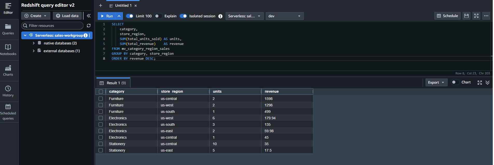

Expected output:

| category   | store_region | units | revenue |
|------------|--------------|-------|----------|
| Furniture  | us-central   | 2     | 1598     |
| Furniture  | us-west      | 2     | 1298     |
| Furniture  | us-south     | 1     | 499      |
| Electronics| us-west      | 6     | 179.94   |
| Electronics| us-south     | 3     | 135      |
| Electronics| us-east      | 2     | 59.98    |
| Electronics| us-central   | 1     | 45       |
| Stationery | us-central   | 10    | 35       |
| Stationery | us-east      | 5     | 17.5     |

---

### Step 6.4: Confirm the Query Used the Materialized View

Run EXPLAIN on the same aggregation to verify Redshift reads from the pre-built view rather than re-scanning the base tables:

```sql
EXPLAIN
SELECT
    category,
    store_region,
    SUM(total_units_sold) AS units,
    SUM(total_revenue)    AS revenue
FROM mv_category_region_sales
GROUP BY category, store_region
ORDER BY revenue DESC;
```

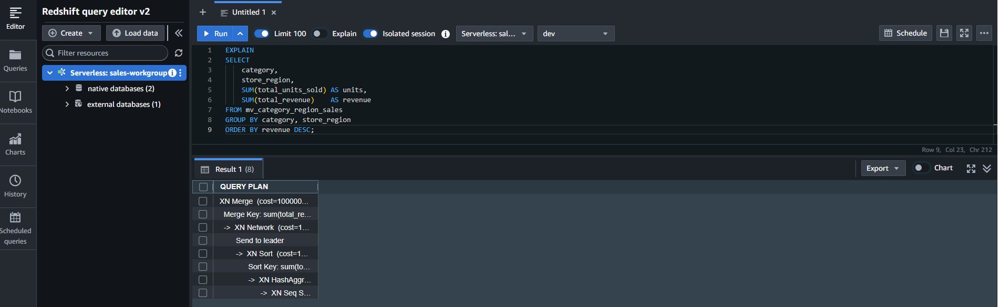

> **What to look for:** The EXPLAIN plan should reference `mv_category_region_sales` directly as the scanned relation — **not** `fact_sales` or `dim_product`. The absence of a Hash Join operator confirms the pre-aggregated view is being used, eliminating the join cost entirely.

---

### Step 6.5: Trigger Auto-Refresh by Inserting New Data

Insert a new row into `fact_sales` to simulate new data arriving:

```sql
INSERT INTO fact_sales VALUES
('S0012', 'C001', 'P002', 'D005', 1, 499.00, 499.00, 'us-east');
```

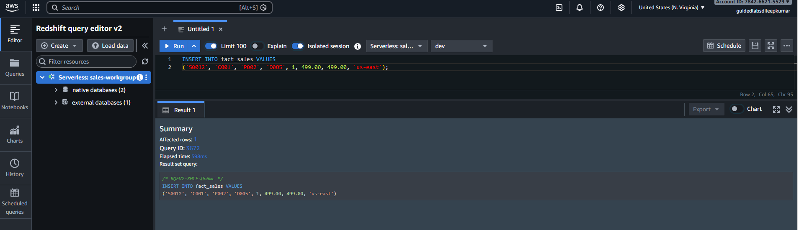

> **Note for Redshift Serverless lab environments:** `svl_mv_refresh_status` is not accessible due to restricted lab IAM permissions. Auto-refresh is already confirmed via `autorefresh = t` in Step 6.2. The INSERT above is sufficient to simulate new data arriving and trigger a background refresh.

---

# Activity 7: Implement Dynamic Data Masking on a PII Column

**Purpose of this Activity:** To protect the `email` column in `customer_pii` from being visible to users who do not hold the appropriate privilege. Dynamic data masking applies a transformation at query time — the underlying stored data is never altered, only the value returned to the client is controlled per role.

### Step 7.1: Create the Masking Policy

In Query Editor V2, open a new query tab and run:

```sql
CREATE MASKING POLICY mask_email
WITH (email VARCHAR(150))
USING ('***MASKED***'::VARCHAR);
```

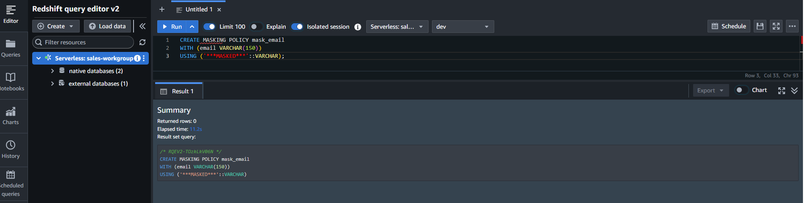

> **How dynamic data masking works:** The policy defines a transformation expression applied at query execution time for the target column. Users whose session role matches the policy attachment see the masked value. The raw data in storage is unchanged.

---

### Step 7.2: Create a Restricted Role

```sql
CREATE USER analyst_user PASSWORD 'Analyst$2024!';
CREATE ROLE restricted_analyst;
GRANT ROLE restricted_analyst TO analyst_user;
```

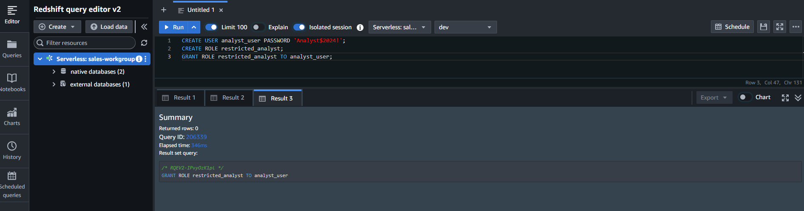

---

### Step 7.3: Attach the Masking Policy to the Column

```sql
ATTACH MASKING POLICY mask_email
ON customer_pii (email)
TO ROLE restricted_analyst
PRIORITY 10;
```

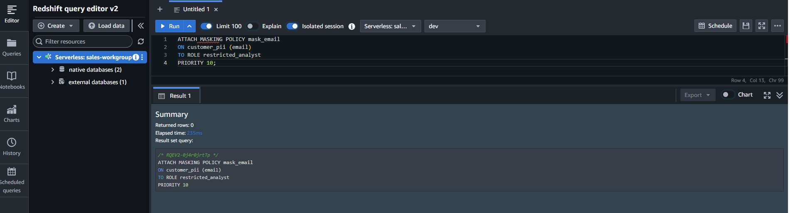

> **Priority:** When multiple masking policies apply to the same column for different roles, the policy with the highest priority number wins. `PRIORITY 10` here takes precedence over any default (priority 0) policy on the same column.

---

### Step 7.4: Grant Table Access to the Restricted User

```sql
GRANT SELECT ON customer_pii TO analyst_user;
```

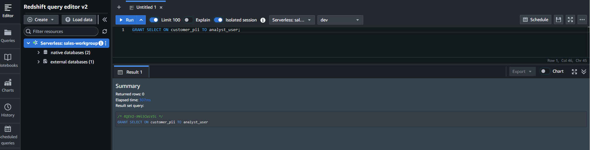

---

### Step 7.5: Verify Masking Behaviour

**As the admin user** — query the table. You should see real email values since no masking policy applies to your session:

```sql
SELECT customer_id, customer_name, email
FROM customer_pii
ORDER BY customer_id;
```

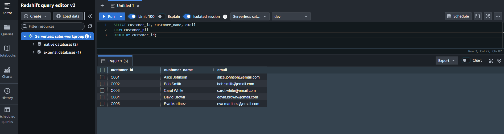

Expected output — real email values visible:

| customer_id | customer_name | email                   |
| ----------- | ------------- | ----------------------- |
| C001        | Alice Johnson | alice.johnson@email.com |
| C002        | Bob Smith     | bob.smith@email.com     |
| C003        | Carol White   | carol.white@email.com   |
| C004        | David Brown   | david.brown@email.com   |
| C005        | Eva Martinez  | eva.martinez@email.com  |

**Simulate the restricted analyst view** by setting the role in the current session:

```sql
SET SESSION AUTHORIZATION analyst_user;

SELECT customer_id, customer_name, email
FROM customer_pii
ORDER BY customer_id;
```

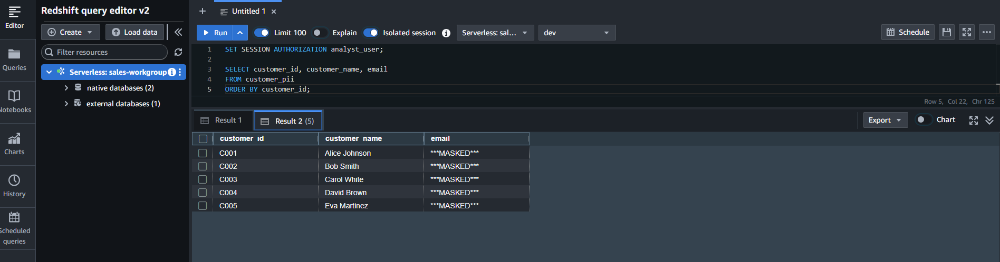

Expected output — email column masked for the restricted user:

| customer_id | customer_name | email        |
| ----------- | ------------- | ------------ |
| C001        | Alice Johnson | ***MASKED*** |
| C002        | Bob Smith     | ***MASKED*** |
| C003        | Carol White   | ***MASKED*** |
| C004        | David Brown   | ***MASKED*** |
| C005        | Eva Martinez  | ***MASKED*** |

Reset the session back to the admin user:

```sql
RESET SESSION AUTHORIZATION;
```
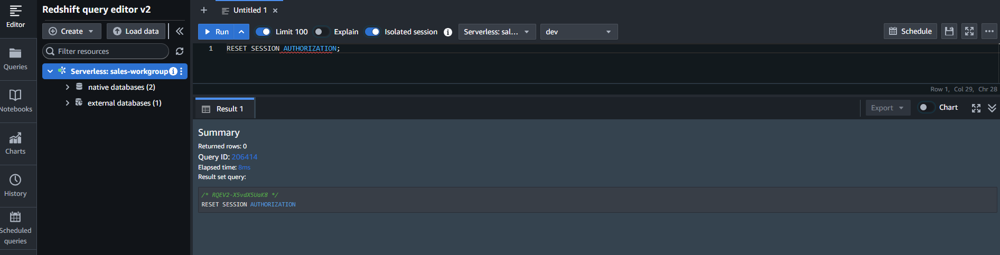


---

### Step 7.6: Inspect the Masking Policy Attachment

> **Note:** The `svv_masking_policy` view in Redshift Serverless uses different column names than provisioned clusters. Use the query below instead.

```sql
SELECT
    policy_name,
    input_columns,
    policy_expression,
    policy_modified_by,
    policy_modified_time
FROM svv_masking_policy
WHERE policy_name = 'mask_email';
```

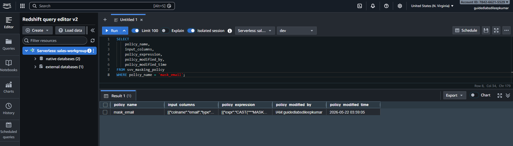

Expected output:

| policy_name | input_columns                        | policy_expression         | policy_modified_by | policy_modified_time |
| ----------- | ------------------------------------ | ------------------------- | ------------------ | -------------------- |
| mask_email  | [{"colname":"email","type":...}]     | [{"expr":"CAST(***MASK... | IAM:your-username  | 2026-05-22 ...       |

---

# Activity 8: Configure Redshift Data Sharing

**Purpose of this Activity:** To share data from a producer namespace to a consumer namespace without copying or moving data. Data Sharing allows teams operating in separate Redshift namespaces to query live data directly from the producer's tables — with the producer maintaining full governance over what is shared and what is kept private.

### Step 8.1: Create the Consumer Namespace

You will create a second Redshift Serverless namespace (`analytics-namespace`) to act as the data consumer.

1. In the Redshift console, navigate to **Serverless dashboard** and click **Create workgroup**.

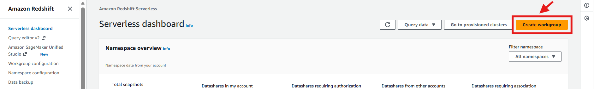

2. On **Step 1 — Create workgroup**, fill in:
   - **Workgroup name:** `analytics-workgroup`
   - **Performance and cost controls:** Select **Base capacity**
   - **Base capacity:** `8` RPU
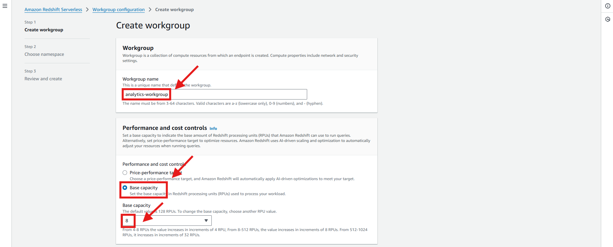
   - **Track:** Leave as `Current`
   - **IP address type:** Leave as `IPv4`
   - **VPC:** Select `redshift-vpc`
   - **VPC security groups:** Select `redshift-sg`
   - **Subnets:** Select `redshift-subnet-1` and `redshift-subnet-2`
   - **SSL:** Leave as `Enable`
   - **Enhanced VPC routing:** Leave **unchecked**
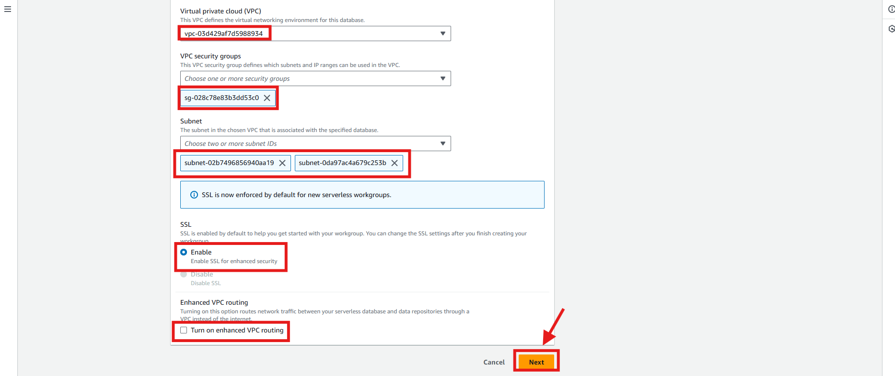

3. Click **Next** to go to **Step 2 — Choose namespace**.

4. On **Step 2 — Choose namespace**, fill in:
   - **Namespace option:** Select **"Create a new namespace"**
   - **Namespace name:** `analytics-namespace`
   - **Database name:** `dev` (pre-filled, leave as is)
   - **Customize admin user credentials:** Leave **unchecked**
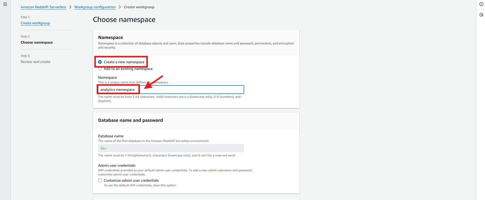
   - **Associated IAM roles:** Leave empty — no IAM role needed for the consumer
   - **Customize encryption settings:** Leave **unchecked**
   - **Audit logging:** Leave all checkboxes **unchecked**

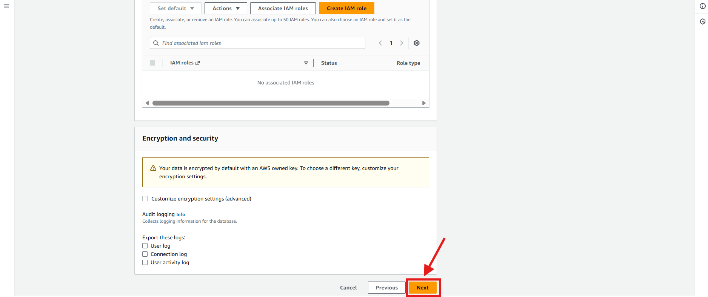

5. Click **Next** → **Create** and wait until both show ✅ **Available**.

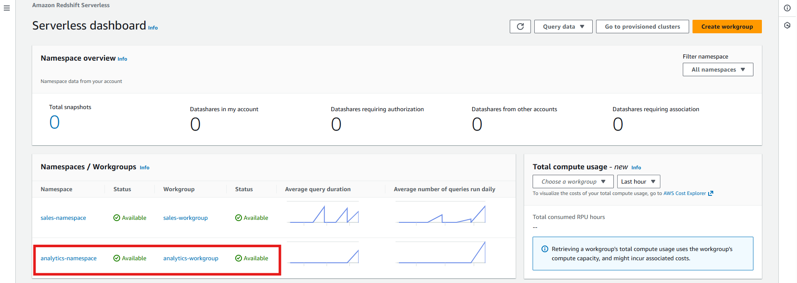

---

### Step 8.2: Get the Namespace Identifiers from the AWS Console

> **Note for Redshift Serverless:** The `svv_redshift_namespaces` view is not available in Redshift Serverless. Instead, get the namespace IDs directly from the AWS Console.

1. In the Serverless dashboard, click on **`sales-namespace`**.
2. Under **General information**, copy the **Namespace ID** — this is your **producer namespace ID**.


3. Go back and click on **`analytics-namespace`**.
4. Under **General information**, copy the **Namespace ID** — this is your **consumer namespace ID**.

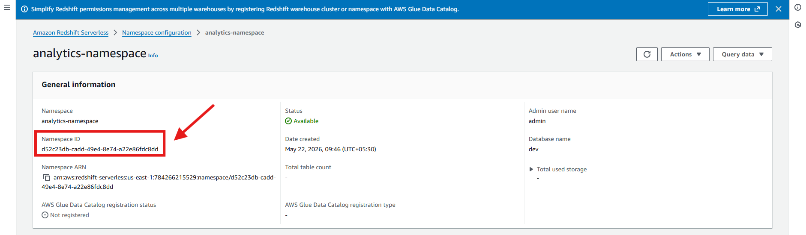

Save both IDs — you will use them in the next steps:
- `sales-namespace` → **producer namespace ID**
- `analytics-namespace` → **consumer namespace ID**

---

### Step 8.3: Create the Datashare on the Producer

In Query Editor V2, make sure you are connected to **`sales-workgroup`** (check the workgroup dropdown in the toolbar shows `Serverless: sales-workgroup`). Run:

```sql
-- Create the datashare
CREATE DATASHARE sales_share;

-- Add the public schema
ALTER DATASHARE sales_share ADD SCHEMA public;

-- Add tables to share
-- Note: customer_pii is intentionally excluded to protect sensitive data
ALTER DATASHARE sales_share ADD TABLE public.fact_sales;
ALTER DATASHARE sales_share ADD TABLE public.dim_customer;
ALTER DATASHARE sales_share ADD TABLE public.dim_product;
ALTER DATASHARE sales_share ADD TABLE public.dim_date;
```

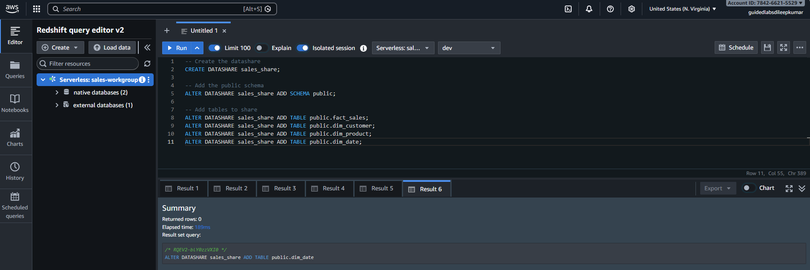

> **Security principle:** Only explicitly added tables are exposed through the datashare. The `customer_pii` table is intentionally excluded — sensitive tables should never be shared without a masking policy applied on the consumer side.

---

### Step 8.4: Grant the Consumer Namespace Access

Still connected to **`sales-workgroup`**, run using the consumer namespace ID from Step 8.2:

```sql
GRANT USAGE ON DATASHARE sales_share
TO NAMESPACE '<consumer namespace ID>';
```

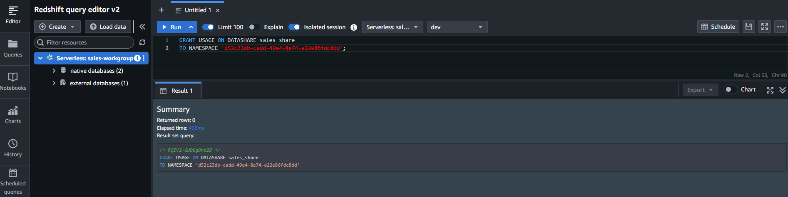

Expected output — **Returned rows: 0** confirms the GRANT executed successfully.

---

### Step 8.5: Add the Analytics Workgroup Connection in Query Editor V2

To run queries on the consumer namespace, you need to add `analytics-workgroup` as a new connection in Query Editor V2.

1. In Query Editor V2, click the **`+`** button at the top (next to the open tabs) and select **"Editor"** — this opens a new **Untitled 2** tab.

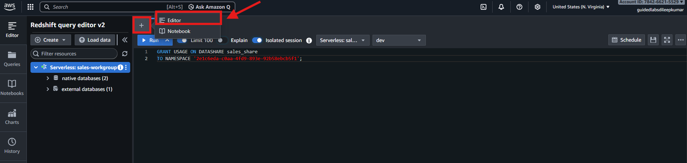

2. In the left panel, click the refresh button (🔄) next to the "Filter resources" search box — this refreshes the connection list and makes analytics-workgroup appear.

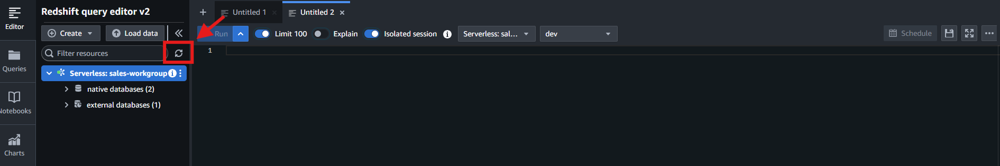
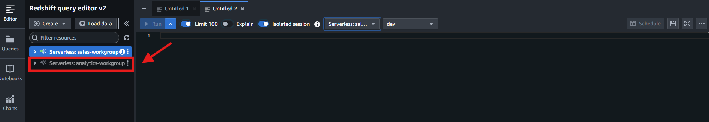

3. Click on **`Serverless: analytics-workgroup`**, A **"Connect to analytics-workgroup"** dialog appears:
   - **Authentication:** Select **"Federated user"**
   - **Database:** `dev`
4. Click **"Create connection"**.

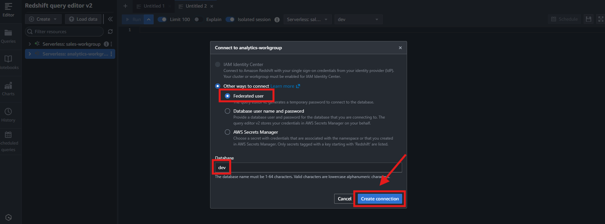

5. From the dropdown, select **`Serverless: analytics-workgroup`**.

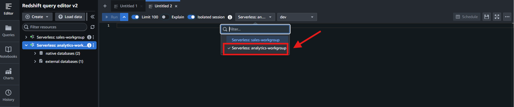

6. Both workgroups now appear in the left panel:
   - **`Serverless: analytics-workg...`** (active in Untitled 2 tab)
   - **`Serverless: sales-workgroup`** (available in Untitled 1 tab)

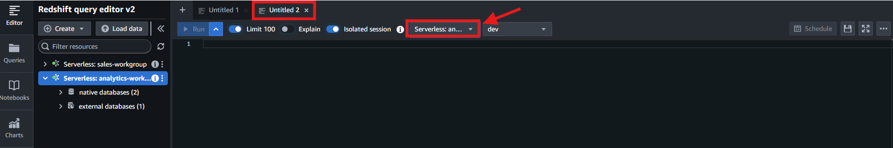

---

### Step 8.6: Create an External Database on the Consumer

In the **Untitled 2** tab (connected to `analytics-workgroup`), run using the producer namespace ID from Step 8.2:

```sql
CREATE DATABASE sales_shared_db
FROM DATASHARE sales_share
OF NAMESPACE '<producer namespace ID>';
```

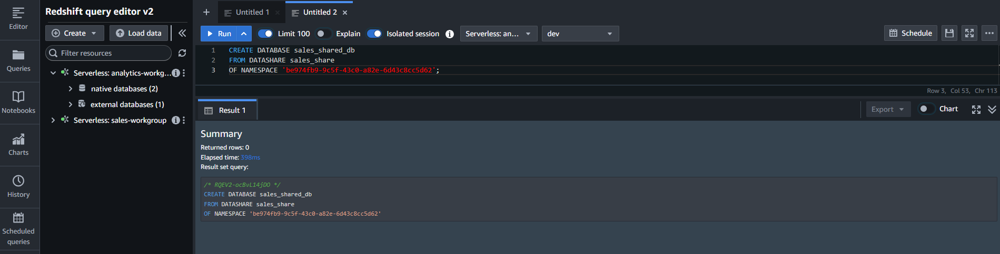

Expected output — **Returned rows: 0** confirms the external database was created successfully.

---

### Step 8.7: Query Shared Data from the Consumer

Still in the **Untitled 2** tab (connected to `analytics-workgroup`), run:

```sql
SELECT
    p.category,
    f.store_region,
    COUNT(DISTINCT f.sale_id)     AS total_orders,
    ROUND(SUM(f.total_amount), 2) AS total_revenue
FROM sales_shared_db.public.fact_sales f
JOIN sales_shared_db.public.dim_product p
  ON f.product_id = p.product_id
GROUP BY p.category, f.store_region
ORDER BY total_revenue DESC;
```

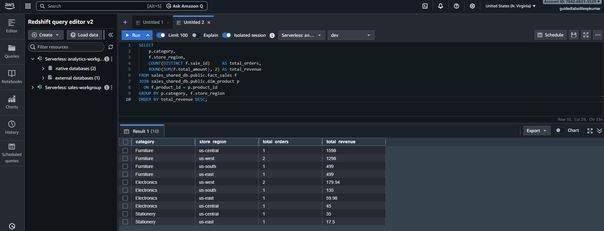

Expected output — live data from the producer namespace, **10 rows returned**:

| category    | store_region | total_orders | total_revenue |
| ----------- | ------------ | ------------ | ------------- |
| Furniture   | us-central   | 1            | 1598          |
| Furniture   | us-west      | 2            | 1298          |
| Furniture   | us-south     | 1            | 499           |
| Furniture   | us-east      | 1            | 499           |
| Electronics | us-west      | 2            | 179.94        |
| Electronics | us-south     | 1            | 135           |
| Electronics | us-east      | 1            | 59.98         |
| Electronics | us-central   | 1            | 45            |
| Stationery  | us-central   | 1            | 35            |
| Stationery  | us-east      | 1            | 17.5          |

> **Key insight:** The consumer namespace queries the producer's live data without any ETL pipeline or data copy. New rows inserted in the producer are immediately visible to the consumer — subject only to the datashare's table-level access grants.

---

### Step 8.8: Inspect the Datashare Objects

Still in the **Untitled 2** tab (connected to `analytics-workgroup`), verify all objects included in the share:

```sql
SELECT share_name, object_type, object_name
FROM svv_datashare_objects
WHERE share_name = 'sales_share';
```

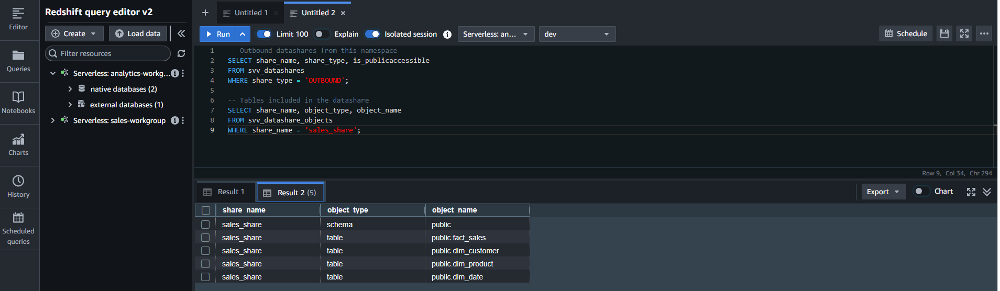

Expected output — **5 rows returned**, confirming the schema and all 4 tables are shared, and `customer_pii` is excluded:

| share_name  | object_type | object_name         |
| ----------- | ----------- | ------------------- |
| sales_share | schema      | public              |
| sales_share | table       | public.fact_sales   |
| sales_share | table       | public.dim_customer |
| sales_share | table       | public.dim_product  |
| sales_share | table       | public.dim_date     |

---

# Activity 9: Monitor Performance Using System Tables and CloudWatch

**Purpose of this Activity:** To inspect query performance and system health using Redshift's built-in SYS monitoring views and CloudWatch metrics. Monitoring is what allows you to proactively catch performance regressions, confirm materialized view behaviour, and understand overall warehouse resource usage.

---

### Step 9.1: Check Recent Query Execution Times

> **Where to run this:** In **Redshift Query Editor V2**, connected to **`sales-workgroup`** (the **Untitled 1** tab). Confirm the workgroup dropdown in the toolbar shows `Serverless: sales-workgroup` before running.

1. In Query Editor V2, click the **Untitled 1** tab (connected to `sales-workgroup`).
2. Confirm the workgroup dropdown in the toolbar shows **`Serverless: sal...`** (sales-workgroup).
3. Paste the following query and click **Run**:

```sql
SELECT
    query_id,
    user_id,
    status,
    ROUND(elapsed_time / 1000000.0, 2) AS elapsed_seconds,
    query_text
FROM sys_query_history
WHERE status IN ('success', 'failed', 'canceled')
ORDER BY elapsed_time DESC
LIMIT 10;
```

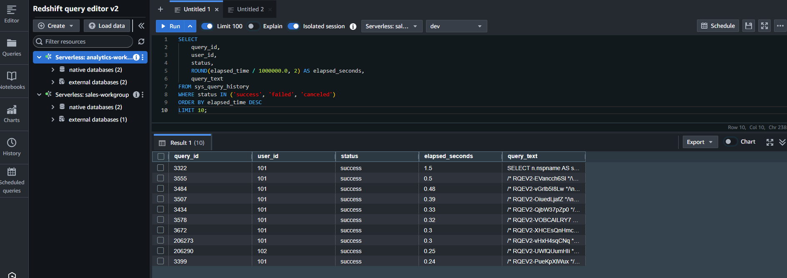

**Expected output — 10 rows returned**, showing the slowest queries from your lab session with their execution times in seconds and status as `success`.

> **SYS vs STL views:** The `SYS_` views (e.g., `sys_query_history`) are the modern replacement for `STL_` views and work across both Redshift Serverless and provisioned clusters. Use `SYS_` views for new monitoring queries; `STL_` views remain available for backward compatibility.

---

### Step 9.2: Monitor with CloudWatch Metrics

1. In the AWS Management Console search bar, type **CloudWatch** and select it.

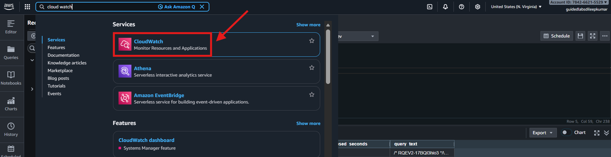

2. In the left navigation pane, click **Metrics → All metrics**.
3. Under **AWS namespaces**, select **Redshift Serverless**.

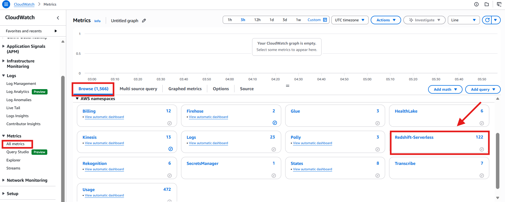

4. You will see metric dimension groups. Note the key metrics available:

| Metric Name                 | What it tells you                                                    |
| --------------------------- | -------------------------------------------------------------------- |
| `QueriesCompletedPerSecond` | Throughput — how many queries complete each second                   |
| `QueryDuration`             | Average, p50, p90, p99 query latency                                 |
| `ComputeSeconds`            | RPU seconds consumed — maps directly to serverless billing           |
| `DataScannedPerQuery`       | Average bytes scanned per query — high values signal missing filters |

5. In the **search box** that says *"Search for any metric, dimension, resource id or account id"*, type `QueryDuration` and press Enter.

6. Three result groups will appear. Click on **"Redshift-Serverless > LatencyRange, Workgroup"** (shows 2 metrics).

7. In the list, **check both checkboxes** next to `QueryDuration` for:
   - `sales-workgroup`
   - `analytics-workgroup`

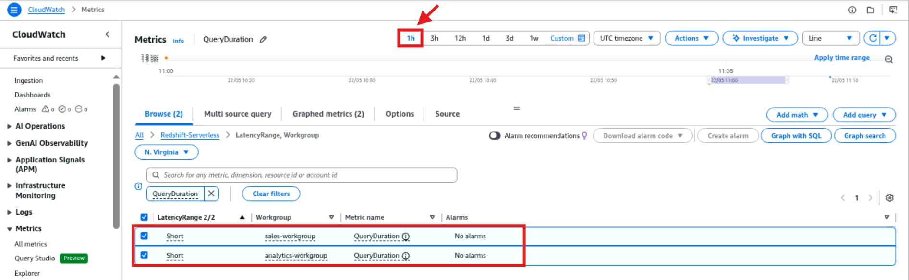


8. The graph at the top will now plot the `QueryDuration` metric for both workgroups.

9. Click **"1h"** (1 hour) at the top of the graph to set the time range to the last 1 hour.

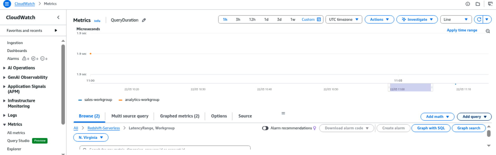

**Expected output** — A line graph showing QueryDuration (query latency) metrics for both sales-workgroup and analytics-workgroup over the selected time range, confirming CloudWatch captured Redshift Serverless monitoring data.

---

## 🎓 Conclusion

This guided project took you through the full lifecycle of operating a production-grade Amazon Redshift data warehouse — from provisioning infrastructure through securing and monitoring it in production conditions.

You applied the following hands-on engineering patterns:

- Provisioning a **Redshift Serverless workgroup** from scratch — including VPC, subnets, security groups, and IAM role configuration — and loading a complete five-table schema with sample data.
- Creating a **Materialized View with AUTO REFRESH** to pre-compute expensive aggregations, and validating via EXPLAIN plans and `svv_mv_info` that Redshift serves queries from the view rather than re-scanning base tables on every execution.
- Implementing **Dynamic Data Masking** on a PII column using role-based masking policies — ensuring sensitive data is never exposed to restricted users at query time, without altering underlying stored data.
- Configuring **Redshift Data Sharing** between a producer and consumer namespace, enabling cross-team analytical access to live data without ETL pipelines, data duplication, or unintended exposure of sensitive tables excluded from the datashare.
- Monitoring system behaviour using **SYS monitoring views** and **CloudWatch metrics** to validate configurations and identify performance bottlenecks proactively.

These capabilities form the operational core of managing a secure, performant, and multi-tenant Redshift environment. As a next step, explore Redshift's **Zero-ETL integrations** with Aurora for real-time data ingestion, and **Concurrency Scaling** to automatically handle query burst loads!