# Title: Databricks Workspace Deployment on AWS

---

## 🌟 Overview: What is the purpose of this Lab?

Welcome to your Databricks-on-AWS platform engineering project! Before any data engineering work can begin on Databricks, the underlying AWS foundations — networking, IAM, storage, and identity — must be set up correctly. This lab will guide you through deploying a **production-grade Databricks workspace on AWS** end-to-end: from a custom VPC and cross-account IAM role, all the way to running a notebook that reads and writes S3 through an instance profile.

**The Purpose of this Lab:**
You are part of a platform engineering team tasked with setting up a unified analytics environment for your organization. Your task is to deploy a **Databricks workspace inside a custom VPC**, configure **IAM roles** to allow secure access to S3, and set up **autoscaling clusters using Spot instances** to optimize cost. You will then integrate the workspace with a **Git repository via Databricks Repos** and run a basic notebook to confirm everything is wired up correctly. This simulates the real-world cloud infrastructure setup required before any data engineering work can begin on Databricks.

By the end of this project, you will have:

- Provisioned a **custom VPC** that meets Databricks' workspace networking requirements (two private subnets across AZs, NAT egress, self-referencing security group).
- Created the **cross-account IAM role** that lets the Databricks control plane manage EC2 in your AWS account.
- Created an **IAM instance profile** so clusters can access S3 with short-lived, role-scoped credentials.
- Deployed a **Databricks workspace** in customer-managed VPC mode via the Databricks account console.
- Built an **all-purpose cluster** (interactive, autoscaling, mixed on-demand + spot) and a **job cluster** (ephemeral, 100% spot with fallback).
- Cloned a **Git repository** into Databricks Repos and ran a notebook **interactively** and **as a scheduled job**.

### Learning Path:

1. **Authentication:** Configure your AWS Console access and credentials.
2. **Databricks Account Setup:** Either log in to your existing Databricks account, or sign up and complete the Express Setup.
3. **Custom VPC Foundations:** Build the VPC, subnets, NAT gateway, route tables, and security group.
4. **IAM & S3 Setup:** Create the workspace root bucket, data bucket, cross-account role, and instance profile.
5. **Workspace Provisioning:** Register credential/storage/network configurations and deploy the workspace.
6. **Clusters, Repos & Smoke Test:** Create the clusters with spot + autoscaling, clone a Git repo, and run the smoke test interactively and as a job.

---

## Difficulty Level

Proficient

---

## 📊 Dataset / Knowledge Source Used

The following files are provided in the `~/Desktop/Project/` folder on your lab desktop. You will upload these to S3 and Git as part of the lab. We are using a small weather/telemetry sample so the lab stays fast and easy to verify.

**Local File Structure:**

```text
~/Desktop/Project/
└──/dbx-smoke/
  ├── smoke_test.py
  └── README.md
├── sample.csv

```

| File            | Destination                                         | Description                                                                             |
| --------------- | --------------------------------------------------- | --------------------------------------------------------------------------------------- |
| `sample.csv`    | `s3://dbx-data-<account-id>/raw/sample.csv`         | 5-row weather sample (`id, city, temperature_c`) — read by the smoke test notebook      |
| `smoke_test.py` | GitHub repo `dbx-smoke` → `notebooks/smoke_test.py` | PySpark notebook that lists, reads, and writes the data bucket via the instance profile |
| `README.md`     | GitHub repo `dbx-smoke` → root                      | Repo description used to confirm Databricks Repos clone is working                      |

> **Note on the GitHub repo:** You will push `smoke_test.py` and `README.md` into a small **public** GitHub repository called `dbx-smoke` (Phase 5). Databricks Repos will clone this repository into the workspace so the job task can point at `/Repos/<your-user>/dbx-smoke/notebooks/smoke_test`.

---

## 🛠️ Prerequisites & AWS Setup

Ensure the following are available:

- An **AWS account** with permissions for VPC, EC2, IAM, S3, and CloudWatch.
- Access to the AWS Console (Lab credentials provided).
- A **Databricks account on AWS** (Premium tier — the 14-day trial is sufficient). If you do not yet have one, you will create it in **Activity 1**.
- The local data files located at `~/Desktop/Project/`:
  - `~/Desktop/Project/sample.csv`
  - `~/Desktop/Project/dbx-smoke/smoke_test.py`
  - `~/Desktop/Project/dbx-smoke/README.md`
- AWS CLI v2, `jq`, and `git` installed locally.
- A **GitHub account** (you'll create a small public repo for Databricks Repos).
- All AWS resources must be created in the **US-EAST-1 (N. Virginia) Region**.

---

## Configure AWS Credentials

First, log in to the AWS Web Console to set up our destination.

- Login to AWS Console:
  - Click on the `Lab Access` icon on the desktop.


- Click on `Access Lab` and using the given credentials login to AWS Console. This will allow you to access the AWS resources from the Console.


- Once logged in, set the region to `us-east-1`. Create all resources in the **US-EAST-1 (N. Virginia) Region**.

- Steps to select the AWS region in the AWS Console:
  - Locate the region selector at the top-right corner of the console (next to your Account Name, which is painted in red).
  - Click on the dropdown, and a list of available AWS Regions will appear.


    - Choose us-east-1 (N.Virginia) Region.


---

## Set Up (or Sign In to) Your Databricks Account

**Purpose of this Activity:** To make sure you have an active Databricks-on-AWS account before any infrastructure work begins. If you already have an account, you'll log in and capture your Databricks account ID. If not, you'll complete the Express Setup that creates a trial workspace and links it to AWS.

### Step 1: Do You Already Have a Databricks Account?

Before you continue, answer this question:

- **YES — I already have a Databricks account on AWS.** ➡️ Skip directly to **Step 6 (Log In and Capture Your Databricks Account ID)**.
- **NO — I need to create a new Databricks account.** ➡️ Continue with **Step 2** below.

### Step 2: Access the Databricks Login Page

Open a new browser tab and navigate to [https://login.databricks.com/](https://login.databricks.com/). Click the **Continue with Google** button (or use the email option you prefer).


### Step 3: Authenticate and Choose a Trial Type

1. Choose the Google/email account you wish to use for your Databricks environment.
2. On the **"What will you use Databricks for?"** screen, select **For work** (this enables the 14-day free trial and AWS integration).
3. Click **Start trial with express setup**.


### Step 4: Configure Account Details and Verify

- Enter your desired account name (e.g., `dbx-lab-account`).
- Select your country/region and click **Continue**.


- Complete the security/captcha challenge and click **Submit**.


- On **"Tell us about yourself"**, pick **Learn data and AI** and choose up to 3 topics of interest, then click **Continue**.


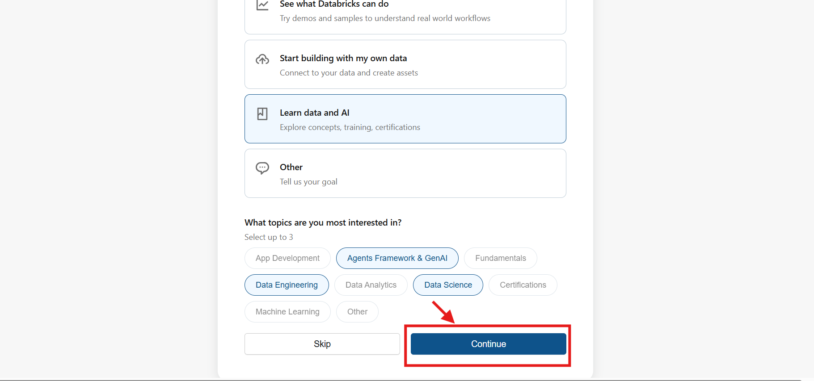

- Wait while Databricks initializes your account ("Setting up your account…" screen).


### Step 5: Log In and Capture Your Databricks Account ID

1. Open the **Databricks account console** at [https://accounts.cloud.databricks.com/](https://accounts.cloud.databricks.com/) and sign in.
2. Click the **user icon** (top-right) → **Account**.
3. **Copy** the **Account ID** (a UUID that looks like `e2-xxxxxxxx-xxxx-xxxx-xxxx-xxxxxxxxxxxx`) into a text note — you'll paste it into the IAM trust policy in Activity 2.


- The **Databricks account console** (`accounts.cloud.databricks.com`) is **not** the same as the workspace UI. The account console is where you provision workspaces; the workspace UI is where you write notebooks.
- The **Account ID** is what binds your cross-account IAM role's external ID to **your** Databricks account — without it, no other Databricks customer can ever assume that role.

---

# Activity 1: Build the Custom VPC for Databricks

**Purpose of this Activity:** To create the AWS network that the Databricks workspace will deploy into. Databricks in customer-managed-VPC mode requires **two private subnets in different AZs**, internet egress (NAT gateway), and a **self-referencing security group** so Spark nodes can talk to each other on every port. We will use the AWS VPC wizard to create the networking foundations efficiently.

### Step 1.1: Create the VPC, Subnets, and NAT Gateway

1. Log in to the AWS Console and verify you are in the **us-east-1 (N. Virginia)** region.
2. In the top search bar, type **VPC** and open the **VPC Dashboard**.

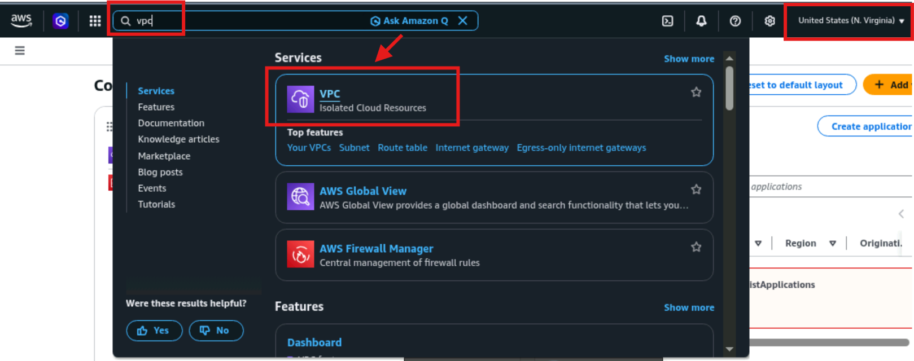

3. Click the orange **Create VPC** button.

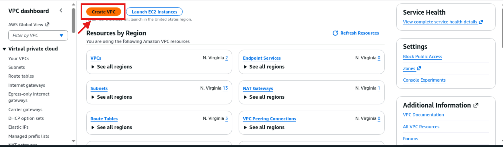

4. Under **Resources to create**, select **VPC and more**. This wizard automatically builds your subnets, route tables, Internet Gateway, and NAT Gateway.
5. Configure the wizard exactly as follows:
   - **Name tag auto-generation:** `dbx`
   - **IPv4 CIDR block:** `10.20.0.0/16`

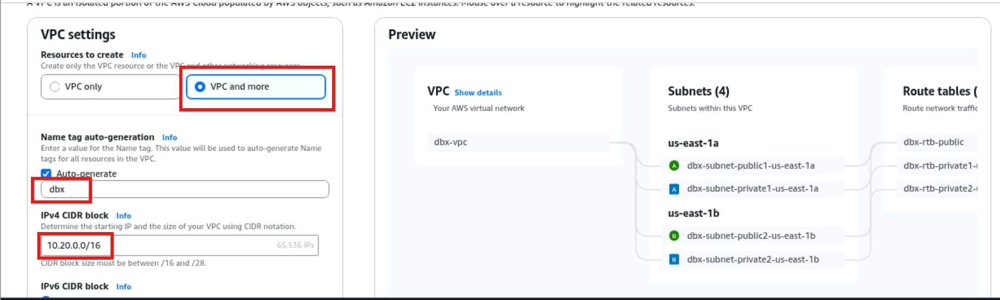

- **Number of Availability Zones (AZs):** `2` (e.g., `us-east-1a` and `us-east-1b`)
- **Number of public subnets:** `2` (This will host the NAT Gateway)
- **Number of private subnets:** `2` (These will host the Databricks clusters)

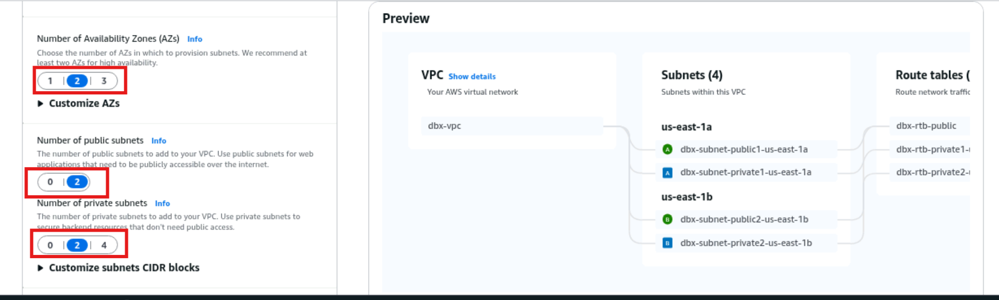

- **NAT gateways ($):** `In 1 AZ`
- **VPC endpoints:** `None`
- **DNS options:** Ensure both **Enable DNS hostnames** and **Enable DNS resolution** are checked.

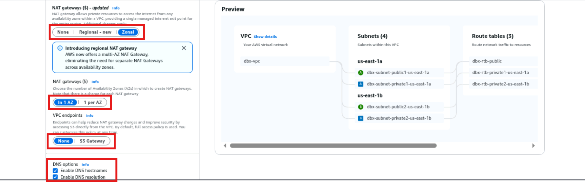

6. Click **Create VPC** at the bottom of the page.

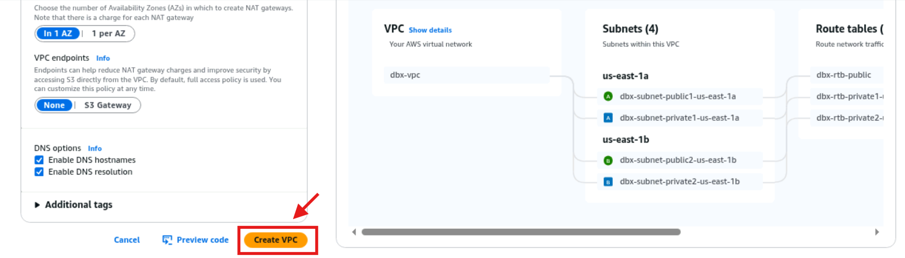

7. Wait a few moments for AWS to provision all the network components. Once complete, click **View VPC**.

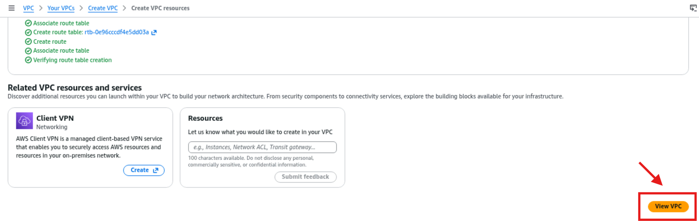
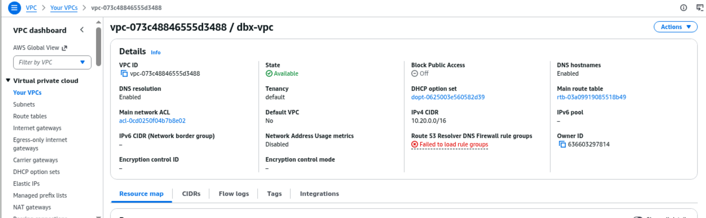

### Step 1.2: Create the Self-Referencing Security Group

Databricks requires a security group where cluster nodes can talk to each other on every TCP/UDP port (Spark shuffles use many ephemeral ports). We express this by allowing all traffic from the security group to itself.

1. On the left-hand navigation pane of the VPC Dashboard, scroll down and click **Security Groups**.
2. Click **Create security group**.

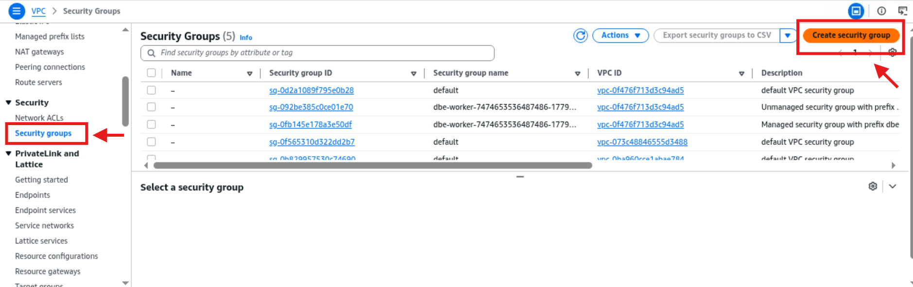

3. **Security group name:** `dbx-sg`
4. **Description:** `Databricks workspace SG`
5. **VPC:** Click the dropdown and select your newly created `dbx-vpc`.

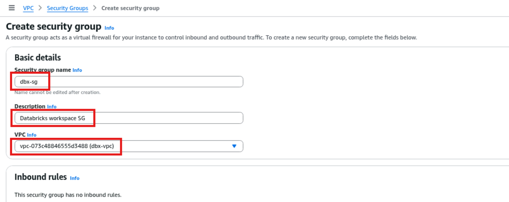

6. Under **Outbound rules**, leave the default rule (`All traffic` to `0.0.0.0/0`).

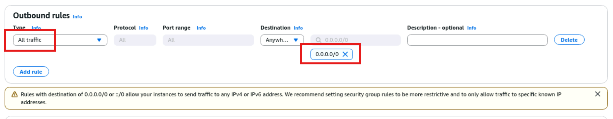

7. **Important:** Do not add inbound rules yet. Scroll to the bottom of the page and click **Create security group**.

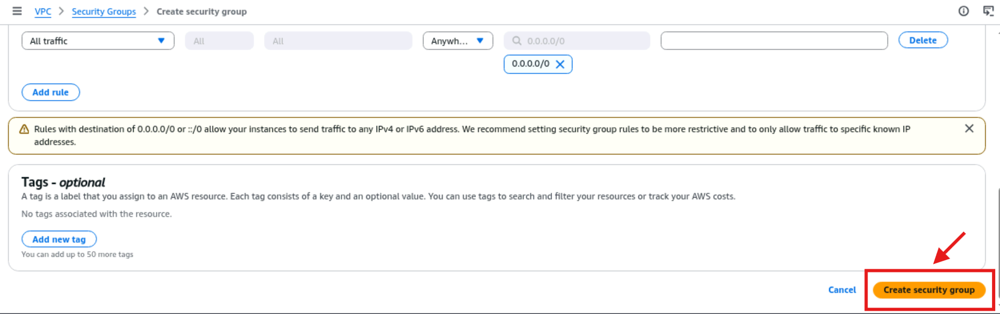

8. Once the security group is successfully created, you will be taken to its details page. Locate the **Inbound rules** tab at the bottom and click **Edit inbound rules**.

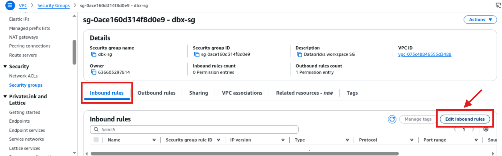

9. Click **Add rule** and configure it as follows:
   - **Type:** `All traffic`
   - **Source:** `Custom`
   - **Source field:** Click inside the search box, start typing `dbx-sg`, and select it from the dropdown (it will automatically populate with its new `sg-0xxxxx...` ID).
10. Click **Save rules**.

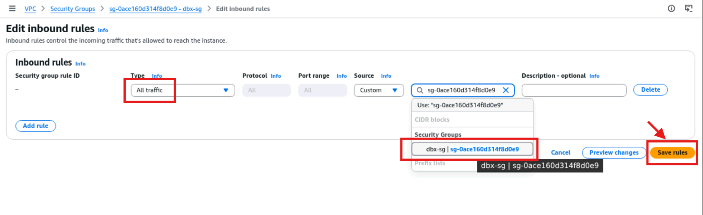

---

# Activity 2: Create S3 Buckets and IAM Roles

**Purpose of this Activity:** Before the Databricks workspace can be deployed, Databricks needs an S3 bucket for workspace internals (logs, library staging) and an IAM role it can assume to manage EC2 in your account. We also create a separate data bucket and a scoped instance profile so clusters can access data securely with short-lived credentials.

### Step 2.1: Create the Workspace Root S3 Bucket

The root bucket stores Databricks workspace internals. The bucket policy grants the **fixed Databricks AWS account (`4143XXXXXXXX`)** the permissions it needs to write workspace metadata.

1. In the top search bar, type **S3** and Open the **S3 Console**.

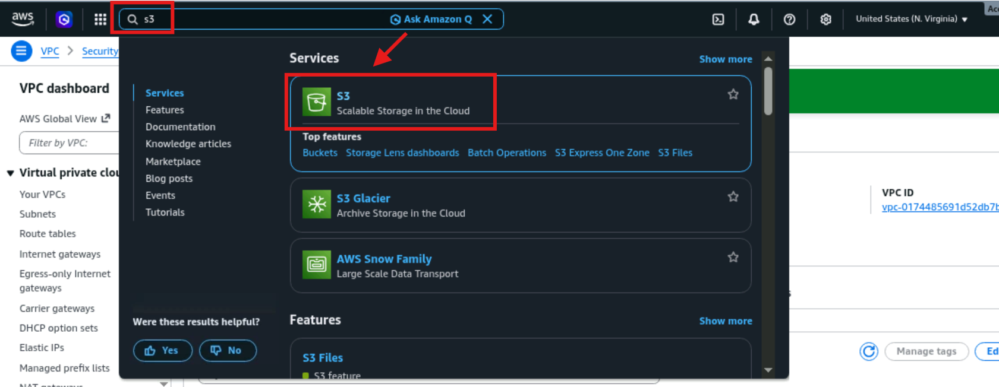

2. Click **Create bucket**.

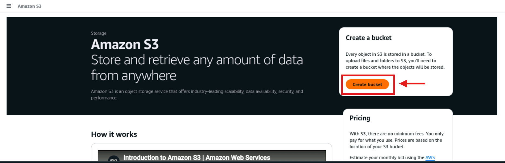

3. **Bucket name:** `dbx-root-<your-initials>-<random-4-digits>` _(e.g., `dbx-root-js-8492`. S3 bucket names must be globally unique, so add random numbers to ensure it is available)_.
4. **AWS Region:** `us-east-1 (N. Virginia)`.

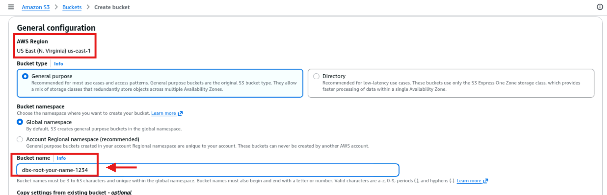

5. Under **Block Public Access settings**, ensure **Block all public access** is **checked**.

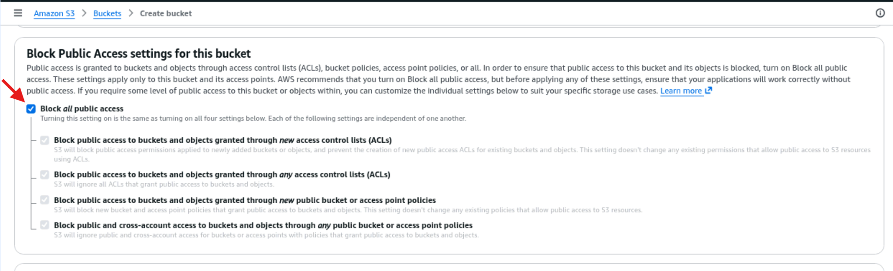

6. Under **Bucket Versioning**, select **Enable**.

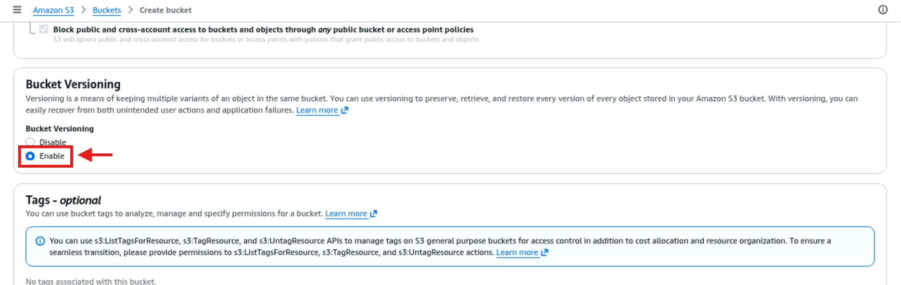

7. Scroll down and Click **Create bucket**.

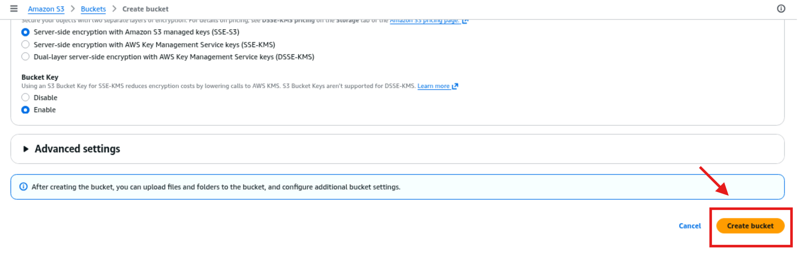

8. Find and click on your newly created `dbx-root-...` bucket.

9. Navigate to the **Permissions** tab and scroll down to **Bucket policy**. Click **Edit**.

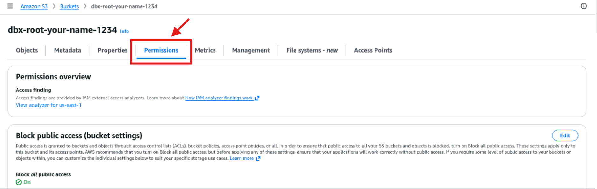
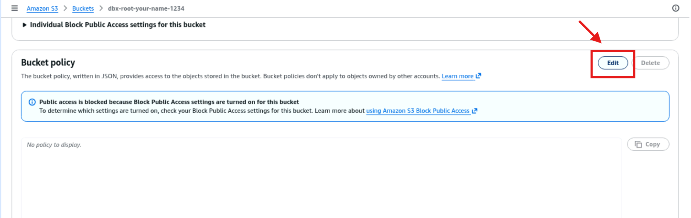

10. Paste the following JSON policy, making sure to replace the `Resource` ARNs with your exact bucket name `dbx-root-<your-initials>-<random-4-digits>`.

- **Code Explanation:** This bucket policy explicitly grants the Databricks Control Plane (AWS Account ID `414351767826`) the necessary `s3:PutObject` and `s3:GetObject` permissions to store internal workspace data (like cluster logs and job artifacts) securely in your account.

```json
{
  "Version": "2012-10-17",
  "Statement": [
    {
      "Sid": "Grant Databricks Access",
      "Effect": "Allow",
      "Principal": { "AWS": "arn:aws:iam::414351767826:root" },
      "Action": [
        "s3:GetObject",
        "s3:GetObjectVersion",
        "s3:PutObject",
        "s3:DeleteObject",
        "s3:ListBucket",
        "s3:GetBucketLocation"
      ],
      "Resource": [
        "arn:aws:s3:::dbx-root-<your-initials>-<random-4-digits>/*",
        "arn:aws:s3:::dbx-root-<your-initials>-<random-4-digits>"
      ]
    }
  ]
}
```

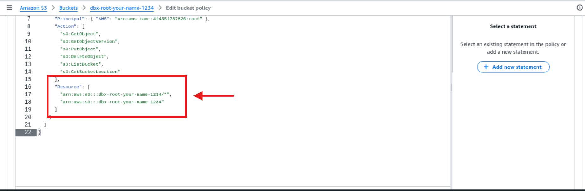

11. Click **Save changes**.

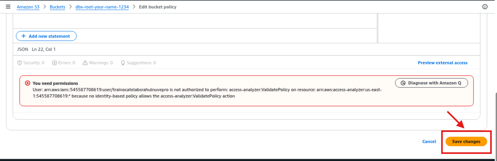

### Step 2.2: Create the Data Bucket and Upload `sample.csv`

1. Go back to the main **S3 Console** page and click **Create bucket**.

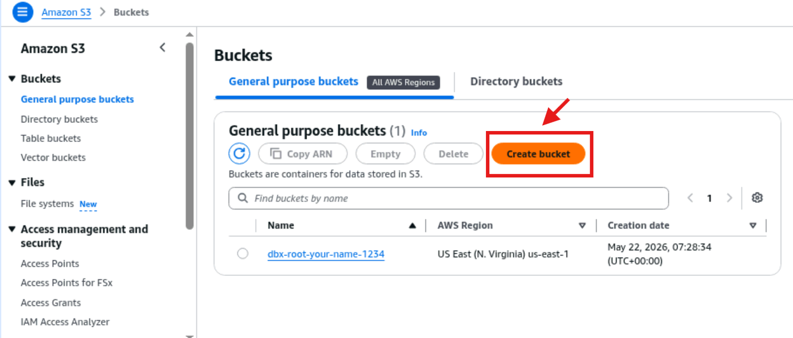

2. **Bucket name:** `dbx-data-<your-initials>-<random-4-digits>` _(Use a similar unique naming pattern as your root bucket)_.
3. **AWS Region:** `us-east-1 (N. Virginia)`.

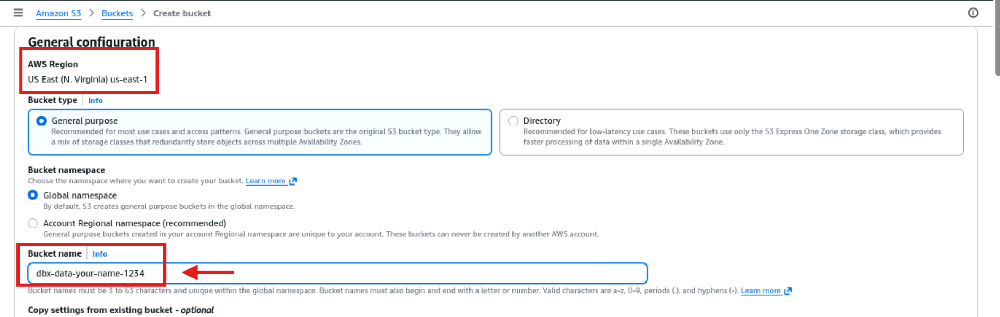

4. Ensure **Block all public access** is **checked** and click **Create bucket**.


5. Click into your new `dbx-data-...` bucket.
6. Click **Create folder**.

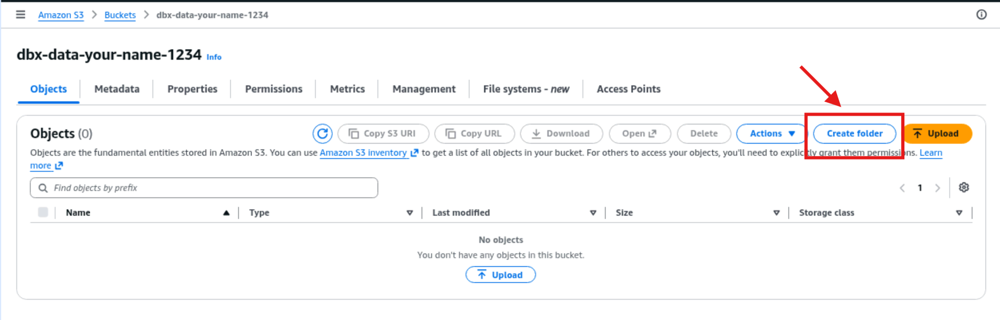

- name it `raw`, and click **Create folder**.

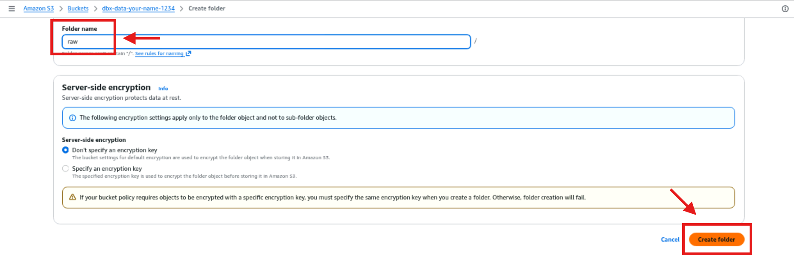

7. Click into the `raw` folder.

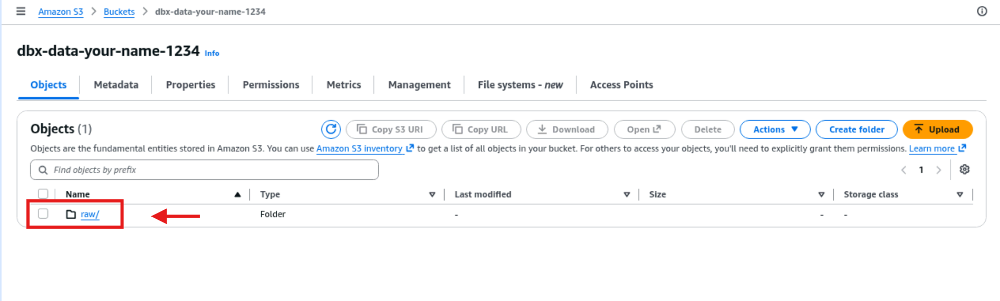

- click **Upload**, then click **Add files**.

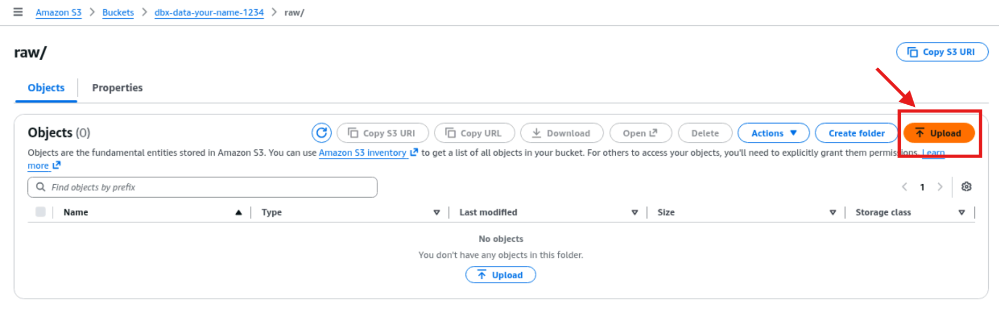
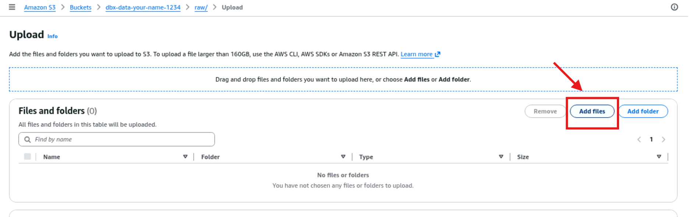

8. Browse to `~/Desktop/Project/` on your lab desktop, select `sample.csv`, and click **Upload**.

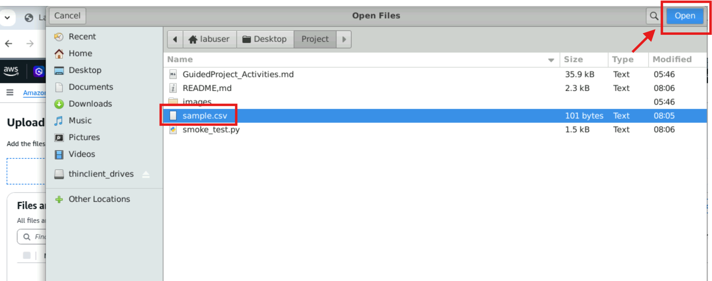
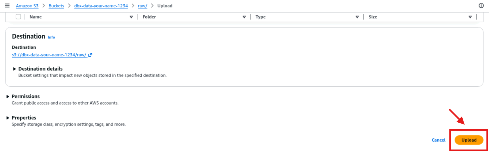

### Step 2.3: Create the Cross-Account IAM Role for Databricks

This role lets the Databricks control plane launch and manage EC2 in your account on your behalf. The **external ID** prevents any other Databricks customer from assuming this role.

1. In the top search bar, type **IAM** and Open the **IAM Console**.

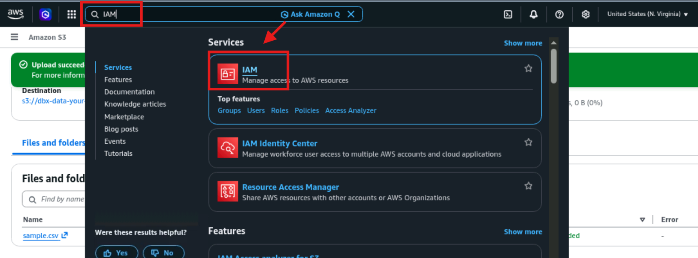

2. On the left navigation pane, click **Roles**, then click **Create role**.

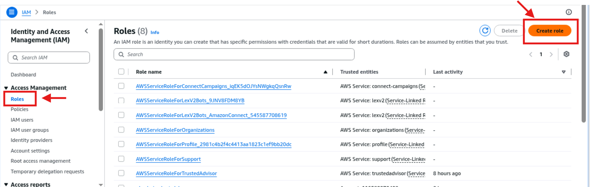

3. Under **Trusted entity type**, select **Custom trust policy**.

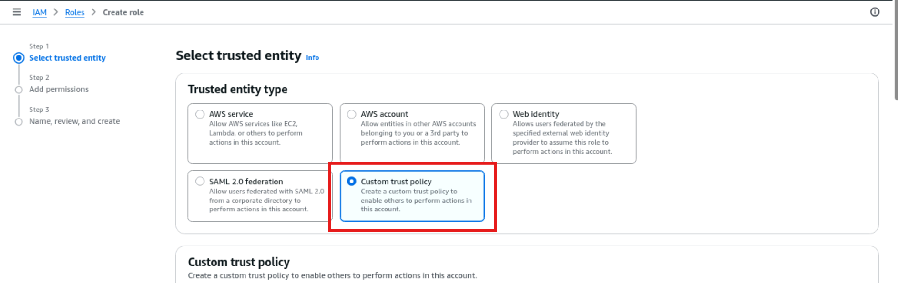

4. Paste the following JSON. Replace `<your-databricks-account-id>` with the Databricks Account ID you captured in the Prerequisites (Step 6).

- **Code Explanation:** This Trust Policy establishes a secure, cross-account trust relationship. It restricts `sts:AssumeRole` actions strictly to the Databricks control plane AWS account, conditional upon the `sts:ExternalId` matching your exact Databricks Account ID.

```json
{
  "Version": "2012-10-17",
  "Statement": [
    {
      "Effect": "Allow",
      "Principal": { "AWS": "arn:aws:iam::414351767826:root" },
      "Action": "sts:AssumeRole",
      "Condition": {
        "StringEquals": { "sts:ExternalId": "<your-databricks-account-id>" }
      }
    }
  ]
}
```

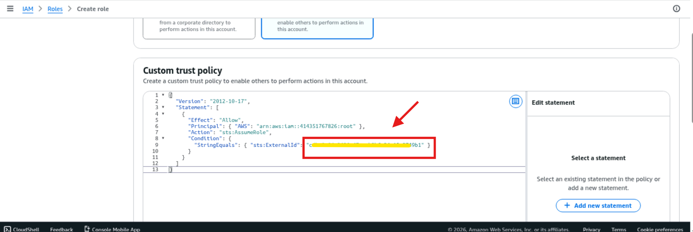

5. Click **Next** to proceed to the Add permissions screen. Do not add any managed policies here; just click **Next**.

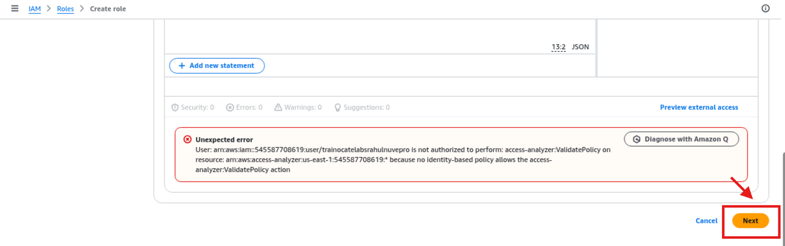
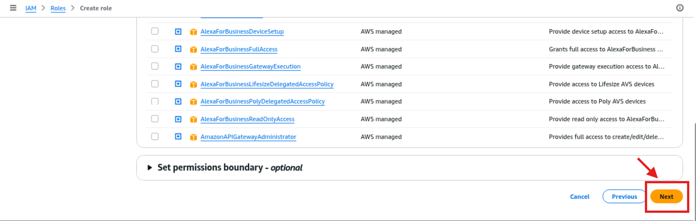

6. **Role name:** `dbx-cross-account-role`.

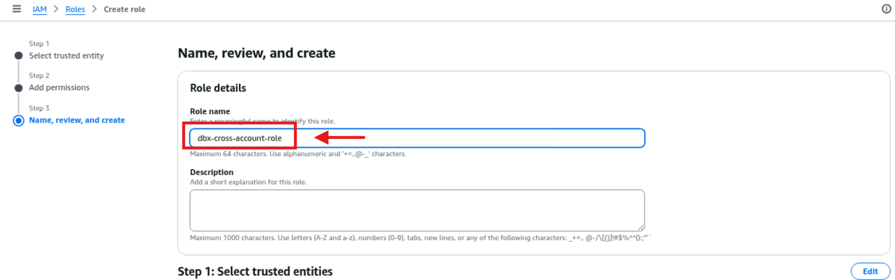

7. Click **Create role**.

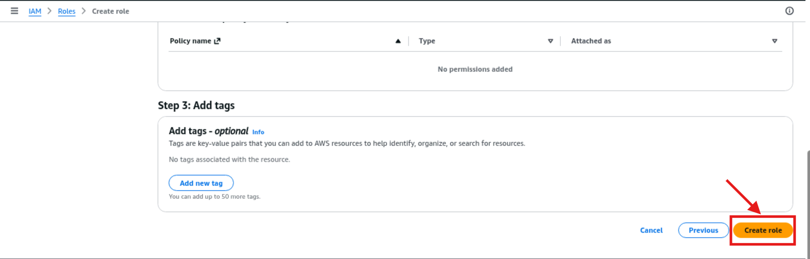

8. Search for and click on your new `dbx-cross-account-role`.
9. Under the **Permissions** tab, click **Add permissions** -> **Create inline policy**.

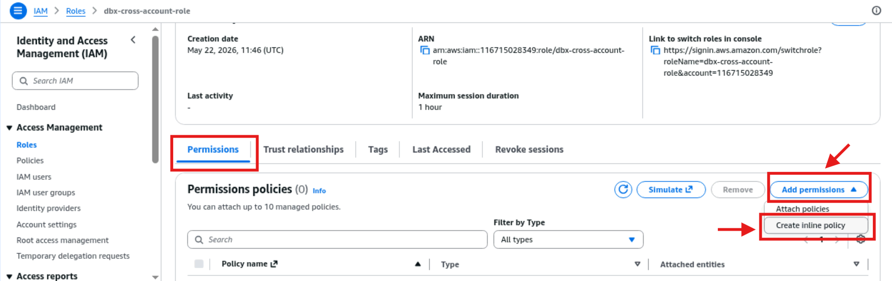

10. Click the **JSON** tab and paste the following Databricks cross-account policy:

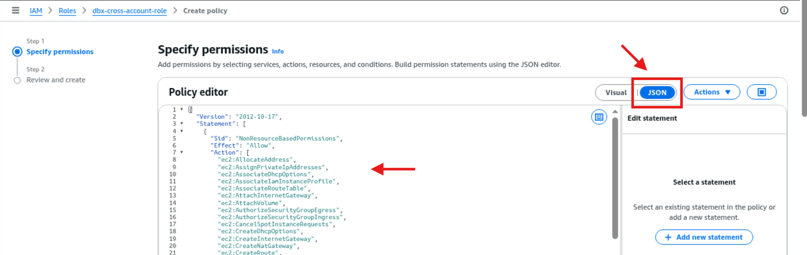

- **Code Explanation:** This permissions policy provides Databricks with exactly the rights needed to provision, configure, and terminate EC2 instances (for your clusters) within your customer-managed VPC, as well as pass necessary instance profile roles to those instances.

```json
{
  "Version": "2012-10-17",
  "Statement": [
    {
      "Sid": "NonResourceBasedPermissions",
      "Effect": "Allow",
      "Action": [
        "ec2:AllocateAddress",
        "ec2:AssignPrivateIpAddresses",
        "ec2:AssociateDhcpOptions",
        "ec2:AssociateIamInstanceProfile",
        "ec2:AssociateRouteTable",
        "ec2:AttachInternetGateway",
        "ec2:AttachVolume",
        "ec2:AuthorizeSecurityGroupEgress",
        "ec2:AuthorizeSecurityGroupIngress",
        "ec2:CancelSpotInstanceRequests",
        "ec2:CreateDhcpOptions",
        "ec2:CreateInternetGateway",
        "ec2:CreateNatGateway",
        "ec2:CreateRoute",
        "ec2:CreateRouteTable",
        "ec2:CreateSecurityGroup",
        "ec2:CreateSubnet",
        "ec2:CreateTags",
        "ec2:CreateVolume",
        "ec2:CreateVpc",
        "ec2:CreateVpcEndpoint",
        "ec2:DeleteDhcpOptions",
        "ec2:DeleteInternetGateway",
        "ec2:DeleteNatGateway",
        "ec2:DeleteRoute",
        "ec2:DeleteRouteTable",
        "ec2:DeleteSecurityGroup",
        "ec2:DeleteSubnet",
        "ec2:DeleteTags",
        "ec2:DeleteVolume",
        "ec2:DeleteVpc",
        "ec2:DeleteVpcEndpoints",
        "ec2:DescribeVpcAttribute",
        "ec2:DescribeAvailabilityZones",
        "ec2:DescribeIamInstanceProfileAssociations",
        "ec2:DescribeInstanceStatus",
        "ec2:DescribeInstances",
        "ec2:DescribeInternetGateways",
        "ec2:DescribeNatGateways",
        "ec2:DescribeNetworkAcls",
        "ec2:DescribePrefixLists",
        "ec2:DescribeReservedInstancesOfferings",
        "ec2:DescribeRouteTables",
        "ec2:DescribeSecurityGroups",
        "ec2:DescribeSpotInstanceRequests",
        "ec2:DescribeSpotPriceHistory",
        "ec2:DescribeSubnets",
        "ec2:DescribeVolumes",
        "ec2:DescribeVpcs",
        "ec2:DetachInternetGateway",
        "ec2:DisassociateIamInstanceProfile",
        "ec2:DisassociateRouteTable",
        "ec2:ModifyVpcAttribute",
        "ec2:ReleaseAddress",
        "ec2:RequestSpotInstances",
        "ec2:RevokeSecurityGroupEgress",
        "ec2:RevokeSecurityGroupIngress",
        "ec2:RunInstances",
        "ec2:TerminateInstances",
        "iam:CreateServiceLinkedRole",
        "iam:PutRolePolicy"
      ],
      "Resource": "*"
    },
    {
      "Sid": "InstanceProfilePassRole",
      "Effect": "Allow",
      "Action": "iam:PassRole",
      "Resource": "*",
      "Condition": {
        "StringEquals": { "iam:PassedToService": "ec2.amazonaws.com" }
      }
    }
  ]
}
```

11. Click **Next**, name the policy `dbx-cross-account-policy`, and click **Create policy**.

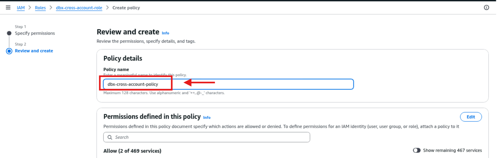
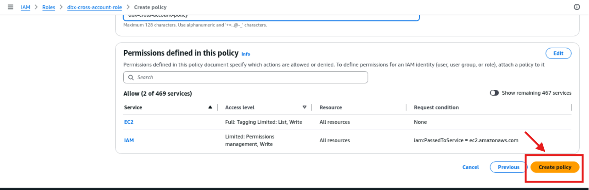

12. **Important:** Copy the **Role ARN** from the top of the role summary page and save it to your notepad. You will need it in Activity 3.

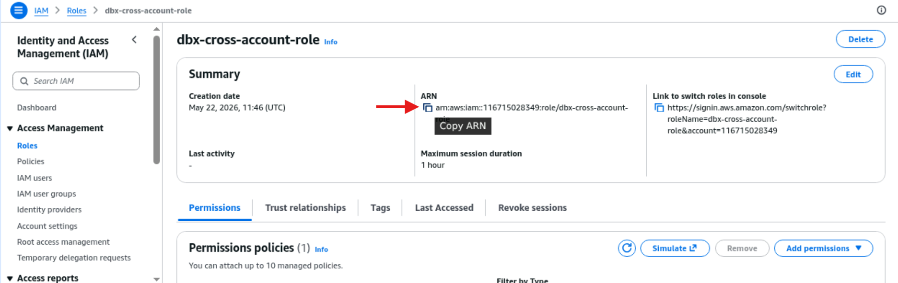

### Step 2.4: Create the Cluster Data-Access Role and Instance Profile

This role is assumed by **EC2 instances** (cluster nodes), giving your Databricks notebooks short-lived S3 credentials. Creating an EC2 role via the AWS Console automatically creates the underlying Instance Profile for you.

1. In the **IAM Console**, go to **Roles** and click **Create role**.

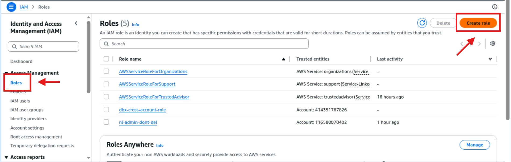

2. Under **Trusted entity type**, select **AWS service**.
3. Under **Use case**, select **EC2**, then click **Next**.

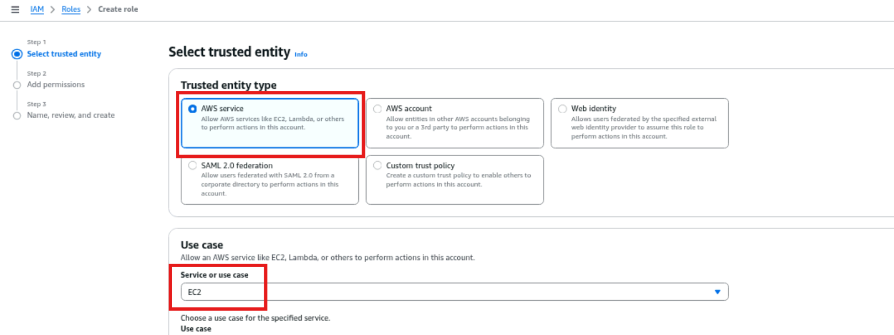
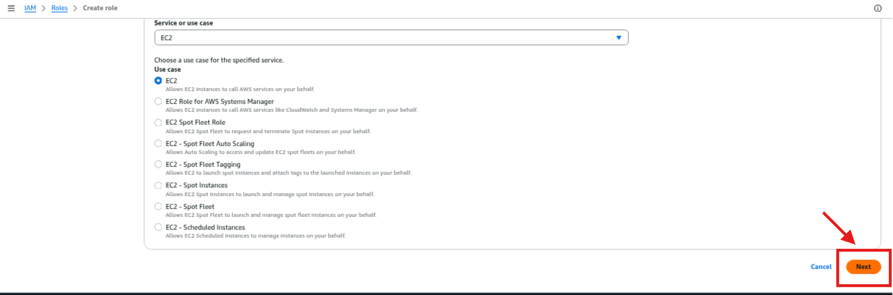

4. Skip the permissions screen by clicking **Next**.


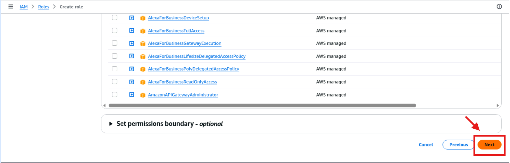

5. **Role name:** `dbx-s3-access-role`.

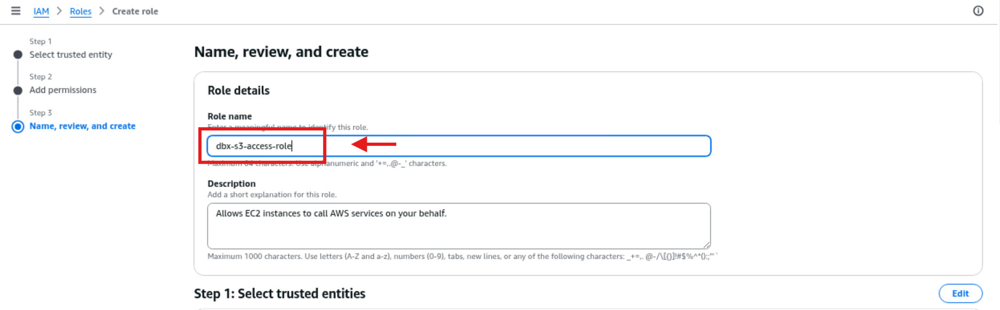

6. Click **Create role**.

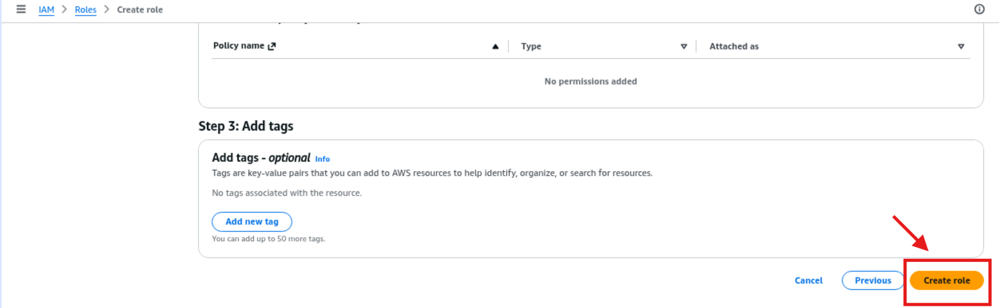

7. Search for and click on your new `dbx-s3-access-role`.
8. Under the **Permissions** tab, click **Add permissions** -> **Create inline policy**.

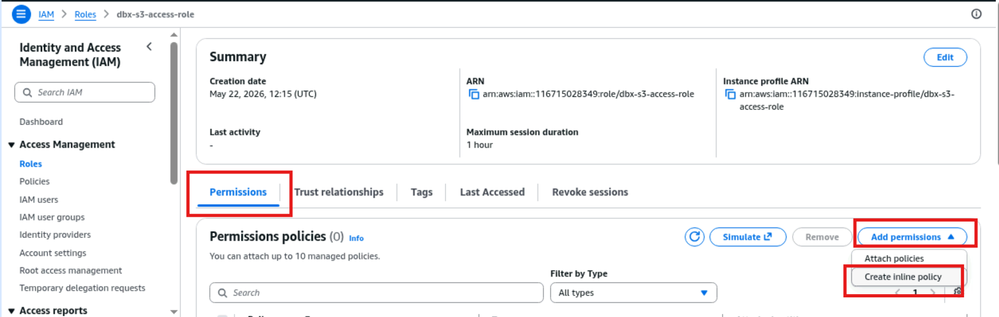

9. Click the **JSON** tab and paste the following policy, ensuring you replace `<your-initials>-<random-4-digits>` with your actual AWS buckett name.

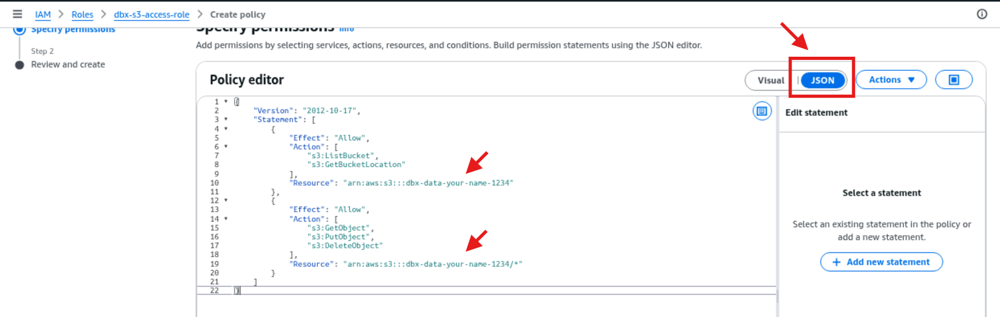

- **Code Explanation:** This policy grants your cluster nodes explicit rights to list the contents of your newly created data bucket and read/write/delete objects within it, enabling data processing pipelines to operate without static credentials.

```json
{
  "Version": "2012-10-17",
  "Statement": [
    {
      "Effect": "Allow",
      "Action": ["s3:ListBucket", "s3:GetBucketLocation"],
      "Resource": "arn:aws:s3:::dbx-data-<your-initials>-<random-4-digits>"
    },
    {
      "Effect": "Allow",
      "Action": ["s3:GetObject", "s3:PutObject", "s3:DeleteObject"],
      "Resource": "arn:aws:s3:::dbx-data-<your-initials>-<random-4-digits>/*"
    }
  ]
}
```

10. Click **Next**, name the policy `dbx-s3-access-policy`, and click **Create policy**.

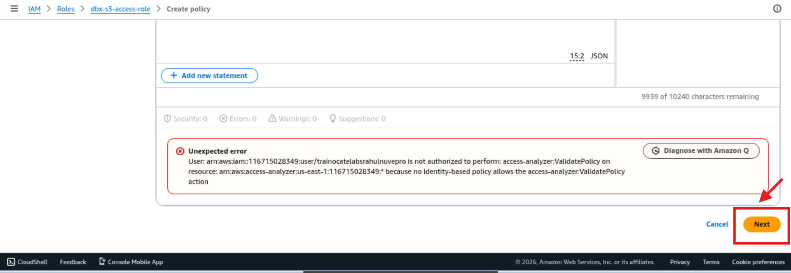
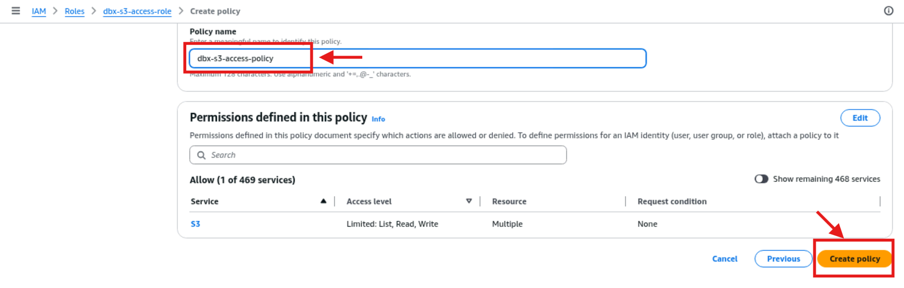

11. **Important:** Note the **Role ARN** for this role as well. When you register the instance profile in Activity 3, you will use this ARN, but you will replace `:role/` with `:instance-profile/`.

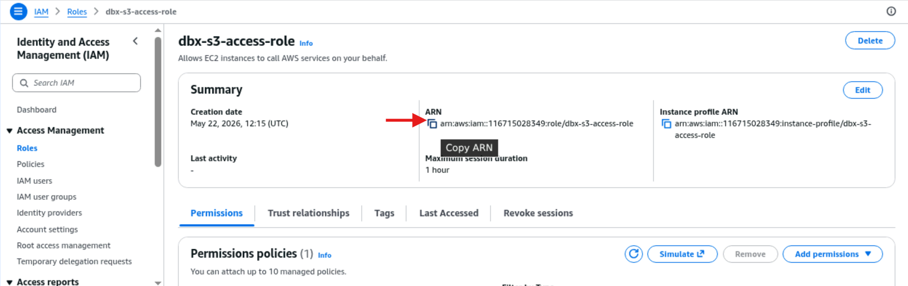

---

# Activity 3: Deploy the Databricks Workspace

**Purpose of this Activity:** To create the Databricks workspace using customer-managed VPC mode by registering three configurations in the account console — **credentials** (the cross-account role), **storage** (the root bucket), and **network** (your VPC + subnets + SG) — and then creating the workspace itself.

### Step 3.1: Register the Credential Configuration

1. Open the Databricks account console at [https://accounts.cloud.databricks.com/](https://accounts.cloud.databricks.com/).
2. Click **Cloud resources** → **Credential configuration** → **Add credential configuration**.

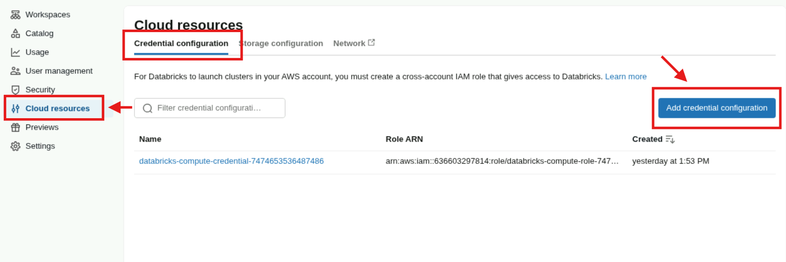

3. **Credential configuration name:** `dbx-lab-creds`.
4. **Role ARN:** Paste the Cross-Account Role ARN you copied in Step 2.3 (e.g., `arn:aws:iam::<your-account-id>:role/dbx-cross-account-role`).
5. Click **Add**.

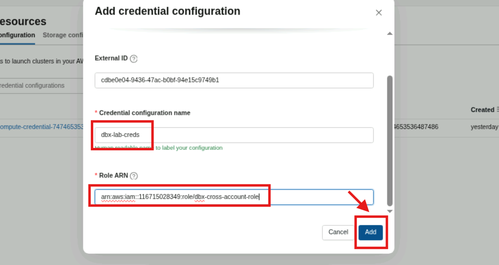

### Step 3.2: Register the Storage Configuration

1. Click **Cloud resources** → **Storage configuration** → **Add storage configuration**.

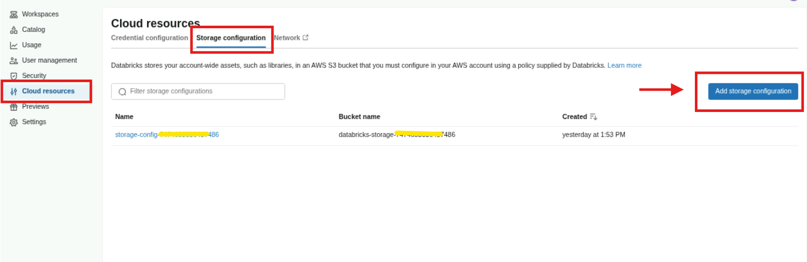

2. **Storage configuration name:** `dbx-lab-storage`.
3. **Bucket name:** `dbx-root-<your-initials>-<random-4-digits>` (the bucket created in Step 2.1).
4. **IAM role ARN:** Leave this field **blank**. (Databricks accesses this root bucket via the S3 Bucket Policy you applied in Step 2.1, so an IAM role is not required here).
5. Click **Add**. Databricks will automatically validate the bucket policy server-side before proceeding.

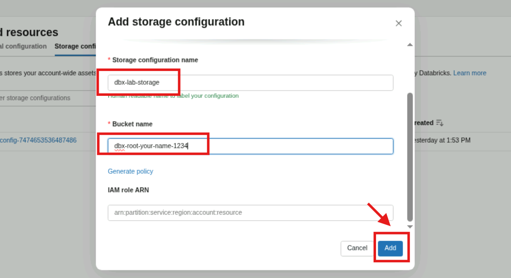

### Step 3.3: Register the Network Configuration

1. In the left sidebar, click **Security** → **Networking** tab → **Classic network configurations** → **Add network configuration**.

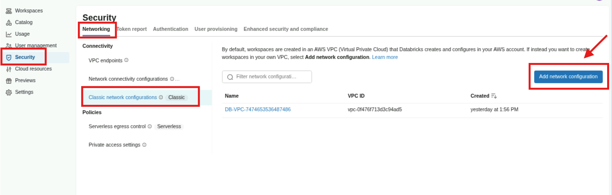

2. **Network configuration name:** `dbx-lab-network`.
3. **VPC ID:** Go to your AWS VPC Console, locate `dbx-vpc`, and paste its VPC ID here.

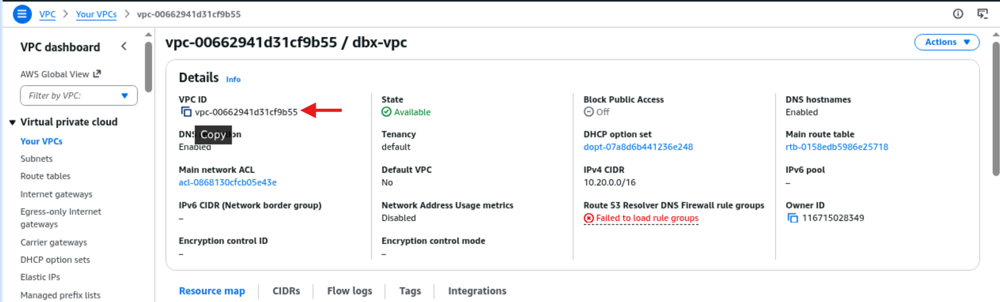

4. **Subnet IDs:** Paste the Subnet IDs for the two **private** subnets created by the wizard. **Do not** add the public subnet.

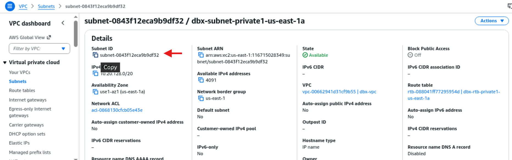
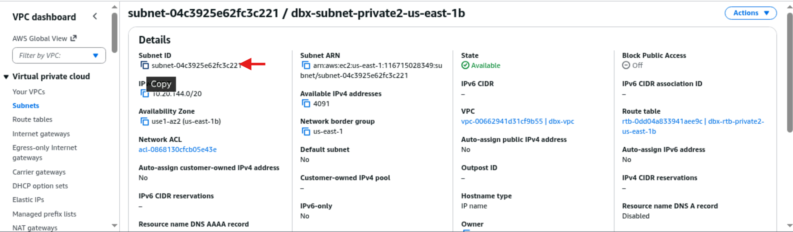
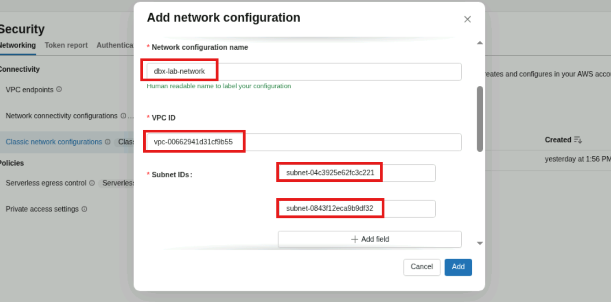

5. Scroll down, **Security group IDs:** Paste the Security Group ID for `dbx-sg`.

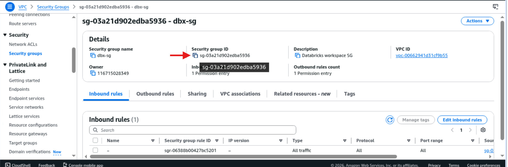

6. Click **Add**.

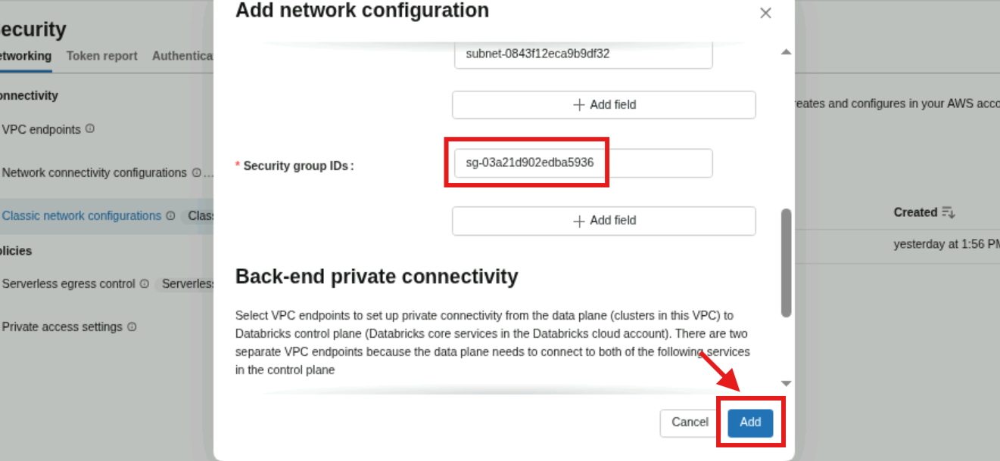

### Step 3.4: Create the Workspace

1. In the left sidebar, click **Workspaces**, then click the blue **Create workspace** button in the top right corner.

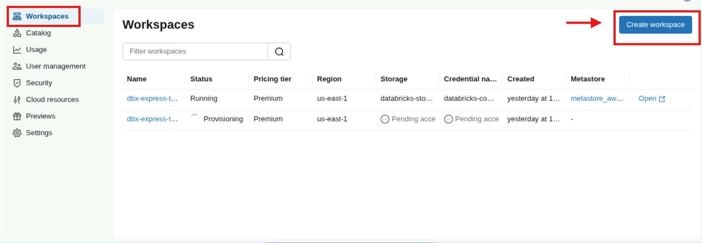

2. In the _Create Workspace_ pop-up, configure the initial settings:
   - **Workspace name:** `dbx-lab-ws`
   - **Region:** `us-east-1`
   - **Storage and compute:** Select the **Use your existing cloud account** tile.

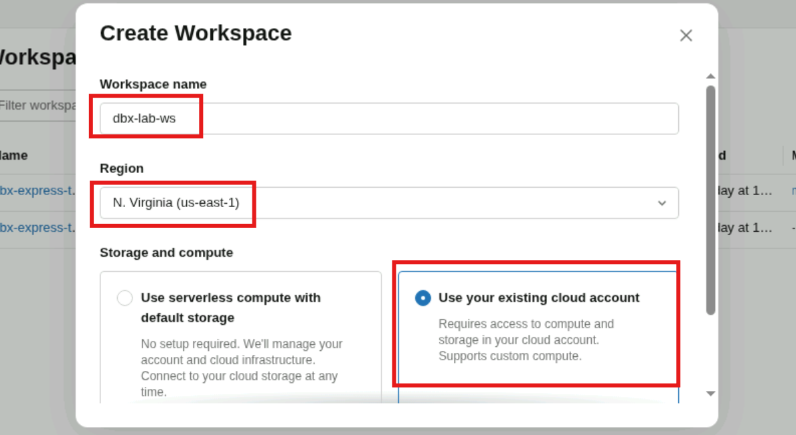

3. Click **Continue**, Scroll down within the modal to reveal the advanced configuration dropdowns, and select the resources you registered in the previous steps:
   - **Compute credentials:** Select `dbx-lab-creds`
   - **Network configuration:** Select `dbx-lab-network`
   - **Workspace storage:** Select `dbx-lab-storage`

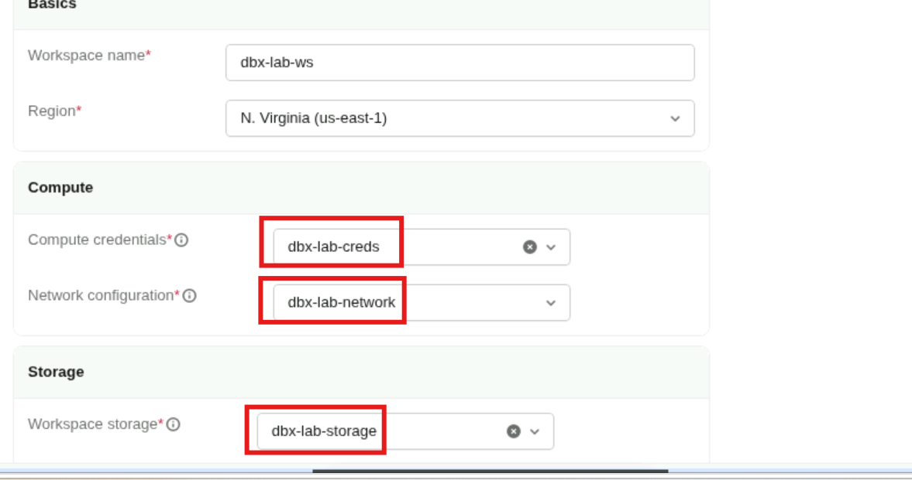

4. Click **Create** at the bottom. The workspace will provision in **5–10 minutes** and its status will update to **Running**.

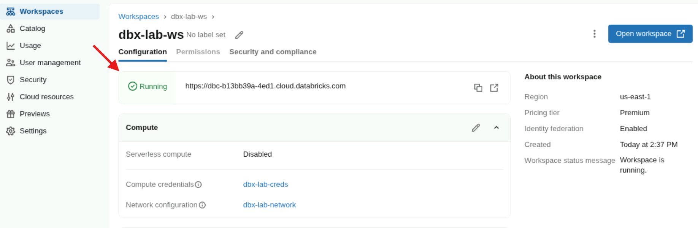

### Step 3.5: Register the Instance Profile Inside the Workspace

The instance profile exists in AWS, but the workspace UI must also be told it's available before users can attach it to clusters.

1. In the Account Console, click on your newly running `dbx-lab-ws` workspace, then click the blue **Open workspace** button in the top right corner (or click the workspace URL directly).

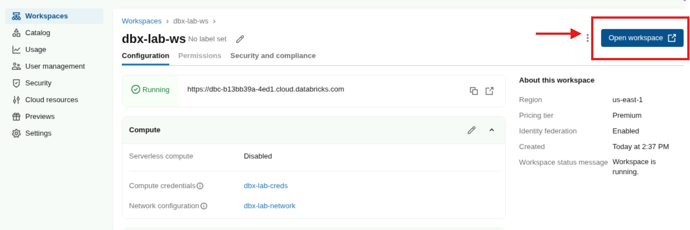

2. Once inside the workspace UI, click your **user avatar** (top-right) → **Settings**.

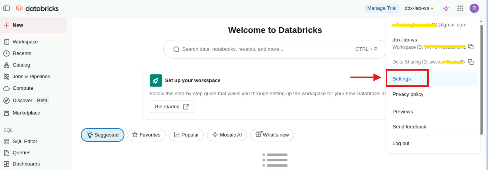

3. In the left navigation sidebar, under the **Workspace admin** section, click **Security**.

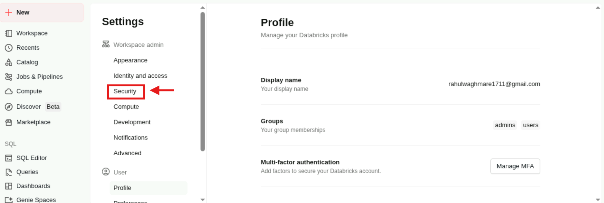

4. Scroll down to the **Instance profiles** section and click **Manage** → **Add instance profile**.

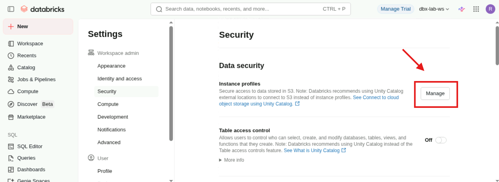
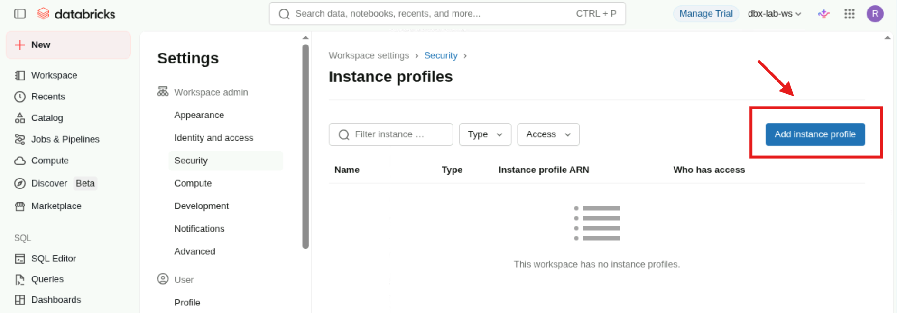

5. **Instance profile ARN:** `arn:aws:iam::<your-account-id>:instance-profile/dbx-s3-access-role` (Take the Data Role ARN from Step 2.4, and carefully replace `:role/` with `:instance-profile/`).
6. Leave **Meta instance profile** unchecked. Click **Add**.

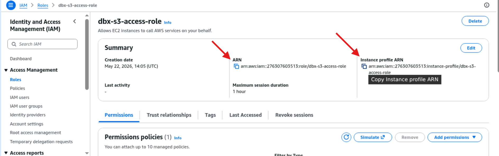
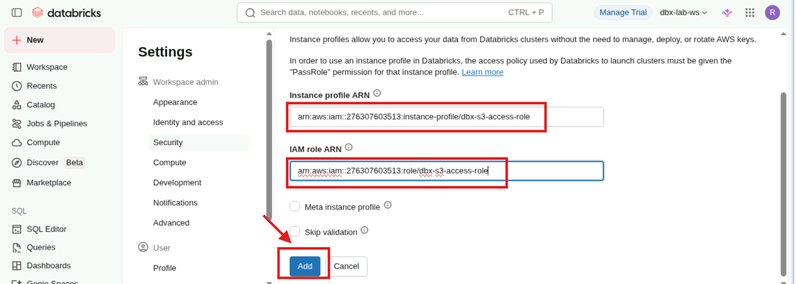

---

# Activity 4: Create a Trial-Friendly Cluster with Spot + Autoscaling and Configure Repos

**Purpose of this Activity:** To stand up a single, cost-optimized cluster that serves both as your **interactive notebook environment** and as the compute for your scheduled job. Under the Databricks 14-day free trial, we collapse the typical "all-purpose + job cluster" pattern into **one all-purpose cluster** with spot instances and tight autoscaling. We will also clone a Git repo into Databricks Repos so the notebook the job runs lives under version control.

> 🏢 **Real-World vs Free Trial:** In a production setting, a data platform team would create **two separate clusters** — an all-purpose cluster for interactive notebook work, and an ephemeral job cluster (100% spot) for scheduled workloads. To keep the free trial cost zero, we will create **only one all-purpose cluster** in this lab and reuse it to simulate the job cluster scenario.

> 💰 **Free Trial Cost Reminder:** You are using the Databricks 14-day free trial. Use only `m4.large` (or `m5.large`) nodes with a maximum of 2 workers. Do not leave clusters running overnight.

### Step 4.1: Create the All-Purpose Cluster (Trial-Compliant)

All-purpose clusters are for **interactive** notebook work; they idle-terminate to control cost. We will configure spot workers with on-demand fallback to keep costs minimal during the trial.

1. In the workspace UI, left sidebar → **Compute**, then click the blue **Create compute** button in the top right.

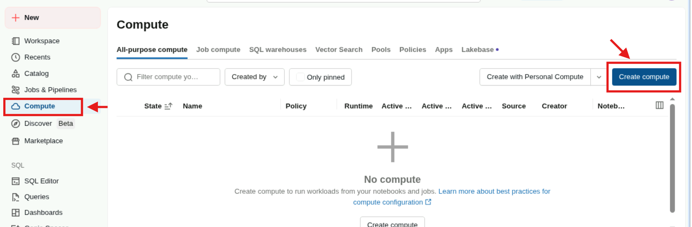

2. Configure the cluster exactly as follows:

**Under the General section:**

- **Compute name:** `dbx-all-purpose`

**Under the Performance section:**

- **Databricks runtime:** Select the latest Standard LTS (e.g., **14.3 LTS** or higher). Ensure **Photon acceleration** and **Machine learning** are **unchecked** to avoid free-trial limits.
- **Preferred worker type:** `m4.large` (if unavailable, fall back to `m5.large`). _Note: With the "Simple form" enabled, this automatically sets your driver to match your worker node._
- **Autoscaling:** Check **Enable autoscaling** and set **Min** to `1` and **Max** to `2`.
- **Auto Termination:** Set **Terminate after** to `30` minutes of inactivity.

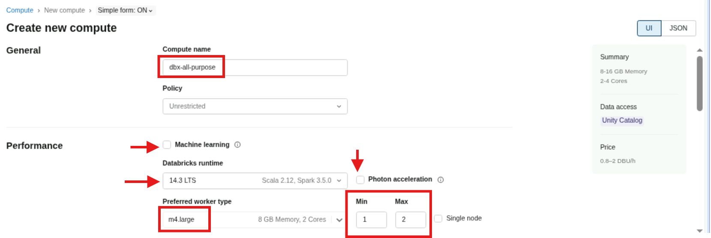

**Under the Advanced performance**

- Check the box to use **Spot instances**.

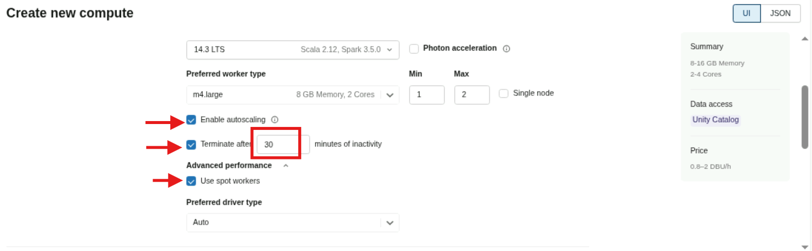

**Under the Advanced section (scroll to the bottom):**

- **Access mode tab:** Make sure the **Access mode** is on **Manual** dropdown is set to **Single User** (and select your user) or **Standard (formerly: Shared)**.
- **Instance profile:** On that same Access mode tab, click the **Instance profile** dropdown and select `dbx-s3-access-role`.

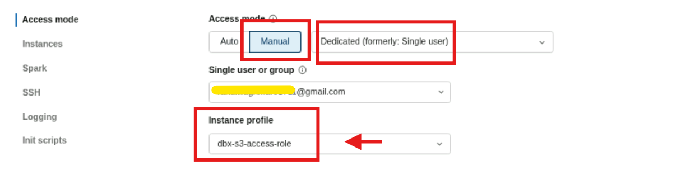

- **Instances tab:** Click the **Instances** tab. If the UI requires EBS volume inputs, enter **`1`** under **# Volumes** and **`32`** under **Size in GB**.

3. Click **Create** at the bottom and wait until the state is **Running** (~3–4 minutes).

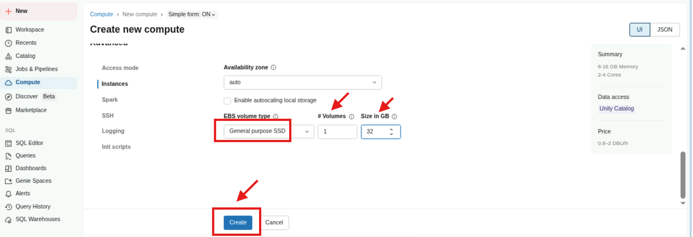

### Step 4.2: Push the Sample Repo Contents to GitHub

1. On your lab desktop, log in to GitHub and create a new **public** repository called `dbx-smoke`.
2. **Important:** Before pushing the code, you need to update the Python script with your exact S3 bucket name. Open the `smoke_test.py` file located in your local `dbx-smoke` project folder using any text editor on your lab desktop.
3. Find the line that defines `DATA_BUCKET` and replace the placeholder text with the actual name of the data bucket you created in Step 2.2 (e.g., `dbx-data-js-8492`). Save and close the file.

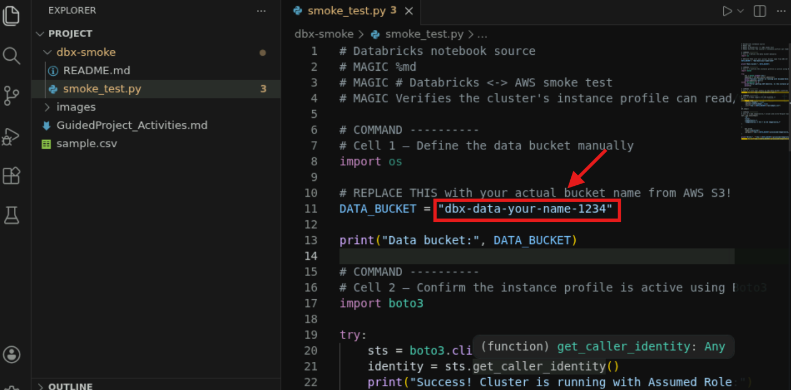

4. Open your local terminal directly inside your `dbx-smoke` project folder.

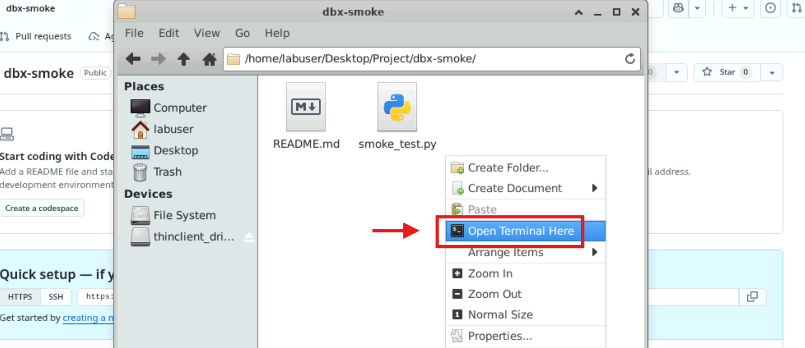

3. Execute the following commands. Ensure you replace `<your-github-user>` with your actual GitHub username.

- **Code Explanation:** These commands initialize local version control in your current project directory, stage your existing files, and push the code securely to your newly created GitHub repository.

```bash
git init -b main
git add .
git commit -m "Initial: smoke_test notebook"
git remote add origin [https://github.com/](https://github.com/)<your-github-user>/dbx-smoke.git
git push -u origin main

```

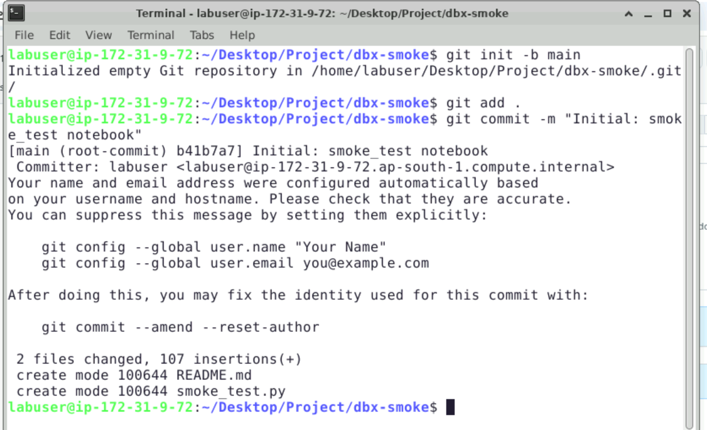
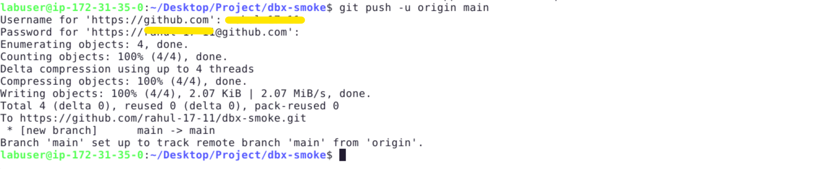

### Step 4.3: Generate a GitHub PAT and Link to Databricks

1. Open [https://github.com/settings/tokens](https://github.com/settings/tokens) → **Generate new token (classic)**.
2. Note: `databricks-lab`, Expiration: 30 days, Scope: **`repo`**. Generate and copy the token.
   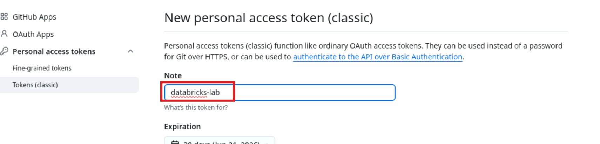
3. In the Databricks workspace UI, click your **user avatar** (top-right) → **Settings**.


4. In the left navigation sidebar, scroll down to the **User** section and click **Linked accounts**.

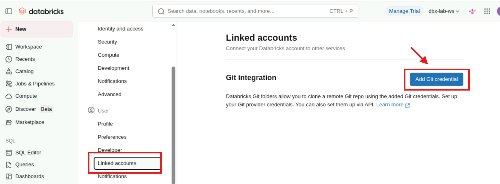

5. Under the **Git integration** section, click the blue **Add Git credential** button.

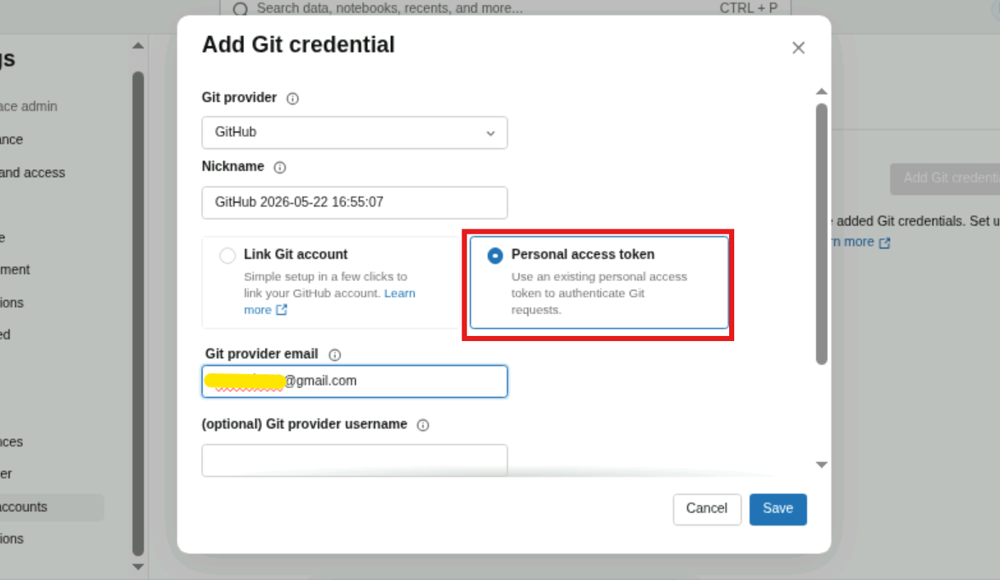

6. **Git provider:** GitHub. Paste the PAT and your GitHub username/email, then click **Save**.

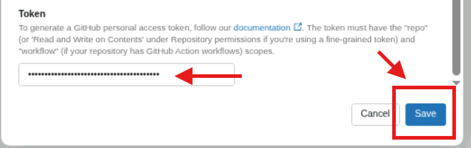

### Step 4.4: Clone the Repo into Databricks Repos

1. In the workspace UI, left sidebar → click **Workspace**.
2. In the secondary menu, click on the **Repos** folder.
3. In the main window, you will see a gray banner explaining the new Git folders feature. Click the blue text link inside that banner that says **create a Repo here**. _(Note: This will automatically generate your user folder)._

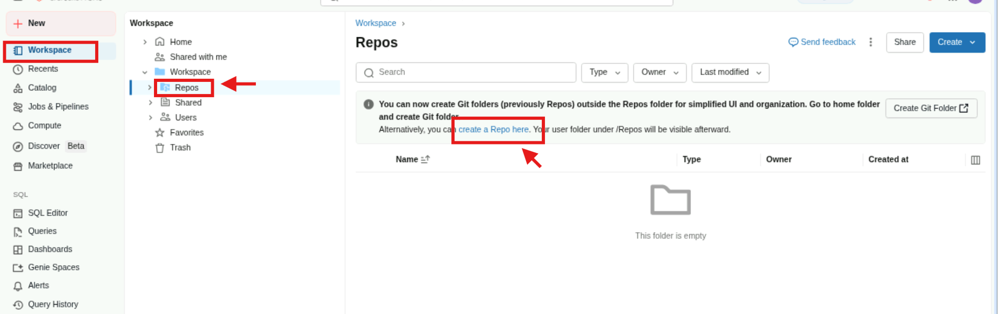

4. In the pop-up dialog, configure the following:
   - **Git repository URL:** `https://github.com/<your-github-user>/dbx-smoke.git`
   - **Git provider:** GitHub
   - **Repo name:** `dbx-smoke`
5. Click **Create Repo** (or **Create Git folder**).

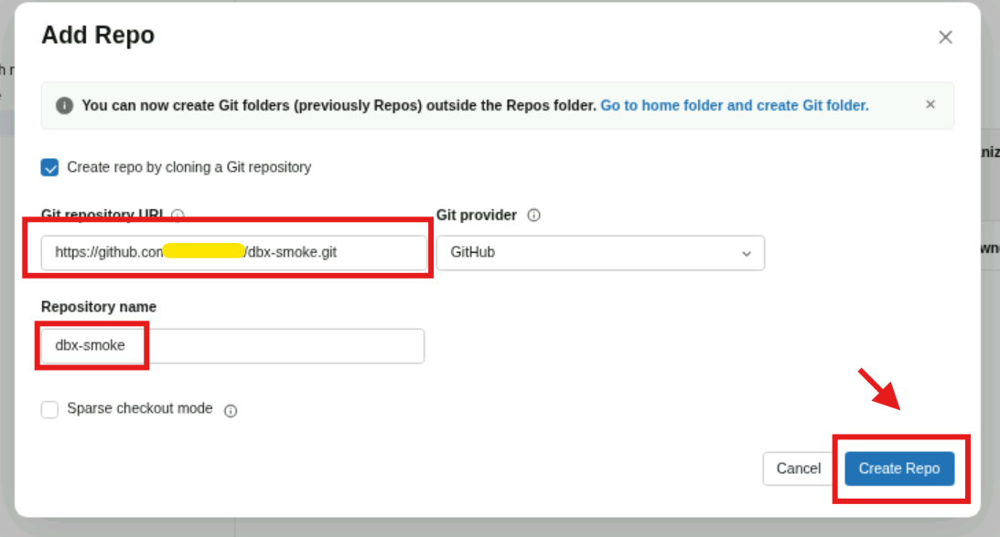

### Step 4.5: Create the Smoke-Test Job (Reusing the All-Purpose Cluster)

> 🏢 **Real-World vs Free Trial:** Production-grade jobs use **ephemeral job clusters** that auto-provision and terminate per run. For the free trial, you'll **reuse the existing `dbx-all-purpose` cluster** as the job task's compute — this avoids spinning up a second cluster and keeps you under the 2-worker free-trial ceiling.

> 💰 **Free Trial Cost Reminder:** You are using the Databricks 14-day free trial. To avoid unexpected AWS charges, always terminate clusters immediately after each activity. Use only `m4.large` (or `m5.large`) nodes with a maximum of 2 workers. Do not leave clusters running overnight.

1. In the workspace UI, left sidebar → click **Jobs & Pipelines**.
2. On the right side of the screen, click the blue **Create** button and select **Job** from the dropdown.

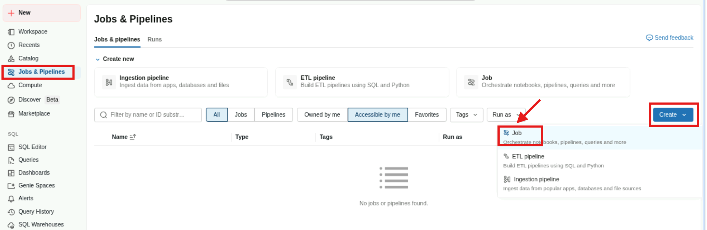

3. At the top left of the screen, double click the default "New Job" text and rename it to **`dbx-smoke-job`**.
4. In the center pane, under **Add your first task**, click the **Notebook** tile.

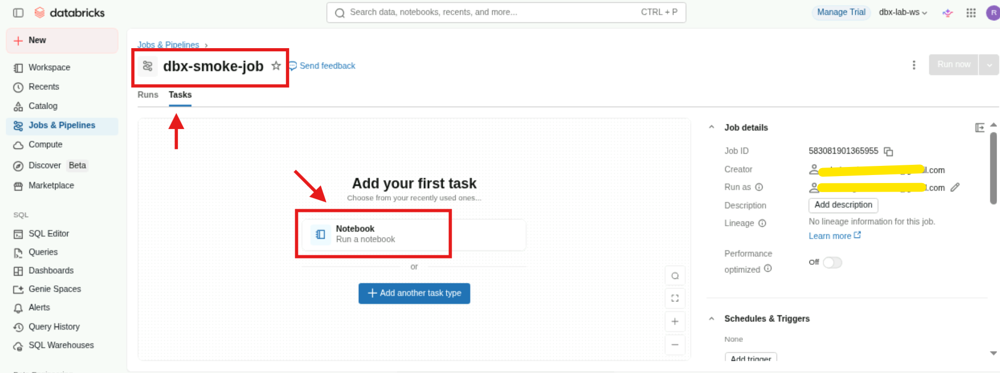

5. A task configuration panel will appear on the right side of the screen. Fill in the following details:
   - **Task name:** `smoke_test`
   - **Source:** Workspace
   - **Path:** `/Repos/<your-user>/dbx-smoke/notebooks/smoke_test`

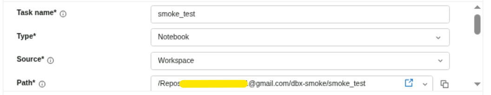

- **Compute:** Select your existing all-purpose cluster (`dbx-all-purpose`).

6. Click the blue **Create task** button at the bottom of that right-hand panel. (Leave "Schedules & Triggers" empty — you will trigger the job manually in Activity 5).

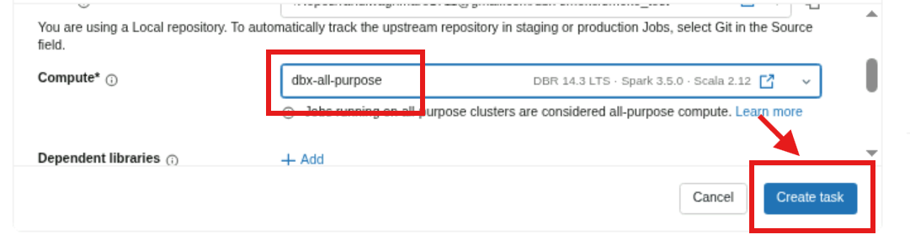

---

# Activity 5: Run the Smoke Test Notebook (Interactive + Job)

**Purpose of this Activity:** To prove end-to-end wiring — networking, IAM, instance profile, the trial-friendly cluster, and Git integration — by running the same notebook **interactively** (inside the notebook editor) and **as a job** (triggered through Databricks Jobs & Pipelines).

### Step 5.1: Review the Smoke Test Notebook

While the code is already pulled from your GitHub repository, it is important to understand what the script is testing.

- **Cell 2** dynamically resolves your AWS account ID from cluster tags to identify the correct S3 data bucket.
- **Cell 3** calls `sts get-caller-identity`, printing the assumed IAM role as undeniable proof that your cluster successfully attached the instance profile.
- **Cells 4 & 5** read the raw CSV data using PySpark and execute a write operation to save the transformed Parquet data back to the instance-profile-secured bucket.

### Step 5.2: Run the Notebook Interactively (In the Notebook Editor)

First, we will run the code manually just like a data scientist would during development.

1. In the left sidebar, click **Workspace**.
2. Navigate through your folders: **Workspace** → **Repos** → `<your-user>` → `dbx-smoke` → `notebooks`.
3. Click on the `smoke_test` file to open the **Notebook Editor**.

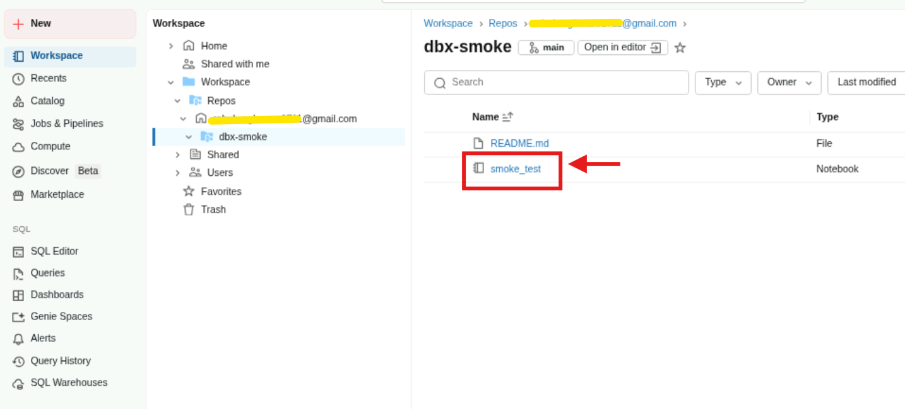

4. Look at the top-left corner of the notebook editor. Ensure the compute dropdown is attached to your **`dbx-all-purpose`** compute (start it if it isn't running).

- If it says serverless update to **`dbx-all-purpose`**

5. In the top-right corner of the notebook editor, click **Run all**.

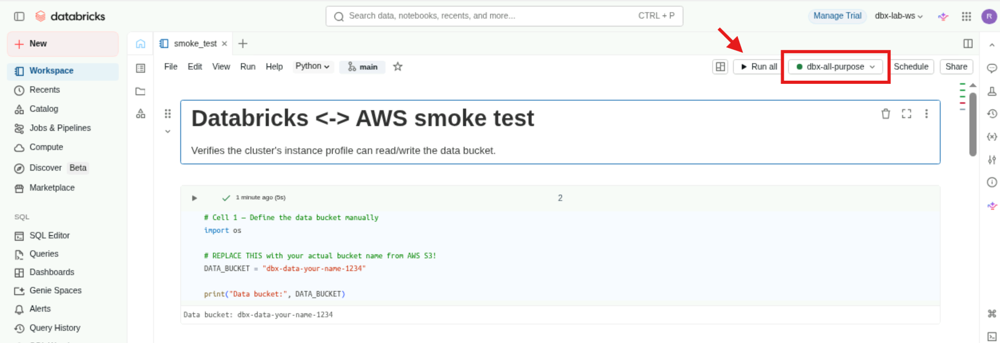

6. Scroll through the results. The STS cell should print an assumed-role ARN containing `dbx-s3-access-role` — this confirms your instance profile is actively functioning. The final cell lists newly-written parquet files under `processed/temperature_f/`.

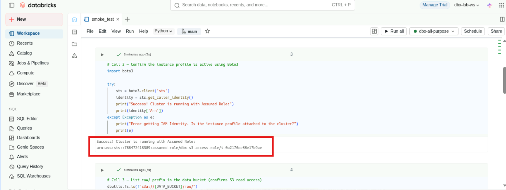
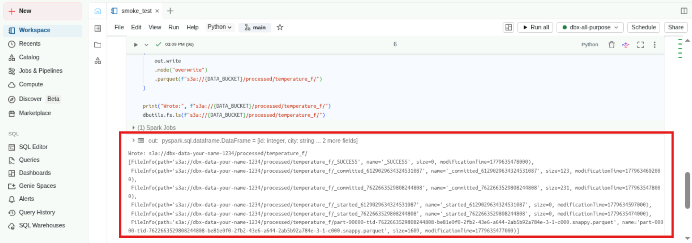

### Step 5.3: Run the Same Notebook as a Job (In the Jobs UI)

Next, we will run that exact same notebook as an automated workflow.

1. In the left sidebar, click **Jobs & Pipelines** and click on your **`dbx-smoke-job`**. This opens the Job canvas.
2. Verify in the center pane that your Compute is set to `dbx-all-purpose`.
3. In the top-right corner of the screen, click the blue **Run now** button.

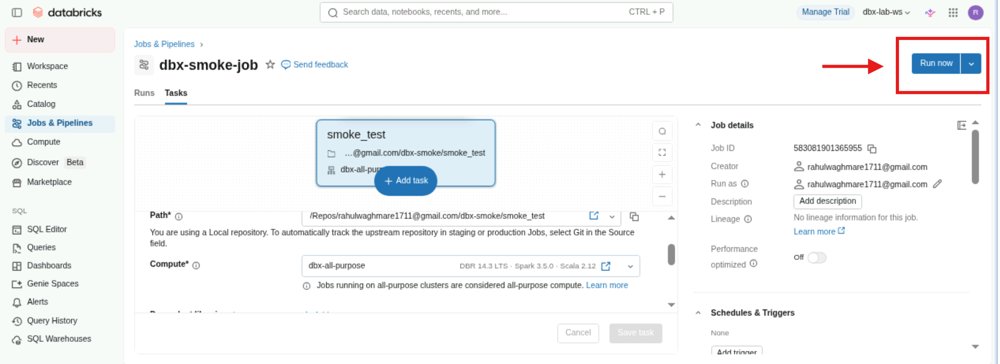

4. Near the top-left of the screen (right next to the "Tasks" tab), click the **Runs** tab to watch the new run transition from **Pending → Running**. Because we're reusing the all-purpose compute, the run starts almost immediately.
5. When the status flips to **Succeeded**, click into the run link to inspect the cell outputs.

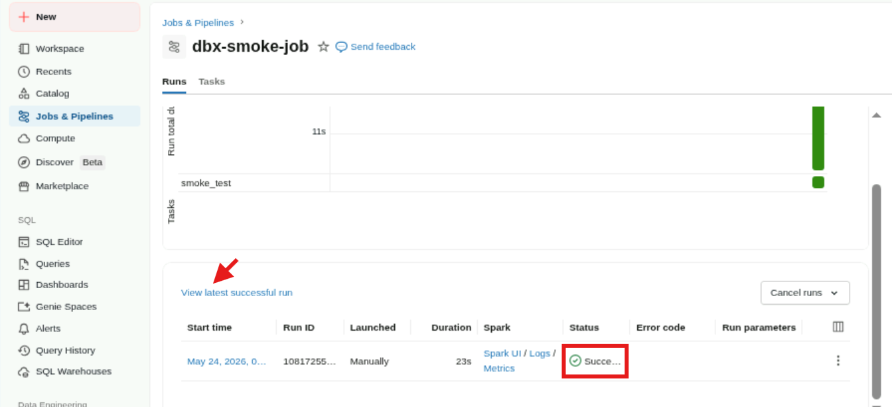

---

## 🎓 Conclusion

This guided project demonstrated how to deploy a trial-friendly Databricks workspace on AWS from scratch and run a real workload on it. You stood up the AWS networking foundations, wired up the IAM identities Databricks needs, deployed the workspace into your own VPC, and created a cost-optimized cluster that runs notebooks straight from a Git repo — all while staying inside the **14-day free trial** envelope.

You practiced real-world platform engineering patterns, including:

- Building a **customer-managed VPC** via the AWS Wizard sized for Databricks: private subnets across AZs, a NAT gateway for egress, and a **self-referencing security group** that satisfies Spark's inter-node networking requirements.
- Creating **two separate IAM roles** via the AWS Console with very different jobs — a **cross-account role** trusted by the Databricks AWS account (control-plane EC2 management), and a **data-access role wrapped in an instance profile** (short-lived S3 credentials for clusters).
- Provisioning a **customer-managed-VPC Databricks workspace** through credential, storage, and network configurations in the account console.
- Creating a **trial-compliant all-purpose cluster** with **autoscaling 1–2, spot enabled, 30-min auto-termination**, and the latest **LTS Standard runtime** — the right shape for free-trial interactive work.
- **Simulating a job cluster scenario** using the same all-purpose cluster, understanding the real-world ephemeral-job-cluster pattern that would be used in production.
- Connecting the workspace to **GitHub via Databricks Repos** and running the same notebook **interactively** and **as a job**, with all S3 access flowing through the securely attached instance profile.
