# Title: Medallion Architecture Pipeline — Bronze to Gold

---

## 🌟 Overview: What is the purpose of this Lab?

Welcome to your Databricks-on-AWS data engineering project! Before business teams can trust analytics, raw cloud files must be ingested reliably, cleaned consistently, governed properly, and transformed into reporting-ready tables. This lab will guide you through building a **production-style Medallion Architecture pipeline on AWS** end-to-end: from uploading raw files into Amazon S3, all the way to ingesting them with **Auto Loader**, transforming them through **Bronze**, **Silver**, and **Gold** Delta tables, and validating the results with **Delta Live Tables**, **Unity Catalog**, **Workflows**, and **Databricks SQL**.

**The Purpose of this Lab:**
You are part of a data engineering team building an enterprise-grade data pipeline on Databricks. Raw files land continuously in cloud storage and need to be ingested, cleaned, and aggregated for business reporting. Your task is to use **Auto Loader** to stream raw files into the **Bronze layer**, apply cleansing and deduplication logic to produce a **Silver layer**, and build aggregated business metrics into the **Gold layer** — following the Medallion Architecture pattern used in production Lakehouse environments. You will also enable **Change Data Feed (CDF)** on the Silver table and use it to support incremental downstream propagation. To extend the project to a production mindset, you will additionally validate **Delta Lake history and time travel**, create a **Delta Live Tables** version of the pipeline with **data quality expectations**, register governed assets in **Unity Catalog**, and orchestrate the flow with **Databricks Workflows** and **Databricks SQL**.

By the end of this project, you will have:

- Provisioned or accessed a **Databricks workspace on AWS** suitable for free-trial learning.
- Created a **trial-friendly all-purpose cluster** using **Spot instances**, **autoscaling 1–2**, and **30-minute auto termination**.
- Uploaded raw order files into **Amazon S3** and ingested them incrementally with **Auto Loader** into a Bronze Delta table.
- Built a **Silver Delta table** that enforces cleansing rules, removes duplicates, and enables **Change Data Feed**.
- Built a **Gold Delta table** containing aggregated business metrics for reporting.
- Validated **Delta Lake operations** using history inspection and time travel queries.
- Re-implemented the medallion flow as a **Delta Live Tables pipeline** with **data quality expectations**.
- Registered and queried governed assets using **Unity Catalog** naming.
- Created a **Databricks Workflow** and executed **SQL analytics** against the Gold layer.

### Learning Path:

1. **Authentication:** Configure your AWS Console access and credentials.
2. **Databricks Account Setup:** Either log in to your existing Databricks account, or sign up and complete the Workspace Setup.
3. **Storage Foundations:** Create an S3 bucket structure for raw, checkpoint, and curated medallion data.
4. **IAM & Security:** Create and link an Instance Profile to allow secure S3 access.
5. **Compute Setup:** Create a single free-trial-compliant Databricks cluster for all activities.
6. **Bronze to Gold Pipeline:** Build Bronze ingestion, Silver cleansing, and Gold aggregation using Auto Loader and Delta Lake.
7. **Advanced Lakehouse Features:** Enable CDF, inspect Delta history, and validate time travel.
8. **Declarative & Governed Extensions:** Build a DLT pipeline, create Unity Catalog objects, and inspect lineage.
9. **Operationalization:** Orchestrate the notebooks with Workflows and validate reporting queries in SQL.

---

## 📊 Dataset / Knowledge Source Used

The following files are provided in the `~/Desktop/Project/` folder on your lab desktop. You will upload these to S3 as part of the lab. We are using a small retail orders sample so the lab stays fast, inexpensive, and easy to verify on the Databricks 14-day free trial.

Note: If you are following along on a personal computer instead of a pre-configured lab VM, ensure you have downloaded the project repository and placed the data files in a folder named `~/Desktop/Project/`.

**Local File Structure:**

```text
~/Desktop/Project/
├── orders_batch_01.csv
├── orders_batch_02.csv
├── orders_batch_03.csv
└── medallion_dlt.py
```

| File                  | Destination                                                  | Description                                                                                |
| --------------------- | ------------------------------------------------------------ | ------------------------------------------------------------------------------------------ |
| `orders_batch_01.csv` | `s3://dbx-medallion-<suffix>/raw/orders/orders_batch_01.csv` | Initial raw order file containing valid, duplicate, and dirty records for Bronze ingestion |
| `orders_batch_02.csv` | `s3://dbx-medallion-<suffix>/raw/orders/orders_batch_02.csv` | Incremental raw order file used to test Auto Loader checkpointing and Silver deduplication |
| `orders_batch_03.csv` | `s3://dbx-medallion-<suffix>/raw/orders/orders_batch_03.csv` | Late-arriving and changed order records used to validate CDF-driven Gold propagation       |
| `medallion_dlt.py`    | Databricks Workspace notebook source                         | Python notebook containing the DLT Bronze, Silver, and Gold definitions with expectations  |

> **Note on the mock dataset:** The order files contain columns such as `order_id`, `customer_id`, `order_status`, `order_amount`, `order_ts`, and `region`. Some rows intentionally contain duplicate `order_id` values, blank keys, invalid statuses, and non-positive amounts so you can verify Silver-layer cleansing and deduplication logic.

---

## 🛠️ Prerequisites & AWS Setup

> 💰 **Free Trial Cost Reminder:** You are using the Databricks 14-day free trial. To avoid unexpected AWS charges, always terminate clusters immediately after each activity. Use only `m4.large` (or `m5.large`) nodes with a maximum of 2 workers. Do not leave clusters running overnight.

Ensure the following are available:

- An **AWS account** with permissions for VPC, EC2, IAM, S3, and CloudWatch.
- Access to the AWS Console (Lab credentials provided).
- A **Databricks account on AWS** (Premium tier — the 14-day trial is sufficient). If you do not yet have one, you will create it in **Activity 1**.
- The local data files located at `~/Desktop/Project/`:
  - `~/Desktop/Project/orders_batch_01.csv`
  - `~/Desktop/Project/orders_batch_02.csv`
  - `~/Desktop/Project/orders_batch_03.csv`
  - `~/Desktop/Project/medallion_dlt.py`
- AWS CLI v2, `jq`, and `git` installed locally.
- A **GitHub account**.
- All AWS resources must be created in the **US-EAST-1 (N. Virginia) Region**.

---

## Configure AWS Credentials

First, log in to the AWS Web Console to set up our destination.

- Login to AWS Console:
  - Click on the `Lab Access` icon on the desktop.


- Click on `Access Lab` and using the given credentials login to AWS Console. This will allow you to access the AWS resources from the Console.


- Once logged in, set the region to `us-east-1`. Create all resources in the **US-EAST-1 (N. Virginia) Region**.

- Steps to select the AWS region in the AWS Console:
  - Locate the region selector at the top-right corner of the console (next to your Account Name, which is painted in red).
  - Click on the dropdown, and a list of available AWS Regions will appear.


    - Choose us-east-1 (N.Virginia) Region.


---

## Set Up (or Sign In to) Your Databricks Account

**Purpose of this Activity:** To make sure you have an active Databricks-on-AWS account before any infrastructure work begins. If you already have an account, you'll log in and capture your Databricks account ID. If not, you'll complete the Express Setup that creates a trial workspace and links it to AWS.

### Step 1: Do You Already Have a Databricks Account?

Before you continue, answer this question:

- **YES — I already have a Databricks account on AWS.** ➡️ Skip directly to **Step 6 (Log In and Capture Your Databricks Account ID)**.
- **NO — I need to create a new Databricks account.** ➡️ Continue with **Step 2** below.

### Step 2: Access the Databricks Login Page

Open a new browser tab and navigate to [https://login.databricks.com/](https://login.databricks.com/). Click the **Continue with Google** button (or use the email option you prefer).


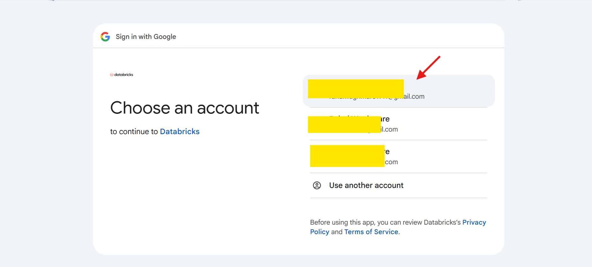

### Step 3: Authenticate and Choose a Trial Type

1. Choose the Google/email account you wish to use for your Databricks environment.
2. On the **"What will you use Databricks for?"** screen, select **For work** (this enables the 14-day free trial and AWS integration).
3. Click **Start trial with express setup**.


### Step 4: Configure Account Details and Verify

- Enter your desired account name (e.g., `dbx-lab-account`).
- Select your country/region and click **Continue**.


- Complete the security/captcha challenge and click **Submit**.


- On **"Tell us about yourself"**, pick **Learn data and AI** and choose up to 3 topics of interest, then click **Continue**.


- Wait while Databricks initializes your account ("Setting up your account…" screen).

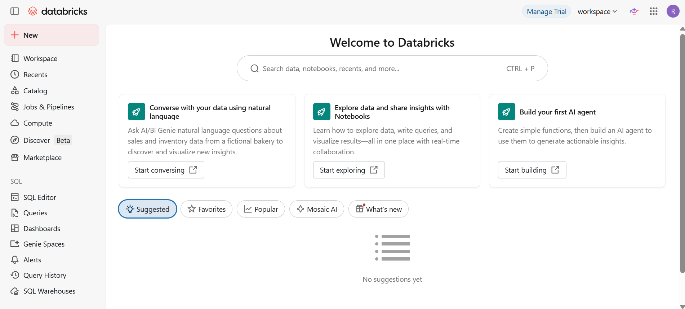

### Step 5: Express Setup — Link Databricks to AWS

This Express Setup automatically provisions a starter workspace and links it to AWS via CloudFormation. Completing this setup is a mandatory step to fully activate your Databricks account so we can begin building our cluster and pipeline in the upcoming activities.

1. When the workspace UI first loads, click your workspace name (top-right) → **Manage account**.


2. In the account console, click **Workspaces** from left navigation then **Create workspace**.


3. Fill out the form:
   - **Workspace name:** `dbx-medallion-temp`
   - **Region:** `N. Virginia (us-east-1)`
   - **Storage and compute:** **Use your existing cloud account**
   - Click **Continue**.

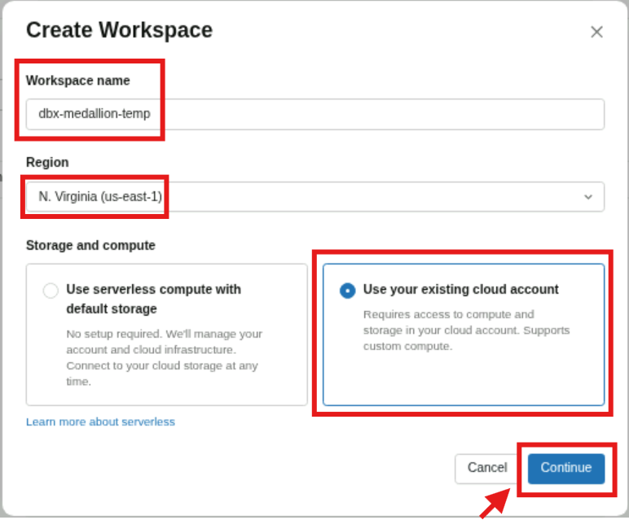

4. Configure your cloud credentials and storage:
   - Under **Compute credentials**, click the dropdown and select **Add cloud credentials**.

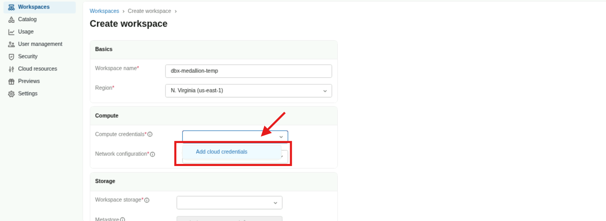

- In the _Add cloud credentials_ pop-up window, select **Add automatically** and click **OK**. Ensure **Workspace storage** is also set to **Add automatically**.

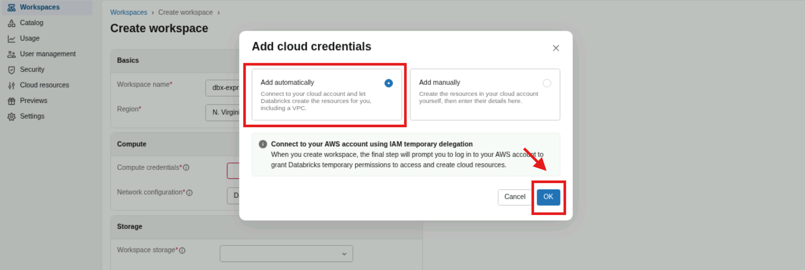

- Once both are configured, click the **Log in to AWS and create workspace** button at the bottom of the screen.


5. Review the AWS resources Databricks will create in the pop-up modal, then click **Initiate workspace creation**.

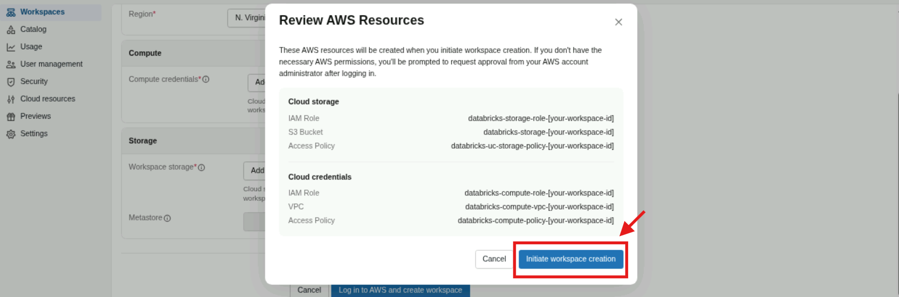

6. You'll be redirected to AWS — sign in and click **Allow access** to let Databricks provision the cross-account roles and resources.

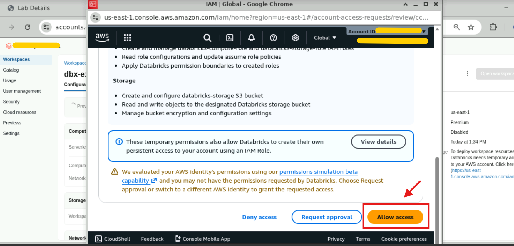

7. Return to the Databricks console and wait until the workspace status flips to **Running**.

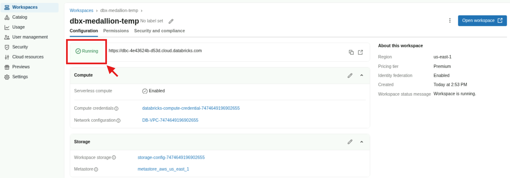

### Step 6: Log In and Capture Your Databricks Account ID

1. Open the **Databricks account console** at [https://accounts.cloud.databricks.com/](https://accounts.cloud.databricks.com/) and sign in.
2. Click the **user icon** (top-right) → **Account**.
3. **Copy** the **Account ID** (a UUID that looks like `e2-xxxxxxxx-xxxx-xxxx-xxxx-xxxxxxxxxxxx`) into a text note. Keep this Account ID handy, as it confirms your workspace is fully linked to your AWS environment.

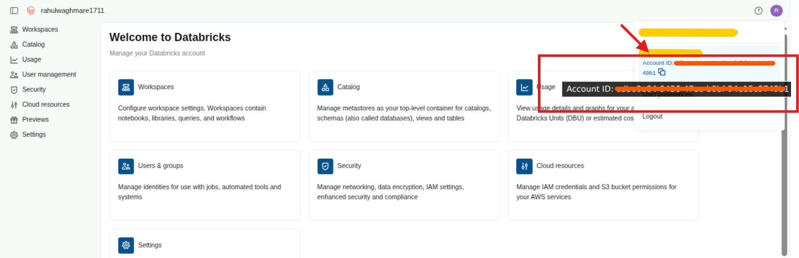

- The **Databricks account console** (`accounts.cloud.databricks.com`) is **not** the same as the workspace UI. The account console is where you provision workspaces; the workspace UI is where you write notebooks.
- The **Account ID** is what binds your cross-account IAM role's external ID to **your** Databricks account.

### Step 7: Launch Your Workspace

From the Databricks Account Console, click on 'Workspaces' in the left menu, locate your newly created workspace (`dbx-medallion-temp`), and click **Open** to launch the Databricks Workspace UI. Keep this tab open for the upcoming activities.

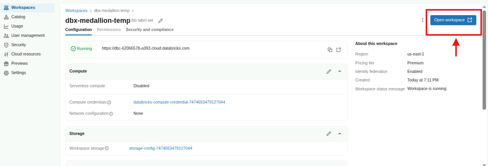

---

# Activity 1: Create the S3 Landing Structure and Upload Raw Files

**Purpose of this Activity:** To create the Amazon S3 bucket and folder structure that will act as the landing zone for the medallion pipeline. You will upload three mock raw order files into the raw landing path so Auto Loader can ingest them incrementally.

### Step 1.1: Create the S3 Bucket for the Medallion Pipeline

1. Log in to the AWS Console and verify you are in the **us-east-1 (N. Virginia)** region.
2. In the top search bar, type **S3** and open the **S3 Console**.

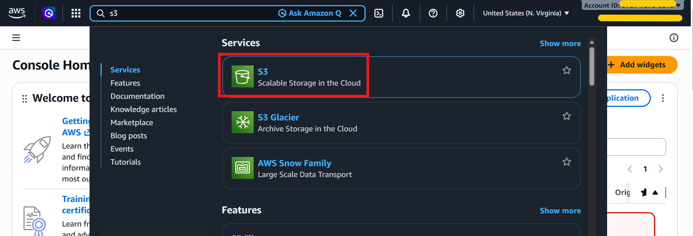

3. In the S3 Console landing page, click the orange **Create bucket** button.

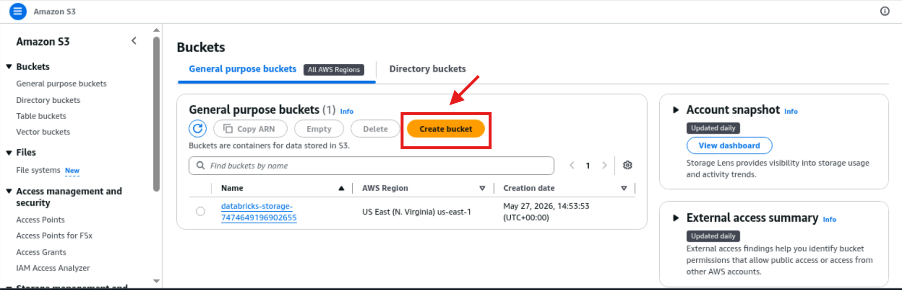

4. In the **Bucket name** field, enter a globally unique name using this pattern: `dbx-medallion-<your-initials>-<random-4-digits>`.
5. In the **AWS Region** dropdown, confirm **US East (N. Virginia) us-east-1** is selected.

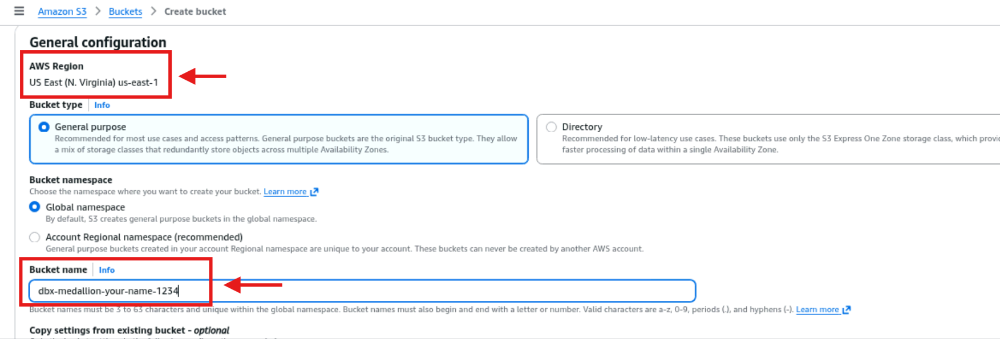

6. Under **Block Public Access settings for this bucket**, leave **Block all public access** checked.


7. Under **Bucket Versioning**, select **Enable**.

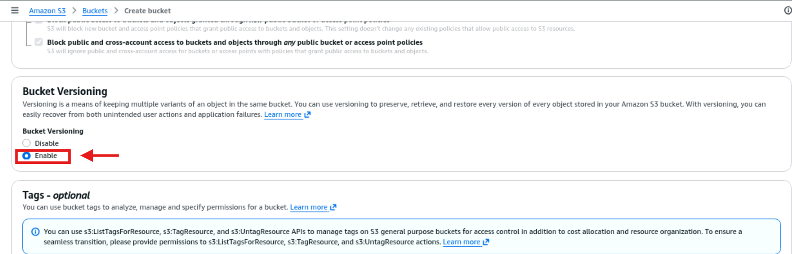

8. Scroll to the bottom of the page and click **Create bucket**.

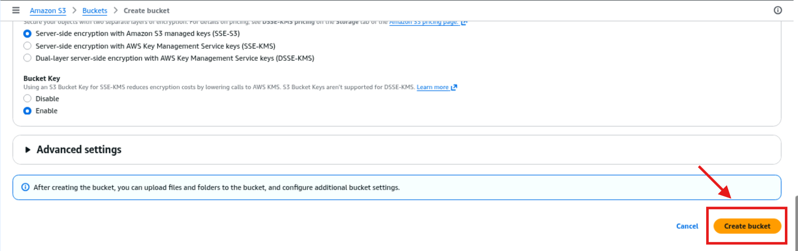

### Step 1.2: Create the Raw, Checkpoint, and Curated Folders

1. In the S3 bucket list, click the name of the bucket you just created.

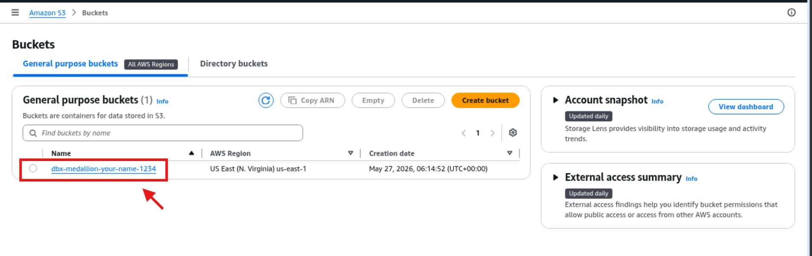

2. On the bucket **Objects** tab, click **Create folder**.

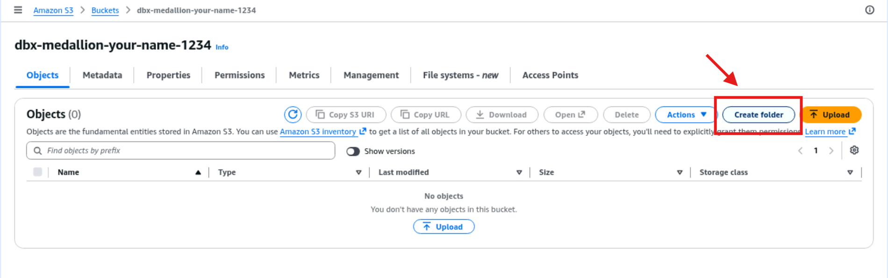

3. In the **Folder name** field, type `raw`.
4. Leave the default settings unchanged and click **Create folder**.

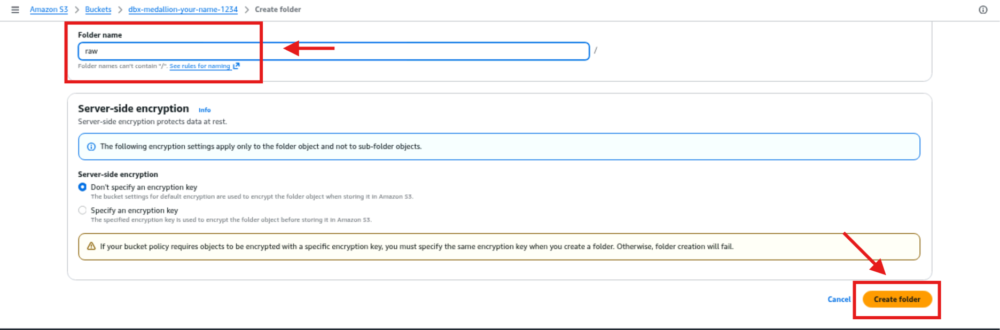

5. Repeat the same process to create a second folder named `checkpoints`.
6. Repeat the same process again to create a third folder named `curated`.

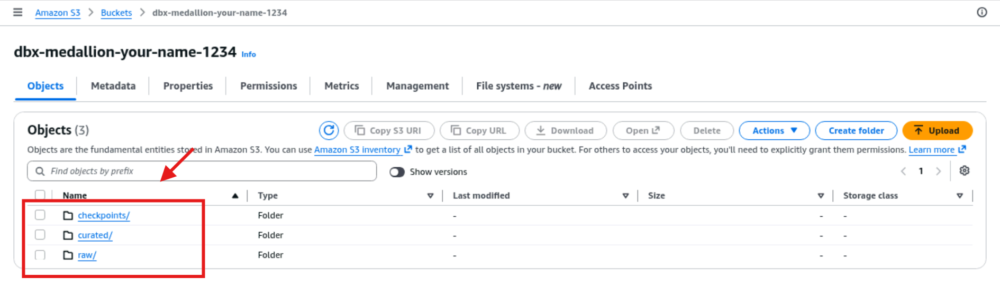

7. Click the `raw` folder name to open it.

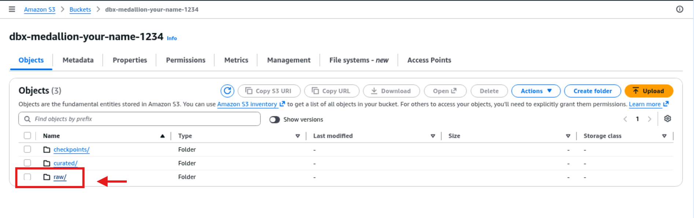

8. Inside the `raw` folder, click **Create folder** again.

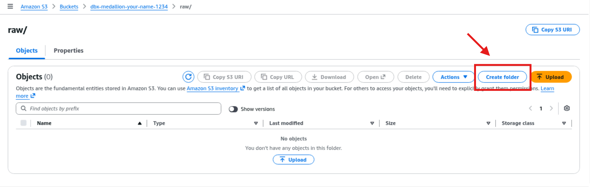

9. In the **Folder name** field, type `orders`.
10. Click **Create folder**.

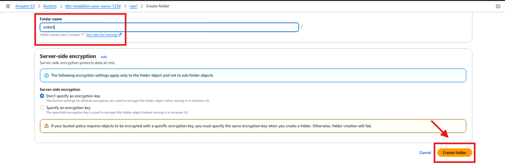

11. Go back to your bucket `dbx-medallion-<your-initials>-<random-4-digits>` and Click the `curated` folder name to open it.

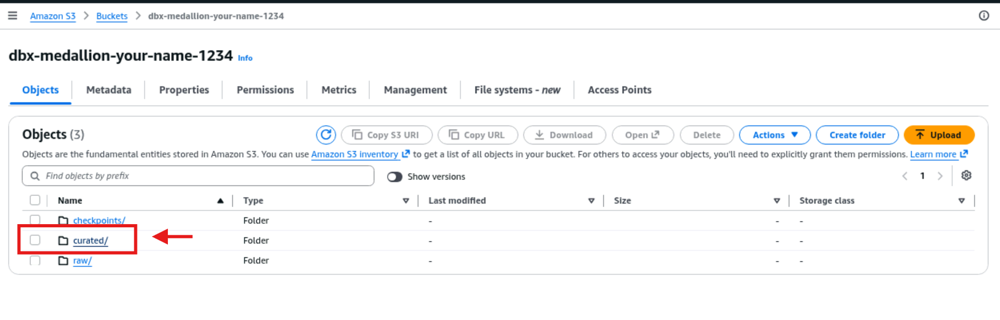

12. Inside the `curated` folder, click **Create folder**.

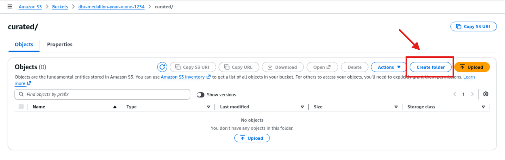

13. In the **Folder name** field, type `gold`.
14. Click **Create folder**.

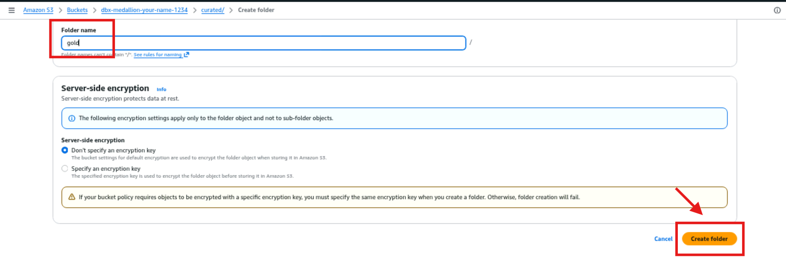

### Step 1.3: Upload the Raw Order Files

1. In the breadcrumb path at the top of the S3 page, click your bucket name, then click the `raw` folder, then click the `orders` folder so you are inside `s3://<your-bucket>/raw/orders/`.
2. Click the **Upload** button.

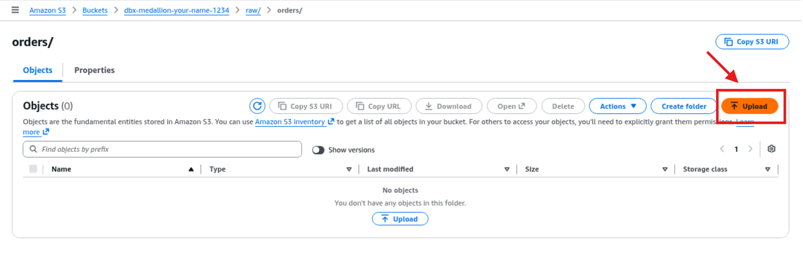

3. On the upload page, click **Add files**.

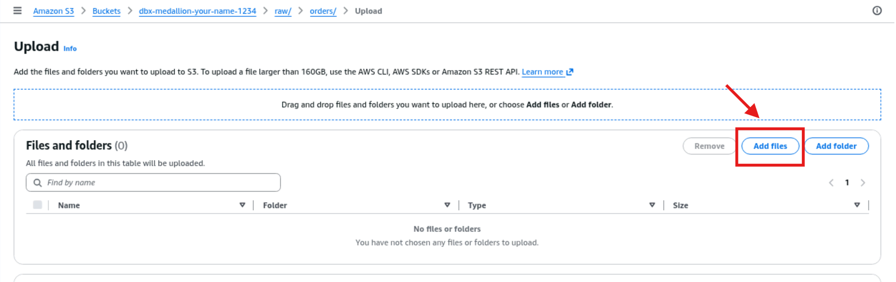

4. Browse to `~/Desktop/Project/` on your lab desktop.
5. Press `ctrl/cmd` and Select these three files:
   - `orders_batch_01.csv`
   - `orders_batch_02.csv`
   - `orders_batch_03.csv`
6. Click **Open** to attach the files.

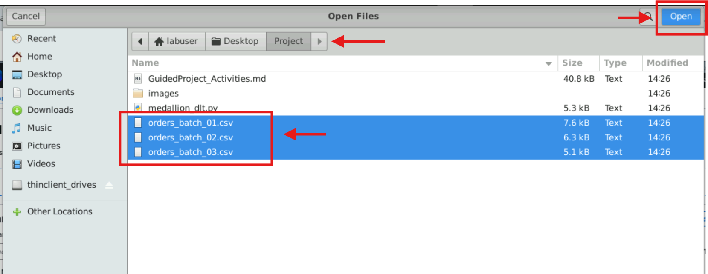

7. Scroll to the bottom of the upload page and click **Upload**.

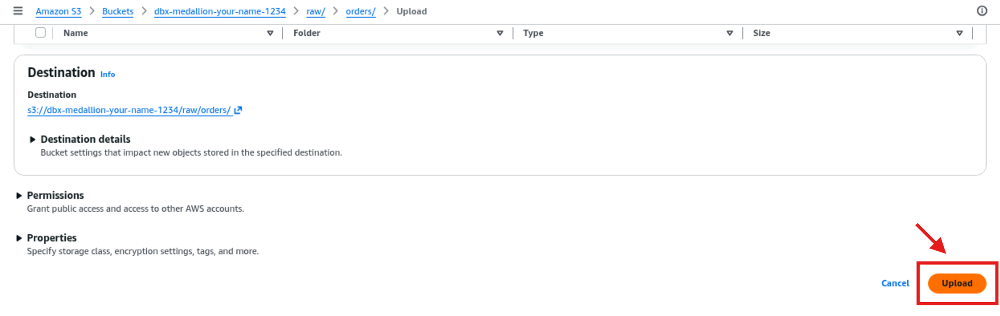

8. Wait until all three uploads show **Succeeded**.
9. Confirm the files are visible in the `raw/orders/` folder.

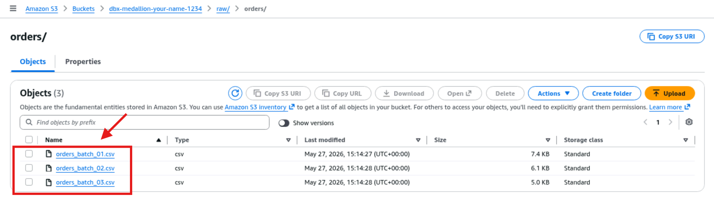

### Step 1.4: Create an IAM Role and Register it in Databricks

To allow your Databricks cluster to securely read the S3 bucket you just created, you need to create an AWS IAM Role (Instance Profile).

1. Return to your AWS Console. In the top search bar, type **IAM** and open the **IAM Console**.

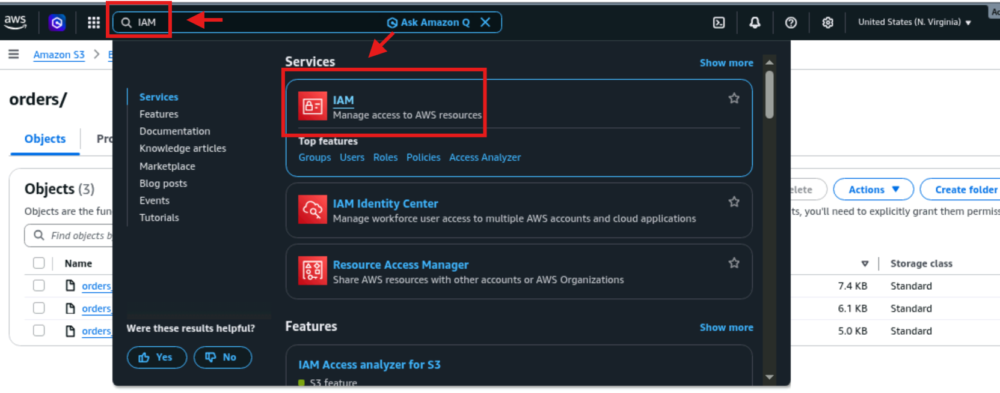

2. In the left navigation pane, click **Policies**, then click the blue **Create policy** button on the right.

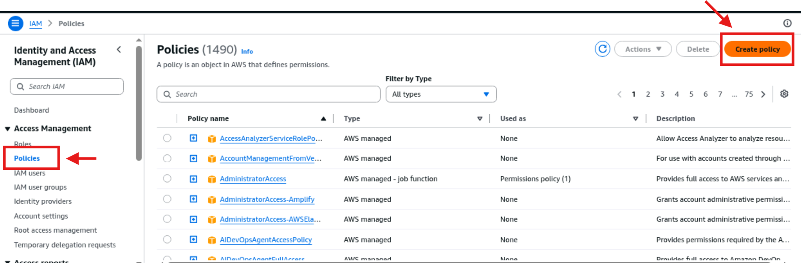

3. Switch to the **JSON** tab and replace the default text with the following JSON block.
   > **⚠️ IMPORTANT:** Replace `dbx-medallion-<your-initials>-<random-4-digits>` with your exact bucket name!

```json
{
  "Version": "2012-10-17",
  "Statement": [
    {
      "Effect": "Allow",
      "Action": ["s3:ListBucket"],
      "Resource": [
        "arn:aws:s3:::dbx-medallion-<your-initials>-<random-4-digits>"
      ]
    },
    {
      "Effect": "Allow",
      "Action": [
        "s3:PutObject",
        "s3:GetObject",
        "s3:DeleteObject",
        "s3:PutObjectAcl"
      ],
      "Resource": [
        "arn:aws:s3:::dbx-medallion-<your-initials>-<random-4-digits>/*"
      ]
    }
  ]
}
```

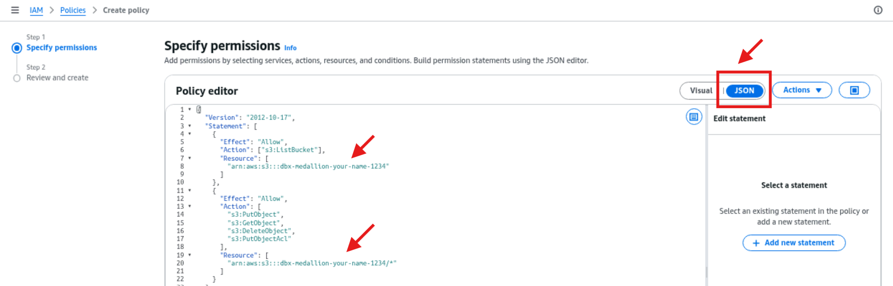

4. Click **Next**. Name the policy `MedallionS3AccessPolicy` and click **Create policy**.

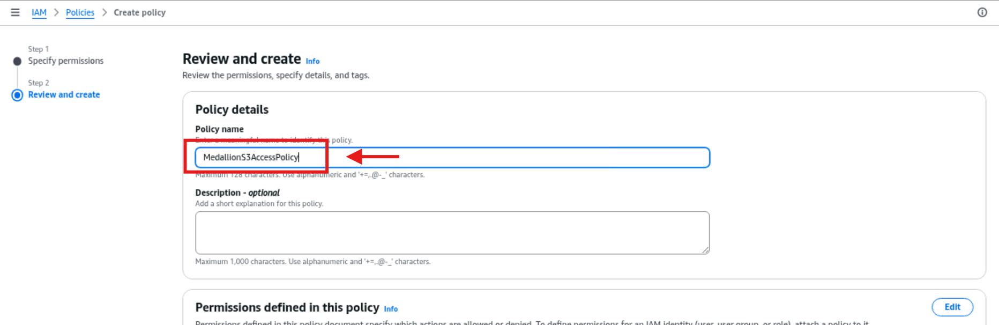

5. In the left navigation pane, click **Roles**, then click **Create role**.

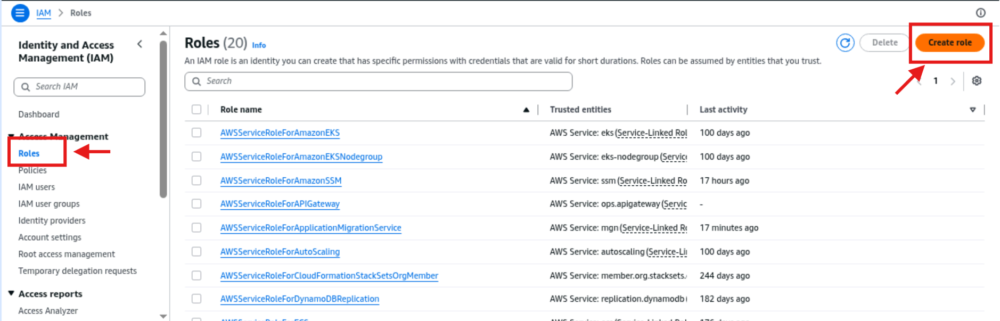

6. Select **AWS service** as the trusted entity type, and choose **EC2** from the common use cases. Click **Next**.

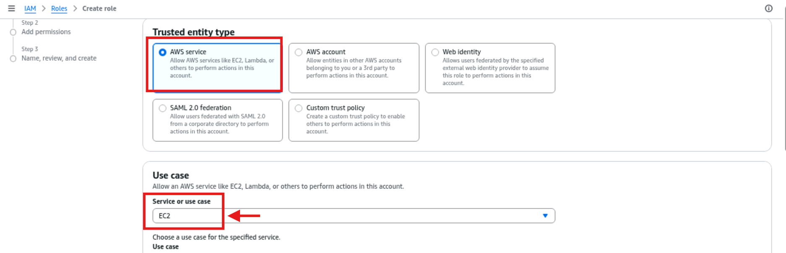

7. In the search bar, search for the `MedallionS3AccessPolicy` you just created. Check the box next to it and click **Next**.

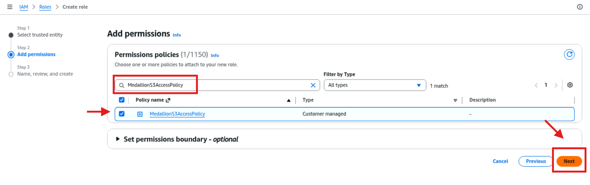

8. Name the role `DatabricksMedallionRole` and click **Create role**.

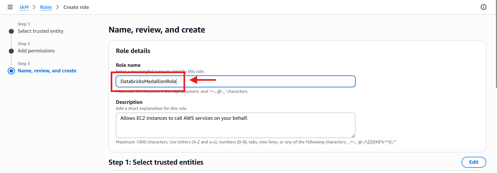

9. Once created, click on your new `DatabricksMedallionRole` in the roles list to view its details.
10. Look for the **Instance Profile ARN** (it will look similar to `arn:aws:iam::123456789012:instance-profile/DatabricksMedallionRole`). **Copy both ARN to a safe place.**

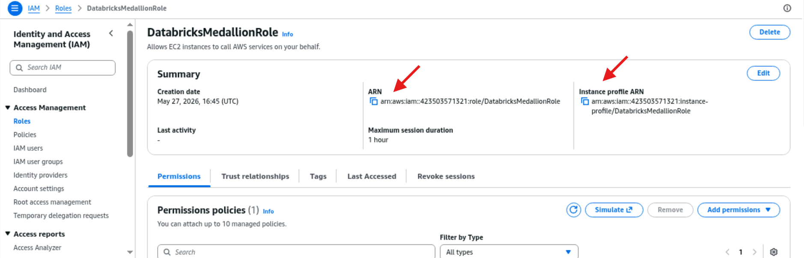

### Step 1.5: Prevent IAM Access Blockers (Grant PassRole)

_This is a critical platform engineering step to prevent `AccessDenied` / `sts:AssumeRole` errors when starting your Databricks cluster._

Databricks uses a master cross-account compute role (created during Express Setup) to manage EC2 instances. AWS requires that this master role explicitly holds `iam:PassRole` permissions to pass your new `DatabricksMedallionRole` to the cluster instances.

1. Still in the AWS IAM Console under **Roles**, search for `databricks-compute-role` (or the specific cross-account role Databricks created during setup). Click on it.

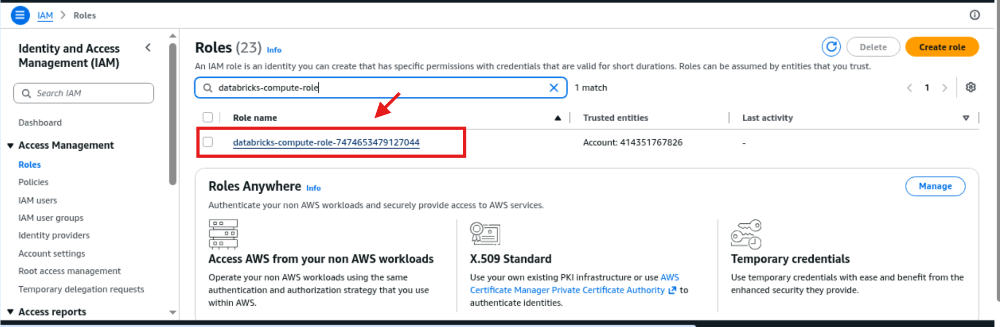

2. On the **Permissions** tab, click **Add permissions** -> **Create inline policy**.
3. Switch to the **JSON** editor and paste the following snippet.
   _(Be sure to replace `<your-aws-account-id>` with your 12-digit AWS Account ID from the top right of your console)._

```json
{
  "Version": "2012-10-17",
  "Statement": [
    {
      "Effect": "Allow",
      "Action": "iam:PassRole",
      "Resource": "arn:aws:iam::<your-aws-account-id>:role/DatabricksMedallionRole"
    }
  ]
}
```

4. Click **Next**, name the policy `PassRoleToMedallion`, and click **Create policy**.

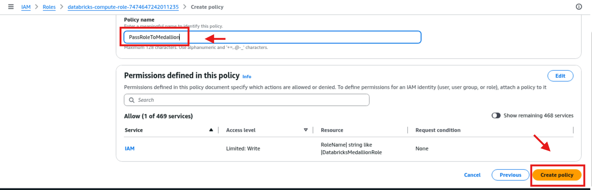

---

# Activity 2: Create a Trial-Friendly Cluster and Prepare the Workspace

**Purpose of this Activity:** To create a single free-trial-compliant Databricks cluster that will be reused for notebook development, Delta validation, DLT authoring, workflow execution, and SQL verification. In a production environment, these workloads may use separate clusters or warehouses, but in this lab you will use one cluster to stay within free-trial limits.

> 🏢 **Real-World vs Free Trial:** In production, teams often separate interactive development clusters, job clusters, and SQL warehouses. For this free-trial lab, you will create **only one all-purpose cluster** and reuse it for all activities so you stay within the hard ceiling of **2 workers** and avoid unnecessary cost.

> 💰 **Free Trial Cost Reminder:** You are using the Databricks 14-day free trial. To avoid unexpected AWS charges, always terminate clusters immediately after each activity. Use only `m4.large` (or `m5.large`) nodes with a maximum of 2 workers. Do not leave clusters running overnight.

### Step 2.1: Getting Your AWS Credentials

Before configuring the Spark settings for the cluster, you need to retrieve your AWS credentials from the Lab portal. Follow these steps:

1. Switch to your Lab browser tab.
2. On the lab page, click the **credentials icon** (🔐) on the right-hand side of the screen — it is the second blue icon on the right edge of the page.

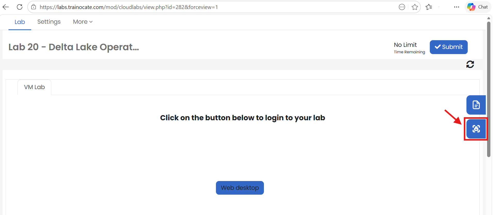

3. A **Lab Credentials** panel will open on the right side, showing:
   - **Login URL** – the AWS Console sign-in link
   - **accessId** – your AWS Access Key ID
   - **accessKey** – your AWS Secret Access Key
   - **arn** – your AWS account number


4. Copy the **accessId** value — this is your `<YOUR-ACCESS-KEY-ID>`.
5. Copy the **accessKey** value — this is your `<YOUR-SECRET-ACCESS-KEY>`.

> 💡 **Tip:** Keep this panel open so you can refer back to the credentials while filling in the Spark config and Environment variables in Databricks.

### Step 2.2: Create the All-Purpose Cluster

1. Open your Databricks workspace `dbx-medallion-temp` in a browser.

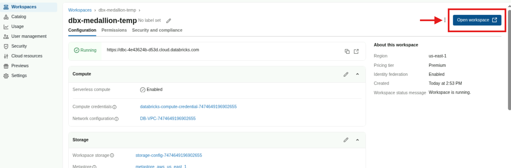

2. In the left navigation menu, click **Compute**.
3. On the Compute page, click the blue **Create compute** button.

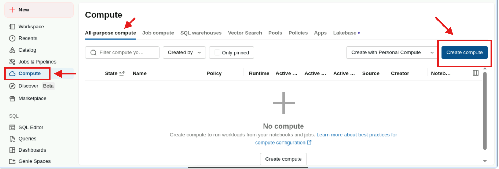

4. In the **Compute name** field, enter `dbx-medallion-cluster`.
5. In the **Databricks runtime version** dropdown, select the latest **Standard LTS** runtime available, such as **14.3 LTS**.
6. Make sure **Photon acceleration** is **not enabled**.
7. Make sure you are **not** selecting any **Machine Learning** runtime.

8. In the **Worker type** or **Node type** dropdown, select **m4.large**.
9. If **m4.large** is not available in your region, select **m5.large** instead.
10. Under **Autoscaling**, enable autoscaling and set:
    - **Min workers:** `1`
    - **Max workers:** `2`

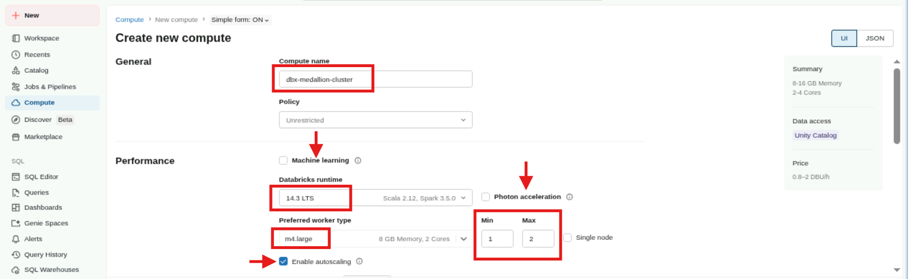

11. Under **Auto termination**, set **30 minutes**.
12. Expand the **Advanced performance** section and enable **Spot instances** if the checkbox is available.

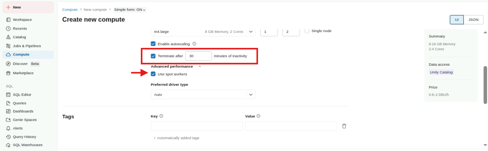

13. Scroll down and expand the **Advanced options** section.
14. Click the **Spark** tab. In the **Spark config** box, paste these 4 lines (replace with your actual AWS keys from Step 2.1):

    ```text
    spark.hadoop.fs.s3n.awsAccessKeyId <YOUR-ACCESS-KEY-ID>
    spark.hadoop.fs.s3n.awsSecretAccessKey <YOUR-SECRET-ACCESS-KEY>
    spark.hadoop.fs.s3.awsAccessKeyId <YOUR-ACCESS-KEY-ID>
    spark.hadoop.fs.s3.awsSecretAccessKey <YOUR-SECRET-ACCESS-KEY>
    ```

15. In the **Environment variables** box directly below, add:

    ```text
    AWS_ACCESS_KEY_ID=<YOUR-ACCESS-KEY-ID>
    AWS_SECRET_ACCESS_KEY=<YOUR-SECRET-ACCESS-KEY>
    ```


16. On the left side select **Instances**, under the EBS volume type select **SSD**, **Volume: 1** and **size: 32**. Scroll to the bottom of the page and click the blue **Create compute** button.

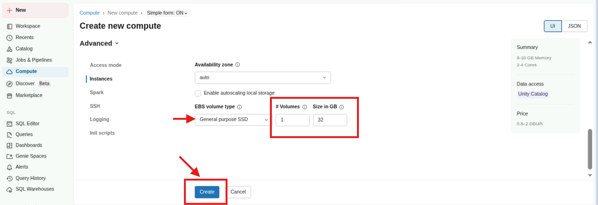

17. Wait until the cluster state changes to **Running**. (If the cluster throws an AWS Configuration Error, ensure you correctly applied the `iam:PassRole` in Step 1.5).

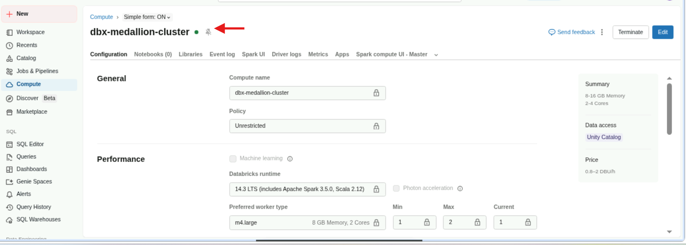

### Step 2.3: Create a Workspace Folder for the Lab

1. In the left navigation menu, click **Workspace**.
2. In the Workspace browser, click the **Users** folder.
3. Click your own user folder to open it.
4. In the upper-right area of the file browser, click **Create**.
5. From the dropdown menu, click **Folder**.

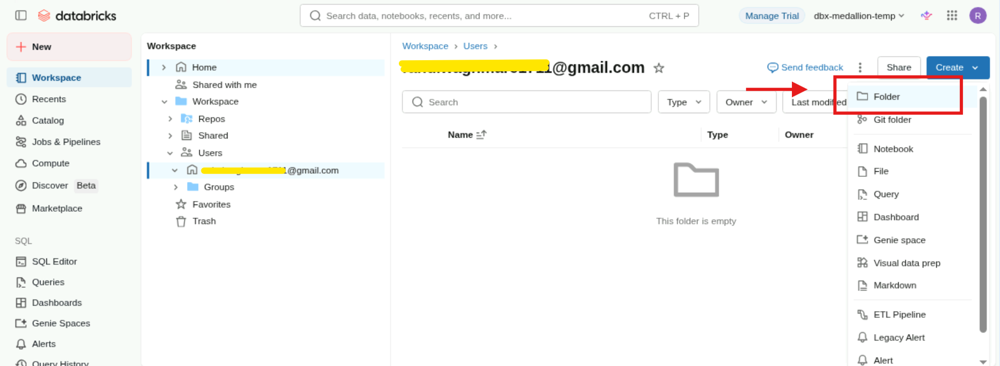

6. In the **Folder name** field, enter `medallion_lab`.
7. Click **Create**.

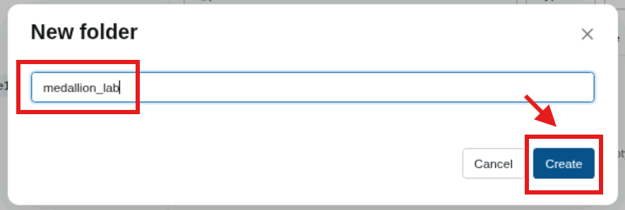

### Step 2.4: Create the Main Notebook for the Manual Pipeline

1. Stay inside your `medallion_lab` folder.
2. In the upper-right area, click **Create** again.
3. From the dropdown menu, click **Notebook**.

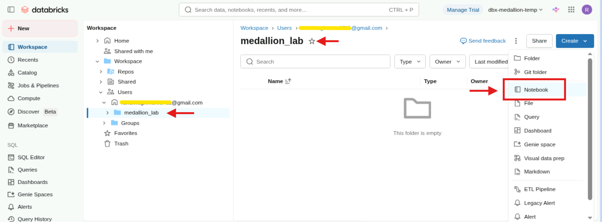

4. In the notebook top left corner replace `New Notebok XXXX` with `bronze_silver_gold_pipeline`
5. When the notebook opens, look at the top-right compute selector.
6. Attach the notebook to **dbx-medallion-cluster**.

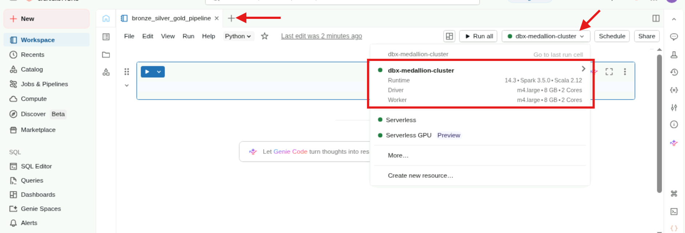

---

# Activity 3: Build the Bronze Layer with Auto Loader

**Purpose of this Activity:** To ingest raw files from S3 into a Bronze Delta table using Auto Loader. The Bronze layer should preserve raw fidelity, add ingestion metadata, and use checkpointing so the ingestion is incremental and safe to rerun.

### Step 3.1: Define Reusable Paths and Create the Bronze Database Objects

1. Open the `bronze_silver_gold_pipeline` notebook if it is not already open.
2. In the first empty cell, paste the following code.

- **Code Explanation:** This code defines the S3 paths used throughout the lab and creates a schema named `medallion_lab` in the default catalog so your tables are organized in one place.
- **Code Explanation:** It also switches the current SQL context to that schema so later table creation commands write to the correct namespace.

```python
bucket = "dbx-medallion-<your-initials>-<random-4-digits>"

raw_orders_path = f"s3://{bucket}/raw/orders/"
bronze_path = f"s3://{bucket}/curated/bronze/orders/"
silver_path = f"s3://{bucket}/curated/silver/orders/"
gold_path = f"s3://{bucket}/curated/gold/daily_sales/"
bronze_checkpoint = f"s3://{bucket}/checkpoints/bronze_orders/"
silver_checkpoint = f"s3://{bucket}/checkpoints/silver_orders/"

spark.sql("CREATE SCHEMA IF NOT EXISTS medallion_lab")
spark.sql("USE medallion_lab")
```

3. Replace `dbx-medallion-<your-initials>-<random-4-digits>` with your actual bucket name before running the cell.
4. Click the **Run cell** icon or press **Shift + Enter**.

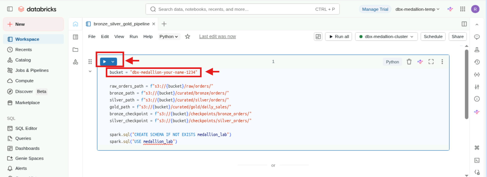

### Step 3.2: Create the Bronze Streaming DataFrame with Auto Loader

1. Create the next notebook cell by clicking the `+` button below the cell, paste the following code.

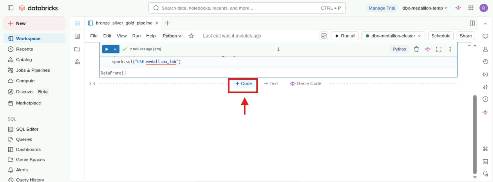

- **Code Explanation:** This code uses Auto Loader with the `cloudFiles` source to incrementally discover CSV files in the S3 raw landing path.
- **Code Explanation:** It infers the schema, captures the source file name, and appends an ingestion timestamp so the Bronze layer preserves operational metadata.

```python
from pyspark.sql.functions import current_timestamp, col

bronze_stream = (
    spark.readStream
         .format("cloudFiles")
         .option("cloudFiles.format", "csv")
         .option("cloudFiles.inferColumnTypes", "true")
         .option("cloudFiles.schemaLocation", bronze_checkpoint + "_schema")
         .option("header", "true")
         .load(raw_orders_path)
         .withColumn("source_file", col("_metadata.file_path"))
         .withColumn("ingestion_ts", current_timestamp())
)
```

2. Run the cell.

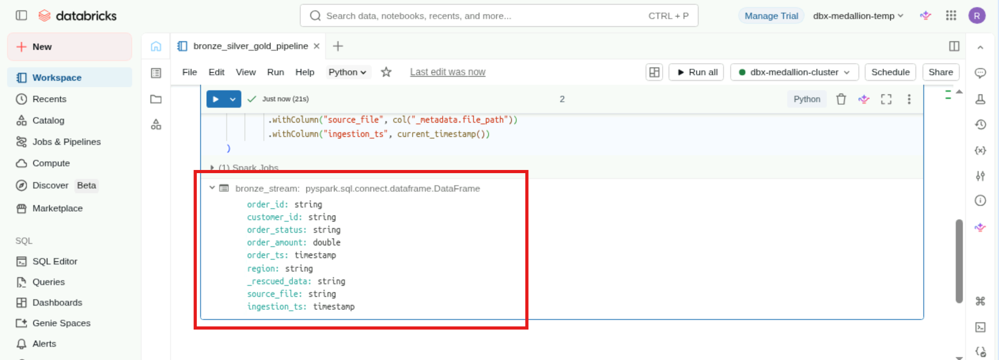

### Step 3.3: Write the Bronze Stream into a Delta Table

1. Create the next notebook cell by clicking the `+` button below the cell, paste the following code.


- **Code Explanation:** This code writes the Auto Loader stream into Delta format using a checkpoint path so ingestion is exactly-once and restart-safe.
- **Code Explanation:** It also registers the output as a managed table named `bronze_orders` for easy querying.

```python
bronze_query = (
    bronze_stream.writeStream
        .format("delta")
        .option("checkpointLocation", bronze_checkpoint)
        .trigger(availableNow=True)
        .toTable("bronze_orders")
)
```

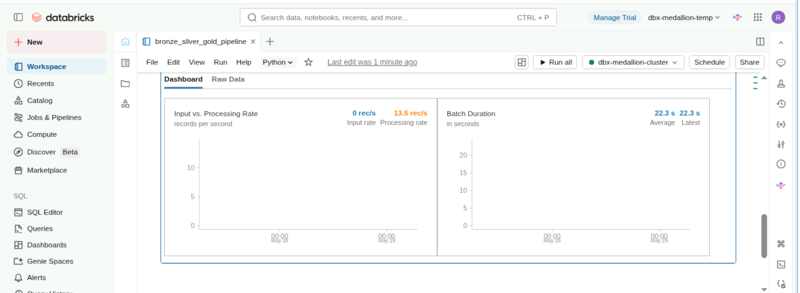

2. Run the cell and wait for the stream to finish.
3. After the cell completes, add a new cell and paste the following validation query.

- **Code Explanation:** This query confirms that the Bronze table exists and shows the raw records plus metadata columns added during ingestion.

```python
display(spark.sql("""
SELECT order_id, customer_id, order_status, order_amount, order_ts, region, source_file, ingestion_ts
FROM bronze_orders
ORDER BY order_ts
"""))
```

4. Run the validation cell.

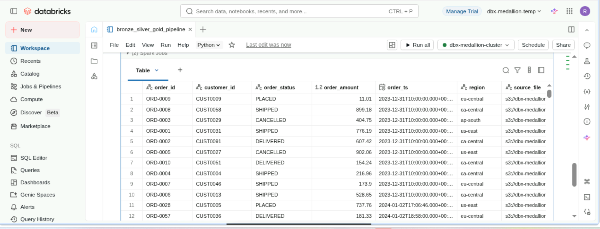

---

# Activity 4: Build the Silver Layer with Cleansing, Deduplication, and CDF

**Purpose of this Activity:** To transform the raw Bronze data into a trusted Silver table by enforcing business rules, standardizing values, removing duplicates, and enabling Change Data Feed so downstream consumers can process only changes.

### Step 4.1: Create the Silver Table with Change Data Feed Enabled

1. Create the next notebook cell by clicking the `+` button below the cell, paste the following code.


- **Code Explanation:** This SQL creates the Silver Delta table at a dedicated S3 path and enables Change Data Feed at table creation time.
- **Code Explanation:** Enabling CDF now ensures downstream incremental logic can read row-level changes later in the lab.

```python
spark.sql(f"""
CREATE TABLE IF NOT EXISTS silver_orders (
  order_id STRING,
  customer_id STRING,
  order_status STRING,
  order_amount DOUBLE,
  order_ts TIMESTAMP,
  region STRING,
  source_file STRING,
  ingestion_ts TIMESTAMP
)
USING DELTA
TBLPROPERTIES (delta.enableChangeDataFeed = true)
""")
```

2. Run the cell.

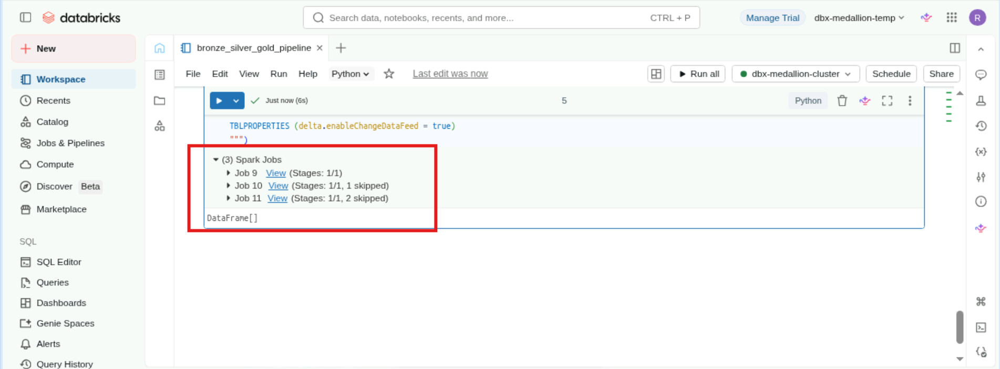

### Step 4.2: Cleanse and Deduplicate Bronze Records into Silver

1. Create the next notebook cell by clicking the `+` button below the cell, paste the following code.


- **Code Explanation:** This code filters out invalid rows, standardizes status values, converts timestamps, and uses a window function to keep only the latest record for each `order_id`.
- **Code Explanation:** The final DataFrame represents the trusted Silver layer that downstream Gold logic will consume.

```python
from pyspark.sql.functions import upper, trim, to_timestamp, row_number
from pyspark.sql.window import Window

valid_statuses = ["PLACED", "SHIPPED", "DELIVERED", "CANCELLED"]

silver_df = (
    spark.table("bronze_orders")
         .withColumn("order_status", upper(trim(col("order_status"))))
         .withColumn("order_ts", to_timestamp(col("order_ts")))
         .filter(col("order_id").isNotNull())
         .filter(col("customer_id").isNotNull())
         .filter(col("order_amount") > 0)
         .filter(col("order_status").isin(valid_statuses))
)

dedupe_window = Window.partitionBy("order_id").orderBy(col("order_ts").desc(), col("ingestion_ts").desc())

silver_deduped = (
    silver_df.withColumn("rn", row_number().over(dedupe_window))
             .filter(col("rn") == 1)
             .drop("rn")
)
```

2. Run the cell.

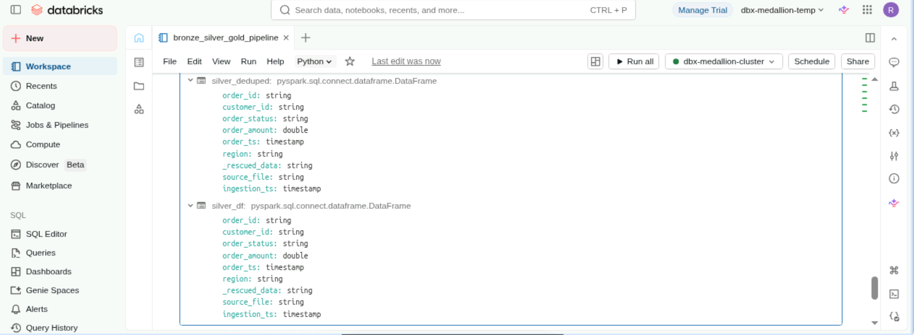

### Step 4.3: Merge the Cleansed Records into the Silver Table

1. Create the next notebook cell by clicking the `+` button below the cell, paste the following code.


- **Code Explanation:** This code performs an idempotent Delta `MERGE` so rerunning the notebook updates existing orders and inserts new ones safely.
- **Code Explanation:** Using `MERGE` is a production-grade pattern because it prevents duplicate target rows when the pipeline is rerun.

```python
silver_deduped.createOrReplaceTempView("silver_updates")

spark.sql("""
MERGE INTO silver_orders AS target
USING silver_updates AS source
ON target.order_id = source.order_id
WHEN MATCHED THEN UPDATE SET *
WHEN NOT MATCHED THEN INSERT *
""")
```

2. Run the cell.

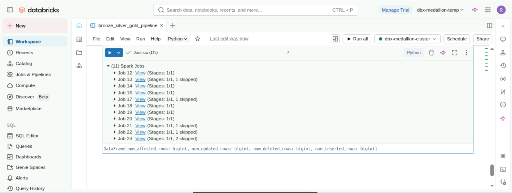

### Step 4.4: Validate Silver Quality Rules and CDF

1. Create the next notebook cell by clicking the `+` button below the cell, paste the following code.


- **Code Explanation:** These queries verify that invalid rows were removed, duplicates were eliminated, and the Silver table contains only one row per `order_id`.
- **Code Explanation:** They also inspect the table properties so you can confirm Change Data Feed is enabled.

```python
display(spark.sql("""
SELECT COUNT(*) AS invalid_rows
FROM silver_orders
WHERE order_id IS NULL
   OR customer_id IS NULL
   OR order_amount <= 0
   OR order_status NOT IN ('PLACED','SHIPPED','DELIVERED','CANCELLED')
"""))

display(spark.sql("""
SELECT order_id, COUNT(*) AS row_count
FROM silver_orders
GROUP BY order_id
HAVING COUNT(*) > 1
"""))

display(spark.sql("DESCRIBE DETAIL silver_orders"))
```

2. Run the cell.
3. Confirm that:
   - `invalid_rows` returns `0`
   - the duplicate check returns no rows
   - the table properties show `delta.enableChangeDataFeed` set to `true`

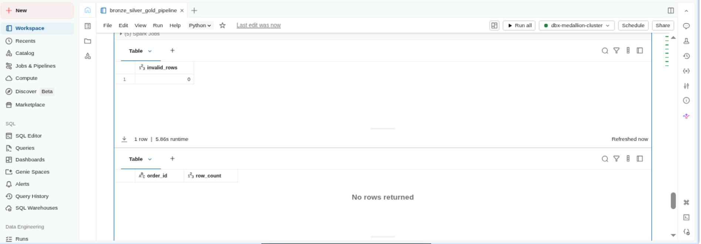
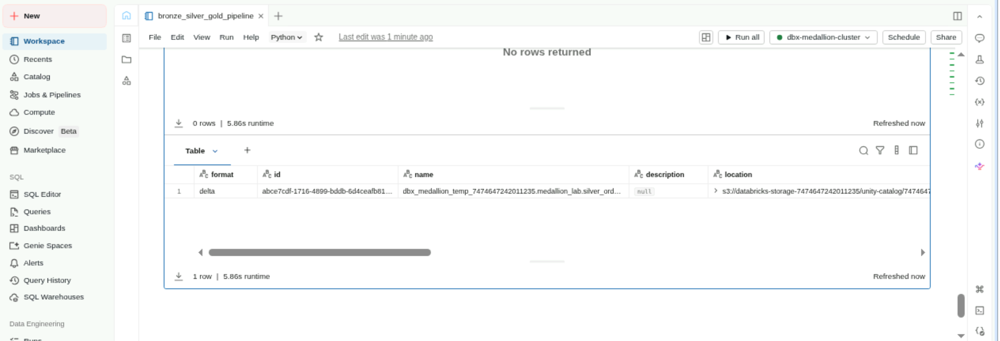

---

# Activity 5: Build the Gold Layer and Validate Delta Lake History

**Purpose of this Activity:** To create a business-ready Gold table from the Silver layer and then validate Delta Lake operational features such as history inspection and time travel.

### Step 5.1: Create the Gold Aggregate Table

1. Create the next notebook cell by clicking the `+` button below the cell, paste the following code.


- **Code Explanation:** This code derives a reporting table by grouping Silver records by business date and order status.
- **Code Explanation:** It calculates total sales, order counts, and distinct customer counts that business users can consume directly.

```python
from pyspark.sql.functions import to_date, sum as _sum, count, countDistinct

gold_df = (
    spark.table("silver_orders")
         .withColumn("order_date", to_date(col("order_ts")))
         .groupBy("order_date", "order_status")
         .agg(
             _sum("order_amount").alias("total_sales_amount"),
             count("order_id").alias("total_orders"),
             countDistinct("customer_id").alias("distinct_customers")
         )
)

gold_df.write.format("delta").mode("overwrite").saveAsTable("gold_daily_sales")
```

2. Run the cell.

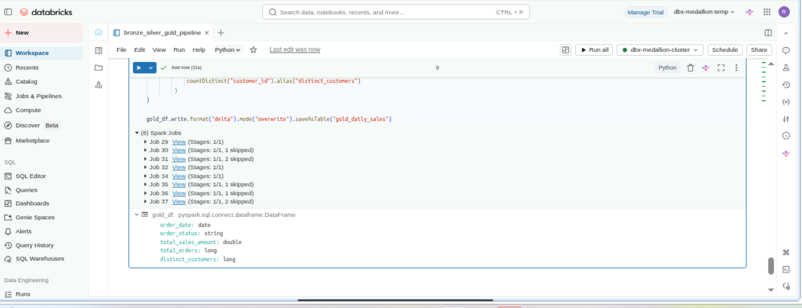

### Step 5.2: Validate Gold Output

1. Create the next notebook cell by clicking the `+` button below the cell, paste the following code.


- **Code Explanation:** This query displays the Gold metrics so you can confirm the table contains aggregated business-ready rows rather than raw transactions.

```python
display(spark.sql("""
SELECT *
FROM gold_daily_sales
ORDER BY order_date, order_status
"""))
```

2. Run the cell.

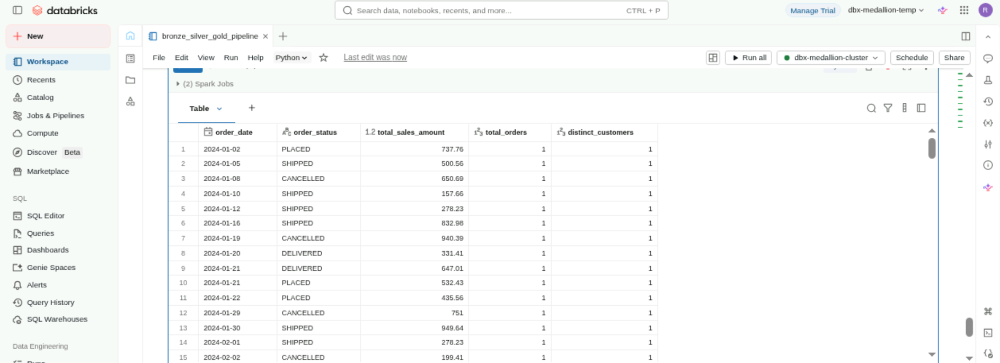

### Step 5.3: Inspect Delta History and Run a Time Travel Query

1. Create the next notebook cell by clicking the `+` button below the cell, paste the following code.


- **Code Explanation:** `DESCRIBE HISTORY` shows the transaction versions written to the Silver table.
- **Code Explanation:** The time travel query reads an earlier version of the table so you can validate Delta Lake versioned access.

```python
display(spark.sql("DESCRIBE HISTORY silver_orders"))
```

2. Run the cell and note the latest version number shown in the results.

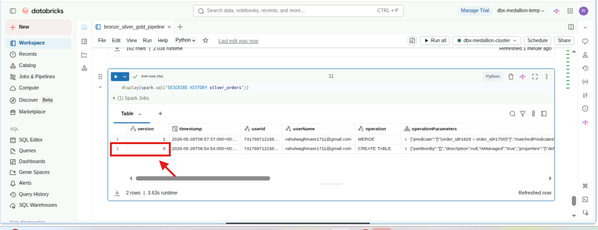

3. In a new cell, paste the following query and replace `<earlier-version-number>` with a valid older version from the history output.

- **Code Explanation:** This query reads a previous version of the Silver table, proving that Delta Lake preserves historical snapshots.

```python
display(spark.sql("""
SELECT *
FROM silver_orders VERSION AS OF <earlier-version-number>
ORDER BY order_ts
"""))
```

4. Run the cell.

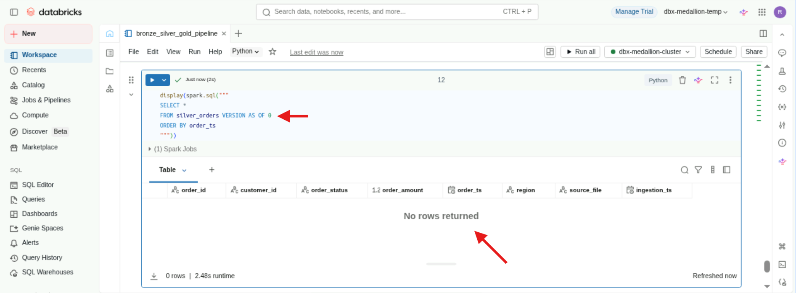

---

# Activity 6: Use Silver Change Data Feed to Drive Incremental Gold Propagation

**Purpose of this Activity:** To demonstrate how Change Data Feed can be used to identify changed Silver records and rebuild or propagate Gold metrics incrementally rather than reprocessing everything blindly.

### Step 6.1: Read Changes from the Silver Table

1. Create the next notebook cell by clicking the `+` button below the cell, paste the following code.


- **Code Explanation:** This code reads row-level changes from the Silver table using Change Data Feed starting from version `0`.
- **Code Explanation:** The output includes metadata columns such as `_change_type`, which help downstream logic understand inserts, updates, and deletes.

```python
cdf_df = (
    spark.read.format("delta")
         .option("readChangeFeed", "true")
         .option("startingVersion", 0)
         .table("silver_orders")
)

display(cdf_df.select("order_id", "order_status", "order_amount", "_change_type", "_commit_version"))
```

2. Run the cell.

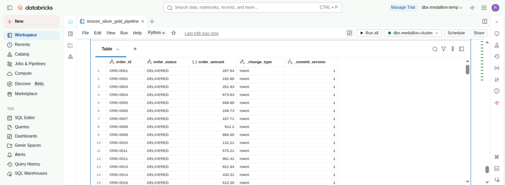

### Step 6.2: Recompute Gold from Changed Business Dates

1. Create the next notebook cell by clicking the `+` button below the cell, paste the following code.


- **Code Explanation:** This code extracts only the affected business dates from the CDF stream and recomputes Gold metrics for those dates.
- **Code Explanation:** This demonstrates the incremental propagation concept without requiring a second large cluster or a paid production setup.

```python
changed_dates = [r["order_date"] for r in (
    cdf_df.withColumn("order_date", to_date(col("order_ts")))
          .select("order_date")
          .distinct()
          .collect()
) if r["order_date"] is not None]

incremental_gold = (
    spark.table("silver_orders")
         .withColumn("order_date", to_date(col("order_ts")))
         .filter(col("order_date").isin(changed_dates))
         .groupBy("order_date", "order_status")
         .agg(
             _sum("order_amount").alias("total_sales_amount"),
             count("order_id").alias("total_orders"),
             countDistinct("customer_id").alias("distinct_customers")
         )
)

incremental_gold.createOrReplaceTempView("gold_updates")

spark.sql("""
MERGE INTO gold_daily_sales AS target
USING gold_updates AS source
ON target.order_date = source.order_date AND target.order_status = source.order_status
WHEN MATCHED THEN UPDATE SET *
WHEN NOT MATCHED THEN INSERT *
""")
```

2. Run the cell.

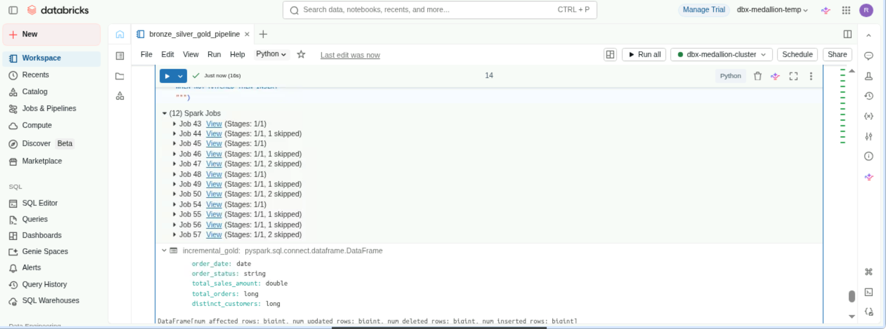

---

# Activity 7: Re-Implement the Pipeline with Delta Live Tables and Data Quality

**Purpose of this Activity:** To build a declarative version of the medallion pipeline using Delta Live Tables. You will use the provided `medallion_dlt.py` file to create Bronze, Silver, and Gold logic and add expectation rules so data quality is enforced at the Silver layer.

> ⚠️ **CRITICAL UPDATE:** Before moving to the next step, you must edit the `bucket` variable in the notebook to match your actual S3 bucket name (e.g., `bucket = "dbx-medallion-<your-initials>-<random-4-digits>"`). **Do NOT click "Run All"** — DLT notebooks cannot be run interactively; they must be executed via a Pipeline.

- Browse to ~/Desktop/Project/ on your lab desktop and open the medallion_dlt.py file in vs code.
- Rename the `dbx-medallion-<your-initials>-<random-4-digits>` with you bucket name.

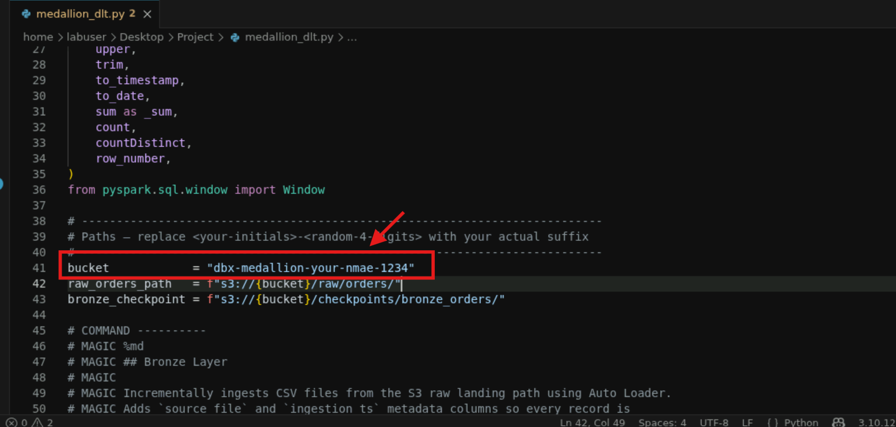

- Save the file.

### Step 7.1: Import the DLT Notebook

Instead of writing the DLT code from scratch, you will import the provided Python file directly into your workspace.

1. In the left navigation menu, click **Workspace**.
2. Click **Users** and open your user folder.
3. Open the `medallion_lab` folder you created earlier.
4. In the upper-right area, click the **kebab menu (three vertical dots)** next to the "Share" button.
5. Select **Import** from the dropdown menu.

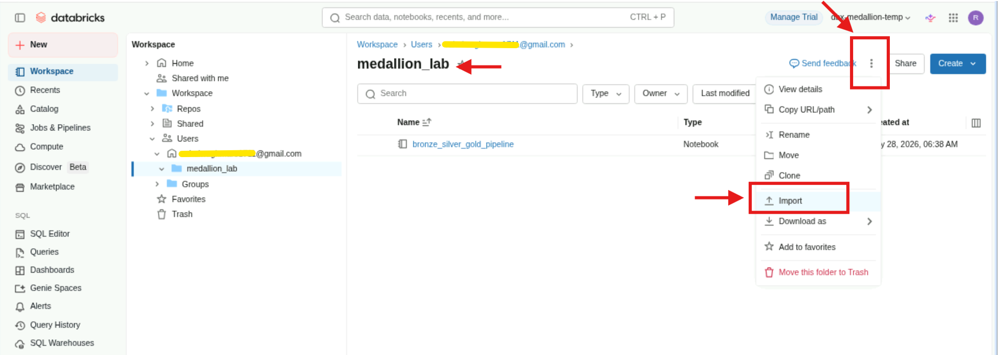

6. In the Import dialog, select **File** or **Drop file here**.
7. Browse to `~/Desktop/Project/` on your lab desktop and select the `medallion_dlt.py` file.

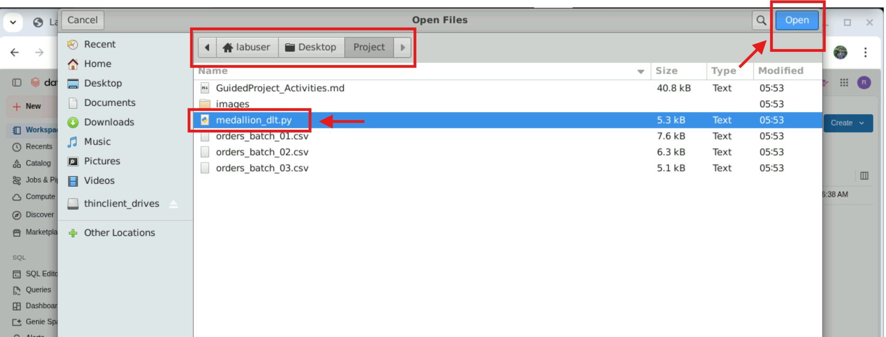

8. Click **Import**. The file will automatically open as a Databricks Notebook.

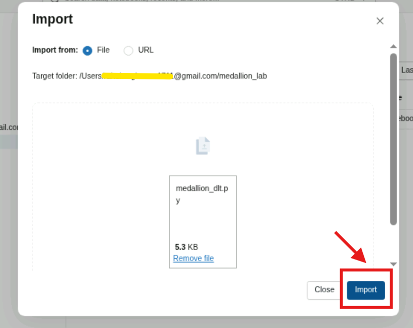

### Step 7.2: Review the Imported DLT Code

1. Review the imported `medallion_dlt` notebook. Ensure it matches the expected DLT structure.

- **Code Explanation:** This code defines Bronze, Silver, and Gold DLT tables using declarative decorators.
- **Code Explanation:** It uses expectation rules on the Silver layer to drop invalid rows before they reach trusted downstream tables.

```python
import dlt
from pyspark.sql.functions import col, current_timestamp, upper, trim, to_timestamp, to_date, sum as _sum, count, countDistinct, row_number
from pyspark.sql.window import Window

# DLT paths (must match the manual pipeline S3 bucket names)
bucket = "dbx-medallion-<your-initials>-<random-4-digits>" # UPDATE THIS IF NEEDED
raw_orders_path = f"s3://{bucket}/raw/orders/"
bronze_checkpoint = f"s3://{bucket}/checkpoints/bronze_orders/"

@dlt.table(
    name="dlt_bronze_orders",
    comment="Bronze ingestion from S3 using Auto Loader"
)
def dlt_bronze_orders():
    return (
        spark.readStream
             .format("cloudFiles")
             .option("cloudFiles.format", "csv")
             .option("cloudFiles.inferColumnTypes", "true")
             .option("cloudFiles.schemaLocation", bronze_checkpoint + "_dlt_schema")
             .option("header", "true")
             .load(raw_orders_path)
             # Note: input_file_name() is replaced with _metadata.file_path for Unity Catalog compatibility
             .withColumn("source_file", col("_metadata.file_path"))
             .withColumn("ingestion_ts", current_timestamp())
    )

@dlt.table(
    name="dlt_silver_orders",
    comment="Silver cleansed and deduplicated orders"
)
@dlt.expect_or_drop("valid_order_id", "order_id IS NOT NULL AND order_id != ''")
@dlt.expect_or_drop("valid_customer_id", "customer_id IS NOT NULL AND customer_id != ''")
@dlt.expect_or_drop("valid_amount", "order_amount > 0")
@dlt.expect_or_drop("valid_status", "upper(trim(order_status)) IN ('PLACED','SHIPPED','DELIVERED','CANCELLED')")
def dlt_silver_orders():
    df = (
        dlt.read("dlt_bronze_orders")
           .withColumn("order_status", upper(trim(col("order_status"))))
           .withColumn("order_ts", to_timestamp(col("order_ts")))
    )
    w = Window.partitionBy("order_id").orderBy(col("order_ts").desc(), col("ingestion_ts").desc())
    return (
        df.withColumn("rn", row_number().over(w))
          .filter(col("rn") == 1)
          .drop("rn")
    )

@dlt.table(
    name="dlt_gold_daily_sales",
    comment="Gold business metrics by date and status"
)
def dlt_gold_daily_sales():
    return (
        dlt.read("dlt_silver_orders")
           .withColumn("order_date", to_date(col("order_ts")))
           .groupBy("order_date", "order_status")
           .agg(
               _sum("order_amount").alias("total_sales_amount"),
               count("order_id").alias("total_orders"),
               countDistinct("customer_id").alias("distinct_customers")
           )
    )
```

2. **CRITICAL UPDATE:** Ensure the `bucket` variable in the script is updated to match your actual S3 bucket name (e.g., `dbx-medallion-your-name-1234`).
3. **DO NOT run the cell.** DLT code cannot be executed interactively. It must be run via a DLT Pipeline, which we will configure next.

### Step 7.3: Configure and Run the DLT Pipeline

1. In the left navigation menu, click **Jobs & Pipelines**.
2. Under the "Create new" section at the top of the page, click the **ETL pipeline** card (Build ETL pipelines using SQL and Python).

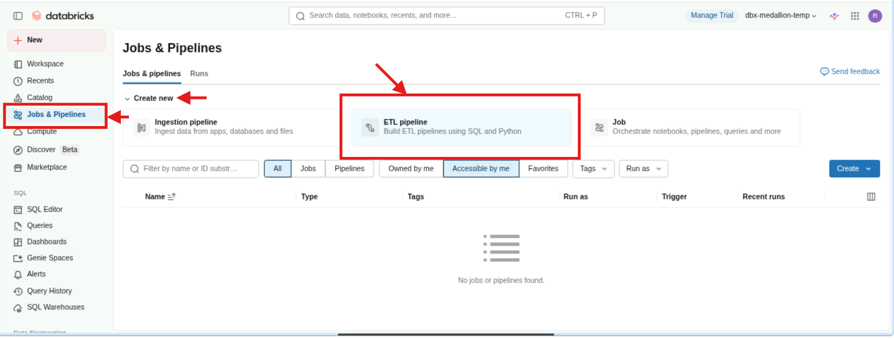

3. This will open the new **Lakeflow Pipelines Editor**. In the left-hand panel, click the **⚙️ Pipeline configuration** gear icon. This opens the pipeline settings menu on the right.

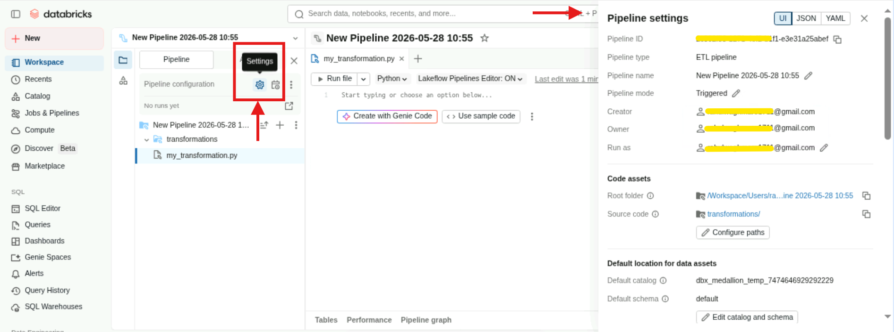

4. In the settings menu, configure the following general details:
   - **Pipeline name:** `medallion_dlt_pipeline`
   - **Pipeline mode:** Triggered

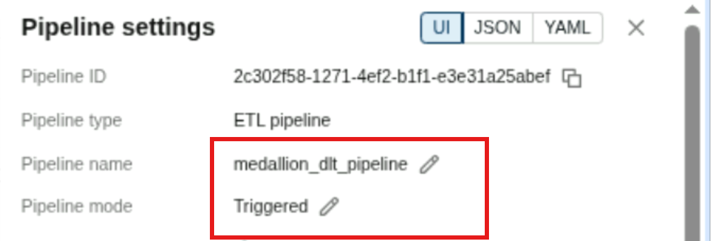

5. Under **Code assets**, click **Configure paths**. Click **Add path**, and browse to select the notebook you imported: `/Users/<your-user>/medallion_lab/medallion_dlt`, Remove the default `transformations/` path.

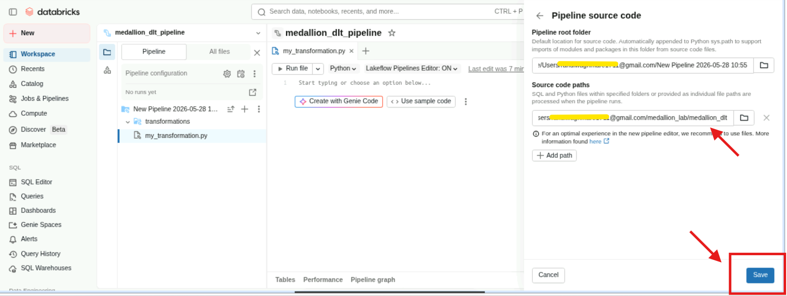

6. Under **Default location for data assets**, click **Edit catalog and schema**.

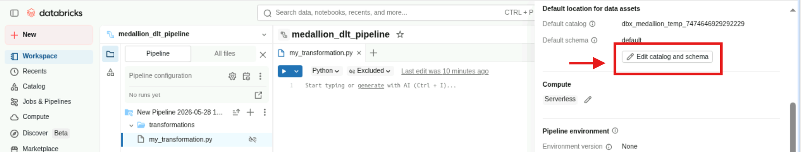

- **Default catalog:** Select `dbx_medallion_temp_XXXX` (or your workspace's default catalog)
- **Default schema:** Type `medallion_lab`

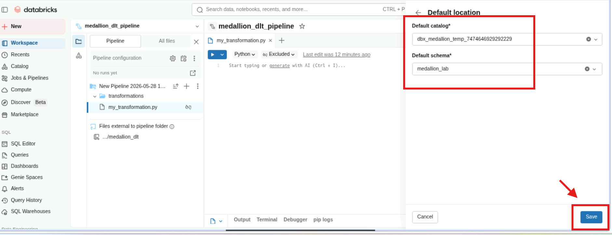

7. **Compute Configuration:**
   - Scroll down to the **Compute** section and click the **pencil (edit) icon**.
   - Uncheck the compute type Serverless.

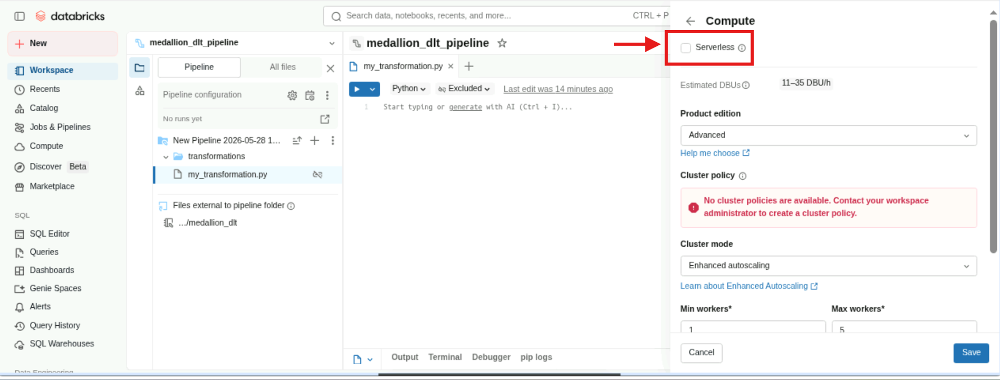

- Set **Min workers** to `1` and **Max workers** to `1` (or `2`) to stay within AWS free-trial limits.
- Under **Advanced settings > Worker type**, select `m5.large`.
- Uncheck the compute photon acceleration.
- Click **Save** on the Compute modal.

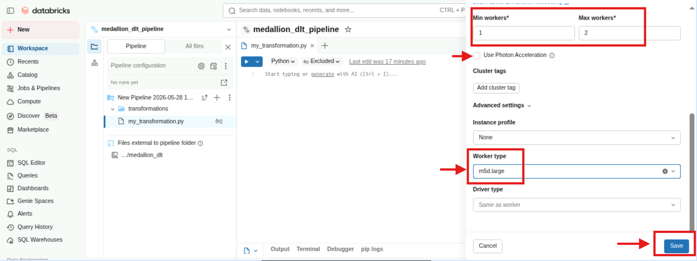

8. **CRITICAL: AWS Credentials Configuration:**
   - Still in the right-hand settings panel, scroll down to **Configuration**.

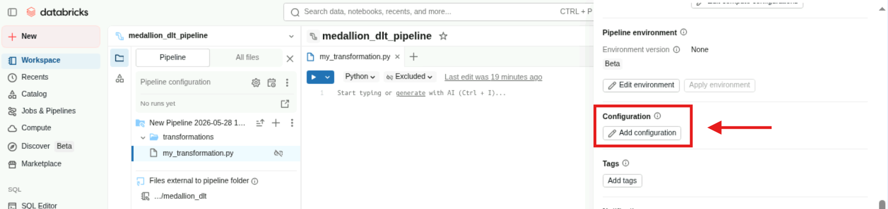

- Click **Add configuration** to add the exact same AWS Access Keys you used for your main interactive cluster. _If you skip this, the DLT pipeline will get an Access Denied error when reading your S3 bucket!_ Add these four entries:
  - Key: `spark.hadoop.fs.s3n.awsAccessKeyId` | Value: `<YOUR-ACCESS-KEY-ID>`
  - Key: `spark.hadoop.fs.s3n.awsSecretAccessKey` | Value: `<YOUR-SECRET-ACCESS-KEY>`
  - Key: `spark.hadoop.fs.s3.awsAccessKeyId` | Value: `<YOUR-ACCESS-KEY-ID>`
  - Key: `spark.hadoop.fs.s3.awsSecretAccessKey` | Value: `<YOUR-SECRET-ACCESS-KEY>`

9. Click the blue **Save** button at the bottom of the settings panel to apply all your configurations.

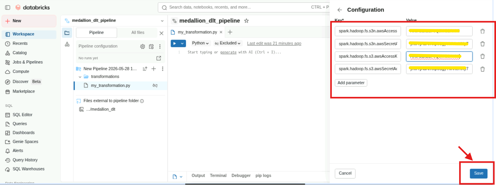

10. **Run the Pipeline:** Click the blue **Run pipeline** button in the top-right corner of the screen.

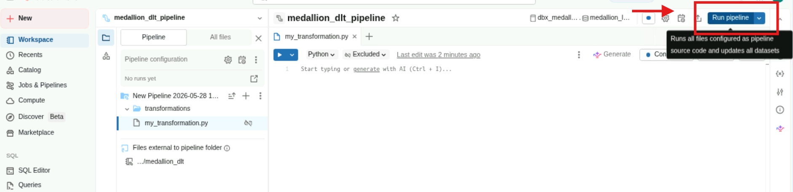

11. Wait until the Bronze, Silver, and Gold nodes show successful completion (green checkmarks) in the pipeline graph at the bottom of the screen.

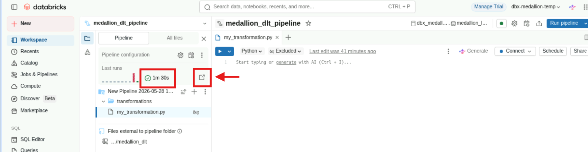
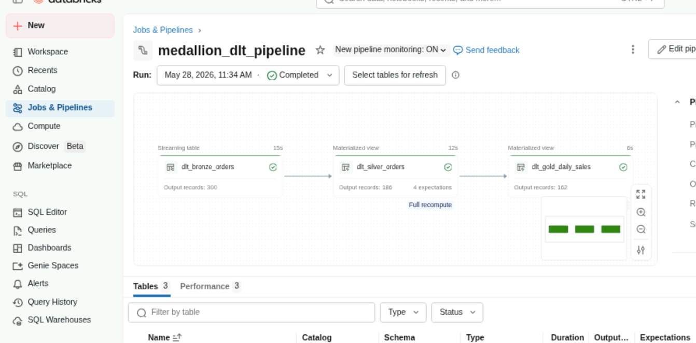

---

# Activity 8: Create Unity Catalog Objects and Query Governed Tables

**Purpose of this Activity:** To organize medallion assets using a governed three-level namespace and validate that tables can be queried using catalog, schema, and table naming conventions.

### Step 8.1: Validate the Schema in Unity Catalog

1. Return to your original `bronze_silver_gold_pipeline` notebook (not the DLT one).
2. The schema `medallion_lab` was already created in Activity 3. Let's verify it exists in the main catalog.
3. In a new cell, paste the following SQL.

- **Code Explanation:** Using a three-level namespace is a core governance pattern in Databricks.

```python
spark.sql("CREATE SCHEMA IF NOT EXISTS medallion_lab")
```

4. Run the cell.

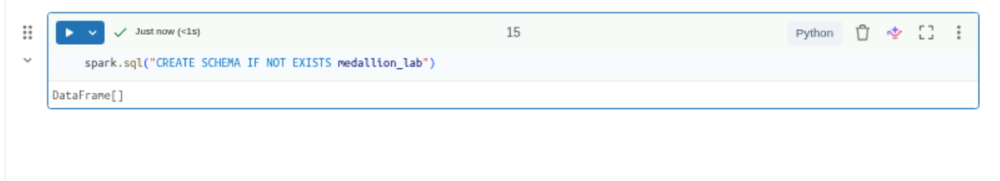

### Step 8.2: Create Governed Copies of the Silver and Gold Tables

1. Create the next notebook cell by clicking the `+` button below the cell, paste the following code.


- **Code Explanation:** These commands create governed tables in Unity Catalog by copying data from the working Silver and Gold tables.
- **Code Explanation:** This gives you queryable governed assets without changing the earlier pipeline logic.

```python
# Note: Unity Catalog does not support 'CREATE TABLE ... AS SELECT' with custom locations,
# but since our manual pipeline used managed tables, this works perfectly.
spark.sql("CREATE OR REPLACE TABLE medallion_lab.silver_orders_uc AS SELECT * FROM medallion_lab.silver_orders")
spark.sql("CREATE OR REPLACE TABLE medallion_lab.gold_daily_sales_uc AS SELECT * FROM medallion_lab.gold_daily_sales")
```

2. Run the cell.

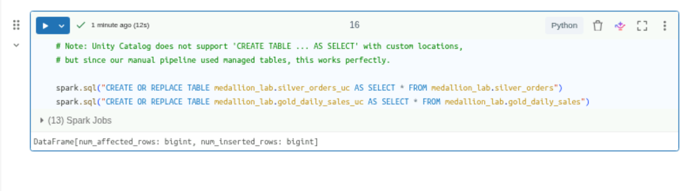

### Step 8.3: Validate the Three-Level Namespace

1. Create the next notebook cell by clicking the `+` button below the cell, paste the following code.


- **Code Explanation:** These commands list schemas and tables so you can confirm the governed namespace exists and contains the expected assets.

```python
display(spark.sql("SHOW SCHEMAS"))
display(spark.sql("SHOW TABLES IN medallion_lab"))
display(spark.sql("SELECT * FROM medallion_lab.gold_daily_sales_uc ORDER BY order_date, order_status"))
```

2. Run the cell.

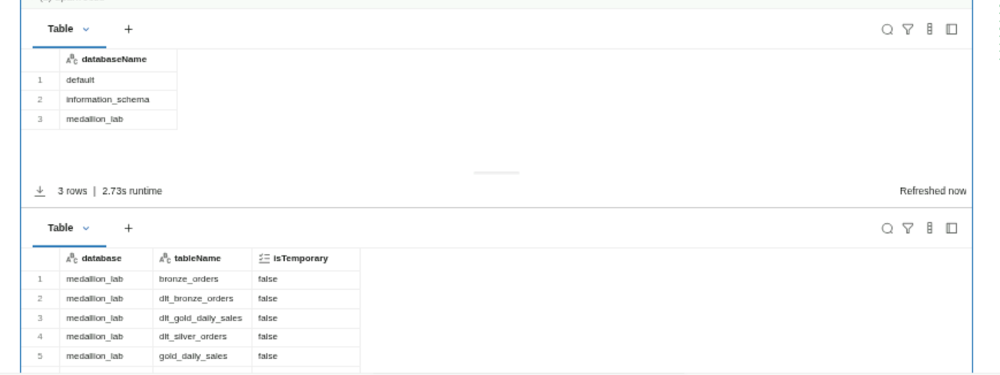
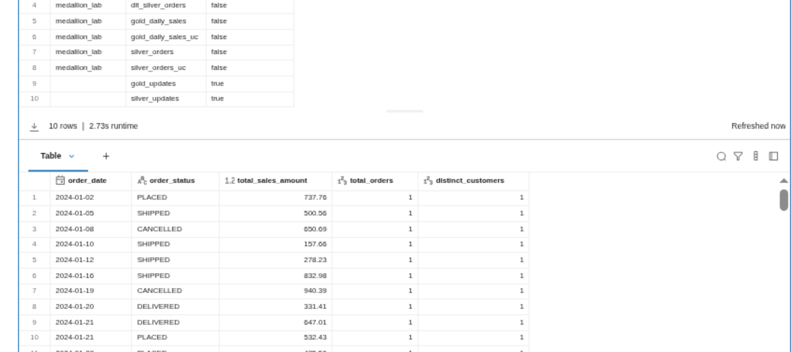

---

# Activity 9: Orchestrate the Pipeline with Databricks Workflows and Validate SQL Analytics

**Purpose of this Activity:** To operationalize the medallion pipeline by creating a Databricks Workflow with dependent tasks and then validating business reporting queries against the Gold layer.

### Step 9.1: Create Parameterized Validation Notebooks

1. In the left navigation menu, click **Workspace**.
2. Open **Users** → your user folder → `medallion_lab`.
3. Click **Create** and then click **Notebook**.

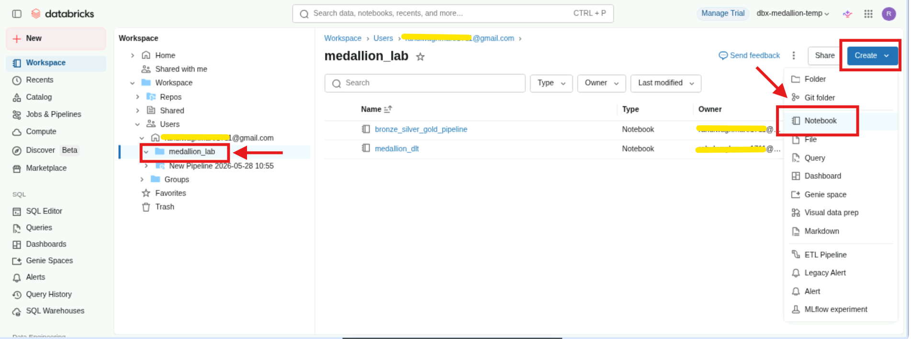

4. Create a notebook named `validate_gold_sql` with **SQL** as the default language.

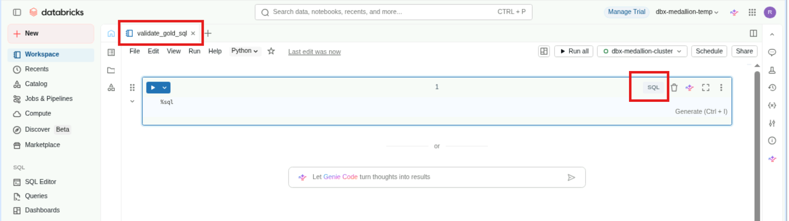

5. In the SQL notebook, paste the following query.

- **Code Explanation:** This SQL returns KPI-style Gold metrics that business users window consume in dashboards or scheduled reports.

```sql
SELECT
  order_date,
  order_status,
  total_sales_amount,
  total_orders,
  distinct_customers
FROM medallion_lab.gold_daily_sales
ORDER BY order_date, order_status;
```

6. Click **Save** if prompted.

### Step 9.2: Create the Workflow Job

1. In the left navigation menu, click **Jobs & Pipelines** (or **Workflows**).
2. On the Jobs page, click **Create** -> **Job**.

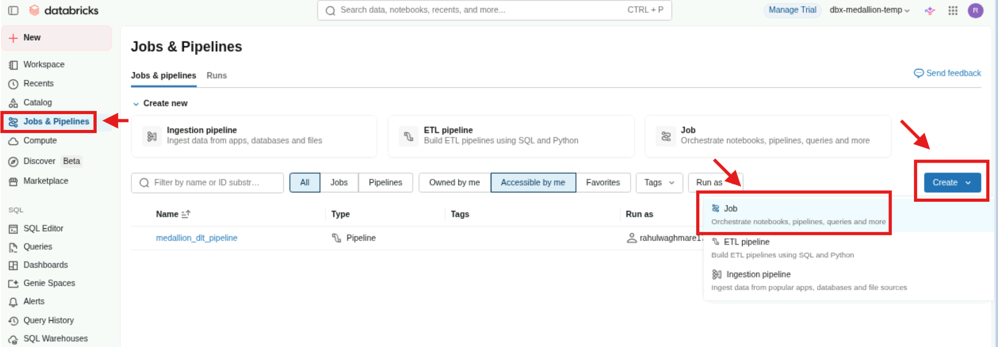

3. At the top-left of the job page, click the default job name and rename it to `medallion-orchestration-job`.
4. In the center of the page, click **Add task**.
5. Choose **Notebook** as the task type.

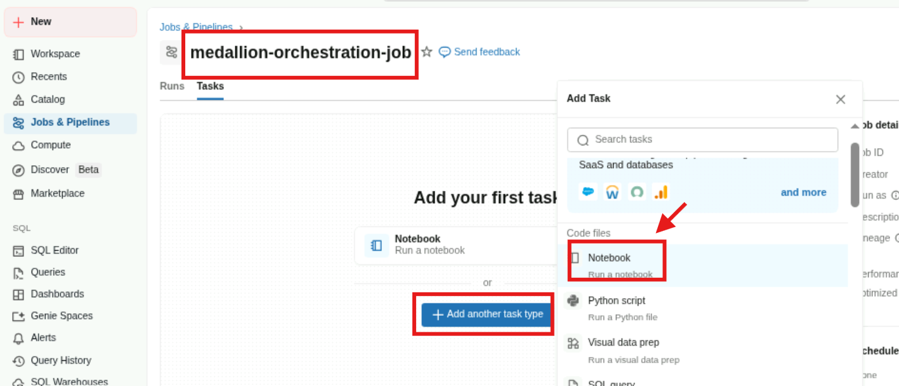

6. Configure the first task:
   - **Task name:** `run_manual_pipeline`
   - **Source:** Workspace
   - **Path:** `/Users/<your-user>/medallion_lab/bronze_silver_gold_pipeline`
   - **Compute:** Existing all-purpose cluster
   - **Cluster:** `dbx-medallion-cluster`
7. Click **Create task**.

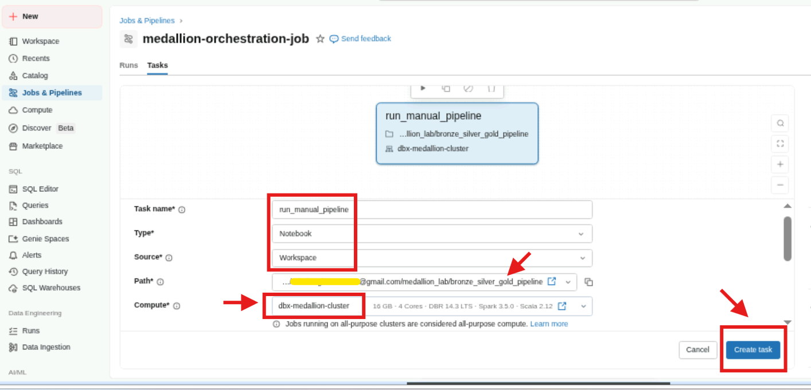

8. Click **Add task** again.
9. Choose **Notebook** as the task type.
10. Configure the second task:

- **Task name:** `run_gold_validation`
- **Source:** Workspace

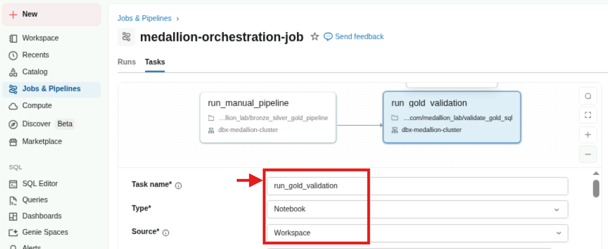

- **Path:** `/Users/<your-user>/medallion_lab/validate_gold_sql`
- **Depends on:** `run_manual_pipeline`
- **Compute:** Existing all-purpose cluster
- **Cluster:** `dbx-medallion-cluster`

11. Click **Create task**.

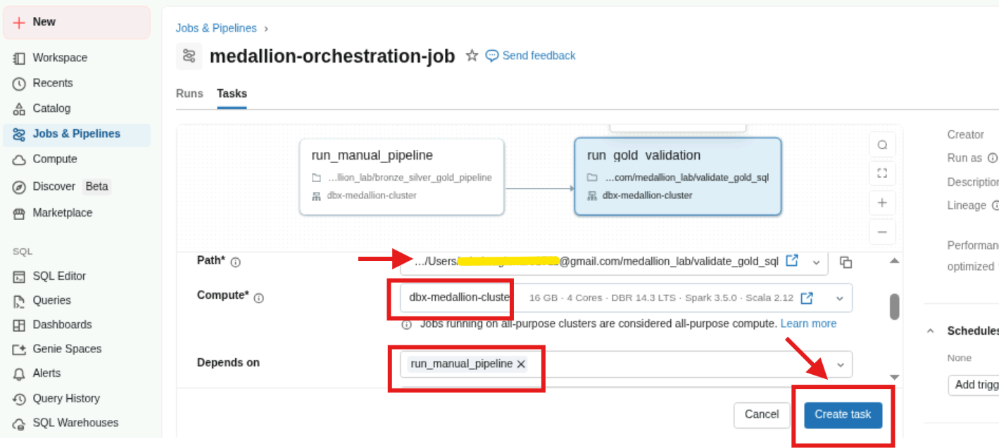

12. In the upper-right corner, click **Run now**.

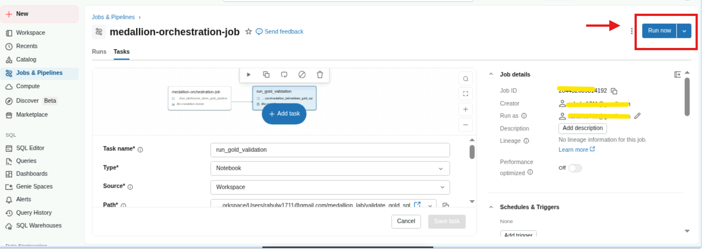

13. Click the **Runs** tab and wait until both tasks show **Succeeded**.

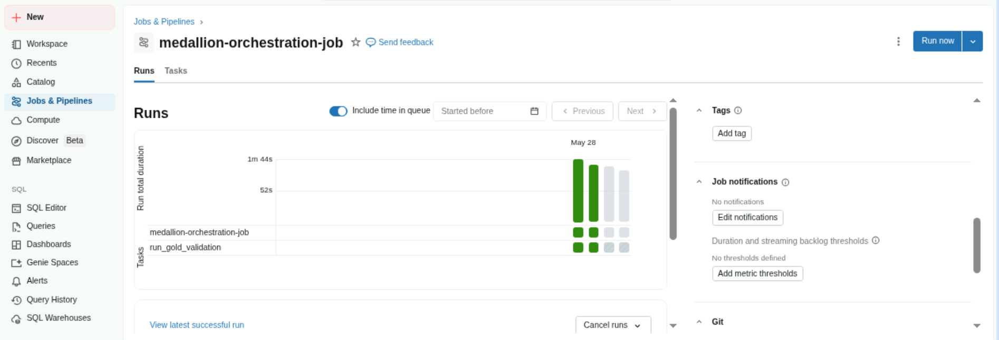

### Step 9.3: Validate SQL Analytics Output

1. Open the `validate_gold_sql` notebook from the Workspace browser.
2. Attach it to **dbx-medallion-cluster** if it is not already attached.
3. Click **Run all**.
4. Confirm that the query returns aggregated rows from `gold_daily_sales`.
5. Review the columns:
   - `order_date`
   - `order_status`
   - `total_sales_amount`
   - `total_orders`
   - `distinct_customers`

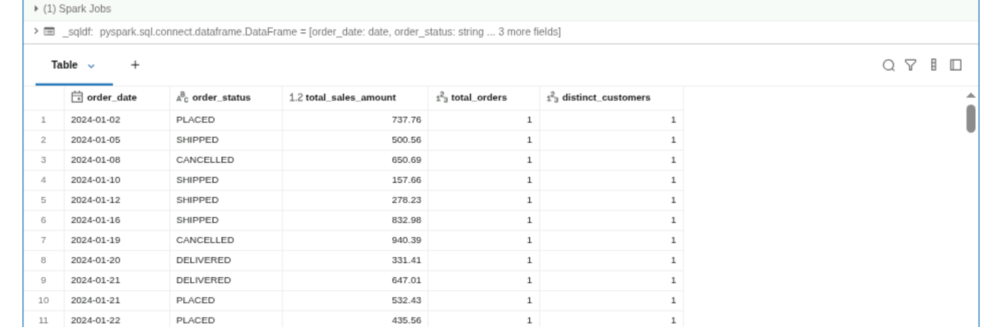

---

## 🎓 Conclusion

This guided project demonstrated how to build a trial-friendly Medallion Architecture pipeline on Databricks using AWS storage and Delta Lake. You created the raw landing structure in S3, ingested files with Auto Loader, transformed them through Bronze, Silver, and Gold layers, and validated the results using Delta Lake operational features, DLT, Unity Catalog, Workflows, and SQL.

You practiced real-world data engineering patterns, including:

- Creating an **S3 landing zone** with separate raw, checkpoint, and curated paths for medallion processing.
- Building a **trial-compliant all-purpose cluster** with **autoscaling 1–2, spot enabled, 30-min auto-termination**, and the latest **LTS Standard runtime**.
- Using **Auto Loader** to ingest raw files incrementally into a **Bronze Delta table** with ingestion metadata and checkpointing.
- Applying **Silver-layer cleansing and deduplication** rules and enabling **Change Data Feed** for downstream incremental processing.
- Building a **Gold aggregate table** with business-ready metrics for reporting.
- Validating **Delta Lake history and time travel** on a production-style Delta table.
- Re-implementing the pipeline as a **Delta Live Tables** flow with **data quality expectations**.
- Creating governed assets with **Unity Catalog** using the **catalog.schema.table** naming pattern.
- Operationalizing the solution with **Databricks Workflows** and validating reporting output through **Databricks SQL**.
