# Title: Delta Live Tables Pipeline with Data Quality

---

## 🌟 Overview: What is the purpose of this Lab?

Welcome to your Delta Live Tables (DLT) lab! Delta Live Tables is Databricks' declarative framework for building reliable, maintainable, and testable data pipelines. Instead of writing imperative Spark code to orchestrate each transformation step, you declare *what* the output should look like and let Databricks handle *how* to compute it — including retries, ordering, checkpointing, and lineage tracking.

**The Purpose of this Lab:**
You are part of a data engineering team responsible for building a reliable, declarative ETL pipeline that enforces data quality standards without manual monitoring. Your task is to build a Delta Live Tables (DLT) pipeline that defines transformations as code, automatically tracks data lineage, and enforces data quality expectations using **Warn**, **Drop**, and **Fail** modes. This ensures downstream consumers always receive clean, trustworthy data.

By the end of this project, you will have:

- Set up a **Databricks account on AWS** and captured your Account ID.
- Created an **S3 bucket** and uploaded raw source data files.
- Configured **IAM policies and roles** to grant Databricks cluster access to S3.
- Created an **all-purpose cluster** with the correct runtime and Spark credentials config.
- Created the **`dlt_lab` workspace folder** and imported all 3 pipeline notebooks.
- Written a **Bronze DLT table** that ingests raw CSV data using Auto Loader.
- Written a **Silver DLT table** with `@dlt.expect` data quality rules in Warn, Drop, and Fail modes.
- Written a **Gold DLT table** that aggregates clean Silver data for business consumption.
- Launched the DLT pipeline in **Triggered mode** and monitored it through the pipeline graph UI.
- Inspected **data quality metrics** — rows passed, warned, and dropped per expectation rule.
- Confirmed **automatic data lineage** tracking across all three layers in the pipeline graph.
- Verified final table contents by querying all 3 tables via **Databricks SQL Editor**.

### Learning Path:

1. **AWS & Databricks Setup:** Log in to AWS Console, create or sign in to your Databricks account, and capture Account ID.
2. **S3 & IAM Setup:** Create the S3 bucket, upload CSVs, create IAM policy and role for cluster S3 access.
3. **Cluster Setup:** Create an all-purpose cluster with the correct runtime, Spark config, and AWS credentials.
4. **Workspace Setup:** Create the `dlt_lab` folder and import all 3 pipeline notebooks.
5. **Bronze Layer:** Review the Auto Loader ingestion DLT table — raw, full-fidelity ingestion.
6. **Silver Layer:** Review the cleansing DLT table with `@dlt.expect`, `@dlt.expect_or_drop`, and `@dlt.expect_or_fail` rules.
7. **Gold Layer:** Review the aggregation DLT table for business-ready output.
8. **Pipeline Execution:** Configure and launch the DLT pipeline. Walk through the graph and DQ metrics.
9. **Lineage Validation:** Confirm lineage is captured end-to-end across Bronze → Silver → Gold.
10. **Table Verification:** Query all 3 tables via SQL Editor to confirm row counts and data correctness.

---

## Difficulty Level

Proficient

---

## 📊 Dataset / Knowledge Source Used

The following files are provided in the `~/Desktop/Project/` folder on your lab desktop.

**Local File Structure:**

```text
~/Desktop/Project/
├── orders_raw.csv
├── orders_bad.csv
└── dlt_lab/
    ├── 01_bronze_ingestion.py
    ├── 02_silver_quality.py
    ├── 03_gold_aggregation.py
    └── README.md
```

| File | Destination | Description |
|---|---|---|
| `orders_raw.csv` | `s3://<your-bucket>/raw/orders/orders_raw.csv` | 20-row orders dataset (`order_id, customer_id, product, quantity, unit_price, order_date, status`) — all valid records |
| `orders_bad.csv` | `s3://<your-bucket>/raw/orders/orders_bad.csv` | 8-row file containing intentionally bad records — nulls, negative quantities, invalid statuses — used to trigger DQ expectations |
| `01_bronze_ingestion.py` | Databricks Workspace → `dlt_lab/01_bronze_ingestion` | Defines the Bronze DLT table using Auto Loader to ingest raw CSV files from S3 |
| `02_silver_quality.py` | Databricks Workspace → `dlt_lab/02_silver_quality` | Defines the Silver DLT table with `@dlt.expect`, `@dlt.expect_or_drop`, and `@dlt.expect_or_fail` data quality rules |
| `03_gold_aggregation.py` | Databricks Workspace → `dlt_lab/03_gold_aggregation` | Defines the Gold DLT table — revenue aggregated by product and status |

---

## 🛠️ Prerequisites & AWS Setup

Ensure the following are available before starting:

- An **AWS account** with permissions for S3 and IAM (lab credentials provided).
- A **Databricks account on AWS** (Premium tier — 14-day trial is sufficient).
- Local project files at `~/Desktop/Project/`.
- All AWS resources must be in **US-EAST-1 (N. Virginia)**.

---

## Configure AWS Credentials

- Click the `Lab Access` icon on the desktop.


- Click `Access Lab` and log in to the AWS Console using the given credentials.


- Confirm the region is **US-EAST-1 (N. Virginia)** using the region selector at the top right.


---

## Set Up (or Sign In to) Your Databricks Account

**Purpose of this Activity:** To make sure you have an active Databricks-on-AWS account before any infrastructure work begins. If you already have an account, you'll log in and capture your Databricks Account ID. If not, you'll complete the Express Setup that creates a trial workspace and links it to AWS.

### Step 1: Do You Already Have a Databricks Account?

Before you continue, answer this question:

- **YES — I already have a Databricks account on AWS.** ➡️ Skip directly to **Step 6: Log In and Capture Your Databricks Account ID**.
- **NO — I need to create a new Databricks account.** ➡️ Continue with **Step 2** below.

### Step 2: Access the Databricks Login Page

Open a new browser tab and navigate to [https://login.databricks.com/](https://login.databricks.com/). Click the **Continue with Google** button (or use the email option you prefer).

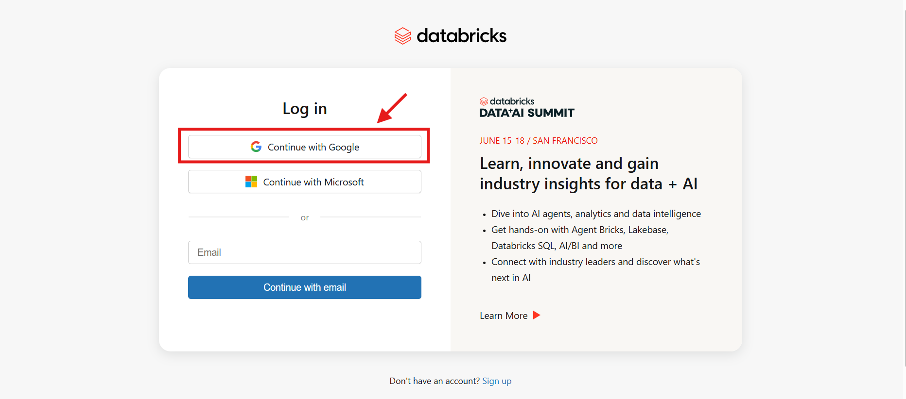


### Step 3: Authenticate and Choose a Trial Type

1. Choose the Google/email account you wish to use for your Databricks environment.
2. On the **"What will you use Databricks for?"** screen, select **For work** (this enables the 14-day free trial and AWS integration).
3. Click **Start trial with express setup**.

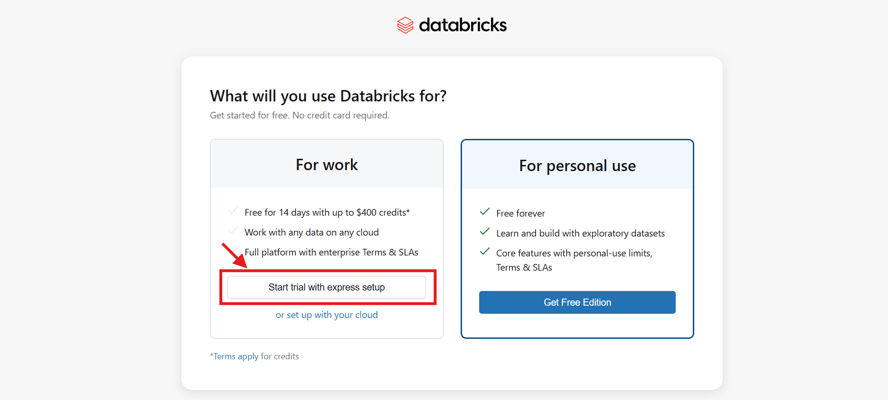

### Step 4: Configure Account Details and Verify

1. Enter your desired **account name** (e.g., `dbx-lab-account`).
2. Select your **country / region** and click **Continue**.


3. Complete the **security / captcha challenge** and click **Submit**.

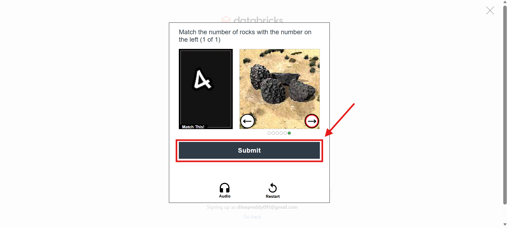

4. On **"Tell us about yourself"**, pick **Learn data and AI** and choose up to 3 topics of interest, then click **Continue**.


5. Wait while Databricks initializes your account — you will see a **"Setting up your account…"** progress screen. This typically takes 1–2 minutes.

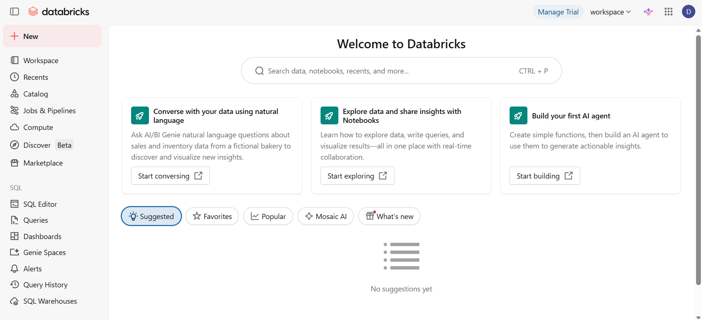

### Step 5: Express Setup — Link Databricks to AWS

Express Setup automatically provisions a starter workspace and connects it to your AWS account. **For this lab we will NOT use this auto-created workspace** for our actual work — we will build a proper workspace with a custom S3 bucket and cluster. However, completing Express Setup is required to fully activate your Databricks account.

#### Step 5.1: Open the Account Console

Once your account finishes initializing, you will land in the workspace UI. Click your **workspace name** in the top-right corner, then click **Manage account**.

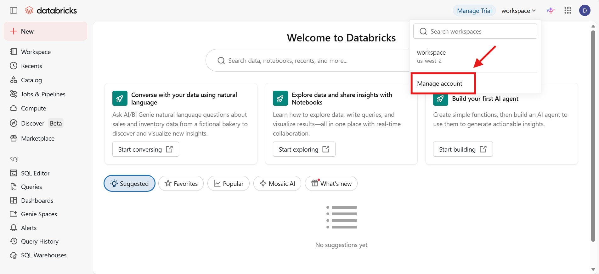

#### Step 5.2: Create an Express Workspace

1. In the account console, click **Workspaces** in the left navigation panel, then click **Create workspace**.


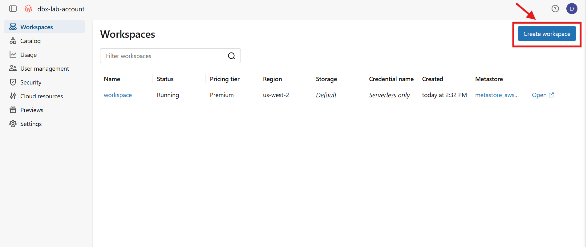

2. Fill out the workspace creation form:
   - **Workspace name:** `dbx-express-temp`
   - **Region:** `N. Virginia (us-east-1)`
   - **Storage and compute:** Select **Use your existing cloud account**
3. Click **Continue**.


#### Step 5.3: Configure Cloud Credentials and Storage

1. Under **Compute credentials**, click the dropdown and select **Add cloud credentials**.

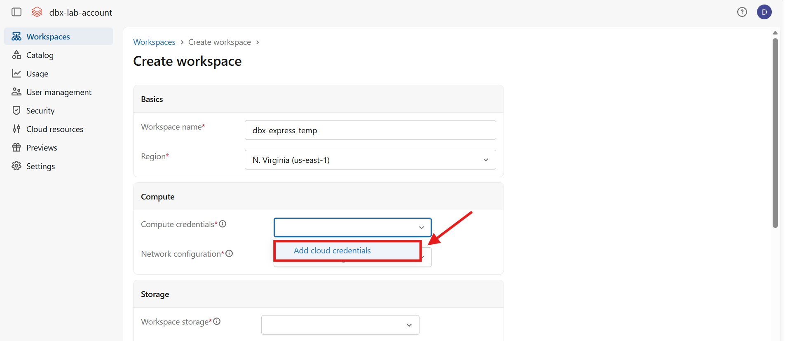

2. In the **Add cloud credentials** pop-up window, select **Add automatically** and click **OK**. Ensure **Workspace storage** is also set to **Add automatically**.


3. Once both fields are configured, click the **Log in to AWS and create workspace** button at the bottom of the screen.

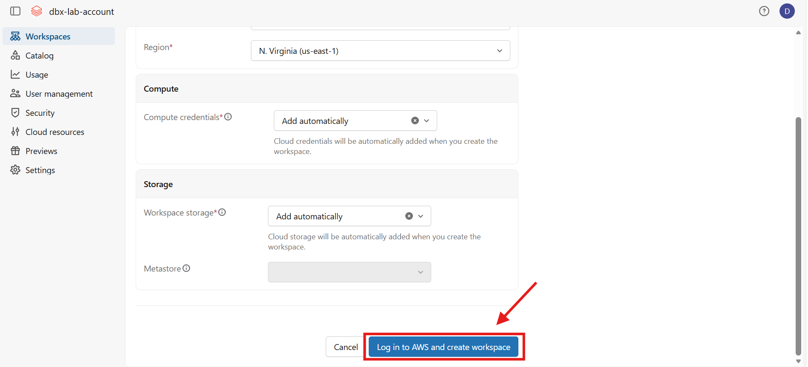

#### Step 5.4: Authorize in AWS and Initiate Workspace Creation

1. A pop-up modal will appear listing the AWS resources Databricks will create. Review the list and click **Initiate workspace creation**.

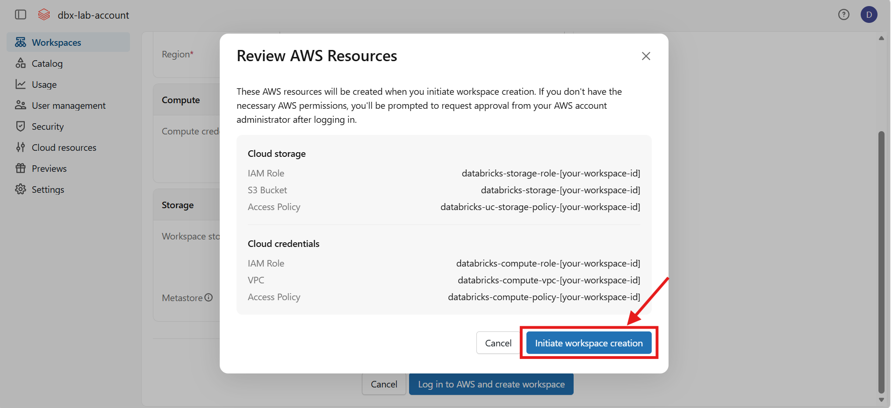

2. You will be redirected to the AWS sign-in page. Sign in with your lab credentials and click **Allow access** to let Databricks provision the resources.

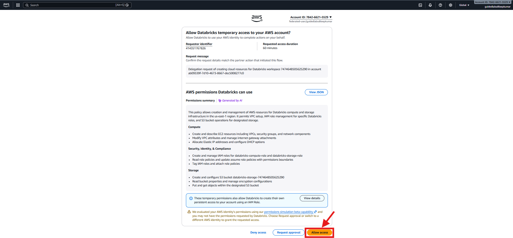

#### Step 5.5: Wait for Running Status

Return to the Databricks account console and wait until the workspace status flips to **Running** (typically 3–5 minutes).

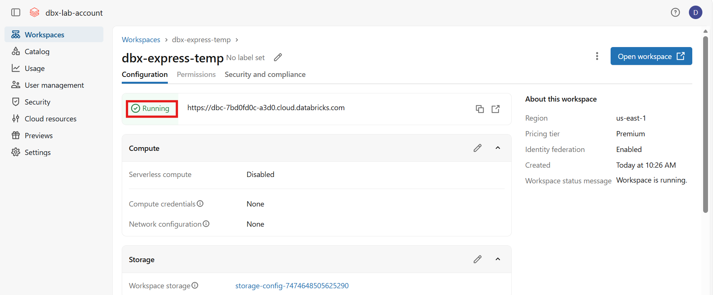

> **Important:** Once Express Setup completes, your Databricks account is fully active. You can ignore the `dbx-express-temp` workspace — the lab activities below use a cluster and S3 bucket you will set up directly.

### Step 6: Log In and Capture Your Databricks Account ID

This step applies to **both** new accounts (after completing Steps 2–5) **and** existing accounts (if you skipped here from Step 1).

1. Open the **Databricks account console** at [https://accounts.cloud.databricks.com/](https://accounts.cloud.databricks.com/) and sign in.
2. Click the **user icon** in the top-right corner → **Account**.
3. **Copy** the **Account ID** — a UUID that looks like `e2-xxxxxxxx-xxxx-xxxx-xxxx-xxxxxxxxxxxx` — into a text note. You will reference it throughout this lab.

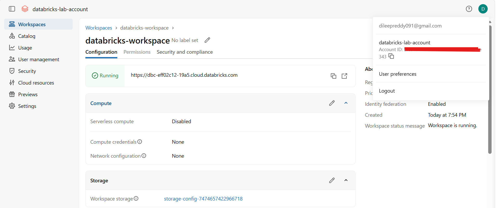

> 💡 The Account ID is used in cross-account IAM trust policies and ties the trust relationship specifically to your Databricks account.

---

# Activity 1: S3 Bucket, IAM Setup & Cluster Creation

**Purpose:** Create the S3 bucket for lab data, configure IAM permissions so the cluster can access S3, and create the all-purpose cluster with the correct settings.

### Step 1.1: Create the S3 Bucket and Upload Source Data

1. In the AWS Console, search for **S3** and click **Create bucket**.
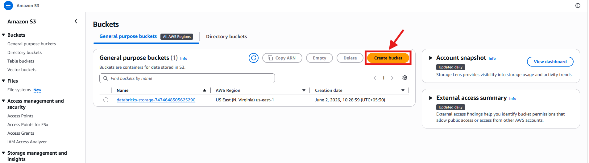
2. Set **Bucket name** to `dlt-lab-<your-aws-account-id>` (e.g., `dlt-lab-784266215529`).
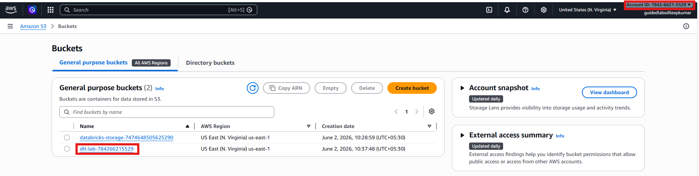

   > 💡 Find your AWS Account ID in the top-right corner of the AWS Console.

3. Keep region as **us-east-1**. Ensure **Block all public access** is checked. Click **Create bucket**.

4. Open the bucket → **Create folder** → name it `raw` → **Create folder**.
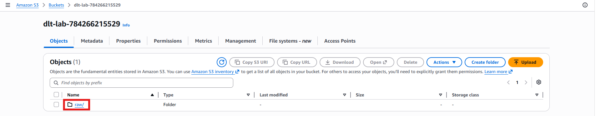
5. Inside `raw/` → **Create folder** → name it `orders` → **Create folder**.
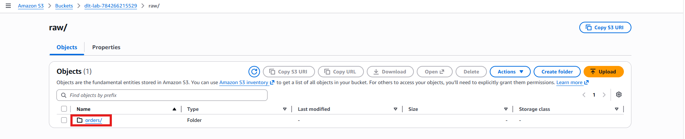
6. Open `raw/orders/` → **Upload** → add both files:
   - `~/Desktop/Project/orders_raw.csv`
   - `~/Desktop/Project/orders_bad.csv`
7. Click **Upload**.

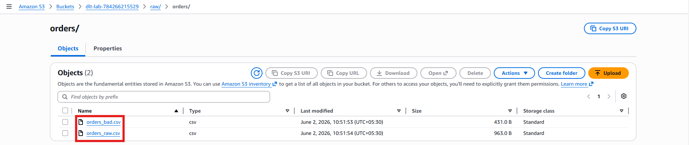

### Step 1.2: Create IAM Policy for S3 Access

1. In the AWS Console, search for **IAM** and open it.
2. Click **Policies** → **Create policy**.
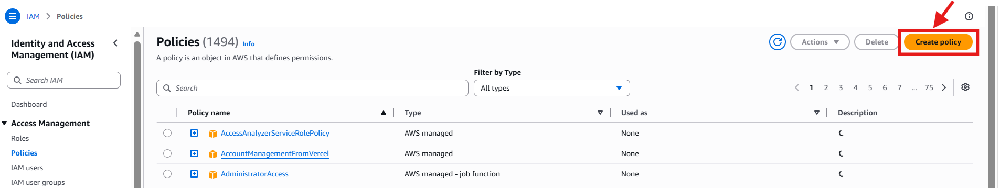
3. Click the **JSON** tab and paste the following (replace `<your-account-id>`):

```json
{
  "Version": "2012-10-17",
  "Statement": [
    {
      "Effect": "Allow",
      "Action": [
        "s3:GetObject",
        "s3:PutObject",
        "s3:DeleteObject",
        "s3:ListBucket"
      ],
      "Resource": [
        "arn:aws:s3:::dlt-lab-<your-account-id>",
        "arn:aws:s3:::dlt-lab-<your-account-id>/*"
      ]
    }
  ]
}
```
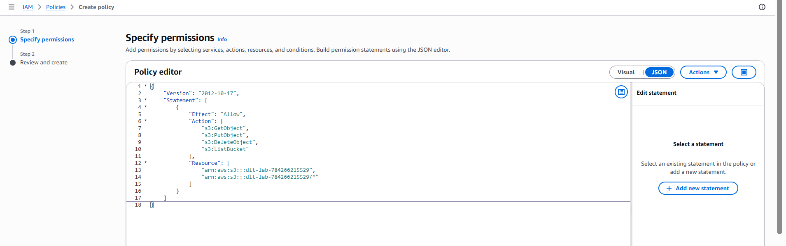

4. Click **Next** → set **Policy name** to `dlt-lab-s3-policy` → **Create policy**.

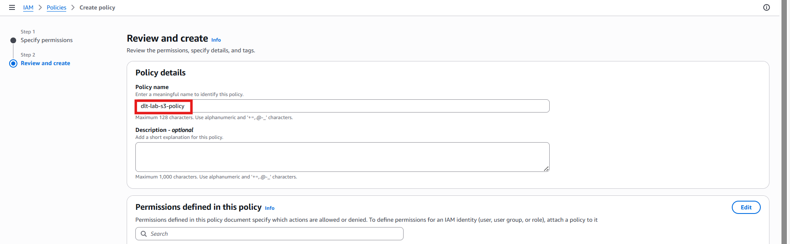

### Step 1.3: Create IAM Role (Instance Profile)

1. In IAM, click **Roles** → **Create role**.
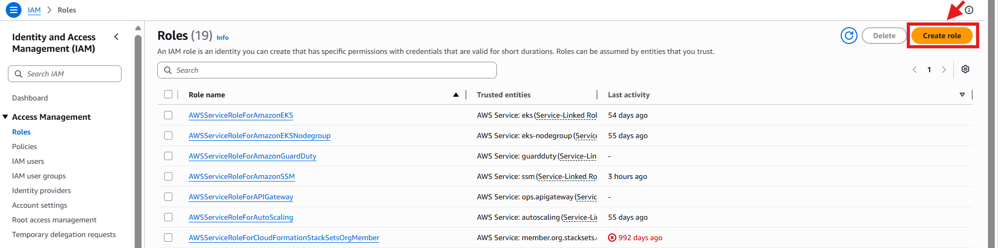
2. Select **AWS service** → **EC2** → **Next**.
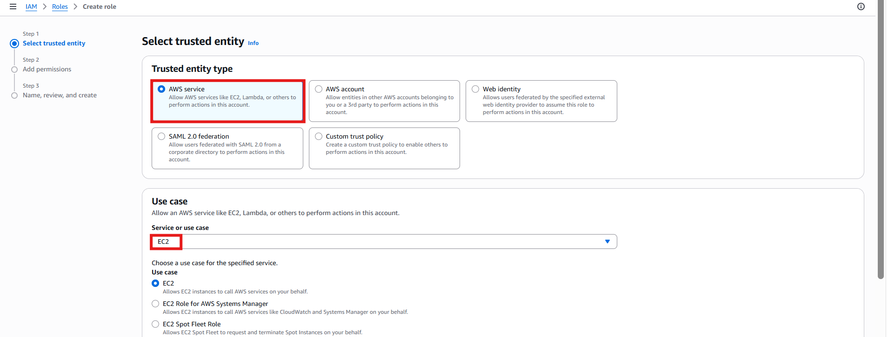
3. Search for `dlt-lab-s3-policy`, check it → **Next**.
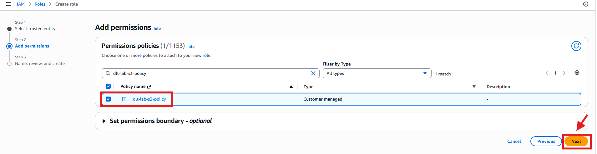
4. Set **Role name** to `dlt-lab-instance-profile` → **Create role**.
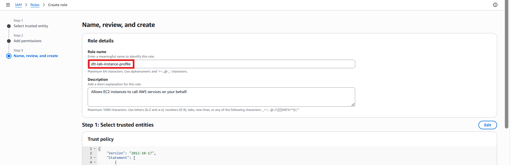

### Step 1.4: Add S3 Bucket Policy

1. In S3, open your `dlt-lab-<account-id>` bucket → **Permissions** tab → **Bucket policy** → **Edit**.
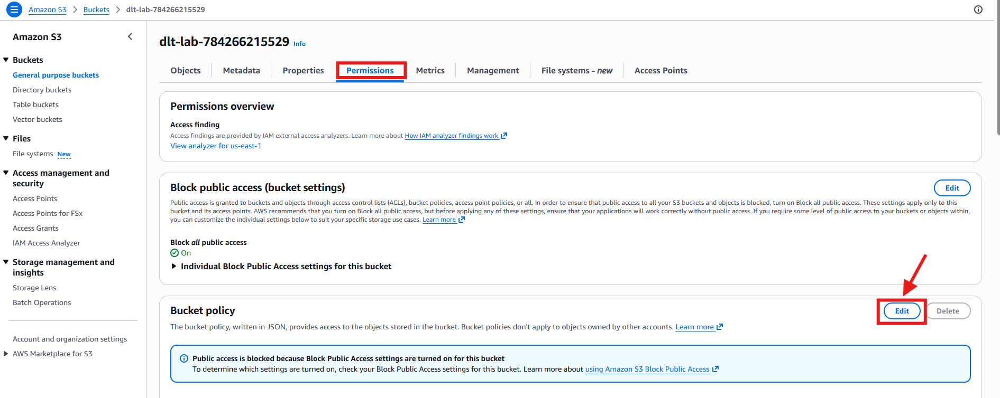
2. Paste the following (replace `<your-account-id>`):

```json
{
  "Version": "2012-10-17",
  "Statement": [
    {
      "Sid": "DatabricksAccess",
      "Effect": "Allow",
      "Principal": {
        "AWS": "arn:aws:iam::<your-account-id>:role/dlt-lab-instance-profile"
      },
      "Action": [
        "s3:GetObject",
        "s3:PutObject",
        "s3:DeleteObject",
        "s3:ListBucket"
      ],
      "Resource": [
        "arn:aws:s3:::dlt-lab-<your-account-id>",
        "arn:aws:s3:::dlt-lab-<your-account-id>/*"
      ]
    }
  ]
}
```

3. Click **Save changes**.

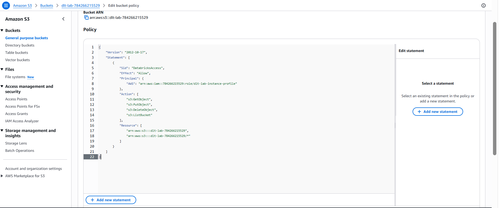

### Step 1.5: Create the All-Purpose Cluster

1. On the workspace detail page, click the ↗ external link icon (next to the workspace URL) to open the dbx-express-temp workspace.

2. Inside the workspace, click Compute in the left sidebar → click Create compute (top right).
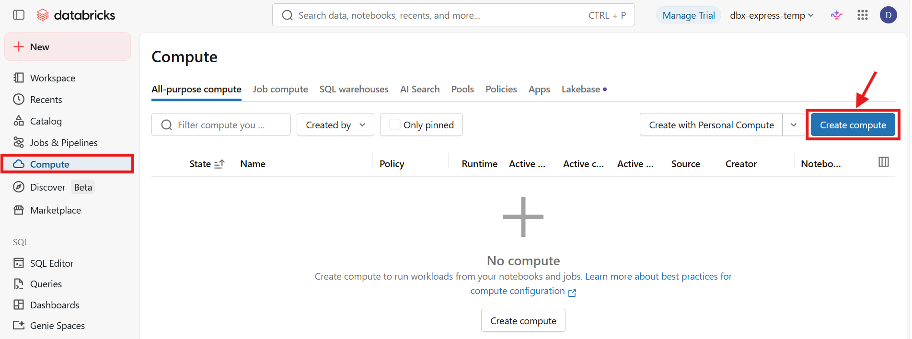
3. Configure the cluster:

   | Setting | Value |
   |---|---|
   | **Compute name** | `dlt-lab-cluster` |
   | **Databricks runtime** | `13.3 LTS (Scala 2.12, Spark 3.4.1)` |
   | **Single node** | ✅ Checked |
   | **Terminate after** | `30` minutes of inactivity |
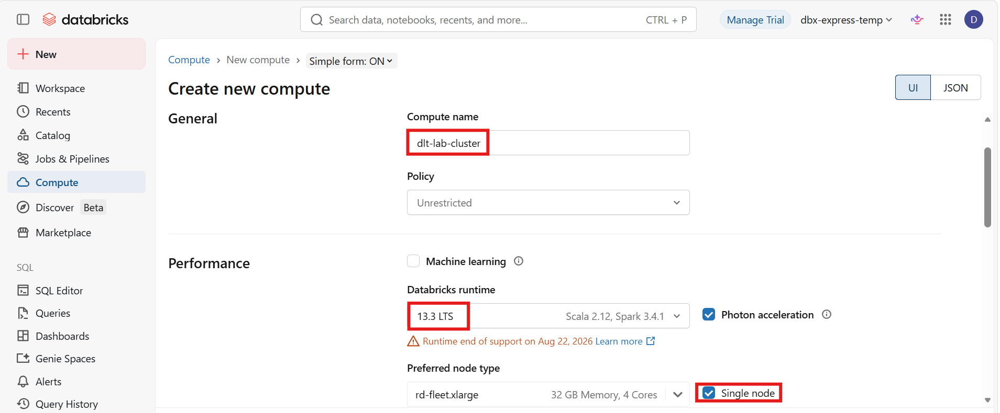
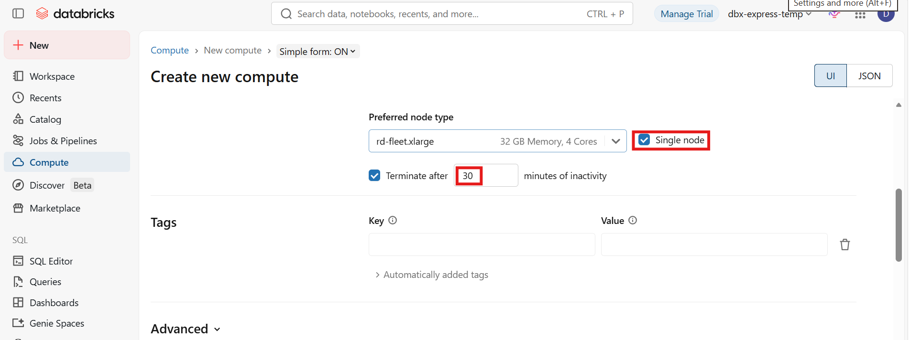

4. Scroll down to **Advanced options** → **Spark** tab.

### 🔑 Getting Your AWS Credentials

Before configuring the Spark settings, you need to retrieve your AWS credentials 
from the Lab portal. Follow these steps:

1. Switch to the **Lab 20 - Delta Lake** browser tab 
   (https://labs.trainocate.com).

2. On the lab page, click the **credentials icon** (🔐) on the right-hand side 
   of the screen — it is the second blue icon on the right edge of the page.


3. A **Lab Credentials** panel will open on the right side, showing:
   - **Login URL** – the AWS Console sign-in link
   - **accessId** – your AWS Access Key ID
   - **accessKey** – your AWS Secret Access Key
   - **arn** – your AWS account number
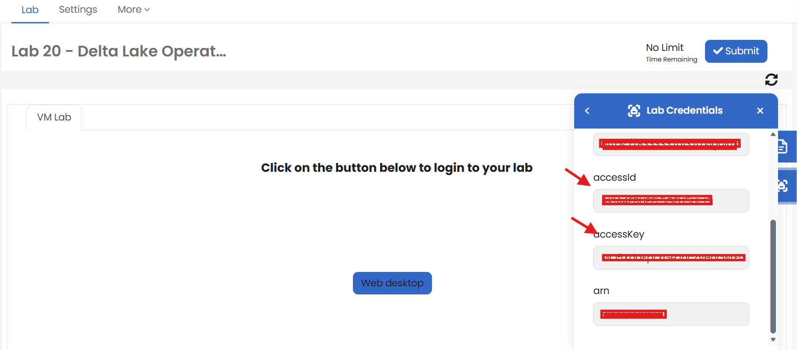

4. Copy the **accessId** value — this is your `<YOUR-ACCESS-KEY-ID>`.

5. Copy the **accessKey** value — this is your `<YOUR-SECRET-ACCESS-KEY>`.

> 💡 **Tip:** Keep this panel open so you can refer back to the credentials 
> while filling in the Spark config and Environment variables in Databricks.

4. In the **Spark config** box, paste these 4 lines (replace with your actual keys):

   ```
   spark.hadoop.fs.s3n.awsAccessKeyId <YOUR-ACCESS-KEY-ID>
   spark.hadoop.fs.s3n.awsSecretAccessKey <YOUR-SECRET-ACCESS-KEY>
   spark.hadoop.fs.s3.awsAccessKeyId <YOUR-ACCESS-KEY-ID>
   spark.hadoop.fs.s3.awsSecretAccessKey <YOUR-SECRET-ACCESS-KEY>
   ```

5. In the **Environment variables** box, add:

   ```
   AWS_ACCESS_KEY_ID=<YOUR-ACCESS-KEY-ID>
   AWS_SECRET_ACCESS_KEY=<YOUR-SECRET-ACCESS-KEY>
   ```
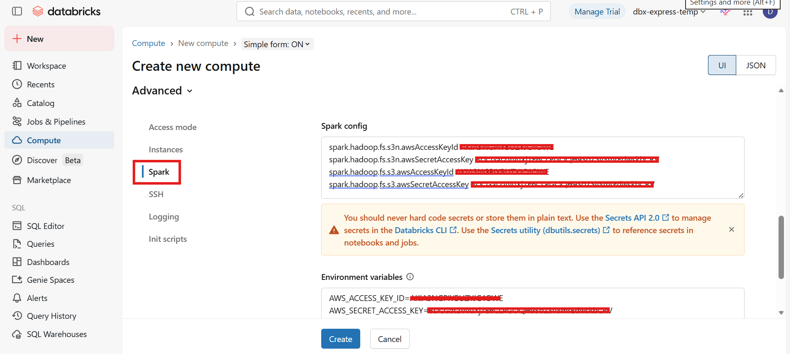
6. Click **Create** and wait for the cluster to show a **green dot (Running)**.

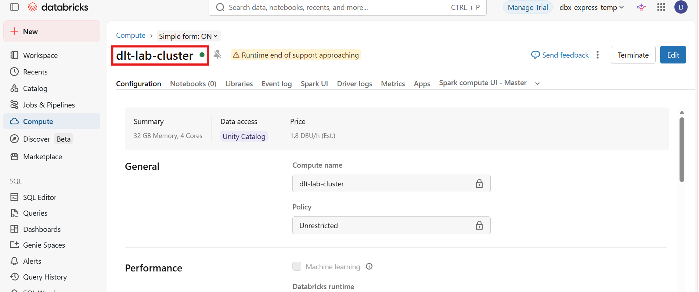

### Step 1.6: Create the `dlt_lab` Workspace Folder

1. Click **Workspace** in the left sidebar.
2. Navigate to **Users** → your email folder.
3. Click **Create** → **Folder** → name it `dlt_lab` → press **Enter**.

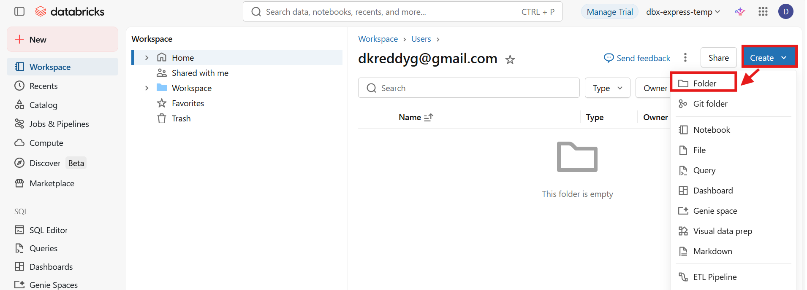
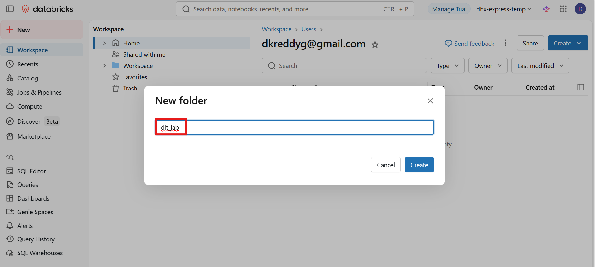

### Step 1.7: Import the Lab Notebooks

1. Open the `dlt_lab` folder.
2. Click **⋮** next to the folder name → **Import**.
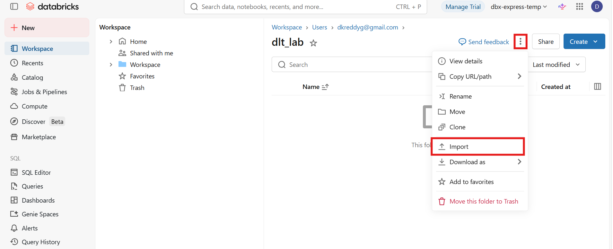
3. Select **File** as the source. Import each `.py` file from `~/Desktop/Project/dlt_lab/`:
   - `01_bronze_ingestion.py`
   - `02_silver_quality.py`
   - `03_gold_aggregation.py`
4. All 3 notebooks should appear in the `dlt_lab` folder.

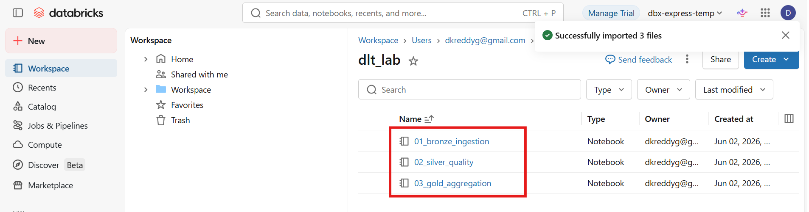

> ⚠️ **Do not attach a cluster or run these notebooks directly.** They are DLT pipeline source files and must be executed through the DLT pipeline runtime, not interactively.

---

# Activity 2: Bronze Layer — Auto Loader Ingestion

**Purpose:** Review the Bronze DLT notebook. The Bronze layer stores data at full fidelity — no cleansing, no filtering — and adds audit columns for traceability.

### Step 2.1: Open the Bronze Notebook

Click **Workspace** → `dlt_lab` → open **`01_bronze_ingestion`**.
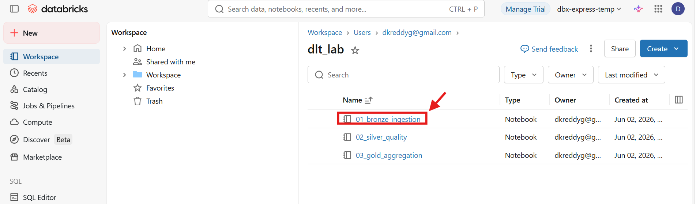

### Step 2.2: Review Cell 1 — Pipeline Configuration

```python
# Cell 1 — Pipeline configuration
import dlt
from pyspark.sql import functions as F

# ── UPDATE THIS VALUE ──────────────────────────────────────────────────────────
S3_BUCKET = "dlt-lab-<your-aws-account-id>"   # Replace with your actual bucket name
# ──────────────────────────────────────────────────────────────────────────────

RAW_PATH = f"s3://{S3_BUCKET}/raw/orders/"
```

> 📌 **Update** the `S3_BUCKET` value to your actual bucket name (e.g., `dlt-lab-784266215529`) and save the notebook with **Ctrl+S**.

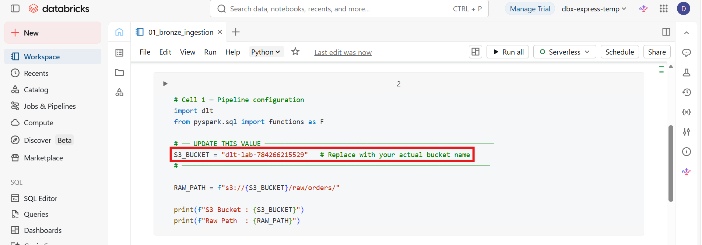

### Step 2.3: Review Cell 2 — Bronze DLT Table

```python
# Cell 2 — Bronze DLT table using Auto Loader
@dlt.table(
    name    = "bronze_orders",
    comment = "Raw orders ingested from S3 via Auto Loader — full fidelity, no transformations."
)
def bronze_orders():
    return (
        spark.readStream.format("cloudFiles")
             .option("cloudFiles.format", "csv")
             .option("header", "true")
             .option("inferSchema", "true")
             .option("cloudFiles.schemaLocation",
                     f"s3://{S3_BUCKET}/dlt_checkpoints/bronze_schema/")
             .load(RAW_PATH)
             .withColumn("_ingested_at", F.current_timestamp())
             # Unity Catalog requires _metadata.file_path instead of input_file_name()
             .withColumn("_source_file", F.col("_metadata.file_path"))
    )
```

> ⚠️ **Important — Unity Catalog compatibility:** This workspace uses Unity Catalog. The classic `F.input_file_name()` function is **not supported** in Unity Catalog pipelines. Always use `F.col("_metadata.file_path")` instead to capture the source file path.

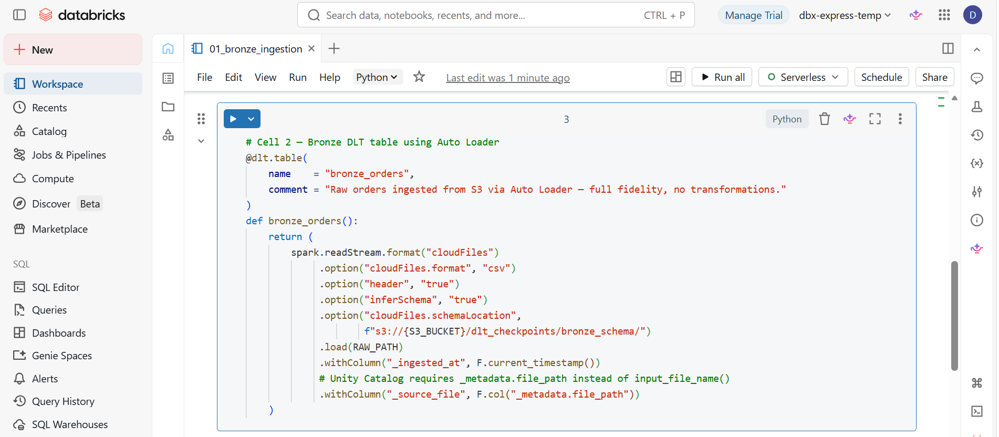

---

# Activity 3: Silver Layer — Data Quality Expectations

**Purpose:** Review the Silver DLT notebook. This layer cleanses data and enforces data quality using `@dlt.expect`, `@dlt.expect_or_drop`, and `@dlt.expect_or_fail`.

### Step 3.1: Open the Silver Notebook

Click **Workspace** → `dlt_lab` → open **`02_silver_quality`**.

### Step 3.2: Review Cell 1 — Imports

```python
# Cell 1 — Imports
import dlt
from pyspark.sql import functions as F
from pyspark.sql.types import DoubleType, IntegerType
```

### Step 3.3: Review Cell 2 — Silver DLT Table with Expectations

```python
# Cell 2 — Silver DLT table with data quality expectations

@dlt.expect("order_id_not_null", "order_id IS NOT NULL")
@dlt.expect_or_drop("quantity_positive", "quantity > 0")
@dlt.expect_or_fail("unit_price_positive", "unit_price > 0")
@dlt.table(
    name    = "silver_orders",
    comment = "Cleansed and validated orders. Bad records handled per expectation policy."
)
def silver_orders():
    return (
        dlt.read_stream("bronze_orders")
           .withColumn("quantity",   F.col("quantity").cast(IntegerType()))
           .withColumn("unit_price", F.col("unit_price").cast(DoubleType()))
           .withColumn("revenue",    F.col("quantity") * F.col("unit_price"))
           .withColumn("order_date", F.to_date(F.col("order_date"), "yyyy-MM-dd"))
           .filter(F.col("status").isin("completed", "pending", "cancelled"))
           .drop("_source_file")
    )
```

| Decorator | Rule Name | Condition | Behaviour on Violation |
|---|---|---|---|
| `@dlt.expect` | `order_id_not_null` | `order_id IS NOT NULL` | **Warn** — row passes through; violation recorded in event log |
| `@dlt.expect_or_drop` | `quantity_positive` | `quantity > 0` | **Drop** — violating row removed silently; pipeline continues |
| `@dlt.expect_or_fail` | `unit_price_positive` | `unit_price > 0` | **Fail** — pipeline halts immediately; forces investigation |

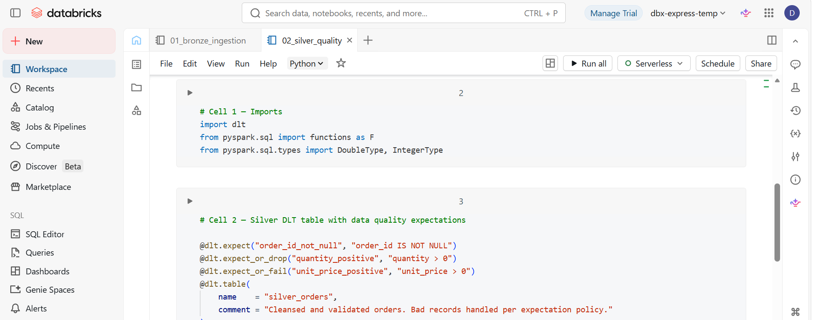
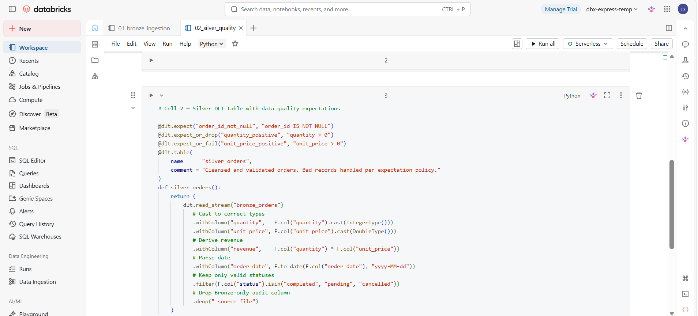

---

# Activity 4: Gold Layer — Business Aggregation

**Purpose:** Review the Gold DLT notebook. The Gold layer aggregates clean Silver data into a business-ready revenue summary.

### Step 4.1: Open the Gold Notebook

Click **Workspace** → `dlt_lab` → open **`03_gold_aggregation`**.

### Step 4.2: Review Cell 2 — Gold DLT Table

```python
# Cell 2 — Gold DLT table: revenue summary by product and status
@dlt.table(
    name    = "gold_revenue_by_product",
    comment = "Revenue aggregated by product and order status. Business-ready for dashboards."
)
def gold_revenue_by_product():
    return (
        dlt.read("silver_orders")
           .groupBy("product", "status")
           .agg(
               F.sum("revenue").alias("total_revenue"),
               F.count("order_id").alias("order_count"),
               F.avg("unit_price").alias("avg_unit_price")
           )
           .orderBy("product", "status")
    )
```

> 💡 `dlt.read()` (batch) is used here instead of `dlt.read_stream()` because Gold needs the complete Silver dataset to compute correct aggregations.

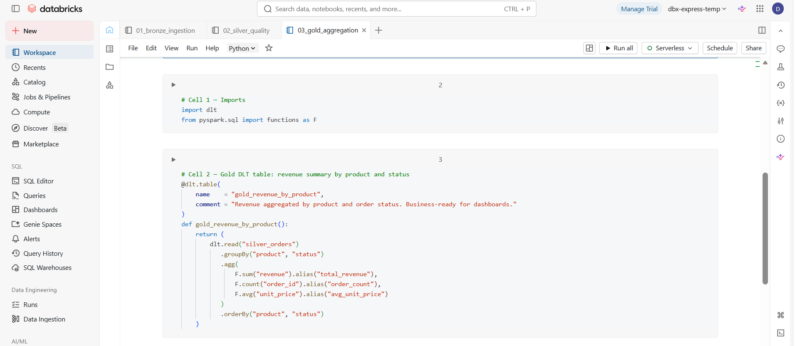

---

# Activity 5: Configure and Launch the DLT Pipeline

**Purpose:** Wire all three notebooks into a single DLT pipeline, configure the pipeline settings, and execute it in Triggered mode.

### Step 5.1: Navigate to Jobs & Pipelines

1. Click **Jobs & Pipelines** in the left sidebar.
2. Click the **`Create ▾`** dropdown button (top right corner).
3. Select **ETL pipeline** from the dropdown.

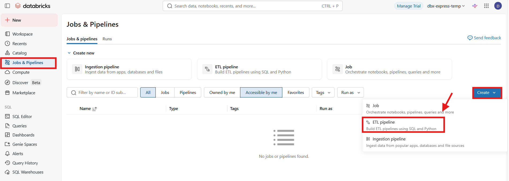

> 💡 This opens the **Lakeflow Pipelines editor** — Databricks' current pipeline UI. All pipeline configuration is done through the gear icon settings panel within this editor.

### Step 5.2: Rename the Pipeline

At the top, click the default pipeline name (e.g., `New Pipeline 2026-06-01 10:41`) and rename it to:
```
dlt-lab-orders-pipeline
```

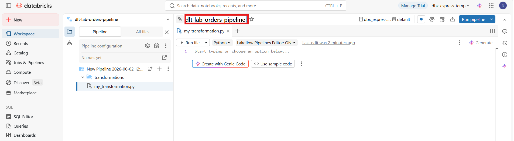

### Step 5.3: Open Pipeline Settings

Click the **⚙️ gear icon** next to "Pipeline configuration" in the left panel to open the **Pipeline settings** panel.

You will see the following sections — configure each as described below.

### Step 5.4: Set the Target Schema

1. Scroll to **Default location for data assets**.
2. Click **Edit catalog and schema**.
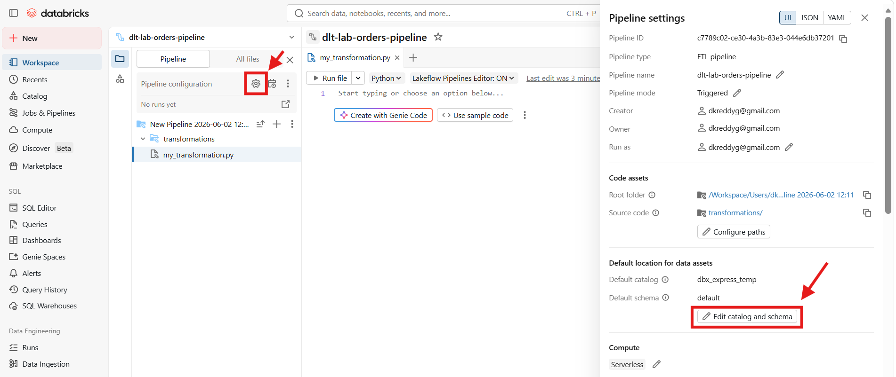
3. Leave **Default catalog** as the auto-created catalog (`dbx_express_temp_...`).
4. Set **Default schema** to:
   ```
   dlt_lab_db
   ```
5. Click **Save**.

> 💡 The message "schema doesn't exist" is expected — DLT will create `dlt_lab_db` automatically when the pipeline runs.

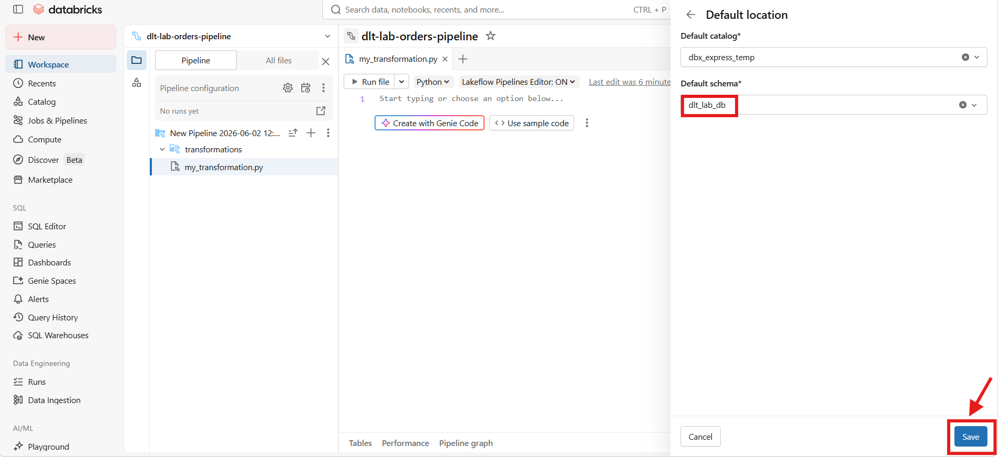

### Step 5.5: Configure Source Code Paths

1. In Pipeline settings, scroll to **Code assets** → **Source code**.
2. Click **Configure paths**.
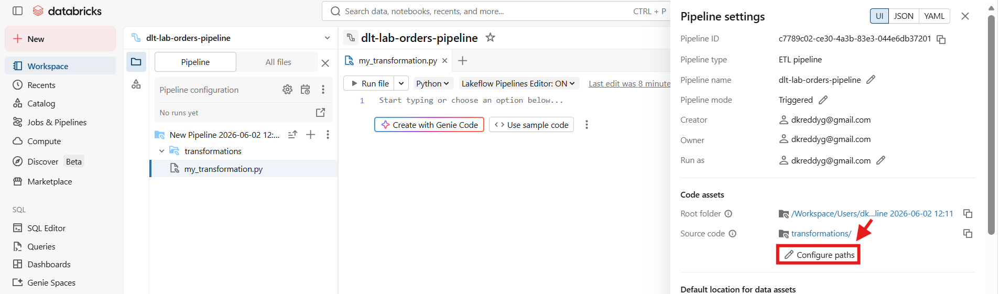
3. The existing path shows `transformations/` — click the **folder icon** 📁 on that row to browse.
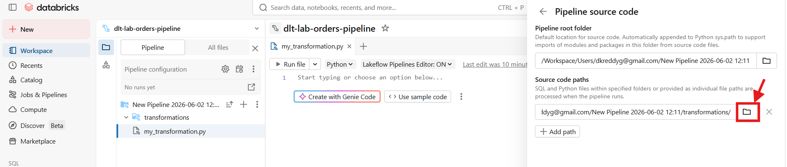
4. In the browser, navigate: `Workspace → Users → <your-email> → dlt_lab`.
5. Select **`01_bronze_ingestion`** → click **Select**.
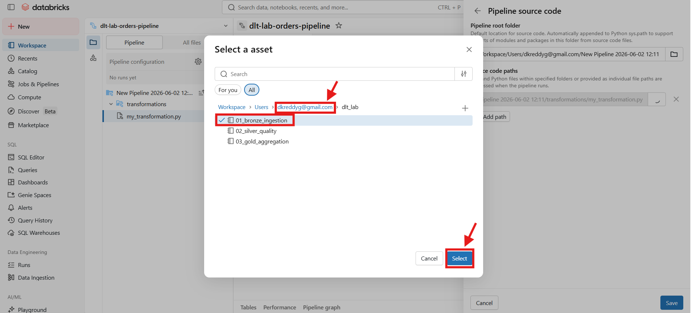
6. Click **+ Add path** → repeat browsing to `dlt_lab` → select **`02_silver_quality`** → **Select**.
7. Click **+ Add path** → repeat → select **`03_gold_aggregation`** → **Select**.
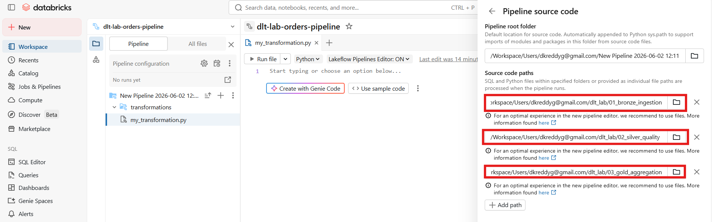
8. Click **Save**.

All 3 notebooks should now appear under **"Files external to pipeline folder"** in the left panel:
```
.../01_bronze_ingestion
.../02_silver_quality
.../03_gold_aggregation
```

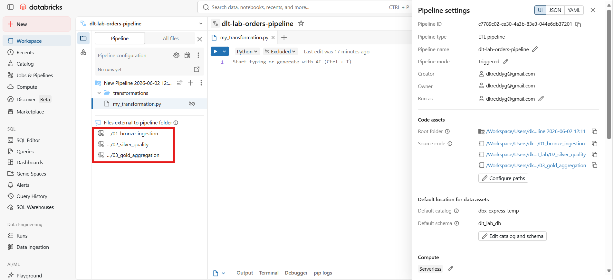

### Step 5.6: Add AWS Credentials to Pipeline Configuration

The DLT pipeline runs on its own Serverless compute which does not inherit cluster Spark config. You must pass AWS credentials directly via the pipeline Configuration panel.

1. In Pipeline settings, scroll to **Configuration**.
2. Click **Add configuration**.
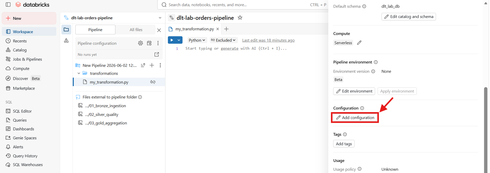
3. Add the following 4 key-value pairs (use your actual AWS keys from the lab credentials panel):

| Key | Value |
|---|---|
| `spark.hadoop.fs.s3a.access.key` | `<YOUR-ACCESS-KEY-ID>` |
| `spark.hadoop.fs.s3a.secret.key` | `<YOUR-SECRET-ACCESS-KEY>` |
| `spark.hadoop.fs.s3n.awsAccessKeyId` | `<YOUR-ACCESS-KEY-ID>` |
| `spark.hadoop.fs.s3n.awsSecretAccessKey` | `<YOUR-SECRET-ACCESS-KEY>` |

4. Click **Save**.

> 💡 Open the **lab credentials panel** (🔐 icon on the lab portal) to copy your `accessId` and `accessKey` values. Make sure there are no duplicate keys — delete any duplicates using the 🗑️ trash icon before saving.

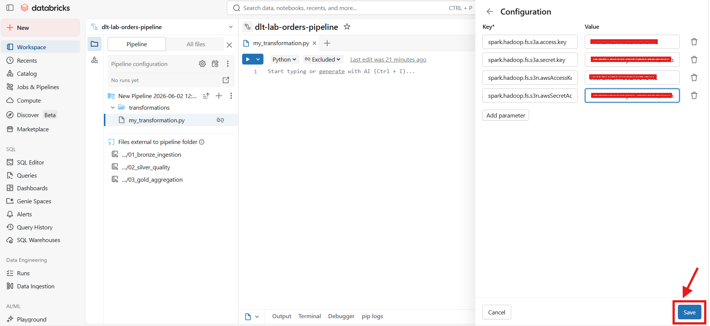

### Step 5.7: Verify Pipeline Mode

Scroll back to the top of the Pipeline settings panel and confirm:
- **Pipeline mode:** `Triggered` ✅
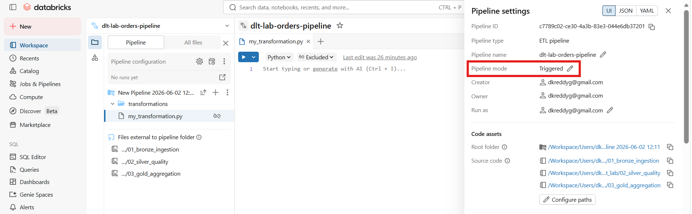

> 📌 **Triggered mode** runs the pipeline once per invocation, processes all available data, then stops. This is correct for this lab — we want to observe a complete run from start to finish.

### Step 5.8: Run the Pipeline

1. Click **Run pipeline** (top right blue button).
2. The pipeline will transition through: **Initializing → Setting up cluster → Running → Completed**.
3. Wait for **Completed** status — typically **30–60 seconds** with Serverless compute.

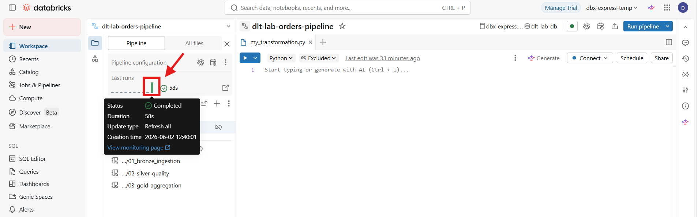

### Step 5.9: Observe the Pipeline Graph

Once completed, click the **Pipeline graph** tab at the bottom of the screen. The graph shows all three tables connected by directed edges:

```
bronze_orders (28 rows) → silver_orders (22 rows, 3 expectations) → gold_revenue_by_product (9 rows)
```

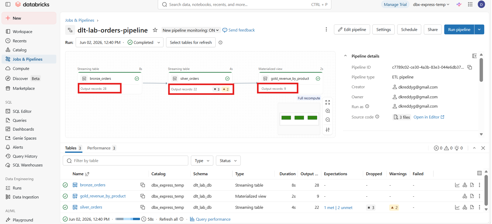

### Step 5.10: Review Data Quality Metrics

Click on the **`silver_orders`** node in the pipeline graph (or click on `silver_orders` in the Tables list) to open its detail panel. You will see:
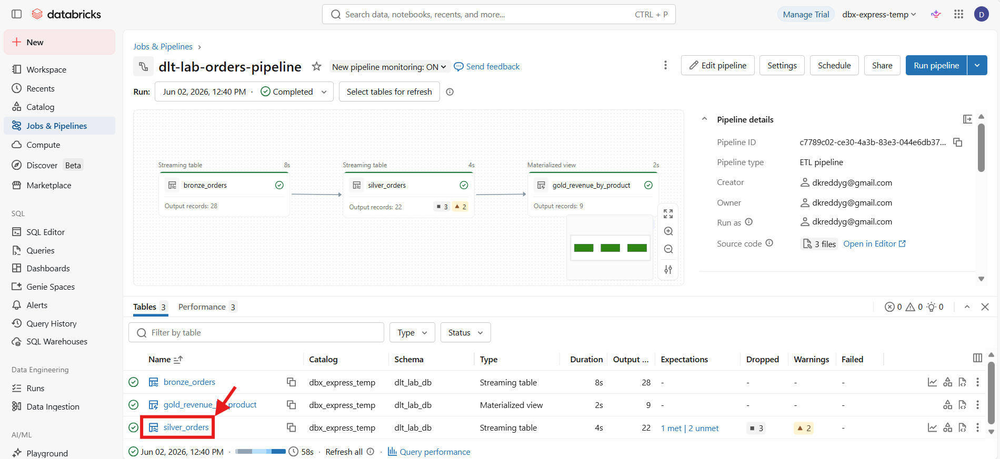
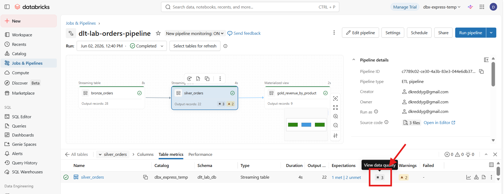
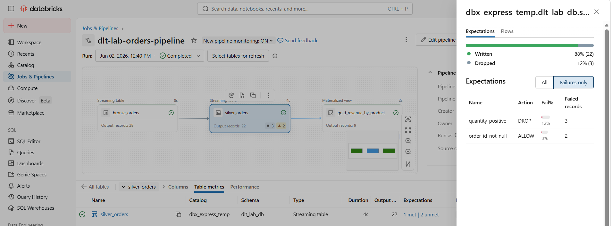


**Summary bar:**
- 🟢 **Written: 88% (22 rows)** — clean records passed through
- ⚫ **Dropped: 12% (3 rows)** — bad quantity records removed

**Expectations breakdown:**

| Expectation | Action | Failed Records | Fail % |
|---|---|---|---|
| `quantity_positive` | DROP | 3 | 12% |
| `order_id_not_null` | ALLOW (Warn) | 2 | 8% |

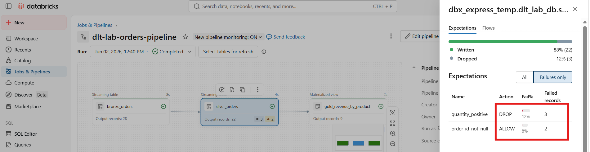

> 💡 `unit_price_positive` (Fail mode) does not appear in the failures list because none of the bad records had a negative unit price — the pipeline completed successfully as designed.

---

# Activity 6: Validate Lineage Tracking

**Purpose:** Confirm that DLT automatically captured end-to-end lineage from S3 through Bronze → Silver → Gold.

### Step 6.1: View the Full Pipeline Graph

From the pipeline run view, the pipeline graph IS the lineage view. Confirm the end-to-end chain:

```
bronze_orders → silver_orders → gold_revenue_by_product
```

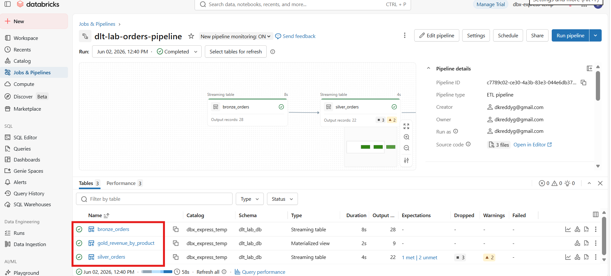

### Step 6.2: Confirm Lineage in Unity Catalog

1. Click **Catalog** in the left sidebar.
2. Navigate to your catalog → **`dlt_lab_db`** → click **`silver_orders`**.
3. Click the **Lineage** tab to see the full upstream/downstream lineage captured automatically.

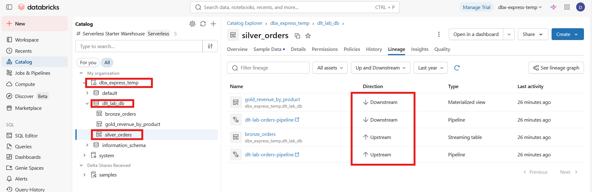

> 💡 DLT's automatic lineage means you never have to manually document data flows. When a source schema changes, Unity Catalog lineage immediately shows which downstream tables are affected.

---

# Activity 7: Verify Final Table Contents

**Purpose:** Query all three DLT-managed tables using Databricks SQL Editor to confirm correct row counts, transformations, and aggregations.

> ⚠️ **Important:** DLT Streaming tables in Unity Catalog **cannot be queried from an all-purpose cluster**. You must use a **Serverless SQL Warehouse** or a shared cluster. Always use **SQL Editor** with the **Serverless Starter Warehouse** for table verification.

### Step 7.1: Start SQL Warehouse

1. In the Databricks workspace, navigate to Compute → SQL Warehouses.
2. Open Serverless Starter Warehouse.
3. If the warehouse is stopped, click Start.
4. Wait until the warehouse status changes to Running.

**Expected Result:** - Serverless Starter Warehouse is running and ready to execute SQL queries.

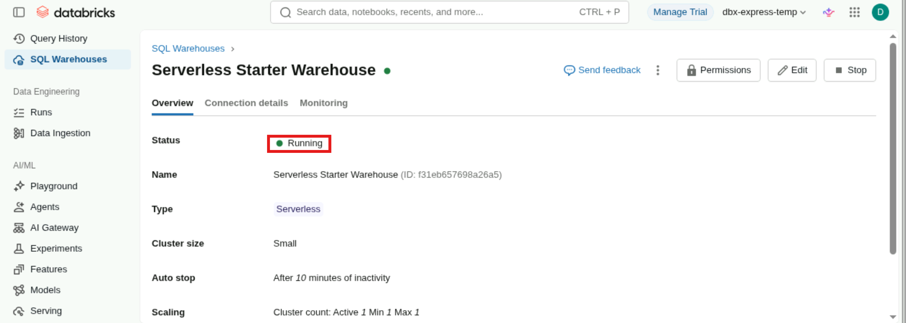

### Step 7.2: Open SQL Editor
1. In the left navigation pane, click SQL Editor.
2. Select:
   - Catalog: dbx_express_temp
   - Schema: dlt_lab_db
3. Select Serverless Starter Warehouse and click Attach.

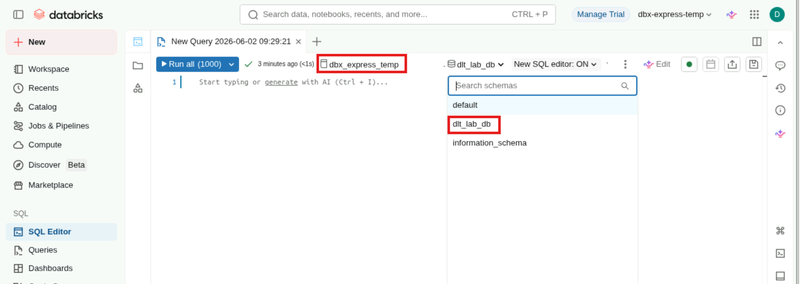
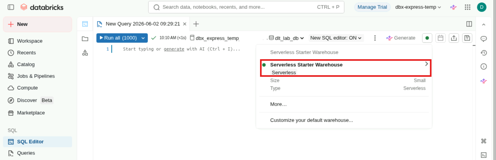

### Step 7.3: Verify Bronze Table

Run the following query:

```sql
SELECT COUNT(*) AS row_count FROM bronze_orders;
```

**Expected Result:** row_count = 28

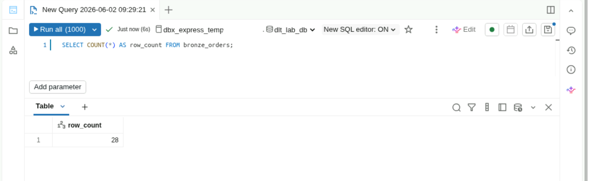


## View Bronze Sample Data
```sql
SELECT *
FROM dlt_lab_db.bronze_orders
LIMIT 10;
```
Validation Points:
- Raw records are preserved.
- Negative quantities are visible.
- NULL order IDs are visible.
- Invalid status values are visible.

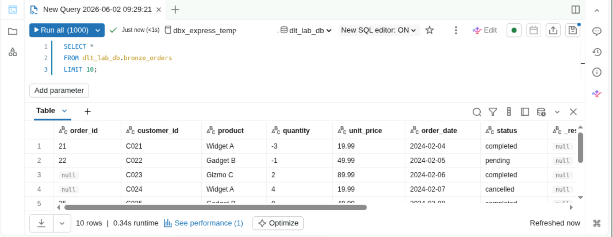


### Step 7.4: Verify Silver Table

Run the following query:

```sql
SELECT COUNT(*) AS row_count FROM silver_orders;
```

**Expected Result:** row_count = 22

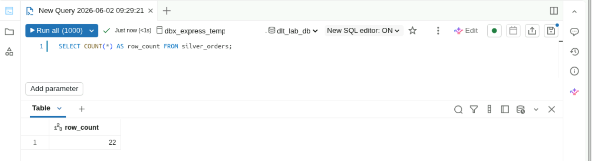

## View Silver Sample Data

```sql
SELECT * FROM dlt_lab_db.silver_orders LIMIT 10;
```
## Validation Points:
- Negative quantity records removed.
- Zero quantity records removed.
- Revenue column added.
- Invalid records filtered using DLT expectations.
- Total record count = 22.

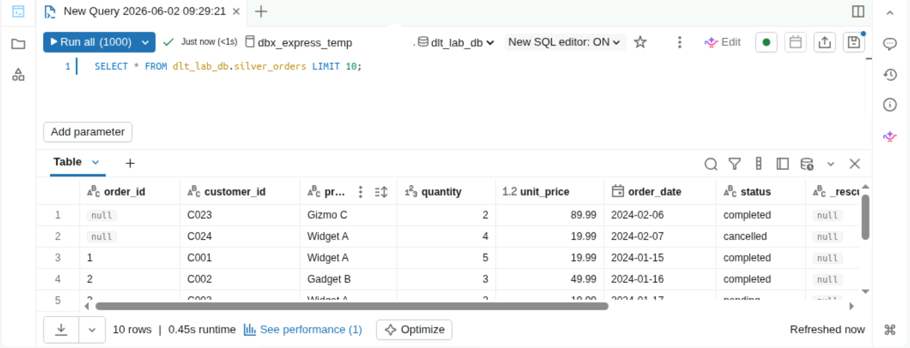

### Step 7.5: Verify Gold Table

Run the following query:

```sql
SELECT COUNT(*) AS row_count FROM gold_revenue_by_product;
```
**Expected Result:** row_count = 9
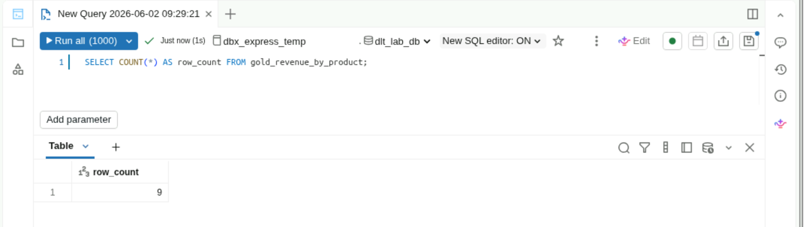


### View Gold Aggregated Data

```sql
SELECT * FROM dlt_lab_db.gold_revenue_by_product;
```
## Validation Points:
- Revenue aggregated by product and status.
- Order counts aggregated.
- Average unit price calculated.
- Total aggregated rows = 9.

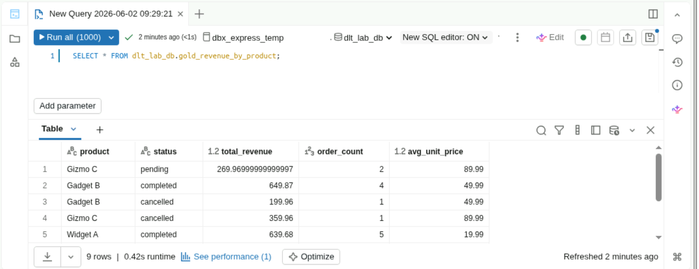


---

## 🎓 Conclusion

This guided project demonstrated how to build a declarative, production-grade data pipeline using Delta Live Tables on Databricks with an AWS S3 backend.

Key accomplishments:

- **AWS & IAM setup** — created S3 bucket, IAM policy (`dlt-lab-s3-policy`), IAM role (`dlt-lab-instance-profile`), and S3 bucket policy.
- **Cluster configuration** — created `dlt-lab-cluster` on Runtime 13.3 LTS with Spark config AWS credentials for S3 access.
- **Bronze DLT table** — used Auto Loader (`cloudFiles` format) for incremental S3 ingestion with `_ingested_at` and `_source_file` audit columns. Used `F.col("_metadata.file_path")` for Unity Catalog compatibility.
- **Silver DLT table with expectations** — applied `@dlt.expect` (Warn), `@dlt.expect_or_drop` (Drop), and `@dlt.expect_or_fail` (Fail) for data quality enforcement. Result: 22 clean rows from 28 raw, with 3 dropped and 2 warned.
- **Gold DLT table** — produced 9-row revenue aggregation by product and status using `dlt.read()` batch read from Silver.
- **Pipeline configuration** — created the pipeline using the **ETL pipeline** option in the Lakeflow editor, configured source code paths, target schema (`dlt_lab_db`), and AWS credentials via the Configuration panel.
- **Pipeline execution** — ran in Triggered mode, confirmed green completion in 35 seconds on Serverless compute.
- **Data quality metrics** — confirmed `quantity_positive` dropped 3 records (12%) and `order_id_not_null` warned on 2 records (8%) via the pipeline graph expectations panel.
- **Lineage validation** — confirmed end-to-end lineage S3 → Bronze → Silver → Gold in the pipeline graph and Unity Catalog Lineage tab.
- **Table verification** — queried all 3 tables via Databricks SQL Editor using the Serverless Starter Warehouse, confirming correct row counts (28 / 22 / 9) and data transformations at each layer.
