# Title: Unity Catalog — Governance, Lineage & Sharing

---

## 🌟 Overview: What is the purpose of this Lab?

Welcome to your Databricks-on-AWS data engineering project! Before business teams can trust governed analytics, data assets must be organized under a consistent namespace, protected with fine-grained permissions, traced end-to-end, and shared securely with internal and external consumers. This lab will guide you through building a **production-style Unity Catalog governance workflow on AWS** end-to-end: from uploading mock source files into Amazon S3, all the way to creating **Bronze**, **Silver**, and **Gold** Delta tables, registering them in **Unity Catalog**, applying persona-based access controls, validating **automatic lineage**, and publishing a governed Gold table through **Delta Sharing**.

**The Purpose of this Lab:**
You are part of a data governance team responsible for centralizing access control and visibility across your organization's Lakehouse. Different teams and personas require different levels of access to data assets. Your task is to use **Unity Catalog** to create a **three-level namespace (`catalog.schema.table`)**, assign fine-grained permissions to **Data Engineer** and **Analyst** personas, apply **column-level masking behavior** for PII fields through a governed masked object, and inspect **automatic lineage** from source to target. To extend the project to a production mindset, you will also build a **Bronze → Silver → Gold** Delta pipeline, validate **Delta Lake DML and time travel**, re-implement the flow with **Delta Live Tables**, create a **Delta Share** for an external recipient, and operationalize the solution with **Databricks Workflows** and **Databricks SQL**.

By the end of this project, you will have:

- Provisioned or accessed a **Databricks workspace on AWS** suitable for free-trial learning.
- Created a **trial-friendly all-purpose cluster** using **Spot instances**, **autoscaling 1–2**, and **30-minute auto termination**.
- Uploaded mock customer files into **Amazon S3** and ingested them incrementally into a Bronze Delta table.
- Built a **Silver Delta table** that enforces cleansing rules, removes duplicates, and supports Delta Lake DML validation.
- Built a **Gold Delta table** containing governed customer metrics for downstream consumption.
- Validated **Delta Lake operations** using `INSERT`, `UPDATE`, `DELETE`, `MERGE`, history inspection, and time travel queries.
- Re-implemented the medallion flow as a **Delta Live Tables pipeline** with **data quality expectations**.
- Created and queried governed assets using **Unity Catalog** three-level naming.
- Applied persona-based access patterns for **Data Engineer** and **Analyst** users, including a masked governed object for PII-safe access.
- Inspected **automatic lineage** in Unity Catalog from source to target.
- Created a **Delta Share** and added a governed Gold table for external sharing.
- Created a **Databricks Workflow** and executed **SQL analytics** against the governed Gold layer.

### Learning Path:

1. **Authentication:** Configure your AWS Console access and credentials.
2. **Databricks Account Setup:** Either log in to your existing Databricks account, or sign up and complete the Workspace Setup.
3. **Storage Foundations:** Create an S3 bucket structure for raw, checkpoint, curated, and sharing-ready governance data.
4. **IAM & Security:** Create and link an Instance Profile to allow secure S3 access.
5. **Compute Setup:** Create a single free-trial-compliant Databricks cluster for all activities.
6. **Bronze to Gold Pipeline:** Build Bronze ingestion, Silver cleansing, and Gold aggregation using Auto Loader and Delta Lake.
7. **Advanced Lakehouse Features:** Validate Delta DML, inspect Delta history, and run time travel queries.
8. **Declarative & Governed Extensions:** Build a DLT pipeline, create Unity Catalog objects, apply permissions, and inspect lineage.
9. **Secure Data Exchange:** Create a Delta Share and add the governed Gold table for external access.
10. **Operationalization:** Orchestrate the notebooks with Workflows and validate reporting queries in SQL.

---

## 📊 Dataset / Knowledge Source Used

The following files are provided in the `~/Desktop/Project/` folder on your lab desktop. You will upload these to S3 as part of the lab. We are using a small customer governance sample so the lab stays fast, inexpensive, and easy to verify on the Databricks 14-day free trial.

Note: If you are following along on a personal computer instead of a pre-configured lab VM, ensure you have downloaded the project repository and placed the data files in a folder named `~/Desktop/Project/`.

**Local File Structure:**

```text
~/Desktop/Project/
├── customers_batch_01.csv
├── customers_batch_02.csv
├── customers_batch_03.csv
└── governance_dlt.py
```

| File                     | Destination                                                         | Description                                                                                         |
| ------------------------ | ------------------------------------------------------------------- | --------------------------------------------------------------------------------------------------- |
| `customers_batch_01.csv` | `s3://dbx-governance-<suffix>/raw/customers/customers_batch_01.csv` | Initial raw customer file containing valid, duplicate, and PII-bearing records for Bronze ingestion |
| `customers_batch_02.csv` | `s3://dbx-governance-<suffix>/raw/customers/customers_batch_02.csv` | Incremental customer file used to test Auto Loader checkpointing and Silver deduplication           |
| `customers_batch_03.csv` | `s3://dbx-governance-<suffix>/raw/customers/customers_batch_03.csv` | Late-arriving and changed customer records used to validate Delta DML and lineage updates           |
| `governance_dlt.py`      | Databricks Workspace notebook source                                | Python notebook containing the DLT Bronze, Silver, and Gold definitions with expectations           |

> **Note on the mock dataset:** The customer files contain columns such as `customer_id`, `full_name`, `email`, `phone`, `city`, `state`, `customer_tier`, `lifetime_value`, `record_ts`, and `is_active`. Some rows intentionally contain duplicate `customer_id` values, blank keys, malformed emails, null tiers, and negative lifetime values so you can verify Silver-layer cleansing, deduplication, and governance-safe downstream access.

---

## 🛠️ Prerequisites & AWS Setup

> 💰 **Free Trial Cost Reminder:** You are using the Databricks 14-day free trial. To avoid unexpected AWS charges, always terminate clusters immediately after each activity. Use only `m4.large` (or `m5.large`) nodes with a maximum of 2 workers. Do not leave clusters running overnight.

Ensure the following are available:

- An **AWS account** with permissions for VPC, EC2, IAM, S3, and CloudWatch.
- Access to the AWS Console (Lab credentials provided).
- A **Databricks account on AWS** (Premium tier — the 14-day trial is sufficient). If you do not yet have one, you will create it in **Activity 1**.
- The local data files located at `~/Desktop/Project/`:
  - `~/Desktop/Project/customers_batch_01.csv`
  - `~/Desktop/Project/customers_batch_02.csv`
  - `~/Desktop/Project/customers_batch_03.csv`
  - `~/Desktop/Project/governance_dlt.py`
- AWS CLI v2, `jq`, and `git` installed locally.
- A **GitHub account**.
- All AWS resources must be created in the **US-EAST-1 (N. Virginia) Region**.

---

## Configure AWS Credentials

First, log in to the AWS Web Console to set up our destination.

- Login to AWS Console:
  - Click on the `Lab Access` icon on the desktop.


- Click on `Access Lab` and using the given credentials login to AWS Console. This will allow you to access the AWS resources from the Console.


- Once logged in, set the region to `us-east-1`. Create all resources in the **US-EAST-1 (N. Virginia) Region**.

- Steps to select the AWS region in the AWS Console:
  - Locate the region selector at the top-right corner of the console (next to your Account Name, which is painted in red).
  - Click on the dropdown, and a list of available AWS Regions will appear.

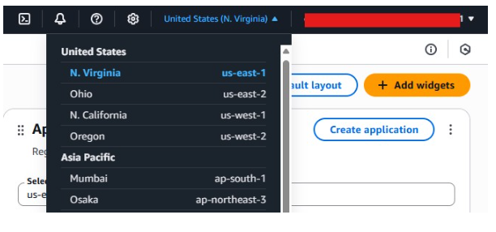

    - Choose us-east-1 (N.Virginia) Region.


---

## 🔑 Set Up (or Sign In to) Your Databricks Account

**Purpose of this Activity:** To make sure you have an active Databricks-on-AWS account before any infrastructure work begins. If you already have an account, you'll log in and capture your Databricks account ID. If not, you'll complete the Express Setup that creates a trial workspace and links it to AWS.

### Step 1: Do You Already Have a Databricks Account?

Before you continue, answer this question:

- **YES — I already have a Databricks account on AWS.** ➡️ Skip directly to **Step 6 (Log In and Capture Your Databricks Account ID)**.
- **NO — I need to create a new Databricks account.** ➡️ Continue with **Step 2** below.

### Step 2: Access the Databricks Login Page

Open a new browser tab and navigate to [https://login.databricks.com/](https://login.databricks.com/). Click the **Continue with Google** button (or use the email option you prefer).


### Step 3: Authenticate and Choose a Trial Type

1. Choose the Google/email account you wish to use for your Databricks environment.
2. On the **"What will you use Databricks for?"** screen, select **For work** (this enables the 14-day free trial and AWS integration).
3. Click **Start trial with express setup**.


### Step 4: Configure Account Details and Verify

- Enter your desired account name (e.g., `dbx-lab-account`).
- Select your country/region and click **Continue**.


- Complete the security/captcha challenge and click **Submit**.

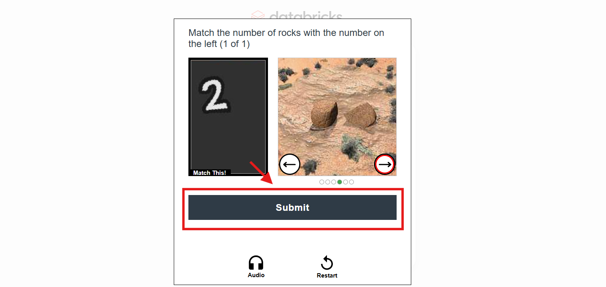

- On **"Tell us about yourself"**, pick **Learn data and AI** and choose up to 3 topics of interest, then click **Continue**.

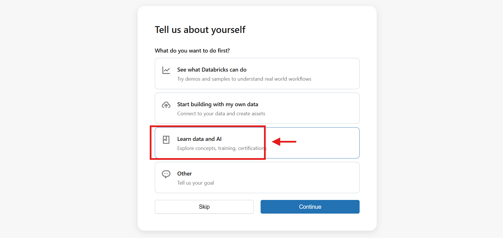


- Wait while Databricks initializes your account ("Setting up your account…" screen).


### Step 5: Express Setup — Link Databricks to AWS

This Express Setup automatically provisions a starter workspace and links it to AWS via CloudFormation. Completing this setup is a mandatory step to fully activate your Databricks account so we can begin building our cluster and pipeline in the upcoming activities.

1. When the workspace UI first loads, click your workspace name (top-right) → **Manage account**.

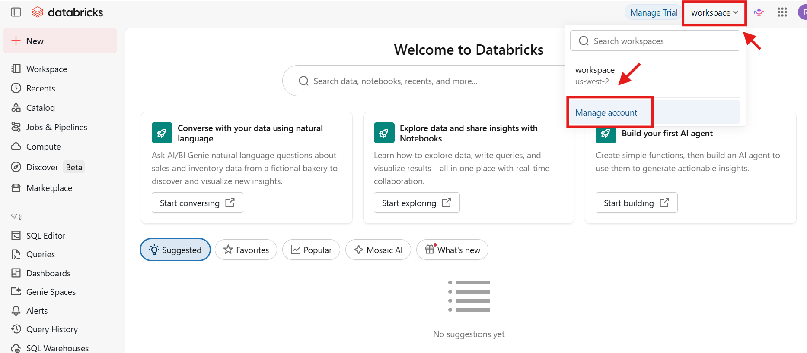

2. In the account console, click **Workspaces** from left navigation then **Create workspace**.

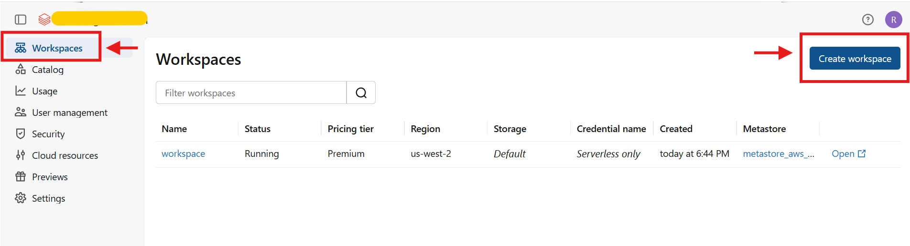

3. Fill out the form:
   - **Workspace name:** `dbx-governance-workspace`
   - **Region:** `N. Virginia (us-east-1)`
   - **Storage and compute:** **Use your existing cloud account**
   - Click **Continue**.

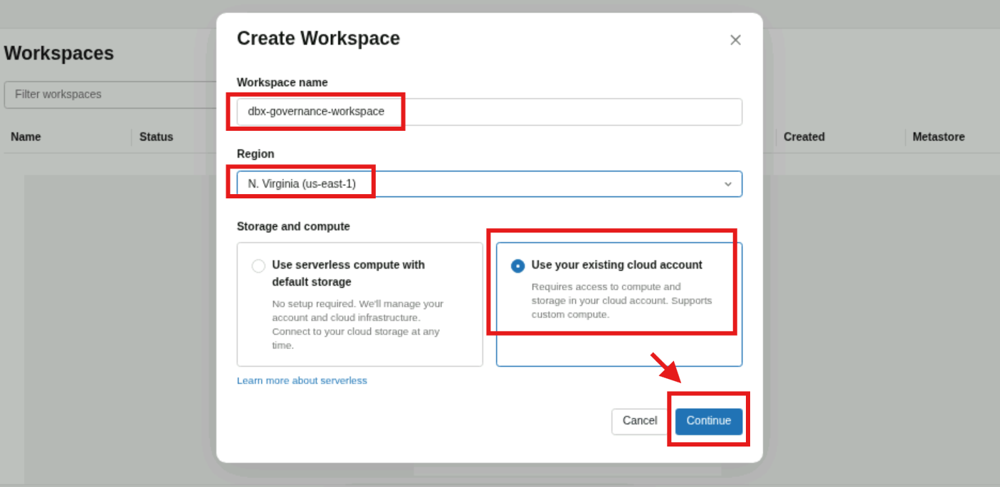

4. Configure your cloud credentials and storage:
   - Under **Compute credentials**, click the dropdown and select **Add cloud credentials**.

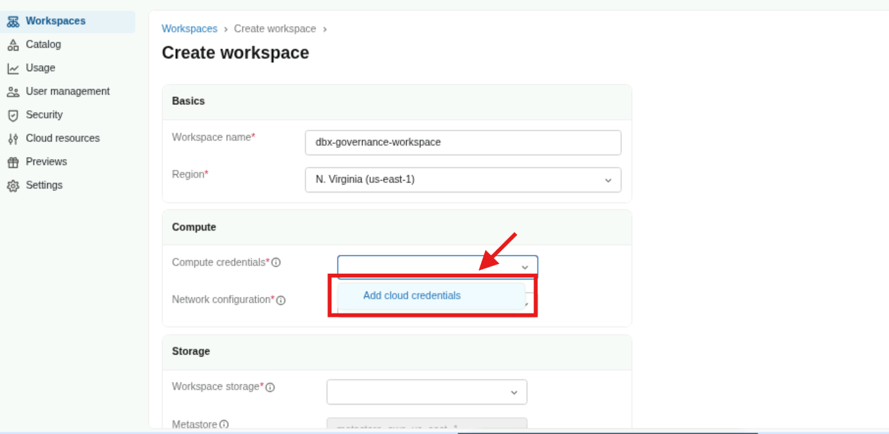

- In the _Add cloud credentials_ pop-up window, select **Add automatically** and click **OK**. Ensure **Workspace storage** is also set to **Add automatically**.

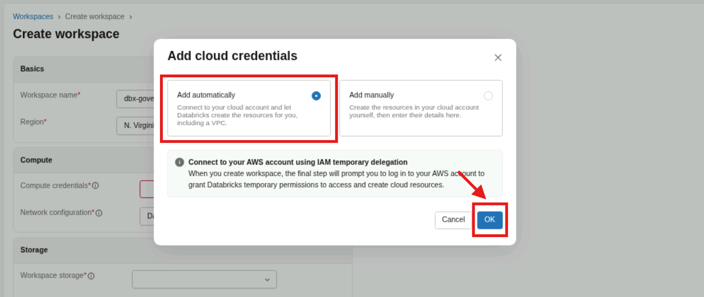

- Once both are configured, click the **Log in to AWS and create workspace** button at the bottom of the screen.

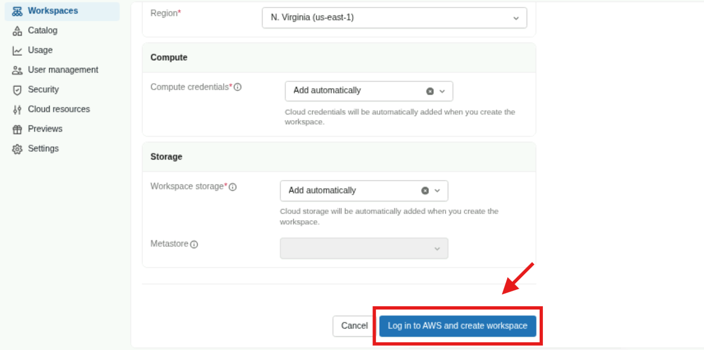

5. Review the AWS resources Databricks will create in the pop-up modal, then click **Initiate workspace creation**.


6. You'll be redirected to AWS — sign in and click **Allow access** to let Databricks provision the cross-account roles and resources.


7. Return to the Databricks console and wait until the workspace status flips to **Running**.

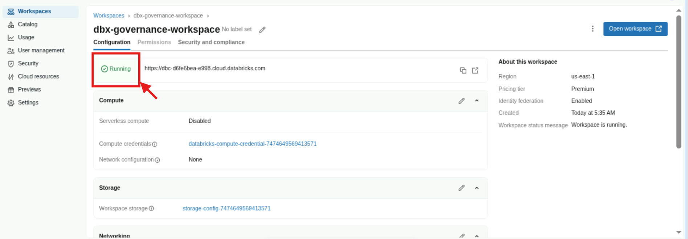

### Step 6: Log In and Capture Your Databricks Account ID

1. Open the **Databricks account console** at [https://accounts.cloud.databricks.com/](https://accounts.cloud.databricks.com/) and sign in.
2. Click the **user icon** (top-right) → **Account**.
3. **Copy** the **Account ID** (a UUID that looks like `e2-xxxxxxxx-xxxx-xxxx-xxxx-xxxxxxxxxxxx`) into a text note. Keep this Account ID handy, as it confirms your workspace is fully linked to your AWS environment.


> - The **Databricks account console** (`accounts.cloud.databricks.com`) is **not** the same as the workspace UI. The account console is where you provision workspaces; the workspace UI is where you write notebooks.
> - The **Account ID** is what binds your cross-account IAM role's external ID to **your** Databricks account.

### Step 7: Launch Your Workspace

From the Databricks Account Console, click on **Workspaces** in the left menu, locate your newly created workspace (`dbx-governance-workspace`), and click **Open** to launch the Databricks Workspace UI. Keep this tab open for the upcoming activities.

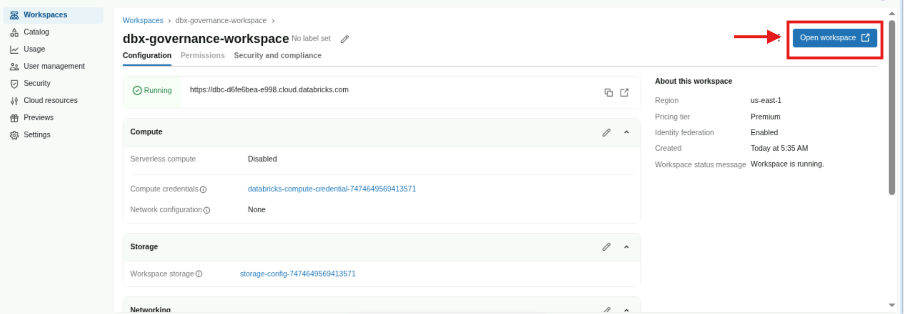

---

# Activity 1: Create the S3 Landing Structure and Upload Raw Files

**Purpose of this Activity:** To create the Amazon S3 bucket and folder structure that will act as the landing zone for the governance pipeline. You will upload three mock raw customer files into the raw landing path so Auto Loader can ingest them incrementally.

### Step 1.1: Create the S3 Bucket for the Governance Pipeline

1. Log in to the AWS Console and verify you are in the **us-east-1 (N. Virginia)** region.
2. In the top search bar, type **S3** and open the **S3 Console**.

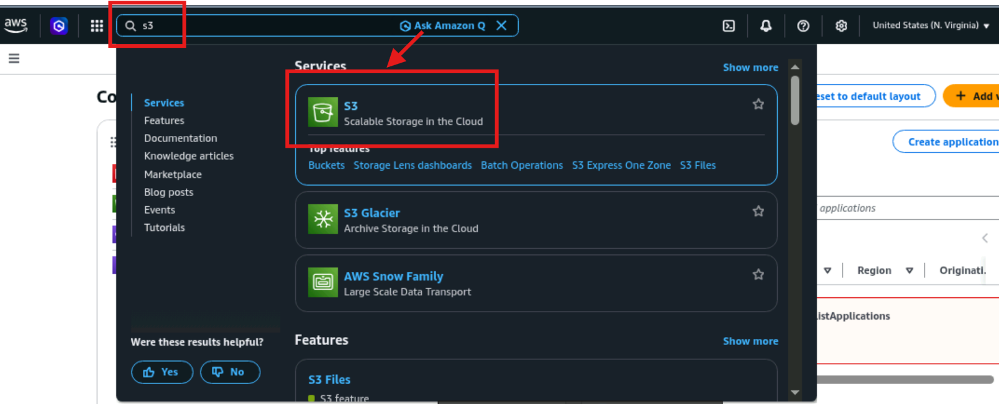

3. In the S3 Console landing page, click the orange **Create bucket** button.

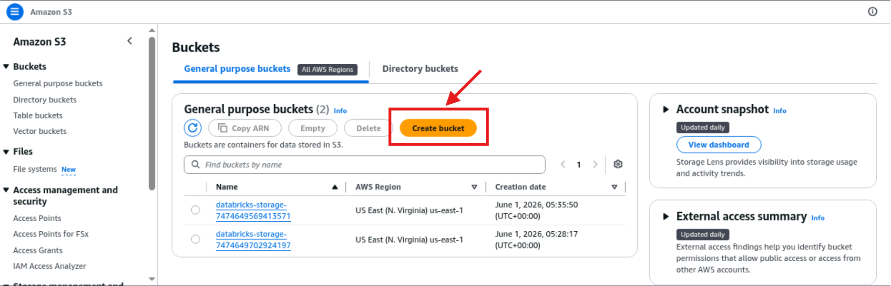

4. In the **Bucket name** field, enter a globally unique name using this pattern: `dbx-governance-<your-initials>-<random-4-digits>`.
5. In the **AWS Region** dropdown, confirm **US East (N. Virginia) us-east-1** is selected.

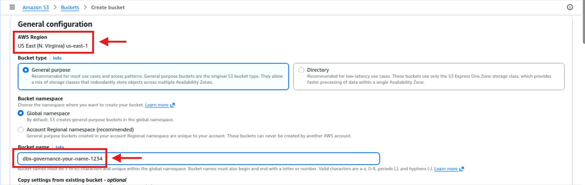

6. Under **Block Public Access settings for this bucket**, leave **Block all public access** checked.

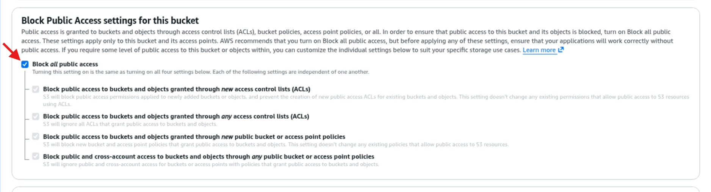

7. Under **Bucket Versioning**, select **Enable**.

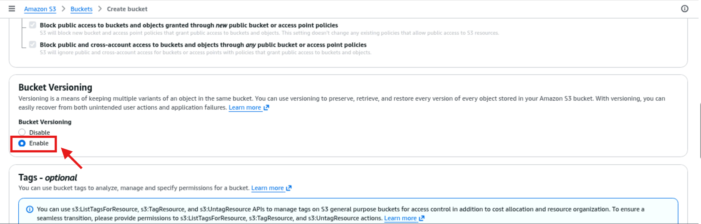

8. Scroll to the bottom of the page and click **Create bucket**.

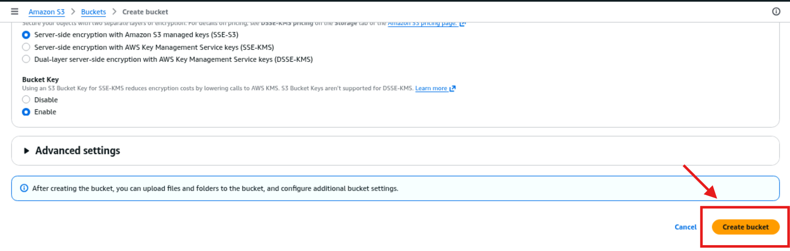

### Step 1.2: Create the Raw, Checkpoint, Curated, and Sharing Folders

1. In the S3 bucket list, click the name of the bucket you just created.

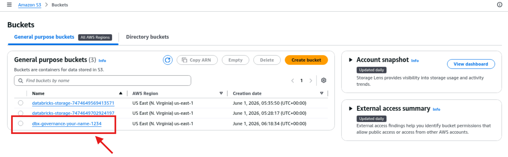

2. On the bucket **Objects** tab, click **Create folder**.

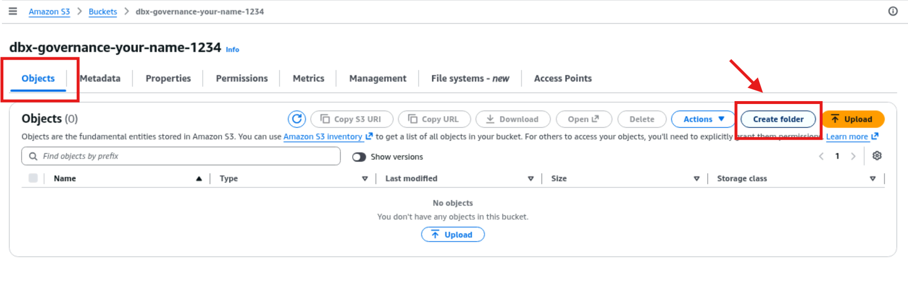

3. In the **Folder name** field, type `raw`.
4. Leave the default settings unchanged and click **Create folder**.

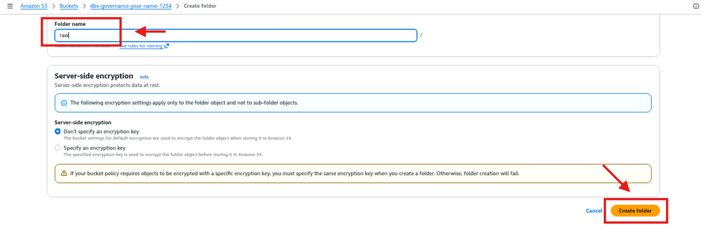

5. Repeat the same process to create a second folder named `checkpoints`.
6. Repeat the same process again to create a third folder named `curated`.
7. Repeat the same process one more time to create a fourth folder named `sharing`.

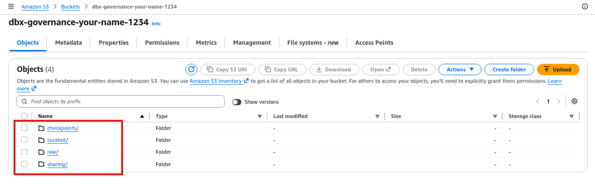

8. Click the `raw` folder name to open it.

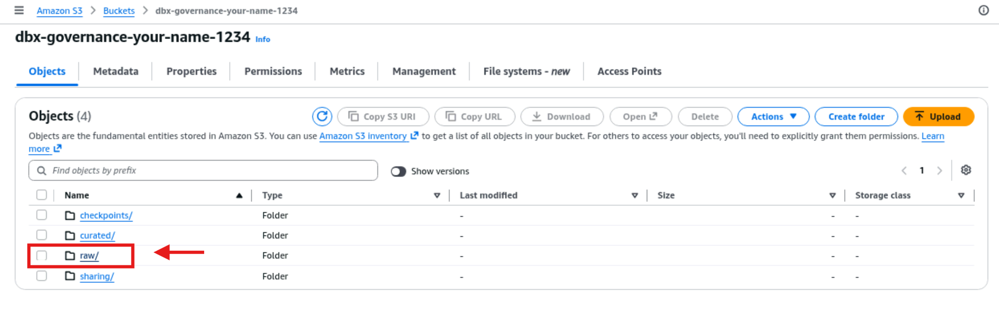

9. Inside the `raw` folder, click **Create folder** again.

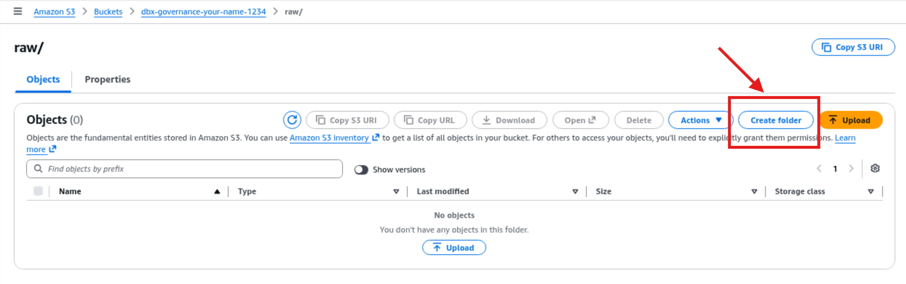

10. In the **Folder name** field, type `customers`.
11. Click **Create folder**.

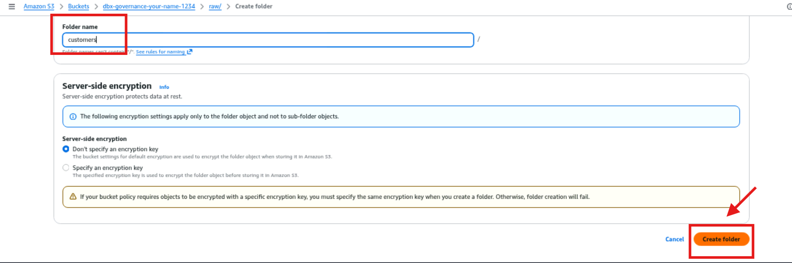

12. Go back to your bucket and click the `curated` folder name to open it.

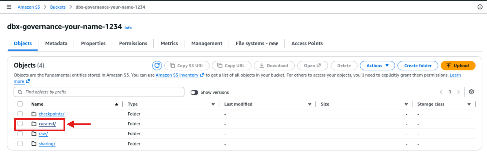

13. Inside the `curated` folder, click **Create folder**.
14. Create a folder named `gold`.

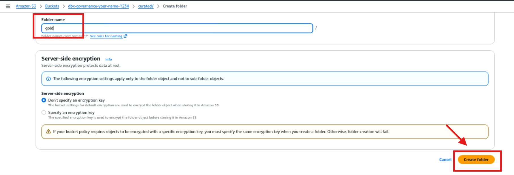

### Step 1.3: Upload the Raw Customer Files

1. In the breadcrumb path at the top of the S3 page, click your bucket name, then click the `raw` folder, then click the `customers` folder so you are inside `s3://<your-bucket>/raw/customers/`.
2. Click the **Upload** button.

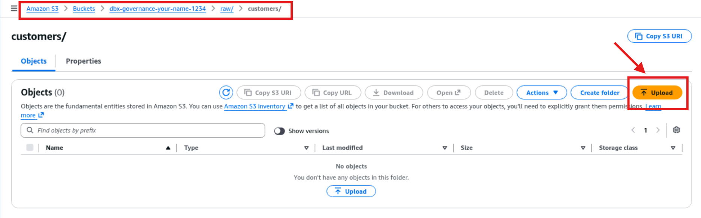

3. On the upload page, click **Add files**.

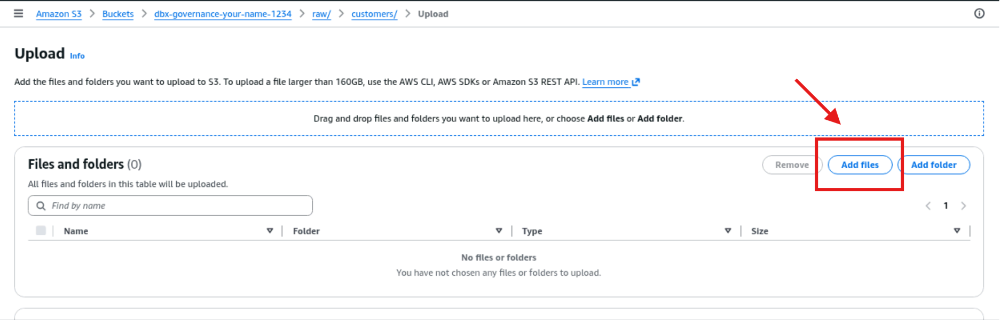

4. Browse to `~/Desktop/Project/` on your lab desktop.
5. Press `ctrl/cmd` and select these three files:
   - `customers_batch_01.csv`
   - `customers_batch_02.csv`
   - `customers_batch_03.csv`
6. Click **Open** to attach the files.

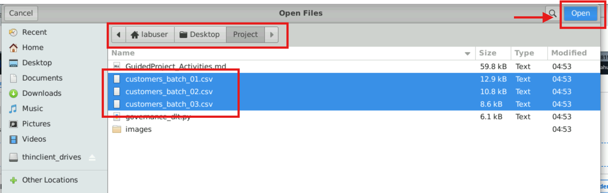

7. Scroll to the bottom of the upload page and click **Upload**.

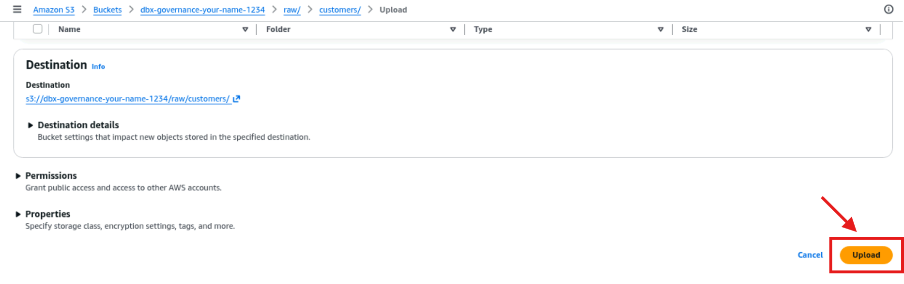

8. Wait until all three uploads show **Succeeded**.
9. Confirm the files are visible in the `raw/customers/` folder.

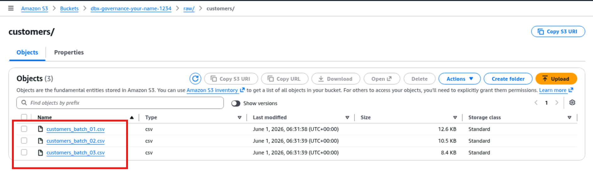

### Step 1.4: Create an IAM Role and Register it in Databricks

To allow your Databricks cluster to securely read the S3 bucket you just created, you need to create an AWS IAM Role (Instance Profile).

1. Return to your AWS Console. In the top search bar, type **IAM** and open the **IAM Console**.

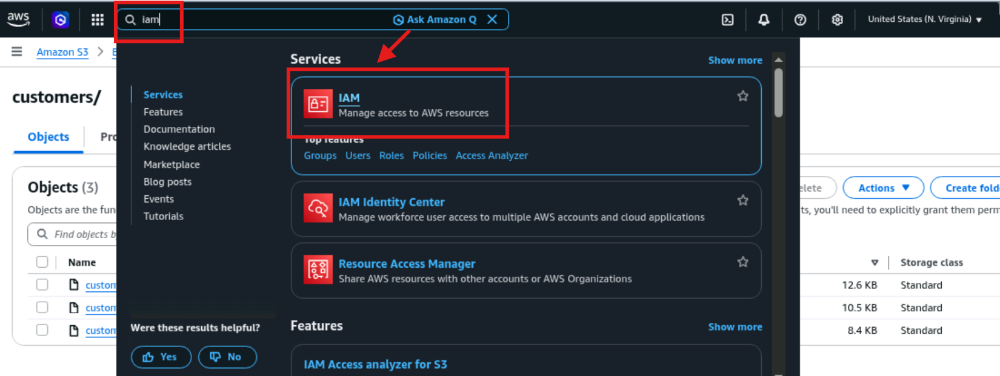

2. In the left navigation pane, click **Policies**, then click the blue **Create policy** button on the right.

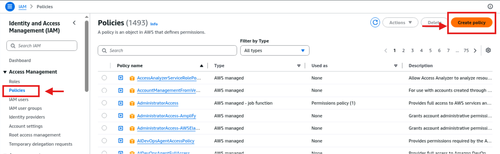

3. Switch to the **JSON** tab and replace the default text with the following JSON block.
   > **⚠️ IMPORTANT:** Replace `dbx-governance-<your-initials>-<random-4-digits>` with your exact bucket name.

- **Code Explanation:** This policy grants list access on the bucket and object-level read/write access on all objects under it.
- **Code Explanation:** These permissions are required for raw ingestion, checkpoints, curated Delta data, and sharing artifacts used in the lab.

```json
{
  "Version": "2012-10-17",
  "Statement": [
    {
      "Effect": "Allow",
      "Action": ["s3:ListBucket"],
      "Resource": [
        "arn:aws:s3:::dbx-governance-<your-initials>-<random-4-digits>"
      ]
    },
    {
      "Effect": "Allow",
      "Action": [
        "s3:PutObject",
        "s3:GetObject",
        "s3:DeleteObject",
        "s3:PutObjectAcl"
      ],
      "Resource": [
        "arn:aws:s3:::dbx-governance-<your-initials>-<random-4-digits>/*"
      ]
    }
  ]
}
```

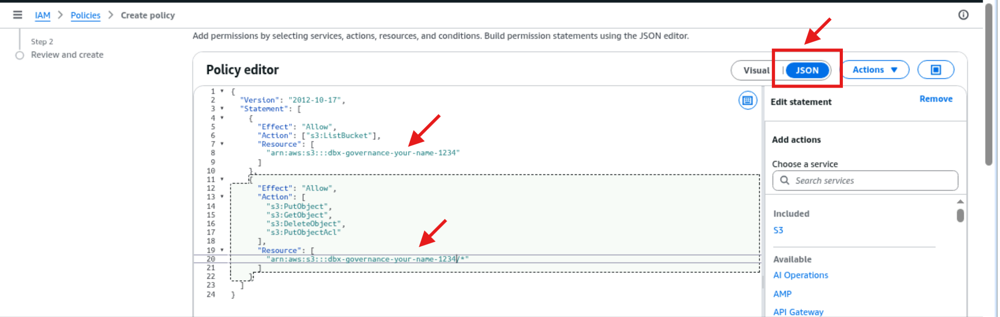

4. Click **Next**. Name the policy `GovernanceS3AccessPolicy` and click **Create policy**.

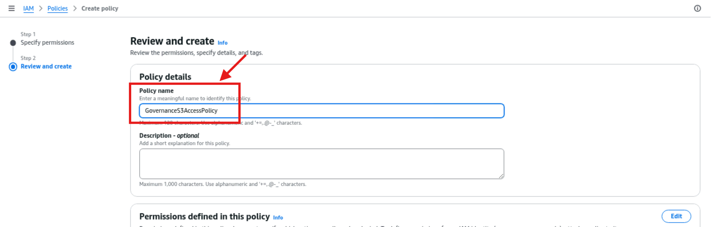
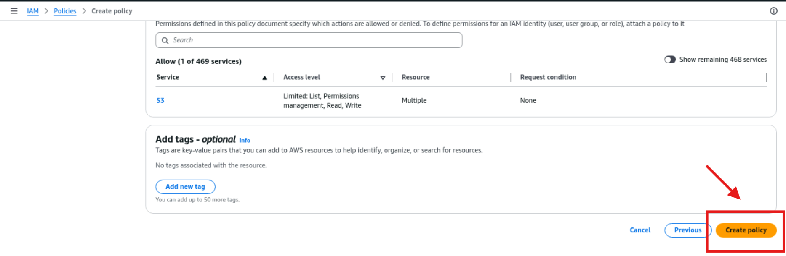

5. In the left navigation pane, click **Roles**, then click **Create role**.

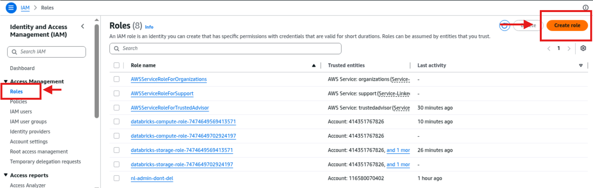

6. Select **AWS service** as the trusted entity type, and choose **EC2** from the common use cases. Click **Next**.

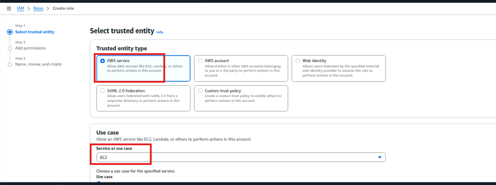

7. In the search bar, search for the `GovernanceS3AccessPolicy` you just created. Check the box next to it and click **Next**.

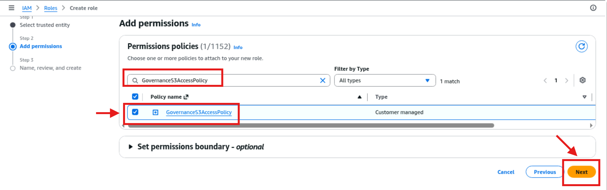

8. Name the role `DatabricksGovernanceRole` and click **Create role**.

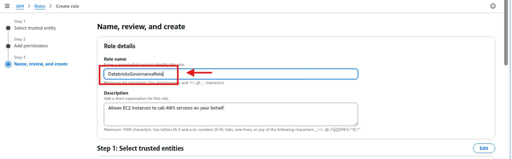
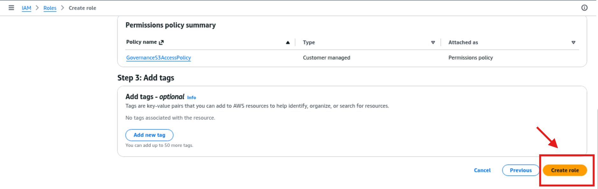

9. Once created, click on your new `DatabricksGovernanceRole` in the roles list to view its details.
10. Look for the **Instance Profile ARN**. Copy it to a safe place.

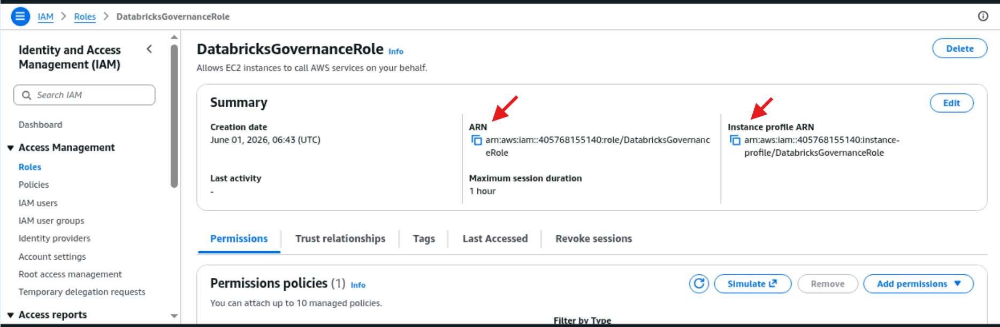

### Step 1.5: Prevent IAM Access Blockers (Grant PassRole)

_This is a critical platform engineering step to prevent `AccessDenied` or `sts:AssumeRole` errors when starting your Databricks cluster._

1. Still in the AWS IAM Console under **Roles**, search for `databricks-compute-role` or the specific cross-account role Databricks created during setup. Click on it.

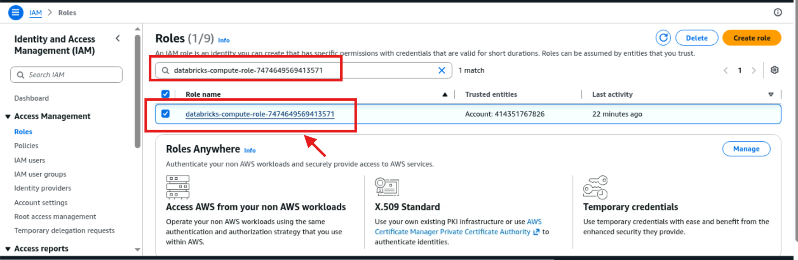

2. On the **Permissions** tab, click **Add permissions** -> **Create inline policy**.

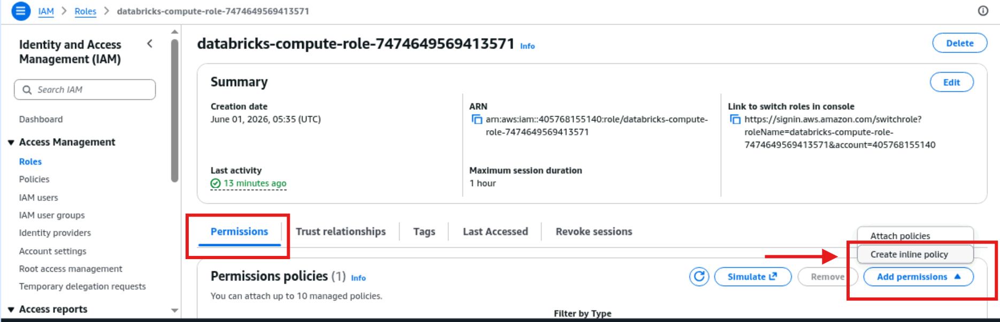

3. Switch to the **JSON** editor and paste the following snippet.
   Replace `<your-aws-account-id>` with your 12-digit AWS Account ID from the top right of your console.

- **Code Explanation:** This inline policy allows the Databricks-managed compute role to pass your new governance role to EC2 instances.
- **Code Explanation:** Without this permission, cluster startup commonly fails before any notebook work begins.

```json
{
  "Version": "2012-10-17",
  "Statement": [
    {
      "Effect": "Allow",
      "Action": "iam:PassRole",
      "Resource": "arn:aws:iam::<your-aws-account-id>:role/DatabricksGovernanceRole"
    }
  ]
}
```

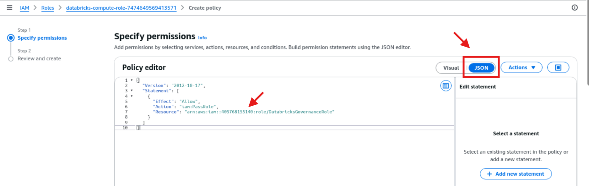

4. Click **Next**, name the policy `PassRoleToGovernance`, and click **Create policy**.

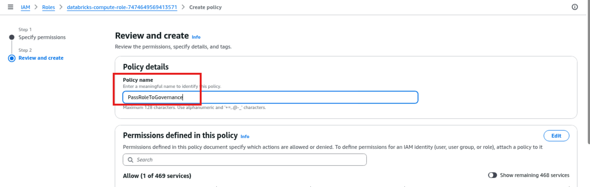
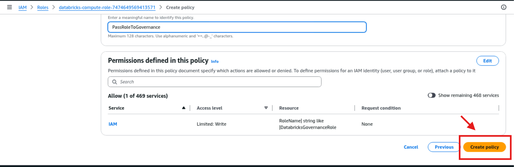

---

# Activity 2: Create a Trial-Friendly Cluster and Prepare the Workspace

**Purpose of this Activity:** To create a single free-trial-compliant Databricks cluster that will be reused for notebook development, Delta validation, DLT authoring, workflow execution, Unity Catalog inspection, Delta Sharing setup, and SQL verification. In a production environment, these workloads may use separate clusters or warehouses, but in this lab you will use one cluster to stay within free-trial limits.

> 🏢 **Real-World vs Free Trial:** In production, teams often separate interactive development clusters, job clusters, and SQL warehouses. For this free-trial lab, you will create **only one all-purpose cluster** and reuse it for all activities so you stay within the hard ceiling of **2 workers** and avoid unnecessary cost.

> 💰 **Free Trial Cost Reminder:** You are using the Databricks 14-day free trial. To avoid unexpected AWS charges, always terminate clusters immediately after each activity. Use only `m4.large` (or `m5.large`) nodes with a maximum of 2 workers. Do not leave clusters running overnight.

### Step 2.1: Getting Your AWS Credentials

Before configuring the Spark settings for the cluster, you need to retrieve your AWS credentials from the Lab portal. Follow these steps:

1. Switch to your Lab browser tab.
2. On the lab page, look for the **AWS credentials icon** (🔑) in the top toolbar or right-hand panel of the managed lab portal.

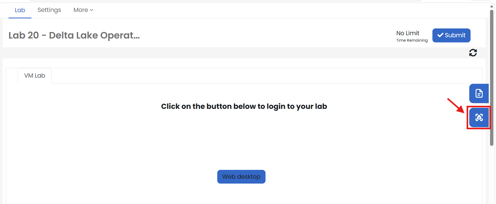

3. Click the icon to open the **Lab Credentials** panel. The panel will display:
   - **Login URL**
   - **accessId**
   - **accessKey**
   - **arn**


4. Copy the **accessId** value.
5. Copy the **accessKey** value.

> 💡 **Tip:** Keep this panel open so you can refer back to the credentials while filling in the Spark config and Environment variables in Databricks.

### Step 2.2: Create the All-Purpose Cluster

1. Open your Databricks workspace in a browser.


2. In the left navigation menu, click **Compute**.
3. On the Compute page, click the blue **Create compute** button.

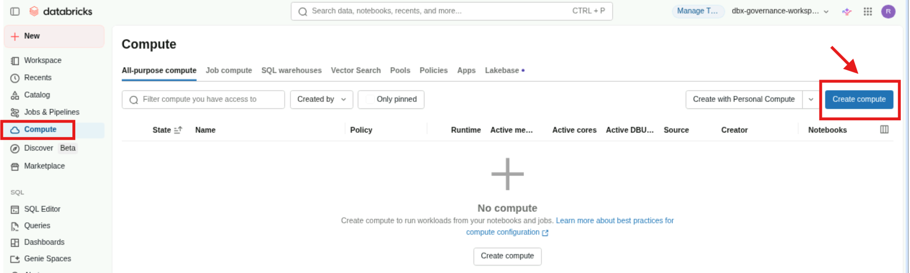

4. In the **Compute name** field, enter `dbx-governance-cluster`.
5. In the **Databricks runtime version** dropdown, select the latest **Standard LTS** runtime available, such as **14.3 LTS**.
6. Make sure **Photon acceleration** is **not enabled**.
7. Make sure you are **not** selecting any **Machine Learning** runtime.
8. In the **Worker type** or **Node type** dropdown, select **m4.large**.
9. If **m4.large** is not available in your region, select **m5.large** instead.
10. Under **Autoscaling**, enable autoscaling and set:
    - **Min workers:** `1`
    - **Max workers:** `2`

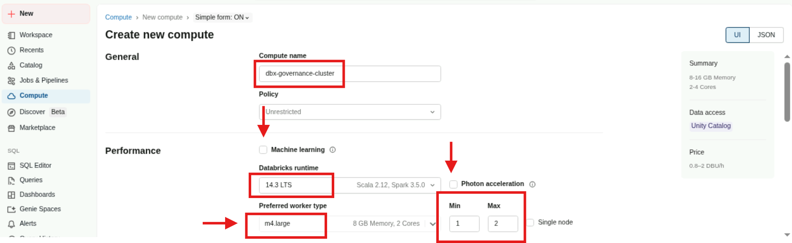

11. Under **Auto termination**, set **50 minutes**.
12. Expand the **Advanced performance** section and enable **Spot instances** if the checkbox is available.

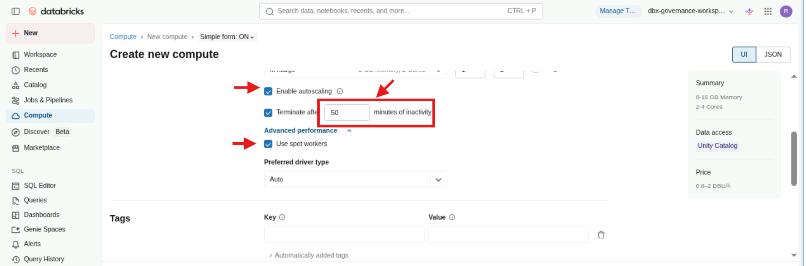

13. Scroll down and expand the **Advanced options** section.
14. Click the **Spark** tab. In the **Spark config** box, paste these 4 lines and replace the placeholders with your actual AWS keys:

- **Code Explanation:** These Spark properties allow the cluster to authenticate to S3 for raw ingestion and Delta storage paths.
- **Code Explanation:** Using the same credentials consistently across the cluster and DLT pipeline prevents avoidable access failures later in the lab.

```text
spark.hadoop.fs.s3n.awsAccessKeyId <YOUR-ACCESS-KEY-ID>
spark.hadoop.fs.s3n.awsSecretAccessKey <YOUR-SECRET-ACCESS-KEY>
spark.hadoop.fs.s3.awsAccessKeyId <YOUR-ACCESS-KEY-ID>
spark.hadoop.fs.s3.awsSecretAccessKey <YOUR-SECRET-ACCESS-KEY>
```

15. In the **Environment variables** box directly below, add:

- **Code Explanation:** These environment variables expose the same AWS credentials to notebook and pipeline runtime contexts that rely on environment-based access.

```text
AWS_ACCESS_KEY_ID=<YOUR-ACCESS-KEY-ID>
AWS_SECRET_ACCESS_KEY=<YOUR-SECRET-ACCESS-KEY>
```

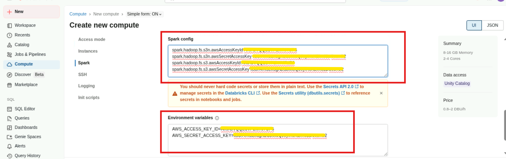

16. On the left side select **Instances**, under the EBS volume type select **SSD**, **Volume: 1** and **size: 32**. Scroll to the bottom of the page and click the blue **Create compute** button.

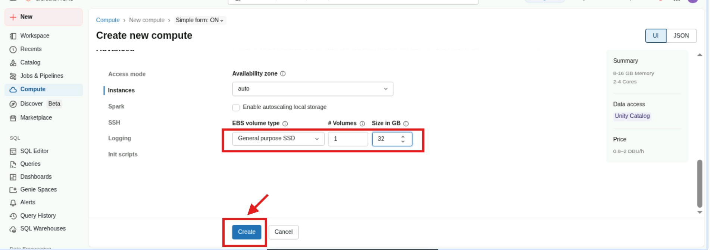

17. Wait until the cluster state changes to **Running**.

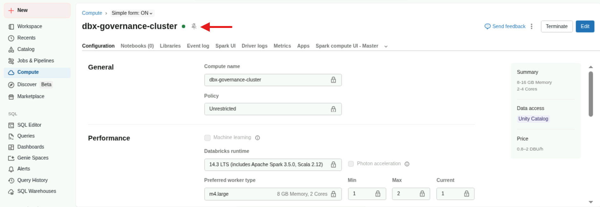

### Step 2.3: Create a Workspace Folder for the Lab

1. In the left navigation menu, click **Workspace**.
2. In the Workspace browser, click the **Users** folder.
3. Click your own user folder to open it.
4. In the upper-right area of the file browser, click **Create**.
5. From the dropdown menu, click **Folder**.

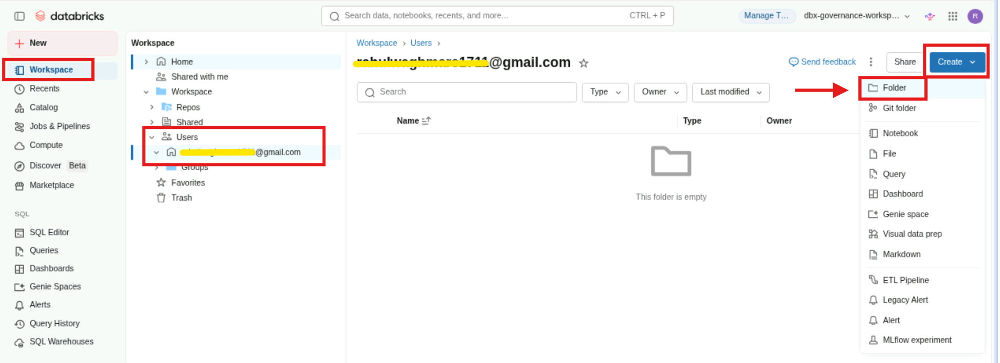

6. In the **Folder name** field, enter `governance_lab`.
7. Click **Create**.

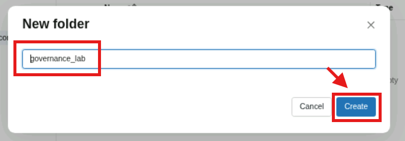

### Step 2.4: Create the Main Notebook for the Manual Pipeline

1. Stay inside your `governance_lab` folder.
2. In the upper-right area, click **Create** again.
3. From the dropdown menu, click **Notebook**.

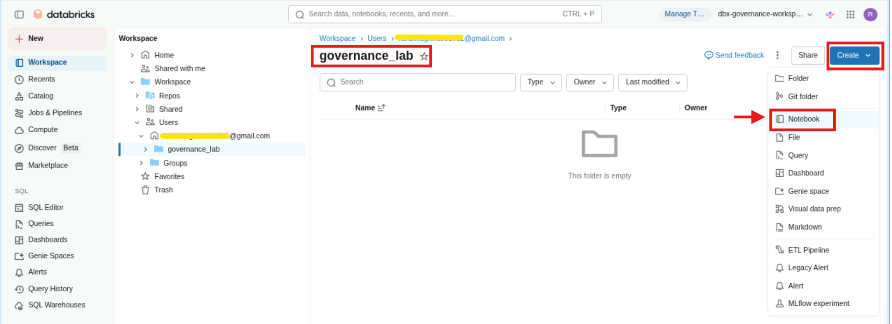

4. In the notebook top left corner replace the default notebook name with `governance_pipeline`.
5. When the notebook opens, look at the top-right compute selector.
6. Attach the notebook to **dbx-governance-cluster**.

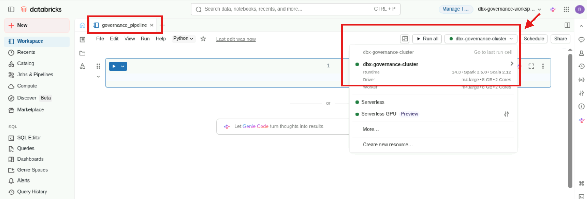

---

# Activity 3: Build the Bronze Layer with Auto Loader

**Purpose of this Activity:** To ingest raw files from S3 into a Bronze Delta table using Auto Loader. The Bronze layer should preserve raw fidelity, add ingestion metadata, and use checkpointing so the ingestion is incremental and safe to rerun.

### Step 3.1: Define Reusable Paths and Create the Bronze Database Objects

1. Open the `governance_pipeline` notebook if it is not already open.
2. In the first empty cell, paste the following code.

- **Code Explanation:** This code defines the S3 paths used throughout the lab and creates a schema named `governance_lab` so your tables are organized in one place.
- **Code Explanation:** It also switches the current SQL context to that schema so later table creation commands write to the correct namespace.

```python
bucket = "dbx-governance-<your-initials>-<random-4-digits>"

raw_customers_path = f"s3://{bucket}/raw/customers/"
bronze_path = f"s3://{bucket}/curated/bronze/customers/"
silver_path = f"s3://{bucket}/curated/silver/customers/"
gold_path = f"s3://{bucket}/curated/gold/customer_metrics/"
bronze_checkpoint = f"s3://{bucket}/checkpoints/bronze_customers/"
silver_checkpoint = f"s3://{bucket}/checkpoints/silver_customers/"

spark.sql("CREATE SCHEMA IF NOT EXISTS governance_lab")
spark.sql("USE governance_lab")
```

3. Replace the bucket placeholder with your actual bucket name before running the cell.
4. Click the **Run cell** icon or press **Shift + Enter**.

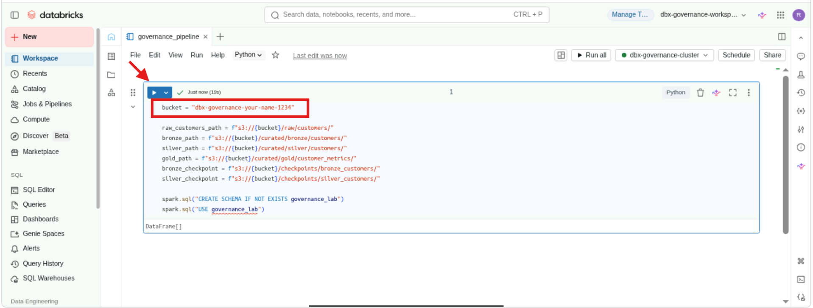

### Step 3.2: Create the Bronze Streaming DataFrame with Auto Loader

1. Create the next notebook cell and paste the following code.

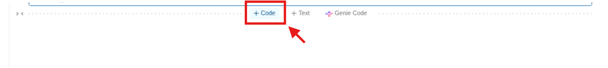

- **Code Explanation:** This code uses Auto Loader with the `cloudFiles` source to incrementally discover CSV files in the S3 raw landing path.
- **Code Explanation:** It infers the schema, captures the source file name, and appends an ingestion timestamp so the Bronze layer preserves operational metadata.

```python
from pyspark.sql.functions import current_timestamp, col

bronze_stream = (
    spark.readStream
         .format("cloudFiles")
         .option("cloudFiles.format", "csv")
         .option("cloudFiles.inferColumnTypes", "true")
         .option("cloudFiles.schemaLocation", bronze_checkpoint + "_schema")
         .option("header", "true")
         .load(raw_customers_path)
         .withColumn("source_file", col("_metadata.file_path"))
         .withColumn("ingestion_ts", current_timestamp())
)
```

2. Run the cell.

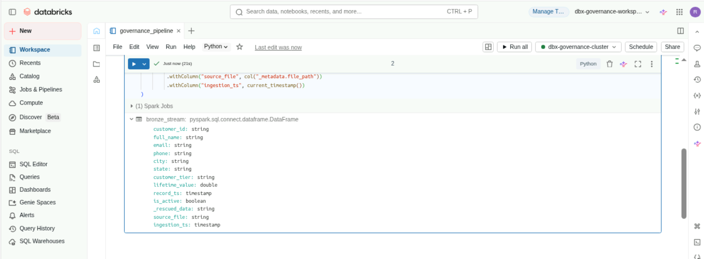

### Step 3.3: Write the Bronze Stream into a Delta Table

1. Create the next notebook cell and paste the following code.


- **Code Explanation:** This code writes the Auto Loader stream into Delta format using a checkpoint path so ingestion is exactly-once and restart-safe.
- **Code Explanation:** It also registers the output as a managed table named `bronze_customers` for easy querying.

```python
bronze_query = (
    bronze_stream.writeStream
        .format("delta")
        .option("checkpointLocation", bronze_checkpoint)
        .trigger(availableNow=True)
        .toTable("bronze_customers")
)
```

2. Run the cell and wait for the stream to finish.
3. Add a validation cell and paste the following query.

- **Code Explanation:** This query confirms that the Bronze table exists and shows the raw records plus metadata columns added during ingestion.

```python
display(spark.sql("""
SELECT customer_id, full_name, email, phone, city, state, customer_tier, lifetime_value, record_ts, source_file, ingestion_ts
FROM bronze_customers
ORDER BY record_ts
"""))
```

4. Run the validation cell.

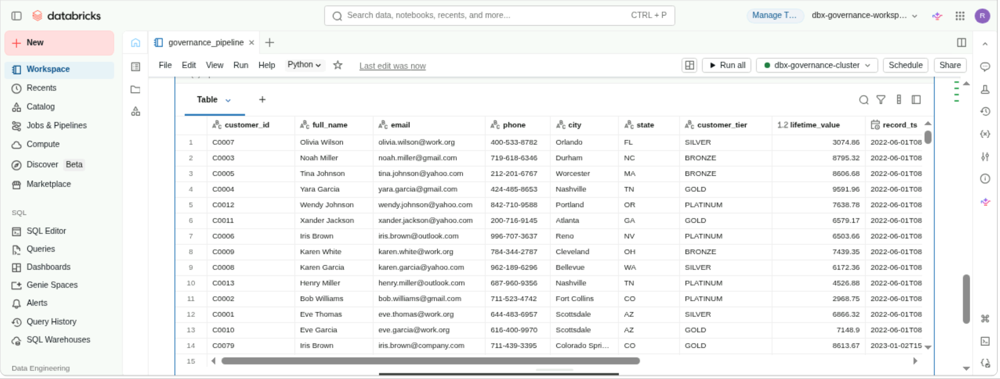

---

# Activity 4: Build the Silver Layer with Cleansing, Deduplication, and Delta DML Validation

**Purpose of this Activity:** To transform the raw Bronze data into a trusted Silver table by enforcing business rules, standardizing values, removing duplicates, and validating Delta Lake DML operations that are commonly used in production pipelines.

### Step 4.1: Create the Silver Table

1. Create the next notebook cell and paste the following code.


- **Code Explanation:** This SQL creates the Silver Delta table that will hold cleansed and deduplicated customer records.
- **Code Explanation:** The schema intentionally retains PII columns because governance controls will be applied later through Unity Catalog objects and permissions.

```python
spark.sql("""
CREATE TABLE IF NOT EXISTS silver_customers (
  customer_id STRING,
  full_name STRING,
  email STRING,
  phone STRING,
  city STRING,
  state STRING,
  customer_tier STRING,
  lifetime_value DOUBLE,
  record_ts TIMESTAMP,
  is_active BOOLEAN,
  source_file STRING,
  ingestion_ts TIMESTAMP
)
USING DELTA
""")
```

2. Run the cell.

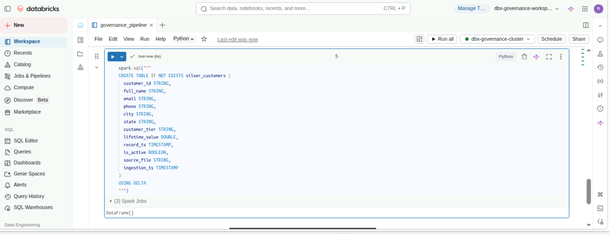

### Step 4.2: Cleanse and Deduplicate Bronze Records into Silver

1. Create the next notebook cell and paste the following code.


- **Code Explanation:** This code filters invalid rows, standardizes tier values, converts timestamps, and keeps only the latest record for each `customer_id`.
- **Code Explanation:** The result is a trusted Silver DataFrame suitable for governed downstream use.

```python
from pyspark.sql.functions import upper, trim, to_timestamp, row_number
from pyspark.sql.window import Window

valid_tiers = ["BRONZE", "SILVER", "GOLD", "PLATINUM"]

silver_df = (
    spark.table("bronze_customers")
         .withColumn("customer_tier", upper(trim(col("customer_tier"))))
         .withColumn("record_ts", to_timestamp(col("record_ts")))
         .filter(col("customer_id").isNotNull())
         .filter(trim(col("customer_id")) != "")
         .filter(col("full_name").isNotNull())
         .filter(col("lifetime_value") >= 0)
         .filter(col("customer_tier").isin(valid_tiers))
)

dedupe_window = Window.partitionBy("customer_id").orderBy(col("record_ts").desc(), col("ingestion_ts").desc())

silver_deduped = (
    silver_df.withColumn("rn", row_number().over(dedupe_window))
             .filter(col("rn") == 1)
             .drop("rn")
)
```

2. Run the cell.

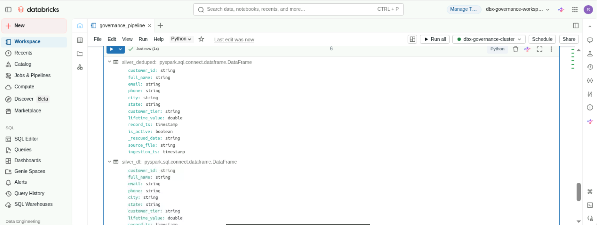

### Step 4.3: Merge the Cleansed Records into the Silver Table

1. Create the next notebook cell and paste the following code.


- **Code Explanation:** This code performs an idempotent Delta `MERGE` so rerunning the notebook updates existing customers and inserts new ones safely.
- **Code Explanation:** Using `MERGE` prevents duplicate target rows when the pipeline is rerun.

```python
silver_deduped.createOrReplaceTempView("silver_updates")

spark.sql("""
MERGE INTO silver_customers AS target
USING silver_updates AS source
ON target.customer_id = source.customer_id
WHEN MATCHED THEN UPDATE SET *
WHEN NOT MATCHED THEN INSERT *
""")
```

2. Run the cell.

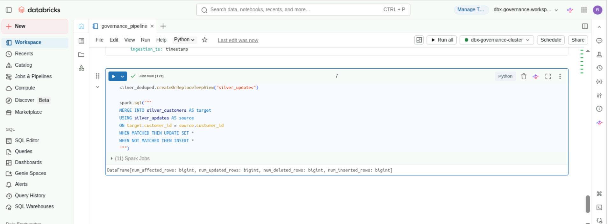

### Step 4.4: Validate Silver Quality Rules

1. Create the next notebook cell and paste the following code.


- **Code Explanation:** These queries verify that invalid rows were removed and duplicates were eliminated from the Silver table.
- **Code Explanation:** A clean Silver layer is required before any governed Gold object is created.

```python
display(spark.sql("""
SELECT COUNT(*) AS invalid_rows
FROM silver_customers
WHERE customer_id IS NULL
   OR trim(customer_id) = ''
   OR full_name IS NULL
   OR lifetime_value < 0
   OR customer_tier NOT IN ('BRONZE','SILVER','GOLD','PLATINUM')
"""))

display(spark.sql("""
SELECT customer_id, COUNT(*) AS row_count
FROM silver_customers
GROUP BY customer_id
HAVING COUNT(*) > 1
"""))
```

2. Run the cell.
3. Confirm that:
   - `invalid_rows` returns `0`
   - the duplicate check returns no rows

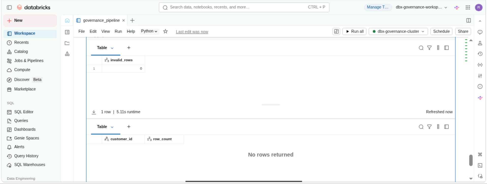

### Step 4.5: Validate Delta Lake DML Operations

1. Create the next notebook cell and paste the following SQL statements.


- **Code Explanation:** These statements demonstrate `INSERT`, `UPDATE`, and `DELETE` operations directly on the Silver Delta table.
- **Code Explanation:** Running these commands creates multiple Delta versions that you will inspect later with history and time travel.

```python
spark.sql("""
INSERT INTO silver_customers
VALUES ('C999','Test Customer','test.customer@example.com','555-0100','Austin','TX','GOLD',2500.00,current_timestamp(),true,'manual_insert',current_timestamp())
""")

spark.sql("""
UPDATE silver_customers
SET customer_tier = 'PLATINUM'
WHERE customer_id = 'C999'
""")

spark.sql("""
DELETE FROM silver_customers
WHERE customer_id = 'C999'
""")
```

2. Run the cell.

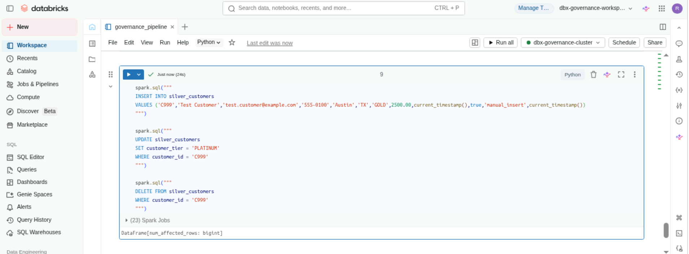

### Step 4.6: Validate Delta Lake MERGE with a Staged Update

1. Create the next notebook cell and paste the following code.


- **Code Explanation:** This code creates a staged update DataFrame and merges it into the Silver table.
- **Code Explanation:** It demonstrates the production-grade upsert pattern used for incremental customer changes.

```python
merge_source = spark.createDataFrame(
    [
        ("C002", "Updated Customer", "updated.customer@example.com", "555-0199", "Seattle", "WA", "PLATINUM", 9999.99, True)
    ],
    ["customer_id", "full_name", "email", "phone", "city", "state", "customer_tier", "lifetime_value", "is_active"]
)

merge_source.createOrReplaceTempView("merge_source_customers")

spark.sql("""
MERGE INTO silver_customers AS target
USING (
  SELECT
    customer_id,
    full_name,
    email,
    phone,
    city,
    state,
    customer_tier,
    lifetime_value,
    current_timestamp() AS record_ts,
    is_active,
    'merge_source' AS source_file,
    current_timestamp() AS ingestion_ts
  FROM merge_source_customers
) AS source
ON target.customer_id = source.customer_id
WHEN MATCHED THEN UPDATE SET *
WHEN NOT MATCHED THEN INSERT *
""")
```

2. Run the cell.

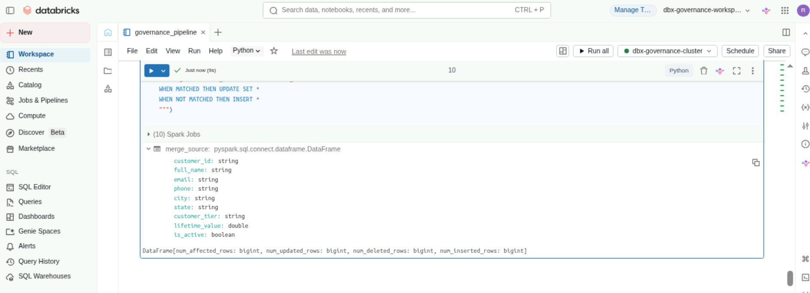

---

# Activity 5: Build the Gold Layer and Validate Delta Lake History

**Purpose of this Activity:** To create a business-ready Gold table from the Silver layer and then validate Delta Lake operational features such as history inspection and time travel.

### Step 5.1: Create the Gold Aggregate Table

1. Create the next notebook cell and paste the following code.


- **Code Explanation:** This code derives a reporting table by grouping Silver records by state and customer tier.
- **Code Explanation:** It calculates customer counts, active customer counts, and total lifetime value for governed analytics.

```python
from pyspark.sql.functions import sum as _sum, count, expr

gold_df = (
    spark.table("silver_customers")
         .groupBy("state", "customer_tier")
         .agg(
             count("customer_id").alias("customer_count"),
             _sum(expr("CASE WHEN is_active THEN 1 ELSE 0 END")).alias("active_customer_count"),
             _sum("lifetime_value").alias("total_lifetime_value")
         )
)

gold_df.write.format("delta").mode("overwrite").saveAsTable("gold_customer_metrics")
```

2. Run the cell.

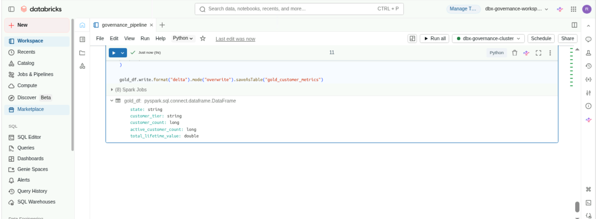

### Step 5.2: Validate Gold Output

1. Create the next notebook cell and paste the following query.


- **Code Explanation:** This query displays the Gold metrics so you can confirm the table contains aggregated business-ready rows rather than raw customer records.

```python
display(spark.sql("""
SELECT *
FROM gold_customer_metrics
ORDER BY state, customer_tier
"""))
```

2. Run the cell.

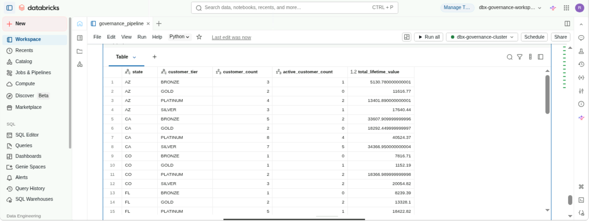

### Step 5.3: Inspect Delta History and Run a Time Travel Query

1. Create the next notebook cell and paste the following code.


- **Code Explanation:** `DESCRIBE HISTORY` shows the transaction versions written to the Silver table.
- **Code Explanation:** The time travel query reads an earlier version of the table so you can validate Delta Lake versioned access.

```python
display(spark.sql("DESCRIBE HISTORY silver_customers"))
```

2. Run the cell and note an earlier version number shown in the results.

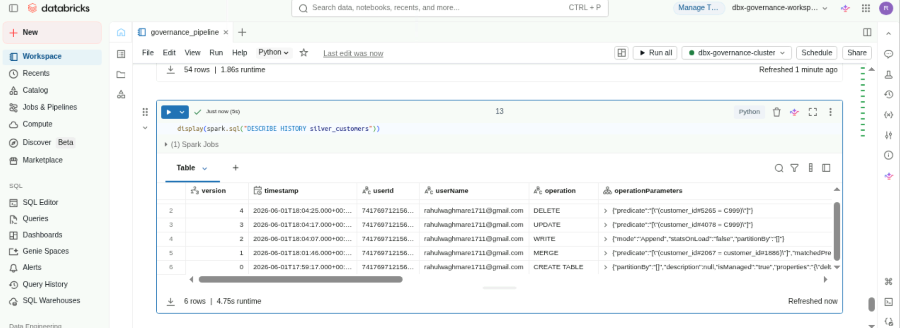

3. In a new cell, paste the following query and replace `<earlier-version-number>` with a valid older version from the history output.

- **Code Explanation:** This query reads a previous version of the Silver table, proving that Delta Lake preserves historical snapshots.

```python
display(spark.sql("""
SELECT *
FROM silver_customers VERSION AS OF <earlier-version-number>
ORDER BY record_ts
"""))
```

4. Run the cell.

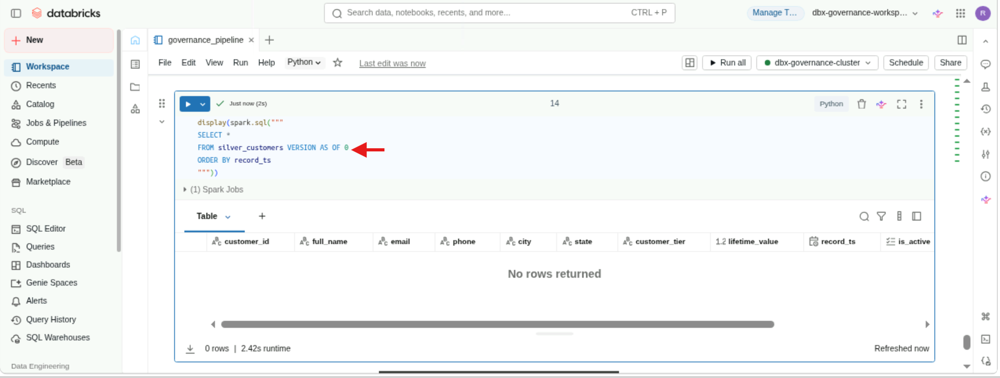

---

# Activity 6: Re-Implement the Pipeline with Delta Live Tables and Data Quality

**Purpose of this Activity:** To build a declarative version of the governance pipeline using Delta Live Tables. You will use the provided `governance_dlt.py` file to create Bronze, Silver, and Gold logic and add expectation rules so data quality is enforced at the Silver layer.

> ⚠️ **CRITICAL UPDATE:** Before moving to the next step, you must edit the `bucket` variable in the notebook to match your actual S3 bucket name. **Do NOT click "Run All"** — DLT notebooks cannot be run interactively; they must be executed via a Pipeline.

- Browse to `~/Desktop/Project/` on your lab desktop and open the `governance_dlt.py` file in a simple text editor (such as VS Code, Notepad, or TextEdit).
- Replace the placeholder bucket name with your actual bucket name.
- Save the file.

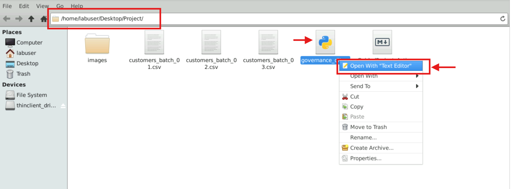
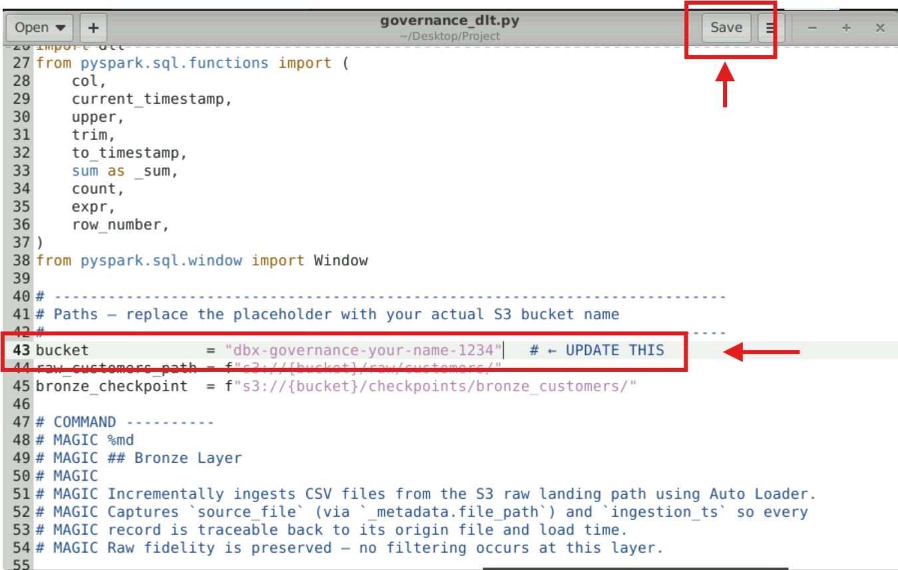

### Step 6.1: Import the DLT Notebook

1. In the left navigation menu, click **Workspace**.
2. Click **Users** and open your user folder.
3. Open the `governance_lab` folder you created earlier.
4. In the upper-right area, click the **kebab menu (three vertical dots)** next to the Share button.
5. Select **Import** from the dropdown menu.

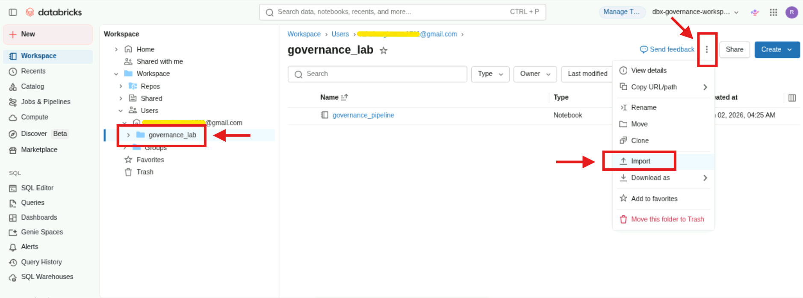

6. In the Import dialog, select **File** or **Drop file here**.

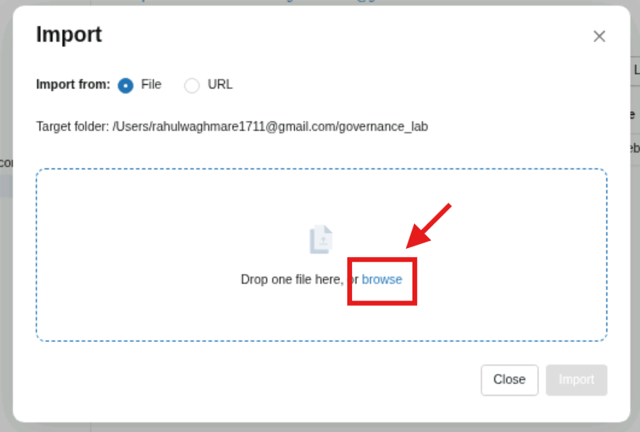

7. Browse to `~/Desktop/Project/` and select the `governance_dlt.py` file.

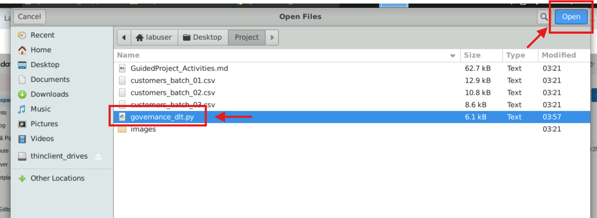

8. Click **Import**. The file will automatically open as a Databricks Notebook.

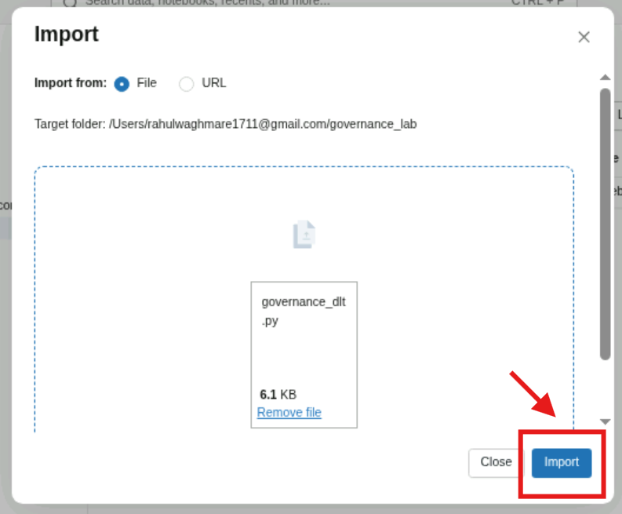

### Step 6.2: Review the Imported DLT Code

> Review the imported `governance_dlt` notebook. Ensure it matches the expected DLT structure.

- **Code Explanation:** This code defines Bronze, Silver, and Gold DLT tables using declarative decorators.
- **Code Explanation:** It uses expectation rules on the Silver layer to drop invalid rows before they reach trusted downstream tables.

```python
import dlt
from pyspark.sql.functions import col, current_timestamp, upper, trim, to_timestamp, sum as _sum, count, expr, row_number
from pyspark.sql.window import Window

bucket = "dbx-governance-<your-initials>-<random-4-digits>"  # UPDATE THIS
raw_customers_path = f"s3://{bucket}/raw/customers/"
bronze_checkpoint = f"s3://{bucket}/checkpoints/bronze_customers/"

@dlt.table(
    name="dlt_bronze_customers",
    comment="Bronze ingestion from S3 using Auto Loader"
)
def dlt_bronze_customers():
    return (
        spark.readStream
             .format("cloudFiles")
             .option("cloudFiles.format", "csv")
             .option("cloudFiles.inferColumnTypes", "true")
             .option("cloudFiles.schemaLocation", bronze_checkpoint + "_dlt_schema")
             .option("header", "true")
             .load(raw_customers_path)
             .withColumn("source_file", col("_metadata.file_path"))
             .withColumn("ingestion_ts", current_timestamp())
    )

@dlt.table(
    name="dlt_silver_customers",
    comment="Silver cleansed and deduplicated customers"
)
@dlt.expect_or_drop("valid_customer_id", "customer_id IS NOT NULL AND trim(customer_id) != ''")
@dlt.expect_or_drop("valid_name", "full_name IS NOT NULL")
@dlt.expect_or_drop("valid_lifetime_value", "lifetime_value >= 0")
@dlt.expect_or_drop("valid_tier", "upper(trim(customer_tier)) IN ('BRONZE','SILVER','GOLD','PLATINUM')")
def dlt_silver_customers():
    df = (
        dlt.read("dlt_bronze_customers")
           .withColumn("customer_tier", upper(trim(col("customer_tier"))))
           .withColumn("record_ts", to_timestamp(col("record_ts")))
    )
    w = Window.partitionBy("customer_id").orderBy(col("record_ts").desc(), col("ingestion_ts").desc())
    return (
        df.withColumn("rn", row_number().over(w))
          .filter(col("rn") == 1)
          .drop("rn")
    )

@dlt.table(
    name="dlt_gold_customer_metrics",
    comment="Gold customer metrics by state and tier"
)
def dlt_gold_customer_metrics():
    return (
        dlt.read("dlt_silver_customers")
           .groupBy("state", "customer_tier")
           .agg(
               count("customer_id").alias("customer_count"),
               _sum(expr("CASE WHEN is_active THEN 1 ELSE 0 END")).alias("active_customer_count"),
               _sum("lifetime_value").alias("total_lifetime_value")
           )
    )
```

1. Ensure the `bucket` variable is updated to match your actual S3 bucket name.
2. **Do not run the notebook interactively.**

### Step 6.3: Configure and Run the DLT Pipeline

> 💰 **Free Trial Cost Reminder:** You are using the Databricks 14-day free trial. To avoid unexpected AWS charges, always terminate clusters immediately after each activity. Use only `m4.large` (or `m5.large`) nodes with a maximum of 2 workers. Do not leave clusters running overnight.

1. In the left navigation menu, click **Jobs & Pipelines**.
2. Under the create section, click the **ETL pipeline** card.

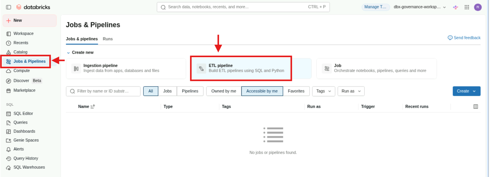

3. In the pipeline editor, click the **⚙️ Pipeline configuration** gear icon.

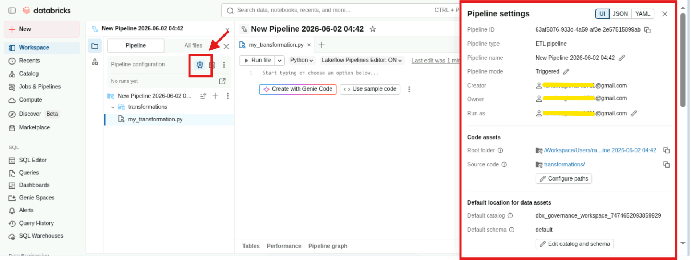

4. Configure the following:
   - **Pipeline name:** `governance_dlt_pipeline`
   - **Pipeline mode:** Triggered

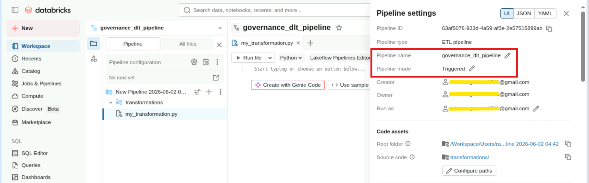

5. Under **Code assets**, click **Configure paths**

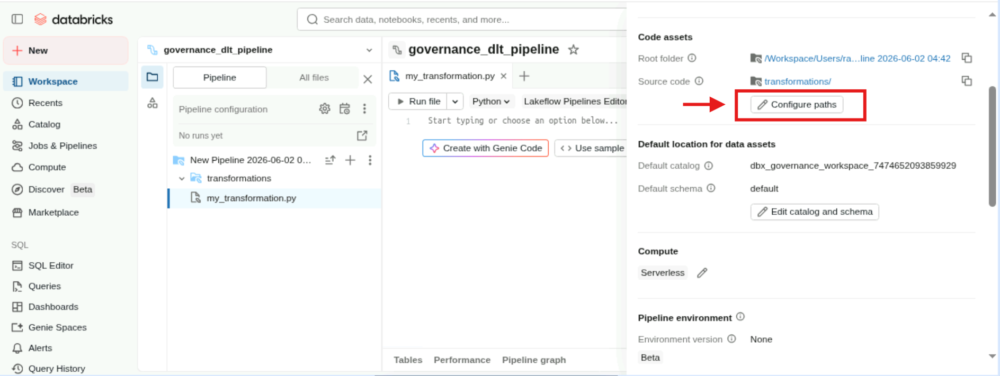

- add the imported notebook path for `governance_dlt`.
- remove the default path

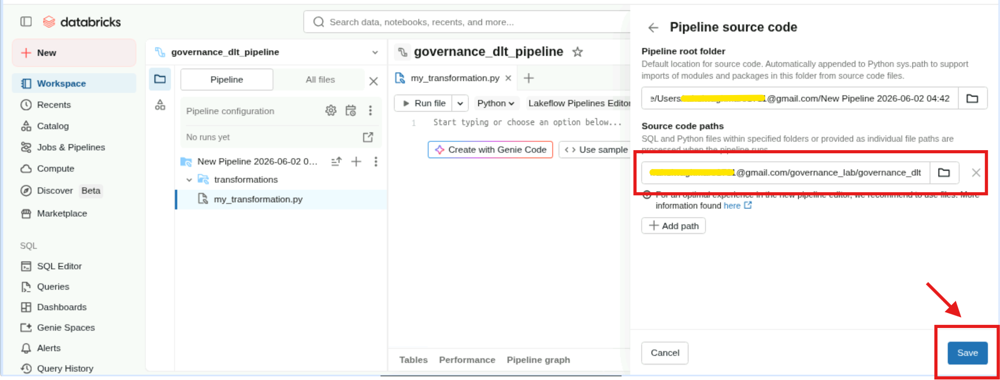

6. Under **Default location for data assets**, click **Edit catalog and schema**.

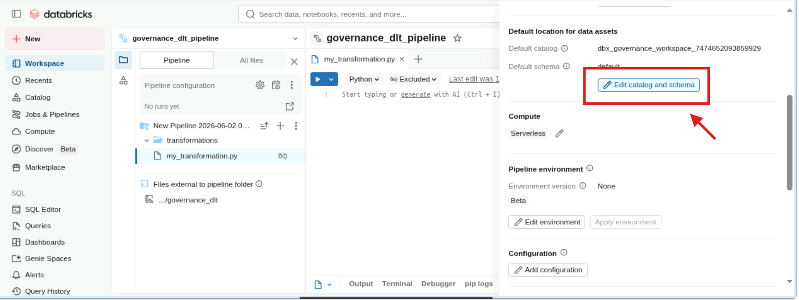

- **Default catalog:** Select your workspace default catalog
- **Default schema:** Type `governance_lab`

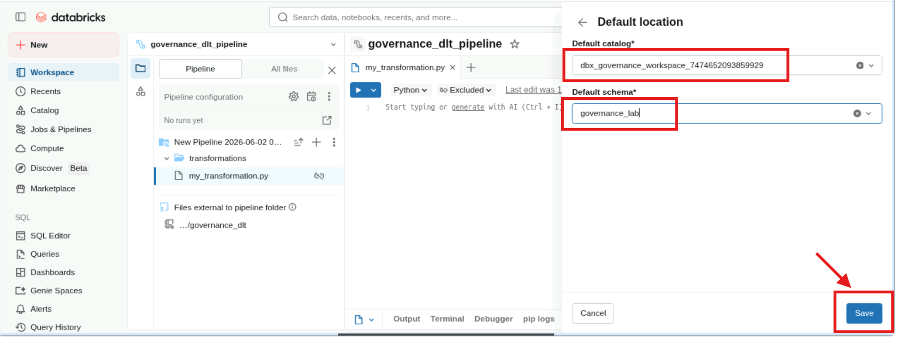

7. In the **Compute** section:
   - Disable **Serverless** if enabled.
   - Set **Min workers** to `1`
   - Set **Max workers** to `1` or `2`
   - Under **Worker type**, select **m4.large** if available, otherwise **m5.large**
   - Ensure **Photon** is disabled
   - Save the compute settings

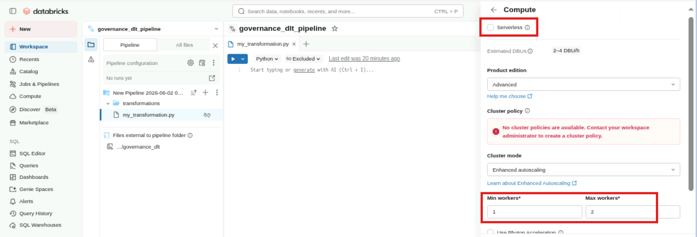
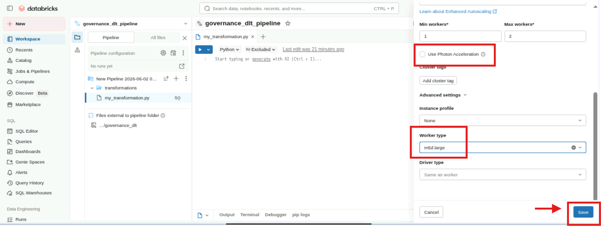

8. **CRITICAL: AWS Credentials Configuration:**
   - Still in the right-hand settings panel, scroll down to **Configuration**.

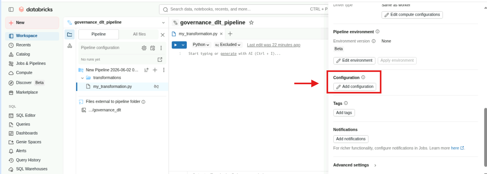

- Click **Add configuration** to add the exact same AWS Access Keys you used for your main interactive cluster. _If you skip this, the DLT pipeline will get an Access Denied error when reading your S3 bucket!_ Add these four entries:
  - Key: `spark.hadoop.fs.s3n.awsAccessKeyId` | Value: `<YOUR-ACCESS-KEY-ID>`
  - Key: `spark.hadoop.fs.s3n.awsSecretAccessKey` | Value: `<YOUR-SECRET-ACCESS-KEY>`
  - Key: `spark.hadoop.fs.s3.awsAccessKeyId` | Value: `<YOUR-ACCESS-KEY-ID>`
  - Key: `spark.hadoop.fs.s3.awsSecretAccessKey` | Value: `<YOUR-SECRET-ACCESS-KEY>`

9. Click the blue **Save** button at the bottom of the settings panel to apply all your configurations.

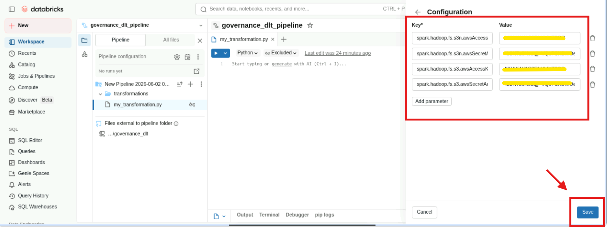

10. **Run the Pipeline:** Click the blue **Run pipeline** button in the top-right corner of the screen.

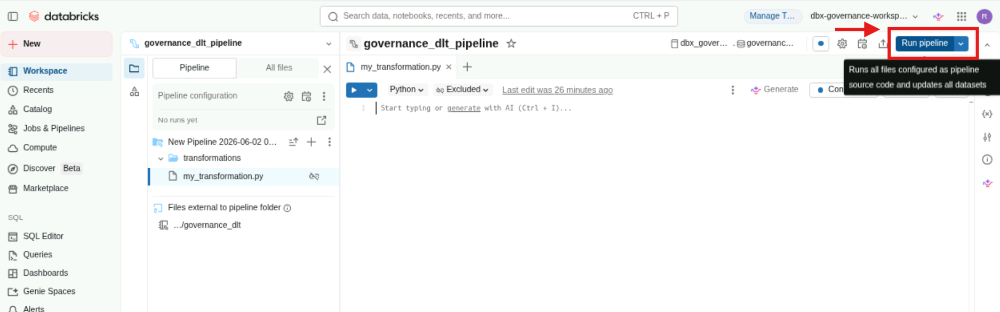

11. Wait until the Bronze, Silver, and Gold nodes show successful completion (green checkmarks) in the pipeline graph at the bottom of the screen.

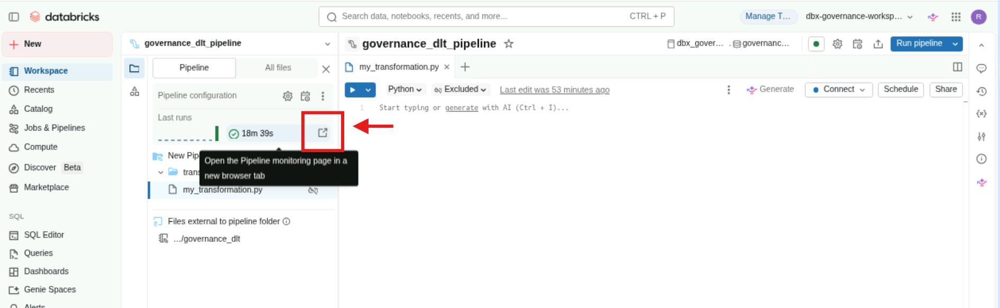
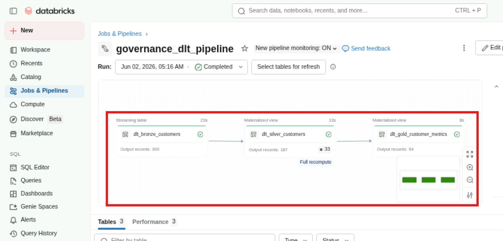

---

# Activity 7: Create Unity Catalog Objects, Apply Governance, and Inspect Lineage

**Purpose of this Activity:** To organize assets using a governed three-level namespace, create persona-aware governed objects, and validate automatic lineage from source to target.

> 🔍 **Preliminary Check — Unity Catalog Metastore:** Before proceeding, verify that your trial workspace has a Unity Catalog Metastore attached. In a new notebook cell, run:
>
> ```sql
> SELECT current_metastore();
> ```
>
> If the result returns a metastore name, you are ready to continue. If it returns `null`, your workspace may not have a Unity Catalog Metastore attached, and you may not be able to complete the UC-specific `GRANT` statements in the steps below. In that case, document the intended permissions and continue with the non-grant steps as best-effort practice.

### Step 7.1: Validate the Catalog and Create the Governance Schema

1. Return to your original `governance_pipeline` notebook.
2. In a new cell, paste the following code.

- **Code Explanation:** These commands identify the current catalog and create the governed schema used for Unity Catalog assets.
- **Code Explanation:** Using a three-level namespace is a core governance pattern in Databricks.

```python
current_catalog = spark.sql("SELECT current_catalog()").collect()[0][0]
print(f"Current catalog: {current_catalog}")

spark.sql(f"CREATE SCHEMA IF NOT EXISTS {current_catalog}.governance_lab")
```

3. Run the cell.

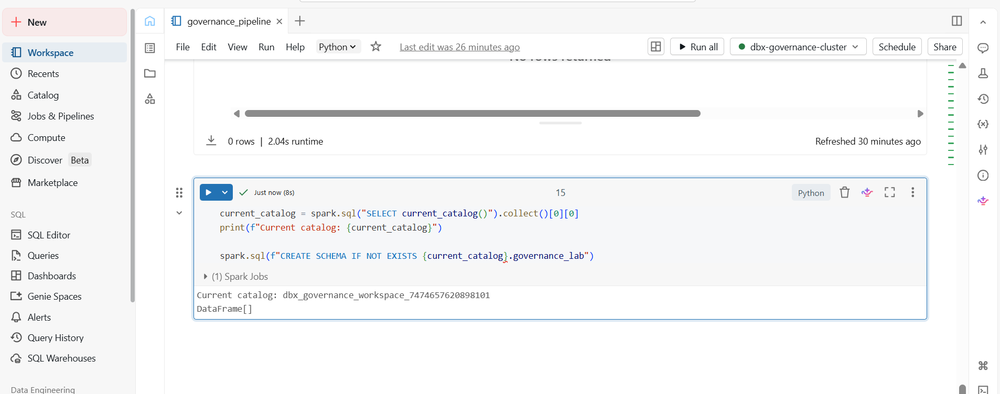

### Step 7.2: Create Governed Copies of the Silver and Gold Tables

1. Create the next notebook cell and paste the following code.


- **Code Explanation:** These commands create governed Unity Catalog tables by copying data from the working Silver and Gold tables.
- **Code Explanation:** This gives you queryable governed assets without changing the earlier pipeline logic.

```python
spark.sql(f"""
CREATE OR REPLACE TABLE {current_catalog}.governance_lab.silver_customers_uc
AS SELECT * FROM governance_lab.silver_customers
""")

spark.sql(f"""
CREATE OR REPLACE TABLE {current_catalog}.governance_lab.gold_customer_metrics_uc
AS SELECT * FROM governance_lab.gold_customer_metrics
""")
```

2. Run the cell.

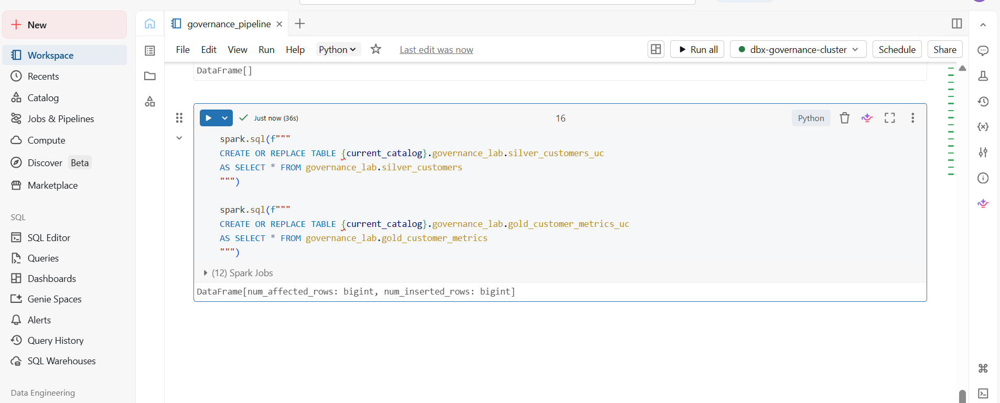

### Step 7.3: Create a Masked Governed View for Analyst Access

1. Create the next notebook cell and paste the following code.


- **Code Explanation:** This view masks email and phone values so analyst users can query customer metrics without seeing raw PII.
- **Code Explanation:** This is a practical free-trial-friendly way to simulate column-level masking behavior in a governed object.

```python
spark.sql(f"""
CREATE OR REPLACE VIEW {current_catalog}.governance_lab.silver_customers_masked AS
SELECT
  customer_id,
  full_name,
  concat('***@', split(email, '@')[1]) AS email_masked,
  concat('XXX-XXX-', right(phone, 4)) AS phone_masked,
  city,
  state,
  customer_tier,
  lifetime_value,
  record_ts,
  is_active
FROM {current_catalog}.governance_lab.silver_customers_uc
""")
```

2. Run the cell.

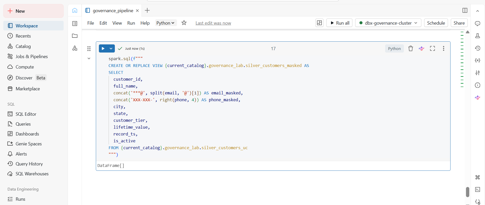

### Step 7.4: Create Persona Groups and Apply Grants

In a production environment, you would assign permissions to active directory groups (like `data_engineers` and `analysts`). Because trial workspaces often restrict custom group creation, we will simulate this persona-based access by granting these permissions directly to your own user account.

1. Create the next notebook cell and paste the following code.

- **Code Explanation:** This code captures your active login identity and grants you both "Data Engineer" access (to the raw tables) and "Analyst" access (to the masked view).
- **Code Explanation:** In the real world, you would replace `{current_user}` with the names of your specific Databricks groups.

```python
# Capture your current login identity automatically
current_user = spark.sql("SELECT current_user()").collect()[0][0]
print(f"Assigning persona grants to current user principal: {current_user}")

# Granting Data Engineer style access to yourself
spark.sql(f"GRANT USE CATALOG ON CATALOG {current_catalog} TO `{current_user}`")
spark.sql(f"GRANT USE SCHEMA ON SCHEMA {current_catalog}.governance_lab TO `{current_user}`")
spark.sql(f"GRANT SELECT ON TABLE {current_catalog}.governance_lab.silver_customers_uc TO `{current_user}`")
spark.sql(f"GRANT SELECT ON TABLE {current_catalog}.governance_lab.gold_customer_metrics_uc TO `{current_user}`")

# Granting Analyst style access to yourself (verifying the masked view access setup)
spark.sql(f"GRANT SELECT ON VIEW {current_catalog}.governance_lab.silver_customers_masked TO `{current_user}`")
```

2. Run the cell.

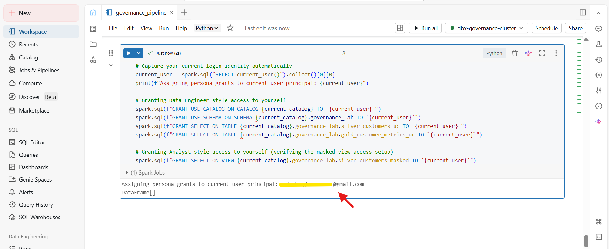

### Step 7.5: Validate the Three-Level Namespace and Grants

1. Create the next notebook cell and paste the following code.


- **Code Explanation:** These commands list schemas, tables, views, and grants so you can confirm the governed namespace exists and contains the expected assets.
- **Code Explanation:** They also verify that the persona-based access model has been applied.

```python
display(spark.sql("SHOW CATALOGS"))
display(spark.sql(f"SHOW SCHEMAS IN {current_catalog}"))
display(spark.sql(f"SHOW TABLES IN {current_catalog}.governance_lab"))
display(spark.sql(f"SHOW GRANTS ON TABLE {current_catalog}.governance_lab.gold_customer_metrics_uc"))
display(spark.sql(f"SELECT * FROM {current_catalog}.governance_lab.silver_customers_masked LIMIT 10"))
```

2. Run the cell.

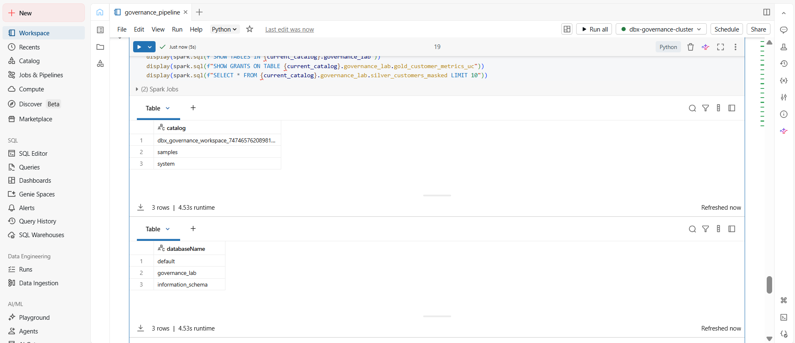
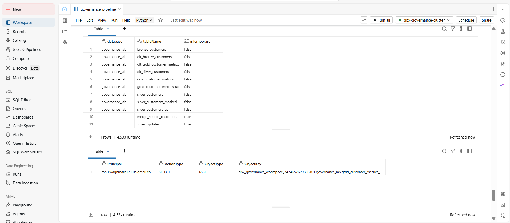
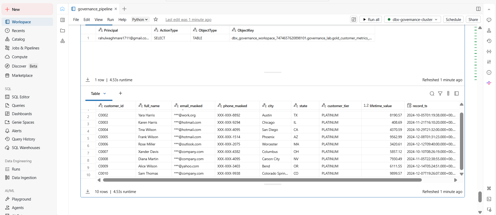

---

# Activity 8: Create a Delta Share and Add the Governed Gold Table

**Purpose of this Activity:** To securely publish a governed Gold table to an external recipient using Delta Sharing.

### Step 8.1: Enable External Delta Sharing in the Account Console

By default, new Databricks workspaces have external sharing disabled to prevent accidental data exfiltration. You must enable it before creating recipients.

1. Switch to your Databricks Account Console (if you closed it, click your user profile icon in the top-right of your workspace and select **Manage Account** or vist `https://accounts.cloud.databricks.com/`).
2. On the left navigation menu of your screen, click on **Catalog**.
3. Click directly on the name of your active metastore (it will be listed right there on the page, select `us-east-1`).

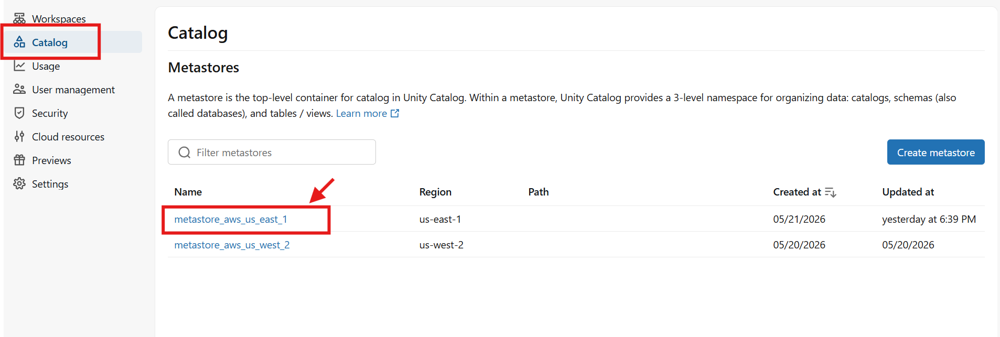

4. Click on the **Configuration** tab at the top of your metastore's detail page.
5. Scroll down until you see the **Delta Sharing** section.
6. Click the checkbox or toggle that says **"Allow Delta Sharing with parties outside your organization"**.

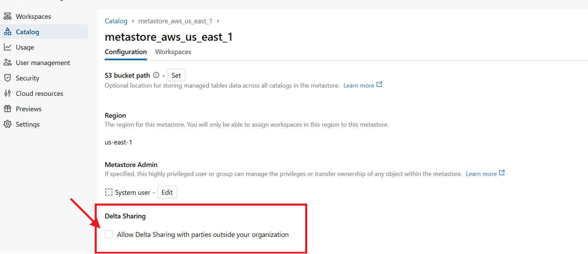

7. Set the **Recipient Token Lifetime** to whatever you prefer (e.g., `90` days).
8. In the **Organization name** field, type a display name (e.g., `Governance Lab`).
9. Click **Enable** (or Save).

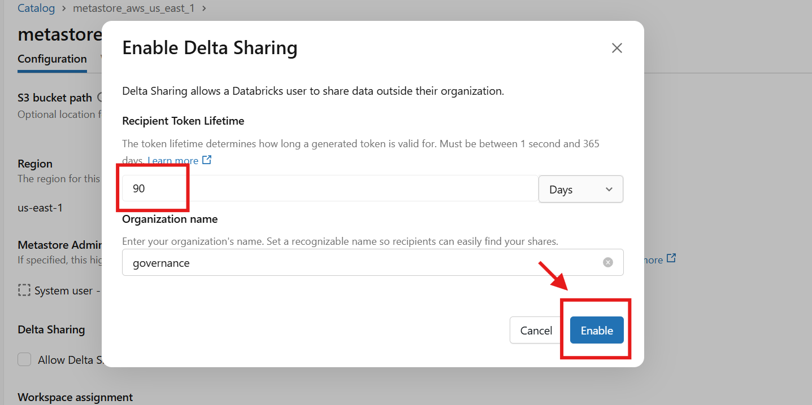

10. Return to your `governance_pipeline` notebook for the next steps.

### Step 8.2: Create the Delta Share

1. In your notebook, create a new cell and paste the following SQL.


- **Code Explanation:** This SQL creates a Delta Share object that will hold externally shared governed assets.
- **Code Explanation:** The share itself does not expose data until tables are explicitly added.

```python
spark.sql("CREATE SHARE IF NOT EXISTS governance_gold_share")
```

2. Run the cell.

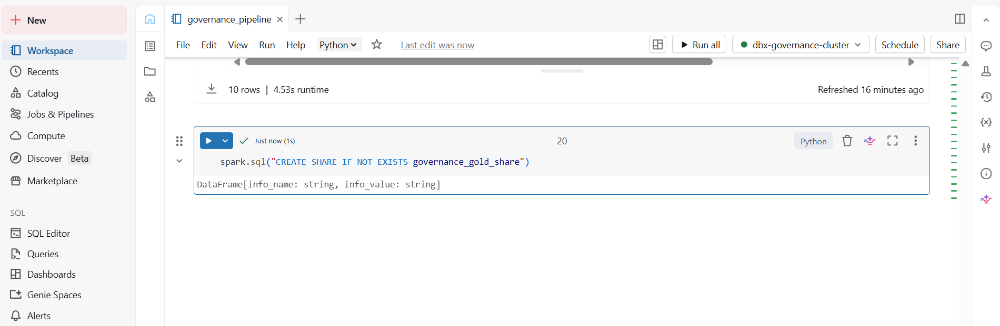

### Step 8.3: Add the Governed Gold Table to the Share

1. In the next cell, paste the following SQL.


- **Code Explanation:** This command adds the governed Gold table to the share so it can be exposed to an external recipient.
- **Code Explanation:** The `WITH HISTORY` clause is required because newer Databricks runtimes use Deletion Vectors, which need historical context to be shared accurately. Sharing the Gold table instead of Silver reduces exposure to sensitive detail-level data.

```python
try:
    spark.sql(f"""
    ALTER SHARE governance_gold_share
    ADD TABLE {current_catalog}.governance_lab.gold_customer_metrics_uc
    WITH HISTORY
    """)
    print("Table successfully added to the share!")
except Exception as e:
    if "ALREADY_EXISTS" in str(e):
        print("Table is already in the share. Safe to continue!")
    else:
        raise e
```

2. Run the cell.

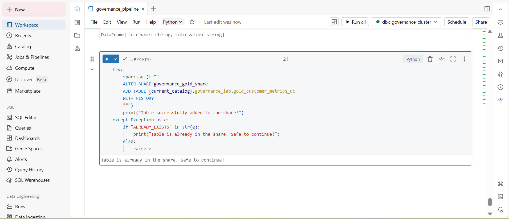

### Step 8.4: Create a Recipient

1. In the next cell, paste the following SQL.


- **Code Explanation:** This creates an Open Delta Sharing recipient representing the external consumer of the shared data.
- **Code Explanation:** Once executed, Unity Catalog generates an activation link containing a unique credential file (`.share`) that the external user downloads to authenticate.

```python
spark.sql("""
CREATE RECIPIENT IF NOT EXISTS governance_external_recipient
""")
```

2. Run the cell.

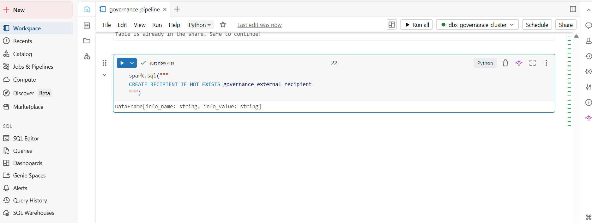

### Step 8.5: Validate the Share

1. In the next cell, paste the following SQL.


- **Code Explanation:** These commands confirm that the share exists and that the governed Gold table has been attached successfully.

```python
display(spark.sql("SHOW SHARES"))
display(spark.sql("DESCRIBE SHARE governance_gold_share"))
```

2. Run the cell.

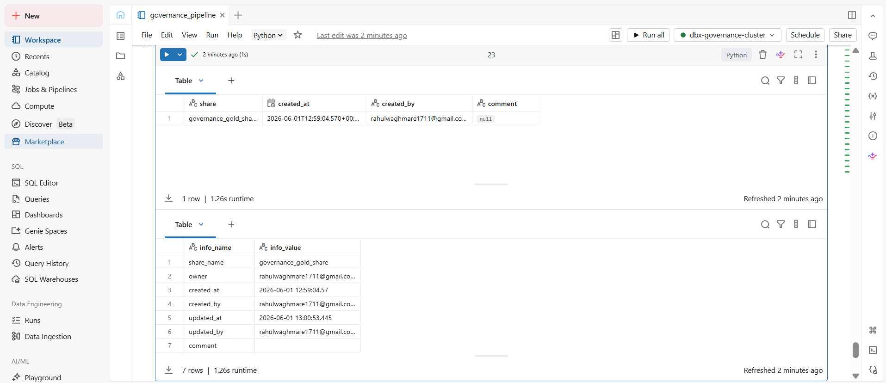

---

# Activity 9: Orchestrate the Pipeline with Databricks Workflows and Validate SQL Analytics

**Purpose of this Activity:** To operationalize the governance pipeline by creating a Databricks Workflow with dependent tasks and then validating business reporting queries against the governed Gold layer.

### Step 9.1: Create the SQL Validation Notebook

1. In the left navigation menu, click **Workspace**.
2. Open **Users** → your user folder → `governance_lab`.
3. Click **Create** and then click **Notebook**.

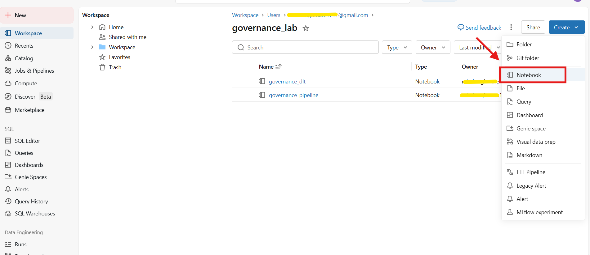

4. Create a notebook named `validate_governed_gold_sql` with **SQL** as the default language.

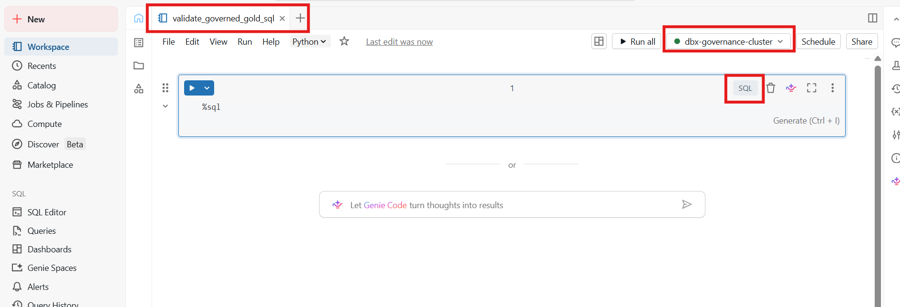

5. In the first cell of the SQL notebook, paste the following query:

- **Code Explanation:** Databricks free-trial workspaces often have different default catalog names (like `hive_metastore`, `workspace`, or `main`). This query fetches your exact catalog name so your reporting query doesn't fail.

```sql
SELECT current_catalog();
```

6. Run the cell and **Right click copy the result** (your catalog name) to your clipboard.

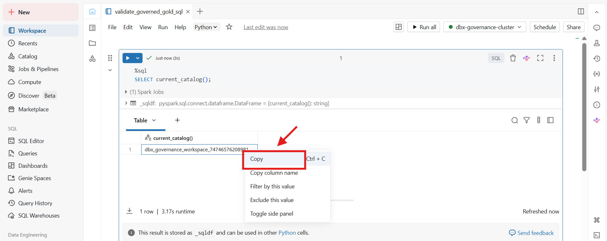

7. Create a **new cell** below it, and paste the following query:

- **Code Explanation:** This SQL returns KPI-style governed Gold metrics that business users would consume in dashboards or scheduled reports.
- **Code Explanation:** It queries the Unity Catalog governed Gold table using the required three-level namespace.

```sql
SELECT
  state,
  customer_tier,
  customer_count,
  active_customer_count,
  total_lifetime_value
FROM <YOUR-ACTUAL-CATALOG-NAME>.governance_lab.gold_customer_metrics_uc
ORDER BY state, customer_tier;
```

8. Replace `<YOUR-ACTUAL-CATALOG-NAME>` with the value you copied from the first cell (e.g., `main`, `hive_metastore`, etc.).
9. Click **Save** if prompted. (You do not need to run this second cell yet; the Workflow will run it).

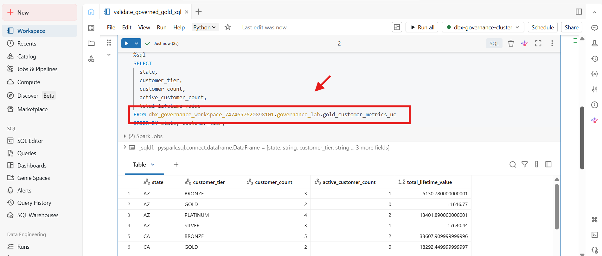

### Step 9.2: Create the Workflow Job

1. In the left navigation menu, click **Jobs & Pipelines** or **Workflows**.
2. On the Jobs page, click **Create** -> **Job**.

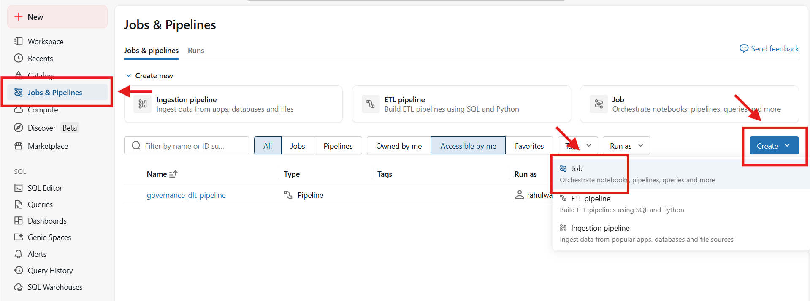

3. Rename the job to `governance-orchestration-job`.
4. Click **Add task**.
5. Choose **Notebook** as the task type.

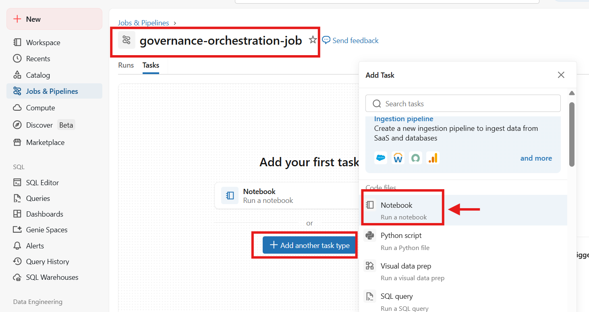

6. Configure the first task:
   - **Task name:** `run_governance_pipeline`
   - **Source:** Workspace
   - **Path:** `/Users/<your-user>/governance_lab/governance_pipeline`
   - **Compute:** Existing all-purpose cluster
   - **Cluster:** `dbx-governance-cluster`
7. Click **Create task**.

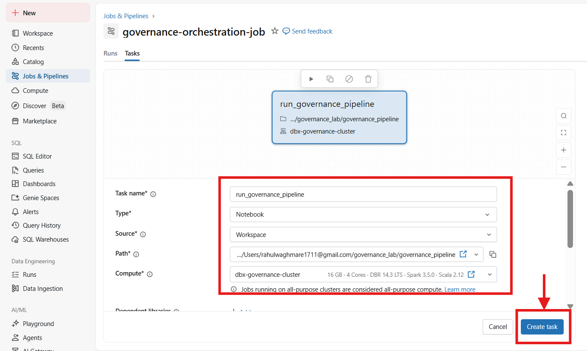

8. Click **Add task** again.
9. Choose **Notebook** as the task type.
10. Configure the second task:
    - **Task name:** `run_governed_sql_validation`
    - **Source:** Workspace
    - **Path:** `/Users/<your-user>/governance_lab/validate_governed_gold_sql`
    - **Depends on:** `run_governance_pipeline`
    - **Compute:** Existing all-purpose cluster
    - **Cluster:** `dbx-governance-cluster`
11. Click **Create task**.

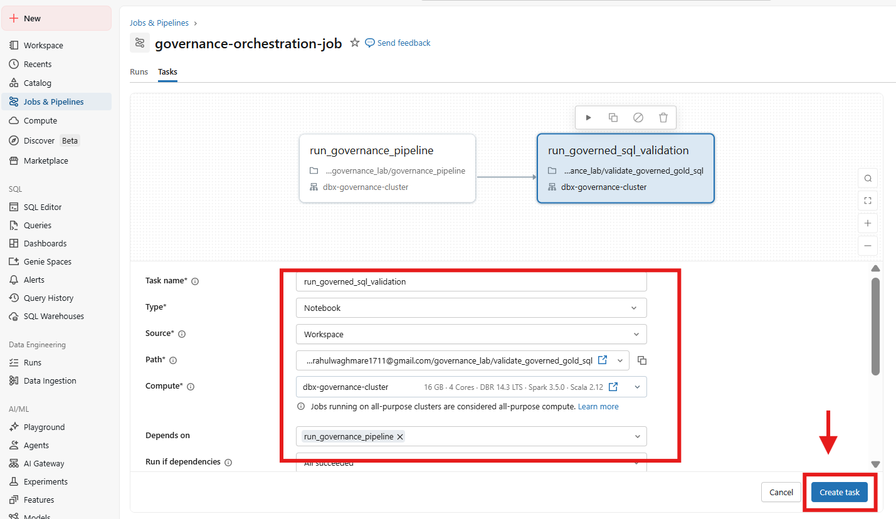

12. In the upper-right corner, click **Run now**.

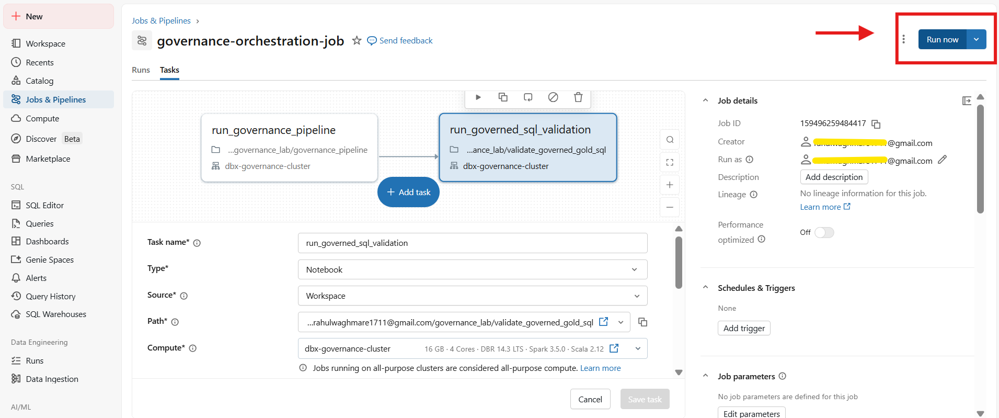

13. Click the **Runs** tab and wait until both tasks show **Succeeded**.

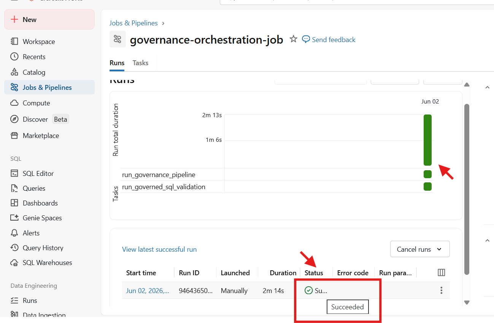

### Step 9.3: Validate SQL Analytics Output

1. Open the `validate_governed_gold_sql` notebook from the Workspace browser.
2. Attach it to **dbx-governance-cluster** if it is not already attached.
3. Review the output of the second cell (the Workflow job automatically ran it!).
4. Confirm that the query returned aggregated rows from the governed Gold table.
5. Review the columns:
   - `state`
   - `customer_tier`
   - `customer_count`
   - `active_customer_count`
   - `total_lifetime_value`

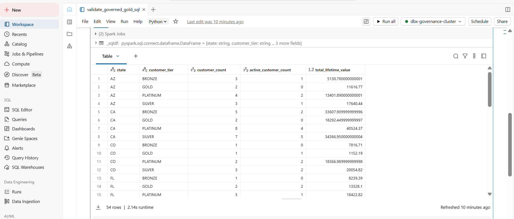

---

## 🎓 Conclusion

This guided project demonstrated how to build a trial-friendly Unity Catalog governance workflow on Databricks using AWS storage and Delta Lake. You created the raw landing structure in S3, ingested files with Auto Loader, transformed them through Bronze, Silver, and Gold layers, and validated the results using Delta Lake operational features, DLT, Unity Catalog, Delta Sharing, Workflows, and SQL.

You practiced real-world data engineering and governance patterns, including:

- Creating an **S3 landing zone** with separate raw, checkpoint, curated, and sharing paths.
- Building a **trial-compliant all-purpose cluster** with **autoscaling 1–2, spot enabled, 30-min auto-termination**, and the latest **LTS Standard runtime**.
- Using **Auto Loader** to ingest raw files incrementally into a **Bronze Delta table** with ingestion metadata and checkpointing.
- Applying **Silver-layer cleansing and deduplication** rules before governed downstream use.
- Validating **Delta Lake DML operations** including **INSERT, UPDATE, DELETE, MERGE**, plus **history** and **time travel**.
- Building a **Gold aggregate table** with business-ready customer metrics.
- Re-implementing the pipeline as a **Delta Live Tables** flow with **data quality expectations**.
- Creating governed assets with **Unity Catalog** using the **catalog.schema.table** naming pattern.
- Applying persona-based access patterns for **Data Engineer** and **Analyst** users, including a masked governed object for PII-safe access.
- Inspecting **automatic lineage** across source and target assets in Unity Catalog.
- Creating a **Delta Share** and publishing a governed Gold table to an external recipient.
- Operationalizing the solution with **Databricks Workflows** and validating reporting output through **Databricks SQL**.
