# Title: End-to-End Pipeline Orchestration & SQL Analytics

---

## 🌟 Overview: What is the purpose of this Lab?

Welcome to your End-to-End Pipeline Orchestration lab! Databricks Workflows is the native orchestration engine that lets you coordinate multi-task jobs — linking a DLT pipeline, notebooks, SQL queries, and dbt tasks into a single, monitored, production-grade flow with scheduling, retries, and alerting built in.

**The Purpose of this Lab:**
You are part of a data engineering team responsible for productionizing a complete Lakehouse pipeline. Individual pipeline stages — ingestion, transformation, and aggregation — currently run in isolation and lack coordination. Your task is to orchestrate the full flow (Auto Loader → DLT → Gold layer) using Databricks Workflows, add cron scheduling, retry logic, and failure alerting, then build a final business intelligence dashboard using a SQL Warehouse. This ensures the pipeline runs reliably end-to-end and delivers analytics-ready outputs to business stakeholders.

By the end of this project, you will have:

- Set up a **Databricks account on AWS** and captured your Account ID.
- Created an **S3 bucket** and uploaded raw source data files.
- Configured **IAM policies and roles** to grant Databricks access to S3.
- Created an **all-purpose cluster** with the correct runtime and Spark credentials config.
- Created the **`orchestration_lab` workspace folder** and imported all 4 notebooks.
- Updated the **S3 bucket name** in `01_bronze_ingestion` before running the pipeline.
- Configured and launched a **DLT pipeline** covering Bronze → Silver → Gold layers.
- Built a **multi-task Databricks Workflow** with two dependent tasks and cron scheduling.
- Configured **retry logic and email failure alerting** on the workflow.
- Monitored a complete **workflow run** through the job run timeline UI.
- Started a **SQL Warehouse** and queried the Gold layer via the SQL Editor.
- Built a **dashboard** with KPI tiles and a bar chart from the Gold Delta table.
- Configured a **scheduled query alert** to fire when a key metric crosses a threshold.

### Learning Path:

1. **AWS & Databricks Setup:** Log in to AWS Console, create or sign in to your Databricks account, and capture Account ID.
2. **S3 & IAM Setup:** Create the S3 bucket, upload CSVs, create IAM policy and role for cluster S3 access.
3. **Cluster Setup:** Create an all-purpose cluster with the correct runtime, Spark config, and AWS credentials.
4. **Workspace Setup:** Create the `orchestration_lab` folder and import all 4 notebooks.
5. **Update Bucket Name:** Edit `01_bronze_ingestion` to set your actual S3 bucket name before running.
6. **DLT Pipeline:** Configure and run the DLT pipeline covering Bronze ingestion, Silver quality, and Gold aggregation.
7. **Workflow Creation:** Build the multi-task Databricks Workflow — wire tasks, set dependencies, configure cron schedule.
8. **Retry & Alerting:** Add retry logic per task and configure email failure notification.
9. **Workflow Run:** Trigger a manual run and monitor each task through the run timeline.
10. **SQL Warehouse:** Start the Serverless SQL Warehouse and verify Gold table contents via SQL Editor.
11. **Dashboard:** Build a dashboard with KPI tiles and a bar chart from the Gold layer.
12. **Scheduled Alert:** Create a scheduled query that fires an alert when a key metric crosses a threshold.

---

## Difficulty Level

Proficient

---

## 📊 Dataset / Knowledge Source Used

The following files are provided in the `~/Desktop/Project/` folder on your lab desktop.

**Local File Structure:**

```text
~/Desktop/Project/
├── sales_raw.csv
├── sales_bad.csv
└── orchestration_lab/
    ├── 01_bronze_ingestion.py
    ├── 02_silver_quality.py
    ├── 03_gold_aggregation.py
    ├── 04_gold_validation.py
    └── README.md
```

| File | Destination | Description |
|---|---|---|
| `sales_raw.csv` | `s3://<your-bucket>/raw/sales/sales_raw.csv` | 25-row sales dataset (`order_id, customer_id, product, region, quantity, unit_price, order_date, status`) — all valid records |
| `sales_bad.csv` | `s3://<your-bucket>/raw/sales/sales_bad.csv` | 5-row file with intentionally bad records — nulls, negative quantities, invalid statuses — used to trigger DQ expectations |
| `01_bronze_ingestion.py` | Databricks Workspace → `orchestration_lab/01_bronze_ingestion` | Defines the Bronze DLT table using Auto Loader to ingest raw CSV files from S3. **Requires bucket name update before running.** |
| `02_silver_quality.py` | Databricks Workspace → `orchestration_lab/02_silver_quality` | Defines the Silver DLT table with `@dlt.expect` (Warn) and `@dlt.expect_or_drop` (Drop) data quality rules |
| `03_gold_aggregation.py` | Databricks Workspace → `orchestration_lab/03_gold_aggregation` | Defines the Gold DLT table — revenue aggregated by product, region, and status |
| `04_gold_validation.py` | Databricks Workspace → `orchestration_lab/04_gold_validation` | Post-pipeline validation notebook — confirms row counts and revenue totals; used as Task 2 in the Workflow |

> ⚠️ **Important note on `02_silver_quality.py`:** The `unit_price_positive` rule uses `@dlt.expect_or_drop` (not `@dlt.expect_or_fail`). Using `expect_or_fail` will halt the entire pipeline when a negative unit price is found in `sales_bad.csv`. For this lab, `expect_or_drop` silently removes those records and allows the pipeline to complete end-to-end.

---

## 🛠️ Prerequisites & AWS Setup

Ensure the following are available before starting:

- An **AWS account** with permissions for S3 and IAM (lab credentials provided).
- A **Databricks account on AWS** (Premium tier — 14-day trial is sufficient).
- Local project files at `~/Desktop/Project/`.
- All AWS resources must be in **US-EAST-1 (N. Virginia)**.

---

## Configure AWS Credentials

- Click the `Lab Access` icon on the desktop.


- Click `Access Lab` and log in to the AWS Console using the given credentials.


- Confirm the region is **US-EAST-1 (N. Virginia)** using the region selector at the top right.


---

## Set Up (or Sign In to) Your Databricks Account

**Purpose of this Activity:** To make sure you have an active Databricks-on-AWS account before any infrastructure work begins.

### Step 1: Do You Already Have a Databricks Account?

- **YES** ➡️ Skip directly to **Step 6: Log In and Capture Your Databricks Account ID**.
- **NO** ➡️ Continue with **Step 2** below.

### Step 2: Access the Databricks Login Page

Open a new browser tab and navigate to [https://login.databricks.com/](https://login.databricks.com/). Click **Continue with Google**.


### Step 3: Authenticate and Choose a Trial Type

1. Choose your Google/email account.
2. Select **For work** on the "What will you use Databricks for?" screen.
3. Click **Start trial with express setup**.


### Step 4: Configure Account Details and Verify

1. Enter your **account name** (e.g., `dbx-lab-account`) and click **Continue**.


2. Complete the **captcha** and click **Submit**.
3. Pick **Learn data and AI**, choose topics, click **Continue**.
4. Wait for the **"Setting up your account…"** screen (1–2 minutes).


### Step 5: Express Setup — Link Databricks to AWS

#### Step 5.1: Open the Account Console

Click your **workspace name** top-right → **Manage account**.


#### Step 5.2: Create an Express Workspace

1. Click **Workspaces** → **Create workspace**.
2. Fill in:
   - **Workspace name:** `dbx-express-temp`
   - **Region:** `N. Virginia (us-east-1)`
   - **Storage and compute:** `Use your existing cloud account`
3. Click **Continue**.

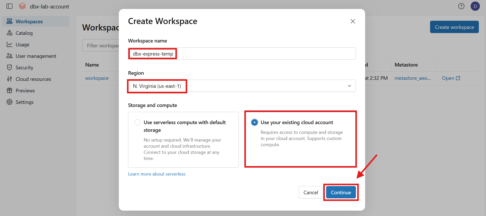

#### Step 5.3: Configure Cloud Credentials and Storage

1. Under **Compute credentials** → **Add cloud credentials** → **Add automatically** → **OK**.
2. Click **Log in to AWS and create workspace**.


#### Step 5.4: Authorize in AWS

1. Click **Initiate workspace creation**.
2. Sign in with lab credentials → click **Allow access**.
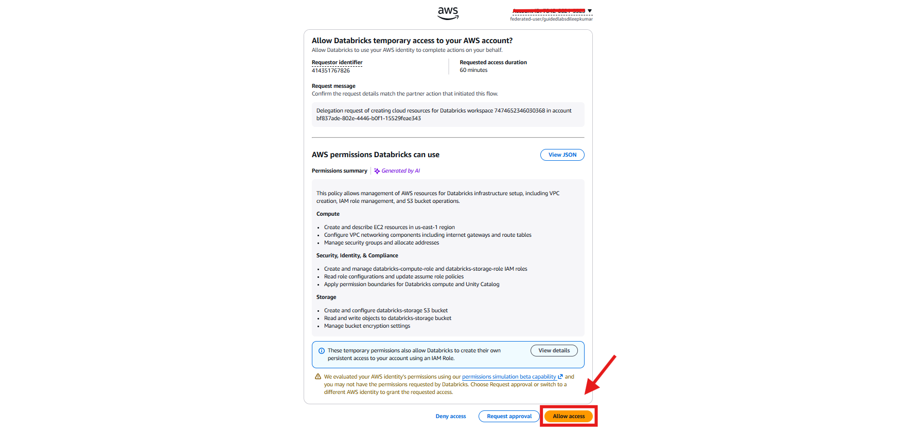

#### Step 5.5: Wait for Running Status

Wait until workspace status shows **Running** (3–5 minutes).

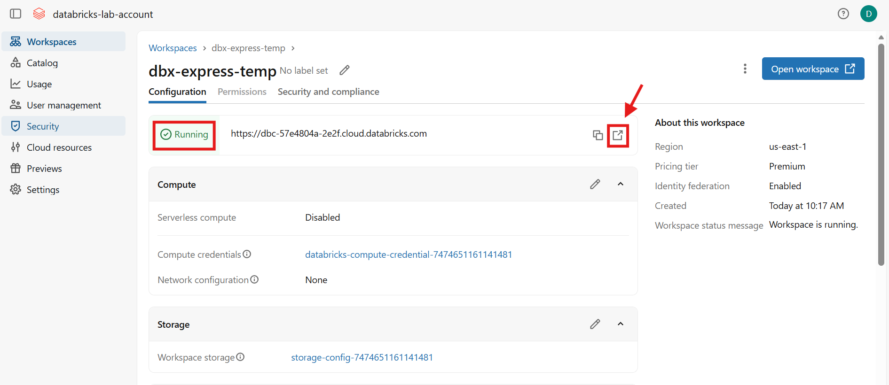

### Step 6: Log In and Capture Your Databricks Account ID

1. Open [https://accounts.cloud.databricks.com/](https://accounts.cloud.databricks.com/) and sign in.
2. Click **user icon** → **Account**.
3. Copy the **Account ID** (UUID format) into a text note.

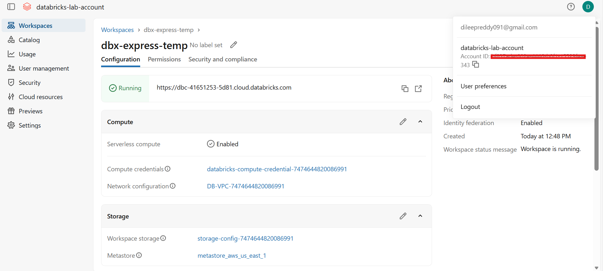

---

# Activity 1: S3 Bucket, IAM Setup & Cluster Creation

**Purpose:** Create the S3 bucket for lab data, configure IAM permissions, and create the all-purpose cluster.

### Step 1.1: Create the S3 Bucket and Upload Source Data

1. In the AWS Console, search for **S3** → **Create bucket**.
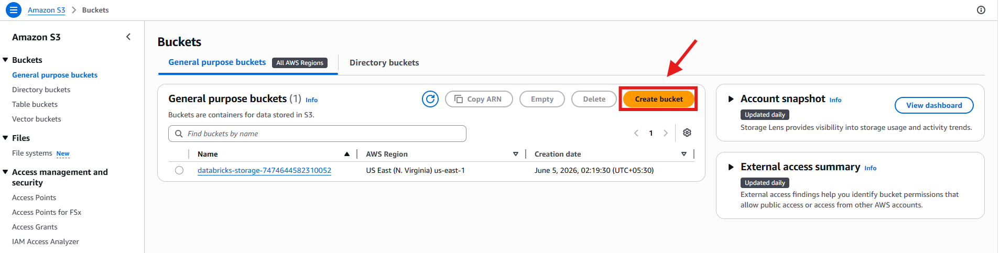
2. Set **Bucket name** to `orch-lab-<your-aws-account-id>` (e.g., `orch-lab-784266215529`).
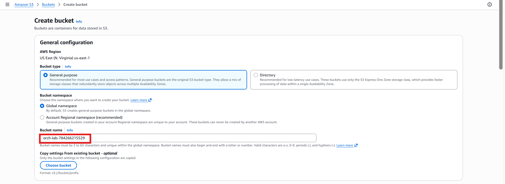

   > 💡 Find your AWS Account ID in the top-right corner of the AWS Console.

3. Keep region as **us-east-1**. Ensure **Block all public access** is checked. Click **Create bucket**.
4. Open the bucket → **Create folder** → name it `raw` → **Create folder**.
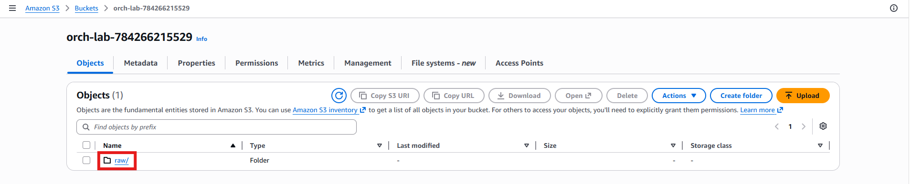
5. Inside `raw/` → **Create folder** → name it `sales` → **Create folder**.
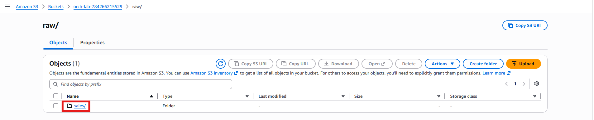
6. Open `raw/sales/` → **Upload** → add both files:
   - `~/Desktop/Project/sales_raw.csv`
   - `~/Desktop/Project/sales_bad.csv`
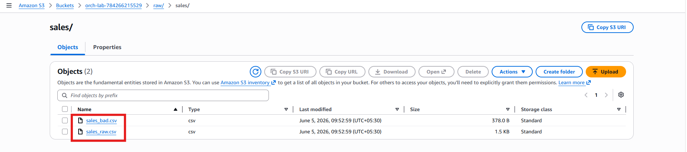
7. Click **Upload**.

### Step 1.2: Create IAM Policy for S3 Access

1. In IAM → **Policies** → **Create policy** → **JSON** tab → paste (replace `<your-account-id>`):

```json
{
  "Version": "2012-10-17",
  "Statement": [
    {
      "Effect": "Allow",
      "Action": ["s3:GetObject","s3:PutObject","s3:DeleteObject","s3:ListBucket"],
      "Resource": [
        "arn:aws:s3:::orch-lab-<your-account-id>",
        "arn:aws:s3:::orch-lab-<your-account-id>/*"
      ]
    }
  ]
}
```
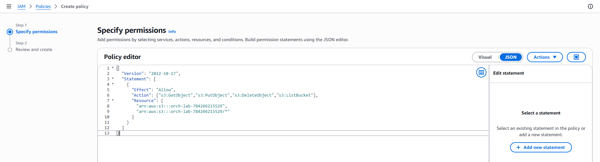

2. Click **Next** → set **Policy name** to `orch-lab-s3-policy` → **Create policy**.

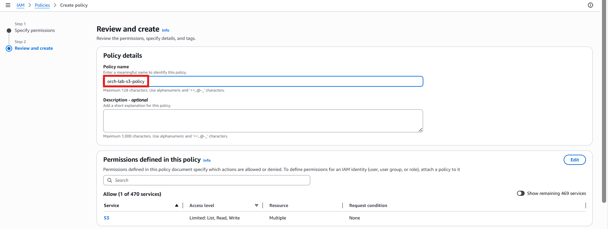

### Step 1.3: Create IAM Role (Instance Profile)

1. IAM → **Roles** → **Create role** → **AWS service** → **EC2** → **Next**.
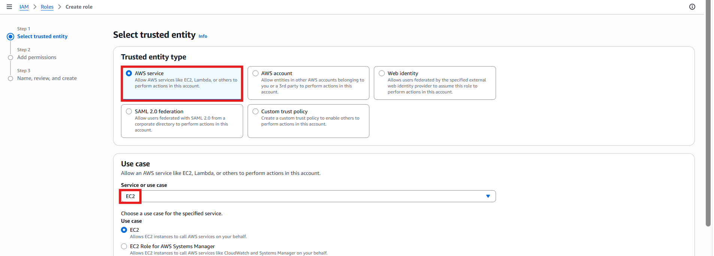
2. Search `orch-lab-s3-policy`, check it → **Next**.
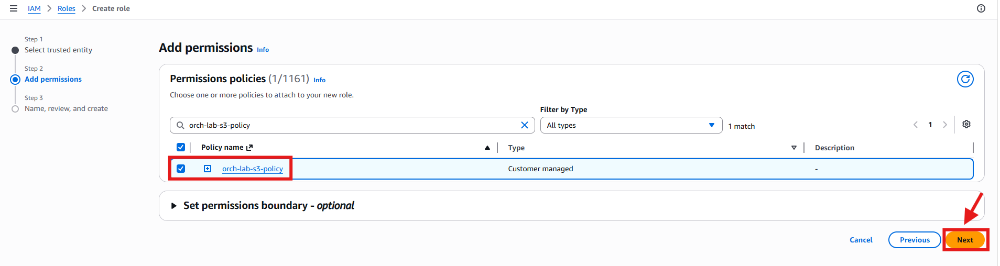
3. Set **Role name** to `orch-lab-instance-profile` → **Create role**.
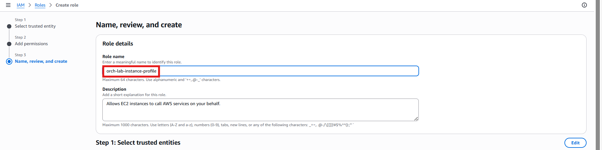


### Step 1.4: Add S3 Bucket Policy

1. In S3 → open `orch-lab-<account-id>` → **Permissions** → **Bucket policy** → **Edit** → paste (replace `<your-account-id>`):

```json
{
  "Version": "2012-10-17",
  "Statement": [
    {
      "Sid": "DatabricksAccess",
      "Effect": "Allow",
      "Principal": {
        "AWS": "arn:aws:iam::<your-account-id>:role/orch-lab-instance-profile"
      },
      "Action": ["s3:GetObject","s3:PutObject","s3:DeleteObject","s3:ListBucket"],
      "Resource": [
        "arn:aws:s3:::orch-lab-<your-account-id>",
        "arn:aws:s3:::orch-lab-<your-account-id>/*"
      ]
    }
  ]
}
```
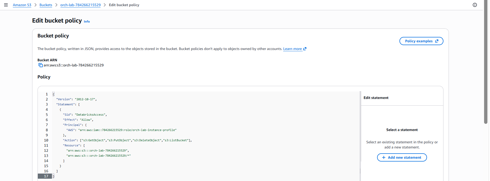

2. Click **Save changes**.

### Step 1.5: Create the All-Purpose Cluster
1. On the workspace detail page, click the ↗ external link icon (next to the workspace URL) to open the dbx-express-temp workspace.
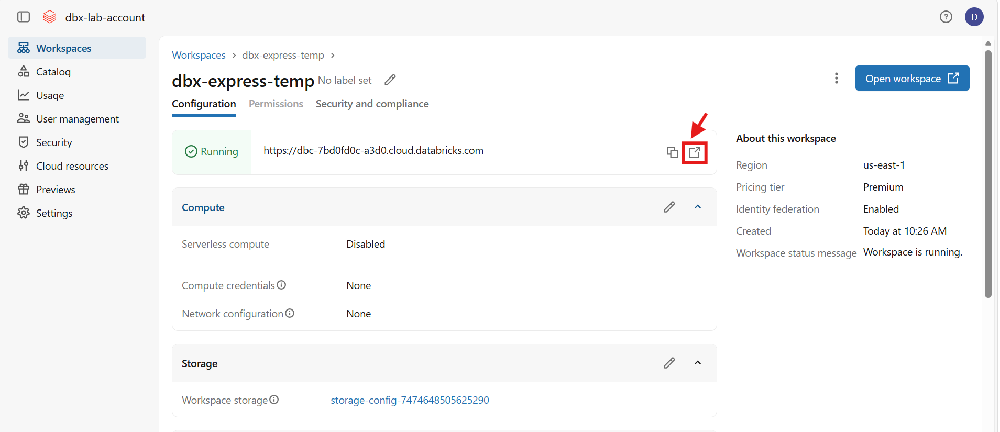
2. Open the `dbx-express-temp` workspace → **Compute** → **Create compute**.
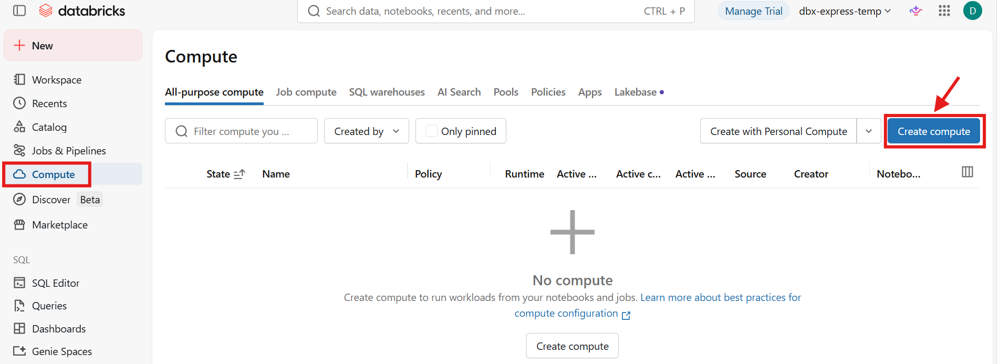
3. Configure:

   | Setting | Value |
   |---|---|
   | **Compute name** | `orch-lab-cluster` |
   | **Databricks runtime** | `13.3 LTS (Scala 2.12, Spark 3.4.1)` |
   | **Single node** | ✅ Checked |
   | **Terminate after** | `30` minutes |

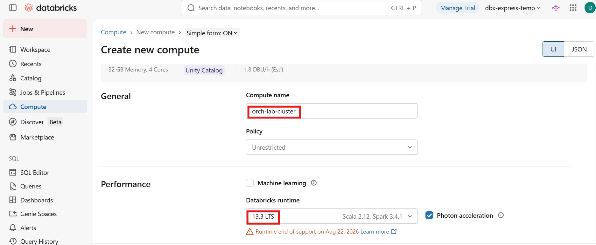
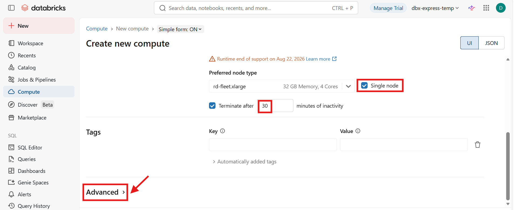

4. Scroll to **Advanced options** → **Spark** tab.
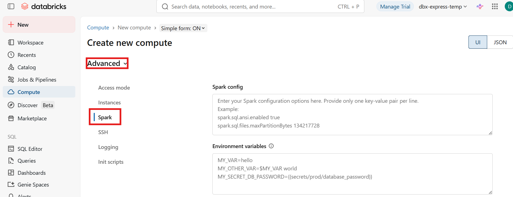


### 🔑 Getting Your AWS Credentials

Before configuring the Spark settings, you need to retrieve your AWS credentials 
from the Lab portal. Follow these steps:

1. Switch to the **Lab 24 - SQL Analytics ** browser tab 
   (https://labs.trainocate.com).

2. On the lab page, click the **credentials icon** (🔐) on the right-hand side 
   of the screen — it is the second blue icon on the right edge of the page.

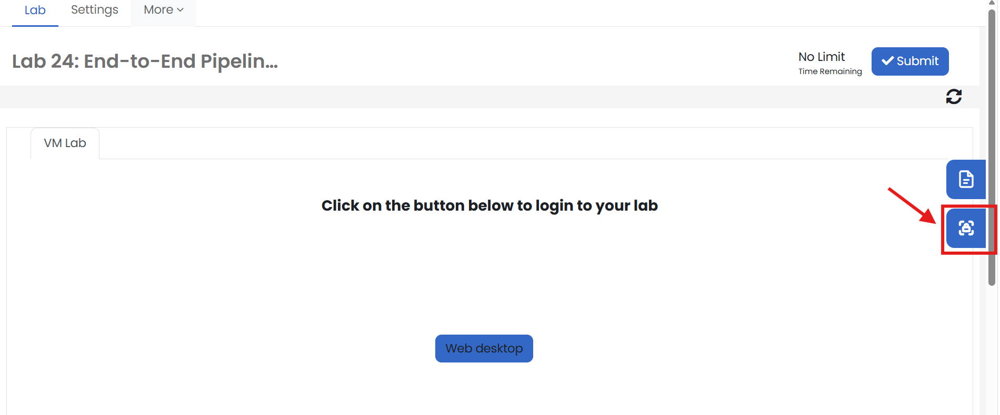

3. A **Lab Credentials** panel will open on the right side, showing:
   - **Login URL** – the AWS Console sign-in link
   - **accessId** – your AWS Access Key ID
   - **accessKey** – your AWS Secret Access Key
   - **arn** – your AWS account number
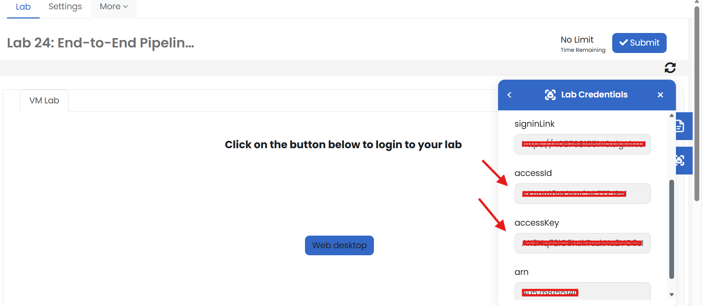

4. Copy the **accessId** value — this is your `<YOUR-ACCESS-KEY-ID>`.

5. Copy the **accessKey** value — this is your `<YOUR-SECRET-ACCESS-KEY>`.

> 💡 **Tip:** Keep this panel open so you can refer back to the credentials 
> while filling in the Spark config and Environment variables in Databricks.

4. In **Spark config** box paste:

```
spark.hadoop.fs.s3n.awsAccessKeyId <YOUR-ACCESS-KEY-ID>
spark.hadoop.fs.s3n.awsSecretAccessKey <YOUR-SECRET-ACCESS-KEY>
spark.hadoop.fs.s3.awsAccessKeyId <YOUR-ACCESS-KEY-ID>
spark.hadoop.fs.s3.awsSecretAccessKey <YOUR-SECRET-ACCESS-KEY>
```

5. In **Environment variables** box add:

```
AWS_ACCESS_KEY_ID=<YOUR-ACCESS-KEY-ID>
AWS_SECRET_ACCESS_KEY=<YOUR-SECRET-ACCESS-KEY>
```
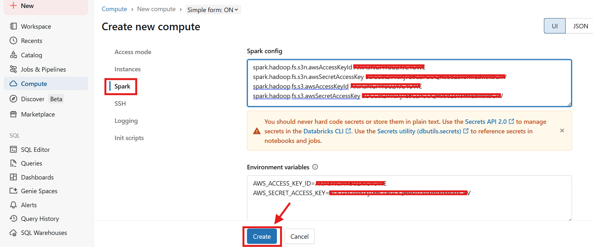

6. Click **Create** and wait for **green dot (Running)**.
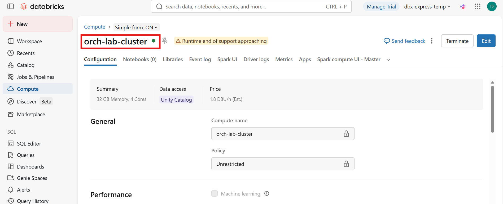


### Step 1.6: Create the `orchestration_lab` Workspace Folder

1. Click **Workspace** → **Users** → your email folder.
2. Click **Create** → **Folder** → name it `orchestration_lab` → press **Enter**.
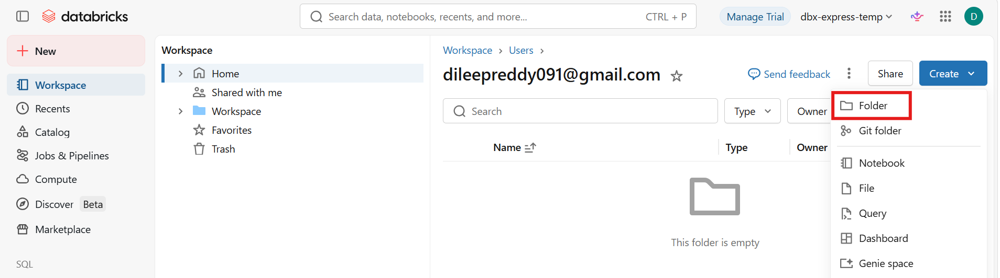
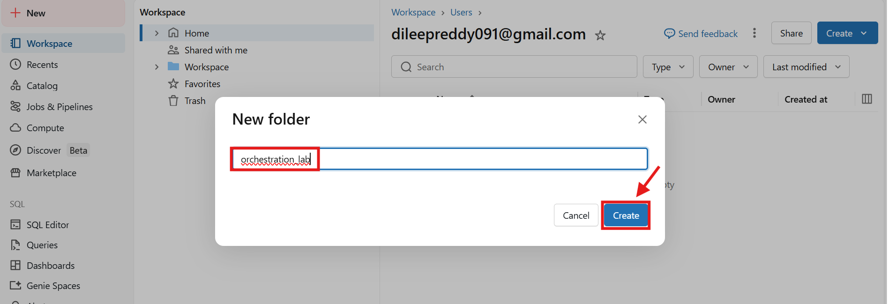

### Step 1.7: Import the Lab Notebooks

1. Open the `orchestration_lab` folder.
2. Click **⋮** → **Import** → **File** source.
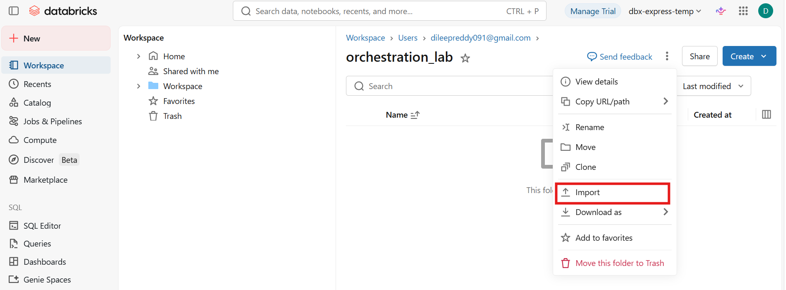
3. Import each `.py` file from `~/Desktop/Project/orchestration_lab/`:
   - `01_bronze_ingestion.py`
   - `02_silver_quality.py`
   - `03_gold_aggregation.py`
   - `04_gold_validation.py`
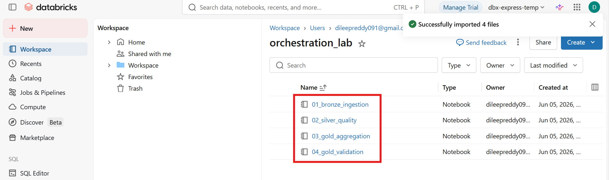

---

# Activity 2: Update Bucket Name & Configure the DLT Pipeline

**Purpose:** Update the S3 bucket variable in the Bronze notebook, then configure and run the DLT pipeline.

> ⚠️ **This step is critical.** The `01_bronze_ingestion` notebook has a placeholder `S3_BUCKET = "<your-bucket-name>"`. If you run the pipeline without updating this, it will fail with **"Invalid URI: null or empty"** error.

### Step 2.1: Update the S3 Bucket Name in the Bronze Notebook

1. Click **Workspace** → `orchestration_lab` → open **`01_bronze_ingestion`**.
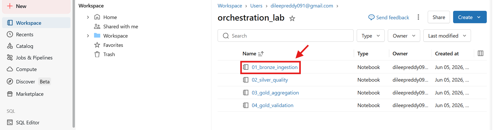
2. Find **Cell 1** — locate this line:

```python
S3_BUCKET = "<your-bucket-name>"
```

3. Replace it with your actual bucket name:

```python
S3_BUCKET = "orch-lab-<your-aws-account-id>"
```
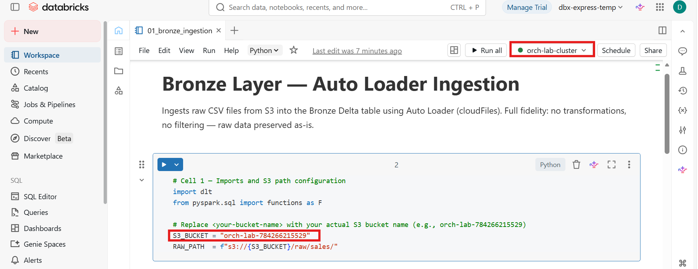

For example:
```python
S3_BUCKET = "orch-lab-784266215529"
```

4. Press **Ctrl+S** to save.

> 💡 Also open `04_gold_validation` and replace `<your-catalog>` with your actual Unity Catalog catalog name (visible in the Catalog explorer, e.g., `dbx_express_temp_7474644820086991`).
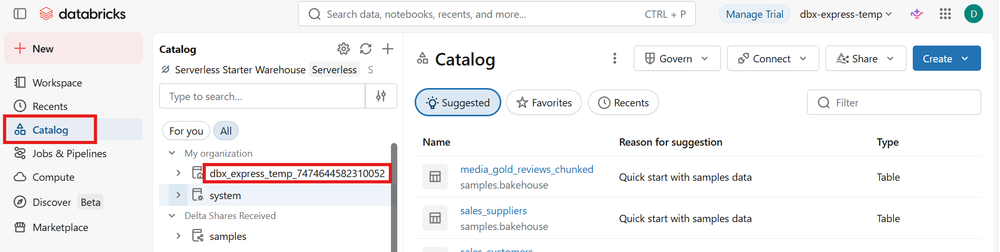
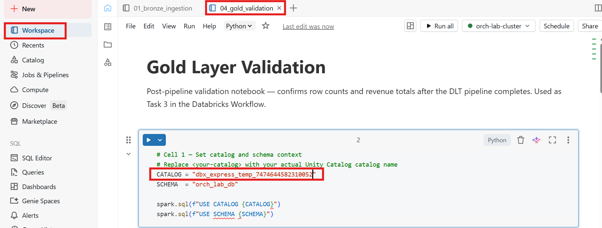

### Step 2.2: Create the DLT Pipeline

1. Click **Jobs & Pipelines** in the left sidebar.
2. Click **Create ▾** → select **ETL pipeline**.

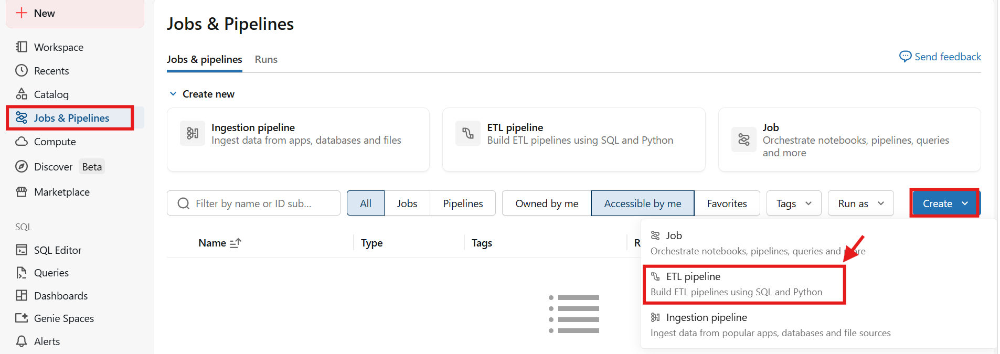

### Step 2.3: Rename the Pipeline

Click the default pipeline name at the top and rename it to:
```
orch-lab-sales-pipeline
```
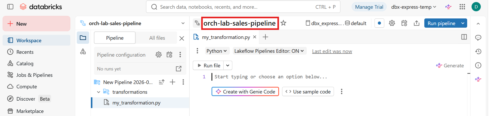
### Step 2.4: Open Pipeline Settings

Click the **⚙️ gear icon** next to "Pipeline configuration" in the left panel.
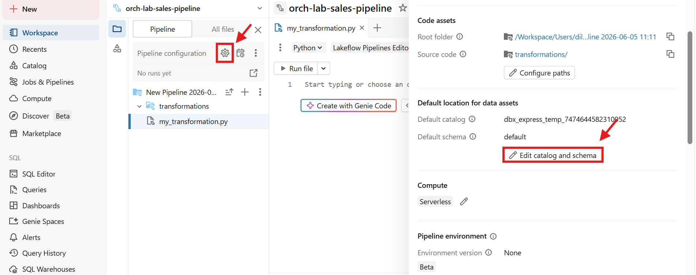

### Step 2.5: Set the Target Schema

1. Scroll to **Default location for data assets** → **Edit catalog and schema**.
2. Leave **Default catalog** as auto-created (e.g., `dbx_express_temp_7474644820086991`).
3. Set **Default schema** to `orch_lab_db`.
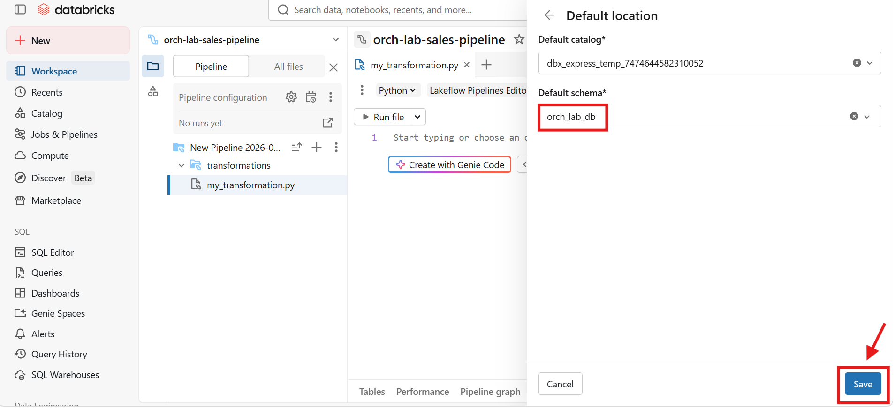
4. Click **Save**.

> 💡 "Schema doesn't exist" message is expected — DLT creates it automatically on first run.

### Step 2.6: Configure Source Code Paths

1. In Pipeline settings → **Code assets** → **Source code** → **Configure paths**.
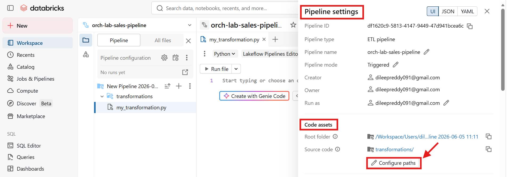
2. Click the **folder icon** 📁 → navigate to `Workspace → Users → <your-email> → orchestration_lab`.
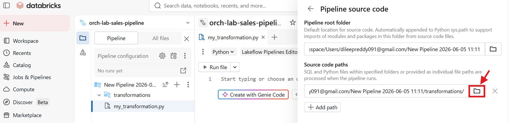
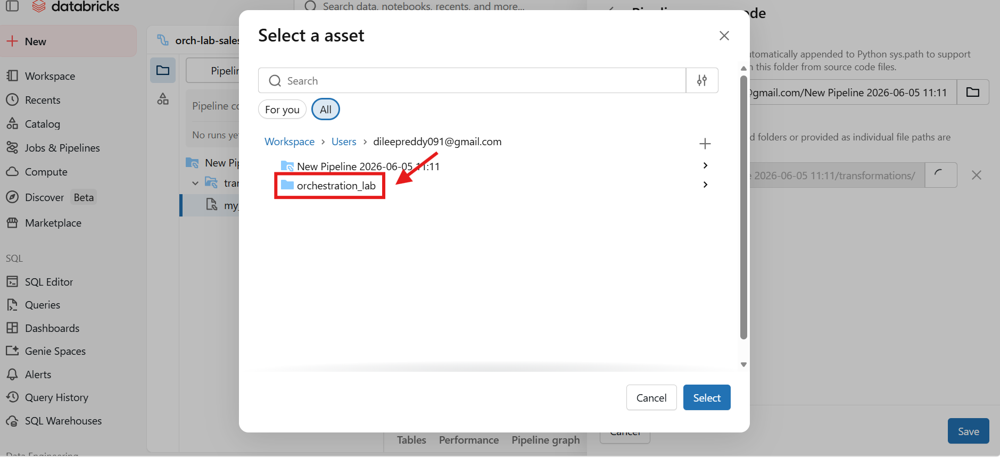

3. Select **`01_bronze_ingestion`** → **Select**.
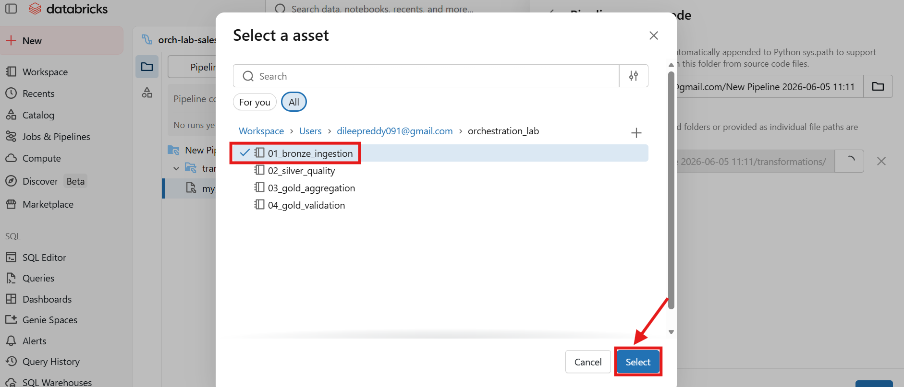
4. Click **+ Add path** → select **`02_silver_quality`** → **Select**.
5. Click **+ Add path** → select **`03_gold_aggregation`** → **Select**.
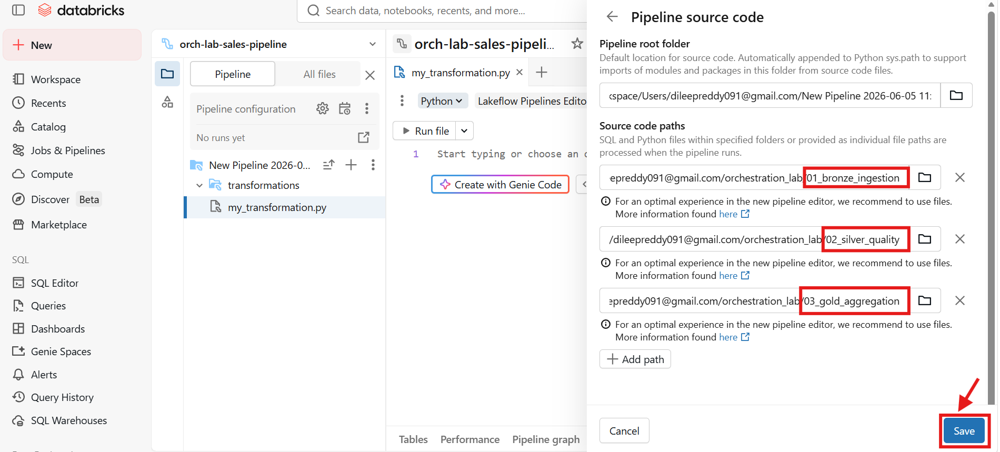
6. Click **Save**.

### Step 2.7: Add AWS Credentials to Pipeline Configuration

The DLT pipeline runs on Serverless compute which does not inherit cluster Spark config. Add credentials directly.

1. In Pipeline settings → **Configuration** → **Add configuration**.
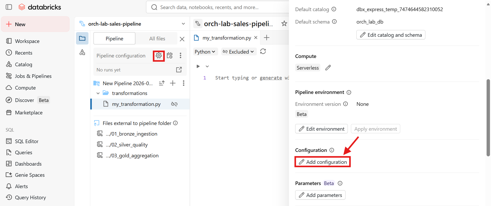
2. Add these 4 key-value pairs:

| Key | Value |
|---|---|
| `spark.hadoop.fs.s3a.access.key` | `<YOUR-ACCESS-KEY-ID>` |
| `spark.hadoop.fs.s3a.secret.key` | `<YOUR-SECRET-ACCESS-KEY>` |
| `spark.hadoop.fs.s3n.awsAccessKeyId` | `<YOUR-ACCESS-KEY-ID>` |
| `spark.hadoop.fs.s3n.awsSecretAccessKey` | `<YOUR-SECRET-ACCESS-KEY>` |

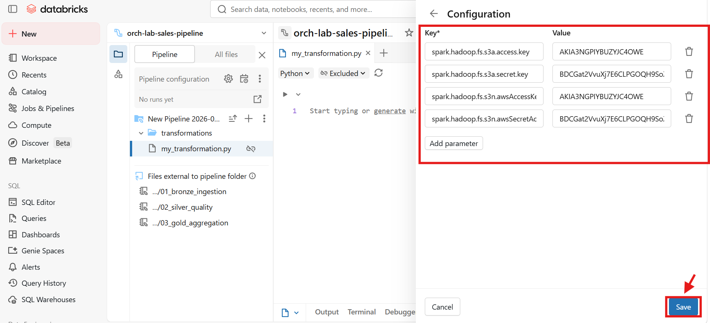


3. Click **Save**.

### Step 2.8: Verify Pipeline Mode

Confirm **Pipeline mode:** `Triggered` ✅ in the settings panel.
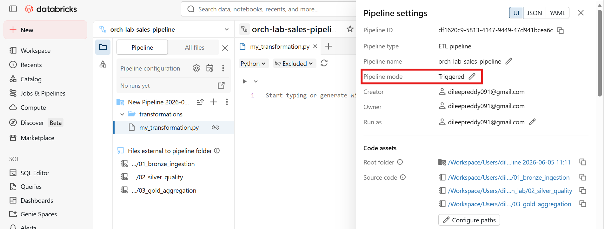

> 📌 Triggered mode runs once per invocation, processes all available data, then stops.

### Step 2.9: Run the Pipeline

1. Click **Run pipeline** (blue button, top right).
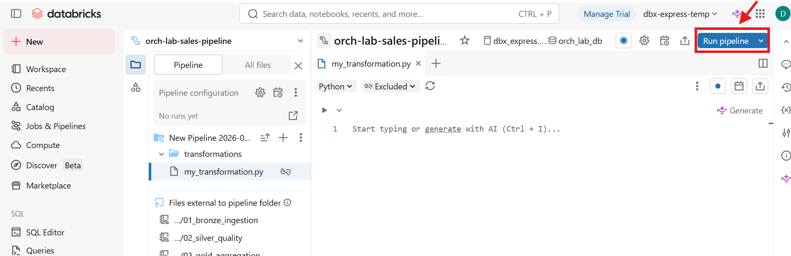
2. Wait for status: **Initializing → Setting up cluster → Running → Completed**.
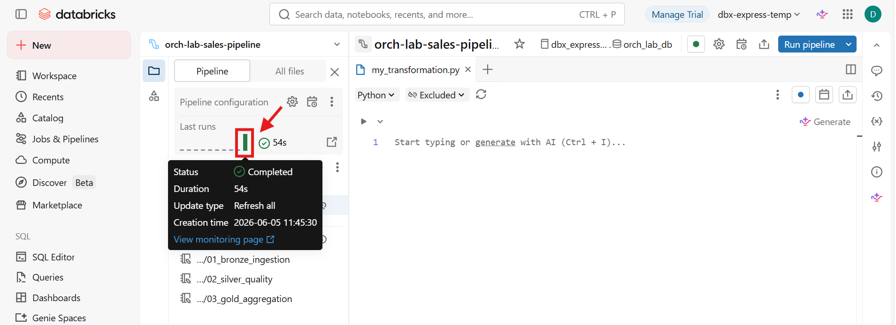

**Expected pipeline graph results:**
```
bronze_sales (30 rows) → gold_revenue_summary (20 rows) → silver_sales (26 rows) 
```

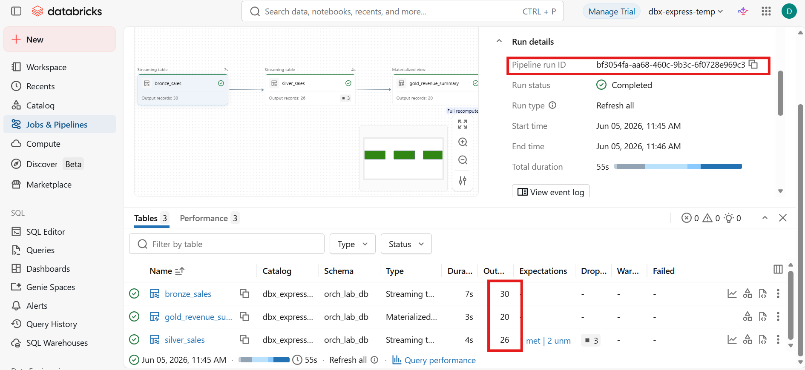

### Step 2.10: Capture the Pipeline ID

In the pipeline settings panel, locate the **Pipeline ID** (UUID at top). Copy it — you will use it when configuring the Workflow task.
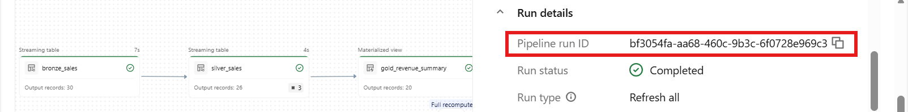
---

# Activity 3: Build the Multi-Task Databricks Workflow

**Purpose:** Create a Databricks Workflow that orchestrates the DLT pipeline and post-validation notebook with task dependencies.

### Step 3.1: Navigate to Workflows

1. Click **Jobs & Pipelines** in the left sidebar.
2. Under **Create new**, click **Job** (the third card — *"Orchestrate notebooks, pipelines, queries and more"*).

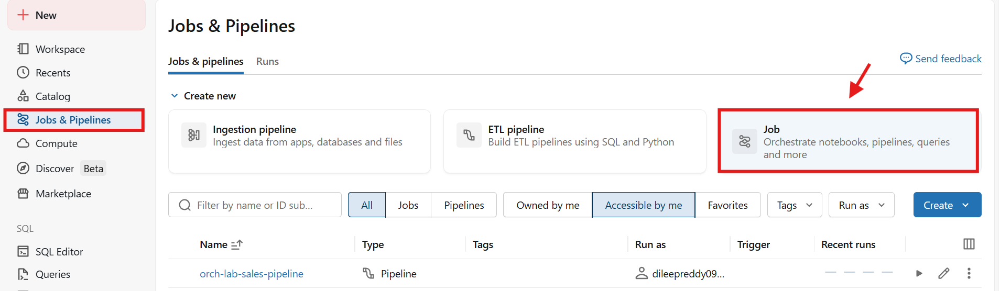

### Step 3.2: Name the Job

Click the default job name at the top and rename it to:
```
orch-lab-sales-pipeline-job
```
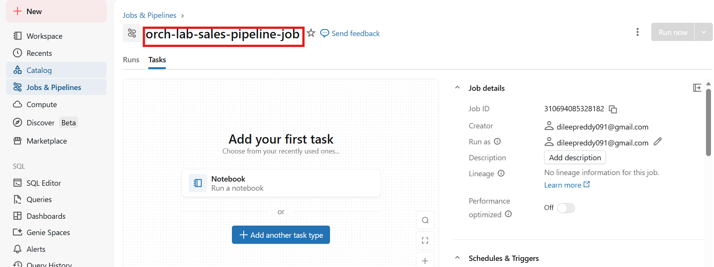


### Step 3.3: Configure Task 1 — ETL Pipeline

1. Click **+ Add another task type** → scroll to **Ingestion and Transformation** → select **ETL Pipeline**.
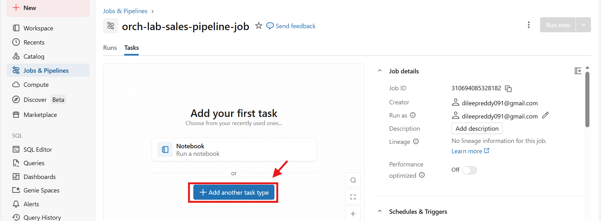
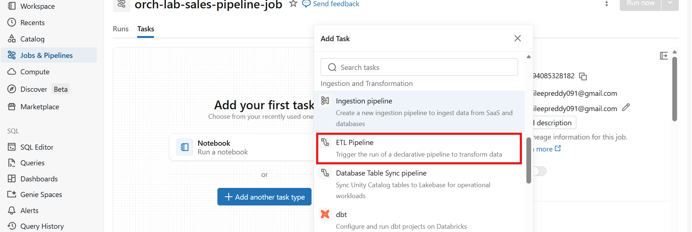
2. Fill in:

| Field | Value |
|---|---|
| **Task name** | `run_dlt_pipeline` |
| **Type** | `Pipeline` |
| **Pipeline** | Select `orch-lab-sales-pipeline` from the dropdown |
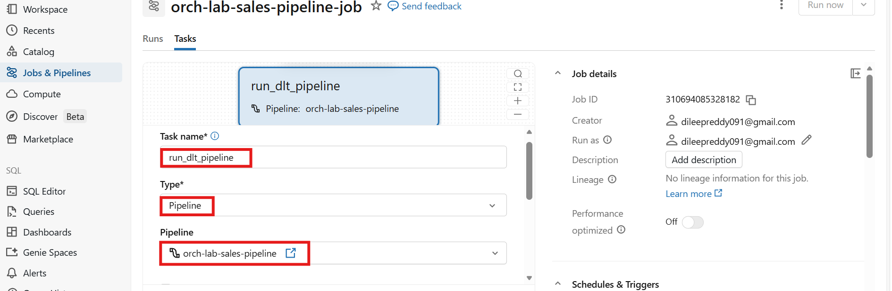

3. Scroll down to **Retries** → click **+ Add** → select **2 times (3 total attempts)** → check **Retry on timeout** → click **Confirm**.
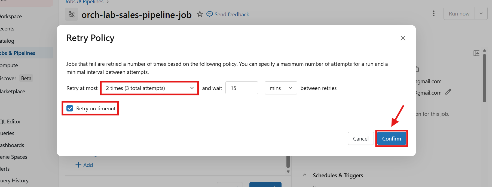
4. Click **Save task**.

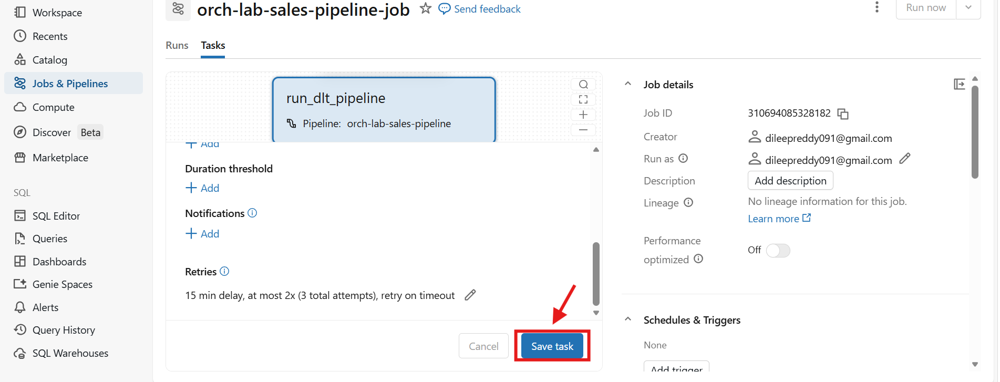

### Step 3.4: Configure Task 2 — Notebook Validation

1. Click **+ Add task** (blue button in the canvas).
2. Select **Notebook** from the task type list.
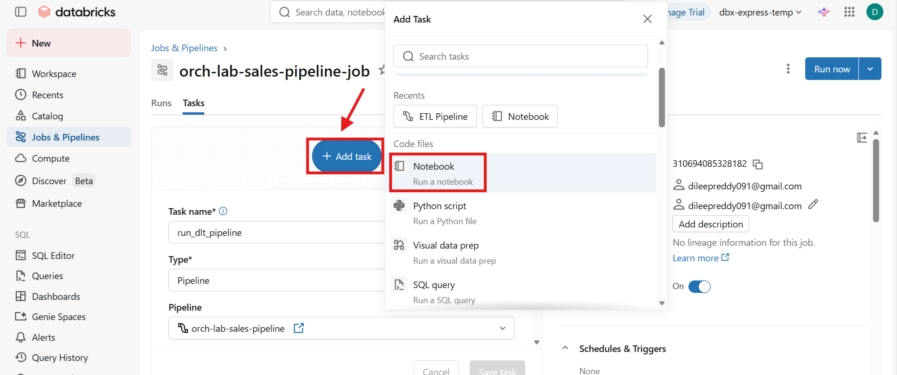
3. Fill in:

| Field | Value |
|---|---|
| **Task name** | `validate_gold_layer` |
| **Type** | `Notebook` |
| **Source** | `Workspace` |
| **Path** | Browse: `orchestration_lab` → select `04_gold_validation` → Confirm |
| **Compute** | `Serverless` (default — acceptable for notebook tasks) |
| **Depends on** | `run_dlt_pipeline` (auto-populated) |
| **Run if dependencies** | `All succeeded` |

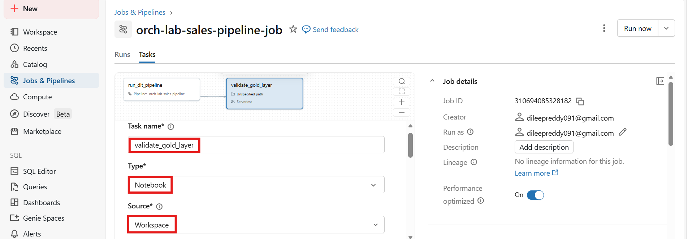
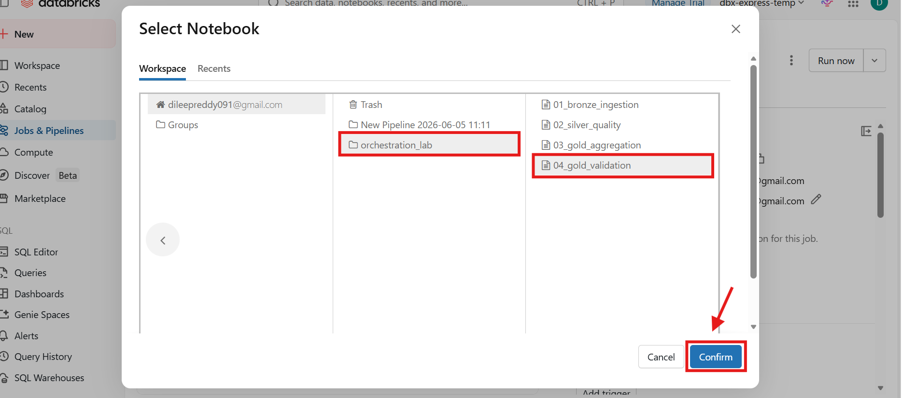


4. Scroll to **Retries** → **+ Add** → select **3 times (4 total attempts)** → **Confirm**.
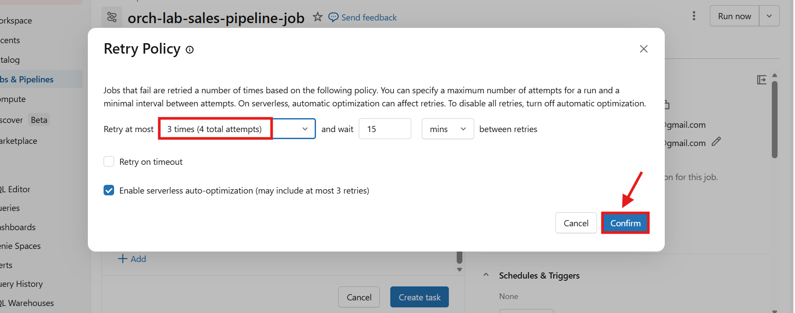
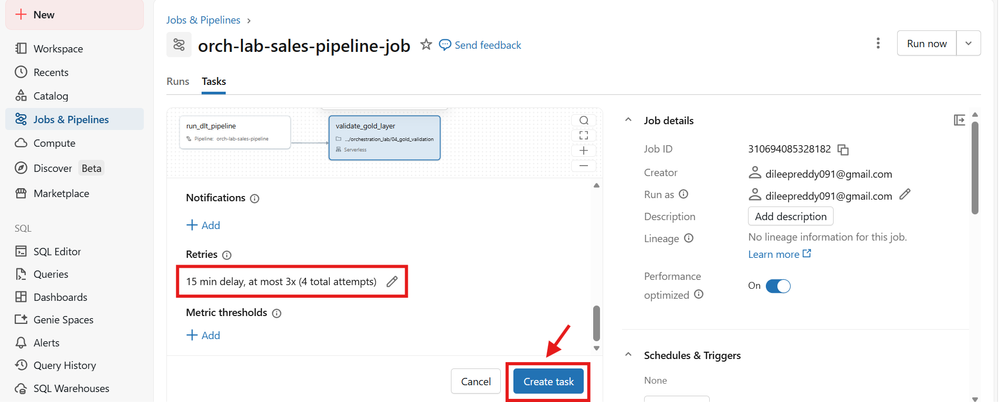
5. Click **Create task**.

### Step 3.5: Verify the Task Dependency Graph

The workflow canvas should show:
```
run_dlt_pipeline  →  validate_gold_layer
```

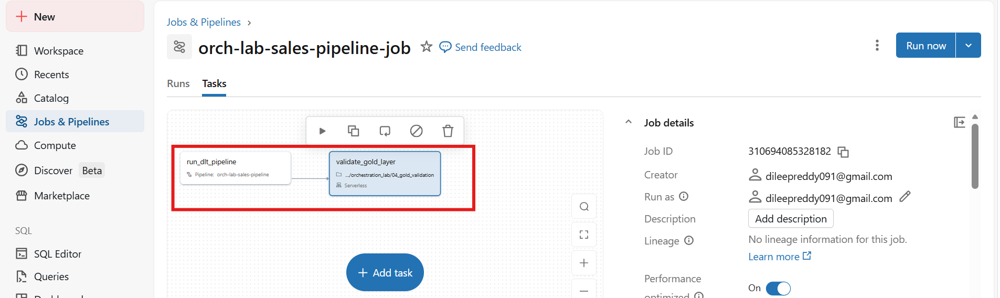

---

# Activity 4: Configure Scheduling, Retry Logic & Failure Alerting

### Step 4.1: Add a Cron Schedule

1. In the right panel under **Schedules & Triggers** → click **Add trigger**.
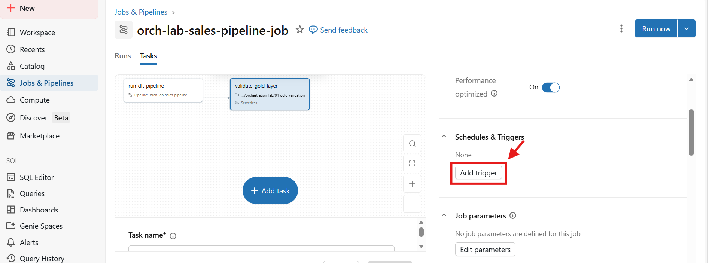
2. Set **Trigger type** to `Scheduled`.
3. Click the **Schedule** tab (not Interval).
4. Configure:

| Field | Value |
|---|---|
| **Every** | `Day` |
| **At** | `06` : `30` |
| **Timezone** | `(UTC+05:30) Asia/Calcutta` (your local timezone) |
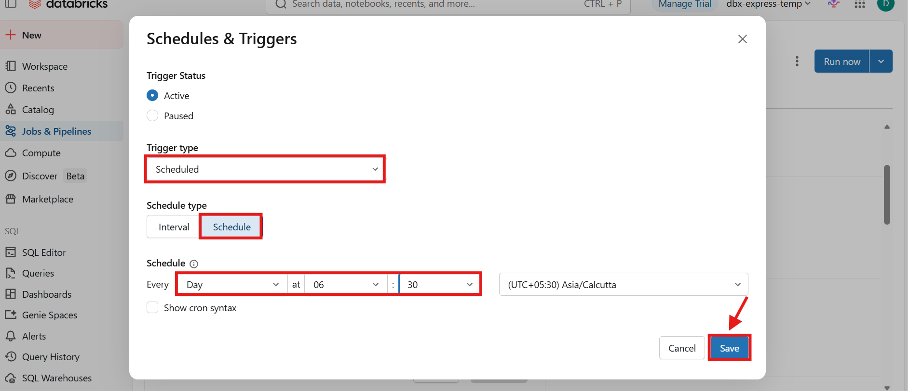
5. Click **Save**.

**Expected result on right panel:** `At 06:30 AM (UTC+05:30 — Asia/Calcutta)`

> 💡 This means the job runs automatically every day at 6:30 AM IST without manual intervention.

### Step 4.2: Configure Email Failure Notifications

1. In the right panel, scroll down to **Job notifications** → click **Edit notifications**.
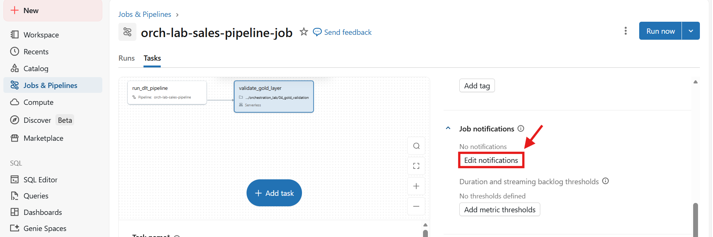
2. Click **+ Add notification**.
3. In the **Destination** dropdown → type and select your email address.
4. Ensure **Failure** checkbox is ✅ checked.
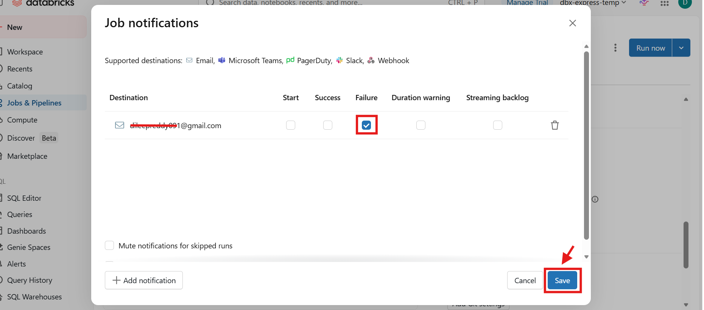
5. Click **Save**.

**Expected result:** `xxxxx@gmail.com — On failure` visible in Job notifications panel.
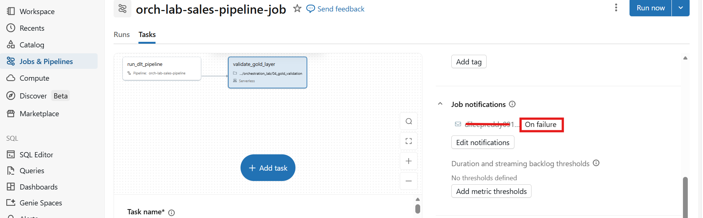

---

# Activity 5: Run the Workflow and Monitor Execution

**Purpose:** Trigger a manual run of the workflow to verify the full pipeline executes correctly end-to-end, and use the job run timeline UI to inspect each task's status and logs.

### Step 5.1: Trigger a Manual Run

1. In the job editor, click **Run now** (blue button, top right).
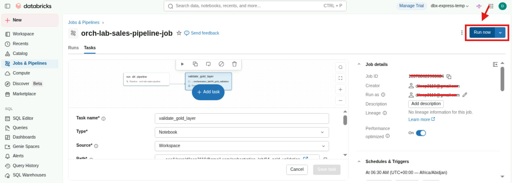
2. A toast notification appears at the top right: **"Triggered run in performance-optimized mode: `<run-id>`"**.
3. Click **"View run"** in the notification to open the run detail page.
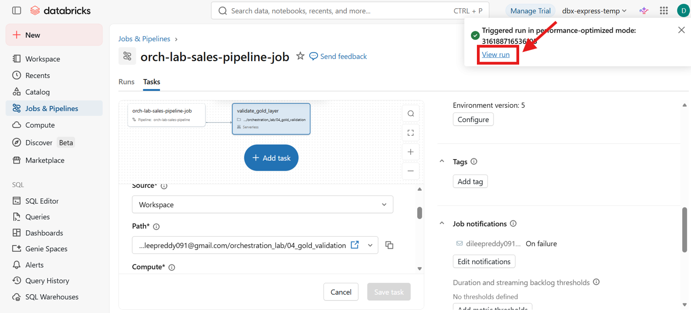


### Step 5.2: Monitor the Run Graph

The run page opens showing the **Graph** view with both tasks:

| Status | Meaning |
|---|---|
| 🟢 **Succeeded** | Task completed successfully |
| 🔴 **Failed** | Task failed — click to view logs |
| ⚫ **Skipped** | Dependency failed so this task was skipped |

**Expected Graph view:**
```
run_dlt_pipeline (Succeeded · 1m XXs)  →  validate_gold_layer (Succeeded · XXs)
Pipeline: orch-lab-sales-pipeline          .../orchestration_lab/04_gold_validation
                                           Serverless
```

On the right panel, confirm:
- **Status:** ✅ Succeeded
- **Duration:** 1m XXs
- **Launched:** Manually
- **Started:** Jun XX, 20XX, XX:XX PM
- **Ended:** Jun XX, 20XX, XX:XX PM

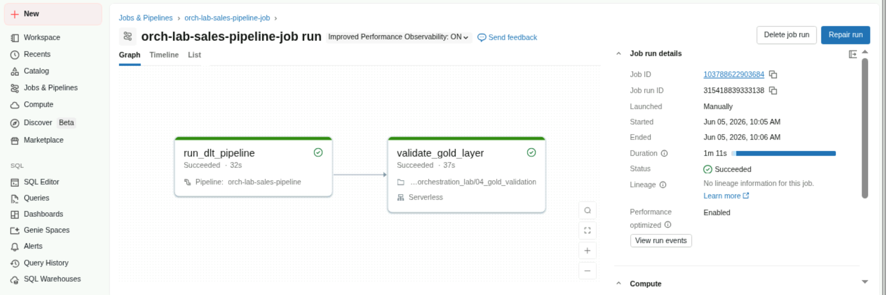

### Step 5.3: View the Run Timeline

Click the **Timeline** tab to see both tasks as horizontal bars:

- `run_dlt_pipeline` — **1m XXs** green bar
- `validate_gold_layer` — **38.XXs** green bar

The right panel shows the task-level details:
- **Job ID:** 3106940XXXXXX
- **Job run ID:** 127452XXXXX
- **Status:** Completed
- **Run type:** Refresh all
- **Total duration:** XXs

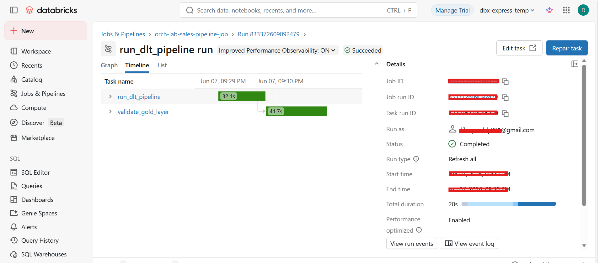

> 💡 The Timeline view is useful in production to compare run durations across days and spot if a task is consistently taking longer than expected.

---

# Activity 6: Query the Gold Layer via SQL Warehouse
**Purpose:** Connect to the Serverless SQL Warehouse and verify Gold table contents using Databricks SQL Editor.

### Step 6.1: Navigate to SQL Editor

1. Click **SQL Editor** in the left sidebar.
2. Click **"SQL Query"** to open a new query tab.
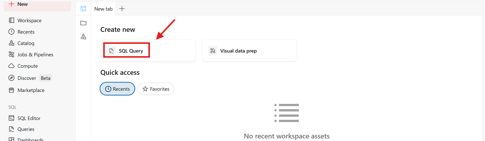
2. Select:
   - **Catalog:** `dbx_express_temp_7474644820086991` (your catalog)
   - **Schema:** `orch_lab_db`
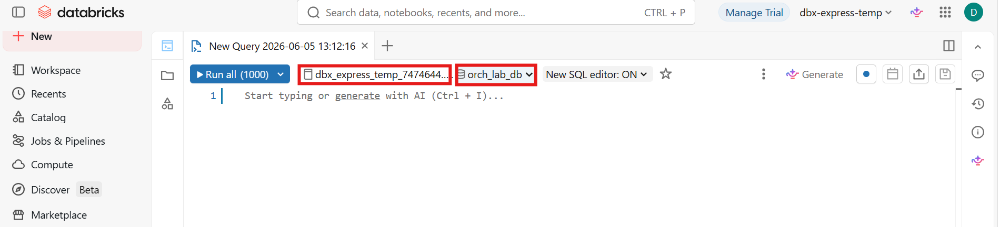

### Step 6.2: Attach the SQL Warehouse

1. Click **Run all** — a popup appears: **"Attach to an existing compute resource"**.
2. Confirm **SQL Warehouse** is selected as Compute type.
3. **Serverless Starter Warehouse** (green dot — Running) is already selected.
4. Click **"Attach and run"**.

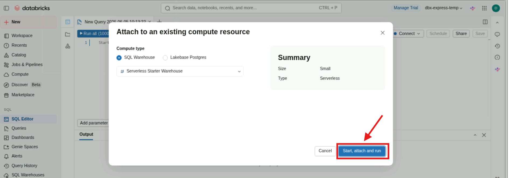

### Step 6.3: Verify Bronze Table — Row Count

```sql
SELECT COUNT(*) AS row_count FROM bronze_sales;
```

**Expected Result:** `row_count = 30`

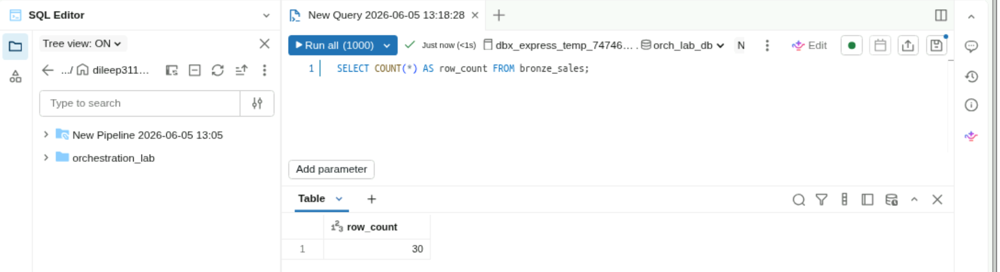

### Step 6.4: View Bronze Sample Data

```sql
SELECT * FROM orch_lab_db.bronze_sales LIMIT 10;
```

**Result — 10 rows shown, 2.73s runtime:**

| Row | order_id | customer_id | product | region | quantity | unit_price | order_date | status |
|---|---|---|---|---|---|---|---|---|
| 1 | ORD-BAD-001 | null | Monitor | North | -2 | 349.50 | 2024-01-05 | completed |
| 2 | ORD-BAD-002 | CUST-200 | Laptop | South | 0 | 899.99 | 2024-01-06 | completed |
| 3 | ORD-BAD-003 | CUST-201 | Mouse | East | 3 | -15.00 | 2024-01-07 | pending |
| 4 | ORD-BAD-004 | CUST-202 | Keyboard | West | 2 | 79.99 | 2024-01-08 | unknown |
| 5 | ORD-BAD-005 | null | Headphones | North | 1 | 149.99 | 2024-01-09 | completed |
| 6 | ORD-001 | CUST-101 | Laptop | North | 2 | 899.99 | 2024-01-05 | completed |
| ... | ... | ... | ... | ... | ... | ... | ... | ... |

**Validation Points:**
- Rows 1–5 are bad records from `sales_bad.csv` — null customer_id, negative quantity, negative price, unknown status — all preserved in Bronze (full fidelity).
- Rows 6–10 are clean records from `sales_raw.csv`.

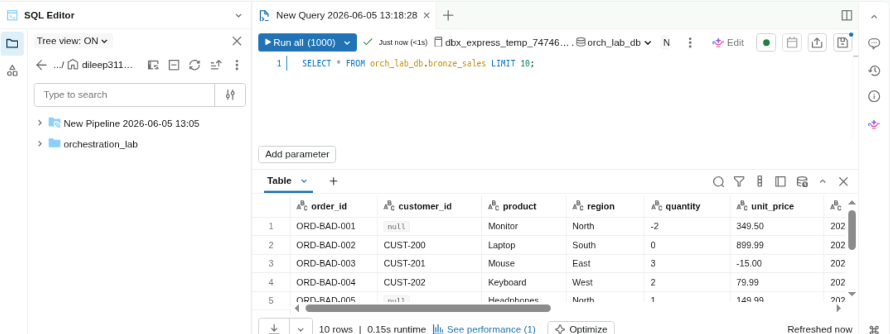

### Step 6.5: Verify Silver Table — Row Count

```sql
SELECT COUNT(*) AS row_count FROM silver_sales;
```

**Expected Result:** `row_count = 26`

> 💡 "Bronze had 30 rows. Silver has 26 — meaning 4 records were dropped. Here's what happened to each bad record:"
> - `ORD-BAD-001` — negative quantity (-2) → dropped by `quantity_positive`
> - `ORD-BAD-002` — zero quantity (0) → dropped by `quantity_positive`
> - `ORD-BAD-003` — negative unit price (-15.00) → dropped by `unit_price_positive`
> - `ORD-BAD-004` — unknown status → filtered by `.filter(status.isin(...))`
> - `ORD-BAD-005` — null customer_id but valid otherwise → **kept** (only warned by `order_id_not_null`)

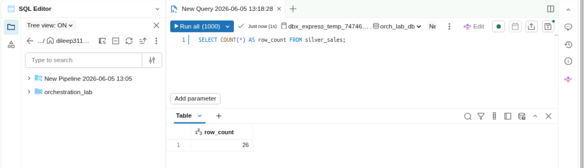

### Step 6.6: View Silver Sample Data

```sql
SELECT * FROM orch_lab_db.silver_sales LIMIT 10;
```

**Result — 10 rows shown, 2.47s runtime:**

| Row | order_id | customer_id | product | region | quantity | unit_price | order_date | status |
|---|---|---|---|---|---|---|---|---|
| 1 | ORD-BAD-005 | null | Headphones | North | 1 | 149.99 | 2024-01-09 | completed |
| 2 | ORD-001 | CUST-101 | Laptop | North | 2 | 899.99 | 2024-01-05 | completed |
| 3 | ORD-002 | CUST-102 | Monitor | South | 1 | 349.5 | 2024-01-06 | completed |
| 4 | ORD-003 | CUST-103 | Keyboard | East | 3 | 79.99 | 2024-01-07 | pending |
| 5 | ORD-004 | CUST-104 | Mouse | West | 5 | 29.99 | 2024-01-08 | completed |
| ... | ... | ... | ... | ... | ... | ... | ... | ... |

**Validation Points:**
- `ORD-BAD-005` (null customer_id) is present — `@dlt.expect` only warns, does not drop.
- No negative quantities or prices visible — all dropped by `@dlt.expect_or_drop`.
- `order_date` correctly cast to **DATE** type.
- `unknown` status records removed.

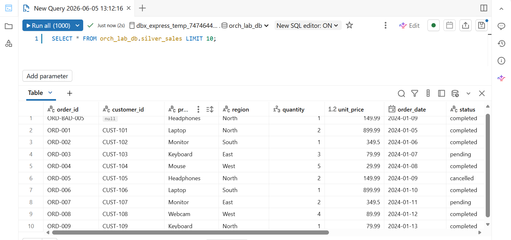

### Step 6.7: Verify Gold Table — Row Count

```sql
SELECT COUNT(*) AS row_count FROM gold_revenue_summary;
```

**Expected Result:** `row_count = 20`

(20 distinct product + region + status combinations)

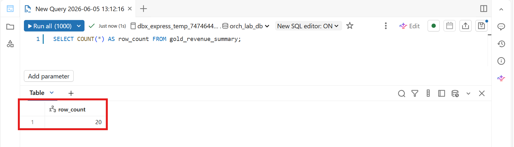

### Step 6.8: View Gold Aggregated Data

```sql
SELECT
    product,
    region,
    status,
    total_revenue,
    order_count,
    avg_unit_price,
    total_units_sold
FROM orch_lab_db.gold_revenue_summary
ORDER BY total_revenue DESC;
```

**Result — 20 rows, 2.90s runtime:**

| product | region | status | total_revenue | order_count | avg_unit_price | total_units_sold |
|---|---|---|---|---|---|---|
| Laptop | North | completed | 3599.96 | 3 | 899.99 | 4 |
| Laptop | East | completed | 1799.98 | 1 | 899.99 | 2 |
| Monitor | South | cancelled | 1048.5 | 1 | 349.5 | 3 |
| Laptop | South | completed | 899.99 | 1 | 899.99 | 1 |
| Webcam | West | completed | 809.91 | 2 | 89.99 | 9 |
| Headphones | East | completed | 749.95 | 2 | 149.99 | 5 |
| Monitor | East | pending | 699 | 1 | 349.5 | 2 |
| Keyboard | East | completed | 479.94 | 1 | 79.99 | 6 |
| Keyboard | North | completed | 399.95 | 2 | 79.99 | 5 |
| Monitor | West | completed | 349.5 | 1 | 349.5 | 1 |
| ... | ... | ... | ... | ... | ... | ... |

**Validation Points:**
- Revenue aggregated by product, region, and status.
- `order_count` and `total_units_sold` summed correctly.
- Results ordered by highest revenue first.

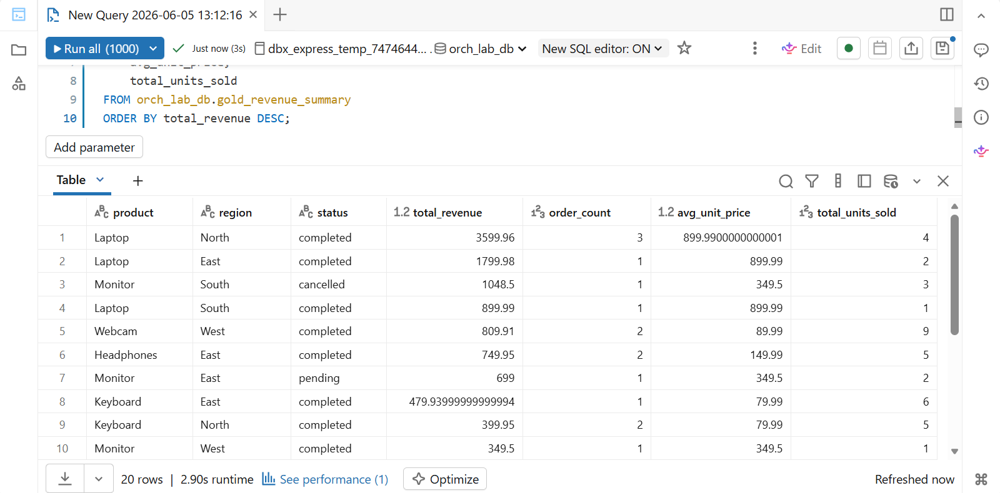

---

# Activity 7: Build the SQL Dashboard

**Purpose:** Create a Databricks SQL dashboard with KPI Counter tiles and a bar chart that summarizes pipeline output for business stakeholders.

### Step 7.1: Create a New Dashboard

1. Click **Dashboards** in the left sidebar.
2. Click **Create dashboard** (top right).
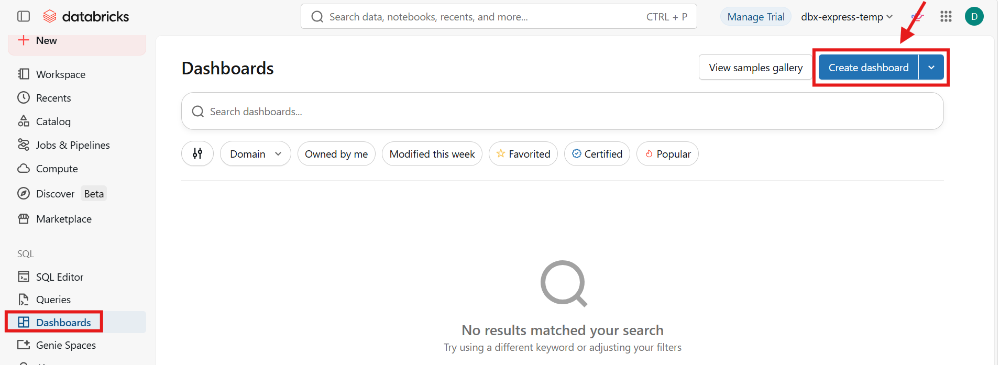
3. A new dashboard opens with a Genie AI prompt box.
4. Click the dashboard name at the top and rename it to:
   ```
   Sales Pipeline — Revenue Analytics
   ```
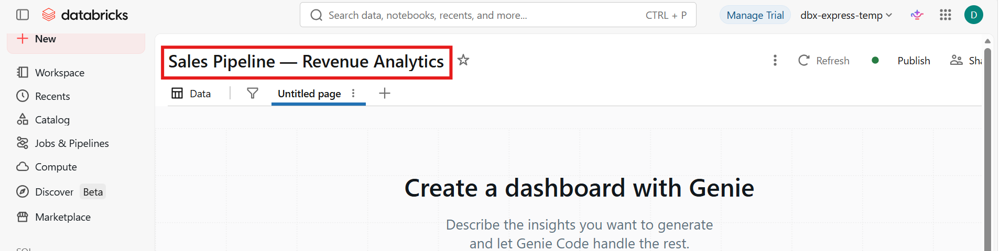
5. Click **"CREATE MANUALLY"** at the bottom to build widgets manually.
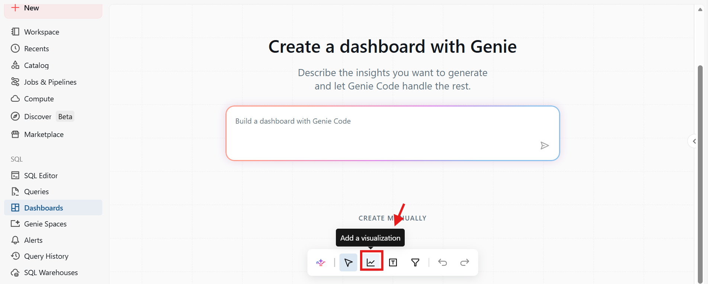


### Step 7.2: Add Datasets via the Data Tab

The new Databricks dashboard UI requires you to add SQL datasets first before creating visualizations.

1. Click the **"Data"** tab at the top left.
2. Click **"+ Add SQL dataset"**.
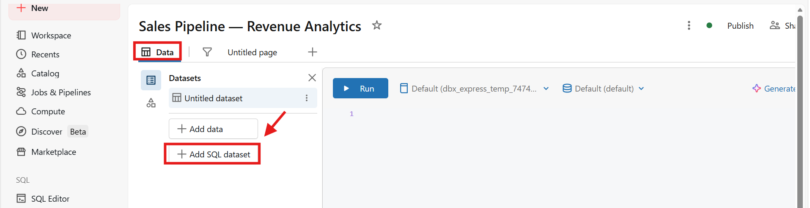
3. A SQL editor opens on the right. Enter the first query:

```sql
SELECT ROUND(SUM(total_revenue), 2) AS total_pipeline_revenue
FROM orch_lab_db.gold_revenue_summary;
```

4. Click **Run** → confirms result: `total_pipeline_revenue = 13285.79`
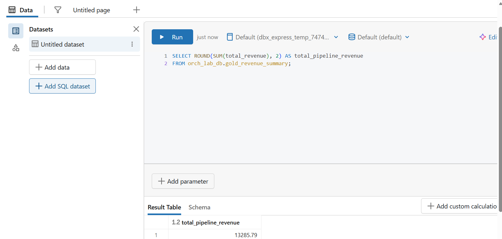
5. Rename the dataset by clicking on `"Untitled dataset 1"` → rename to `Total Revenue Summary from Gold Pipeline Data`.


6. Click **"+ Add SQL dataset"** again → enter:

```sql
SELECT SUM(order_count) AS total_orders
FROM orch_lab_db.gold_revenue_summary;
```

7. Click **Run** → confirms result: `total_orders = 26`
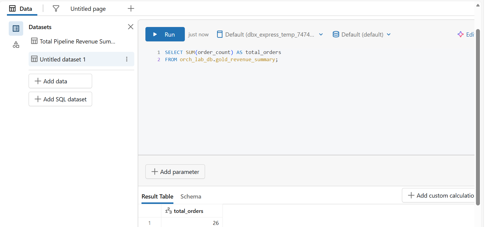
8. Rename to `Aggregate Order Count from Gold Pipeline Data`.

9. Click **"+ Add SQL dataset"** again → enter:

```sql
SELECT product, ROUND(SUM(total_revenue), 2) AS total_revenue
FROM orch_lab_db.gold_revenue_summary
GROUP BY product
ORDER BY total_revenue DESC;
```
10. Rename the dataset by clicking on `"Untitled dataset 1"` → rename to `Product revenue summary by sales performance`.
11. Click **Run** → confirms results:

| product | total_revenue |
|---|---|
| Laptop | 6299.93 |
| Monitor | 2446.50 |
| Headphones | 1349.91 |
| Webcam | 1259.86 |
| Keyboard | 1119.86 |
| Mouse | 809.73 |

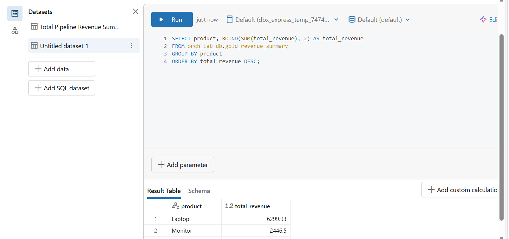

### Step 7.3: Build the Total Revenue KPI Tile

1. Click the **"Untitled page"** tab to go to the canvas.
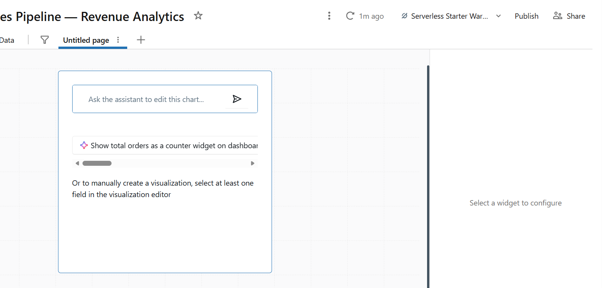
2. A blank widget appears on the canvas. Click on it to select it — the right configuration panel opens.
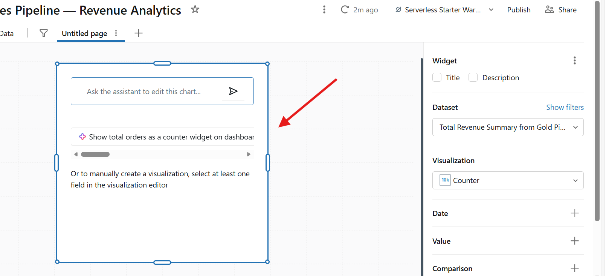
3. In the right panel configure:

| Field | Value |
|---|---|
| **Dataset** | `Total Revenue Summary from Gold Pipeline Data` |
| **Visualization** | `Counter` |

4. Click **"+"** next to **Value** → a field picker dropdown appears.
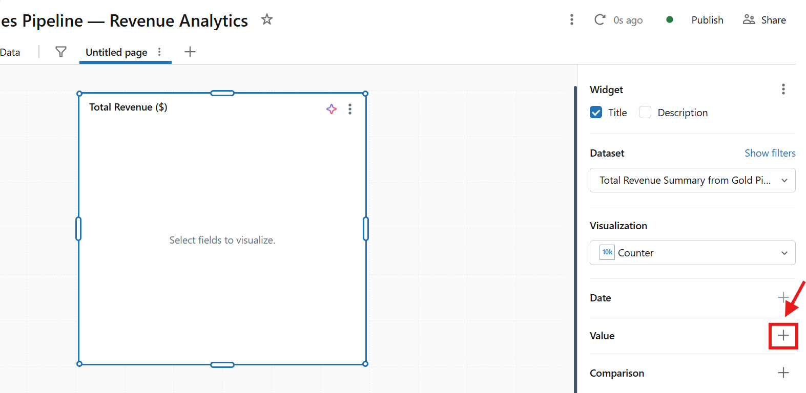
5. Under **Fields**, click **`total_pipeline_revenue`** to select it.
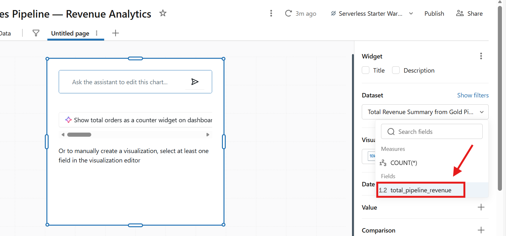
6. Check the **Title** checkbox under Widget → type `Total Revenue ($)`.
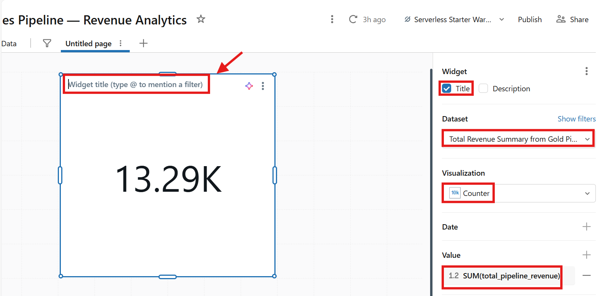
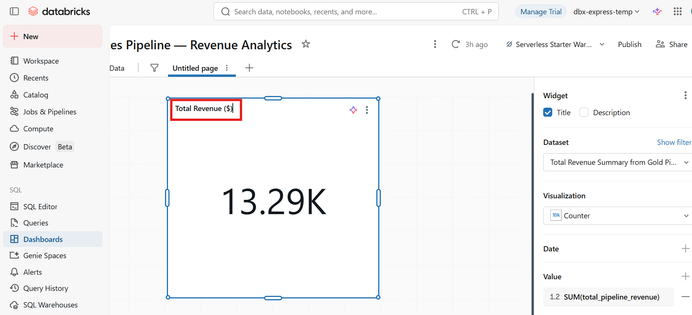

### Step 7.4: Add the Total Orders KPI Tile

1. Click somewhere on the canvas outside the first widget to deselect.
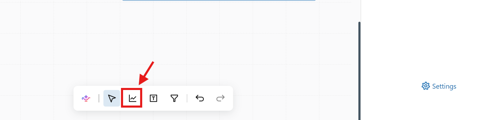
2. In the bottom toolbar, click the **Visualization icon** (bar chart icon) to add a new widget.
3. Configure:

| Field | Value |
|---|---|
| **Dataset** | `Aggregate Order Count from Gold Pipeline Data` |
| **Visualization** | `Counter` |
| **Value** | `total_orders` |
| **Title** | `Total Orders` |

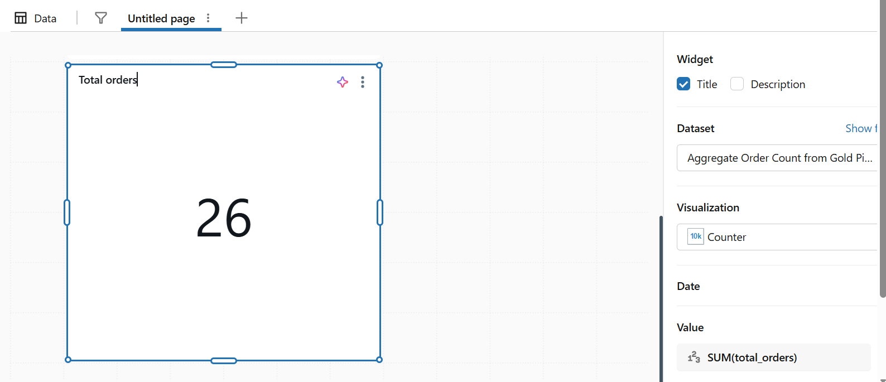

### Step 7.5: Add the Revenue by Product Bar Chart

1. Add another widget from the bottom toolbar.
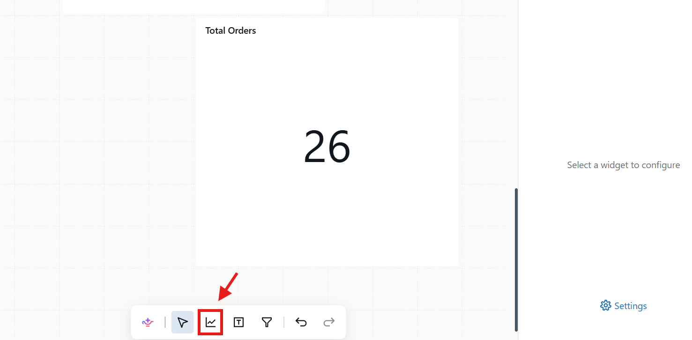
2. Configure:

| Field | Value |
|---|---|
| **Dataset** | `Product revenue summary by sales performance` |
| **Visualization** | `Bar` |
| **X axis** | `product` |
| **Y axis** | `total_revenue` |
| **Title** | `Revenue by Product` |

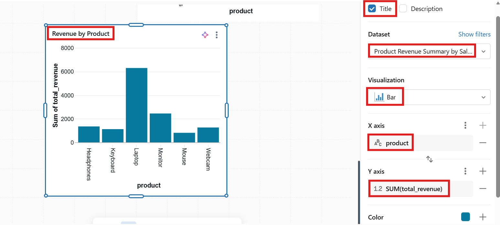

### Step 7.6: Publish the Dashboard

1. Click **Publish** (top right button).
2. The dashboard is now viewable by other workspace users.
3. Click **Share** to add team members if needed.
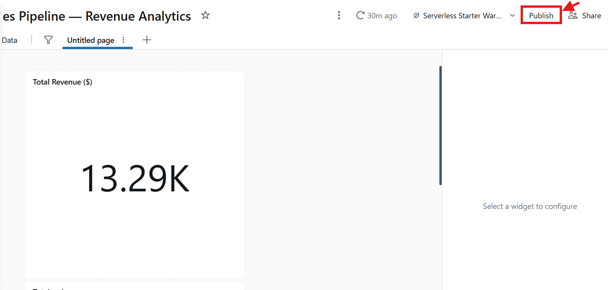
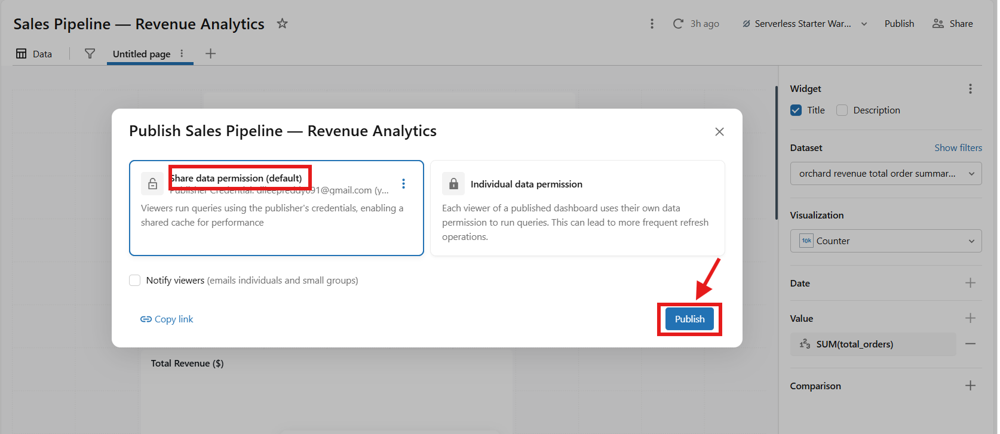
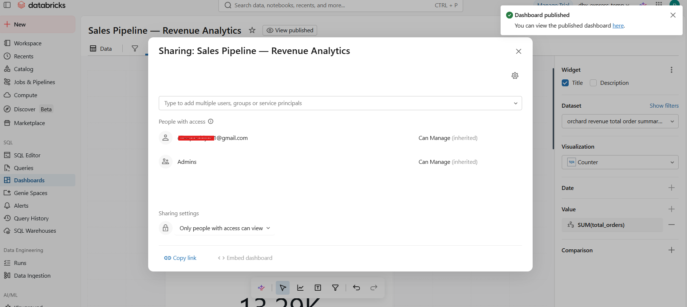

---

# Activity 8: Configure a Scheduled Query Alert

**Purpose:** Create a monitoring alert that fires automatically when total revenue in the Gold table drops below a defined threshold — simulating a production data SLA monitor.

### Step 8.1: Navigate to Alerts

1. Click **"Alerts"** in the left sidebar.
2. Click **"Create alert"** (top right).
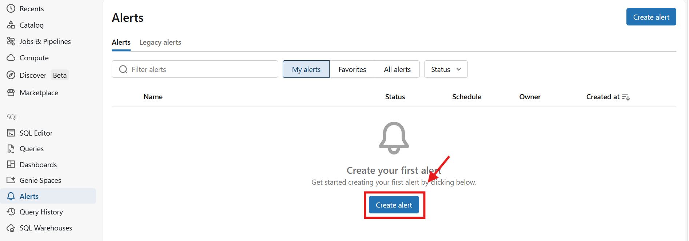
3. A new alert page opens — **"New Alert"** — with three sections shown:
   - **1. Write and run a query**
   - **2. Configure the alert** (right panel)
   - **3. Schedule the alert**
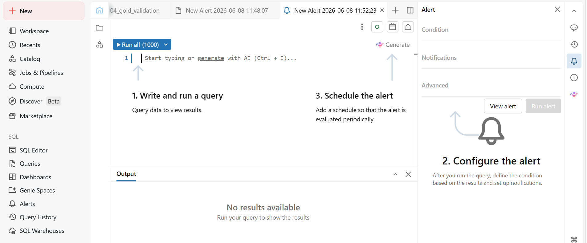
### Step 8.2: Write and Run the Monitoring Query

1. Click in the query editor (line 1) and type:

```sql
SELECT ROUND(SUM(total_revenue), 2) AS total_revenue
FROM orch_lab_db.gold_revenue_summary;
```

2. Click **Run all** → a popup appears: **"Attach to an existing compute resource"**.
3. Select **Serverless Starter Warehouse** → click **"Attach and run"**.
4. Result confirms: `total_revenue = 13285.79` ✅
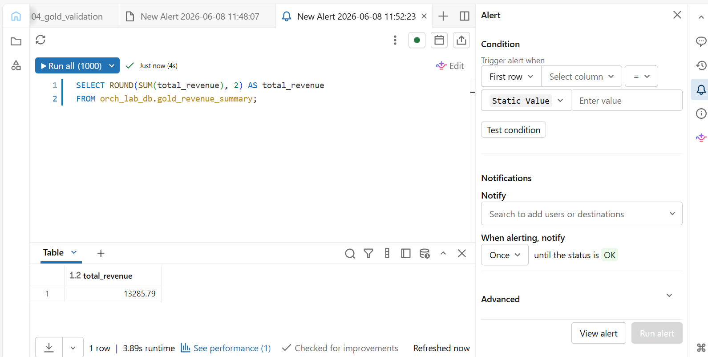

### Step 8.3: Configure the Alert Condition

Once the query runs, the right panel **"Condition"** section activates:

1. **Column** — select `total_revenue` from the dropdown.
2. **Operator** — select `<` (less than).
3. **Threshold value** — type `5000`.
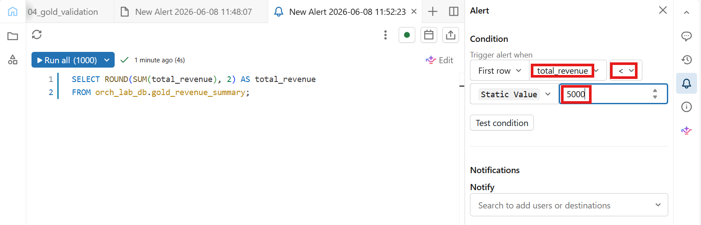

This means: fire the alert when `total_revenue < 5000`.

### Step 8.4: Add Email Notification

1. In the right panel, scroll to **"Notifications"** section.
2. Click **"Add notification"** or the **+** button.
3. Enter your email: `dileepreddy091@gmail.com`.
4. In the **"When alerting, notify"** section, select **Once** from the dropdown — this fires the alert email once when the condition is first triggered, not repeatedly on every run.
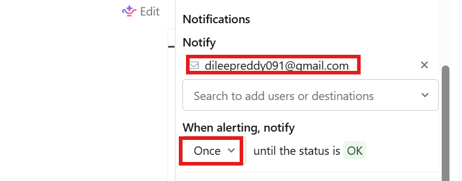
### Step 8.5: Rename and Save the Alert

1. Click on the alert name at the top (`New Alert 2026-06-05 17:35:40`) and rename it to:
   ```
   Low Revenue Alert — Gold Layer
   ```
2. Click **Save** (or the save button in the top bar).
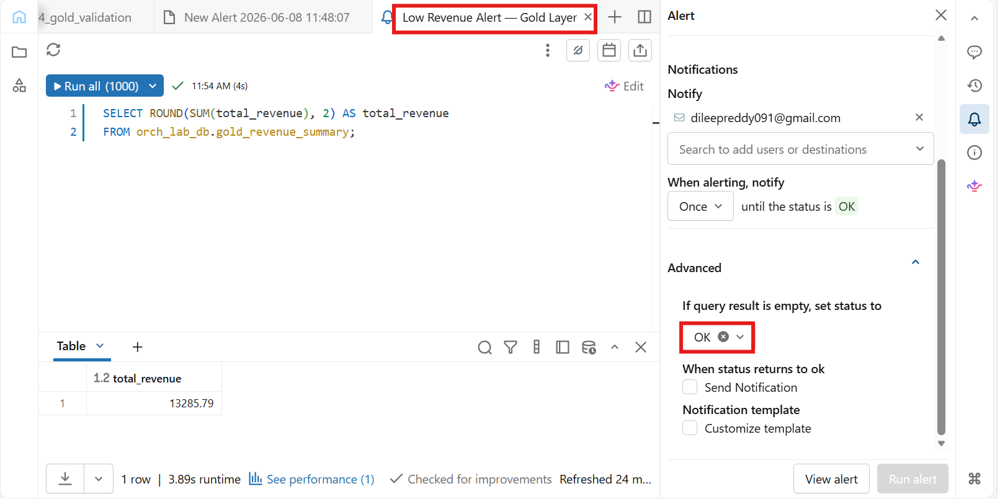

### Step 8.6: Add a Schedule to the Alert

1. Click the **schedule icon** (calendar icon 📅) in the top bar of the alert page.
2. A schedule panel opens. Configure:

| Field | Value |
|---|---|
| **Every** | `Day` |
| **At** | `07` : `00` |
| **Timezone** | `(UTC+05:30) Asia/Calcutta` |

3. Click **Save**.
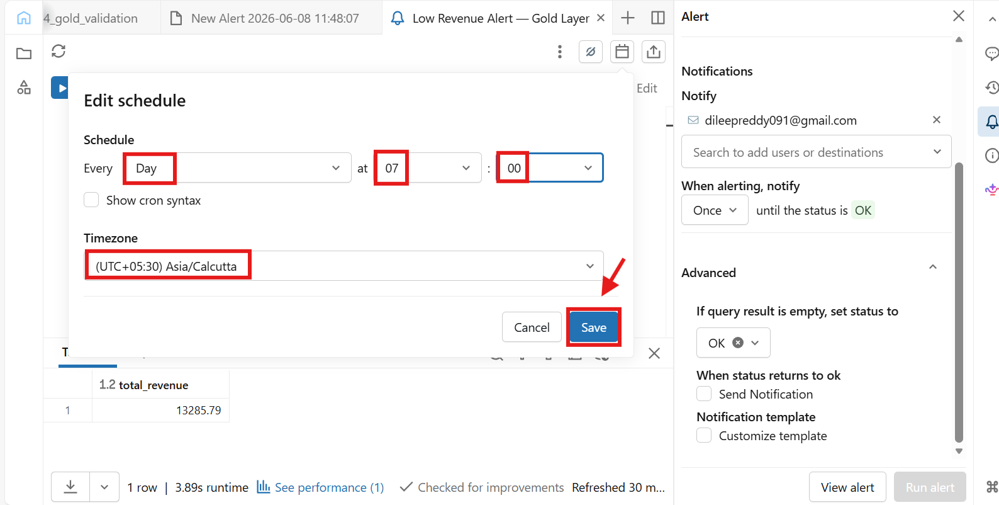

> 💡 The alert runs 30 minutes after the pipeline (06:30 AM) to ensure Gold data is fully loaded before the check fires.

### Step 8.7: Verify Alert State

1. Click **"View alert"** (bottom right of the Alert panel) — the alert detail page opens.
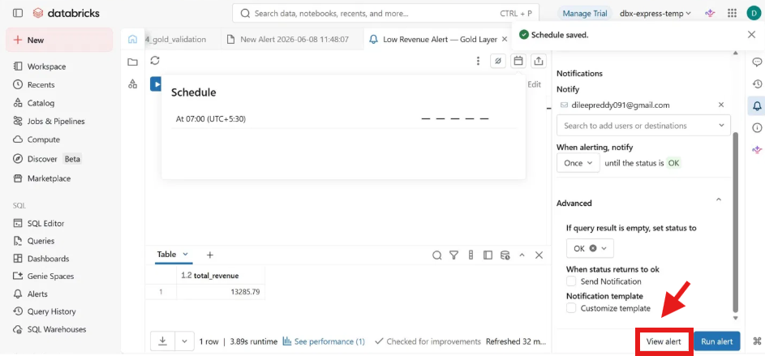
2. Scroll down to **"Latest status"** — it shows **"Not Run"** initially.
3. Click **"Run now"** (top right button) to trigger the alert manually.
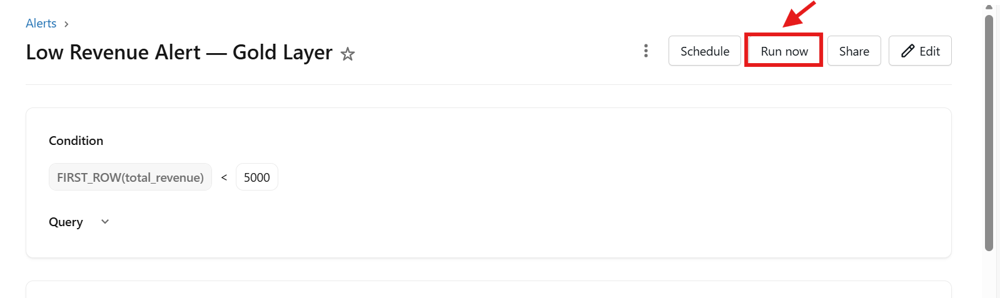
4. The **History** table updates with a new row showing:
   - **Evaluated at:** current timestamp
   - **Status:** `OK`
5. Scroll down to confirm **"About this alert"** section shows:
   - **Condition:** `FIRST_ROW(total_revenue) < 5000`
   - **Notifications:** `dileepreddy091@gmail.com`
   - **Notification frequency:** `Once`
   - **Empty result state:** `OK`
   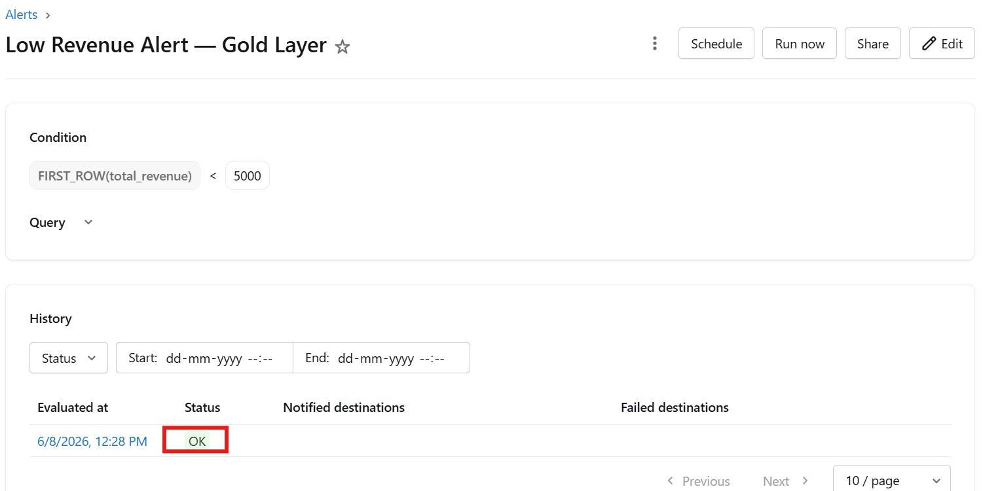

> 💡 **Status: OK** means the condition is NOT met — current revenue ($13,285.79) is well above the $5,000 threshold. The alert will only fire and send an email when `total_revenue` drops below $5,000.
---

## 🎓 Conclusion

This guided project demonstrated how to build, orchestrate, monitor, and analyze a complete production-grade Lakehouse pipeline on Databricks with an AWS S3 backend.

**Key accomplishments and actual results:**

- **AWS & IAM setup** — created S3 bucket `orch-lab-784266215529`, IAM policy (`orch-lab-s3-policy`), IAM role (`orch-lab-instance-profile`), and S3 bucket policy.
- **Cluster configuration** — created `orch-lab-cluster` on Runtime 13.3 LTS with Spark config AWS credentials.
- **Bucket name update** — updated `S3_BUCKET = "orch-lab-784266215529"` in `01_bronze_ingestion` before pipeline run. Critical step — skipping causes "Invalid URI: null or empty" error.
- **DLT pipeline** — configured `orch-lab-sales-pipeline`:
  - Bronze: 30 rows ingested from S3 (25 clean + 5 bad)
  - Silver: 26 rows after DQ (4 records dropped — negative qty, zero qty, negative price, unknown status)
  - Gold: 20 rows aggregated by product/region/status
  - Target schema: `orch_lab_db` in catalog `dbx_express_temp_7474644820086991`
- **DQ fix** — changed `unit_price_positive` from `@dlt.expect_or_fail` → `@dlt.expect_or_drop` to allow pipeline completion when bad records exist.
- **Multi-task Workflow** — `orch-lab-sales-pipeline-job`:
  - Task 1: `run_dlt_pipeline` (ETL Pipeline) — Succeeded in **1m 2s**
  - Task 2: `validate_gold_layer` (Notebook, Serverless) — Succeeded in **38s**
  - Total job duration: **1m 41s**
- **Scheduling** — daily at 06:30 AM IST (UTC+05:30 Asia/Calcutta).
- **Retry logic** — Task 1: 2 retries (3 total attempts) with timeout retry. Task 2: 3 retries (4 total attempts).
- **Failure alerting** — email to `dileepreddy091@gmail.com` on job failure.
- **SQL verification** — confirmed via SQL Editor:
  - Bronze: 30 rows ✅
  - Silver: 26 rows ✅
  - Gold: 20 rows, total revenue = **$13,285.79** ✅
- **Dashboard** — `Sales Pipeline — Revenue Analytics` with:
  - Counter KPI: Total Revenue = **$13,285.79**
  - Counter KPI: Total Orders = **26**
  - Bar chart: Revenue by Product (Laptop $6,299.93 highest)
- **Scheduled alert** — `Low Revenue Alert — Gold Layer` fires when `total_revenue` < $5,000. Current state: **OK** ($13,285.79 > $5,000).
