# Guided Project: PySpark Transformations & Engineering Patterns

---

## 🌟 Overview: What is the Purpose of this Lab?

Welcome to this lab of your Data Engineering journey! If you've ever wondered how companies like Netflix or Airbnb take messy, raw employee data and transform it into clean, reliable datasets stored in the cloud — this is exactly how they do it.

**The Purpose of this Lab:**
Raw data is almost never clean. In production pipelines, data arrives with missing values, inconsistent casing, duplicate records, invalid dates, and structural inconsistencies. This lab takes you through a complete **Bronze-to-Silver transformation pipeline** — the industry-standard first step in a Medallion Architecture data lake — using **PySpark on AWS Glue**.

By the end of this lab, you will have built a PySpark pipeline that reads raw JSON from Amazon S3, applies schema enforcement, cleans and deduplicates records, writes partitioned Parquet output to S3, and simulates **Change Data Capture (CDC)** logic by comparing two data snapshots.

### 🗺️ Learning Path

1. **Cloud Storage Setup** — Create an Amazon S3 bucket with `bronze/` and `silver/` folders to act as your data lake storage layer.
2. **File Preparation** — Create two JSON snapshot files locally and upload them to S3 via the AWS Console.
3. **IAM Role** — Create an IAM role to allow AWS Glue to access S3 and start interactive sessions.
4. **Glue Notebook Launch** — Spin up an **AWS Glue Notebook** — a fully managed PySpark environment with no local setup required.
5. **Schema Enforcement** — Read raw JSON (Bronze layer) into a PySpark DataFrame with an explicit schema applied.
6. **Data Profiling** — Identify nulls, duplicates, casing issues, and structural inconsistencies.
7. **Data Cleaning** — Apply systematic transformations: deduplication, null handling, type casting, and column standardisation.
8. **Silver Layer Write** — Write cleaned output as **partitioned Parquet** to S3 (the Silver layer).
9. **CDC Simulation** — Compare two data snapshots and classify records as `new`, `updated`, or `unchanged`.

---
## 🏅 Understanding the Medallion Architecture

### Understanding Bronze, Silver and Gold Layers
This lab follows the **Medallion Architecture** — a simple way to organise data in layers, where each layer improves the quality of data from the previous one.

Think of it like this:

> 🥉 **Bronze** = Raw, unprocessed data exactly as it arrived — messy, with errors and duplicates. We never modify this.
>
> 🥈 **Silver** = Cleaned, structured, and reliable data — ready for analysis and reporting.
>
> 🥇 **Gold** = Business-ready summaries and aggregations — not covered in this lab.

| Layer | Where in This Lab | What It Contains |
|---|---|---|
| 🥉 **Bronze** | `s3://your-bucket/bronze/` | Raw JSON files with nulls, duplicates, bad dates, inconsistent casing |
| 🥈 **Silver** | `s3://your-bucket/silver/` | Cleaned Parquet files, partitioned by department or CDC status |

### Why Do We Need Both?

- **Bronze preserves the original data.** If you make a mistake during cleaning, you can always go back and reprocess from Bronze.
- **Silver is what analysts and dashboards use.** It is clean, fast to query, and trustworthy.
- The pipeline in this lab reads from Bronze → cleans → writes to Silver. This is called a **Bronze-to-Silver pipeline**.

> 💡 A key rule: **never overwrite or modify Bronze data.** Always write your cleaned output to a separate Silver location.

---

## 📊 Dataset Used

**Files:**
- `snapshot_v1.json` — Initial data snapshot (Bronze layer, Day 1)
- `snapshot_v2.json` — Updated data snapshot (Bronze layer, Day 2, with new and modified records)

**Content:**
- Employee-style records with fields: `employee_id`, `name`, `department`, `salary`, `status`, `hire_date`.
- Intentionally contains real-world data quality issues: missing values, duplicate records, inconsistent casing, and null fields.
- `snapshot_v2.json` introduces new records and modifies some existing ones — simulating real CDC scenarios.

---

## 🎯 Lab Objectives

By completing this lab, you will:

- Create and configure an **AWS Glue Notebook** as a managed PySpark execution environment.
- Apply an explicit schema to raw JSON data using `StructType` and `StructField`.
- Use PySpark transformations — `withColumn`, `dropDuplicates`, `trim`, `lower`, `initcap`, `to_date` — to clean Bronze-layer data.
- Write output as **Parquet partitioned by department** — the Silver-zone standard for query-optimised storage.
- Implement a **CDC MERGE simulation** using `join` and conditional logic to classify records.
- Understand the **Bronze → Silver** medallion pipeline pattern used in production data lakes.

---

## ✅ Prerequisites

Ensure the following are available before starting:

- Access to the **AWS Management Console** with permissions for S3, IAM, and AWS Glue.
- AWS region set to **us-east-1 (N. Virginia)**.
- Sample JSON snapshot files ready to upload (contents provided in Activity 1).

> ⚠️ All PySpark code in this lab runs inside the **AWS Glue Notebook**. No local Python, Java, or PySpark installation is required on your machine.

---

## Configure AWS Credentials

- Login to AWS Console:
  - Click on the `Lab Access` icon on the desktop.
    
  - Click on `Access Lab` and using the given credentials login to AWS Console.
    
  - Once logged in, set the region to `us-east-1`. All resources must be created in **US-EAST-1 (N. Virginia)**.
  - Locate the region selector at the top-right corner of the console.
    
  - Choose **us-east-1 (N. Virginia)**.
    

---

# Activity 1: Create S3 Bucket and Upload Snapshot Files

## Step 1.1 — Create the S3 Bucket via AWS Console

You will create the target S3 bucket manually through the console. This bucket will hold both the raw JSON snapshots (Bronze) and the cleaned Parquet output (Silver).

1. In the AWS Management Console search bar, type **S3** and select it from the services menu.
   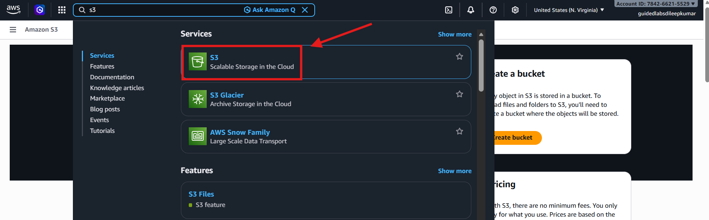
2. Click the **Create bucket** button.
   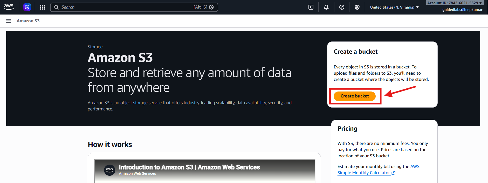
3. **Bucket Name Configuration:**
   - Provide a globally unique name using the following format: `pyspark-pipeline-lab-<USER_INPUT>`
   - _Replace `<USER_INPUT>` with your unique identifier. For example: `pyspark-pipeline-lab-xxxx`._
4. **AWS Region:** Ensure it is set to **us-east-1 (N. Virginia)**.
   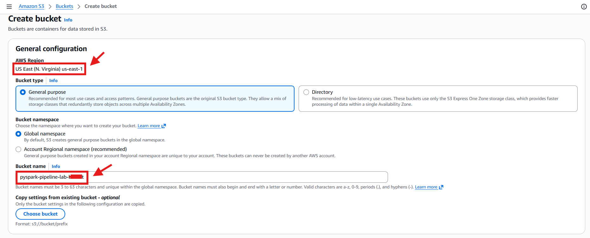
5. Leave all other settings as default. **Block all public access** must remain checked.
6. Scroll to the bottom and click **Create bucket**.
   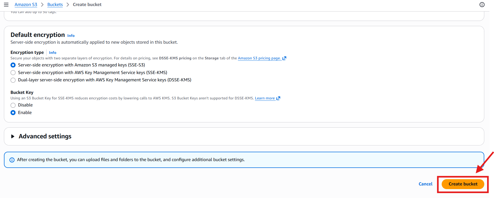

Inside the bucket, create the following folders:

| Folder | Purpose |
|---|---|
| `bronze/` | Stores raw JSON snapshots — the Bronze zone |
| `silver/` | Stores cleaned Parquet output — the Silver zone |

To create the folders:
- Open your bucket → **Create folder** → type `bronze` → **Create folder**.
  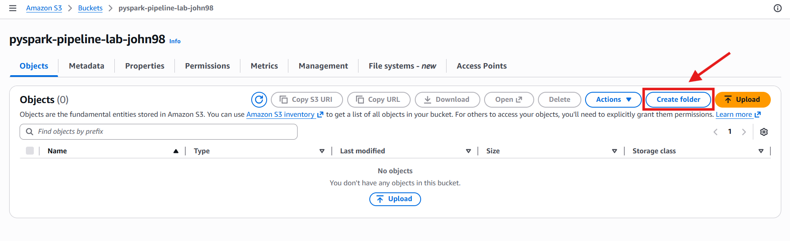
  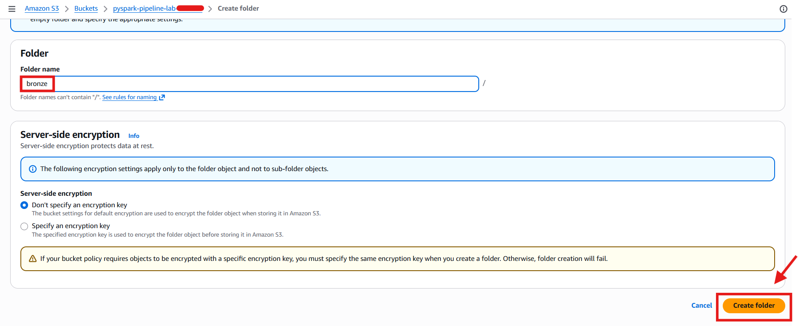
- Repeat for `silver`.
  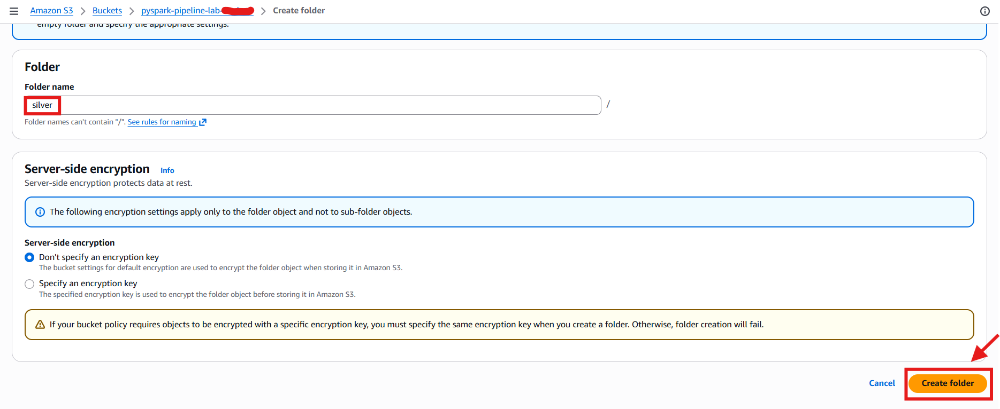

---

## Step 1.2 — Create Sample JSON Snapshot Files

On your local machine, create the following two files using **Notepad** or any text editor and save them to your Desktop.

### `snapshot_v1.json`

```json
{"employee_id": 1, "name": "Alice Johnson", "department": "engineering", "salary": 95000, "status": "Active", "hire_date": "2021-03-15"}
{"employee_id": 2, "name": "bob smith", "department": "Sales", "salary": null, "status": "active", "hire_date": "2020-07-01"}
{"employee_id": 3, "name": "  Carol White  ", "department": "HR", "salary": 72000, "status": "INACTIVE", "hire_date": "2019-11-20"}
{"employee_id": 4, "name": "David Lee", "department": "Finance", "salary": 88000, "status": "active", "hire_date": "invalid-date"}
{"employee_id": 5, "name": "Eve Martinez", "department": "engineering", "salary": 105000, "status": "Active", "hire_date": "2022-01-10"}
{"employee_id": 2, "name": "bob smith", "department": "Sales", "salary": null, "status": "active", "hire_date": "2020-07-01"}
{"employee_id": 6, "name": null, "department": "Legal", "salary": 67000, "status": "active", "hire_date": "2018-05-30"}
```

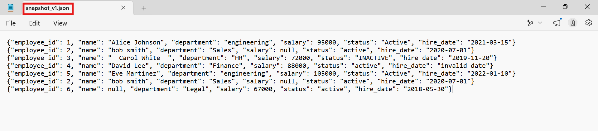

### `snapshot_v2.json`

```json
{"employee_id": 1, "name": "Alice Johnson", "department": "engineering", "salary": 99000, "status": "Active", "hire_date": "2021-03-15"}
{"employee_id": 2, "name": "Bob Smith", "department": "Sales", "salary": 74000, "status": "active", "hire_date": "2020-07-01"}
{"employee_id": 3, "name": "Carol White", "department": "HR", "salary": 72000, "status": "inactive", "hire_date": "2019-11-20"}
{"employee_id": 4, "name": "David Lee", "department": "Finance", "salary": 88000, "status": "active", "hire_date": "2023-06-01"}
{"employee_id": 5, "name": "Eve Martinez", "department": "engineering", "salary": 105000, "status": "Active", "hire_date": "2022-01-10"}
{"employee_id": 6, "name": "Frank Nguyen", "department": "Legal", "salary": 67000, "status": "active", "hire_date": "2018-05-30"}
{"employee_id": 7, "name": "Grace Kim", "department": "Engineering", "salary": 91000, "status": "active", "hire_date": "2024-02-14"}
```

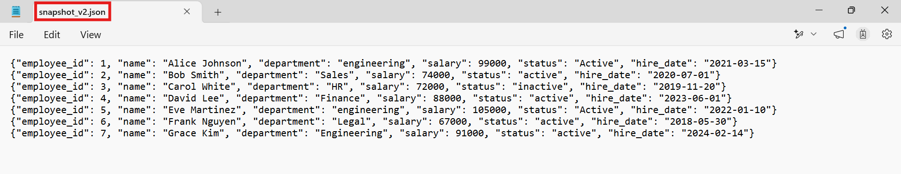

> 💡 `snapshot_v2.json` simulates a Day 2 data pull: `employee_id` 1 has a salary update, `employee_id` 6 has a name fix, and `employee_id` 7 is a brand-new hire.

---

## Step 1.3 — Upload Files to S3 via AWS Console

1. In the AWS Console, navigate to **S3** → open your bucket `pyspark-pipeline-lab-<USER_INPUT>`.
2. Click the **`bronze/`** folder to open it.
   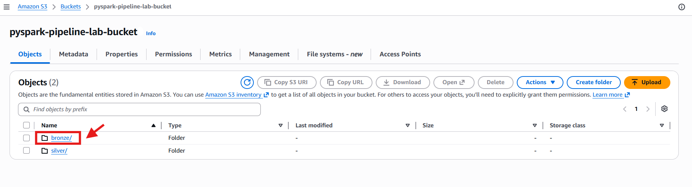
3. Click **Upload** → **Add files**.
4. Select both `snapshot_v1.json` and `snapshot_v2.json` from your Desktop.
5. Click **Upload**.
   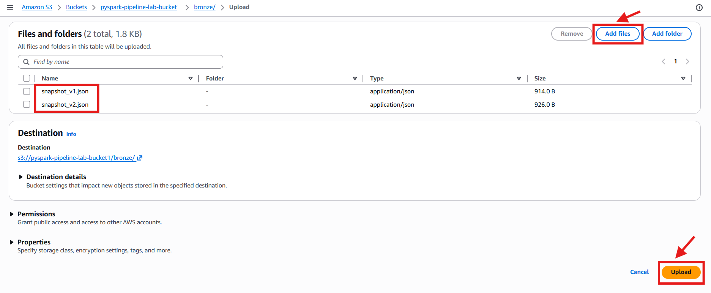
6. Confirm both files are listed under `bronze/`.

---

# Activity 2: Create IAM Role for AWS Glue

Before launching the Glue Notebook, you need to create an IAM role that gives Glue permission to access S3 and start interactive sessions.

## Step 2.1 — Create the IAM Role

1. In the AWS Management Console search bar, type **IAM** and select it.
2. In the left navigation panel, click **Roles**.
3. Click **Create role**.
   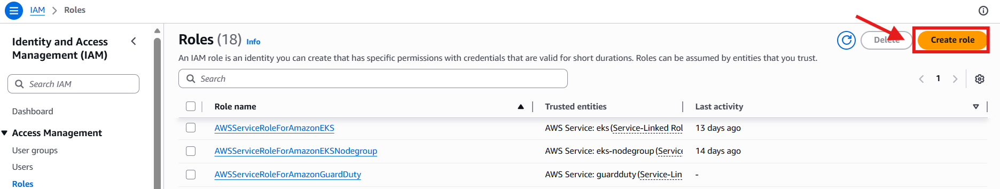
4. Under **Trusted entity type**, select **AWS service**.
5. In the **Use case** search box, search for and select **Glue**.
   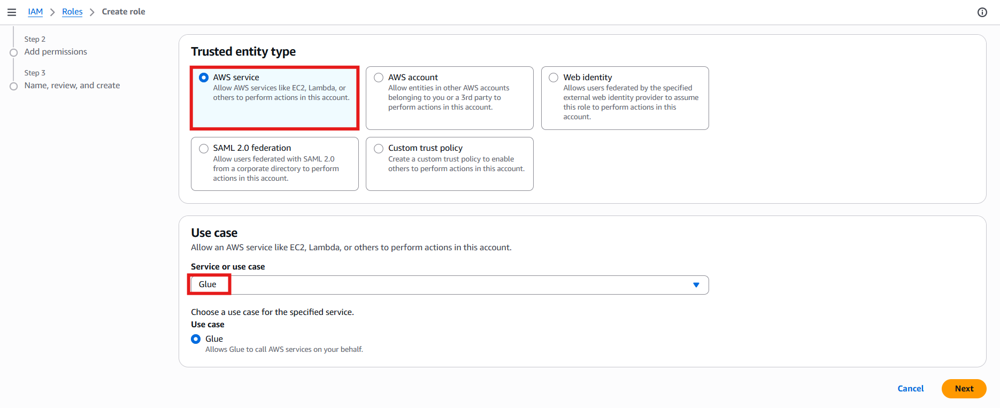
6. Click **Next**.

---

## Step 2.2 — Attach Permissions Policies

In the **Add permissions** search box, search for and attach the following two policies one by one:

| Policy Name | Purpose |
|---|---|
| `AWSGlueServiceRole` | Grants Glue permission to manage ETL jobs and sessions |
| `AmazonS3FullAccess` | Grants Glue full access to read and write S3 buckets |

For each policy: type the name in the search box → check the checkbox → continue to the next one.

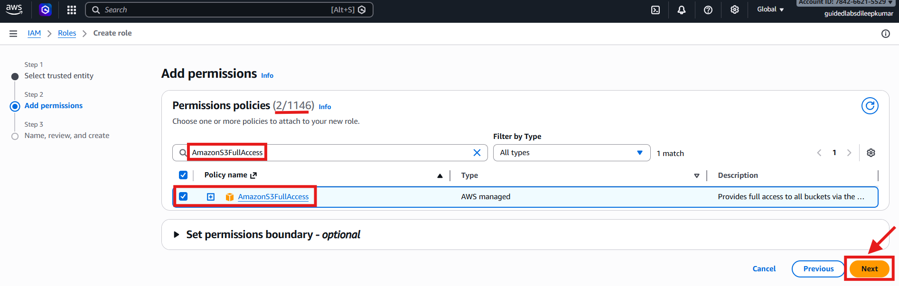

Click **Next** after both policies are selected.

---

## Step 2.3 — Name and Create the Role

1. In the **Role name** field, enter: `AWSGlueServiceRole-lab`
2. Scroll down and click **Create role**.
   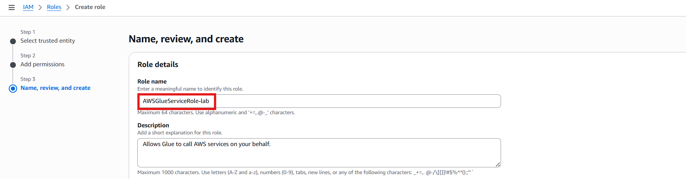
   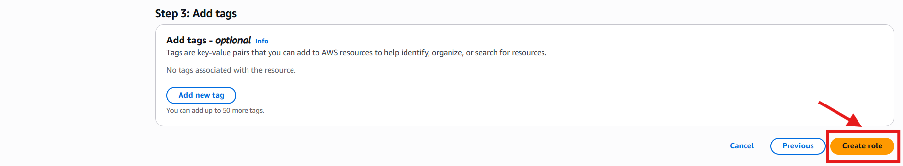
3. You will see a green confirmation banner: **Role AWSGlueServiceRole-lab created**.

---

## Step 2.4 — Add Inline Policy for `iam:PassRole`

The Glue interactive session also requires permission to pass this role to itself. This requires an additional inline policy.

1. In the IAM Console, go to **Roles** → click on **`AWSGlueServiceRole-lab`**.
2. Click **Add permissions** → **Create inline policy**.
   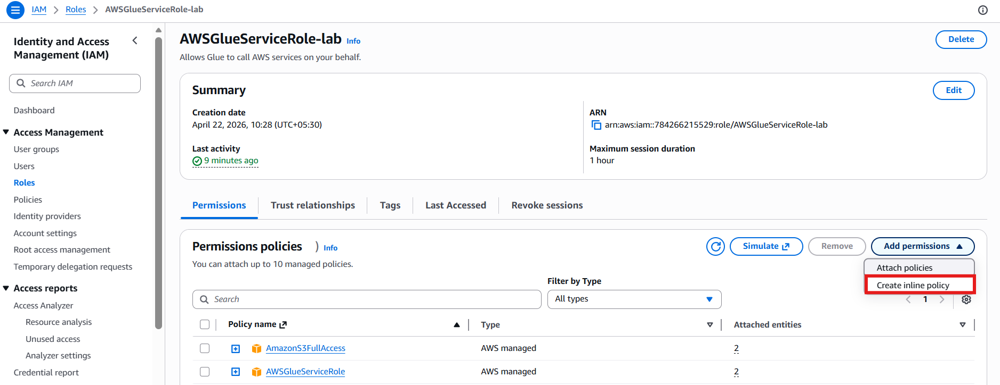
3. Click the **JSON** tab and replace the existing content with:

```json
{
  "Version": "2012-10-17",
  "Statement": [
    {
      "Effect": "Allow",
      "Action": "iam:PassRole",
      "Resource": "arn:aws:iam::<YOUR_ACCOUNT_ID>:role/AWSGlueServiceRole-lab"
    }
  ]
}
```

> ⚠️ Replace `<YOUR_ACCOUNT_ID>` with your 12-digit AWS Account ID. You can find it in the top-right corner of the AWS Console next to your username.

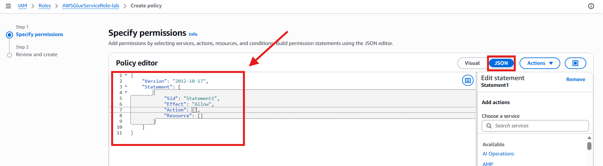

4. Click **Next**.
5. In the **Policy name** field, enter: `GluePassRolePolicy`
6. Click **Create policy**.
   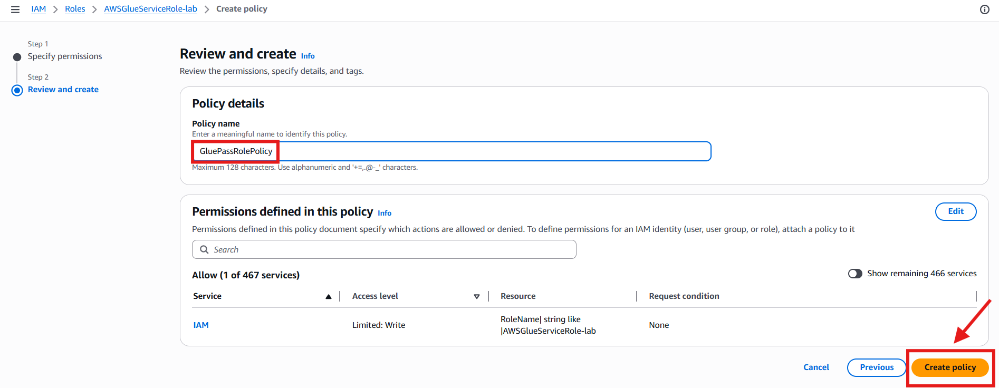
7. Confirm the role now shows **3 policies** attached:

| Policy Name | Type |
|---|---|
| `AmazonS3FullAccess` | AWS managed |
| `AWSGlueServiceRole` | AWS managed |
| `GluePassRolePolicy` | Customer inline |

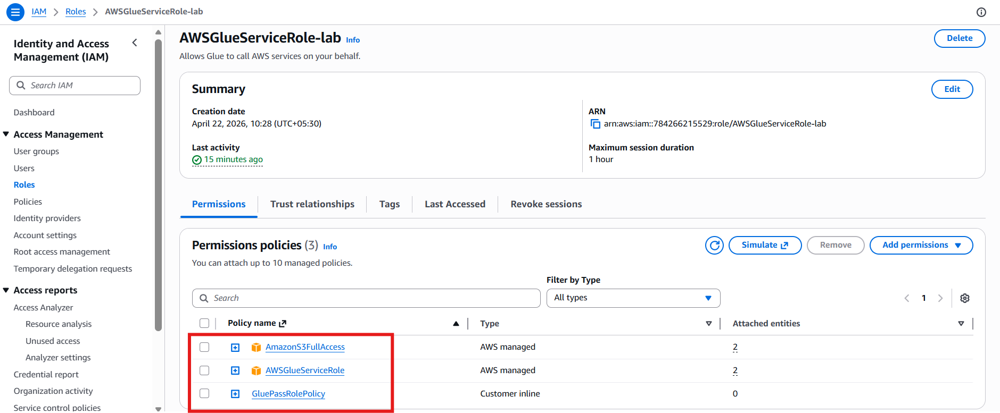

---

# Activity 3: Launch AWS Glue Notebook

## Step 3.1 — Open AWS Glue Studio

1. In the AWS Management Console search bar, type **AWS Glue** and select it.
   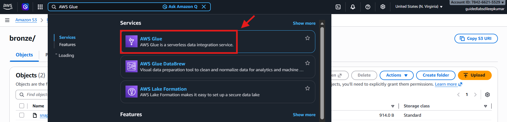
2. In the left navigation panel, click **Notebooks** under the **ETL Jobs** section.
   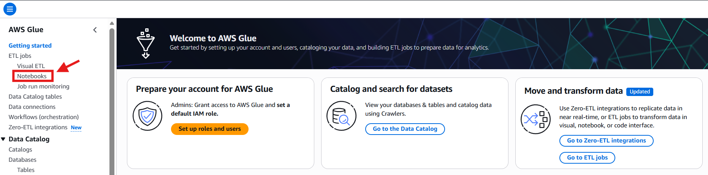

---

## Step 3.2 — Create a New Notebook

1. Click the **Notebook** button under the **Create job** section.
   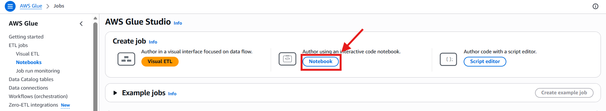
2. Keep **Start fresh** selected.
3. Click the **IAM role** dropdown and select **`AWSGlueServiceRole-lab`**.
   - _If the role does not appear, click the 🔄 refresh icon next to the dropdown._
   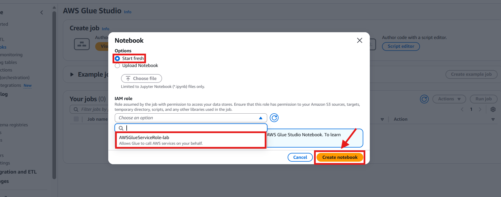
4. Click **Create notebook**.

> ⚠️ The notebook will open and show default example cells. The kernel status at the top right will show ⚪ (not ready) initially.

---

## Step 3.3 — Start the Interactive Session

The notebook opens with a pre-filled session setup cell. This initialises the Glue/Spark session and sets worker configuration.

💡 **What this code does:**
- `%idle_timeout` — stops the session after 2880 minutes of inactivity to avoid charges.
- `%glue_version 5.0` — specifies the Glue runtime version.
- `%worker_type G.1X` and `%number_of_workers 5` — defines the compute resources for the session.
- The `import` statements load the core Glue and Spark libraries needed for the entire lab.

**⚡ How to run the code:**
Click the cell to select it, then click the **▶ Run** button or press **Shift + Enter**.

```python
%idle_timeout 2880
%glue_version 5.0
%worker_type G.1X
%number_of_workers 5

import sys
from awsglue.transforms import *
from awsglue.utils import getResolvedOptions
from pyspark.context import SparkContext
from awsglue.context import GlueContext
from awsglue.job import Job
```

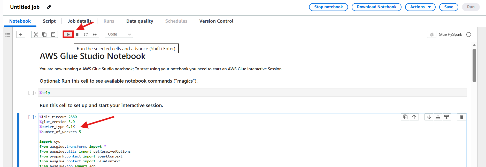

Wait **1–2 minutes** — the output will confirm the session is ready:

```
Trying to create a Glue session for the kernel.
Session Type: glueetl
Worker Type: G.1X
Number of Workers: 5
Waiting for session <session-id> to get into ready status...
Session <session-id> has been created.
```

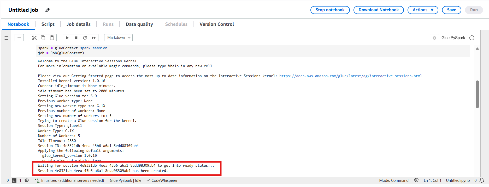

The status bar at the bottom will change to **`Glue PySpark | Idle`** confirming the session is ready.

> 💡 The `spark` session is now available globally in all subsequent cells — you do not need to initialise it manually.

---

# Activity 4: PySpark Bronze-to-Silver Pipeline

All code cells from this point onwards are run inside the **AWS Glue Notebook**. Click **`+ Code`** in the notebook toolbar to add each new code cell.

---

## Step 4.1 — Set Bucket Variable

💡 **What this code does:**
- `BUCKET_NAME` stores your unique bucket name so every subsequent cell can reference it without hardcoding.
- `BRONZE_V1` and `BRONZE_V2` define the full S3 paths for your two snapshot files.
- `SILVER_PATH` and `CDC_PATH` define where the cleaned and CDC outputs will be written.
- Setting all paths in one cell makes it easy to update them if your bucket name changes.

**⚡ How to run the code:**
Click **`+ Code`** in the AWS Glue Notebook toolbar to add a new cell. Edit `<USER_INPUT>` to match the identifier you used when creating the bucket, then click the ▶ Run button or press Shift + Enter.

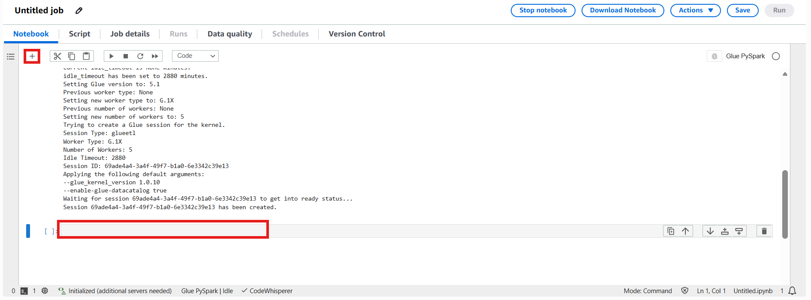

```python
# ============================================================
# TODO: Replace <USER_INPUT> with your unique identifier
# Example: BUCKET_NAME = "pyspark-pipeline-lab-bucket"
# ============================================================
BUCKET_NAME = "pyspark-pipeline-lab-<USER_INPUT>"   # <-- EDIT THIS

BRONZE_V1   = f"s3://{BUCKET_NAME}/bronze/snapshot_v1.json"
BRONZE_V2   = f"s3://{BUCKET_NAME}/bronze/snapshot_v2.json"
SILVER_PATH = f"s3://{BUCKET_NAME}/silver/employees_clean/"
CDC_PATH    = f"s3://{BUCKET_NAME}/silver/cdc_output/"

print(f"✅ Bucket configured: {BUCKET_NAME}")
```

**Expected Output:**
```
✅ Bucket configured: pyspark-pipeline-lab-<USER_INPUT>
```

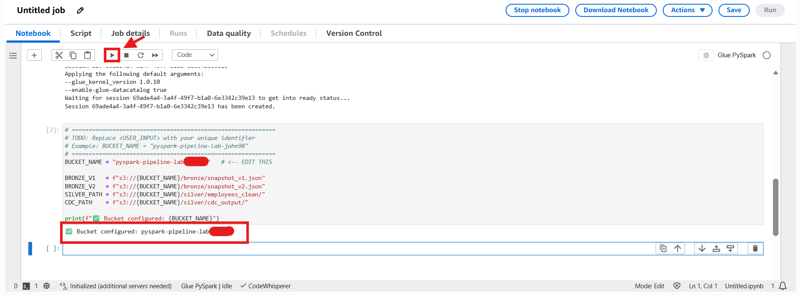

---

## Step 4.2 — Read Raw JSON with Explicit Schema

💡 **What this code does:**
- `StructType` and `StructField` define each column's name, data type, and nullability — this is the explicit schema.
- Applying a schema on `spark.read.schema(schema).json(...)` avoids PySpark's automatic type inference, which can be slow and produce incorrect types on messy data.
- `printSchema()` displays the applied column types.
- `show()` prints the first 20 rows so you can visually inspect the raw data before any cleaning.

**⚡ How to run the code:**
Click **`+ Code`** in the AWS Glue Notebook toolbar to add a new cell, paste the code below, and then click the ▶ Run button or press Shift + Enter.


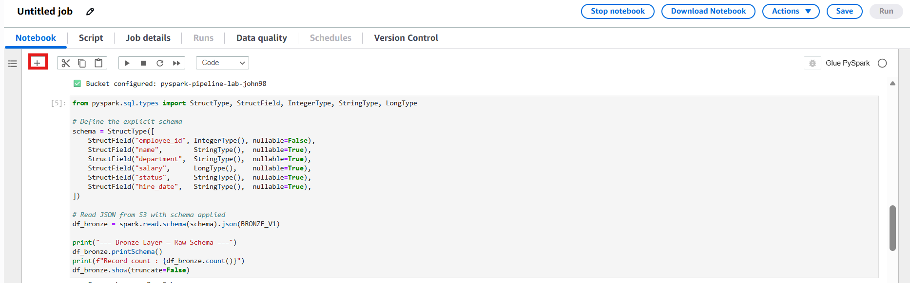

```python
from pyspark.sql.types import StructType, StructField, IntegerType, StringType, LongType

# Define the explicit schema
schema = StructType([
    StructField("employee_id", IntegerType(), nullable=False),
    StructField("name", StringType(), nullable=True),
    StructField("department", StringType(), nullable=True),
    StructField("salary", LongType(), nullable=True),
    StructField("status", StringType(), nullable=True),
    StructField("hire_date", StringType(), nullable=True),
])

# Read JSON from S3 with schema applied
df_bronze = spark.read.schema(schema).json(BRONZE_V1)

print("=== Bronze Layer — Raw Schema ===")
df_bronze.printSchema()
print(f"Record count : {df_bronze.count()}")
df_bronze.show(truncate=False)
```
### Expected Observations:

- Record count is 7 (including 1 duplicate).
- `salary` contains NULL values.
- Duplicate exists for `employee_id = 2`.
- `name` has leading/trailing whitespace in some records.
- `department` and `status` show inconsistent casing.
- `hire_date` contains an invalid value (`invalid-date`).
- `name` is NULL for one record.

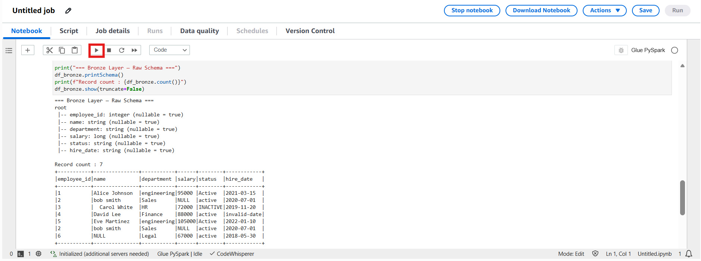

---

## Step 4.3 — Data Profiling

💡 **What this code does:**
- The `count(when(col(c).isNull(), c))` pattern counts `NULL` values in every column in one pass — much faster than looping.
- `dropDuplicates()` followed by a count difference reveals how many fully duplicate rows exist.
- Calling `.distinct().show()` on `department` and `status` exposes casing inconsistencies that would be missed by a simple count.

**⚡ How to run the code:**
Click **`+ Code`** in the AWS Glue Notebook toolbar to add a new cell, paste the code below, and then click the ▶ Run button or press Shift + Enter.


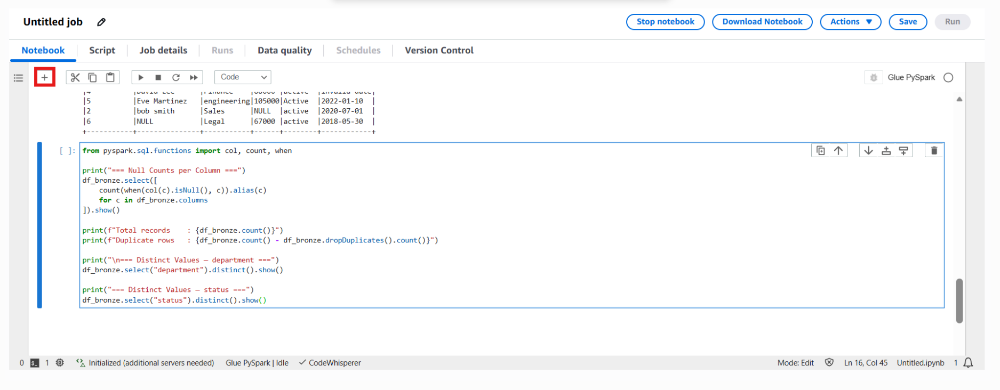

```python
from pyspark.sql.functions import col, count, when

print("=== Null Counts per Column ===")

null_counts = df_bronze.select(
    [count(when(col(c).isNull(), c)).alias(c) for c in df_bronze.columns]
)

null_counts.show()

print(f"Total records    : {df_bronze.count()}")
print(f"Duplicate rows   : {df_bronze.count() - df_bronze.dropDuplicates().count()}")

print("\n=== Distinct Values — department ===")
df_bronze.select("department").distinct().show()

print("=== Distinct Values — status ===")
df_bronze.select("status").distinct().show()
```

### Expected Observations:

- Total records: 7, with 1 duplicate row (`employee_id = 2`).
- `name` has 1 NULL, `salary` has 2 NULLs.
- Duplicate exists for `employee_id = 2`.
- `name` has leading/trailing whitespace in some records.
- `department` shows mixed casing (e.g., `engineering`, `Sales`, `HR`).
- `status` shows mixed casing (e.g., `Active`, `active`, `INACTIVE`).
- `hire_date` contains an invalid value (`invalid-date`).

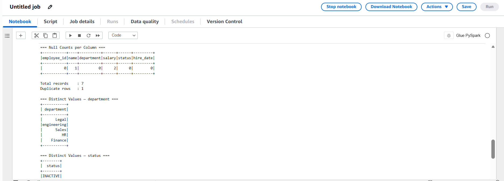


---

## Step 4.4 — Apply Cleaning Transformations

💡 **What this code does:**
- **Part A — Deduplicate & standardise:** `dropDuplicates()` removes fully identical rows. `trim()` removes whitespace, `initcap()` capitalises department names, `lower()` lowercases status values.
- **Part B — Fill nulls:** `when().otherwise()` replaces NULL names with `"Unknown"`. `percentile_approx()` computes the approximate median salary to fill missing salary values — a common imputation strategy.
- **Part C — Parse dates:** `to_date()` converts the string column to `DateType`. Values that cannot be parsed (like `"invalid-date"`) become `NULL`, which are then replaced with the sentinel date `1900-01-01`.

**⚡ How to run the code:**
Click **`+ Code`** in the AWS Glue Notebook toolbar to add a new cell for each part below, and then click the ▶ Run button or press Shift + Enter.

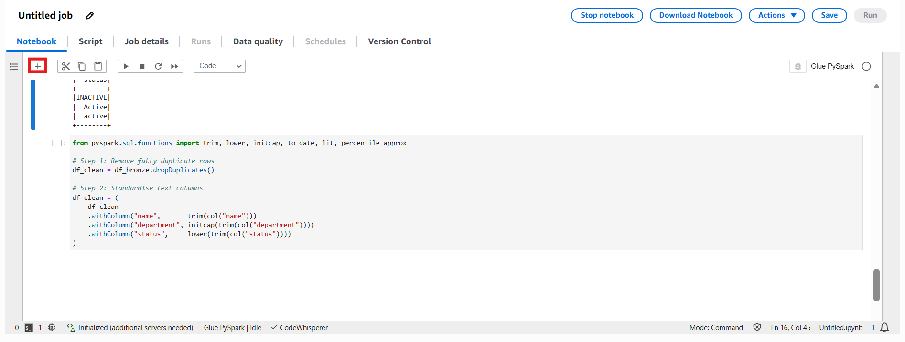

**Part A — Deduplicate and standardise text columns:**

```python
from pyspark.sql.functions import trim, lower, initcap, col

# Step 1: Remove fully duplicate rows
df_clean = df_bronze.dropDuplicates()

# Step 2: Standardise text columns
df_clean = (
    df_clean
    .withColumn("name", trim(col("name")))
    .withColumn("department", initcap(trim(col("department"))))
    .withColumn("status", lower(trim(col("status"))))
)

df_clean.show()
```
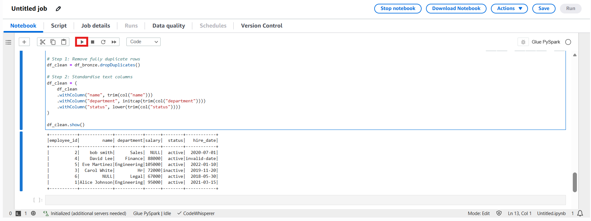


**Part B — Fill null names and impute missing salary:**

```python
from pyspark.sql.functions import when, col, lit, percentile_approx

# Step 3: Replace null names
df_clean = df_clean.withColumn(
    "name",
    when(col("name").isNull(), lit("Unknown")).otherwise(col("name"))
)

# Step 4: Fill null salary with median
salary_median = df_clean.select(
    percentile_approx("salary", 0.5).alias("median")
).collect()[0]["median"]

df_clean = df_clean.withColumn(
    "salary",
    when(col("salary").isNull(), lit(salary_median)).otherwise(col("salary"))
)

df_clean.show()
```

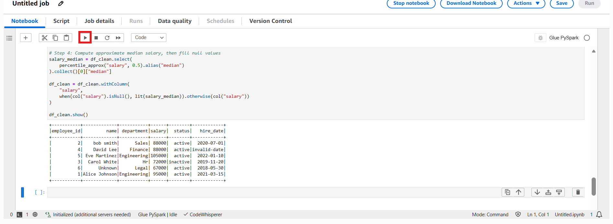


**Part C — Parse and fix hire_date:**

```python
from pyspark.sql.functions import to_date, when, col, lit

# Step 5: Parse hire_date
df_clean = df_clean.withColumn(
    "hire_date", to_date(col("hire_date"), "yyyy-MM-dd")
)

# Step 6: Replace invalid/null dates
df_clean = df_clean.withColumn(
    "hire_date",
    when(col("hire_date").isNull(), to_date(lit("1900-01-01"), "yyyy-MM-dd"))
    .otherwise(col("hire_date"))
)

print("✅ Cleaning complete")
df_clean.printSchema()
df_clean.show(truncate=False)
```
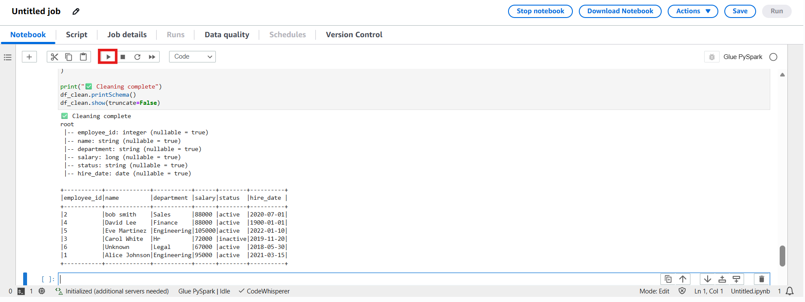

---

## Step 4.5 — Post-Cleaning Validation

💡 **What this code does:**
- This cell is a **validation checkpoint** — it confirms all cleaning steps produced the expected results before writing to S3.
- Null counts confirm no columns still have missing values.
- Duplicate count confirms deduplication was successful.
- Distinct status values confirm casing standardisation worked.
- Salary range confirms imputation didn't produce unreasonable values.
- `hire_date` dtype confirms the column was successfully cast to `DateType`.

**⚡ How to run the code:**
Click **`+ Code`** in the AWS Glue Notebook toolbar to add a new cell, paste the code below, and press **Shift + Enter**.

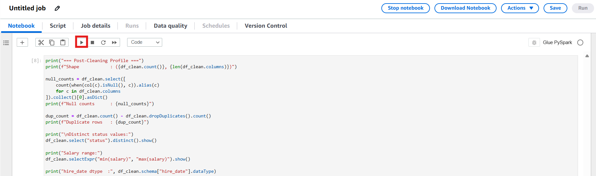

```python
print("=== Post-Cleaning Profile ===")
print(f"Shape            : ({df_clean.count()}, {len(df_clean.columns)})")

null_counts = df_clean.select([
    count(when(col(c).isNull(), c)).alias(c)
    for c in df_clean.columns
]).collect()[0].asDict()
print(f"Null counts      : {null_counts}")

dup_count = df_clean.count() - df_clean.dropDuplicates().count()
print(f"Duplicate rows   : {dup_count}")

print("\nDistinct status values:")
df_clean.select("status").distinct().show()

print("Salary range:")
df_clean.selectExpr("min(salary)", "max(salary)").show()

print("hire_date dtype  :", df_clean.schema["hire_date"].dataType)
```

**Expected Output:**
```
Shape : (6, 6)

Null counts : {'employee_id': 0, 'name': 0, 'department': 0, 'salary': 0, 'status': 0, 'hire_date': 0}
Duplicate rows: 0

Distinct status values:
+--------+
| status |
+--------+
| active |
|inactive|
+--------+

Salary range:
+-----------+-----------+
|min(salary)|max(salary)|
+-----------+-----------+
|   67000   |  105000   |
+-----------+-----------+

hire_date dtype : DateType()
```

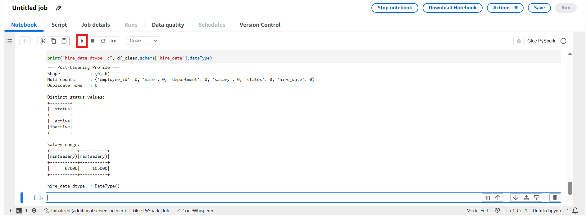

---

## Step 4.6 — Write Partitioned Parquet to S3 (Silver Layer)

💡 **What this code does:**
- `partitionBy("department")` instructs Spark to write a separate folder for each distinct department value (e.g., `department=Engineering/`).
- Partitioning allows query engines like **Athena** and **Spark SQL** to skip irrelevant partitions entirely — a technique called **partition pruning** — dramatically reducing scan costs.
- `.mode("overwrite")` replaces any existing output at `SILVER_PATH` so re-runs are idempotent.

**⚡ How to run the code:**
Click **`+ Code`** in the AWS Glue Notebook toolbar to add a new cell, paste the code below, and press **Shift + Enter**.

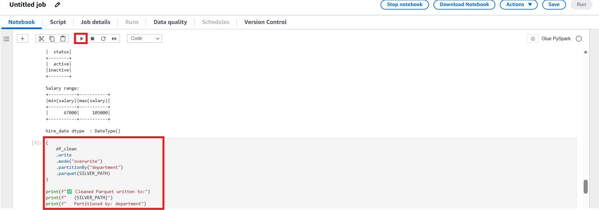

```python
(
    df_clean
    .write
    .mode("overwrite")
    .partitionBy("department")
    .parquet(SILVER_PATH)
)

print(f"✅ Cleaned Parquet written to:")
print(f"   {SILVER_PATH}")
print(f"   Partitioned by: department")
```

### Expected Observations

- Data is written to S3 in Parquet format, partitioned by `department` (e.g., `department=Engineering/`).
- Each partition folder contains one or more `.parquet` files.

> 💡 Note: You will verify these outputs in the final step after completing the entire pipeline.

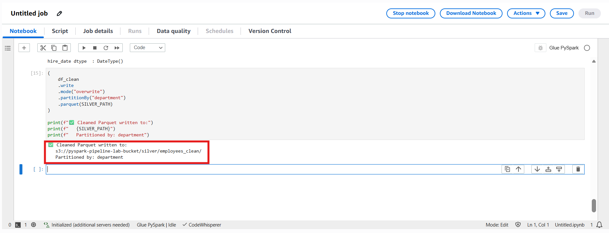

---

# Activity 5: CDC — Snapshot Comparison and MERGE Simulation

## Overview

Change Data Capture (CDC) is the process of identifying what changed between two states of data. Here, you will compare `snapshot_v1.json` (Day 1) against `snapshot_v2.json` (Day 2) and classify each record as `new`, `updated`, or `unchanged`.

---

## Step 5.1 — Load Both Snapshots

💡 **What this code does:**
- Reads both snapshot files using the same `schema` defined in Step 4.2.
- `dropDuplicates()` is applied on load to ensure the comparison is based on clean data.
- Printing the count for each snapshot confirms V2 has one additional record (the new hire).

**⚡ How to run the code:**
Click **`+ Code`** in the AWS Glue Notebook toolbar to add a new cell, paste the code below, and then click the ▶ Run button or press Shift + Enter.


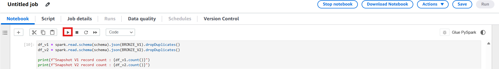

```python
df_v1 = spark.read.schema(schema).json(BRONZE_V1).dropDuplicates()
df_v2 = spark.read.schema(schema).json(BRONZE_V2).dropDuplicates()

print(f"Snapshot V1 record count : {df_v1.count()}")
print(f"Snapshot V2 record count : {df_v2.count()}")
```

**Expected Output:**
```
Snapshot V1 record count : 6
Snapshot V2 record count : 7
```

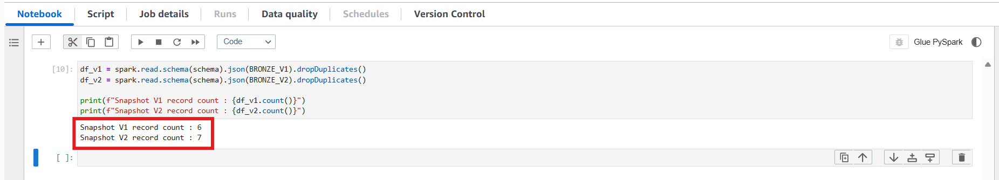

---

## Step 5.2 — Implement CDC Classification Logic

💡 **What this code does:**
- **Row hashing** — `md5(concat_ws(...))` generates a compact fingerprint of all non-key columns. If any field changes between V1 and V2 for the same `employee_id`, the hash will differ.
- **Left join** — joining V2 (new) against V1 (old) on `employee_id` means records in V2 with no match in V1 appear with `NULL` on the V1 side → these are `new` records.
- **Classification:** `v1.employee_id IS NULL` → `"new"` | `row_hash differs` → `"updated"` | otherwise → `"unchanged"`.

**⚡ How to run the code:**
Click **`+ Code`** in the AWS Glue Notebook toolbar to add a new cell for each part below, and then click the ▶ Run button or press Shift + Enter.


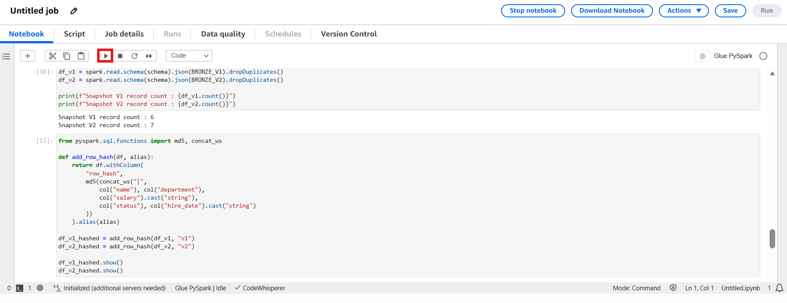

**Part A — Generate row hashes for both snapshots:**

```python
from pyspark.sql.functions import md5, concat_ws

def add_row_hash(df, alias):
    return df.withColumn(
        "row_hash",
        md5(concat_ws("|",
            col("name"), col("department"),
            col("salary").cast("string"),
            col("status"), col("hire_date").cast("string")
        ))
    ).alias(alias)

df_v1_hashed = add_row_hash(df_v1, "v1")
df_v2_hashed = add_row_hash(df_v2, "v2")

df_v1_hashed.show()
df_v2_hashed.show()
```
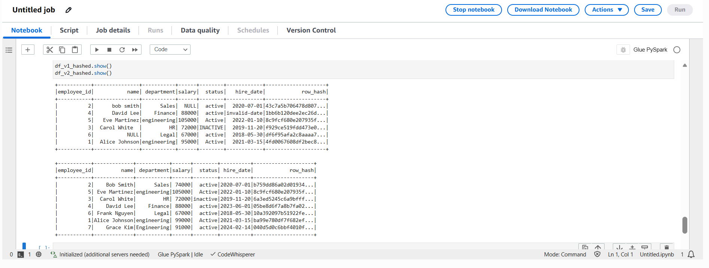


**Part B — Join V2 against V1 and classify each record:**

```python
# Left join V2 (new snapshot) against V1 (old snapshot) on employee_id
df_joined = df_v2_hashed.join(
    df_v1_hashed,
    on=col("v2.employee_id") == col("v1.employee_id"),
    how="left"
)

# Classify each record based on join result and hash comparison
df_cdc = df_joined.select(
    col("v2.employee_id"),
    col("v2.name"),
    col("v2.department"),
    col("v2.salary"),
    col("v2.status"),
    col("v2.hire_date"),
    when(col("v1.employee_id").isNull(), lit("new"))
    .when(col("v2.row_hash") != col("v1.row_hash"), lit("updated"))
    .otherwise(lit("unchanged"))
    .alias("cdc_status")
)

print("=== CDC Classification Result ===")
df_cdc.show(truncate=False)
```

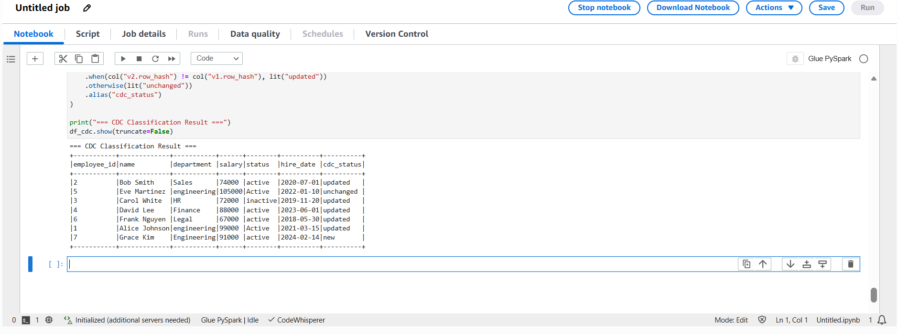

**Expected Observations:**
- Records are classified as updated, unchanged, or new.
- Changes in data result in updated status.
- No change results in unchanged status.
- New entries are marked as new.
- Some records may be excluded due to processing logic.

---

## Step 5.3 — Write CDC Output to S3

💡 **What this code does:**
- Writes the CDC-classified DataFrame to S3 in Parquet format, partitioned by `cdc_status`.
- This creates three partition folders: `cdc_status=new/`, `cdc_status=updated/`, `cdc_status=unchanged/`.
- The final `groupBy` summary confirms the count of records in each category.

**⚡ How to run the code:**
Click **`+ Code`** in the AWS Glue Notebook toolbar to add a new cell, paste the code below, and then click the ▶ Run button or press Shift + Enter.

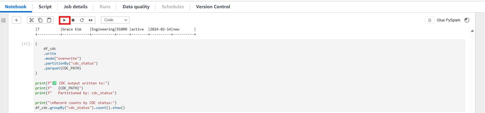

```python
(
    df_cdc
    .write
    .mode("overwrite")
    .partitionBy("cdc_status")
    .parquet(CDC_PATH)
)

print(f"✅ CDC output written to:")
print(f"   {CDC_PATH}")
print(f"   Partitioned by: cdc_status")

print("\nRecord counts by CDC status:")
df_cdc.groupBy("cdc_status").count().show()
```

**Expected Output:**
```
CDC output written to:
s3://pyspark-pipeline-lab-<USER_INPUT>/silver/cdc_output/
Partitioned by: cdc_status

+-----------+-----+
|cdc_status |count|
+-----------+-----+
| updated   |  5  |
| new       |  1  |
| unchanged |  1  |
+-----------+-----+
```

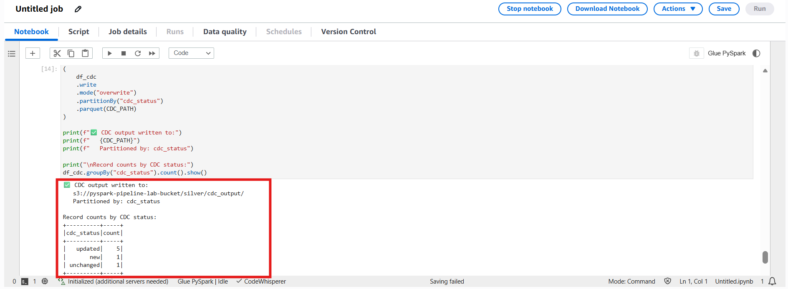

---
# Activity 6: Read Back and Spot-Check

💡 **What this code does:**
- Reads the Silver and CDC Parquet outputs back into new DataFrames to confirm the data round-trips correctly.
- Verifies that schemas, row counts, partition columns, and CDC labels are all intact after the write-read cycle.
- This is a critical production practice: always verify your pipeline output is readable and matches expected shape before signalling success.

**⚡ How to run the code:**
Click **`+ Code`** in the AWS Glue Notebook toolbar to add a new cell for each part below, and then click the ▶ Run button or press Shift + Enter. after each one.

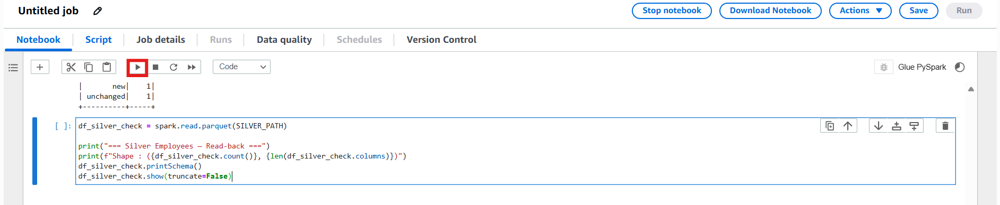

**Part A — Read back cleaned Silver employees:**

```python
df_silver_check = spark.read.parquet(SILVER_PATH)

print("=== Silver Employees — Read-back ===")
print(f"Shape : ({df_silver_check.count()}, {len(df_silver_check.columns)})")
df_silver_check.printSchema()
df_silver_check.show(truncate=False)
```
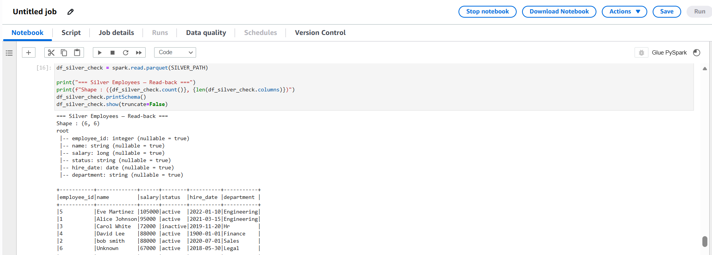


**Part B — Read back CDC output and verify classification counts:**

```python
df_cdc_check = spark.read.parquet(CDC_PATH)

print("=== CDC Output — Read-back ===")
df_cdc_check.groupBy("cdc_status").count().show()
df_cdc_check.show(truncate=False)
```
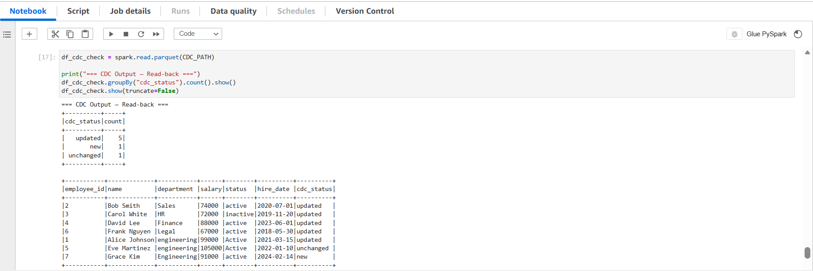

---

# Activity 7: Verify S3 Output via AWS Console

After completing all notebook steps and saving your work, verify that outputs are correctly written to S3.

## Step 7.1 — Save and Name the Notebook

1. Click **Save** in the AWS Glue Notebook.
2. Rename the job to: pyspark-pipeline-lab
 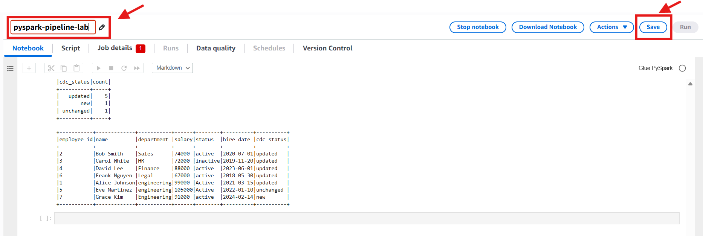

## Step 7.2 — Verify Silver Layer Output

1. Return to the **AWS Management Console** → navigate to **S3**.
2. Click on your bucket: `pyspark-pipeline-lab-<USER_INPUT>`.
3. Open the `silver/` folder and confirm:
   - `employees_clean/` contains partition folders by `department`.
   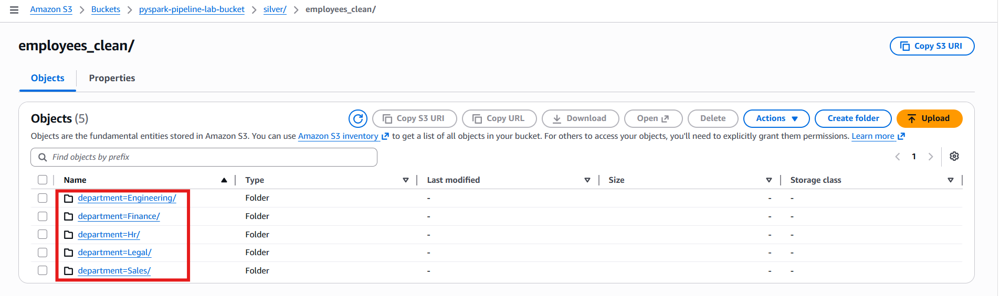
   - `cdc_output/` contains partition folders: `cdc_status=new/`, `cdc_status=updated/`, `cdc_status=unchanged/`.
   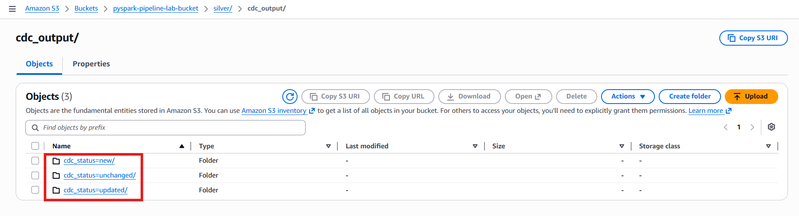
4. Click any `.parquet` file → open the **Properties** tab and observe the file size.
   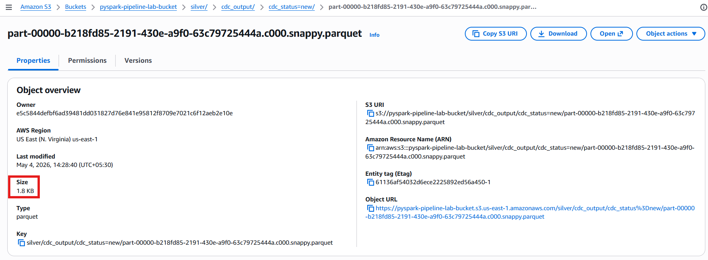

> 💡 Parquet files are significantly smaller than JSON files due to columnar storage and compression, improving both query performance and storage costs.

### Expected Observations:

- Partition folders are created for each distinct `department` value under `employees_clean/` (e.g., `department=Engineering/`).
- CDC output is partitioned by `cdc_status` with folders: `cdc_status=new/`, `cdc_status=updated/`, and `cdc_status=unchanged/`.
- Parquet files are smaller than the equivalent JSON input due to columnar storage and compression.
---

# ✅ Final Deliverables

- [ ] S3 bucket created with `bronze/` and `silver/` folders
- [ ] `snapshot_v1.json` and `snapshot_v2.json` uploaded to `s3://your-bucket/bronze/` via AWS Console
- [ ] IAM role `AWSGlueServiceRole-lab` created with `AWSGlueServiceRole`, `AmazonS3FullAccess`, and `GluePassRolePolicy`
- [ ] AWS Glue Notebook launched and session confirmed as Ready (`Glue PySpark | Idle`)
- [ ] Bucket variable set and S3 paths confirmed
- [ ] Raw JSON read with explicit schema — schema printed and record count verified
- [ ] Data profiling completed — null counts, duplicates, and casing issues identified
- [ ] All cleaning transformations applied — deduplication, trimming, standardisation, null fill, date parsing
- [ ] Post-cleaning validation passes — zero nulls, zero duplicates, correct dtypes
- [ ] Cleaned DataFrame written as partitioned Parquet to `s3://your-bucket/silver/employees_clean/`
- [ ] Both snapshots loaded for CDC comparison
- [ ] Row hash generated and join-based CDC classification implemented
- [ ] Records correctly labelled as `new`, `updated`, or `unchanged`
- [ ] CDC output written to `s3://your-bucket/silver/cdc_output/`
- [ ] All S3 outputs verified via AWS Console
- [ ] Read-back verification confirms correct shape, dtypes, and CDC labels

---

# 📚 Key Concepts Recap

| Concept | What You Did |
|---|---|
| **Bronze → Silver** | Read raw JSON from S3, cleaned and typed the data, wrote Parquet back to S3 — a production medallion pipeline step |
| **AWS Glue Notebook** | Used a fully managed PySpark environment — no local Java or Spark setup required; S3 access via IAM role |
| **IAM Role** | Created `AWSGlueServiceRole-lab` with S3 access and `iam:PassRole` permission for Glue interactive sessions |
| **Explicit Schema** | Applied `StructType` schema on read to avoid inference overhead and enforce types consistently |
| **PySpark Transformations** | Used `dropDuplicates`, `withColumn`, `trim`, `lower`, `initcap`, `to_date` to clean the Bronze layer |
| **Partitioned Parquet** | Wrote Silver output partitioned by `department` — enables partition pruning in Athena and Spark SQL |
| **Row Hashing** | Generated `md5` hash of non-key columns to detect row-level changes between snapshots without field-by-field comparison |
| **CDC MERGE Simulation** | Left-joined V2 against V1 on `employee_id`; classified `new`, `updated`, and `unchanged` using `when` logic |
| **Lazy Evaluation** | Transformations build a DAG; no computation occurs until an action (`count`, `show`, `write`) is called |

---

# 🔧 Transformation Summary

| Issue Found | Column | Fix Applied |
|---|---|---|
| Duplicate rows | All columns | `dropDuplicates()` |
| Leading/trailing whitespace | `name` | `trim(col("name"))` |
| Inconsistent casing | `department` | `initcap(trim(col("department")))` |
| Inconsistent casing | `status` | `lower(trim(col("status")))` |
| Null names | `name` | Filled with `"Unknown"` using `when().otherwise()` |
| Null salary | `salary` | Filled with approximate median via `percentile_approx` |
| Invalid / missing dates | `hire_date` | `to_date()` with errors coerced + sentinel `1900-01-01` fill |
| String date column | `hire_date` | Cast to `DateType` via `to_date()` |

---

# 🔄 CDC Classification Summary

| Record State | Detection Logic | cdc_status |
|---|---|---|
| Present in V2 but not in V1 | `v1.employee_id IS NULL` after left join | `new` |
| Present in both, row hash differs | `v2.row_hash != v1.row_hash` | `updated` |
| Present in both, row hash matches | All other records | `unchanged` |

---

# 📖 Additional Resources

- [PySpark DataFrame API](https://spark.apache.org/docs/latest/api/python/reference/pyspark.sql/dataframe.html)
- [PySpark SQL Functions](https://spark.apache.org/docs/latest/api/python/reference/pyspark.sql/functions.html)
- [AWS Glue Notebooks — Getting Started](https://docs.aws.amazon.com/glue/latest/dg/notebook-getting-started.html)
- [AWS Glue — Reading from S3](https://docs.aws.amazon.com/glue/latest/dg/aws-glue-programming-etl-connect-s3-home.html)
- [Medallion Architecture — Databricks](https://www.databricks.com/glossary/medallion-architecture)
- [Change Data Capture Patterns](https://docs.aws.amazon.com/dms/latest/userguide/CHAP_Task.CDC.html)
- [Apache Parquet Format](https://parquet.apache.org/docs/)